<!-- pdf2md: post-processed -->


## Compute Express Link TM  (CXL TM )

## Specification

October 2020 Revision 2.0

## LEGAL NOTICE FOR THIS PUBLICLY-AVAILABLE SPECIFICATION FROM COMPUTE EXPRESS LINK CONSORTIUM, INC.

## © 2019-2020 COMPUTE EXPRESS LINK CONSORTIUM, INC. ALL RIGHTS RESERVED.

This CXL Specification Revision 1.1 (this ' CXL Specification ' or this ' document ') is owned by and is proprietary to Compute Express Link Consortium, Inc., a Delaware nonprofit corporation  (sometimes referred to as ' CXL ' or  the  ' CXL Consortium ' or the ' Company ') and/or its successors and assigns.

## NOTICE TO USERS WHO ARE MEMBERS OF THE CXL CONSORTIUM :

If you are a Member of the CXL Consortium (sometimes referred to as a ' CXL Member '), and even if you have received this publicly-available version of this CXL Specification after agreeing to CXL Consortium's Evaluation Copy Agreement  (a copy of which is available https://www.computeexpresslink.org/download-the-specification, each such CXL Member must also be in compliance with all of the following CXL Consortium documents, policies and/or procedures (collectively, the ' CXL Governing Documents ') in order for such CXL Member's use and/or implementation of this CXL Specification to receive and enjoy all of the rights, benefits, privileges and protections of CXL Consortium membership: (i) CXL Consortium's Intellectual Property Policy; (ii) CXL Consortium's Bylaws; (iii) any and all other CXL Consortium policies and procedures; and (iv) the CXL Member's Participation Agreement.

## NOTICE TO NON-MEMBERS OF THE CXL CONSORTIUM :

If you are not a CXL Member and have received this publicly-available version of this CXL Specification, your use of this document is subject to your compliance with, and is limited by, all of the terms and conditions of the CXL Consortium's Evaluation Copy Agreement (a copy of which is available at https://www.computeexpresslink.org/download-the-specification ).

In addition to the restrictions set forth in the CXL Consortium's Evaluation Copy Agreement, any references or citations to this document must acknowledge the Compute Express Link Consortium, Inc.'s sole and exclusive copyright ownership of this CXL Specification. The proper copyright citation or reference is as follows: '© 2019-2020 COMPUTE EXPRESS LINK CONSORTIUM, INC. ALL RIGHTS RESERVED.' When making any such citation or reference to this document you are not permitted to revise, alter, modify, make any derivatives of, or otherwise amend the referenced portion of this document in any way without the prior express written permission of the Compute Express Link Consortium, Inc.

Except for the limited rights explicitly given to a non-CXL Member pursuant to the explicit provisions of the CXL Consortium's Evaluation Copy Agreement which governs the publicly-available version of this CXL Specification, nothing contained in this CXL Specification shall be deemed as granting (either expressly or impliedly) to any party that is not a CXL Member: (ii) any kind of license to implement or use this CXL Specification or any portion or content described or contained therein, or any kind of license in or to any other intellectual property owned or controlled by the CXL Consortium, including without limitation any trademarks of the CXL Consortium.; or (ii) any benefits and/or rights as a CXL Member under any CXL Governing Documents.

## LEGAL DISCLAIMERS FOR ALL PARTIES

THIS DOCUMENT AND ALL SPECIFICATIONS AND/OR OTHER CONTENT PROVIDED HEREIN IS PROVIDED ON AN ' AS IS ' BASIS. TO THE MAXIMUM EXTENT PERMITTED BY APPLICABLE LAW, COMPUTE EXPRESS LINK CONSORTIUM, INC. (ALONG WITH THE CONTRIBUTORS TO THIS DOCUMENT) HEREBY DISCLAIM ALL REPRESENTATIONS, WARRANTIES AND/OR COVENANTS, EITHER EXPRESS OR IMPLIED, STATUTORY OR AT COMMON LAW, INCLUDING, BUT NOT LIMITED TO, THE IMPLIED WARRANTIES OF MERCHANTABILITY, FITNESS FOR A PARTICULAR PURPOSE, TITLE, VALIDITY, AND/OR NON-INFRINGEMENT. ') content or work, including without limitation any specifications or standards of any such Third Party

In the event this CXL Specification makes any references (including without limitation any incorporation by reference) to another standard's setting organization's or any other party's (' Third Party (' Third Party Specification '), you are hereby notified that your use or implementation of any Third Party Specification: (i) is not governed by any of the CXL Governing Documents; (ii) may require your use of a Third Party's patents, copyrights or other intellectual property rights, which in turn may require you to independently obtain a license or other consent from that Third Party in order to have full rights to implement or use that Third Party Specification; and/or  (iii) may be governed by the intellectual property policy or other policies or procedures of the Third Party which owns the Third Party Specification. Any trademarks or service marks of any Third Party which may be referenced in this CXL Specification is owned by the respective owner of such marks.

## NOTICE TO ALL PARTIES REGARDING THE PCI-SIG UNIQUE VALUE PROVIDED IN THIS CXL SPECIFICATION

NOTICE TO USERS: THE UNIQUE VALUE THAT IS PROVIDED IN THIS CXL SPECIFICATION IS FOR USE IN VENDOR DEFINED MESSAGE FIELDS,  DESIGNATED VENDOR SPECIFIC EXTENDED CAPABILITIES, AND ALTERNATE PROTOCOL NEGOTIATION ONLY AND MAY NOT BE USED IN ANY OTHER MANNER, AND A USER OF THE UNIQUE VALUE MAY NOT USE THE UNIQUE VALUE IN A MANNER THAT (A) ALTERS, MODIFIES, HARMS OR DAMAGES THE TECHNICAL FUNCTIONING, SAFETY OR SECURITY OF THE PCISIG ECOSYSTEM OR ANY PORTION THEREOF, OR (B) COULD OR WOULD REASONABLY BE DETERMINED TO ALTER, MODIFY, HARM OR DAMAGE THE TECHNICAL FUNCTIONING, SAFETY OR SECURITY OF THE PCI-SIG ECOSYSTEM OR ANY PORTION THEREOF (FOR PURPOSES OF THIS NOTICE, ' PCI-SIG ECOSYSTEM ' MEANS THE PCI-SIG SPECIFICATIONS, MEMBERS OF PCI-SIG AND THEIR ASSOCIATED PRODUCTS AND SERVICES THAT INCORPORATE ALL OR A PORTION OF A PCI-SIG SPECIFICATION AND EXTENDS TO THOSE PRODUCTS AND SERVICES INTERFACING WITH PCI-SIG MEMBER PRODUCTS AND SERVICES).

## Contents

| Section | Title | PDF Page |
|---------|-------|----------|
| [1.0](#10-introduction) | [Introduction](#10-introduction) | 27 |
| [1.1](#11-audience) | [Audience](#11-audience) | 27 |
| [1.2](#12-terminology-acronyms) | [Terminology / Acronyms](#12-terminology-acronyms) | 27 |
| [1.3](#13-reference-documents) | [Reference Documents](#13-reference-documents) | 30 |
| [1.4](#14-motivation-and-overview) | [Motivation and Overview](#14-motivation-and-overview) | 30 |
| [1.4.1](#141-compute-express-link) | [Compute Express Link](#141-compute-express-link) | 30 |
| [1.4.2](#142-flex-bus) | [Flex Bus](#142-flex-bus) | 32 |
| [1.5](#15-flex-bus-link-features) | [Flex Bus Link Features](#15-flex-bus-link-features) | 35 |
| [1.6](#16-flex-bus-layering-overview) | [Flex Bus Layering Overview](#16-flex-bus-layering-overview) | 35 |
| [1.7](#17-document-scope) | [Document Scope](#17-document-scope) | 37 |
| [2.0](#20-compute-express-link-system-architecture) | [Compute Express Link System Architecture](#20-compute-express-link-system-architecture) | 38 |
| [2.1](#21-type-1-cxl-device) | [Type 1 CXL Device](#21-type-1-cxl-device) | 39 |
| [2.2](#22-type-2-cxl-device) | [Type 2 CXL Device](#22-type-2-cxl-device) | 40 |
| [2.2.1](#221-bias-based-coherency-model) | [Bias Based Coherency Model](#221-bias-based-coherency-model) | 41 |
| [2.2.1.1](#2211-host-bias) | [Host Bias](#2211-host-bias) | 42 |
| [2.2.1.2](#2212-device-bias) | [Device Bias](#2212-device-bias) | 42 |
| [2.2.1.3](#2213-mode-management) | [Mode Management](#2213-mode-management) | 43 |
| [2.2.1.4](#2214-software-assisted-bias-mode-management) | [Software Assisted Bias Mode Management](#2214-software-assisted-bias-mode-management) | 43 |
| [2.2.1.5](#2215-hardware-autonomous-bias-mode-management) | [Hardware Autonomous Bias Mode Management](#2215-hardware-autonomous-bias-mode-management) | 43 |
| [2.3](#23-type-3-cxl-device) | [Type 3 CXL Device](#23-type-3-cxl-device) | 44 |
| [2.4](#24-multi-logical-device) | [Multi Logical Device](#24-multi-logical-device) | 44 |
| [2.4.1](#241-ld-id-for-cxlio-and-cxlmem) | [LD-ID for CXL.io and CXL.mem](#241-ld-id-for-cxlio-and-cxlmem) | 45 |
| [2.4.1.1](#2411-ld-id-for-cxlmem) | [LD-ID for CXL.mem](#2411-ld-id-for-cxlmem) | 45 |
| [2.4.1.2](#2412-ld-id-for-cxlio) | [LD-ID for CXL.io](#2412-ld-id-for-cxlio) | 45 |
| [2.4.2](#242-pooled-memory-device-configuration-registers) | [Pooled Memory Device Configuration Registers](#242-pooled-memory-device-configuration-registers) | 45 |
| [2.5](#25-cxl-device-scaling) | [CXL Device Scaling](#25-cxl-device-scaling) | 47 |
| [3.0](#30-compute-express-link-transaction-layer) | [Compute Express Link Transaction Layer](#30-compute-express-link-transaction-layer) | 48 |
| [3.1](#31-cxlio) | [CXL.io](#31-cxlio) | 48 |
| [3.1.1](#311-cxlio-endpoint) | [CXL.io Endpoint](#311-cxlio-endpoint) | 49 |
| [3.1.2](#312-cxl-power-management-vdm-format) | [CXL Power Management VDM Format](#312-cxl-power-management-vdm-format) | 50 |
| [3.1.2.1](#3121-credit-and-pm-initialization) | [Credit and PM Initialization](#3121-credit-and-pm-initialization) | 54 |
| [3.1.3](#313-cxl-error-vdm-format) | [CXL Error VDM Format](#313-cxl-error-vdm-format) | 55 |
| [3.1.4](#314-optional-pcie-features-required-for-cxl) | [Optional PCIe Features Required for CXL](#314-optional-pcie-features-required-for-cxl) | 56 |
| [3.1.5](#315-error-propagation) | [Error Propagation](#315-error-propagation) | 56 |
| [3.1.6](#316-memory-type-indication-on-ats) | [Memory Type Indication on ATS](#316-memory-type-indication-on-ats) | 56 |
| [3.1.7](#317-deferrable-writes) | [Deferrable Writes](#317-deferrable-writes) | 57 |
| [3.2](#32-cxlcache) | [CXL.cache](#32-cxlcache) | 58 |
| [3.2.1](#321-overview) | [Overview](#321-overview) | 58 |
| [3.2.2](#322-cxlcache-channel-description) | [CXL.cache Channel Description](#322-cxlcache-channel-description) | 59 |
| [3.2.2.1](#3221-channel-ordering) | [Channel Ordering](#3221-channel-ordering) | 59 |
| [3.2.2.2](#3222-channel-crediting) | [Channel Crediting](#3222-channel-crediting) | 59 |
| [3.2.3](#323-cxlcache-wire-description) | [CXL.cache Wire Description](#323-cxlcache-wire-description) | 60 |
| [3.2.3.1](#3231-d2h-request) | [D2H Request](#3231-d2h-request) | 60 |
| [3.2.3.2](#3232-d2h-response) | [D2H Response](#3232-d2h-response) | 61 |
| [3.2.3.3](#3233-d2h-data) | [D2H Data](#3233-d2h-data) | 61 |
| [3.2.3.3.1](#32331-byte-enable) | [Byte Enable](#32331-byte-enable) | 62 |
| [3.2.3.4](#3234-h2d-request) | [H2D Request](#3234-h2d-request) | 62 |
| [3.2.3.5](#3235-h2d-response) | [H2D Response](#3235-h2d-response) | 62 |
| [3.2.3.6](#3236-h2d-data) | [H2D Data](#3236-h2d-data) | 63 |
| [3.2.4](#324-cxlcache-transaction-description) | [CXL.cache Transaction Description](#324-cxlcache-transaction-description) | 63 |
| [3.2.4.1](#3241-device-to-host-requests) | [Device to Host Requests](#3241-device-to-host-requests) | 63 |
| [3.2.4.1.1](#32411-device-to-host-d2h-cxlcache-request-semantics) | [Device to Host (D2H) CXL.cache Request Semantics](#32411-device-to-host-d2h-cxlcache-request-semantics) | 63 |
| [3.2.4.1.2](#32412-cxlcache-read) | [CXL.cache Read](#32412-cxlcache-read) | 64 |
| [3.2.4.1.3](#32413-cxlcache-read0) | [CXL.cache Read0](#32413-cxlcache-read0) | 64 |
| [3.2.4.1.4](#32414-cxlcache-write) | [CXL.cache Write](#32414-cxlcache-write) | 65 |
| [3.2.4.1.5](#32415-cxlcache-read0-write-semantics) | [CXL.cache Read0-Write Semantics](#32415-cxlcache-read0-write-semantics) | 68 |
| [3.2.4.1.6](#32416-rdcurr) | [RdCurr](#32416-rdcurr) | 70 |
| [3.2.4.1.7](#32417-rdown) | [RdOwn](#32417-rdown) | 70 |
| [3.2.4.1.8](#32418-rdshared) | [RdShared](#32418-rdshared) | 70 |
| [3.2.4.1.9](#32419-rdany) | [RdAny](#32419-rdany) | 70 |
| [3.2.4.1.10](#324110-rdownnodata) | [RdOwnNoData](#324110-rdownnodata) | 70 |
| [3.2.4.1.11](#324111-itomwr) | [ItoMWr](#324111-itomwr) | 71 |
| [3.2.4.1.12](#324112-memwr) | [MemWr](#324112-memwr) | 71 |
| [3.2.4.1.13](#324113-clflush) | [ClFlush](#324113-clflush) | 71 |
| [3.2.4.1.14](#324114-cleanevict) | [CleanEvict](#324114-cleanevict) | 71 |
| [3.2.4.1.15](#324115-dirtyevict) | [DirtyEvict](#324115-dirtyevict) | 72 |
| [3.2.4.1.16](#324116-cleanevictnodata) | [CleanEvictNoData](#324116-cleanevictnodata) | 72 |
| [3.2.4.1.17](#324117-wowrinv) | [WOWrInv](#324117-wowrinv) | 72 |
| [3.2.4.1.18](#324118-wowrinvf) | [WOWrInvF](#324118-wowrinvf) | 72 |
| [3.2.4.1.19](#324119-wrinv) | [WrInv](#324119-wrinv) | 72 |
| [3.2.4.1.20](#324120-cacheflushed) | [CacheFlushed](#324120-cacheflushed) | 73 |
| [3.2.4.2](#3242-device-to-host-response) | [Device to Host Response](#3242-device-to-host-response) | 74 |
| [3.2.4.2.1](#32421-rspihiti) | [RspIHitI](#32421-rspihiti) | 75 |
| [3.2.4.2.2](#32422-rspvhitv) | [RspVHitV](#32422-rspvhitv) | 75 |
| [3.2.4.2.3](#32423-rspihitse) | [RspIHitSE](#32423-rspihitse) | 75 |
| [3.2.4.2.4](#32424-rspshitse) | [RspSHitSE](#32424-rspshitse) | 75 |
| [3.2.4.2.5](#32425-rspsfwdm) | [RspSFwdM](#32425-rspsfwdm) | 75 |
| [3.2.4.2.6](#32426-rspifwdm) | [RspIFwdM](#32426-rspifwdm) | 75 |
| [3.2.4.2.7](#32427-rspvfwdv) | [RspVFwdV](#32427-rspvfwdv) | 75 |
| [3.2.4.3](#3243-host-to-device-requests) | [Host to Device Requests](#3243-host-to-device-requests) | 76 |
| [3.2.4.3.1](#32431-snpdata) | [SnpData](#32431-snpdata) | 77 |
| [3.2.4.3.2](#32432-snpinv) | [SnpInv](#32432-snpinv) | 77 |
| [3.2.4.3.3](#32433-snpcur) | [SnpCur](#32433-snpcur) | 77 |
| [3.2.4.4](#3244-host-to-device-response) | [Host to Device Response](#3244-host-to-device-response) | 77 |
| [3.2.4.4.1](#32441-writepull) | [WritePull](#32441-writepull) | 78 |
| [3.2.4.4.2](#32442-go) | [GO](#32442-go) | 78 |
| [3.2.4.4.3](#32443-go_writepull) | [GO_WritePull](#32443-go_writepull) | 78 |
| [3.2.4.4.4](#32444-extcmp) | [ExtCmp](#32444-extcmp) | 78 |
| [3.2.4.4.5](#32445-go_writepull_drop) | [GO_WritePull_Drop](#32445-go_writepull_drop) | 78 |
| [3.2.4.4.6](#32446-fast_go) | [Fast_GO](#32446-fast_go) | 78 |
| [3.2.4.4.7](#32447-fast_go_writepull) | [Fast_GO_WritePull](#32447-fast_go_writepull) | 78 |
| [3.2.4.4.8](#32448-go_err_writepull) | [GO_ERR_WritePull](#32448-go_err_writepull) | 79 |
| [3.2.5](#325-cacheability-details-and-request-restrictions) | [Cacheability Details and Request Restrictions](#325-cacheability-details-and-request-restrictions) | 79 |
| [3.2.5.1](#3251-go-m-responses) | [GO-M Responses](#3251-go-m-responses) | 79 |
| [3.2.5.2](#3252-devicehost-snoop-go-data-assumptions) | [Device/Host Snoop-GO-Data Assumptions](#3252-devicehost-snoop-go-data-assumptions) | 79 |
| [3.2.5.3](#3253-devicehost-snoopwritepull-assumptions) | [Device/Host Snoop/WritePull Assumptions](#3253-devicehost-snoopwritepull-assumptions) | 79 |
| [3.2.5.4](#3254-snoop-responses-and-data-transfer-on-cxlcache-evicts) | [Snoop Responses and Data Transfer on CXL.cache Evicts](#3254-snoop-responses-and-data-transfer-on-cxlcache-evicts) | 80 |
| [3.2.5.5](#3255-multiple-snoops-to-the-same-address) | [Multiple Snoops to the Same Address](#3255-multiple-snoops-to-the-same-address) | 80 |
| [3.2.5.6](#3256-multiple-reads-to-the-same-cache-line) | [Multiple Reads to the Same Cache Line](#3256-multiple-reads-to-the-same-cache-line) | 80 |
| [3.2.5.7](#3257-multiple-evicts-to-the-same-cache-line) | [Multiple Evicts to the Same Cache Line](#3257-multiple-evicts-to-the-same-cache-line) | 80 |
| [3.2.5.8](#3258-multiple-write-requests-to-the-same-cache-line) | [Multiple Write Requests to the Same Cache Line](#3258-multiple-write-requests-to-the-same-cache-line) | 80 |
| [3.2.5.9](#3259-normal-global-observation-go) | [Normal Global Observation (GO)](#3259-normal-global-observation-go) | 80 |
| [3.2.5.10](#32510-relaxed-global-observation-fastgo) | [Relaxed Global Observation (FastGO)](#32510-relaxed-global-observation-fastgo) | 81 |
| [3.2.5.11](#32511-evict-to-device-attached-memory) | [Evict to Device-Attached Memory](#32511-evict-to-device-attached-memory) | 81 |
| [3.2.5.12](#32512-memory-type-on-cxlcache) | [Memory Type on CXL.cache](#32512-memory-type-on-cxlcache) | 81 |
| [3.2.5.13](#32513-general-assumptions) | [General Assumptions](#32513-general-assumptions) | 81 |
| [3.2.5.14](#32514-buried-cache-state-rules) | [Buried Cache State Rules](#32514-buried-cache-state-rules) | 82 |
| [3.3](#33-cxlmem) | [CXL.mem](#33-cxlmem) | 83 |
| [3.3.1](#331-introduction) | [Introduction](#331-introduction) | 83 |
| [3.3.2](#332-qos-telemetry-for-memory) | [QoS Telemetry for Memory](#332-qos-telemetry-for-memory) | 84 |
| [3.3.2.1](#3321-qos-telemetry-overview) | [QoS Telemetry Overview](#3321-qos-telemetry-overview) | 84 |
| [3.3.2.2](#3322-reference-model-for-host-support-of-qos-telemetry) | [Reference Model for Host Support of QoS Telemetry](#3322-reference-model-for-host-support-of-qos-telemetry) | 85 |
| [3.3.2.3](#3323-memory-device-support-for-qos-telemetry) | [Memory Device Support for QoS Telemetry](#3323-memory-device-support-for-qos-telemetry) | 86 |
| [3.3.2.3.1](#33231-qos-telemetry-register-interfaces) | [QoS Telemetry Register Interfaces](#33231-qos-telemetry-register-interfaces) | 86 |
| [3.3.2.3.2](#33232-memory-device-qos-class-support) | [Memory Device QoS Class Support](#33232-memory-device-qos-class-support) | 86 |
| [3.3.2.3.3](#33233-memory-device-internal-loading-intload) | [Memory Device Internal Loading (IntLoad)](#33233-memory-device-internal-loading-intload) | 87 |
| [3.3.2.3.4](#33234-egress-port-backpressure) | [Egress Port Backpressure](#33234-egress-port-backpressure) | 87 |
| [3.3.2.3.5](#33235-temporary-throughput-reduction) | [Temporary Throughput Reduction](#33235-temporary-throughput-reduction) | 89 |
| [3.3.2.3.6](#33236-devload-indication-by-multi-qos-amp-single-qos-slds) | [DevLoad Indication by Multi-QoS &amp; Single-QoS SLDs](#33236-devload-indication-by-multi-qos-amp-single-qos-slds) | 89 |
| [3.3.2.3.7](#33237-devload-indication-by-multi-qos-amp-single-qos-mlds) | [DevLoad Indication by Multi-QoS &amp; Single-QoS MLDs](#33237-devload-indication-by-multi-qos-amp-single-qos-mlds) | 89 |
| [3.3.2.3.8](#33238-egress-port-congestion-measurement-mechanism) | [Egress Port Congestion Measurement Mechanism](#33238-egress-port-congestion-measurement-mechanism) | 93 |
| [3.3.2.3.9](#33239-recent-transmitted-responses-measurement-mechanism) | [Recent Transmitted Responses Measurement Mechanism](#33239-recent-transmitted-responses-measurement-mechanism) | 93 |
| [3.3.3](#333-m2s-request-req) | [M2S Request (Req)](#333-m2s-request-req) | 94 |
| [3.3.4](#334-m2s-request-with-data-rwd) | [M2S Request with Data (RwD)](#334-m2s-request-with-data-rwd) | 97 |
| [3.3.5](#335-s2m-no-data-response-ndr) | [S2M No Data Response (NDR)](#335-s2m-no-data-response-ndr) | 98 |
| [3.3.6](#336-s2m-data-response-drs) | [S2M Data Response (DRS)](#336-s2m-data-response-drs) | 99 |
| [3.3.7](#337-forward-progress-and-ordering-rules) | [Forward Progress and Ordering Rules](#337-forward-progress-and-ordering-rules) | 100 |
| [3.4](#34-transaction-ordering-summary) | [Transaction Ordering Summary](#34-transaction-ordering-summary) | 101 |
| [3.5](#35-transaction-flows-to-device-attached-memory) | [Transaction Flows to Device-Attached Memory](#35-transaction-flows-to-device-attached-memory) | 103 |
| [3.5.1](#351-flows-for-type-1-and-type-2-devices) | [Flows for Type 1 and Type 2 Devices](#351-flows-for-type-1-and-type-2-devices) | 103 |
| [3.5.1.1](#3511-notes-and-assumptions) | [Notes and Assumptions](#3511-notes-and-assumptions) | 103 |
| [3.5.1.2](#3512-requests-from-host) | [Requests from Host](#3512-requests-from-host) | 104 |
| [3.5.1.3](#3513-requests-from-device-in-host-and-device-bias) | [Requests from Device in Host and Device Bias](#3513-requests-from-device-in-host-and-device-bias) | 109 |
| [3.5.2](#352-type-2-and-type-3-memory-flows) | [Type 2 and Type 3 Memory Flows](#352-type-2-and-type-3-memory-flows) | 112 |
| [3.5.2.1](#3521-speculative-memory-read) | [Speculative Memory Read](#3521-speculative-memory-read) | 112 |
| [3.6](#36-flows-for-type-3-devices) | [Flows for Type 3 Devices](#36-flows-for-type-3-devices) | 113 |
| [4.0](#40-compute-express-link-link-layers) | [Compute Express Link Link Layers](#40-compute-express-link-link-layers) | 115 |
| [4.1](#41-cxlio-link-layer) | [CXL.io Link Layer](#41-cxlio-link-layer) | 115 |
| [4.2](#42-cxlmem-and-cxlcache-common-link-layer) | [CXL.mem and CXL.cache Common Link Layer](#42-cxlmem-and-cxlcache-common-link-layer) | 117 |
| [4.2.1](#421-introduction) | [Introduction](#421-introduction) | 117 |
| [4.2.2](#422-high-level-cxlcachecxlmem-flit-overview) | [High-Level CXL.cache/CXL.mem Flit Overview](#422-high-level-cxlcachecxlmem-flit-overview) | 119 |
| [4.2.3](#423-slot-format-definition) | [Slot Format Definition](#423-slot-format-definition) | 124 |
| [4.2.3.1](#4231-h2d-and-m2s-formats) | [H2D and M2S Formats](#4231-h2d-and-m2s-formats) | 125 |
| [4.2.3.2](#4232-d2h-and-s2m-formats) | [D2H and S2M Formats](#4232-d2h-and-s2m-formats) | 131 |
| [4.2.4](#424-link-layer-registers) | [Link Layer Registers](#424-link-layer-registers) | 139 |
| [4.2.5](#425-flit-packing-rules) | [Flit Packing Rules](#425-flit-packing-rules) | 139 |
| [4.2.6](#426-link-layer-control-flit) | [Link Layer Control Flit](#426-link-layer-control-flit) | 141 |
| [4.2.7](#427-link-layer-initialization) | [Link Layer Initialization](#427-link-layer-initialization) | 145 |
| [4.2.8](#428-cxlcachecxlmem-link-layer-retry) | [CXL.cache/CXL.mem Link Layer Retry](#428-cxlcachecxlmem-link-layer-retry) | 146 |
| [4.2.8.1](#4281-llr-variables) | [LLR Variables](#4281-llr-variables) | 147 |
| [4.2.8.2](#4282-llcrd-forcing) | [LLCRD Forcing](#4282-llcrd-forcing) | 149 |
| [4.2.8.3](#4283-llr-control-flits) | [LLR Control Flits](#4283-llr-control-flits) | 151 |
| [4.2.8.4](#4284-retry-framing-sequences) | [RETRY Framing Sequences](#4284-retry-framing-sequences) | 151 |
| [4.2.8.5](#4285-llr-state-machines) | [LLR State Machines](#4285-llr-state-machines) | 152 |
| [4.2.8.5.1](#42851-local-retry-state-machine-lrsm) | [Local Retry State Machine (LRSM)](#42851-local-retry-state-machine-lrsm) | 152 |
| [4.2.8.5.2](#42852-timeout-definition) | [TIMEOUT Definition](#42852-timeout-definition) | 155 |
| [4.2.8.5.3](#42853-remote-retry-state-machine-rrsm) | [Remote Retry State Machine (RRSM)](#42853-remote-retry-state-machine-rrsm) | 155 |
| [4.2.8.6](#4286-interaction-with-physical-layer-reinitialization) | [Interaction with Physical Layer Reinitialization](#4286-interaction-with-physical-layer-reinitialization) | 156 |
| [4.2.8.7](#4287-cxlcachecxlmem-flit-crc) | [CXL.cache/CXL.mem Flit CRC](#4287-cxlcachecxlmem-flit-crc) | 157 |
| [4.2.8.7.1](#42871-crc-16-polynomial-and-detection-properties) | [CRC-16 Polynomial and Detection Properties](#42871-crc-16-polynomial-and-detection-properties) | 157 |
| [4.2.8.7.2](#42872-crc-16-computation) | [CRC-16 Computation](#42872-crc-16-computation) | 157 |
| [4.2.9](#429-poison-and-viral) | [Poison and Viral](#429-poison-and-viral) | 158 |
| [4.2.9.1](#4291-viral) | [Viral](#4291-viral) | 158 |
| [5.0](#50-compute-express-link-arbmux) | [Compute Express Link ARB/MUX](#50-compute-express-link-arbmux) | 160 |
| [5.1](#51-virtual-lsm-states) | [Virtual LSM States](#51-virtual-lsm-states) | 161 |
| [5.1.1](#511-additional-rules-for-local-vlsm-transitions) | [Additional Rules for Local vLSM Transitions](#511-additional-rules-for-local-vlsm-transitions) | 164 |
| [5.1.2](#512-rules-for-virtual-lsm-state-transitions-across-link) | [Rules for Virtual LSM State Transitions Across Link](#512-rules-for-virtual-lsm-state-transitions-across-link) | 164 |
| [5.1.2.1](#5121-general-rules) | [General Rules](#5121-general-rules) | 164 |
| [5.1.2.2](#5122-entry-to-active-exchange-protocol) | [Entry to Active Exchange Protocol](#5122-entry-to-active-exchange-protocol) | 164 |
| [5.1.2.3](#5123-status-synchronization-protocol) | [Status Synchronization Protocol](#5123-status-synchronization-protocol) | 165 |
| [5.1.2.3.1](#51231-vlsm-snapshot-rule) | [vLSM Snapshot Rule](#51231-vlsm-snapshot-rule) | 165 |
| [5.1.2.3.2](#51232-notes-on-state-resolution-after-status-exchange-table-61) | [Notes on State Resolution after Status Exchange (Table 61)](#51232-notes-on-state-resolution-after-status-exchange-table-61) | 167 |
| [5.1.2.4](#5124-state-request-almp) | [State Request ALMP](#5124-state-request-almp) | 167 |
| [5.1.2.4.1](#51241-for-entry-into-active) | [For Entry Into Active](#51241-for-entry-into-active) | 167 |
| [5.1.2.4.2](#51242-for-entry-into-pm-state-l1l2) | [For Entry into PM State (L1/L2)](#51242-for-entry-into-pm-state-l1l2) | 169 |
| [5.1.2.5](#5125-state-status-almp) | [State Status ALMP](#5125-state-status-almp) | 169 |
| [5.1.2.5.1](#51251-when-state-request-almp-is-received) | [When State Request ALMP is received](#51251-when-state-request-almp-is-received) | 169 |
| [5.1.2.5.2](#51252-recovery-state) | [Recovery State](#51252-recovery-state) | 169 |
| [5.1.2.6](#5126-unexpected-almps) | [Unexpected ALMPs](#5126-unexpected-almps) | 171 |
| [5.1.3](#513-applications-of-the-vlsm-state-transition-rules) | [Applications of the vLSM State Transition Rules](#513-applications-of-the-vlsm-state-transition-rules) | 172 |
| [5.1.3.1](#5131-initial-link-training) | [Initial Link Training](#5131-initial-link-training) | 172 |
| [5.1.3.2](#5132-status-exchange-snapshot-example) | [Status Exchange Snapshot Example](#5132-status-exchange-snapshot-example) | 175 |
| [5.1.3.3](#5133-l1-abort-example) | [L1 Abort Example](#5133-l1-abort-example) | 176 |
| [5.2](#52-arbmux-link-management-packets) | [ARB/MUX Link Management Packets](#52-arbmux-link-management-packets) | 177 |
| [5.2.1](#521-arbmux-bypass-feature) | [ARB/MUX Bypass Feature](#521-arbmux-bypass-feature) | 178 |
| [5.3](#53-arbitration-and-data-multiplexingdemultiplexing) | [Arbitration and Data Multiplexing/Demultiplexing](#53-arbitration-and-data-multiplexingdemultiplexing) | 179 |
| [6.0](#60-flex-bus-physical-layer) | [Flex Bus Physical Layer](#60-flex-bus-physical-layer) | 180 |
| [6.1](#61-overview) | [Overview](#61-overview) | 180 |
| [6.2](#62-flex-buscxl-framing-and-packet-layout) | [Flex Bus.CXL Framing and Packet Layout](#62-flex-buscxl-framing-and-packet-layout) | 181 |
| [6.2.1](#621-ordered-set-blocks-and-data-blocks) | [Ordered Set Blocks and Data Blocks](#621-ordered-set-blocks-and-data-blocks) | 181 |
| [6.2.2](#622-protocol-id150) | [Protocol ID[15:0]](#622-protocol-id150) | 182 |
| [6.2.3](#623-x16-packet-layout) | [x16 Packet Layout](#623-x16-packet-layout) | 183 |
| [6.2.4](#624-x8-packet-layout) | [x8 Packet Layout](#624-x8-packet-layout) | 184 |
| [6.2.5](#625-x4-packet-layout) | [x4 Packet Layout](#625-x4-packet-layout) | 187 |
| [6.2.6](#626-x2-packet-layout) | [x2 Packet Layout](#626-x2-packet-layout) | 187 |
| [6.2.7](#627-x1-packet-layout) | [x1 Packet Layout](#627-x1-packet-layout) | 187 |
| [6.2.8](#628-special-case-cxlio----when-a-tlp-ends-on-a-flit-boundary) | [Special Case: CXL.io -- When a TLP Ends on a Flit Boundary](#628-special-case-cxlio----when-a-tlp-ends-on-a-flit-boundary) | 187 |
| [6.2.9](#629-framing-errors) | [Framing Errors](#629-framing-errors) | 188 |
| [6.3](#63-link-training) | [Link Training](#63-link-training) | 190 |
| [6.3.1](#631-pcie-vs-flex-buscxl-mode-selection) | [PCIe vs Flex Bus.CXL Mode Selection](#631-pcie-vs-flex-buscxl-mode-selection) | 190 |
| [6.3.1.1](#6311-hardware-autonomous-mode-negotiation) | [Hardware Autonomous Mode Negotiation](#6311-hardware-autonomous-mode-negotiation) | 190 |
| [6.3.1.2](#6312-cxl-20-versus-cxl-11-negotiation) | [CXL 2.0 Versus CXL 1.1 Negotiation](#6312-cxl-20-versus-cxl-11-negotiation) | 194 |
| [6.3.1.2.1](#63121-retimer-presence-detection) | [Retimer Presence Detection](#63121-retimer-presence-detection) | 195 |
| [6.3.1.3](#6313-flex-buscxl-negotiation-with-maximum-supported-link-speed-of-8gts-or-16gts) | [Flex Bus.CXL Negotiation with Maximum Supported Link Speed of 8GT/s or 16GT/s](#6313-flex-buscxl-negotiation-with-maximum-supported-link-speed-of-8gts-or-16gts) | 196 |
| [6.3.1.4](#6314-link-width-degradation-and-speed-downgrade) | [Link Width Degradation and Speed Downgrade](#6314-link-width-degradation-and-speed-downgrade) | 197 |
| [6.4](#64-recoveryidle-and-configidle-transitions-to-l0) | [Recovery.Idle and Config.Idle Transitions to L0](#64-recoveryidle-and-configidle-transitions-to-l0) | 197 |
| [6.5](#65-l1-abort-scenario) | [L1 Abort Scenario](#65-l1-abort-scenario) | 197 |
| [6.6](#66-exit-from-recovery) | [Exit from Recovery](#66-exit-from-recovery) | 197 |
| [6.7](#67-retimers-and-low-latency-mode) | [Retimers and Low Latency Mode](#67-retimers-and-low-latency-mode) | 197 |
| [6.7.1](#671-skp-ordered-set-frequency-and-l1recovery-entry) | [SKP Ordered Set Frequency and L1/Recovery Entry](#671-skp-ordered-set-frequency-and-l1recovery-entry) | 198 |
| [7.0](#70-switching) | [Switching](#70-switching) | 201 |
| [7.1](#71-overview) | [Overview](#71-overview) | 201 |
| [7.1.1](#711-single-vcs-switch) | [Single VCS Switch](#711-single-vcs-switch) | 201 |
| [7.1.2](#712-multiple-vcs-switch) | [Multiple VCS Switch](#712-multiple-vcs-switch) | 202 |
| [7.1.3](#713-multiple-vcs-switch-with-mld-ports) | [Multiple VCS Switch with MLD Ports](#713-multiple-vcs-switch-with-mld-ports) | 203 |
| [7.2](#72-switch-configuration-and-composition) | [Switch Configuration and Composition](#72-switch-configuration-and-composition) | 204 |
| [7.2.1](#721-cxl-switch-initialization-options) | [CXL Switch Initialization Options](#721-cxl-switch-initialization-options) | 204 |
| [7.2.1.1](#7211-static-initialization) | [Static Initialization](#7211-static-initialization) | 204 |
| [7.2.1.2](#7212-fabric-manager-boots-first) | [Fabric Manager Boots First](#7212-fabric-manager-boots-first) | 205 |
| [7.2.1.3](#7213-fabric-manager-and-host-boot-simultaneously) | [Fabric Manager and Host Boot Simultaneously](#7213-fabric-manager-and-host-boot-simultaneously) | 207 |
| [7.2.2](#722-sideband-signal-operation) | [Sideband Signal Operation](#722-sideband-signal-operation) | 208 |
| [7.2.3](#723-binding-and-unbinding) | [Binding and Unbinding](#723-binding-and-unbinding) | 209 |
| [7.2.3.1](#7231-binding-and-unbinding-of-a-single-logical-device-port) | [Binding and Unbinding of a Single Logical Device Port](#7231-binding-and-unbinding-of-a-single-logical-device-port) | 209 |
| [7.2.3.2](#7232-binding-and-unbinding-of-a-pooled-device) | [Binding and Unbinding of a Pooled Device](#7232-binding-and-unbinding-of-a-pooled-device) | 211 |
| [7.2.4](#724-ppb-and-vppb-behavior-for-mld-ports) | [PPB and vPPB Behavior for MLD Ports](#724-ppb-and-vppb-behavior-for-mld-ports) | 214 |
| [7.2.4.1](#7241-mld-type-1-configuration-space-header) | [MLD Type 1 Configuration Space Header](#7241-mld-type-1-configuration-space-header) | 215 |
| [7.2.4.2](#7242-mld-pci-compatible-configuration-registers) | [MLD PCI-Compatible Configuration Registers](#7242-mld-pci-compatible-configuration-registers) | 215 |
| [7.2.4.3](#7243-mld-pci-express-capability-structure) | [MLD PCI Express Capability Structure](#7243-mld-pci-express-capability-structure) | 215 |
| [7.2.4.4](#7244-mld-ppb-secondary-pci-express-capability-structure) | [MLD PPB Secondary PCI Express Capability Structure](#7244-mld-ppb-secondary-pci-express-capability-structure) | 218 |
| [7.2.4.5](#7245-mld-physical-layer-160-gts-extended-capability) | [MLD Physical Layer 16.0 GT/s Extended Capability](#7245-mld-physical-layer-160-gts-extended-capability) | 219 |
| [7.2.4.6](#7246-mld-physical-layer-320-gts-extended-capability) | [MLD Physical Layer 32.0 GT/s Extended Capability](#7246-mld-physical-layer-320-gts-extended-capability) | 219 |
| [7.2.4.7](#7247-mld-lane-margining-at-the-receiver-extended-capability) | [MLD Lane Margining at the Receiver Extended Capability](#7247-mld-lane-margining-at-the-receiver-extended-capability) | 220 |
| [7.2.5](#725-mld-acs-extended-capability) | [MLD ACS Extended Capability](#725-mld-acs-extended-capability) | 220 |
| [7.2.6](#726-mld-pcie-extended-capabilities) | [MLD PCIe Extended Capabilities](#726-mld-pcie-extended-capabilities) | 220 |
| [7.2.7](#727-mld-advanced-error-reporting-extended-capability) | [MLD Advanced Error Reporting Extended Capability](#727-mld-advanced-error-reporting-extended-capability) | 220 |
| [7.2.8](#728-mld-dpc-extended-capability) | [MLD DPC Extended Capability](#728-mld-dpc-extended-capability) | 222 |
| [7.3](#73-cxlio-cxlcachecxlmem-decode-and-forwarding) | [CXL.io, CXL.cache/CXL.mem Decode and Forwarding](#73-cxlio-cxlcachecxlmem-decode-and-forwarding) | 222 |
| [7.3.1](#731-cxlio) | [CXL.io](#731-cxlio) | 222 |
| [7.3.1.1](#7311-cxlio-decode) | [CXL.io Decode](#7311-cxlio-decode) | 222 |
| [7.3.1.2](#7312-cxl-11-support) | [CXL 1.1 Support](#7312-cxl-11-support) | 223 |
| [7.3.2](#732-cxlcache) | [CXL.cache](#732-cxlcache) | 223 |
| [7.3.3](#733-cxlmem) | [CXL.mem](#733-cxlmem) | 223 |
| [7.3.3.1](#7331-cxlmem-request-decode) | [CXL.mem Request Decode](#7331-cxlmem-request-decode) | 223 |
| [7.3.3.2](#7332-cxlmem-response-decode) | [CXL.mem Response Decode](#7332-cxlmem-response-decode) | 224 |
| [7.3.3.3](#7333-qos-message-aggregation) | [QoS Message Aggregation](#7333-qos-message-aggregation) | 224 |
| [7.3.4](#734-fm-owned-ppb-cxl-handling) | [FM Owned PPB CXL Handling](#734-fm-owned-ppb-cxl-handling) | 224 |
| [7.4](#74-cxl-switch-pm) | [CXL Switch PM](#74-cxl-switch-pm) | 224 |
| [7.4.1](#741-cxl-switch-aspm-l1) | [CXL Switch ASPM L1](#741-cxl-switch-aspm-l1) | 224 |
| [7.4.2](#742-cxl-switch-pci-pm-and-l2) | [CXL Switch PCI-PM and L2](#742-cxl-switch-pci-pm-and-l2) | 224 |
| [7.4.3](#743-cxl-switch-message-management) | [CXL Switch Message Management](#743-cxl-switch-message-management) | 224 |
| [7.5](#75-cxl-switch-ras) | [CXL Switch RAS](#75-cxl-switch-ras) | 226 |
| [7.6](#76-fabric-manager-application-programming-interface) | [Fabric Manager Application Programming Interface](#76-fabric-manager-application-programming-interface) | 226 |
| [7.6.1](#761-cxl-fabric-management) | [CXL Fabric Management](#761-cxl-fabric-management) | 226 |
| [7.6.2](#762-fabric-management-model) | [Fabric Management Model](#762-fabric-management-model) | 227 |
| [7.6.3](#763-fm-command-transport-protocol) | [FM Command Transport Protocol](#763-fm-command-transport-protocol) | 228 |
| [7.6.4](#764-cxl-switch-management) | [CXL Switch Management](#764-cxl-switch-management) | 229 |
| [7.6.4.1](#7641-initial-configuration) | [Initial Configuration](#7641-initial-configuration) | 229 |
| [7.6.4.2](#7642-dynamic-configuration) | [Dynamic Configuration](#7642-dynamic-configuration) | 229 |
| [7.6.4.3](#7643-mld-port-management) | [MLD Port Management](#7643-mld-port-management) | 229 |
| [7.6.5](#765-mld-component-management) | [MLD Component Management](#765-mld-component-management) | 230 |
| [7.6.6](#766-management-requirements-for-system-operations) | [Management Requirements for System Operations](#766-management-requirements-for-system-operations) | 230 |
| [7.6.6.1](#7661-initial-system-discovery) | [Initial System Discovery](#7661-initial-system-discovery) | 230 |
| [7.6.6.2](#7662-cxl-switch-discovery) | [CXL Switch Discovery](#7662-cxl-switch-discovery) | 231 |
| [7.6.6.3](#7663-mld-and-switch-mld-port-management) | [MLD and Switch MLD Port Management](#7663-mld-and-switch-mld-port-management) | 231 |
| [7.6.6.4](#7664-event-notifications) | [Event Notifications](#7664-event-notifications) | 231 |
| [7.6.6.5](#7665-binding-ports-and-lds-on-a-switch) | [Binding Ports and LDs on a Switch](#7665-binding-ports-and-lds-on-a-switch) | 231 |
| [7.6.6.6](#7666-unbinding-ports-and-lds-on-a-switch) | [Unbinding Ports and LDs on a Switch](#7666-unbinding-ports-and-lds-on-a-switch) | 232 |
| [7.6.6.7](#7667-hot-add-and-managed-hot-removal-of-devices) | [Hot-Add and Managed Hot-Removal of Devices](#7667-hot-add-and-managed-hot-removal-of-devices) | 232 |
| [7.6.6.8](#7668-surprise-removal-of-devices) | [Surprise Removal of Devices](#7668-surprise-removal-of-devices) | 233 |
| [7.6.7](#767-fabric-management-application-programming-interface) | [Fabric Management Application Programming Interface](#767-fabric-management-application-programming-interface) | 233 |
| [7.6.7.1](#7671-switch-event-notifications-command-set) | [Switch Event Notifications Command Set](#7671-switch-event-notifications-command-set) | 234 |
| [7.6.7.1.1](#76711-event-notification-opcode-5000h) | [Event Notification (Opcode 5000h)](#76711-event-notification-opcode-5000h) | 234 |
| [7.6.7.1.2](#76712-physical-switch-command-set) | [Physical Switch Command Set](#76712-physical-switch-command-set) | 235 |
| [7.6.7.1.3](#76713-identify-switch-device-opcode-5100h) | [Identify Switch Device (Opcode 5100h)](#76713-identify-switch-device-opcode-5100h) | 235 |
| [7.6.7.1.4](#76714-get-physical-port-state-opcode-5101h) | [Get Physical Port State (Opcode 5101h)](#76714-get-physical-port-state-opcode-5101h) | 236 |
| [7.6.7.1.5](#76715-physical-port-control-opcode-5102h) | [Physical Port Control (Opcode 5102h)](#76715-physical-port-control-opcode-5102h) | 238 |
| [7.6.7.1.6](#76716-send-ppb-cxlio-configuration-request-opcode-5103h) | [Send PPB CXL.io Configuration Request (Opcode 5103h)](#76716-send-ppb-cxlio-configuration-request-opcode-5103h) | 239 |
| [7.6.7.2](#7672-virtual-switch-command-set) | [Virtual Switch Command Set](#7672-virtual-switch-command-set) | 240 |
| [7.6.7.2.1](#76721-get-virtual-cxl-switch-info-opcode-5200h) | [Get Virtual CXL Switch Info (opcode 5200h)](#76721-get-virtual-cxl-switch-info-opcode-5200h) | 240 |
| [7.6.7.2.2](#76722-bind-vppb-opcode-5201h) | [Bind vPPB (Opcode 5201h)](#76722-bind-vppb-opcode-5201h) | 241 |
| [7.6.7.3](#7673-unbind-vppb-opcode-5202h) | [Unbind vPPB (Opcode 5202h)](#7673-unbind-vppb-opcode-5202h) | 242 |
| [7.6.7.3.1](#76731-generate-aer-event-opcode-5203h) | [Generate AER Event (Opcode 5203h)](#76731-generate-aer-event-opcode-5203h) | 243 |
| [7.6.7.4](#7674-mld-port-command-set) | [MLD Port Command Set](#7674-mld-port-command-set) | 243 |
| [7.6.7.4.1](#76741-tunnel-management-command-opcode-5300h) | [Tunnel Management Command (Opcode 5300h)](#76741-tunnel-management-command-opcode-5300h) | 243 |
| [7.6.7.4.2](#76742-send-ld-cxlio-configuration-request-opcode-5301h) | [Send LD CXL.io Configuration Request (Opcode 5301h)](#76742-send-ld-cxlio-configuration-request-opcode-5301h) | 244 |
| [7.6.7.4.3](#76743-send-ld-cxlio-memory-request-opcode-5302h) | [Send LD CXL.io Memory Request (Opcode 5302h)](#76743-send-ld-cxlio-memory-request-opcode-5302h) | 245 |
| [7.6.7.5](#7675-mld-component-command-set) | [MLD Component Command Set](#7675-mld-component-command-set) | 246 |
| [7.6.7.5.1](#76751-get-ld-info-opcode-5400h) | [Get LD Info (Opcode 5400h)](#76751-get-ld-info-opcode-5400h) | 246 |
| [7.6.7.5.2](#76752-get-ld-allocations-opcode-5401h) | [Get LD Allocations (Opcode 5401h)](#76752-get-ld-allocations-opcode-5401h) | 247 |
| [7.6.7.5.3](#76753-set-ld-allocations-opcode-5402h) | [Set LD Allocations (Opcode 5402h)](#76753-set-ld-allocations-opcode-5402h) | 248 |
| [7.6.7.5.4](#76754-get-qos-control-opcode-5403h) | [Get QoS Control (Opcode 5403h)](#76754-get-qos-control-opcode-5403h) | 249 |
| [7.6.7.5.5](#76755-set-qos-control-opcode-5404h) | [Set QoS Control (Opcode 5404h)](#76755-set-qos-control-opcode-5404h) | 249 |
| [7.6.7.5.6](#76756-get-qos-status-opcode-5405h) | [Get QoS Status (Opcode 5405h)](#76756-get-qos-status-opcode-5405h) | 250 |
| [7.6.7.5.7](#76757-get-qos-allocated-bw-opcode-5406h) | [Get QoS Allocated BW (Opcode 5406h)](#76757-get-qos-allocated-bw-opcode-5406h) | 250 |
| [7.6.7.5.8](#76758-set-qos-allocated-bw-opcode-5407h) | [Set QoS Allocated BW (Opcode 5407h)](#76758-set-qos-allocated-bw-opcode-5407h) | 251 |
| [7.6.7.5.9](#76759-get-qos-bw-limit-opcode-5408h) | [Get QoS BW Limit (Opcode 5408h)](#76759-get-qos-bw-limit-opcode-5408h) | 251 |
| [7.6.7.5.10](#767510-set-qos-bw-limit-opcode-5409h) | [Set QoS BW Limit (Opcode 5409h)](#767510-set-qos-bw-limit-opcode-5409h) | 252 |
| [7.6.8](#768-fabric-management-event-records) | [Fabric Management Event Records](#768-fabric-management-event-records) | 252 |
| [7.6.8.1](#7681-physical-switch-event-records) | [Physical Switch Event Records](#7681-physical-switch-event-records) | 252 |
| [7.6.8.2](#7682-virtual-cxl-switch-event-records) | [Virtual CXL Switch Event Records](#7682-virtual-cxl-switch-event-records) | 253 |
| [7.6.8.3](#7683-mld-port-event-records) | [MLD Port Event Records](#7683-mld-port-event-records) | 254 |
| [8.0](#80-control-and-status-registers) | [Control and Status Registers](#80-control-and-status-registers) | 256 |
| [8.1](#81-configuration-space-registers) | [Configuration Space Registers](#81-configuration-space-registers) | 257 |
| [8.1.1](#811-pci-express-designated-vendor-specific-extended-capability-dvsec-id-assignment) | [PCI Express Designated Vendor-Specific Extended Capability (DVSEC) ID Assignment](#811-pci-express-designated-vendor-specific-extended-capability-dvsec-id-assignment) | 257 |
| [8.1.2](#812-cxl-data-object-exchange-doe-type-assignment) | [CXL Data Object Exchange (DOE) Type Assignment](#812-cxl-data-object-exchange-doe-type-assignment) | 258 |
| [8.1.3](#813-pcie-dvsec-for-cxl-device) | [PCIe DVSEC for CXL Device](#813-pcie-dvsec-for-cxl-device) | 258 |
| [8.1.3.1](#8131-dvsec-cxl-capability-offset-0ah) | [DVSEC CXL Capability (Offset 0Ah)](#8131-dvsec-cxl-capability-offset-0ah) | 260 |
| [8.1.3.2](#8132-dvsec-cxl-control-offset-0ch) | [DVSEC CXL Control (Offset 0Ch)](#8132-dvsec-cxl-control-offset-0ch) | 261 |
| [8.1.3.3](#8133-dvsec-cxl-status-offset-0eh) | [DVSEC CXL Status (Offset 0Eh)](#8133-dvsec-cxl-status-offset-0eh) | 262 |
| [8.1.3.4](#8134-dvsec-cxl-control2-offset-10h) | [DVSEC CXL Control2 (Offset 10h)](#8134-dvsec-cxl-control2-offset-10h) | 262 |
| [8.1.3.5](#8135-dvsec-cxl-status2-offset-12h) | [DVSEC CXL Status2 (Offset 12h)](#8135-dvsec-cxl-status2-offset-12h) | 262 |
| [8.1.3.6](#8136-dvsec-cxl-lock-offset-14h) | [DVSEC CXL Lock (Offset 14h)](#8136-dvsec-cxl-lock-offset-14h) | 263 |
| [8.1.3.7](#8137-dvsec-cxl-capability2-offset-16h) | [DVSEC CXL Capability2 (Offset 16h)](#8137-dvsec-cxl-capability2-offset-16h) | 263 |
| [8.1.3.8](#8138-dvsec-cxl-range-registers) | [DVSEC CXL Range registers](#8138-dvsec-cxl-range-registers) | 263 |
| [8.1.3.8.1](#81381-dvsec-cxl-range-1-size-high-offset-18h) | [DVSEC CXL Range 1 Size High (Offset 18h)](#81381-dvsec-cxl-range-1-size-high-offset-18h) | 263 |
| [8.1.3.8.2](#81382-dvsec-cxl-range1-size-low-offset-1ch) | [DVSEC CXL Range1 Size Low (Offset 1Ch)](#81382-dvsec-cxl-range1-size-low-offset-1ch) | 264 |
| [8.1.3.8.3](#81383-dvsec-cxl-range-1-base-high-offset-20h) | [DVSEC CXL Range 1 Base High (Offset 20h)](#81383-dvsec-cxl-range-1-base-high-offset-20h) | 265 |
| [8.1.3.8.4](#81384-dvsec-cxl-range-1-base-low-offset-24h) | [DVSEC CXL Range 1 Base Low (Offset 24h)](#81384-dvsec-cxl-range-1-base-low-offset-24h) | 265 |
| [8.1.3.8.5](#81385-dvsec-cxl-range-2-size-high-offset-28h) | [DVSEC CXL Range 2 Size High (Offset 28h)](#81385-dvsec-cxl-range-2-size-high-offset-28h) | 266 |
| [8.1.3.8.6](#81386-dvsec-cxl-range-2-size-low-offset-2ch) | [DVSEC CXL Range 2 Size Low (Offset 2Ch)](#81386-dvsec-cxl-range-2-size-low-offset-2ch) | 266 |
| [8.1.3.8.7](#81387-dvsec-cxl-range-2-base-high-offset-30h) | [DVSEC CXL Range 2 Base High (Offset 30h)](#81387-dvsec-cxl-range-2-base-high-offset-30h) | 268 |
| [8.1.3.8.8](#81388-dvsec-cxl-range-2-base-low-offset-34h) | [DVSEC CXL Range 2 Base Low (Offset 34h)](#81388-dvsec-cxl-range-2-base-low-offset-34h) | 268 |
| [8.1.4](#814-non-cxl-function-map-dvsec) | [Non-CXL Function Map DVSEC](#814-non-cxl-function-map-dvsec) | 268 |
| [8.1.4.1](#8141-non-cxl-function-map-register-0-offset-0ch) | [Non-CXL Function Map Register 0 (Offset 0Ch)](#8141-non-cxl-function-map-register-0-offset-0ch) | 269 |
| [8.1.4.2](#8142-non-cxl-function-map-register-1-offset-10h) | [Non-CXL Function Map Register 1 (Offset 10h)](#8142-non-cxl-function-map-register-1-offset-10h) | 269 |
| [8.1.4.3](#8143-non-cxl-function-map-register-2-offset-14h) | [Non-CXL Function Map Register 2 (Offset 14h)](#8143-non-cxl-function-map-register-2-offset-14h) | 270 |
| [8.1.4.4](#8144-non-cxl-function-map-register-3offset-18h) | [Non-CXL Function Map Register 3(Offset 18h)](#8144-non-cxl-function-map-register-3offset-18h) | 270 |
| [8.1.4.5](#8145-non-cxl-function-map-register-4-offset-1ch) | [Non-CXL Function Map Register 4 (Offset 1Ch)](#8145-non-cxl-function-map-register-4-offset-1ch) | 270 |
| [8.1.4.6](#8146-non-cxl-function-map-register-5-offset-20h) | [Non-CXL Function Map Register 5 (Offset 20h)](#8146-non-cxl-function-map-register-5-offset-20h) | 270 |
| [8.1.4.7](#8147-non-cxl-function-map-register-6-offset-24h) | [Non-CXL Function Map Register 6 (Offset 24h)](#8147-non-cxl-function-map-register-6-offset-24h) | 271 |
| [8.1.4.8](#8148-non-cxl-function-map-register-7offset-28h) | [Non-CXL Function Map Register 7(Offset 28h)](#8148-non-cxl-function-map-register-7offset-28h) | 271 |
| [8.1.5](#815-cxl-20-extensions-dvsec-for-ports) | [CXL 2.0 Extensions DVSEC for Ports](#815-cxl-20-extensions-dvsec-for-ports) | 271 |
| [8.1.5.1](#8151-cxl-port-extension-status-offset-0ah) | [CXL Port Extension Status (Offset 0Ah)](#8151-cxl-port-extension-status-offset-0ah) | 272 |
| [8.1.5.2](#8152-port-control-extensions-offset-0ch) | [Port Control Extensions (Offset 0Ch)](#8152-port-control-extensions-offset-0ch) | 273 |
| [8.1.5.3](#8153-alternate-bus-base-offset-0eh) | [Alternate Bus Base (Offset 0Eh)](#8153-alternate-bus-base-offset-0eh) | 274 |
| [8.1.5.4](#8154-alternate-bus-limit-offset-0fh) | [Alternate Bus Limit (Offset 0Fh)](#8154-alternate-bus-limit-offset-0fh) | 274 |
| [8.1.5.5](#8155-alternate-memory-base-offset-10h) | [Alternate Memory Base (Offset 10h)](#8155-alternate-memory-base-offset-10h) | 274 |
| [8.1.5.6](#8156-alternate-memory-limit-offset-12h) | [Alternate Memory Limit (Offset 12h)](#8156-alternate-memory-limit-offset-12h) | 274 |
| [8.1.5.7](#8157-alternate-prefetchable-memory-base-offset-14h) | [Alternate Prefetchable Memory Base (Offset 14h)](#8157-alternate-prefetchable-memory-base-offset-14h) | 275 |
| [8.1.5.8](#8158-alternate-prefetchable-memory-limit-offset-16h) | [Alternate Prefetchable Memory Limit (Offset 16h)](#8158-alternate-prefetchable-memory-limit-offset-16h) | 275 |
| [8.1.5.9](#8159-alternate-memory-prefetchable-base-high-offset-18h) | [Alternate Memory Prefetchable Base High (Offset 18h)](#8159-alternate-memory-prefetchable-base-high-offset-18h) | 275 |
| [8.1.5.10](#81510-alternate-prefetchable-memory-limit-high-offset-1ch) | [Alternate Prefetchable Memory Limit High (Offset 1Ch)](#81510-alternate-prefetchable-memory-limit-high-offset-1ch) | 275 |
| [8.1.5.11](#81511-cxl-rcrb-base-offset-20h) | [CXL RCRB Base (Offset 20h)](#81511-cxl-rcrb-base-offset-20h) | 276 |
| [8.1.5.12](#81512-cxl-rcrb-base-high-offset-24h) | [CXL RCRB Base High (Offset 24h)](#81512-cxl-rcrb-base-high-offset-24h) | 276 |
| [8.1.6](#816-gpf-dvsec-for-cxl-port) | [GPF DVSEC for CXL Port](#816-gpf-dvsec-for-cxl-port) | 276 |
| [8.1.6.1](#8161-gpf-phase-1-control-offset-0ch) | [GPF Phase 1 Control (Offset 0Ch)](#8161-gpf-phase-1-control-offset-0ch) | 277 |
| [8.1.6.2](#8162-gpf-phase-2-control-offset-0eh) | [GPF Phase 2 Control (Offset 0Eh)](#8162-gpf-phase-2-control-offset-0eh) | 277 |
| [8.1.7](#817-gpf-dvsec-for-cxl-device) | [GPF DVSEC for CXL Device](#817-gpf-dvsec-for-cxl-device) | 278 |
| [8.1.7.1](#8171-gpf-phase-2-duration-offset-0ah) | [GPF Phase 2 Duration (Offset 0Ah)](#8171-gpf-phase-2-duration-offset-0ah) | 279 |
| [8.1.7.2](#8172-gpf-phase-2-power-offset-0ch) | [GPF Phase 2 Power (Offset 0Ch)](#8172-gpf-phase-2-power-offset-0ch) | 279 |
| [8.1.8](#818-pcie-dvsec-for-flex-bus-port) | [PCIe DVSEC for Flex Bus Port](#818-pcie-dvsec-for-flex-bus-port) | 279 |
| [8.1.9](#819-register-locator-dvsec) | [Register Locator DVSEC](#819-register-locator-dvsec) | 279 |
| [8.1.9.1](#8191-register-offset-low-offset-varies) | [Register Offset Low (Offset Varies)](#8191-register-offset-low-offset-varies) | 281 |
| [8.1.9.2](#8192-register-offset-high-offset-varies) | [Register Offset High (Offset Varies)](#8192-register-offset-high-offset-varies) | 281 |
| [8.1.10](#8110-mld-dvsec) | [MLD DVSEC](#8110-mld-dvsec) | 281 |
| [8.1.10.1](#81101-number-of-ld-supported-offset-0ah) | [Number of LD Supported (Offset 0Ah)](#81101-number-of-ld-supported-offset-0ah) | 282 |
| [8.1.10.2](#81102-ld-id-hot-reset-vector-offset-0ch) | [LD-ID Hot Reset Vector (Offset 0Ch)](#81102-ld-id-hot-reset-vector-offset-0ch) | 282 |
| [8.1.11](#8111-table-access-doe) | [Table Access DOE](#8111-table-access-doe) | 282 |
| [8.1.11.1](#81111-read-entry) | [Read Entry](#81111-read-entry) | 283 |
| [8.1.12](#8112-memory-device-configuration-space-layout) | [Memory Device Configuration Space Layout](#8112-memory-device-configuration-space-layout) | 284 |
| [8.1.12.1](#81121-pci-header---class-code-register-offset-09h) | [PCI Header - Class Code Register (Offset 09h)](#81121-pci-header---class-code-register-offset-09h) | 284 |
| [8.1.12.2](#81122-memory-device-pcie-capabilities-and-extended-capabilities) | [Memory Device PCIe Capabilities and Extended Capabilities](#81122-memory-device-pcie-capabilities-and-extended-capabilities) | 284 |
| [8.2](#82-memory-mapped-registers) | [Memory Mapped Registers](#82-memory-mapped-registers) | 284 |
| [8.2.1](#821-cxl-11-upstream-and-downstream-port-registers) | [CXL 1.1 Upstream and Downstream Port Registers](#821-cxl-11-upstream-and-downstream-port-registers) | 286 |
| [8.2.1.1](#8211-cxl-11-downstream-port-rcrb) | [CXL 1.1 Downstream Port RCRB](#8211-cxl-11-downstream-port-rcrb) | 286 |
| [8.2.1.2](#8212-cxl-11-upstream-port-rcrb) | [CXL 1.1 Upstream Port RCRB](#8212-cxl-11-upstream-port-rcrb) | 288 |
| [8.2.1.3](#8213-flex-bus-port-dvsec) | [Flex Bus Port DVSEC](#8213-flex-bus-port-dvsec) | 290 |
| [8.2.1.3.1](#82131-dvsec-flex-bus-port-capability-offset-0ah) | [DVSEC Flex Bus Port Capability (Offset 0Ah)](#82131-dvsec-flex-bus-port-capability-offset-0ah) | 291 |
| [8.2.1.3.2](#82132-dvsec-flex-bus-port-control-offset-0ch) | [DVSEC Flex Bus Port Control (Offset 0Ch)](#82132-dvsec-flex-bus-port-control-offset-0ch) | 291 |
| [8.2.1.3.3](#82133-dvsec-flex-bus-port-status-offset-0eh) | [DVSEC Flex Bus Port Status (Offset 0Eh)](#82133-dvsec-flex-bus-port-status-offset-0eh) | 292 |
| [8.2.1.3.4](#82134-dvsec-flex-bus-port-received-modified-ts-data-phase1-offset-10h) | [DVSEC Flex Bus Port Received Modified TS Data Phase1 (Offset 10h)](#82134-dvsec-flex-bus-port-received-modified-ts-data-phase1-offset-10h) | 293 |
| [8.2.2](#822-cxl-11-upstream-and-downstream-port-subsystem-component-registers) | [CXL 1.1 Upstream and Downstream Port Subsystem Component Registers](#822-cxl-11-upstream-and-downstream-port-subsystem-component-registers) | 293 |
| [8.2.3](#823-cxl-20-component-registers) | [CXL 2.0 Component Registers](#823-cxl-20-component-registers) | 294 |
| [8.2.4](#824-component-register-layout-and-definition) | [Component Register Layout and Definition](#824-component-register-layout-and-definition) | 294 |
| [8.2.5](#825-cxlcache-and-cxlmem-registers) | [CXL.cache and CXL.mem Registers](#825-cxlcache-and-cxlmem-registers) | 294 |
| [8.2.5.1](#8251-cxl-capability-header-register-offset-0x0) | [CXL Capability Header Register (Offset 0x0)](#8251-cxl-capability-header-register-offset-0x0) | 296 |
| [8.2.5.2](#8252-cxl-ras-capability-header-offset-varies) | [CXL RAS Capability Header (Offset: Varies)](#8252-cxl-ras-capability-header-offset-varies) | 297 |
| [8.2.5.3](#8253-cxl-security-capability-header-offset-varies) | [CXL Security Capability Header (Offset: Varies)](#8253-cxl-security-capability-header-offset-varies) | 297 |
| [8.2.5.4](#8254-cxl-link-capability-header-offsetvaries) | [CXL Link Capability Header (Offset:Varies)](#8254-cxl-link-capability-header-offsetvaries) | 297 |
| [8.2.5.5](#8255-cxl-hdm-decoder-capability-header-offset-varies) | [CXL HDM Decoder Capability Header (Offset: Varies)](#8255-cxl-hdm-decoder-capability-header-offset-varies) | 297 |
| [8.2.5.6](#8256-cxl-extended-security-capability-header-offset-varies) | [CXL Extended Security Capability Header (Offset: Varies)](#8256-cxl-extended-security-capability-header-offset-varies) | 298 |
| [8.2.5.7](#8257-cxl-ide-capability-header-offset-varies) | [CXL IDE Capability Header (Offset: Varies)](#8257-cxl-ide-capability-header-offset-varies) | 298 |
| [8.2.5.8](#8258-cxl-snoop-filter-capability-header-offset-varies) | [CXL Snoop Filter Capability Header (Offset: Varies)](#8258-cxl-snoop-filter-capability-header-offset-varies) | 298 |
| [8.2.5.9](#8259-cxl-ras-capability-structure) | [CXL RAS Capability Structure](#8259-cxl-ras-capability-structure) | 298 |
| [8.2.5.9.1](#82591-uncorrectable-error-status-register-offset-0x0) | [Uncorrectable Error Status Register (Offset 0x0)](#82591-uncorrectable-error-status-register-offset-0x0) | 299 |
| [8.2.5.9.2](#82592-uncorrectable-error-mask-register-offset-0x4) | [Uncorrectable Error Mask Register (Offset 0x4)](#82592-uncorrectable-error-mask-register-offset-0x4) | 299 |
| [8.2.5.9.3](#82593-uncorrectable-error-severity-register-offset-0x8) | [Uncorrectable Error Severity Register (Offset 0x8)](#82593-uncorrectable-error-severity-register-offset-0x8) | 300 |
| [8.2.5.9.4](#82594-correctable-error-mask-register-offset-0x10) | [Correctable Error Mask Register (Offset 0x10)](#82594-correctable-error-mask-register-offset-0x10) | 301 |
| [8.2.5.9.5](#82595-error-capabilities-and-control-register-offset-0x14) | [Error Capabilities and Control Register (Offset 0x14)](#82595-error-capabilities-and-control-register-offset-0x14) | 302 |
| [8.2.5.9.6](#82596-header-log-registers-offset-0x18) | [Header Log Registers (Offset 0x18)](#82596-header-log-registers-offset-0x18) | 302 |
| [8.2.5.10](#82510-cxl-security-capability-structure) | [CXL Security Capability Structure](#82510-cxl-security-capability-structure) | 302 |
| [8.2.5.10.1](#825101-cxl-security-policy-register-offset-0x0) | [CXL Security Policy Register (Offset 0x0)](#825101-cxl-security-policy-register-offset-0x0) | 303 |
| [8.2.5.11](#82511-cxl-link-capability-structure) | [CXL Link Capability Structure](#82511-cxl-link-capability-structure) | 303 |
| [8.2.5.11.1](#825111-cxl-link-layer-capability-register-offset-0x0) | [CXL Link Layer Capability Register (Offset 0x0)](#825111-cxl-link-layer-capability-register-offset-0x0) | 303 |
| [8.2.5.11.2](#825112-cxl-link-layer-control-and-status-register-offset-0x8) | [CXL Link Layer Control and Status Register (Offset 0x8)](#825112-cxl-link-layer-control-and-status-register-offset-0x8) | 304 |
| [8.2.5.11.3](#825113-cxl-link-layer-rx-credit-control-register-offset-0x10) | [CXL Link Layer Rx Credit Control Register (Offset 0x10)](#825113-cxl-link-layer-rx-credit-control-register-offset-0x10) | 305 |
| [8.2.5.11.4](#825114-cxl-link-layer-rx-credit-return-status-register-offset-0x18) | [CXL Link Layer Rx Credit Return Status Register (Offset 0x18)](#825114-cxl-link-layer-rx-credit-return-status-register-offset-0x18) | 305 |
| [8.2.5.11.5](#825115-cxl-link-layer-tx-credit-status-register-offset-0x20) | [CXL Link Layer Tx Credit Status Register (Offset 0x20)](#825115-cxl-link-layer-tx-credit-status-register-offset-0x20) | 306 |
| [8.2.5.11.6](#825116-cxl-link-layer-ack-timer-control-register-offset-0x28) | [CXL Link Layer Ack Timer Control Register (Offset 0x28)](#825116-cxl-link-layer-ack-timer-control-register-offset-0x28) | 306 |
| [8.2.5.11.7](#825117-cxl-link-layer-defeature-register-offset-0x30) | [CXL Link Layer Defeature Register (Offset 0x30)](#825117-cxl-link-layer-defeature-register-offset-0x30) | 306 |
| [8.2.5.12](#82512-cxl-hdm-decoder-capability-structure) | [CXL HDM Decoder Capability Structure](#82512-cxl-hdm-decoder-capability-structure) | 307 |
| [8.2.5.12.1](#825121-cxl-hdm-decoder-capability-register-offset-00h) | [CXL HDM Decoder Capability Register (Offset 00h)](#825121-cxl-hdm-decoder-capability-register-offset-00h) | 308 |
| [8.2.5.12.2](#825122-cxl-hdm-decoder-global-control-register-offset-04h) | [CXL HDM Decoder Global Control Register (Offset 04h)](#825122-cxl-hdm-decoder-global-control-register-offset-04h) | 308 |
| [8.2.5.12.3](#825123-cxl-hdm-decoder-0-base-low-register-offset-10h) | [CXL HDM Decoder 0 Base Low Register (Offset 10h)](#825123-cxl-hdm-decoder-0-base-low-register-offset-10h) | 309 |
| [8.2.5.12.4](#825124-cxl-hdm-decoder-0-base-high-register-offset-14h) | [CXL HDM Decoder 0 Base High Register (Offset 14h)](#825124-cxl-hdm-decoder-0-base-high-register-offset-14h) | 309 |
| [8.2.5.12.5](#825125-cxl-hdm-decoder-0-size-low-register-offset-18h) | [CXL HDM Decoder 0 Size Low Register (Offset 18h)](#825125-cxl-hdm-decoder-0-size-low-register-offset-18h) | 309 |
| [8.2.5.12.6](#825126-cxl-hdm-decoder-0-size-high-register-offset-1ch) | [CXL HDM Decoder 0 Size High Register (Offset 1Ch)](#825126-cxl-hdm-decoder-0-size-high-register-offset-1ch) | 309 |
| [8.2.5.12.7](#825127-cxl-hdm-decoder-0-control-register-offset-20h) | [CXL HDM Decoder 0 Control Register (Offset 20h)](#825127-cxl-hdm-decoder-0-control-register-offset-20h) | 310 |
| [8.2.5.12.8](#825128-cxl-hdm-decoder-0-target-list-low-register-offset-24h) | [CXL HDM Decoder 0 Target List Low Register (Offset 24h)](#825128-cxl-hdm-decoder-0-target-list-low-register-offset-24h) | 310 |
| [8.2.5.12.9](#825129-cxl-hdm-decoder-0-dpa-skip-low-register-offset-24h) | [CXL HDM Decoder 0 DPA Skip Low Register (Offset 24h)](#825129-cxl-hdm-decoder-0-dpa-skip-low-register-offset-24h) | 311 |
| [8.2.5.12.10](#8251210-cxl-hdm-decoder-0-target-list-high-register-offset-28h) | [CXL HDM Decoder 0 Target List High Register (Offset 28h)](#8251210-cxl-hdm-decoder-0-target-list-high-register-offset-28h) | 311 |
| [8.2.5.12.11](#8251211-cxl-hdm-decoder-0-dpa-skip-high-register-offset-28h) | [CXL HDM Decoder 0 DPA Skip High Register (Offset 28h)](#8251211-cxl-hdm-decoder-0-dpa-skip-high-register-offset-28h) | 312 |
| [8.2.5.12.12](#8251212-cxl-hdm-decoder-n-base-low-register-offset-20hn10h) | [CXL HDM Decoder n Base Low Register (Offset 20h*n+10h)](#8251212-cxl-hdm-decoder-n-base-low-register-offset-20hn10h) | 312 |
| [8.2.5.12.13](#8251213-cxl-hdm-decoder-n-base-high-register-offset-20hn14h) | [CXL HDM Decoder n Base High Register (Offset 20h*n+14h)](#8251213-cxl-hdm-decoder-n-base-high-register-offset-20hn14h) | 312 |
| [8.2.5.12.14](#8251214-cxl-hdm-decoder-n-size-high-register-offset-20hn1ch) | [CXL HDM Decoder n Size High Register (Offset 20h*n+1Ch)](#8251214-cxl-hdm-decoder-n-size-high-register-offset-20hn1ch) | 313 |
| [8.2.5.12.15](#8251215-cxl-hdm-decoder-n-control-register-offset-20hn20h) | [CXL HDM Decoder n Control Register (Offset 20h*n+20h)](#8251215-cxl-hdm-decoder-n-control-register-offset-20hn20h) | 313 |
| [8.2.5.12.16](#8251216-cxl-hdm-decoder-n-target-list-low-register-offset-20hn24h) | [CXL HDM Decoder n Target List Low Register (Offset 20h*n+24h)](#8251216-cxl-hdm-decoder-n-target-list-low-register-offset-20hn24h) | 314 |
| [8.2.5.12.17](#8251217-cxl-hdm-decoder-n-dpa-skip-low-register-offset-20hn-24h) | [CXL HDM Decoder n DPA Skip Low Register (Offset 20h*n + 24h)](#8251217-cxl-hdm-decoder-n-dpa-skip-low-register-offset-20hn-24h) | 314 |
| [8.2.5.12.18](#8251218-cxl-hdm-decoder-n-target-list-high-register-offset-20hn28h) | [CXL HDM Decoder n Target List High Register (Offset 20h*n+28h)](#8251218-cxl-hdm-decoder-n-target-list-high-register-offset-20hn28h) | 315 |
| [8.2.5.12.19](#8251219-cxl-hdm-decoder-n-dpa-skip-high-register-offset-20hn-28h) | [CXL HDM Decoder n DPA Skip High Register (Offset 20h*n + 28h)](#8251219-cxl-hdm-decoder-n-dpa-skip-high-register-offset-20hn-28h) | 315 |
| [8.2.5.12.20](#8251220-committing-decoder-programming) | [Committing Decoder Programming](#8251220-committing-decoder-programming) | 315 |
| [8.2.5.12.21](#8251221-decoder-protection) | [Decoder Protection](#8251221-decoder-protection) | 316 |
| [8.2.5.13](#82513-cxl-extended-security-capability-structure) | [CXL Extended Security Capability Structure](#82513-cxl-extended-security-capability-structure) | 319 |
| [8.2.5.14](#82514-cxl-ide-capability-structure) | [CXL IDE Capability Structure](#82514-cxl-ide-capability-structure) | 320 |
| [8.2.5.14.1](#825141-cxl-ide-capability-offset-0) | [CXL IDE Capability (Offset 0)](#825141-cxl-ide-capability-offset-0) | 320 |
| [8.2.5.14.2](#825142-cxl-ide-control-offset-04h) | [CXL IDE Control (Offset 04h)](#825142-cxl-ide-control-offset-04h) | 320 |
| [8.2.5.14.3](#825143-cxl-ide-status-offset-08h) | [CXL IDE Status (Offset 08h)](#825143-cxl-ide-status-offset-08h) | 321 |
| [8.2.5.14.4](#825144-cxl-ide-error-status-offset-0ch) | [CXL IDE Error Status (Offset 0ch)](#825144-cxl-ide-error-status-offset-0ch) | 321 |
| [8.2.5.14.5](#825145-key-refresh-time-capability-offset-10h) | [Key Refresh Time Capability (Offset 10h)](#825145-key-refresh-time-capability-offset-10h) | 321 |
| [8.2.5.14.6](#825146-truncation-transmit-delay-capability-offset-14h) | [Truncation Transmit Delay Capability (Offset 14h)](#825146-truncation-transmit-delay-capability-offset-14h) | 322 |
| [8.2.5.14.7](#825147-key-refresh-time-control-offset-18h) | [Key Refresh Time Control (Offset 18h)](#825147-key-refresh-time-control-offset-18h) | 322 |
| [8.2.5.14.8](#825148-truncation-transmit-delay-control-offset-1ch) | [Truncation Transmit Delay Control (Offset 1Ch)](#825148-truncation-transmit-delay-control-offset-1ch) | 322 |
| [8.2.5.15](#82515-cxl-snoop-filter-capability-structure) | [CXL Snoop Filter Capability Structure](#82515-cxl-snoop-filter-capability-structure) | 322 |
| [8.2.5.15.1](#825151-snoop-filter-group-id-offset-0) | [Snoop Filter Group ID (Offset 0)](#825151-snoop-filter-group-id-offset-0) | 322 |
| [8.2.5.15.2](#825152-snoop-filter-effective-size-offset-4) | [Snoop Filter Effective Size (Offset 4)](#825152-snoop-filter-effective-size-offset-4) | 322 |
| [8.2.6](#826-cxl-arbmux-registers) | [CXL ARB/MUX Registers](#826-cxl-arbmux-registers) | 323 |
| [8.2.6.1](#8261-arbmux-arbitration-control-register-for-cxlio-offset-0x180) | [ARB/MUX Arbitration Control Register for CXL.io (Offset 0x180)](#8261-arbmux-arbitration-control-register-for-cxlio-offset-0x180) | 323 |
| [8.2.6.2](#8262-arbmux-arbitration-control-register-for-cxlcache-and-cxlmem-offset-0x1c0) | [ARB/MUX Arbitration Control Register for CXL.cache and CXL.mem (Offset 0x1C0)](#8262-arbmux-arbitration-control-register-for-cxlcache-and-cxlmem-offset-0x1c0) | 323 |
| [8.2.7](#827-bar-virtualization-acl-register-block) | [BAR Virtualization ACL Register Block](#827-bar-virtualization-acl-register-block) | 323 |
| [8.2.7.1](#8271-bar-virtualization-acl-size-register-offset-00h) | [BAR Virtualization ACL Size Register (Offset 00h)](#8271-bar-virtualization-acl-size-register-offset-00h) | 324 |
| [8.2.7.1.1](#82711-bar-virtualization-acl-array-entry-offset-register-offset-varies) | [BAR Virtualization ACL Array Entry Offset Register (Offset varies)](#82711-bar-virtualization-acl-array-entry-offset-register-offset-varies) | 324 |
| [8.2.7.1.2](#82712-bar-virtualization-acl-array-entry-size-registeroffset-varies) | [BAR Virtualization ACL Array Entry Size Register(Offset varies)](#82712-bar-virtualization-acl-array-entry-size-registeroffset-varies) | 325 |
| [8.2.8](#828-cxl-device-register-interface) | [CXL Device Register Interface](#828-cxl-device-register-interface) | 325 |
| [8.2.8.1](#8281-cxl-device-capabilities-array-register-offset-00h) | [CXL Device Capabilities Array Register (Offset 00h)](#8281-cxl-device-capabilities-array-register-offset-00h) | 326 |
| [8.2.8.2](#8282-cxl-device-capability-header-register-offset-varies) | [CXL Device Capability Header Register (Offset Varies)](#8282-cxl-device-capability-header-register-offset-varies) | 326 |
| [8.2.8.2.1](#82821-cxl-device-capabilities) | [CXL Device Capabilities](#82821-cxl-device-capabilities) | 326 |
| [8.2.8.3](#8283-device-status-registers-offset-varies) | [Device Status Registers (Offset Varies)](#8283-device-status-registers-offset-varies) | 327 |
| [8.2.8.3.1](#82831-event-status-register-device-status-registers-capability-offset-00h) | [Event Status Register (Device Status Registers Capability Offset + 00h)](#82831-event-status-register-device-status-registers-capability-offset-00h) | 327 |
| [8.2.8.4](#8284-mailbox-registers-offset-varies) | [Mailbox Registers (Offset Varies)](#8284-mailbox-registers-offset-varies) | 327 |
| [8.2.8.4.1](#82841-attributes-of-the-primary-mailbox) | [Attributes of the Primary Mailbox](#82841-attributes-of-the-primary-mailbox) | 329 |
| [8.2.8.4.2](#82842-attributes-of-the-secondary-mailbox) | [Attributes of the Secondary Mailbox](#82842-attributes-of-the-secondary-mailbox) | 329 |
| [8.2.8.4.3](#82843-mailbox-capabilities-register-mailbox-registers-capability-offset-00h) | [Mailbox Capabilities Register (Mailbox Registers Capability Offset + 00h)](#82843-mailbox-capabilities-register-mailbox-registers-capability-offset-00h) | 330 |
| [8.2.8.4.4](#82844-mailbox-control-register-mailbox-registers-capability-offset-04h) | [Mailbox Control Register (Mailbox Registers Capability Offset + 04h)](#82844-mailbox-control-register-mailbox-registers-capability-offset-04h) | 331 |
| [8.2.8.4.5](#82845-command-register-mailbox-registers-capability-offset-08h) | [Command Register (Mailbox Registers Capability Offset + 08h)](#82845-command-register-mailbox-registers-capability-offset-08h) | 331 |
| [8.2.8.4.5.1](#828451-command-return-codes) | [Command Return Codes](#828451-command-return-codes) | 331 |
| [8.2.8.4.6](#82846-mailbox-status-register-mailbox-registers-capability-offset-10h) | [Mailbox Status Register (Mailbox Registers Capability Offset + 10h)](#82846-mailbox-status-register-mailbox-registers-capability-offset-10h) | 332 |
| [8.2.8.4.7](#82847-background-command-status-register-mailbox-registers-capability-offset-18h) | [Background Command Status Register (Mailbox Registers Capability Offset + 18h)](#82847-background-command-status-register-mailbox-registers-capability-offset-18h) | 333 |
| [8.2.8.4.8](#82848-command-payload-registers-mailbox-registers-capability-offset-20h) | [Command Payload Registers (Mailbox Registers Capability Offset + 20h)](#82848-command-payload-registers-mailbox-registers-capability-offset-20h) | 333 |
| [8.2.8.5](#8285-memory-device-registers) | [Memory Device Registers](#8285-memory-device-registers) | 333 |
| [8.2.8.5.1](#82851-memory-device-status-registers-offset-varies) | [Memory Device Status Registers (Offset Varies)](#82851-memory-device-status-registers-offset-varies) | 334 |
| [8.2.8.5.1.1](#828511-memory-device-status-register-memory-device-status-registers-capability-offset-00h) | [Memory Device Status Register (Memory Device Status Registers Capability Offset + 00h)](#828511-memory-device-status-register-memory-device-status-registers-capability-offset-00h) | 334 |
| [8.2.9](#829-cxl-device-command-interface) | [CXL Device Command Interface](#829-cxl-device-command-interface) | 335 |
| [8.2.9.1](#8291-events) | [Events](#8291-events) | 336 |
| [8.2.9.1.1](#82911-event-records) | [Event Records](#82911-event-records) | 336 |
| [8.2.9.1.1.1](#829111-general-media-event-record) | [General Media Event Record](#829111-general-media-event-record) | 337 |
| [8.2.9.1.1.2](#829112-dram-event-record) | [DRAM Event Record](#829112-dram-event-record) | 338 |
| [8.2.9.1.1.3](#829113-memory-module-event-record) | [Memory Module Event Record](#829113-memory-module-event-record) | 340 |
| [8.2.9.1.1.4](#829114-vendor-specific-event-record) | [Vendor Specific Event Record](#829114-vendor-specific-event-record) | 341 |
| [8.2.9.1.2](#82912-get-event-records-opcode-0100h) | [Get Event Records (Opcode 0100h)](#82912-get-event-records-opcode-0100h) | 341 |
| [8.2.9.1.3](#82913-clear-event-records-opcode-0101h) | [Clear Event Records (Opcode 0101h)](#82913-clear-event-records-opcode-0101h) | 343 |
| [8.2.9.1.4](#82914-get-event-interrupt-policy-opcode-0102h) | [Get Event Interrupt Policy (Opcode 0102h)](#82914-get-event-interrupt-policy-opcode-0102h) | 344 |
| [8.2.9.1.5](#82915-set-event-interrupt-policy-opcode-0103h) | [Set Event Interrupt Policy (Opcode 0103h)](#82915-set-event-interrupt-policy-opcode-0103h) | 346 |
| [8.2.9.2](#8292-firmware-update) | [Firmware Update](#8292-firmware-update) | 347 |
| [8.2.9.2.1](#82921-get-fw-info-opcode-0200h) | [Get FW Info (Opcode 0200h)](#82921-get-fw-info-opcode-0200h) | 348 |
| [8.2.9.2.2](#82922-transfer-fw-opcode-0201h) | [Transfer FW (Opcode 0201h)](#82922-transfer-fw-opcode-0201h) | 349 |
| [8.2.9.2.3](#82923-activate-fw-opcode-0202h) | [Activate FW (Opcode 0202h)](#82923-activate-fw-opcode-0202h) | 350 |
| [8.2.9.3](#8293-timestamp) | [Timestamp](#8293-timestamp) | 351 |
| [8.2.9.3.1](#82931-get-timestamp-opcode-0300h) | [Get Timestamp (Opcode 0300h)](#82931-get-timestamp-opcode-0300h) | 351 |
| [8.2.9.3.2](#82932-set-timestamp-opcode-0301h) | [Set Timestamp (Opcode 0301h)](#82932-set-timestamp-opcode-0301h) | 351 |
| [8.2.9.4](#8294-logs) | [Logs](#8294-logs) | 352 |
| [8.2.9.4.1](#82941-get-supported-logs-opcode-0400h) | [Get Supported Logs (Opcode 0400h)](#82941-get-supported-logs-opcode-0400h) | 352 |
| [8.2.9.4.2](#82942-get-log-opcode-0401h) | [Get Log (Opcode 0401h)](#82942-get-log-opcode-0401h) | 353 |
| [8.2.9.4.2.1](#829421-command-effects-log-cel) | [Command Effects Log (CEL)](#829421-command-effects-log-cel) | 354 |
| [8.2.9.4.2.2](#829422-vendor-debug-log) | [Vendor Debug Log](#829422-vendor-debug-log) | 355 |
| [8.2.9.5](#8295-memory-device-commands) | [Memory Device Commands](#8295-memory-device-commands) | 355 |
| [8.2.9.5.1](#82951-identify) | [Identify](#82951-identify) | 357 |
| [8.2.9.5.1.1](#829511-identify-memory-device-opcode-4000h) | [Identify Memory Device (Opcode 4000h)](#829511-identify-memory-device-opcode-4000h) | 357 |
| [8.2.9.5.2](#82952-capacity-configuration-and-label-storage) | [Capacity Configuration and Label Storage](#82952-capacity-configuration-and-label-storage) | 359 |
| [8.2.9.5.2.1](#829521-get-partition-info-opcode-4100h) | [Get Partition Info (Opcode 4100h)](#829521-get-partition-info-opcode-4100h) | 359 |
| [8.2.9.5.2.2](#829522-set-partition-info-opcode-4101h) | [Set Partition Info (Opcode 4101h)](#829522-set-partition-info-opcode-4101h) | 360 |
| [8.2.9.5.2.3](#829523-get-lsa-opcode-4102h) | [Get LSA (Opcode 4102h)](#829523-get-lsa-opcode-4102h) | 361 |
| [8.2.9.5.2.4](#829524-set-lsa-opcode-4103h) | [Set LSA (Opcode 4103h)](#829524-set-lsa-opcode-4103h) | 362 |
| [8.2.9.5.3](#82953-health-information-and-alerts) | [Health Information and Alerts](#82953-health-information-and-alerts) | 362 |
| [8.2.9.5.3.1](#829531-get-health-info-opcode-4200h) | [Get Health Info (Opcode 4200h)](#829531-get-health-info-opcode-4200h) | 362 |
| [8.2.9.5.3.2](#829532-get-alert-configuration-opcode-4201h) | [Get Alert Configuration (Opcode 4201h)](#829532-get-alert-configuration-opcode-4201h) | 365 |
| [8.2.9.5.3.3](#829533-set-alert-configuration-opcode-4202h) | [Set Alert Configuration (Opcode 4202h)](#829533-set-alert-configuration-opcode-4202h) | 367 |
| [8.2.9.5.3.4](#829534-get-shutdown-state-opcode-4203h) | [Get Shutdown State (Opcode 4203h)](#829534-get-shutdown-state-opcode-4203h) | 368 |
| [8.2.9.5.3.5](#829535-set-shutdown-state-opcode-4204h) | [Set Shutdown State (Opcode 4204h)](#829535-set-shutdown-state-opcode-4204h) | 369 |
| [8.2.9.5.4](#82954-media-and-poison-management) | [Media and Poison Management](#82954-media-and-poison-management) | 369 |
| [8.2.9.5.4.1](#829541-get-poison-list-opcode-4300h) | [Get Poison List (Opcode 4300h)](#829541-get-poison-list-opcode-4300h) | 370 |
| [8.2.9.5.4.2](#829542-inject-poison-opcode-4301h) | [Inject Poison (Opcode 4301h)](#829542-inject-poison-opcode-4301h) | 372 |
| [8.2.9.5.4.3](#829543-clear-poison-opcode-4302h) | [Clear Poison (Opcode 4302h)](#829543-clear-poison-opcode-4302h) | 373 |
| [8.2.9.5.4.4](#829544-get-scan-media-capabilities-opcode-4303h) | [Get Scan Media Capabilities (Opcode 4303h)](#829544-get-scan-media-capabilities-opcode-4303h) | 374 |
| [8.2.9.5.4.5](#829545-scan-media-opcode-4304h) | [Scan Media (Opcode 4304h)](#829545-scan-media-opcode-4304h) | 374 |
| [8.2.9.5.4.6](#829546-get-scan-media-results-opcode-4305h) | [Get Scan Media Results (Opcode 4305h)](#829546-get-scan-media-results-opcode-4305h) | 376 |
| [8.2.9.5.5](#82955-sanitize) | [Sanitize](#82955-sanitize) | 377 |
| [8.2.9.5.5.1](#829551-sanitize-opcode-4400h) | [Sanitize (Opcode 4400h)](#829551-sanitize-opcode-4400h) | 377 |
| [8.2.9.5.5.2](#829552-secure-erase-opcode-4401h) | [Secure Erase (Opcode 4401h)](#829552-secure-erase-opcode-4401h) | 378 |
| [8.2.9.5.6](#82956-persistent-memory-security) | [Persistent Memory Security](#82956-persistent-memory-security) | 379 |
| [8.2.9.5.6.1](#829561-get-security-state-opcode-4500h) | [Get Security State (Opcode 4500h)](#829561-get-security-state-opcode-4500h) | 379 |
| [8.2.9.5.6.2](#829562-set-passphrase-opcode-4501h) | [Set Passphrase (Opcode 4501h)](#829562-set-passphrase-opcode-4501h) | 379 |
| [8.2.9.5.6.3](#829563-disable-passphrase-opcode-4502h) | [Disable Passphrase (Opcode 4502h)](#829563-disable-passphrase-opcode-4502h) | 380 |
| [8.2.9.5.6.4](#829564-unlock-opcode-4503h) | [Unlock (Opcode 4503h)](#829564-unlock-opcode-4503h) | 381 |
| [8.2.9.5.6.5](#829565-freeze-security-state-opcode-4504h) | [Freeze Security State (Opcode 4504h)](#829565-freeze-security-state-opcode-4504h) | 381 |
| [8.2.9.5.6.6](#829566-passphrase-secure-erase-opcode-4505h) | [Passphrase Secure Erase (Opcode 4505h)](#829566-passphrase-secure-erase-opcode-4505h) | 382 |
| [8.2.9.5.7](#82957-security-passthrough) | [Security Passthrough](#82957-security-passthrough) | 382 |
| [8.2.9.5.7.1](#829571-security-send-opcode-4600h) | [Security Send (Opcode 4600h)](#829571-security-send-opcode-4600h) | 382 |
| [8.2.9.5.7.2](#829572-security-receive-opcode-4601h) | [Security Receive (Opcode 4601h)](#829572-security-receive-opcode-4601h) | 383 |
| [8.2.9.5.8](#82958-sld-qos-telemetry) | [SLD QoS Telemetry](#82958-sld-qos-telemetry) | 384 |
| [8.2.9.5.8.1](#829581-get-sld-qos-control-opcode-4700h) | [Get SLD QoS Control (Opcode 4700h)](#829581-get-sld-qos-control-opcode-4700h) | 384 |
| [8.2.9.5.8.2](#829582-set-sld-qos-control-opcode-4701h) | [Set SLD QoS Control (Opcode 4701h)](#829582-set-sld-qos-control-opcode-4701h) | 385 |
| [8.2.9.5.8.3](#829583-get-sld-qos-status-opcode-4702h) | [Get SLD QoS Status (Opcode 4702h)](#829583-get-sld-qos-status-opcode-4702h) | 385 |
| [8.2.9.6](#8296-fm-api-commands) | [FM API Commands](#8296-fm-api-commands) | 386 |
| [9.0](#90-reset-initialization-configuration-and-manageability) | [Reset, Initialization, Configuration and Manageability](#90-reset-initialization-configuration-and-manageability) | 388 |
| [9.1](#91-compute-express-link-boot-and-reset-overview) | [Compute Express Link Boot and Reset Overview](#91-compute-express-link-boot-and-reset-overview) | 388 |
| [9.1.1](#911-general) | [General](#911-general) | 388 |
| [9.1.2](#912-comparing-cxl-and-pcie-behavior) | [Comparing CXL and PCIe Behavior](#912-comparing-cxl-and-pcie-behavior) | 389 |
| [9.1.2.1](#9121-switch-behavior) | [Switch Behavior](#9121-switch-behavior) | 389 |
| [9.2](#92-compute-express-link-device-boot-flow) | [Compute Express Link Device Boot Flow](#92-compute-express-link-device-boot-flow) | 391 |
| [9.3](#93-compute-express-link-system-reset-entry-flow) | [Compute Express Link System Reset Entry Flow](#93-compute-express-link-system-reset-entry-flow) | 391 |
| [9.4](#94-compute-express-link-device-sleep-state-entry-flow) | [Compute Express Link Device Sleep State Entry Flow](#94-compute-express-link-device-sleep-state-entry-flow) | 392 |
| [9.5](#95-function-level-reset-flr) | [Function Level Reset (FLR)](#95-function-level-reset-flr) | 393 |
| [9.6](#96-cache-management) | [Cache Management](#96-cache-management) | 394 |
| [9.7](#97-cxl-reset) | [CXL Reset](#97-cxl-reset) | 394 |
| [9.7.1](#971-effect-on-the-contents-of-the-volatile-hdm) | [Effect on the Contents of the Volatile HDM](#971-effect-on-the-contents-of-the-volatile-hdm) | 396 |
| [9.7.2](#972-software-actions) | [Software Actions](#972-software-actions) | 396 |
| [9.8](#98-global-persistent-flush-gpf) | [Global Persistent Flush (GPF)](#98-global-persistent-flush-gpf) | 397 |
| [9.8.1](#981-host-and-switch-responsibilities) | [Host and Switch Responsibilities](#981-host-and-switch-responsibilities) | 397 |
| [9.8.2](#982-device-responsibilities) | [Device Responsibilities](#982-device-responsibilities) | 398 |
| [9.8.3](#983-energy-budgeting) | [Energy Budgeting](#983-energy-budgeting) | 399 |
| [9.9](#99-hot-plug) | [Hot-Plug](#99-hot-plug) | 402 |
| [9.10](#910-software-enumeration) | [Software Enumeration](#910-software-enumeration) | 405 |
| [9.11](#911-cxl-11-hierarchy) | [CXL 1.1 Hierarchy](#911-cxl-11-hierarchy) | 405 |
| [9.11.1](#9111-pcie-software-view-of-the-cxl-11-hierarchy) | [PCIe Software View of the CXL 1.1 Hierarchy](#9111-pcie-software-view-of-the-cxl-11-hierarchy) | 405 |
| [9.11.2](#9112-system-firmware-view-of-cxl-11-hierarchy) | [System Firmware View of CXL 1.1 Hierarchy](#9112-system-firmware-view-of-cxl-11-hierarchy) | 406 |
| [9.11.3](#9113-os-view-of-cxl-11-hierarchy) | [OS View of CXL 1.1 Hierarchy](#9113-os-view-of-cxl-11-hierarchy) | 406 |
| [9.11.4](#9114-cxl-11-hierarchy-system-firmware-enumeration-flow) | [CXL 1.1 Hierarchy System Firmware Enumeration Flow](#9114-cxl-11-hierarchy-system-firmware-enumeration-flow) | 406 |
| [9.11.5](#9115-cxl-11-device-discovery) | [CXL 1.1 device discovery](#9115-cxl-11-device-discovery) | 406 |
| [9.11.6](#9116-cxl-11-devices-with-multiple-flex-bus-links) | [CXL 1.1 Devices with Multiple Flex Bus Links](#9116-cxl-11-devices-with-multiple-flex-bus-links) | 408 |
| [9.11.6.1](#91161-single-cpu-topology) | [Single CPU Topology](#91161-single-cpu-topology) | 408 |
| [9.11.6.2](#91162-multiple-cpu-topology) | [Multiple CPU Topology](#91162-multiple-cpu-topology) | 410 |
| [9.12](#912-cxl-20-enumeration) | [CXL 2.0 Enumeration](#912-cxl-20-enumeration) | 411 |
| [9.12.1](#9121-cxl-20-root-ports) | [CXL 2.0 Root Ports](#9121-cxl-20-root-ports) | 411 |
| [9.12.2](#9122-cxl-20-virtual-hierarchy) | [CXL 2.0 Virtual Hierarchy](#9122-cxl-20-virtual-hierarchy) | 411 |
| [9.12.3](#9123-enumerating-cxl-20-capable-downstream-ports) | [Enumerating CXL 2.0 Capable Downstream Ports](#9123-enumerating-cxl-20-capable-downstream-ports) | 412 |
| [9.12.4](#9124-cxl-11-device-connected-to-cxl-20-capable-downstream-port) | [CXL 1.1 Device Connected to CXL 2.0 Capable Downstream Port](#9124-cxl-11-device-connected-to-cxl-20-capable-downstream-port) | 414 |
| [9.12.5](#9125-cxl-20-hostswitches-with-cxl-11-devices---example) | [CXL 2.0 Host/Switches with CXL 1.1 Devices - Example](#9125-cxl-20-hostswitches-with-cxl-11-devices---example) | 417 |
| [9.12.6](#9126-mapping-of-link-and-protocol-registers-in-cxl-20-vh) | [Mapping of Link and Protocol Registers in CXL 2.0 VH](#9126-mapping-of-link-and-protocol-registers-in-cxl-20-vh) | 419 |
| [9.13](#913-software-view-of-hdm) | [Software View of HDM](#913-software-view-of-hdm) | 420 |
| [9.13.1](#9131-memory-interleaving) | [Memory Interleaving](#9131-memory-interleaving) | 421 |
| [9.13.2](#9132-the-cxl-memory-device-label-storage-area) | [The CXL Memory Device Label Storage Area](#9132-the-cxl-memory-device-label-storage-area) | 425 |
| [9.13.2.1](#91321-overall-lsa-layout) | [Overall LSA Layout](#91321-overall-lsa-layout) | 426 |
| [9.13.2.2](#91322-label-index-blocks) | [Label Index Blocks](#91322-label-index-blocks) | 427 |
| [9.13.2.3](#91323-common-label-properties) | [Common Label Properties](#91323-common-label-properties) | 429 |
| [9.13.2.4](#91324-region-labels) | [Region Labels](#91324-region-labels) | 429 |
| [9.13.2.5](#91325-namespace-labels) | [Namespace Labels](#91325-namespace-labels) | 431 |
| [9.13.2.6](#91326-vendor-specific-labels) | [Vendor Specific Labels](#91326-vendor-specific-labels) | 432 |
| [9.14](#914-cxl-os-firmware-interface-extensions) | [CXL OS Firmware Interface Extensions](#914-cxl-os-firmware-interface-extensions) | 432 |
| [9.14.1](#9141-cxl-early-discovery-table-cedt) | [CXL Early Discovery Table (CEDT)](#9141-cxl-early-discovery-table-cedt) | 432 |
| [9.14.1.1](#91411-cedt-header) | [CEDT Header](#91411-cedt-header) | 432 |
| [9.14.1.2](#91412-cxl-host-bridge-structure-chbs) | [CXL Host Bridge Structure (CHBS)](#91412-cxl-host-bridge-structure-chbs) | 433 |
| [9.14.2](#9142-cxl-_osc) | [CXL _OSC](#9142-cxl-_osc) | 433 |
| [9.14.2.1](#91421-rules-for-evaluating-_osc) | [Rules for Evaluating _OSC](#91421-rules-for-evaluating-_osc) | 435 |
| [9.14.2.1.1](#914211-query-flag) | [Query Flag](#914211-query-flag) | 435 |
| [9.14.2.1.2](#914212-evaluation-conditions) | [Evaluation Conditions](#914212-evaluation-conditions) | 436 |
| [9.14.2.1.3](#914213-sequence-of-_osc-calls) | [Sequence of _OSC calls](#914213-sequence-of-_osc-calls) | 436 |
| [9.14.2.1.4](#914214-asl-example) | [ASL Example](#914214-asl-example) | 436 |
| [9.15](#915-manageability-model-for-cxl-devices) | [Manageability Model for CXL Devices](#915-manageability-model-for-cxl-devices) | 437 |
| [10.0](#100-power-management) | [Power Management](#100-power-management) | 438 |
| [10.1](#101-statement-of-requirements) | [Statement of Requirements](#101-statement-of-requirements) | 438 |
| [10.2](#102-policy-based-runtime-control---idle-power---protocol-flow) | [Policy-Based Runtime Control - Idle Power - Protocol Flow](#102-policy-based-runtime-control---idle-power---protocol-flow) | 438 |
| [10.2.1](#1021-general) | [General](#1021-general) | 438 |
| [10.2.2](#1022-package-level-idle-c-state-entry-and-exit-coordination) | [Package-Level Idle (C-state) Entry and Exit Coordination](#1022-package-level-idle-c-state-entry-and-exit-coordination) | 438 |
| [10.2.2.1](#10221-pmreq-message-generation-and-processing-rules) | [PMReq Message Generation and Processing Rules](#10221-pmreq-message-generation-and-processing-rules) | 439 |
| [10.2.3](#1023-pkgc-entry-flows) | [PkgC Entry Flows](#1023-pkgc-entry-flows) | 440 |
| [10.2.4](#1024-pkgc-exit-flows) | [PkgC Exit Flows](#1024-pkgc-exit-flows) | 442 |
| [10.2.5](#1025-compute-express-link-physical-layer-power-management-states) | [Compute Express Link Physical Layer Power Management States](#1025-compute-express-link-physical-layer-power-management-states) | 443 |
| [10.3](#103-compute-express-link-power-management) | [Compute Express Link Power Management](#103-compute-express-link-power-management) | 443 |
| [10.3.1](#1031-compute-express-link-pm-entry-phase-1) | [Compute Express Link PM Entry Phase 1](#1031-compute-express-link-pm-entry-phase-1) | 444 |
| [10.3.2](#1032-compute-express-link-pm-entry-phase-2) | [Compute Express Link PM Entry Phase 2](#1032-compute-express-link-pm-entry-phase-2) | 444 |
| [10.3.3](#1033-compute-express-link-pm-entry-phase-3) | [Compute Express Link PM Entry Phase 3](#1033-compute-express-link-pm-entry-phase-3) | 446 |
| [10.3.4](#1034-compute-express-link-exit-from-aspm-l1) | [Compute Express Link Exit from ASPM L1](#1034-compute-express-link-exit-from-aspm-l1) | 448 |
| [10.4](#104-cxlio-link-power-management) | [CXL.io Link Power Management](#104-cxlio-link-power-management) | 448 |
| [10.4.1](#1041-cxlio-aspm-phase-l1-entry) | [CXL.io ASPM Phase L1 Entry](#1041-cxlio-aspm-phase-l1-entry) | 448 |
| [10.4.2](#1042-cxlio-aspm-phase-2-entry) | [CXL.io ASPM Phase 2 Entry](#1042-cxlio-aspm-phase-2-entry) | 449 |
| [10.4.3](#1043-cxlio-aspm-phase-3-entry) | [CXL.io ASPM Phase 3 Entry](#1043-cxlio-aspm-phase-3-entry) | 449 |
| [10.5](#105-cxlcache-cxlmem-link-power-management) | [CXL.cache + CXL.mem Link Power Management](#105-cxlcache-cxlmem-link-power-management) | 450 |
| [11.0](#110-security) | [Security](#110-security) | 451 |
| [11.1](#111-cxl-ide) | [CXL IDE](#111-cxl-ide) | 451 |
| [11.1.1](#1111-scope) | [Scope](#1111-scope) | 451 |
| [11.1.2](#1112-cxlio-ide) | [CXL.io IDE](#1112-cxlio-ide) | 453 |
| [11.1.3](#1113-cxlcachemem-ide-high-level-overview) | [CXL.cachemem IDE High Level Overview](#1113-cxlcachemem-ide-high-level-overview) | 453 |
| [11.1.4](#1114-cxlcachemem-ide-architecture) | [CXL.cachemem IDE Architecture](#1114-cxlcachemem-ide-architecture) | 454 |
| [11.1.5](#1115-encrypted-pcrc) | [Encrypted PCRC](#1115-encrypted-pcrc) | 456 |
| [11.1.6](#1116-cxlcachemem-ide-cryptographic-keys-and-iv) | [CXL.cachemem IDE Cryptographic Keys and IV](#1116-cxlcachemem-ide-cryptographic-keys-and-iv) | 457 |
| [11.1.7](#1117-cxlcachemem-ide-modes) | [CXL.cachemem IDE Modes](#1117-cxlcachemem-ide-modes) | 458 |
| [11.1.7.1](#11171-discovery-of-integrity-modes-and-settings) | [Discovery of Integrity Modes and Settings](#11171-discovery-of-integrity-modes-and-settings) | 458 |
| [11.1.7.2](#11172-negotiation-of-operating-mode-and-settings) | [Negotiation of Operating Mode and Settings](#11172-negotiation-of-operating-mode-and-settings) | 458 |
| [11.1.8](#1118-rules-for-mac-aggregation) | [Rules for MAC Aggregation](#1118-rules-for-mac-aggregation) | 458 |
| [11.1.9](#1119-early-mac-termination) | [Early MAC Termination](#1119-early-mac-termination) | 461 |
| [11.1.10](#11110-handshake-to-trigger-the-use-of-keys) | [Handshake to Trigger the Use of Keys](#11110-handshake-to-trigger-the-use-of-keys) | 464 |
| [11.1.11](#11111-error-handling) | [Error Handling](#11111-error-handling) | 464 |
| [11.1.12](#11112-switch-support) | [Switch Support](#11112-switch-support) | 465 |
| [12.0](#120-reliability-availability-and-serviceability) | [Reliability, Availability and Serviceability](#120-reliability-availability-and-serviceability) | 466 |
| [12.1](#121-supported-ras-features) | [Supported RAS Features](#121-supported-ras-features) | 466 |
| [12.2](#122-cxl-error-handling) | [CXL Error Handling](#122-cxl-error-handling) | 466 |
| [12.2.1](#1221-protocol-and-link-layer-error-reporting) | [Protocol and Link Layer Error Reporting](#1221-protocol-and-link-layer-error-reporting) | 467 |
| [12.2.1.1](#12211-cxl-11-downstream-port-dp-detected-errors) | [CXL 1.1 Downstream Port (DP) Detected Errors](#12211-cxl-11-downstream-port-dp-detected-errors) | 468 |
| [12.2.1.2](#12212-cxl-11-upstream-port-up-detected-errors) | [CXL 1.1 Upstream Port (UP) Detected Errors](#12212-cxl-11-upstream-port-up-detected-errors) | 469 |
| [12.2.1.3](#12213-cxl-11-rciep-detected-errors) | [CXL 1.1 RCiEP Detected Errors](#12213-cxl-11-rciep-detected-errors) | 470 |
| [12.2.2](#1222-cxl-20-root-ports-downstream-switch-ports-and-upstream-switch-ports) | [CXL 2.0 Root Ports, Downstream Switch Ports, and Upstream Switch Ports](#1222-cxl-20-root-ports-downstream-switch-ports-and-upstream-switch-ports) | 470 |
| [12.2.3](#1223-cxl-device-error-handling) | [CXL Device Error Handling](#1223-cxl-device-error-handling) | 471 |
| [12.2.3.1](#12231-cxlmem-and-cxlcache-errors) | [CXL.mem and CXL.cache Errors](#12231-cxlmem-and-cxlcache-errors) | 472 |
| [12.2.3.2](#12232-memory-error-logging-and-signaling-enhancements) | [Memory Error Logging and Signaling Enhancements](#12232-memory-error-logging-and-signaling-enhancements) | 472 |
| [12.2.3.3](#12233-cxl-device-error-handling-flows) | [CXL Device Error Handling Flows](#12233-cxl-device-error-handling-flows) | 474 |
| [12.3](#123-cxl-link-down-handling) | [CXL Link Down Handling](#123-cxl-link-down-handling) | 474 |
| [12.4](#124-cxl-viral-handling) | [CXL Viral Handling](#124-cxl-viral-handling) | 474 |
| [12.4.1](#1241-switch-considerations) | [Switch Considerations](#1241-switch-considerations) | 475 |
| [12.4.2](#1242-device-considerations) | [Device Considerations](#1242-device-considerations) | 475 |
| [12.5](#125-cxl-error-injection) | [CXL Error Injection](#125-cxl-error-injection) | 476 |
| [13.0](#130-performance-considerations) | [Performance Considerations](#130-performance-considerations) | 477 |
| [14.0](#140-cxl-compliance-testing) | [CXL Compliance Testing](#140-cxl-compliance-testing) | 478 |
| [14.1](#141-applicable-devices-under-test-duts) | [Applicable Devices Under Test (DUTs)](#141-applicable-devices-under-test-duts) | 478 |
| [14.2](#142-starting-configurationtopology-common-for-all-tests) | [Starting Configuration/Topology (Common for All Tests)](#142-starting-configurationtopology-common-for-all-tests) | 478 |
| [14.2.1](#1421-test-topologies) | [Test Topologies](#1421-test-topologies) | 479 |
| [14.2.1.1](#14211-single-host-direct-attached-sld-ep-shda) | [Single Host, Direct Attached SLD EP (SHDA)](#14211-single-host-direct-attached-sld-ep-shda) | 479 |
| [14.2.1.2](#14212-single-host-switch-attached-sld-ep-shsw) | [Single Host, Switch Attached SLD EP (SHSW)](#14212-single-host-switch-attached-sld-ep-shsw) | 479 |
| [14.2.1.3](#14213-single-host-fabric-managed-switch-attached-sld-ep-shsw-fm) | [Single Host, Fabric Managed, Switch Attached SLD EP (SHSW-FM)](#14213-single-host-fabric-managed-switch-attached-sld-ep-shsw-fm) | 480 |
| [14.2.1.4](#14214-dual-host-fabric-managed-switch-attached-sld-ep-dhsw-fm) | [Dual Host, Fabric Managed, Switch Attached SLD EP (DHSW-FM)](#14214-dual-host-fabric-managed-switch-attached-sld-ep-dhsw-fm) | 481 |
| [14.2.1.5](#14215-dual-host-fabric-managed-switch-attached-mld-ep-dhsw-fm-mld) | [Dual Host, Fabric Managed, Switch Attached MLD EP (DHSW-FM-MLD)](#14215-dual-host-fabric-managed-switch-attached-mld-ep-dhsw-fm-mld) | 482 |
| [14.3](#143-cxlcache-and-cxlio-application-layertransaction-layer-testing) | [CXL.cache and CXL.io Application Layer/Transaction Layer Testing](#143-cxlcache-and-cxlio-application-layertransaction-layer-testing) | 483 |
| [14.3.1](#1431-general-testing-overview) | [General Testing Overview](#1431-general-testing-overview) | 483 |
| [14.3.2](#1432-algorithms) | [Algorithms](#1432-algorithms) | 484 |
| [14.3.3](#1433-algorithm-1a-multiple-write-streaming) | [Algorithm 1a: Multiple Write Streaming](#1433-algorithm-1a-multiple-write-streaming) | 484 |
| [14.3.4](#1434-algorithm-1b-multiple-write-streaming-with-bogus-writes) | [Algorithm 1b: Multiple Write Streaming with Bogus Writes](#1434-algorithm-1b-multiple-write-streaming-with-bogus-writes) | 485 |
| [14.3.5](#1435-algorithm-2-producer-consumer-test) | [Algorithm 2: Producer Consumer Test](#1435-algorithm-2-producer-consumer-test) | 486 |
| [14.3.6](#1436-test-descriptions) | [Test Descriptions](#1436-test-descriptions) | 487 |
| [14.3.6.1](#14361-application-layertransaction-layer-tests) | [Application Layer/Transaction Layer Tests](#14361-application-layertransaction-layer-tests) | 487 |
| [14.3.6.1.1](#143611-cxlio-loadstore-test) | [CXL.io Load/Store Test](#143611-cxlio-loadstore-test) | 487 |
| [14.3.6.1.2](#143612-cxlcache-coherency-test) | [CXL.cache Coherency Test](#143612-cxlcache-coherency-test) | 488 |
| [14.3.6.1.3](#143613-cxl-test-for-receiving-go_err) | [CXL Test for Receiving Go_ERR](#143613-cxl-test-for-receiving-go_err) | 489 |
| [14.3.6.1.4](#143614-cxlmem-test) | [CXL.mem Test](#143614-cxlmem-test) | 489 |
| [14.4](#144-link-layer-testing) | [Link Layer Testing](#144-link-layer-testing) | 490 |
| [14.4.1](#1441-rsvd-field-testing-cxlcachecxlmem-requires-exerciser) | [RSVD Field Testing CXL.cache/CXL.mem (Requires Exerciser)](#1441-rsvd-field-testing-cxlcachecxlmem-requires-exerciser) | 490 |
| [14.4.1.1](#14411-device-test) | [Device Test](#14411-device-test) | 490 |
| [14.4.1.2](#14412-host-test) | [Host Test](#14412-host-test) | 490 |
| [14.4.2](#1442-crc-error-injection-retry_phy_reinit-protocol-analyzer-required) | [CRC Error Injection RETRY_PHY_REINIT (Protocol Analyzer Required)](#1442-crc-error-injection-retry_phy_reinit-protocol-analyzer-required) | 490 |
| [14.4.3](#1443-crc-error-injection-retry_abort-protocol-analyzer-required) | [CRC Error Injection RETRY_ABORT (Protocol Analyzer Required)](#1443-crc-error-injection-retry_abort-protocol-analyzer-required) | 491 |
| [14.5](#145-arbmux) | [ARB/MUX](#145-arbmux) | 492 |
| [14.5.1](#1451-reset-to-active-transition-requires-protocol-analyzer) | [Reset to Active Transition (Requires Protocol Analyzer)](#1451-reset-to-active-transition-requires-protocol-analyzer) | 492 |
| [14.5.2](#1452-arbmux-multiplexing-requires-protocol-analyzer) | [ARB/MUX Multiplexing (Requires Protocol Analyzer)](#1452-arbmux-multiplexing-requires-protocol-analyzer) | 492 |
| [14.5.3](#1453-active-to-l1x-transition-if-applicable-requires-protocol-analyzer) | [Active to L1.x Transition (If Applicable) (Requires Protocol Analyzer)](#1453-active-to-l1x-transition-if-applicable-requires-protocol-analyzer) | 493 |
| [14.5.4](#1454-l1x-state-resolution-if-applicable-requires-protocol-analyzer) | [L1.x State Resolution (If Applicable) (Requires Protocol Analyzer)](#1454-l1x-state-resolution-if-applicable-requires-protocol-analyzer) | 494 |
| [14.5.5](#1455-active-to-l2-transition-requires-protocol-analyzer) | [Active to L2 Transition (Requires Protocol Analyzer)](#1455-active-to-l2-transition-requires-protocol-analyzer) | 494 |
| [14.5.6](#1456-l1-to-active-transition-if-applicable) | [L1 to Active Transition (If Applicable)](#1456-l1-to-active-transition-if-applicable) | 495 |
| [14.5.7](#1457-reset-entry) | [Reset Entry](#1457-reset-entry) | 495 |
| [14.5.8](#1458-entry-into-l0-synchronization-requires-protocol-analyzer) | [Entry into L0 Synchronization (Requires Protocol Analyzer)](#1458-entry-into-l0-synchronization-requires-protocol-analyzer) | 495 |
| [14.5.9](#1459-arbmux-tests-requiring-injection-capabilities) | [ARB/MUX Tests Requiring Injection Capabilities](#1459-arbmux-tests-requiring-injection-capabilities) | 496 |
| [14.5.9.1](#14591-arbmux-bypass-requires-protocol-analyzer) | [ARB/MUX Bypass (Requires Protocol Analyzer)](#14591-arbmux-bypass-requires-protocol-analyzer) | 496 |
| [14.5.9.2](#14592-pm-state-request-rejection-requires-protocol-analyzer) | [PM State Request Rejection (Requires Protocol Analyzer)](#14592-pm-state-request-rejection-requires-protocol-analyzer) | 496 |
| [14.5.9.3](#14593-unexpected-status-almp) | [Unexpected Status ALMP](#14593-unexpected-status-almp) | 496 |
| [14.5.9.4](#14594-almp-error) | [ALMP Error](#14594-almp-error) | 497 |
| [14.5.9.5](#14595-recovery-re-entry) | [Recovery Re-entry](#14595-recovery-re-entry) | 497 |
| [14.6](#146-physical-layer) | [Physical Layer](#146-physical-layer) | 498 |
| [14.6.1](#1461-protocol-id-checks-requires-protocol-analyzer) | [Protocol ID Checks (Requires Protocol Analyzer)](#1461-protocol-id-checks-requires-protocol-analyzer) | 498 |
| [14.6.2](#1462-null-flit-requires-protocol-analyzer) | [NULL Flit (Requires Protocol Analyzer)](#1462-null-flit-requires-protocol-analyzer) | 498 |
| [14.6.3](#1463-eds-token-requires-protocol-analyzer) | [EDS Token (Requires Protocol Analyzer)](#1463-eds-token-requires-protocol-analyzer) | 498 |
| [14.6.4](#1464-correctable-protocol-id-error) | [Correctable Protocol ID Error](#1464-correctable-protocol-id-error) | 499 |
| [14.6.5](#1465-uncorrectable-protocol-id-error) | [Uncorrectable Protocol ID Error](#1465-uncorrectable-protocol-id-error) | 499 |
| [14.6.6](#1466-unexpected-protocol-id) | [Unexpected Protocol ID](#1466-unexpected-protocol-id) | 500 |
| [14.6.7](#1467-sync-header-bypass-requires-protocol-analyzer-if-applicable) | [Sync Header Bypass (Requires Protocol Analyzer) (If Applicable)](#1467-sync-header-bypass-requires-protocol-analyzer-if-applicable) | 500 |
| [14.6.8](#1468-link-speed-advertisement-requires-protocol-analyzer) | [Link Speed Advertisement (Requires Protocol Analyzer)](#1468-link-speed-advertisement-requires-protocol-analyzer) | 500 |
| [14.6.9](#1469-recoveryidleconfigidle-transition-to-l0-requires-protocol-analyzer) | [Recovery.Idle/Config.Idle Transition to L0 (Requires Protocol Analyzer)](#1469-recoveryidleconfigidle-transition-to-l0-requires-protocol-analyzer) | 501 |
| [14.6.10](#14610-drift-buffer-if-applicable) | [Drift Buffer (If Applicable)](#14610-drift-buffer-if-applicable) | 501 |
| [14.6.11](#14611-skp-os-schedulingalternation-requires-protocol-analyzer-if-applicable) | [SKP OS Scheduling/Alternation (Requires Protocol Analyzer) (If Applicable)](#14611-skp-os-schedulingalternation-requires-protocol-analyzer-if-applicable) | 501 |
| [14.6.12](#14612-skp-os-exiting-the-data-stream-requires-protocol-analyzer-if-applicable) | [SKP OS Exiting the Data Stream (Requires Protocol Analyzer) (If Applicable)](#14612-skp-os-exiting-the-data-stream-requires-protocol-analyzer-if-applicable) | 502 |
| [14.6.13](#14613-link-speed-degradation---cxl-mode) | [Link Speed Degradation - CXL Mode](#14613-link-speed-degradation---cxl-mode) | 502 |
| [14.6.14](#14614-link-speed-degradation-below-8gts) | [Link Speed Degradation Below 8GT/s](#14614-link-speed-degradation-below-8gts) | 502 |
| [14.6.15](#14615-uncorrectable-mismatched-protocol-id-error) | [Uncorrectable Mismatched Protocol ID Error](#14615-uncorrectable-mismatched-protocol-id-error) | 503 |
| [14.6.16](#14616-link-initialization-resolution) | [Link Initialization Resolution](#14616-link-initialization-resolution) | 503 |
| [14.6.17](#14617-hot-add-link-initialization-resolution) | [Hot Add Link Initialization Resolution](#14617-hot-add-link-initialization-resolution) | 504 |
| [14.6.18](#14618-tests-requiring-injection-capabilities) | [Tests Requiring Injection Capabilities](#14618-tests-requiring-injection-capabilities) | 505 |
| [14.6.18.1](#146181-tlp-ends-on-flit-boundary-requires-protocol-analyzer) | [TLP Ends On Flit Boundary (Requires Protocol Analyzer)](#146181-tlp-ends-on-flit-boundary-requires-protocol-analyzer) | 505 |
| [14.6.18.2](#146182-failed-cxl-mode-link-up) | [Failed CXL Mode Link Up](#146182-failed-cxl-mode-link-up) | 506 |
| [14.7](#147-switch-tests) | [Switch Tests](#147-switch-tests) | 506 |
| [14.7.1](#1471-initialization-tests) | [Initialization Tests](#1471-initialization-tests) | 507 |
| [14.7.1.1](#14711-vcs-initial-configuration) | [VCS initial Configuration](#14711-vcs-initial-configuration) | 507 |
| [14.7.2](#1472-reset-propagation) | [Reset Propagation](#1472-reset-propagation) | 508 |
| [14.7.2.1](#14721-host-perst-propagation) | [Host PERST# Propagation](#14721-host-perst-propagation) | 508 |
| [14.7.2.1.1](#147211-host-perst-propagation-to-an-sld-component) | [Host PERST# Propagation to an SLD Component](#147211-host-perst-propagation-to-an-sld-component) | 508 |
| [14.7.2.1.2](#147212-host-perst-propagation-to-an-mld-port) | [Host PERST# Propagation to an MLD Port](#147212-host-perst-propagation-to-an-mld-port) | 508 |
| [14.7.2.2](#14722-ltssm-hot-reset) | [LTSSM Hot Reset](#14722-ltssm-hot-reset) | 509 |
| [14.7.2.2.1](#147221-ltssm-hot-reset-propagation-to-sld-devices) | [LTSSM Hot Reset Propagation to SLD Devices](#147221-ltssm-hot-reset-propagation-to-sld-devices) | 509 |
| [14.7.2.2.2](#147222-ltssm-hot-reset-propagation-to-an-mld-component) | [LTSSM Hot Reset Propagation to an MLD component.](#147222-ltssm-hot-reset-propagation-to-an-mld-component) | 509 |
| [14.7.2.3](#14723-secondary-bus-reset-sbr-propagation) | [Secondary Bus Reset (SBR) Propagation](#14723-secondary-bus-reset-sbr-propagation) | 510 |
| [14.7.2.3.1](#147231-secondary-bus-reset-sbr-propagation-to-all-ports-of-a-vcs-with-sld-components) | [Secondary Bus Reset (SBR) Propagation to All Ports of a VCS with SLD Components](#147231-secondary-bus-reset-sbr-propagation-to-all-ports-of-a-vcs-with-sld-components) | 510 |
| [14.7.2.3.2](#147232-secondary-bus-reset-sbr-propagation-to-all-ports-of-a-vcs-including-an-mld-component) | [Secondary Bus Reset (SBR) Propagation to All Ports of a VCS Including an MLD Component](#147232-secondary-bus-reset-sbr-propagation-to-all-ports-of-a-vcs-including-an-mld-component) | 510 |
| [14.7.2.3.3](#147233-secondary-bus-reset-sbr-propagation-to-one-specific-downstream-port-sld) | [Secondary Bus Reset (SBR) Propagation to One Specific Downstream Port (SLD)](#147233-secondary-bus-reset-sbr-propagation-to-one-specific-downstream-port-sld) | 511 |
| [14.7.2.3.4](#147234-secondary-bus-reset-sbr-propagation-to-one-specific-shared-downstream-port-mld) | [Secondary Bus Reset (SBR) Propagation to One Specific Shared Downstream Port (MLD)](#147234-secondary-bus-reset-sbr-propagation-to-one-specific-shared-downstream-port-mld) | 511 |
| [14.7.3](#1473-managed-hot-plug---adding-a-new-endpoint-device) | [Managed Hot Plug - Adding a New Endpoint Device](#1473-managed-hot-plug---adding-a-new-endpoint-device) | 511 |
| [14.7.3.1](#14731-managed-add-of-an-sld-component-to-a-vcs) | [Managed Add of an SLD Component to a VCS](#14731-managed-add-of-an-sld-component-to-a-vcs) | 512 |
| [14.7.3.2](#14732-managed-add-of-an-mld-component-to-an-unbound-port-unallocated-resource) | [Managed Add of an MLD Component to an Unbound Port (Unallocated Resource)](#14732-managed-add-of-an-mld-component-to-an-unbound-port-unallocated-resource) | 512 |
| [14.7.3.3](#14733-managed-add-of-an-mld-component-to-an-sld-port) | [Managed Add of an MLD Component to an SLD Port](#14733-managed-add-of-an-mld-component-to-an-sld-port) | 513 |
| [14.7.4](#1474-managed-hot-plug-removing-an-endpoint-device) | [Managed Hot Plug-Removing an Endpoint Device](#1474-managed-hot-plug-removing-an-endpoint-device) | 513 |
| [14.7.4.1](#14741-managed-removal-of-an-sld-component-from-a-vcs) | [Managed Removal of an SLD Component from a VCS](#14741-managed-removal-of-an-sld-component-from-a-vcs) | 513 |
| [14.7.4.2](#14742-managed-removal-of-a-mld-component-from-a-switch) | [Managed Removal of a MLD Component from a Switch](#14742-managed-removal-of-a-mld-component-from-a-switch) | 513 |
| [14.7.4.3](#14743-removal-of-a-device-from-an-unbound-port) | [Removal of a Device from an Unbound Port](#14743-removal-of-a-device-from-an-unbound-port) | 514 |
| [14.7.5](#1475-bindunbind-operations) | [Bind/Unbind Operations](#1475-bindunbind-operations) | 514 |
| [14.7.5.1](#14751-binding-unallocated-resources-to-hosts) | [Binding Unallocated Resources to Hosts](#14751-binding-unallocated-resources-to-hosts) | 514 |
| [14.7.5.1.1](#147511-bind-a-sld-to-a-vppb-in-a-fm-managed-switch) | [Bind a SLD to a vPPB in a FM Managed Switch](#147511-bind-a-sld-to-a-vppb-in-a-fm-managed-switch) | 514 |
| [14.7.5.1.2](#147512-bind-lds-to-two-different-vcss) | [Bind LDs to Two Different VCSs](#147512-bind-lds-to-two-different-vcss) | 515 |
| [14.7.5.2](#14752-unbinding-resources-from-hosts-without-removing-the-endpoint-devices) | [Unbinding Resources from Hosts without Removing the Endpoint Devices](#14752-unbinding-resources-from-hosts-without-removing-the-endpoint-devices) | 515 |
| [14.7.5.2.1](#147521-unbind-an-sld-from-a-vcs) | [Unbind an SLD from a VCS](#147521-unbind-an-sld-from-a-vcs) | 515 |
| [14.7.5.2.2](#147522-unbind-lds-from-two-host-vcss) | [Unbind LDs from Two Host VCSs](#147522-unbind-lds-from-two-host-vcss) | 516 |
| [14.7.6](#1476-error-injection) | [Error Injection](#1476-error-injection) | 516 |
| [14.7.6.1](#14761-aer-error-injection) | [AER Error Injection](#14761-aer-error-injection) | 516 |
| [14.7.6.1.1](#147611-aer-uncorrectable-error-injection-for-mld-ports) | [AER Uncorrectable Error Injection for MLD Ports](#147611-aer-uncorrectable-error-injection-for-mld-ports) | 516 |
| [14.7.6.1.2](#147612-aer-correctable-error-injection-for-mld-ports) | [AER Correctable Error Injection for MLD Ports](#147612-aer-correctable-error-injection-for-mld-ports) | 517 |
| [14.7.6.1.3](#147613-aer-uncorrectable-error-injection-for-sld-ports) | [AER Uncorrectable Error Injection for SLD Ports](#147613-aer-uncorrectable-error-injection-for-sld-ports) | 517 |
| [14.7.6.1.4](#147614-aer-correctable-error-injection-for-sld-ports) | [AER Correctable Error Injection for SLD Ports](#147614-aer-correctable-error-injection-for-sld-ports) | 518 |
| [14.8](#148-configuration-register-tests) | [Configuration Register Tests](#148-configuration-register-tests) | 518 |
| [14.8.1](#1481-device-presence) | [Device Presence](#1481-device-presence) | 518 |
| [14.8.2](#1482-cxl-device-capabilities) | [CXL Device Capabilities](#1482-cxl-device-capabilities) | 519 |
| [14.8.3](#1483-doe-capabilities) | [DOE Capabilities](#1483-doe-capabilities) | 520 |
| [14.8.4](#1484-dvsec-control-structure) | [DVSEC Control Structure](#1484-dvsec-control-structure) | 521 |
| [14.8.5](#1485-dvsec-cxl-capability) | [DVSEC CXL Capability](#1485-dvsec-cxl-capability) | 522 |
| [14.8.6](#1486-dvsec-cxl-control) | [DVSEC CXL Control](#1486-dvsec-cxl-control) | 522 |
| [14.8.7](#1487-dvsec-cxl-lock) | [DVSEC CXL Lock](#1487-dvsec-cxl-lock) | 523 |
| [14.8.8](#1488-dvsec-cxl-capability2) | [DVSEC CXL Capability2](#1488-dvsec-cxl-capability2) | 524 |
| [14.8.9](#1489-non-cxl-function-map-dvsec) | [Non-CXL Function Map DVSEC](#1489-non-cxl-function-map-dvsec) | 525 |
| [14.8.10](#14810-cxl20-extensions-dvsec-for-ports-header) | [CXL2.0 Extensions DVSEC for Ports Header](#14810-cxl20-extensions-dvsec-for-ports-header) | 525 |
| [14.8.11](#14811-port-control-override) | [Port Control Override](#14811-port-control-override) | 526 |
| [14.8.12](#14812-gpf-dvsec-port-capability) | [GPF DVSEC Port Capability](#14812-gpf-dvsec-port-capability) | 527 |
| [14.8.13](#14813-gpf-port-phase1-control) | [GPF Port Phase1 Control](#14813-gpf-port-phase1-control) | 528 |
| [14.8.14](#14814-gpf-port-phase2-control) | [GPF Port Phase2 Control](#14814-gpf-port-phase2-control) | 528 |
| [14.8.15](#14815-gpf-dvsec-device-capability) | [GPF DVSEC Device Capability](#14815-gpf-dvsec-device-capability) | 529 |
| [14.8.16](#14816-gpf-device-phase2-duration) | [GPF Device Phase2 Duration](#14816-gpf-device-phase2-duration) | 529 |
| [14.8.17](#14817-gpf-device-phase1-duration) | [GPF Device Phase1 Duration](#14817-gpf-device-phase1-duration) | 530 |
| [14.8.18](#14818-flex-bus-port-dvsec-capability-header) | [Flex Bus Port DVSEC Capability Header](#14818-flex-bus-port-dvsec-capability-header) | 530 |
| [14.8.19](#14819-dvsec-flex-bus-port-capability) | [DVSEC Flex Bus Port Capability](#14819-dvsec-flex-bus-port-capability) | 531 |
| [14.8.20](#14820-register-locator) | [Register Locator](#14820-register-locator) | 532 |
| [14.8.21](#14821-mld-dvsec-capability-header) | [MLD DVSEC Capability Header](#14821-mld-dvsec-capability-header) | 532 |
| [14.8.22](#14822-mld-dvsec-number-of-ld-supported) | [MLD DVSEC Number of LD Supported](#14822-mld-dvsec-number-of-ld-supported) | 533 |
| [14.8.23](#14823-table-access-doe) | [Table Access DOE](#14823-table-access-doe) | 534 |
| [14.8.24](#14824-pci-header---class-code-register) | [PCI Header - Class Code Register](#14824-pci-header---class-code-register) | 534 |
| [14.9](#149-reset-and-initialization-tests) | [Reset and Initialization Tests](#149-reset-and-initialization-tests) | 535 |
| [14.9.1](#1491-warm-reset-test) | [Warm Reset Test](#1491-warm-reset-test) | 535 |
| [14.9.2](#1492-cold-reset-test) | [Cold Reset Test](#1492-cold-reset-test) | 535 |
| [14.9.3](#1493-sleep-state-test) | [Sleep State Test](#1493-sleep-state-test) | 535 |
| [14.9.4](#1494-function-level-reset-test) | [Function Level Reset Test](#1494-function-level-reset-test) | 536 |
| [14.9.5](#1495-flex-bus-range-setup-time) | [Flex Bus Range Setup Time](#1495-flex-bus-range-setup-time) | 536 |
| [14.9.6](#1496-flr-memory) | [FLR Memory](#1496-flr-memory) | 537 |
| [14.9.7](#1497-cxl_reset-test) | [CXL_Reset Test](#1497-cxl_reset-test) | 537 |
| [14.9.8](#1498-global-persistent-flush-gpf-requires-protocol-analyzer) | [Global Persistent Flush (GPF) (Requires Protocol Analyzer)](#1498-global-persistent-flush-gpf-requires-protocol-analyzer) | 539 |
| [14.9.8.1](#14981-host-and-switch-test) | [Host and Switch Test](#14981-host-and-switch-test) | 539 |
| [14.9.8.2](#14982-device-test) | [Device Test](#14982-device-test) | 540 |
| [14.9.9](#1499-hot-plug-test) | [Hot-Plug Test](#1499-hot-plug-test) | 540 |
| [14.10](#1410-power-management-tests) | [Power Management Tests](#1410-power-management-tests) | 541 |
| [14.10.1](#14101-pkg-c-entry-device-test) | [Pkg-C Entry (Device Test)](#14101-pkg-c-entry-device-test) | 541 |
| [14.10.2](#14102-pkg-c-entry-reject-device-test-requires-exerciser) | [Pkg-C Entry Reject (Device Test) (Requires Exerciser)](#14102-pkg-c-entry-reject-device-test-requires-exerciser) | 541 |
| [14.10.3](#14103-pkg-c-entry-host-test) | [Pkg-C Entry (Host Test)](#14103-pkg-c-entry-host-test) | 542 |
| [14.11](#1411-security) | [Security](#1411-security) | 543 |
| [14.11.1](#14111-component-measurement-and-authentication) | [Component Measurement and Authentication](#14111-component-measurement-and-authentication) | 543 |
| [14.11.1.1](#141111-doe-cma-instance) | [DOE CMA Instance](#141111-doe-cma-instance) | 543 |
| [14.11.1.2](#141112-flr-while-processing-doe-cma-request) | [FLR While Processing DOE CMA Request](#141112-flr-while-processing-doe-cma-request) | 543 |
| [14.11.1.3](#141113-oob-cma-while-in-fundamental-reset) | [OOB CMA While in Fundamental Reset](#141113-oob-cma-while-in-fundamental-reset) | 544 |
| [14.11.1.4](#141114-oob-cma-while-function-gets-flr) | [OOB CMA While Function gets FLR](#141114-oob-cma-while-function-gets-flr) | 544 |
| [14.11.1.5](#141115-oob-cma-during-conventional-reset) | [OOB CMA During Conventional Reset](#141115-oob-cma-during-conventional-reset) | 545 |
| [14.11.2](#14112-link-integrity-and-data-encryption-cxlio-ide) | [Link Integrity and Data Encryption CXL.io IDE](#14112-link-integrity-and-data-encryption-cxlio-ide) | 546 |
| [14.11.2.1](#141121-cxlio-link-ide-streams-functional) | [CXL.io Link IDE Streams Functional](#141121-cxlio-link-ide-streams-functional) | 546 |
| [14.11.2.2](#141122-cxlio-link-ide-streams-aggregation) | [CXL.io Link IDE Streams Aggregation](#141122-cxlio-link-ide-streams-aggregation) | 546 |
| [14.11.2.3](#141123-cxlio-link-ide-streams-pcrc) | [CXL.io Link IDE Streams PCRC](#141123-cxlio-link-ide-streams-pcrc) | 547 |
| [14.11.2.4](#141124-cxlio-selective-ide-stream-functional) | [CXL.io Selective IDE Stream Functional](#141124-cxlio-selective-ide-stream-functional) | 548 |
| [14.11.2.5](#141125-cxlio-selective-ide-streams-aggregation) | [CXL.io Selective IDE Streams Aggregation](#141125-cxlio-selective-ide-streams-aggregation) | 548 |
| [14.11.2.6](#141126-cxlio-selective-ide-streams-pcrc) | [CXL.io Selective IDE Streams PCRC](#141126-cxlio-selective-ide-streams-pcrc) | 549 |
| [14.11.3](#14113-cxlcachemem-ide) | [CXL.Cache/MEM IDE](#14113-cxlcachemem-ide) | 550 |
| [14.11.3.1](#141131-data-encryption---decryption-and-integrity-testing-with-containment-mode-for-mac-generation-and-checking) | [Data Encryption - Decryption and Integrity Testing with Containment Mode for MAC Generation and Checking](#141131-data-encryption---decryption-and-integrity-testing-with-containment-mode-for-mac-generation-and-checking) | 550 |
| [14.11.3.2](#141132-data-encryption---decryption-and-integrity-testing-with-skid-mode-for-mac-generation-and-checking) | [Data Encryption - Decryption and Integrity Testing with Skid Mode for MAC Generation and Checking](#141132-data-encryption---decryption-and-integrity-testing-with-skid-mode-for-mac-generation-and-checking) | 550 |
| [14.11.3.3](#141133-key-refresh) | [Key Refresh](#141133-key-refresh) | 551 |
| [14.11.3.4](#141134-early-mac-termination) | [Early MAC Termination](#141134-early-mac-termination) | 551 |
| [14.11.3.5](#141135-error-handling) | [Error Handling](#141135-error-handling) | 552 |
| [14.11.3.5.1](#1411351-invalid-keys-host-and-device-keys-are-not-synced) | [Invalid keys (Host and Device Keys Are Not Synced)](#1411351-invalid-keys-host-and-device-keys-are-not-synced) | 552 |
| [14.11.3.5.2](#1411352-mac-header-insertion-errors) | [MAC Header Insertion Errors](#1411352-mac-header-insertion-errors) | 552 |
| [14.11.3.5.3](#1411353-no-mac-inserted-in-mac-epoch) | [No MAC Inserted in MAC Epoch](#1411353-no-mac-inserted-in-mac-epoch) | 553 |
| [14.11.4](#14114-certificate-formatcertificate-chain) | [Certificate Format/Certificate Chain](#14114-certificate-formatcertificate-chain) | 553 |
| [14.11.5](#14115-security-ras) | [Security RAS](#14115-security-ras) | 554 |
| [14.11.5.1](#141151-cxlio-poison-inject-from-device) | [CXL.io Poison Inject from Device](#141151-cxlio-poison-inject-from-device) | 554 |
| [14.11.5.2](#141152-cxlcache-poison-inject-from-device) | [CXL.cache Poison Inject from Device](#141152-cxlcache-poison-inject-from-device) | 555 |
| [14.11.5.3](#141153-cxlcache-crc-inject-from-device) | [CXL.cache CRC Inject from Device](#141153-cxlcache-crc-inject-from-device) | 557 |
| [14.11.5.4](#141154-cxlmem-poison-injection) | [CXL.mem Poison Injection](#141154-cxlmem-poison-injection) | 558 |
| [14.11.5.5](#141155-cxlmem-crc-injection) | [CXL.mem CRC Injection](#141155-cxlmem-crc-injection) | 559 |
| [14.11.5.6](#141156-flow-control-injection) | [Flow Control Injection](#141156-flow-control-injection) | 560 |
| [14.11.5.7](#141157-unexpected-completion-injection) | [Unexpected Completion Injection](#141157-unexpected-completion-injection) | 562 |
| [14.11.5.8](#141158-completion-timeout-injection) | [Completion Timeout Injection](#141158-completion-timeout-injection) | 563 |
| [14.11.5.9](#141159-memory-error-injection-and-logging) | [Memory Error Injection and Logging](#141159-memory-error-injection-and-logging) | 564 |
| [14.11.5.10](#1411510-cxlio-viral-inject-from-device) | [CXL.io Viral Inject from Device](#1411510-cxlio-viral-inject-from-device) | 565 |
| [14.11.5.11](#1411511-cxlcache-viral-inject-from-device) | [CXL.cache Viral inject from device](#1411511-cxlcache-viral-inject-from-device) | 566 |
| [14.11.6](#14116-security-protocol-and-data-model) | [Security Protocol and Data Model](#14116-security-protocol-and-data-model) | 568 |
| [14.11.6.1](#141161-spdm-get_version) | [SPDM Get_Version](#141161-spdm-get_version) | 568 |
| [14.11.6.2](#141162-spdm-get_capabilities) | [SPDM Get_Capabilities](#141162-spdm-get_capabilities) | 569 |
| [14.11.6.3](#141163-spdm-negotiate_algorithms) | [SPDM Negotiate_Algorithms](#141163-spdm-negotiate_algorithms) | 570 |
| [14.11.6.4](#141164-spdm-get_digests) | [SPDM Get_Digests](#141164-spdm-get_digests) | 571 |
| [14.11.6.5](#141165-spdm-get-cert) | [SPDM Get Cert](#141165-spdm-get-cert) | 571 |
| [14.11.6.6](#141166-spdm-challenge) | [SPDM CHALLENGE](#141166-spdm-challenge) | 572 |
| [14.11.6.7](#141167-spdm-get_measurements-count) | [SPDM Get_Measurements Count](#141167-spdm-get_measurements-count) | 573 |
| [14.11.6.8](#141168-spdm-get_measurements-all) | [SPDM Get_Measurements All](#141168-spdm-get_measurements-all) | 574 |
| [14.11.6.9](#141169-spdm-get_measurements-repeat-with-signature) | [SPDM Get_Measurements Repeat with Signature](#141169-spdm-get_measurements-repeat-with-signature) | 575 |
| [14.11.6.10](#1411610-spdm-challenge-sequences) | [SPDM Challenge Sequences](#1411610-spdm-challenge-sequences) | 576 |
| [14.11.6.11](#1411611-spdm-errorcode-unsupported-request) | [SPDM ErrorCode Unsupported Request](#1411611-spdm-errorcode-unsupported-request) | 578 |
| [14.11.6.12](#1411612-spdm-major-version-invalid) | [SPDM Major Version Invalid](#1411612-spdm-major-version-invalid) | 578 |
| [14.11.6.13](#1411613-spdm-errorcode-unexpected-request) | [SPDM ErrorCode Unexpected Request](#1411613-spdm-errorcode-unexpected-request) | 579 |
| [14.12](#1412-reliability-availability-and-serviceability) | [Reliability, Availability, and Serviceability](#1412-reliability-availability-and-serviceability) | 579 |
| [14.12.1](#14121-ras-configuration) | [RAS Configuration](#14121-ras-configuration) | 581 |
| [14.12.1.1](#141211-aer-support) | [AER Support](#141211-aer-support) | 581 |
| [14.12.1.2](#141212-cxlio-poison-injection-from-device-to-host) | [CXL.io Poison Injection from Device to Host](#141212-cxlio-poison-injection-from-device-to-host) | 582 |
| [14.12.1.3](#141213-cxlcache-poison-injection) | [CXL.cache Poison Injection](#141213-cxlcache-poison-injection) | 582 |
| [14.12.1.3.1](#1412131-device-to-host-poison-injection) | [Device to Host Poison Injection](#1412131-device-to-host-poison-injection) | 582 |
| [14.12.1.3.2](#1412132-host-to-device-poison-injection) | [Host to Device Poison Injection](#1412132-host-to-device-poison-injection) | 583 |
| [14.12.1.4](#141214-cxlcache-crc-injection-protocol-analyzer-required) | [CXL.cache CRC Injection (Protocol Analyzer Required)](#141214-cxlcache-crc-injection-protocol-analyzer-required) | 584 |
| [14.12.1.4.1](#1412141-device-to-host-crc-injection) | [Device to Host CRC injection](#1412141-device-to-host-crc-injection) | 584 |
| [14.12.1.4.2](#1412142-host-to-device-crc-injection) | [Host to Device CRC injection](#1412142-host-to-device-crc-injection) | 585 |
| [14.12.1.5](#141215-cxlmem-poison-injection) | [CXL.mem Poison Injection](#141215-cxlmem-poison-injection) | 585 |
| [14.12.1.5.1](#1412151-host-to-device-poison-injection) | [Host to Device Poison Injection](#1412151-host-to-device-poison-injection) | 585 |
| [14.12.1.6](#141216-cxlmem-crc-injection-protocol-analyzer-required) | [CXL.mem CRC Injection (Protocol Analyzer Required)](#141216-cxlmem-crc-injection-protocol-analyzer-required) | 586 |
| [14.12.1.6.1](#1412161-host-to-device-crc-injection) | [Host to Device CRC injection](#1412161-host-to-device-crc-injection) | 586 |
| [14.12.1.7](#141217-flow-control-injection) | [Flow Control Injection](#141217-flow-control-injection) | 586 |
| [14.12.1.7.1](#1412171-device-to-host-flow-control-injection) | [Device to Host Flow Control injection](#1412171-device-to-host-flow-control-injection) | 586 |
| [14.12.1.7.2](#1412172-host-to-device-flow-control-injection) | [Host to Device Flow Control injection](#1412172-host-to-device-flow-control-injection) | 587 |
| [14.12.1.8](#141218-unexpected-completion-injection) | [Unexpected Completion Injection](#141218-unexpected-completion-injection) | 587 |
| [14.12.1.8.1](#1412181-device-to-host-unexpected-completion-injection) | [Device to Host Unexpected Completion injection](#1412181-device-to-host-unexpected-completion-injection) | 587 |
| [14.12.1.9](#141219-completion-timeout) | [Completion Timeout](#141219-completion-timeout) | 588 |
| [14.12.1.9.1](#1412191-device-to-host-completion-timeout) | [Device to Host Completion Timeout](#1412191-device-to-host-completion-timeout) | 588 |
| [14.13](#1413-memory-mapped-registers) | [Memory Mapped Registers](#1413-memory-mapped-registers) | 588 |
| [14.13.1](#14131-cxl-capability-header) | [CXL Capability Header](#14131-cxl-capability-header) | 588 |
| [14.13.2](#14132-cxl-ras-capability-header) | [CXL RAS Capability Header](#14132-cxl-ras-capability-header) | 589 |
| [14.13.3](#14133-cxl-security-capability-header) | [CXL Security Capability Header](#14133-cxl-security-capability-header) | 589 |
| [14.13.4](#14134-cxl-link-capability-header) | [CXL Link Capability Header](#14134-cxl-link-capability-header) | 590 |
| [14.13.5](#14135-cxl-hdm-capability-header) | [CXL HDM Capability Header](#14135-cxl-hdm-capability-header) | 590 |
| [14.13.6](#14136-cxl-extended-security-capability-header) | [CXL Extended Security Capability Header](#14136-cxl-extended-security-capability-header) | 591 |
| [14.13.7](#14137-cxl-ide-capability-header) | [CXL IDE Capability Header](#14137-cxl-ide-capability-header) | 591 |
| [14.13.8](#14138-cxl-hdm-decoder-capability-register) | [CXL HDM Decoder Capability Register](#14138-cxl-hdm-decoder-capability-register) | 592 |
| [14.13.9](#14139-cxl-hdm-decoder-commit) | [CXL HDM Decoder Commit](#14139-cxl-hdm-decoder-commit) | 592 |
| [14.13.10](#141310-cxl-hdm-decoder-zero-size-commit) | [CXL HDM Decoder Zero Size Commit](#141310-cxl-hdm-decoder-zero-size-commit) | 593 |
| [14.13.11](#141311-cxl-snoop-filter-capability-structure) | [CXL Snoop Filter Capability Structure](#141311-cxl-snoop-filter-capability-structure) | 593 |
| [14.13.12](#141312-cxl-device-capabilities-array-register) | [CXL Device Capabilities Array Register](#141312-cxl-device-capabilities-array-register) | 594 |
| [14.13.13](#141313-device-status-registers-capabilities-header-register) | [Device Status Registers Capabilities Header Register](#141313-device-status-registers-capabilities-header-register) | 594 |
| [14.13.14](#141314-primary-mailbox-registers-capabilities-header-register) | [Primary Mailbox Registers Capabilities Header Register](#141314-primary-mailbox-registers-capabilities-header-register) | 595 |
| [14.13.15](#141315-secondary-mailbox-registers-capabilities-header-register) | [Secondary Mailbox Registers Capabilities Header Register](#141315-secondary-mailbox-registers-capabilities-header-register) | 595 |
| [14.13.16](#141316-memory-device-registers-capabilities-header-register) | [Memory Device Registers Capabilities Header Register](#141316-memory-device-registers-capabilities-header-register) | 596 |
| [14.14](#1414-memory-device-tests) | [Memory Device Tests](#1414-memory-device-tests) | 596 |
| [14.14.1](#14141-dvsec-cxl-range-1-size-low-registers) | [DVSEC CXL Range 1 Size Low Registers](#14141-dvsec-cxl-range-1-size-low-registers) | 596 |
| [14.14.2](#14142-dvsec-cxl-range-2-size-low-registers) | [DVSEC CXL Range 2 Size Low Registers](#14142-dvsec-cxl-range-2-size-low-registers) | 597 |
| [14.15](#1415-sticky-register-tests) | [Sticky Register Tests](#1415-sticky-register-tests) | 598 |
| [14.15.1](#14151-sticky-register-test) | [Sticky Register Test](#14151-sticky-register-test) | 598 |
| [14.16](#1416-device-capability-and-test-configuration-control) | [Device Capability and Test Configuration Control](#1416-device-capability-and-test-configuration-control) | 599 |
| [14.16.1](#14161-cxl-device-test-capability-advertisement) | [CXL Device Test Capability Advertisement](#14161-cxl-device-test-capability-advertisement) | 600 |
| [14.16.2](#14162-device-capabilities-to-support-the-test-algorithms) | [Device Capabilities to Support the Test Algorithms](#14162-device-capabilities-to-support-the-test-algorithms) | 602 |
| [14.16.3](#14163-debug-capabilities-in-device) | [Debug Capabilities in Device](#14163-debug-capabilities-in-device) | 605 |
| [14.16.3.1](#141631-error-logging) | [Error Logging](#141631-error-logging) | 605 |
| [14.16.3.2](#141632-event-monitors) | [Event Monitors](#141632-event-monitors) | 605 |
| [14.16.4](#14164-compliance-mode-doe-optional) | [Compliance Mode DOE (Optional)](#14164-compliance-mode-doe-optional) | 606 |
| [14.16.4.1](#141641-compliance-mode-capability) | [Compliance Mode Capability](#141641-compliance-mode-capability) | 607 |
| [14.16.4.2](#141642-compliance-mode-status) | [Compliance Mode Status](#141642-compliance-mode-status) | 607 |
| [14.16.4.3](#141643-compliance-mode-halt-all) | [Compliance Mode Halt All](#141643-compliance-mode-halt-all) | 608 |
| [14.16.4.4](#141644-compliance-mode-multiple-write-streaming) | [Compliance Mode Multiple Write Streaming](#141644-compliance-mode-multiple-write-streaming) | 608 |
| [14.16.4.5](#141645-compliance-mode-producer-consumer) | [Compliance Mode Producer Consumer](#141645-compliance-mode-producer-consumer) | 609 |
| [14.16.4.6](#141646-bogus-writes) | [Bogus Writes](#141646-bogus-writes) | 610 |
| [14.16.4.7](#141647-inject-poison) | [Inject Poison](#141647-inject-poison) | 610 |
| [14.16.4.8](#141648-inject-crc) | [Inject CRC](#141648-inject-crc) | 611 |
| [14.16.4.9](#141649-inject-flow-control) | [Inject Flow Control](#141649-inject-flow-control) | 611 |
| [14.16.4.10](#1416410-toggle-cache-flush) | [Toggle Cache Flush](#1416410-toggle-cache-flush) | 612 |
| [14.16.4.11](#1416411-inject-mac-delay) | [Inject MAC Delay](#1416411-inject-mac-delay) | 612 |
| [14.16.4.12](#1416412-insert-unexpected-mac) | [Insert Unexpected MAC](#1416412-insert-unexpected-mac) | 613 |
| [14.16.4.13](#1416413-inject-viral) | [Inject Viral](#1416413-inject-viral) | 613 |
| [14.16.4.14](#1416414-inject-almp-in-any-state) | [Inject ALMP in Any State](#1416414-inject-almp-in-any-state) | 614 |
| [14.16.4.15](#1416415-ignore-received-almp) | [Ignore Received ALMP](#1416415-ignore-received-almp) | 614 |
| [14.16.4.16](#1416416-inject-bit-error-in-flit) | [Inject Bit Error in Flit](#1416416-inject-bit-error-in-flit) | 615 |
| [A.1](#a1-accelerator-usage-taxonomy) | [Accelerator Usage Taxonomy](#a1-accelerator-usage-taxonomy) | 616 |
| [A.2](#a2-bias-model-flow-example---from-cpu) | [Bias Model Flow Example - From CPU](#a2-bias-model-flow-example---from-cpu) | 617 |
| [A.3](#a3-cpu-support-for-bias-modes) | [CPU Support for Bias Modes](#a3-cpu-support-for-bias-modes) | 618 |
| [A.3.1](#a31-remote-snoop-filter) | [Remote Snoop Filter](#a31-remote-snoop-filter) | 618 |
| [A.3.2](#a32-directory-in-accelerator-attached-memory) | [Directory in Accelerator Attached Memory](#a32-directory-in-accelerator-attached-memory) | 618 |
| [A.4](#a4-giant-cache-model) | [Giant Cache Model](#a4-giant-cache-model) | 619 |
| [B.1](#b1-type-2-requests) | [Type 2 Requests](#b1-type-2-requests) | 621 |
| [B.1.1](#b11-forward-flows-for-type-2-devices) | [Forward Flows for Type 2 Devices](#b11-forward-flows-for-type-2-devices) | 624 |
| [B.2](#b2-type-3-requests) | [Type 3 Requests](#b2-type-3-requests) | 626 |
| [B.3](#b3-type-2-rwd) | [Type 2 RwD](#b3-type-2-rwd) | 627 |
| [B.4](#b4-type-3-rwd) | [Type 3 RwD](#b4-type-3-rwd) | 628 |
### List of Figures

| Figure | Title | PDF Page |
|--------|-------|----------|
| [Figure 1](#figure-1-conceptual-diagram-of-accelerator-attached-to-processor-via-cxl) | [Conceptual Diagram of Accelerator Attached to Processor via CXL](#figure-1-conceptual-diagram-of-accelerator-attached-to-processor-via-cxl) | 31 |
| [Figure 2](#figure-2-fan-out-and-pooling-enabled-by-switches) | [Fan-out and Pooling Enabled by Switches](#figure-2-fan-out-and-pooling-enabled-by-switches) | 32 |
| [Figure 3](#figure-3-cpu-flex-bus-port-example) | [CPU Flex Bus Port Example](#figure-3-cpu-flex-bus-port-example) | 33 |
| [Figure 4](#figure-4-flex-bus-usage-model-examples) | [Flex Bus Usage Model Examples](#figure-4-flex-bus-usage-model-examples) | 34 |
| [Figure 5](#figure-5-remote-far-memory-usage-model-example) | [Remote Far Memory Usage Model Example](#figure-5-remote-far-memory-usage-model-example) | 34 |
| [Figure 6](#figure-6-cxl-downstream-port-connections) | [CXL Downstream Port Connections](#figure-6-cxl-downstream-port-connections) | 35 |
| [Figure 7](#figure-7-conceptual-diagram-of-flex-bus-layering) | [Conceptual Diagram of Flex Bus Layering](#figure-7-conceptual-diagram-of-flex-bus-layering) | 36 |
| [Figure 8](#figure-8-cxl-device-types) | [CXL Device Types](#figure-8-cxl-device-types) | 39 |
| [Figure 9](#figure-9-type-1---device-with-cache) | [Type 1 - Device with Cache](#figure-9-type-1---device-with-cache) | 40 |
| [Figure 10](#figure-10-type-2-device---device-with-memory) | [Type 2 Device - Device with Memory](#figure-10-type-2-device---device-with-memory) | 41 |
| [Figure 11](#figure-11-type-2-device---host-bias) | [Type 2 Device - Host Bias](#figure-11-type-2-device---host-bias) | 42 |
| [Figure 12](#figure-12-type-2-device---device-bias) | [Type 2 Device - Device Bias](#figure-12-type-2-device---device-bias) | 42 |
| [Figure 13](#figure-13-type-3---memory-expander) | [Type 3 - Memory Expander](#figure-13-type-3---memory-expander) | 44 |
| [Figure 14](#figure-14-flex-bus-layers----cxlio-transaction-layer-highlighted) | [Flex Bus Layers -- CXL.io Transaction Layer Highlighted](#figure-14-flex-bus-layers----cxlio-transaction-layer-highlighted) | 49 |
| [Figure 15](#figure-15-cxl-power-management-messages-packet-format) | [CXL Power Management Messages Packet Format](#figure-15-cxl-power-management-messages-packet-format) | 51 |
| [Figure 16](#figure-16-power-management-credits-and-initialization) | [Power Management Credits and Initialization](#figure-16-power-management-credits-and-initialization) | 54 |
| [Figure 17](#figure-17-cxl-mefn-messages-packet-format) | [CXL MEFN Messages Packet Format](#figure-17-cxl-mefn-messages-packet-format) | 56 |
| [Figure 18](#figure-18-ats-64-bit-request-with-cxl-indication) | [ATS 64-bit Request with CXL Indication](#figure-18-ats-64-bit-request-with-cxl-indication) | 57 |
| [Figure 19](#figure-19-ats-translation-completion-data-entry-with-cxl-indication) | [ATS Translation Completion Data Entry with CXL Indication](#figure-19-ats-translation-completion-data-entry-with-cxl-indication) | 57 |
| [Figure 20](#figure-20-cxlcache-channels) | [CXL.cache Channels](#figure-20-cxlcache-channels) | 59 |
| [Figure 21](#figure-21-cxlcache-read-behavior) | [CXL.cache Read Behavior](#figure-21-cxlcache-read-behavior) | 64 |
| [Figure 22](#figure-22-cxlcache-read0-behavior) | [CXL.cache Read0 Behavior](#figure-22-cxlcache-read0-behavior) | 65 |
| [Figure 23](#figure-23-cxlcache-device-to-host-write-behavior) | [CXL.cache Device to Host Write Behavior](#figure-23-cxlcache-device-to-host-write-behavior) | 66 |
| [Figure 24](#figure-24-cxlcache-wrinv-transaction) | [CXL.cache WrInv Transaction](#figure-24-cxlcache-wrinv-transaction) | 67 |
| [Figure 25](#figure-25-wowrinvf-with-fastgoextcmp) | [WOWrInv/F with FastGO/ExtCmp](#figure-25-wowrinvf-with-fastgoextcmp) | 68 |
| [Figure 26](#figure-26-cxlcache-read0-write-semantics) | [CXL.cache Read0-Write Semantics](#figure-26-cxlcache-read0-write-semantics) | 69 |
| [Figure 27](#figure-27-cxlcache-snoop-behavior) | [CXL.cache Snoop Behavior](#figure-27-cxlcache-snoop-behavior) | 76 |
| [Figure 28](#figure-28-legend) | [Legend](#figure-28-legend) | 104 |
| [Figure 29](#figure-29-example-cacheable-read-from-host) | [Example Cacheable Read from Host](#figure-29-example-cacheable-read-from-host) | 104 |
| [Figure 30](#figure-30-example-read-for-ownership-from-host) | [Example Read for Ownership from Host](#figure-30-example-read-for-ownership-from-host) | 105 |
| [Figure 31](#figure-31-example-non-cacheable-read-from-host) | [Example Non Cacheable Read from Host](#figure-31-example-non-cacheable-read-from-host) | 106 |
| [Figure 32](#figure-32-example-ownership-request-from-host---no-data-required) | [Example Ownership Request from Host - No Data Required](#figure-32-example-ownership-request-from-host---no-data-required) | 106 |
| [Figure 33](#figure-33-example-flush-from-host) | [Example Flush from Host](#figure-33-example-flush-from-host) | 107 |
| [Figure 34](#figure-34-example-weakly-ordered-write-from-host) | [Example Weakly Ordered Write from Host](#figure-34-example-weakly-ordered-write-from-host) | 107 |
| [Figure 35](#figure-35-example-write-from-host-with-invalid-host-caches) | [Example Write from Host with Invalid Host Caches](#figure-35-example-write-from-host-with-invalid-host-caches) | 108 |
| [Figure 36](#figure-36-example-write-from-host-with-valid-host-caches) | [Example Write from Host with Valid Host Caches](#figure-36-example-write-from-host-with-valid-host-caches) | 108 |
| [Figure 37](#figure-37-example-device-read-to-device-attached-memory) | [Example Device Read to Device-Attached Memory](#figure-37-example-device-read-to-device-attached-memory) | 109 |
| [Figure 38](#figure-38-example-device-write-to-device-attached-memory-in-host-bias) | [Example Device Write to Device-Attached Memory in Host Bias](#figure-38-example-device-write-to-device-attached-memory-in-host-bias) | 110 |
| [Figure 39](#figure-39-example-device-write-to-device-attached-memory) | [Example Device Write to Device-Attached Memory](#figure-39-example-device-write-to-device-attached-memory) | 111 |
| [Figure 40](#figure-40-example-host-to-device-bias-flip) | [Example Host to Device Bias Flip](#figure-40-example-host-to-device-bias-flip) | 112 |
| [Figure 41](#figure-41-example-memspecrd) | [Example MemSpecRd](#figure-41-example-memspecrd) | 113 |
| [Figure 42](#figure-42-read-from-host) | [Read from Host](#figure-42-read-from-host) | 113 |
| [Figure 43](#figure-43-write-from-host) | [Write from Host](#figure-43-write-from-host) | 114 |
| [Figure 44](#figure-44-flex-bus-layers---cxlio-link-layer-highlighted) | [Flex Bus Layers - CXL.io Link Layer Highlighted](#figure-44-flex-bus-layers---cxlio-link-layer-highlighted) | 116 |
| [Figure 45](#figure-45-flex-bus-layers---cxlcache-cxlmem-link-layer-highlighted) | [Flex Bus Layers - CXL.cache + CXL.mem Link Layer Highlighted](#figure-45-flex-bus-layers---cxlcache-cxlmem-link-layer-highlighted) | 118 |
| [Figure 46](#figure-46-cxlcachemem-protocol-flit-overview) | [CXL.cache/.mem Protocol Flit Overview](#figure-46-cxlcachemem-protocol-flit-overview) | 119 |
| [Figure 47](#figure-47-cxlcachemem-all-data-flit-overview) | [CXL.cache/.mem All Data Flit Overview](#figure-47-cxlcachemem-all-data-flit-overview) | 119 |
| [Figure 48](#figure-48-example-of-a-protocol-flit-from-device-to-host) | [Example of a Protocol Flit from Device to Host](#figure-48-example-of-a-protocol-flit-from-device-to-host) | 119 |
| [Figure 49](#figure-49-h0---h2d-req-h2d-resp) | [H0 - H2D Req + H2D Resp](#figure-49-h0---h2d-req-h2d-resp) | 125 |
| [Figure 50](#figure-50-h1---h2d-data-header-h2d-resp-h2d-resp) | [H1 - H2D Data Header + H2D Resp + H2D Resp](#figure-50-h1---h2d-data-header-h2d-resp-h2d-resp) | 125 |
| [Figure 51](#figure-51-h2---h2d-req-h2d-data-header) | [H2 - H2D Req + H2D Data Header](#figure-51-h2---h2d-req-h2d-data-header) | 126 |
| [Figure 52](#figure-52-h3---4-h2d-data-header) | [H3 - 4 H2D Data Header](#figure-52-h3---4-h2d-data-header) | 126 |
| [Figure 53](#figure-53-h4---m2s-rwd-header) | [H4 - M2S RwD Header](#figure-53-h4---m2s-rwd-header) | 127 |
| [Figure 54](#figure-54-h5---m2s-req) | [H5 - M2S Req](#figure-54-h5---m2s-req) | 127 |
| [Figure 55](#figure-55-h6---mac) | [H6 - MAC](#figure-55-h6---mac) | 128 |
| [Figure 56](#figure-56-g0---h2dm2s-data) | [G0 - H2D/M2S Data](#figure-56-g0---h2dm2s-data) | 128 |
| [Figure 57](#figure-57-g0---m2s-byte-enable) | [G0 - M2S Byte Enable](#figure-57-g0---m2s-byte-enable) | 129 |
| [Figure 58](#figure-58-g1---4-h2d-resp) | [G1 - 4 H2D Resp](#figure-58-g1---4-h2d-resp) | 129 |
| [Figure 59](#figure-59-g2---h2d-req-h2d-data-header-h2d-resp) | [G2 - H2D Req + H2D Data Header + H2D Resp](#figure-59-g2---h2d-req-h2d-data-header-h2d-resp) | 130 |
| [Figure 60](#figure-60-g3---4-h2d-data-header-h2d-resp) | [G3 - 4 H2D Data Header + H2D Resp](#figure-60-g3---4-h2d-data-header-h2d-resp) | 130 |
| [Figure 61](#figure-61-g4---m2s-req-h2d-data-header) | [G4 - M2S Req + H2D Data Header](#figure-61-g4---m2s-req-h2d-data-header) | 131 |
| [Figure 62](#figure-62-g5---m2s-rwd-header-h2d-resp) | [G5 - M2S RwD Header + H2D Resp](#figure-62-g5---m2s-rwd-header-h2d-resp) | 131 |
| [Figure 63](#figure-63-h0---d2h-data-header-2-d2h-resp-s2m-ndr) | [H0 - D2H Data Header + 2 D2H Resp + S2M NDR](#figure-63-h0---d2h-data-header-2-d2h-resp-s2m-ndr) | 132 |
| [Figure 64](#figure-64-h1---d2h-req-d2h-data-header) | [H1 - D2H Req + D2H Data Header](#figure-64-h1---d2h-req-d2h-data-header) | 132 |
| [Figure 65](#figure-65-h2---4-d2h-data-header-d2h-resp) | [H2 - 4 D2H Data Header + D2H Resp](#figure-65-h2---4-d2h-data-header-d2h-resp) | 133 |
| [Figure 66](#figure-66-h3---s2m-drs-header-s2m-ndr) | [H3 - S2M DRS Header + S2M NDR](#figure-66-h3---s2m-drs-header-s2m-ndr) | 133 |
| [Figure 67](#figure-67-h4---2-s2m-ndr) | [H4 - 2 S2M NDR](#figure-67-h4---2-s2m-ndr) | 134 |
| [Figure 68](#figure-68-h5---2-s2m-drs-header) | [H5 - 2 S2M DRS Header](#figure-68-h5---2-s2m-drs-header) | 134 |
| [Figure 69](#figure-69-h6---mac) | [H6 - MAC](#figure-69-h6---mac) | 135 |
| [Figure 70](#figure-70-g0---d2hs2m-data) | [G0 - D2H/S2M Data](#figure-70-g0---d2hs2m-data) | 135 |
| [Figure 71](#figure-71-g0---d2h-byte-enable) | [G0 - D2H Byte Enable](#figure-71-g0---d2h-byte-enable) | 136 |
| [Figure 72](#figure-72-g1---d2h-req-2-d2h-resp) | [G1 - D2H Req + 2 D2H Resp](#figure-72-g1---d2h-req-2-d2h-resp) | 136 |
| [Figure 73](#figure-73-g2---d2h-req-d2h-data-header-d2h-resp) | [G2 - D2H Req + D2H Data Header + D2H Resp](#figure-73-g2---d2h-req-d2h-data-header-d2h-resp) | 137 |
| [Figure 74](#figure-74-g3---4-d2h-data-header) | [G3 - 4 D2H Data Header](#figure-74-g3---4-d2h-data-header) | 137 |
| [Figure 75](#figure-75-g4---s2m-drs-header-2-s2m-ndr) | [G4 - S2M DRS Header + 2 S2M NDR](#figure-75-g4---s2m-drs-header-2-s2m-ndr) | 138 |
| [Figure 76](#figure-76-g5---2-s2m-ndr) | [G5 - 2 S2M NDR](#figure-76-g5---2-s2m-ndr) | 138 |
| [Figure 77](#figure-77-g6---3-s2m-drs-header) | [G6 - 3 S2M DRS Header](#figure-77-g6---3-s2m-drs-header) | 139 |
| [Figure 78](#figure-78-llcrd-flit-format-only-slot-0-is-valid-others-are-reserved) | [LLCRD Flit Format (Only Slot 0 is Valid. Others are Reserved)](#figure-78-llcrd-flit-format-only-slot-0-is-valid-others-are-reserved) | 144 |
| [Figure 79](#figure-79-retry-flit-format-only-slot-0-is-valid-others-are-reserved) | [Retry Flit Format (Only Slot 0 is Valid. Others are Reserved)](#figure-79-retry-flit-format-only-slot-0-is-valid-others-are-reserved) | 144 |
| [Figure 80](#figure-80-init-flit-format-only-slot-0-is-valid-others-are-reserved) | [Init Flit Format (Only Slot 0 is Valid. Others are Reserved)](#figure-80-init-flit-format-only-slot-0-is-valid-others-are-reserved) | 145 |
| [Figure 81](#figure-81-ide-flit-format-only-slot-0-is-valid-others-are-reserved) | [IDE Flit Format (Only Slot 0 is Valid. Others are Reserved)](#figure-81-ide-flit-format-only-slot-0-is-valid-others-are-reserved) | 145 |
| [Figure 82](#figure-82-retry-buffer-and-related-pointers) | [Retry Buffer and Related Pointers.](#figure-82-retry-buffer-and-related-pointers) | 150 |
| [Figure 83](#figure-83-cxlcachemem-replay-diagram) | [CXL.cache/mem Replay Diagram](#figure-83-cxlcachemem-replay-diagram) | 156 |
| [Figure 84](#figure-84-flex-bus-layers---cxl-arbmux-highlighted) | [Flex Bus Layers - CXL ARB/MUX Highlighted](#figure-84-flex-bus-layers---cxl-arbmux-highlighted) | 160 |
| [Figure 85](#figure-85-entry-to-active-protocol-exchange) | [Entry to Active Protocol Exchange](#figure-85-entry-to-active-protocol-exchange) | 165 |
| [Figure 86](#figure-86-example-status-exchange) | [Example Status Exchange](#figure-86-example-status-exchange) | 166 |
| [Figure 87](#figure-87-cxl-entry-to-active-example-flow) | [CXL Entry to Active Example Flow](#figure-87-cxl-entry-to-active-example-flow) | 168 |
| [Figure 88](#figure-88-cxl-entry-to-pm-state-example) | [CXL Entry to PM State Example](#figure-88-cxl-entry-to-pm-state-example) | 169 |
| [Figure 89](#figure-89-cxl-recovery-exit-example-flow) | [CXL Recovery Exit Example Flow](#figure-89-cxl-recovery-exit-example-flow) | 170 |
| [Figure 90](#figure-90-cxl-exit-from-pm-state-example) | [CXL Exit from PM State Example](#figure-90-cxl-exit-from-pm-state-example) | 171 |
| [Figure 91](#figure-91-both-dp-and-up-hide-recovery-transitions-from-arbmux) | [Both DP and UP Hide Recovery Transitions from ARB/MUX](#figure-91-both-dp-and-up-hide-recovery-transitions-from-arbmux) | 172 |
| [Figure 92](#figure-92-both-dp-and-up-notify-arbmux-of-recovery-transitions) | [Both DP and UP Notify ARB/MUX of Recovery Transitions](#figure-92-both-dp-and-up-notify-arbmux-of-recovery-transitions) | 173 |
| [Figure 93](#figure-93-dp-hides-initial-recovery-up-does-not) | [DP Hides Initial Recovery, UP Does Not](#figure-93-dp-hides-initial-recovery-up-does-not) | 174 |
| [Figure 94](#figure-94-up-hides-initial-recovery-dp-does-not) | [UP Hides Initial Recovery, DP Does Not](#figure-94-up-hides-initial-recovery-dp-does-not) | 175 |
| [Figure 95](#figure-95-snapshot-example-during-status-synchronization) | [Snapshot Example During Status Synchronization](#figure-95-snapshot-example-during-status-synchronization) | 176 |
| [Figure 96](#figure-96-l1-abort-example) | [L1 Abort Example](#figure-96-l1-abort-example) | 177 |
| [Figure 97](#figure-97-arbmux-link-management-packet-format) | [ARB/MUX Link Management Packet Format](#figure-97-arbmux-link-management-packet-format) | 177 |
| [Figure 98](#figure-98-flex-bus-layers----physical-layer-highlighted) | [Flex Bus Layers -- Physical Layer Highlighted](#figure-98-flex-bus-layers----physical-layer-highlighted) | 180 |
| [Figure 99](#figure-99-flex-bus-x16-packet-layout) | [Flex Bus x16 Packet Layout](#figure-99-flex-bus-x16-packet-layout) | 183 |
| [Figure 100](#figure-100-flex-bus-x16-protocol-interleaving-example) | [Flex Bus x16 Protocol Interleaving Example](#figure-100-flex-bus-x16-protocol-interleaving-example) | 184|
| [Figure 101](#figure-101-flex-bus-x8-packet-layout) | [Flex Bus x8 Packet Layout](#figure-101-flex-bus-x8-packet-layout) | 185|
| [Figure 102](#figure-102-flex-bus-x8-protocol-interleaving-example) | [Flex Bus x8 Protocol Interleaving Example](#figure-102-flex-bus-x8-protocol-interleaving-example) | 186|
| [Figure 103](#figure-103-flex-bus-x4-packet-layout) | [Flex Bus x4 Packet Layout](#figure-103-flex-bus-x4-packet-layout) | 187|
| [Figure 104](#figure-104-cxlio-tlp-ending-on-flit-boundary-example) | [CXL.io TLP Ending on Flit Boundary Example](#figure-104-cxlio-tlp-ending-on-flit-boundary-example) | 188|
| [Figure 105](#figure-105-flex-bus-mode-negotiation-during-link-training-sample-flow) | [Flex Bus Mode Negotiation During Link Training (Sample Flow)](#figure-105-flex-bus-mode-negotiation-during-link-training-sample-flow) | 194|
| [Figure 106](#figure-106-null-flit-weds-and-sync-header-bypass-optimization) | [NULL Flit w/EDS and Sync Header Bypass Optimization](#figure-106-null-flit-weds-and-sync-header-bypass-optimization) | 199|
| [Figure 107](#figure-107-null-flit-weds-and-128130b-encoding) | [NULL Flit w/EDS and 128/130b Encoding](#figure-107-null-flit-weds-and-128130b-encoding) | 200|
| [Figure 108](#figure-108-example-of-a-single-vcs-switch) | [Example of a Single VCS Switch](#figure-108-example-of-a-single-vcs-switch) | 201|
| [Figure 109](#figure-109-example-of-a-multiple-vcs-switch-with-sld-ports) | [Example of a Multiple VCS Switch with SLD Ports](#figure-109-example-of-a-multiple-vcs-switch-with-sld-ports) | 202|
| [Figure 110](#figure-110-example-of-a-multiple-root-switch-port-with-pooled-memory-devices) | [Example of a Multiple Root Switch Port with Pooled Memory Devices](#figure-110-example-of-a-multiple-root-switch-port-with-pooled-memory-devices) | 203|
| [Figure 111](#figure-111-static-cxl-switch-with-two-vcss) | [Static CXL Switch With Two VCSs](#figure-111-static-cxl-switch-with-two-vcss) | 204|
| [Figure 112](#figure-112-example-of-cxl-switch-initialization-when-fm-boots-first) | [Example of CXL Switch Initialization When FM Boots First](#figure-112-example-of-cxl-switch-initialization-when-fm-boots-first) | 205|
| [Figure 113](#figure-113-example-of-cxl-switch-after-initialization-completes) | [Example of CXL Switch after Initialization Completes](#figure-113-example-of-cxl-switch-after-initialization-completes) | 206|
| [Figure 114](#figure-114-example-of-switch-with-fabric-manager-and-host-boot-simultaneously) | [Example of Switch with Fabric Manager and Host Boot Simultaneously](#figure-114-example-of-switch-with-fabric-manager-and-host-boot-simultaneously) | 207|
| [Figure 115](#figure-115-example-of-switch-with-single-power-onreset-domain-post-configuration) | [Example of Switch with Single Power-on/Reset Domain Post Configuration](#figure-115-example-of-switch-with-single-power-onreset-domain-post-configuration) | 208|
| [Figure 116](#figure-116-example-of-binding-and-unbinding-of-an-sld-port) | [Example of Binding and Unbinding of an SLD Port](#figure-116-example-of-binding-and-unbinding-of-an-sld-port) | 209|
| [Figure 117](#figure-117-example-of-cxl-switch-configuration-after-an-unbind-command) | [Example of CXL Switch Configuration After an Unbind Command](#figure-117-example-of-cxl-switch-configuration-after-an-unbind-command) | 210|
| [Figure 118](#figure-118-example-of-cxl-switch-configuration-after-a-bind-command) | [Example of CXL Switch Configuration after a Bind Command](#figure-118-example-of-cxl-switch-configuration-after-a-bind-command) | 211|
| [Figure 119](#figure-119-example-of-a-cxl-switch-before-binding-of-lds-within-pooled-device) | [Example of a CXL Switch Before Binding of LDs Within Pooled Device](#figure-119-example-of-a-cxl-switch-before-binding-of-lds-within-pooled-device) | 212|
| [Figure 120](#figure-120-example-of-a-cxl-switch-after-binding-of-ld-id-1-within-pooled-device) | [Example of a CXL Switch After Binding of LD-ID 1 Within Pooled Device](#figure-120-example-of-a-cxl-switch-after-binding-of-ld-id-1-within-pooled-device) | 213|
| [Figure 121](#figure-121-example-of-a-cxl-switch-after-binding-of-ld-ids-0-and-1-within-pooled-device) | [Example of a CXL Switch After Binding of LD-IDs 0 and 1 Within Pooled Device](#figure-121-example-of-a-cxl-switch-after-binding-of-ld-ids-0-and-1-within-pooled-device) | 214|
| [Figure 122](#figure-122-cxl-switch-with-a-downstream-link-auto-negotiated-to-operate-as-cxl-11) | [CXL Switch with a Downstream Link Auto-Negotiated to Operate as CXL 1.1](#figure-122-cxl-switch-with-a-downstream-link-auto-negotiated-to-operate-as-cxl-11) | 223|
| [Figure 123](#figure-123-example-of-fabric-management-model) | [Example of Fabric Management Model](#figure-123-example-of-fabric-management-model) | 227|
| [Figure 124](#figure-124-fm-api-message-format) | [FM API Message Format](#figure-124-fm-api-message-format) | 228|
| [Figure 125](#figure-125-example-of-mld-management-requiring-tunneling) | [Example of MLD Management Requiring Tunneling](#figure-125-example-of-mld-management-requiring-tunneling) | 230|
| [Figure 126](#figure-126-pcie-dvsec-for-cxl-device) | [PCIe DVSEC for CXL Device](#figure-126-pcie-dvsec-for-cxl-device) | 259|
| [Figure 127](#figure-127-non-cxl-function-map-dvsec) | [Non-CXL Function Map DVSEC](#figure-127-non-cxl-function-map-dvsec) | 268|
| [Figure 128](#figure-128-cxl-20-extensions-dvsec-for-ports) | [CXL 2.0 Extensions DVSEC for Ports](#figure-128-cxl-20-extensions-dvsec-for-ports) | 271|
| [Figure 129](#figure-129-gpf-dvsec-for-cxl-port) | [GPF DVSEC for CXL Port](#figure-129-gpf-dvsec-for-cxl-port) | 276|
| [Figure 130](#figure-130-gpf-dvsec-for-cxl-device) | [GPF DVSEC for CXL Device](#figure-130-gpf-dvsec-for-cxl-device) | 278|
| [Figure 131](#figure-131-register-locator-dvsec-with-3-register-block-entries) | [Register Locator DVSEC with 3 Register Block Entries](#figure-131-register-locator-dvsec-with-3-register-block-entries) | 280|
| [Figure 132](#figure-132-mld-dvsec) | [MLD DVSEC](#figure-132-mld-dvsec) | 282|
| [Figure 133](#figure-133-cxl-11-memory-mapped-register-regions) | [CXL 1.1 Memory Mapped Register Regions](#figure-133-cxl-11-memory-mapped-register-regions) | 286|
| [Figure 134](#figure-134-cxl-downstream-port-rcrb) | [CXL Downstream Port RCRB](#figure-134-cxl-downstream-port-rcrb) | 287|
| [Figure 135](#figure-135-cxl-11-upstream-port-rcrb) | [CXL 1.1 Upstream Port RCRB](#figure-135-cxl-11-upstream-port-rcrb) | 289|
| [Figure 136](#figure-136-pcie-dvsec-for-flex-bus-port) | [PCIe DVSEC for Flex Bus Port](#figure-136-pcie-dvsec-for-flex-bus-port) | 290|
| [Figure 137](#figure-137-cxl-hdm-decoder-n-size-low-register-offset-20hn18h) | [CXL HDM Decoder n Size Low Register (Offset 20h*n+18h)](#figure-137-cxl-hdm-decoder-n-size-low-register-offset-20hn18h) | 313|
| [Figure 138](#figure-138-cxl-memory-device-registers) | [CXL Memory Device Registers](#figure-138-cxl-memory-device-registers) | 325|
| [Figure 139](#figure-139-mailbox-registers) | [Mailbox Registers](#figure-139-mailbox-registers) | 329|
| [Figure 140](#figure-140-pmreqresetprep-propagation-by-cxl-switch) | [PMREQ/RESETPREP Propagation by CXL Switch](#figure-140-pmreqresetprep-propagation-by-cxl-switch) | 390|
| [Figure 141](#figure-141-cxl-device-reset-entry-flow) | [CXL Device Reset Entry Flow](#figure-141-cxl-device-reset-entry-flow) | 392|
| [Figure 142](#figure-142-cxl-device-sleep-state-entry-flow) | [CXL Device Sleep State Entry Flow](#figure-142-cxl-device-sleep-state-entry-flow) | 393|
| [Figure 143](#figure-143-pcie-software-view-of-cxl-11-hierarchy) | [PCIe Software View of CXL 1.1 Hierarchy](#figure-143-pcie-software-view-of-cxl-11-hierarchy) | 405|
| [Figure 144](#figure-144-one-cpu-connected-to-a-dual-headed-cxl-device-via-two-flex-bus-links) | [One CPU Connected to a Dual-Headed CXL Device Via Two Flex Bus Links](#figure-144-one-cpu-connected-to-a-dual-headed-cxl-device-via-two-flex-bus-links) | 408|
| [Figure 145](#figure-145-two-cpus-connected-to-one-cxl-device-via-two-flex-bus-links) | [Two CPUs Connected to One CXL Device Via Two Flex Bus Links](#figure-145-two-cpus-connected-to-one-cxl-device-via-two-flex-bus-links) | 410|
| [Figure 146](#figure-146-cxl-20-downstream-port-state-diagram) | [CXL 2.0 Downstream Port State Diagram](#figure-146-cxl-20-downstream-port-state-diagram) | 413|
| [Figure 147](#figure-147-cxl-11-device-mmio-address-decode---example) | [CXL 1.1 Device MMIO Address Decode - Example](#figure-147-cxl-11-device-mmio-address-decode---example) | 415|
| [Figure 148](#figure-148-cxl-11-device-configuration-space-decode---example) | [CXL 1.1 Device Configuration Space Decode - Example](#figure-148-cxl-11-device-configuration-space-decode---example) | 416|
| [Figure 149](#figure-149-cxl-20-physical-topology---example) | [CXL 2.0 Physical Topology - Example](#figure-149-cxl-20-physical-topology---example) | 417|
| [Figure 150](#figure-150-cxl-20-virtual-hierarchy---software-view) | [CXL 2.0 Virtual Hierarchy - Software View](#figure-150-cxl-20-virtual-hierarchy---software-view) | 418|
| [Figure 151](#figure-151-cxl-linkprotocol-registers---cxl-11-host-and-cxl-11-device) | [CXL Link/Protocol Registers - CXL 1.1 Host and CXL 1.1 Device](#figure-151-cxl-linkprotocol-registers---cxl-11-host-and-cxl-11-device) | 419|
| [Figure 152](#figure-152-cxl-linkprotocol-registers---cxl-20-root-ports-and-cxl-20-devices) | [CXL Link/Protocol Registers - CXL 2.0 Root Ports and CXL 2.0 Devices](#figure-152-cxl-linkprotocol-registers---cxl-20-root-ports-and-cxl-20-devices) | 420|
| [Figure 153](#figure-153-cxl-linkprotocol-registers-in-a-cxl-switch) | [CXL Link/Protocol Registers in a CXL Switch](#figure-153-cxl-linkprotocol-registers-in-a-cxl-switch) | 420|
| [Figure 154](#figure-154-one-level-interleaving-at-switch---example) | [One Level Interleaving at Switch - Example](#figure-154-one-level-interleaving-at-switch---example) | 423|
| [Figure 155](#figure-155-two-level-interleaving) | [Two Level Interleaving](#figure-155-two-level-interleaving) | 424|
| [Figure 156](#figure-156-three-level-interleaving-example) | [Three Level Interleaving Example](#figure-156-three-level-interleaving-example) | 425|
| [Figure 157](#figure-157-overall-lsa-layout) | [Overall LSA Layout](#figure-157-overall-lsa-layout) | 426|
| [Figure 158](#figure-158-the-fletcher64-checksum-algorithm-in-c) | [The Fletcher64 Checksum Algorithm in C](#figure-158-the-fletcher64-checksum-algorithm-in-c) | 427|
| [Figure 159](#figure-159-sequence-numbers-in-label-index-blocks) | [Sequence Numbers in Label Index Blocks](#figure-159-sequence-numbers-in-label-index-blocks) | 428|
| [Figure 160](#figure-160-pkgc-entry-flow-initiated-by-device---example) | [PkgC Entry Flow Initiated by Device - Example](#figure-160-pkgc-entry-flow-initiated-by-device---example) | 440|
| [Figure 161](#figure-161-pkgc-entry-flows-for-type-3-device---example) | [PkgC Entry Flows for Type 3 Device - Example](#figure-161-pkgc-entry-flows-for-type-3-device---example) | 441|
| [Figure 162](#figure-162-pkgc-exit-flows---triggered-by-device-access-to-system-memory) | [PkgC Exit Flows - Triggered by Device Access to System Memory](#figure-162-pkgc-exit-flows---triggered-by-device-access-to-system-memory) | 442|
| [Figure 163](#figure-163-pkgc-exit-flows---execution-required-by-processor) | [PkgC Exit Flows - Execution Required by Processor](#figure-163-pkgc-exit-flows---execution-required-by-processor) | 443|
| [Figure 164](#figure-164-cxl-link-pm-phase-1) | [CXL Link PM Phase 1](#figure-164-cxl-link-pm-phase-1) | 444|
| [Figure 165](#figure-165-cxl-link-pm-phase-2) | [CXL Link PM Phase 2](#figure-165-cxl-link-pm-phase-2) | 445|
| [Figure 166](#figure-166-cxl-pm-phase-3) | [CXL PM Phase 3](#figure-166-cxl-pm-phase-3) | 447|
| [Figure 167](#figure-167-electrical-idle) | [Electrical Idle](#figure-167-electrical-idle) | 447|
| [Figure 168](#figure-168-aspm-l1-entry-phase-1) | [ASPM L1 Entry Phase 1](#figure-168-aspm-l1-entry-phase-1) | 449 |
| [Figure 169](#figure-169-cxlcachemem-ide-showing-aggregation-of-5-flits) | [CXL.cachemem IDE Showing Aggregation of 5 Flits](#figure-169-cxlcachemem-ide-showing-aggregation-of-5-flits) | 454 |
| [Figure 170](#figure-170-cxlcachemem-ide-showing-aggregation-across-5-flits-where-one-flit-contains-mac-header-in-slot-0) | [CXL.cachemem IDE Showing Aggregation Across 5 Flits Where One Flit Contains MAC Header in Slot 0](#figure-170-cxlcachemem-ide-showing-aggregation-across-5-flits-where-one-flit-contains-mac-header-in-slot-0) | 455 |
| [Figure 171](#figure-171-more-detailed-view-of-a-5-flit-mac-epoch-example) | [More Detailed View of a 5 Flit MAC Epoch Example](#figure-171-more-detailed-view-of-a-5-flit-mac-epoch-example) | 455 |
| [Figure 172](#figure-172-mapping-of-aad-bytes-for-the-example-shown-in-figure-171) | [Mapping of AAD Bytes for the Example Shown in Figure 171](#figure-172-mapping-of-aad-bytes-for-the-example-shown-in-figure-171) | 456 |
| [Figure 173](#figure-173-inclusion-of-the-pcrc-mechanism-into-aes-gcm-encryption) | [Inclusion of the PCRC mechanism into AES-GCM encryption](#figure-173-inclusion-of-the-pcrc-mechanism-into-aes-gcm-encryption) | 457 |
| [Figure 174](#figure-174-inclusion-of-the-pcrc-mechanism-into-aes-gcm-decryption) | [Inclusion of the PCRC mechanism into AES-GCM decryption](#figure-174-inclusion-of-the-pcrc-mechanism-into-aes-gcm-decryption) | 457 |
| [Figure 175](#figure-175-mac-epochs-and-mac-transmission-in-case-of-back-to-back-traffic-a-earliest-mac-header-transmit-b-latest-mac-header-transmit-in-the-presence-of-multi-data-header) | [MAC Epochs and MAC Transmission in Case of Back-to-Back Traffic (a) Earliest MAC Header Transmit (b) Latest MAC Header Transmit in the Presence of Multi-Data Header](#figure-175-mac-epochs-and-mac-transmission-in-case-of-back-to-back-traffic-a-earliest-mac-header-transmit-b-latest-mac-header-transmit-in-the-presence-of-multi-data-header) |  459|
| [Figure 176](#figure-176-example-of-mac-header-being-received-in-the-very-first-flit-of-the-current-mac_epoch) | [Example of MAC Header Being Received in the Very First Flit of the Current MAC_Epoch](#figure-176-example-of-mac-header-being-received-in-the-very-first-flit-of-the-current-mac_epoch) | 460 |
| [Figure 177](#figure-177-early-termination-and-transmission-of-truncated-mac-flit) | [Early Termination and Transmission of Truncated MAC Flit](#figure-177-early-termination-and-transmission-of-truncated-mac-flit) | 462 |
| [Figure 178](#figure-178-cxlcachemem-ide-transmission-with-truncated-mac-flit) | [CXL.cachemem IDE Transmission with Truncated MAC Flit](#figure-178-cxlcachemem-ide-transmission-with-truncated-mac-flit) | 462 |
| [Figure 179](#figure-179-link-idle-case-after-transmission-of-aggregation-flit-count-number-of-flits) | [Link Idle Case After Transmission of Aggregation Flit Count Number of Flits](#figure-179-link-idle-case-after-transmission-of-aggregation-flit-count-number-of-flits) | 463 |
| [Figure 180](#figure-180-cxl-11-error-handling) | [CXL 1.1 Error Handling](#figure-180-cxl-11-error-handling) | 467 |
| [Figure 181](#figure-181-cxl-11-dp-detects-error) | [CXL 1.1 DP Detects Error](#figure-181-cxl-11-dp-detects-error) | 468 |
| [Figure 182](#figure-182-cxl-11-up-detects-error) | [CXL 1.1 UP Detects Error](#figure-182-cxl-11-up-detects-error) | 469 |
| [Figure 183](#figure-183-cxl-11-rciep-detects-error) | [CXL 1.1 RCiEP Detects Error](#figure-183-cxl-11-rciep-detects-error) | 470 |
| [Figure 184](#figure-184-cxl-20-memory-error-reporting-enhancements) | [CXL 2.0 Memory Error Reporting Enhancements](#figure-184-cxl-20-memory-error-reporting-enhancements) | 473 |
| [Figure 185](#figure-185-example-test-topology) | [Example Test Topology](#figure-185-example-test-topology) | 478 |
| [Figure 186](#figure-186-example-shda-topology) | [Example SHDA Topology](#figure-186-example-shda-topology) | 479 |
| [Figure 187](#figure-187-example-single-host-switch-attached-sld-ep-shsw-topology) | [Example Single Host, Switch Attached, SLD EP (SHSW) Topology](#figure-187-example-single-host-switch-attached-sld-ep-shsw-topology) | 480 |
| [Figure 188](#figure-188-example-shsw-fm-topology) | [Example SHSW-FM Topology](#figure-188-example-shsw-fm-topology) | 481 |
| [Figure 189](#figure-189-example-dhsw-fm-topology) | [Example DHSW-FM Topology](#figure-189-example-dhsw-fm-topology) | 482 |
| [Figure 190](#figure-190-example-dhsw-fm-mld-topology) | [Example DHSW-FM-MLD Topology](#figure-190-example-dhsw-fm-mld-topology) | 483 |
| [Figure 191](#figure-191-representation-of-false-sharing-between-cores-on-host-and-cxl-devices) | [Representation of False Sharing Between Cores (on Host) and CXL Devices](#figure-191-representation-of-false-sharing-between-cores-on-host-and-cxl-devices) | 484 |
| [Figure 192](#figure-192-flow-chart-of-algorithm-1a) | [Flow Chart of Algorithm 1a](#figure-192-flow-chart-of-algorithm-1a) | 485 |
| [Figure 193](#figure-193-flow-chart-of-algorithm-1b) | [Flow Chart of Algorithm 1b](#figure-193-flow-chart-of-algorithm-1b) | 486|
| [Figure 194](#figure-194-execute-phase-for-algorithm-2) | [Execute Phase for Algorithm 2](#figure-194-execute-phase-for-algorithm-2) | 487|
| [Figure 195](#figure-195-minimum-configurations-for-switch-compliance-testing) | [Minimum Configurations for Switch Compliance Testing](#figure-195-minimum-configurations-for-switch-compliance-testing) | 506|
| [Figure 196](#figure-196-pcie-dvsec-for-test-capability) | [PCIe DVSEC for Test Capability](#figure-196-pcie-dvsec-for-test-capability) | 600 |
| [Figure 197](#figure-197-profile-d---giant-cache-model) | [Profile D - Giant Cache Model](#figure-197-profile-d---giant-cache-model) | 619 |

### List of Tables

| Table | Title | PDF Page |
|-------|-------|----------|
| [Table 1](#table-1-terminology-acronyms) | [Terminology / Acronyms](#table-1-terminology-acronyms) | 27 |
| [Table 2](#table-2-reference-documents) | [Reference Documents](#table-2-reference-documents) | 30 |
| [Table 3](#table-3-ld-id-link-local-tlp-prefix) | [LD-ID Link Local TLP Prefix](#table-3-ld-id-link-local-tlp-prefix) | 45 |
| [Table 4](#table-4-mld-pci-express-registers) | [MLD PCI Express Registers](#table-4-mld-pci-express-registers) | 45 |
| [Table 5](#table-5-cxl-power-management-messages----data-payload-fields-definitions) | [CXL Power Management Messages -- Data Payload Fields Definitions](#table-5-cxl-power-management-messages----data-payload-fields-definitions) | 51 |
| [Table 6](#table-6-pmreq-field-definitions) | [PMREQ Field Definitions](#table-6-pmreq-field-definitions) | 54 |
| [Table 7](#table-7-optional-pcie-features-required-for-cxl) | [Optional PCIe Features Required For CXL](#table-7-optional-pcie-features-required-for-cxl) | 56 |
| [Table 8](#table-8-cxlcache-channel-crediting) | [CXL.cache Channel Crediting](#table-8-cxlcache-channel-crediting) | 60 |
| [Table 9](#table-9-cxlcache---d2h-request-fields) | [CXL.cache - D2H Request Fields](#table-9-cxlcache---d2h-request-fields) | 60 |
| [Table 10](#table-10-non-temporal-encodings) | [Non Temporal Encodings](#table-10-non-temporal-encodings) | 61 |
| [Table 11](#table-11-cxlcache---d2h-response-fields) | [CXL.cache - D2H Response Fields](#table-11-cxlcache---d2h-response-fields) | 61 |
| [Table 12](#table-12-cxlcache---d2h-data-header-fields) | [CXL.cache - D2H Data Header Fields](#table-12-cxlcache---d2h-data-header-fields) | 61 |
| [Table 13](#table-13-cxlcache---h2d-request-fields) | [CXL.cache - H2D Request Fields](#table-13-cxlcache---h2d-request-fields) | 62 |
| [Table 14](#table-14-cxlcache---h2d-response-fields) | [CXL.cache - H2D Response Fields](#table-14-cxlcache---h2d-response-fields) | 62 |
| [Table 15](#table-15-rsp_pre-encodings) | [RSP_PRE Encodings](#table-15-rsp_pre-encodings) | 62 |
| [Table 16](#table-16-cache-state-encoding-for-h2d-response) | [Cache State Encoding for H2D Response](#table-16-cache-state-encoding-for-h2d-response) | 63 |
| [Table 17](#table-17-cxlcache---h2d-data-header-fields) | [CXL.cache - H2D Data Header Fields](#table-17-cxlcache---h2d-data-header-fields) | 63 |
| [Table 18](#table-18-cxlcache---device-to-host-requests) | [CXL.cache. - Device to Host Requests](#table-18-cxlcache---device-to-host-requests) | 69 |
| [Table 19](#table-19-d2h-request-targeting-non-device-attached-memory-supported-h2d-responses) | [D2H Request (Targeting Non Device-Attached Memory) Supported H2D Responses](#table-19-d2h-request-targeting-non-device-attached-memory-supported-h2d-responses) | 73 |
| [Table 20](#table-20-d2h-request-targeting-device-attached-memory-supported-responses) | [D2H Request (Targeting Device-Attached Memory) Supported Responses](#table-20-d2h-request-targeting-device-attached-memory-supported-responses) | 74 |
| [Table 21](#table-21-d2h-response-encodings) | [D2H Response Encodings](#table-21-d2h-response-encodings) | 74 |
| [Table 22](#table-22-cxlcache---mapping-of-host-to-device-requests-and-responses) | [CXL.cache - Mapping of Host to Device Requests and Responses](#table-22-cxlcache---mapping-of-host-to-device-requests-and-responses) | 77 |
| [Table 23](#table-23-h2d-response-opcode-encodings) | [H2D Response Opcode Encodings](#table-23-h2d-response-opcode-encodings) | 77 |
| [Table 24](#table-24-allowed-opcodes-per-buried-cache-state) | [Allowed Opcodes Per Buried Cache State](#table-24-allowed-opcodes-per-buried-cache-state) | 82 |
| [Table 25](#table-25-impact-of-devload-indication-on-host-request-rate-throttling) | [Impact of DevLoad Indication on Host Request Rate Throttling](#table-25-impact-of-devload-indication-on-host-request-rate-throttling) | 85 |
| [Table 26](#table-26-recommended-host-adjustment-to-request-rate-throttling) | [Recommended Host Adjustment to Request Rate Throttling](#table-26-recommended-host-adjustment-to-request-rate-throttling) | 86 |
| [Table 27](#table-27-factors-for-determining-intload) | [Factors for Determining IntLoad](#table-27-factors-for-determining-intload) | 87 |
| [Table 28](#table-28-additional-factors-for-determining-devload-in-mlds) | [Additional Factors for Determining DevLoad in MLDs](#table-28-additional-factors-for-determining-devload-in-mlds) | 92 |
| [Table 29](#table-29-m2s-request-fields) | [M2S Request Fields](#table-29-m2s-request-fields) | 94 |
| [Table 30](#table-30-m2s-req-memory-opcodes) | [M2S Req Memory Opcodes](#table-30-m2s-req-memory-opcodes) | 95 |
| [Table 31](#table-31-meta-data-field-definition) | [Meta Data Field Definition](#table-31-meta-data-field-definition) | 95 |
| [Table 32](#table-32-meta0-state-value-definition-type-2-devices-1) | [Meta0-State Value Definition (Type 2 Devices) 1](#table-32-meta0-state-value-definition-type-2-devices-1) | 96 |
| [Table 33](#table-33-snoop-type-definition) | [Snoop Type Definition](#table-33-snoop-type-definition) | 96 |
| [Table 34](#table-34-m2s-req-usage) | [M2S Req Usage](#table-34-m2s-req-usage) | 96 |
| [Table 35](#table-35-m2s-rwd-fields) | [M2S RwD Fields](#table-35-m2s-rwd-fields) | 97 |
| [Table 36](#table-36-m2s-rwd-memory-opcodes) | [M2S RwD Memory Opcodes](#table-36-m2s-rwd-memory-opcodes) | 98 |
| [Table 37](#table-37-m2s-rwd-usage) | [M2S RwD Usage](#table-37-m2s-rwd-usage) | 98 |
| [Table 38](#table-38-s2m-ndr-fields) | [S2M NDR Fields](#table-38-s2m-ndr-fields) | 98 |
| [Table 39](#table-39-s2m-ndr-opcodes) | [S2M NDR Opcodes](#table-39-s2m-ndr-opcodes) | 99 |
| [Table 40](#table-40-devload-definition) | [DevLoad Definition](#table-40-devload-definition) | 99 |
| [Table 41](#table-41-s2m-drs-fields) | [S2M DRS Fields](#table-41-s2m-drs-fields) | 100 |
| [Table 42](#table-42-s2m-drs-opcodes) | [S2M DRS Opcodes](#table-42-s2m-drs-opcodes) | 100 |
| [Table 43](#table-43-upstream-ordering-summary) | [Upstream Ordering Summary](#table-43-upstream-ordering-summary) | 101 |
| [Table 44](#table-44-downstream-ordering-summary) | [Downstream Ordering Summary](#table-44-downstream-ordering-summary) | 102 |
| [Table 45](#table-45-cxlcachecxlmem-flit-header-definition) | [CXL.cache/CXL.mem Flit Header Definition](#table-45-cxlcachecxlmem-flit-header-definition) | 120 |
| [Table 46](#table-46-type-encoding) | [Type Encoding](#table-46-type-encoding) | 120 |
| [Table 47](#table-47-legal-values-of-sz-and-be-fields) | [Legal values of Sz and BE Fields](#table-47-legal-values-of-sz-and-be-fields) | 121 |
| [Table 48](#table-48-cxlcachecxlmem-credit-return-encodings) | [CXL.cache/CXL.mem Credit Return Encodings](#table-48-cxlcachecxlmem-credit-return-encodings) | 122 |
| [Table 49](#table-49-reqcrddatacrdrspcrd-channel-mapping) | [ReqCrd/DataCrd/RspCrd Channel Mapping](#table-49-reqcrddatacrdrspcrd-channel-mapping) | 122 |
| [Table 50](#table-50-slot-format-field-encoding) | [Slot Format Field Encoding](#table-50-slot-format-field-encoding) | 123 |
| [Table 51](#table-51-h2dm2s-slot-formats) | [H2D/M2S Slot Formats](#table-51-h2dm2s-slot-formats) | 123 |
| [Table 52](#table-52-d2hs2m-slot-formats) | [D2H/S2M Slot Formats](#table-52-d2hs2m-slot-formats) | 124 |
| [Table 53](#table-53-cxlcachecxlmem-link-layer-control-types) | [CXL.cache/CXL.mem Link Layer Control Types](#table-53-cxlcachecxlmem-link-layer-control-types) | 141 |
| [Table 54](#table-54-cxlcachecxlmem-link-layer-control-details) | [CXL.cache/CXL.mem Link Layer Control Details](#table-54-cxlcachecxlmem-link-layer-control-details) | 141 |
| [Table 55](#table-55-control-flits-and-their-effect-on-sender-and-receiver-states) | [Control Flits and Their Effect on Sender and Receiver States](#table-55-control-flits-and-their-effect-on-sender-and-receiver-states) | 152 |
| [Table 56](#table-56-local-retry-state-transitions) | [Local Retry State Transitions](#table-56-local-retry-state-transitions) | 154 |
| [Table 57](#table-57-remote-retry-state-transition) | [Remote Retry State Transition](#table-57-remote-retry-state-transition) | 156 |
| [Table 58](#table-58-virtual-lsm-states-maintained-per-link-layer-interface) | [Virtual LSM States Maintained Per Link Layer Interface](#table-58-virtual-lsm-states-maintained-per-link-layer-interface) | 161 |
| [Table 59](#table-59-arbmux-multiple-virtual-lsm-resolution-table) | [ARB/MUX Multiple Virtual LSM Resolution Table](#table-59-arbmux-multiple-virtual-lsm-resolution-table) | 162 |
| [Table 60](#table-60-arbmux-state-transition-table) | [ARB/MUX State Transition Table](#table-60-arbmux-state-transition-table) | 162 |
| [Table 61](#table-61-vlsm-state-resolution-after-status-exchange) | [vLSM State Resolution After Status Exchange](#table-61-vlsm-state-resolution-after-status-exchange) | 166 |
| [Table 62](#table-62-almp-byte-2-and-byte-3-encoding) | [ALMP Byte 2 and Byte 3 Encoding](#table-62-almp-byte-2-and-byte-3-encoding) | 178 |
| [Table 63](#table-63-flex-buscxl-link-speeds-and-widths-for-normal-and-degraded-mode) | [Flex Bus.CXL Link Speeds and Widths for Normal and Degraded Mode](#table-63-flex-buscxl-link-speeds-and-widths-for-normal-and-degraded-mode) | 181 |
| [Table 64](#table-64-flex-buscxl-protocol-ids) | [Flex Bus.CXL Protocol IDs](#table-64-flex-buscxl-protocol-ids) | 182 |
| [Table 65](#table-65-protocol-id-framing-errors) | [Protocol ID Framing Errors](#table-65-protocol-id-framing-errors) | 188 |
| [Table 66](#table-66-modified-ts1ts2-ordered-set-for-flex-bus-mode-negotiation) | [Modified TS1/TS2 Ordered Set for Flex Bus Mode Negotiation](#table-66-modified-ts1ts2-ordered-set-for-flex-bus-mode-negotiation) | 191 |
| [Table 67](#table-67-additional-information-on-symbols-8-9-of-modified-ts1ts2-ordered-set) | [Additional Information on Symbols 8-9 of Modified TS1/TS2 Ordered Set](#table-67-additional-information-on-symbols-8-9-of-modified-ts1ts2-ordered-set) | 192 |
| [Table 68](#table-68-additional-information-on-symbols-12-14-of-modified-ts1ts2-ordered-sets) | [Additional Information on Symbols 12-14 of Modified TS1/TS2 Ordered Sets](#table-68-additional-information-on-symbols-12-14-of-modified-ts1ts2-ordered-sets) | 192 |
| [Table 69](#table-69-cxl-20-versus-cxl11-link-training-resolution) | [CXL 2.0 Versus CXL1.1 Link Training Resolution](#table-69-cxl-20-versus-cxl11-link-training-resolution) | 195 |
| [Table 70](#table-70-rules-of-enable-low-latency-mode-features) | [Rules of Enable Low Latency Mode Features](#table-70-rules-of-enable-low-latency-mode-features) | 198 |
| [Table 71](#table-71-cxl-switch-sideband-signal-requirements) | [CXL Switch Sideband Signal Requirements](#table-71-cxl-switch-sideband-signal-requirements) | 208 |
| [Table 72](#table-72-mld-type-1-configuration-space-header) | [MLD Type 1 Configuration Space Header](#table-72-mld-type-1-configuration-space-header) | 215 |
| [Table 73](#table-73-mld-pci-compatible-configuration-registers) | [MLD PCI-Compatible Configuration Registers](#table-73-mld-pci-compatible-configuration-registers) | 215 |
| [Table 74](#table-74-mld-pci-express-capability-structure) | [MLD PCI Express Capability Structure](#table-74-mld-pci-express-capability-structure) | 215 |
| [Table 75](#table-75-mld-secondary-pci-express-capability-structure) | [MLD Secondary PCI Express Capability Structure](#table-75-mld-secondary-pci-express-capability-structure) | 218 |
| [Table 76](#table-76-mld-physical-layer-160-gts-extended-capability) | [MLD Physical Layer 16.0 GT/s Extended Capability](#table-76-mld-physical-layer-160-gts-extended-capability) | 219 |
| [Table 77](#table-77-mld-physical-layer-320-gts-extended-capability) | [MLD Physical Layer 32.0 GT/s Extended Capability](#table-77-mld-physical-layer-320-gts-extended-capability) | 219 |
| [Table 78](#table-78-mld-lane-margining-at-the-receiver-extended-capability) | [MLD Lane Margining at the Receiver Extended Capability](#table-78-mld-lane-margining-at-the-receiver-extended-capability) | 220 |
| [Table 79](#table-79-mld-acs-extended-capability) | [MLD ACS Extended Capability](#table-79-mld-acs-extended-capability) | 220 |
| [Table 80](#table-80-mld-advanced-error-reporting-extended-capability) | [MLD Advanced Error Reporting Extended Capability](#table-80-mld-advanced-error-reporting-extended-capability) | 221 |
| [Table 81](#table-81-mld-ppb-dpc-extended-capability) | [MLD PPB DPC Extended Capability](#table-81-mld-ppb-dpc-extended-capability) | 222 |
| [Table 82](#table-82-cxl-switch-message-management) | [CXL Switch Message Management](#table-82-cxl-switch-message-management) | 225 |
| [Table 83](#table-83-cxl-switch-ras) | [CXL Switch RAS](#table-83-cxl-switch-ras) | 226 |
| [Table 84](#table-84-fm-api-message-format) | [FM API Message Format](#table-84-fm-api-message-format) | 228 |
| [Table 85](#table-85-common-fm-api-message-header) | [Common FM API Message Header](#table-85-common-fm-api-message-header) | 233 |
| [Table 86](#table-86-switch-event-notifications-command-set-requirements) | [Switch Event Notifications Command Set Requirements](#table-86-switch-event-notifications-command-set-requirements) | 234 |
| [Table 87](#table-87-event-notification-payload) | [Event Notification Payload](#table-87-event-notification-payload) | 234 |
| [Table 88](#table-88-physical-switch-command-set-requirements) | [Physical Switch Command Set Requirements](#table-88-physical-switch-command-set-requirements) | 235 |
| [Table 89](#table-89-identify-switch-device-response-payload) | [Identify Switch Device Response Payload](#table-89-identify-switch-device-response-payload) | 235 |
| [Table 90](#table-90-get-physical-port-state-request-payload) | [Get Physical Port State Request Payload](#table-90-get-physical-port-state-request-payload) | 236 |
| [Table 91](#table-91-get-physical-port-state-response-payload) | [Get Physical Port State Response Payload](#table-91-get-physical-port-state-response-payload) | 236 |
| [Table 92](#table-92-get-physical-port-state-port-information-block-format) | [Get Physical Port State Port Information Block Format](#table-92-get-physical-port-state-port-information-block-format) | 237 |
| [Table 93](#table-93-get-physical-port-state-request-payload) | [Get Physical Port State Request Payload](#table-93-get-physical-port-state-request-payload) | 239 |
| [Table 94](#table-94-send-ppb-cxlio-configuration-request-payload) | [Send PPB CXL.io Configuration Request Payload](#table-94-send-ppb-cxlio-configuration-request-payload) | 239 |
| [Table 95](#table-95-send-ppb-cxlio-configuration-response-payload) | [Send PPB CXL.io Configuration Response Payload](#table-95-send-ppb-cxlio-configuration-response-payload) | 239 |
| [Table 96](#table-96-virtual-switch-command-set-requirements) | [Virtual Switch Command Set Requirements](#table-96-virtual-switch-command-set-requirements) | 240 |
| [Table 97](#table-97-get-virtual-cxl-switch-info-request-payload) | [Get Virtual CXL Switch Info Request Payload](#table-97-get-virtual-cxl-switch-info-request-payload) | 240 |
| [Table 98](#table-98-get-virtual-cxl-switch-info-response-payload) | [Get Virtual CXL Switch Info Response Payload](#table-98-get-virtual-cxl-switch-info-response-payload) | 240 |
| [Table 99](#table-99-get-virtual-cxl-switch-info-vcs-information-block-format) | [Get Virtual CXL Switch Info VCS Information Block Format](#table-99-get-virtual-cxl-switch-info-vcs-information-block-format) | 241 |
| [Table 100](#table-100-bind-vppb-request-payload) | [Bind vPPB Request Payload](#table-100-bind-vppb-request-payload) | 242 |
| [Table 101](#table-101-unbind-vppb-request-payload) | [Unbind vPPB Request Payload](#table-101-unbind-vppb-request-payload) | 242 |
| [Table 102](#table-102-generate-aer-event-request-payload) | [Generate AER Event Request Payload](#table-102-generate-aer-event-request-payload) | 243 |
| [Table 103](#table-103-mld-port-command-set-requirements) | [MLD Port Command Set Requirements](#table-103-mld-port-command-set-requirements) | 243 |
| [Table 104](#table-104-tunnel-management-command-request-payload) | [Tunnel Management Command Request Payload](#table-104-tunnel-management-command-request-payload) | 244 |
| [Table 105](#table-105-tunnel-management-command-response-payload) | [Tunnel Management Command Response Payload](#table-105-tunnel-management-command-response-payload) | 244 |
| [Table 106](#table-106-send-ld-cxlio-configuration-request-payload) | [Send LD CXL.io Configuration Request Payload](#table-106-send-ld-cxlio-configuration-request-payload) | 245 |
| [Table 107](#table-107-send-ld-cxlio-configuration-response-payload) | [Send LD CXL.io Configuration Response Payload](#table-107-send-ld-cxlio-configuration-response-payload) | 245 |
| [Table 108](#table-108-send-ld-cxlio-memory-request-payload) | [Send LD CXL.io Memory Request Payload](#table-108-send-ld-cxlio-memory-request-payload) | 245 |
| [Table 109](#table-109-send-ld-cxlio-memory-request-response-payload) | [Send LD CXL.io Memory Request Response Payload](#table-109-send-ld-cxlio-memory-request-response-payload) | 246 |
| [Table 110](#table-110-mld-component-command-set-requirements) | [MLD Component Command Set Requirements](#table-110-mld-component-command-set-requirements) | 246 |
| [Table 111](#table-111-get-ld-info-response-payload) | [Get LD Info Response Payload](#table-111-get-ld-info-response-payload) | 247 |
| [Table 112](#table-112-get-ld-allocations-response-payload) | [Get LD Allocations Response Payload](#table-112-get-ld-allocations-response-payload) | 247 |
| [Table 113](#table-113-ld-allocations-list-format) | [LD Allocations List Format](#table-113-ld-allocations-list-format) | 248 |
| [Table 114](#table-114-set-ld-allocations-request-payload) | [Set LD Allocations Request Payload](#table-114-set-ld-allocations-request-payload) | 248 |
| [Table 115](#table-115-set-ld-allocations-response-payload) | [Set LD Allocations Response Payload](#table-115-set-ld-allocations-response-payload) | 248 |
| [Table 116](#table-116-payload-for-get-qos-control-response-set-qos-control-request-and-set-qos-control-response) | [Payload for Get QoS Control Response, Set QoS Control Request, and Set QoS Control Response](#table-116-payload-for-get-qos-control-response-set-qos-control-request-and-set-qos-control-response) | 249 |
| [Table 117](#table-117-get-qos-status-response-payload) | [Get QoS Status Response Payload](#table-117-get-qos-status-response-payload) | 250 |
| [Table 118](#table-118-payload-for-get-qos-allocated-bw-response-set-qos-allocated-bw-request-and-set-qos-allocated-bw-response) | [Payload for Get QoS Allocated BW Response, Set QoS Allocated BW Request, and Set QoS Allocated BW Response](#table-118-payload-for-get-qos-allocated-bw-response-set-qos-allocated-bw-request-and-set-qos-allocated-bw-response) | 251 |
| [Table 119](#table-119-payload-for-get-qos-bw-limit-response-set-qos-bw-limit-request-and-set-qos-bw-limit-response) | [Payload for Get QoS BW Limit Response, Set QoS BW Limit Request, and Set QoS BW Limit Response](#table-119-payload-for-get-qos-bw-limit-response-set-qos-bw-limit-request-and-set-qos-bw-limit-response) | 252 |
| [Table 120](#table-120-physical-switch-events-record-format) | [Physical Switch Events Record Format](#table-120-physical-switch-events-record-format) | 252 |
| [Table 121](#table-121-virtual-cxl-switch-event-record-format) | [Virtual CXL Switch Event Record Format](#table-121-virtual-cxl-switch-event-record-format) | 253 |
| [Table 122](#table-122-mld-port-event-records-payload) | [MLD Port Event Records Payload](#table-122-mld-port-event-records-payload) | 254 |
| [Table 123](#table-123-register-attributes) | [Register Attributes](#table-123-register-attributes) | 256 |
| [Table 124](#table-124-cxl-dvsec-id-assignment) | [CXL DVSEC ID Assignment](#table-124-cxl-dvsec-id-assignment) | 257 |
| [Table 125](#table-125-cxl-doe-type-assignment) | [CXL DOE Type Assignment](#table-125-cxl-doe-type-assignment) | 258 |
| [Table 126](#table-126-pci-express-dvsec-register-settings-for-cxl-device) | [PCI Express DVSEC Register Settings for CXL Device](#table-126-pci-express-dvsec-register-settings-for-cxl-device) | 260 |
| [Table 127](#table-127-non-cxl-function-map-dvsec) | [Non-CXL Function Map DVSEC](#table-127-non-cxl-function-map-dvsec) | 269 |
| [Table 128](#table-128-cxl-20-extensions-dvsec-for-ports---header) | [CXL 2.0 Extensions DVSEC for Ports - Header](#table-128-cxl-20-extensions-dvsec-for-ports---header) | 272 |
| [Table 129](#table-129-gpf-dvsec-for-cxl-port---header) | [GPF DVSEC for CXL Port - Header](#table-129-gpf-dvsec-for-cxl-port---header) | 277 |
| [Table 130](#table-130-gpf-dvsec-for-cxl-device---header) | [GPF DVSEC for CXL Device - Header](#table-130-gpf-dvsec-for-cxl-device---header) | 278 |
| [Table 131](#table-131-register-locator-dvsec---header) | [Register Locator DVSEC - Header](#table-131-register-locator-dvsec---header) | 280 |
| [Table 132](#table-132-mld-dvsec---header) | [MLD DVSEC - Header](#table-132-mld-dvsec---header) | 282 |
| [Table 133](#table-133-coherent-device-attributes--data-object-header) | [Coherent Device Attributes- Data Object Header](#table-133-coherent-device-attributes--data-object-header) | 283 |
| [Table 134](#table-134-read-entry-request) | [Read Entry Request](#table-134-read-entry-request) | 283 |
| [Table 135](#table-135-read-entry-response) | [Read Entry Response](#table-135-read-entry-response) | 283 |
| [Table 136](#table-136-memory-device-pcie-capabilities-and-extended-capabilities) | [Memory Device PCIe Capabilities and Extended Capabilities](#table-136-memory-device-pcie-capabilities-and-extended-capabilities) | 284 |
| [Table 137](#table-137-cxl-memory-mapped-registers-regions) | [CXL Memory Mapped Registers Regions](#table-137-cxl-memory-mapped-registers-regions) | 284 |
| [Table 138](#table-138-cxl-11-downstream-port-pcie-capabilities-and-extended-capabilities) | [CXL 1.1 Downstream Port PCIe Capabilities and Extended Capabilities](#table-138-cxl-11-downstream-port-pcie-capabilities-and-extended-capabilities) | 287 |
| [Table 139](#table-139-cxl-11-upstream-port-pcie-capabilities-and-extended-capabilities) | [CXL 1.1 Upstream Port PCIe Capabilities and Extended Capabilities](#table-139-cxl-11-upstream-port-pcie-capabilities-and-extended-capabilities) | 290 |
| [Table 140](#table-140-pci-express-dvsec-header-registers-settings-for-flex-bus-port) | [PCI Express DVSEC Header Registers Settings for Flex Bus Port](#table-140-pci-express-dvsec-header-registers-settings-for-flex-bus-port) | 291 |
| [Table 141](#table-141-cxl-subsystem-component-register-ranges) | [CXL Subsystem Component Register Ranges](#table-141-cxl-subsystem-component-register-ranges) | 294 |
| [Table 142](#table-142-cxl_capability_id-assignment) | [CXL_Capability_ID Assignment](#table-142-cxl_capability_id-assignment) | 295 |
| [Table 143](#table-143-cxlcache-and-cxlmem-architectural-register-discovery) | [CXL.cache and CXL.mem Architectural Register Discovery](#table-143-cxlcache-and-cxlmem-architectural-register-discovery) | 296 |
| [Table 144](#table-144-cxlcache-and-cxlmem-architectural-register-header-example) | [CXL.cache and CXL.mem Architectural Register Header Example](#table-144-cxlcache-and-cxlmem-architectural-register-header-example) | 296 |
| [Table 145](#table-145-device-trust-level) | [Device Trust Level](#table-145-device-trust-level) | 303 |
| [Table 146](#table-146-cxl-extended-security-structure-entry-count) | [CXL Extended Security Structure Entry Count](#table-146-cxl-extended-security-structure-entry-count) | 319 |
| [Table 147](#table-147-root-port-n-security-policy-register) | [Root Port n Security Policy Register](#table-147-root-port-n-security-policy-register) | 319 |
| [Table 148](#table-148-root-port-n-id-register) | [Root Port n ID Register](#table-148-root-port-n-id-register) | 319 |
| [Table 149](#table-149-bar-virtualization-acl-register-block-layout) | [BAR Virtualization ACL Register Block Layout](#table-149-bar-virtualization-acl-register-block-layout) | 324 |
| [Table 150](#table-150-command-return-codes) | [Command Return Codes](#table-150-command-return-codes) | 331 |
| [Table 151](#table-151-cxl-memory-device-capabilities-identifiers) | [CXL Memory Device Capabilities Identifiers](#table-151-cxl-memory-device-capabilities-identifiers) | 334 |
| [Table 152](#table-152-cxl-device-command-opcodes) | [CXL Device Command Opcodes](#table-152-cxl-device-command-opcodes) | 335 |
| [Table 153](#table-153-common-event-record-format) | [Common Event Record Format](#table-153-common-event-record-format) | 336 |
| [Table 154](#table-154-general-media-event-record) | [General Media Event Record](#table-154-general-media-event-record) | 337 |
| [Table 155](#table-155-dram-event-record) | [DRAM Event Record](#table-155-dram-event-record) | 336 |
| [Table 156](#table-156-memory-module-event-record) | [Memory Module Event Record](#table-156-memory-module-event-record) | 341 |
| [Table 157](#table-157-vendor-specific-event-record) | [Vendor Specific Event Record](#table-157-vendor-specific-event-record) | 341 |
| [Table 158](#table-158-get-event-records-input-payload) | [Get Event Records Input Payload](#table-158-get-event-records-input-payload) | 342 |
| [Table 159](#table-159-get-event-records-output-payload) | [Get Event Records Output Payload](#table-159-get-event-records-output-payload) | 342 |
| [Table 160](#table-160-clear-event-records-input-payload) | [Clear Event Records Input Payload](#table-160-clear-event-records-input-payload) | 343 |
| [Table 161](#table-161-get-event-interrupt-policy-output-payload) | [Get Event Interrupt Policy Output Payload](#table-161-get-event-interrupt-policy-output-payload) | 345 |
| [Table 162](#table-162-set-event-interrupt-policy-input-payload) | [Set Event Interrupt Policy Input Payload](#table-162-set-event-interrupt-policy-input-payload) | 347 |
| [Table 163](#table-163-get-fw-info-output-payload) | [Get FW Info Output Payload](#table-163-get-fw-info-output-payload) | 348 |
| [Table 164](#table-164-transfer-fw-input-payload) | [Transfer FW Input Payload](#table-164-transfer-fw-input-payload) | 350 |
| [Table 165](#table-165-activate-fw-input-payload) | [Activate FW Input Payload](#table-165-activate-fw-input-payload) | 351 |
| [Table 166](#table-166-get-timestamp-output-payload) | [Get Timestamp Output Payload](#table-166-get-timestamp-output-payload) | 351 |
| [Table 167](#table-167-set-timestamp-input-payload) | [Set Timestamp Input Payload](#table-167-set-timestamp-input-payload) | 352 |
| [Table 168](#table-168-get-supported-logs-output-payload) | [Get Supported Logs Output Payload](#table-168-get-supported-logs-output-payload) | 352 |
| [Table 169](#table-169-get-supported-logs-supported-log-entry) | [Get Supported Logs Supported Log Entry](#table-169-get-supported-logs-supported-log-entry) | 353 |
| [Table 170](#table-170-get-log-input-payload) | [Get Log Input Payload](#table-170-get-log-input-payload) | 353 |
| [Table 171](#table-171-get-log-output-payload) | [Get Log Output Payload](#table-171-get-log-output-payload) | 353 |
| [Table 172](#table-172-cel-output-payload) | [CEL Output Payload](#table-172-cel-output-payload) | 354 |
| [Table 173](#table-173-cel-entry-structure) | [CEL Entry Structure](#table-173-cel-entry-structure) | 355 |
| [Table 174](#table-174-cxl-memory-device-command-opcodes) | [CXL Memory Device Command Opcodes](#table-174-cxl-memory-device-command-opcodes) | 356 |
| [Table 175](#table-175-identify-memory-device-output-payload) | [Identify Memory Device Output Payload](#table-175-identify-memory-device-output-payload) | 358 |
| [Table 176](#table-176-get-partition-info-output-payload) | [Get Partition Info Output Payload](#table-176-get-partition-info-output-payload) | 360 |
| [Table 177](#table-177-set-partition-info-input-payload) | [Set Partition Info Input Payload](#table-177-set-partition-info-input-payload) | 361 |
| [Table 178](#table-178-get-lsa-input-payload) | [Get LSA Input Payload](#table-178-get-lsa-input-payload) | 361 |
| [Table 179](#table-179-get-lsa-output-payload) | [Get LSA Output Payload](#table-179-get-lsa-output-payload) | 361 |
| [Table 180](#table-180-set-lsa-input-payload) | [Set LSA Input Payload](#table-180-set-lsa-input-payload) | 362 |
| [Table 181](#table-181-get-health-info-output-payload) | [Get Health Info Output Payload](#table-181-get-health-info-output-payload) | 363 |
| [Table 182](#table-182-get-alert-configuration-output-payload) | [Get Alert Configuration Output Payload](#table-182-get-alert-configuration-output-payload) | 366 |
| [Table 183](#table-183-set-alert-configuration-input-payload) | [Set Alert Configuration Input Payload](#table-183-set-alert-configuration-input-payload) | 368 |
| [Table 184](#table-184-get-shutdown-state-output-payload) | [Get Shutdown State Output Payload](#table-184-get-shutdown-state-output-payload) | 369 |
| [Table 185](#table-185-set-shutdown-state-input-payload) | [Set Shutdown State Input Payload](#table-185-set-shutdown-state-input-payload) | 369 |
| [Table 186](#table-186-get-poison-list-input-payload) | [Get Poison List Input Payload](#table-186-get-poison-list-input-payload) | 370 |
| [Table 187](#table-187-get-poison-list-output-payload) | [Get Poison List Output Payload](#table-187-get-poison-list-output-payload) | 371 |
| [Table 188](#table-188-media-error-record) | [Media Error Record](#table-188-media-error-record) | 372 |
| [Table 189](#table-189-inject-poison-input-payload) | [Inject Poison Input Payload](#table-189-inject-poison-input-payload) | 373 |
| [Table 190](#table-190-clear-poison-input-payload) | [Clear Poison Input Payload](#table-190-clear-poison-input-payload) | 373 |
| [Table 191](#table-191-get-scan-media-capabilities-input-payload) | [Get Scan Media Capabilities Input Payload](#table-191-get-scan-media-capabilities-input-payload) | 374 |
| [Table 192](#table-192-get-scan-media-capabilities-output-payload) | [Get Scan Media Capabilities Output Payload](#table-192-get-scan-media-capabilities-output-payload) | 374 |
| [Table 193](#table-193-scan-media-input-payload) | [Scan Media Input Payload](#table-193-scan-media-input-payload) | 375 |
| [Table 194](#table-194-get-scan-media-results-output-payload) | [Get Scan Media Results Output Payload](#table-194-get-scan-media-results-output-payload) | 377 |
| [Table 195](#table-195-get-security-state-output-payload) | [Get Security State Output Payload](#table-195-get-security-state-output-payload) | 379 |
| [Table 196](#table-196-set-passphrase-input-payload) | [Set Passphrase Input Payload](#table-196-set-passphrase-input-payload) | 380 |
| [Table 197](#table-197-disable-passphrase-input-payload) | [Disable Passphrase Input Payload](#table-197-disable-passphrase-input-payload) | 381 |
| [Table 198](#table-198-unlock-input-payload) | [Unlock Input Payload](#table-198-unlock-input-payload) | 381 |
| [Table 199](#table-199-passphrase-secure-erase-input-payload) | [Passphrase Secure Erase Input Payload](#table-199-passphrase-secure-erase-input-payload) | 382 |
| [Table 200](#table-200-security-send-input-payload) | [Security Send Input Payload](#table-200-security-send-input-payload) | 383 |
| [Table 201](#table-201-security-receive-input-payload) | [Security Receive Input Payload](#table-201-security-receive-input-payload) | 384 |
| [Table 202](#table-202-security-receive-output-payload) | [Security Receive Output Payload](#table-202-security-receive-output-payload) | 384 |
| [Table 203](#table-203-get-sld-qos-control-output-payload-and-set-sld-qos-control-input-payload) | [Get SLD QoS Control Output Payload and Set SLD QoS Control Input Payload](#table-203-get-sld-qos-control-output-payload-and-set-sld-qos-control-input-payload) | 384 |
| [Table 204](#table-204-get-sld-qos-status-output-payload) | [Get SLD QoS Status Output Payload](#table-204-get-sld-qos-status-output-payload) | 386 |
| [Table 205](#table-205-cxl-fm-api-command-opcodes) | [CXL FM API Command Opcodes](#table-205-cxl-fm-api-command-opcodes) | 386 |
| [Table 206](#table-206-event-sequencing-for-reset-and-sx-flows) | [Event Sequencing for Reset and Sx Flows](#table-206-event-sequencing-for-reset-and-sx-flows) | 389 |
| [Table 207](#table-207-gpf-energy-calculation-example) | [GPF Energy Calculation Example](#table-207-gpf-energy-calculation-example) | 401 |
| [Table 208](#table-208-memory-decode-rules-in-presence-of-one-cputwo-flex-bus-links) | [Memory Decode Rules in Presence of One CPU/Two Flex Bus Links](#table-208-memory-decode-rules-in-presence-of-one-cputwo-flex-bus-links) | 409 |
| [Table 209](#table-209-memory-decode-rules-in-presence-of-two-cputwo-flex-bus-links) | [Memory Decode Rules in Presence of Two CPU/Two Flex Bus Links](#table-209-memory-decode-rules-in-presence-of-two-cputwo-flex-bus-links) | 411 |
| [Table 210](#table-210-label-index-block-layout) | [Label Index Block Layout](#table-210-label-index-block-layout) | 427 |
| [Table 211](#table-211-region-label-layout) | [Region Label Layout](#table-211-region-label-layout) | 430 |
| [Table 212](#table-212-namespace-label-layout) | [Namespace Label Layout](#table-212-namespace-label-layout) | 431 |
| [Table 213](#table-213-vendor-specific-label-layout) | [Vendor Specific Label Layout](#table-213-vendor-specific-label-layout) | 432 |
| [Table 214](#table-214-cedt-header) | [CEDT Header](#table-214-cedt-header) | 432 |
| [Table 215](#table-215-cedt-structure-types) | [CEDT Structure Types](#table-215-cedt-structure-types) | 433 |
| [Table 216](#table-216-chbs-structure) | [CHBS Structure](#table-216-chbs-structure) | 433 |
| [Table 217](#table-217-interpretation-of-cxl-_osc-support-field) | [Interpretation of CXL _OSC Support Field](#table-217-interpretation-of-cxl-_osc-support-field) | 434 |
| [Table 218](#table-218-interpretation-of-cxl-_osc-control-field-passed-in-via-arg3) | [Interpretation of CXL _OSC Control Field, Passed in via Arg3](#table-218-interpretation-of-cxl-_osc-control-field-passed-in-via-arg3) | 435 |
| [Table 219](#table-219-interpretation-of-cxl-_osc-control-field-returned-value) | [Interpretation of CXL _OSC Control Field, Returned Value](#table-219-interpretation-of-cxl-_osc-control-field-returned-value) | 435 |
| [Table 220](#table-220-runtime-control---cxl-versus-pcie-control-methodologies) | [Runtime-Control - CXL Versus PCIe Control Methodologies](#table-220-runtime-control---cxl-versus-pcie-control-methodologies) | 438 |
| [Table 221](#table-221-pmreq-pmrsp-and-pmgo-encoding) | [PMReq(), PMRsp() and PMGo Encoding](#table-221-pmreq-pmrsp-and-pmgo-encoding) | 440 |
| [Table 222](#table-222-mapping-of-pcie-ide-to-cxlio) | [Mapping of PCIE IDE to CXL.io](#table-222-mapping-of-pcie-ide-to-cxlio) | 453 |
| [Table 223](#table-223-cxl-ras-features) | [CXL RAS Features](#table-223-cxl-ras-features) | 466 |
| [Table 224](#table-224-device-specific-error-reporting-and-nomenclature-guidelines) | [Device Specific Error Reporting and Nomenclature Guidelines](#table-224-device-specific-error-reporting-and-nomenclature-guidelines) | 471 |
| [Table 225](#table-225-cache-crc-injection-request) | [Cache CRC Injection Request](#table-225-cache-crc-injection-request) | 491 |
| [Table 226](#table-226-cache-crc-injection-request) | [Cache CRC Injection Request](#table-226-cache-crc-injection-request) | 491 |
| [Table 227](#table-227-link-initialization-resolution-table) | [Link Initialization Resolution Table](#table-227-link-initialization-resolution-table) | 504 |
| [Table 228](#table-228-hot-add-link-initialization-resolution-table) | [Hot Add Link Initialization Resolution Table](#table-228-hot-add-link-initialization-resolution-table) | 505 |
| [Table 229](#table-229-mac-header-insertion-setup) | [MAC Header Insertion Setup](#table-229-mac-header-insertion-setup) | 552 |
| [Table 230](#table-230-mac-inserted-in-mac-epoch-setup) | [MAC Inserted in MAC Epoch Setup](#table-230-mac-inserted-in-mac-epoch-setup) | 553 |
| [Table 231](#table-231-io-poison-injection-request) | [IO Poison Injection Request](#table-231-io-poison-injection-request) | 554 |
| [Table 232](#table-232-multi-write-streaming-request) | [Multi-Write Streaming Request](#table-232-multi-write-streaming-request) | 555 |
| [Table 233](#table-233-cache-poison-injection-request) | [Cache Poison Injection Request](#table-233-cache-poison-injection-request) | 556 |
| [Table 234](#table-234-multi-write-streaming-request) | [Multi-Write Streaming Request](#table-234-multi-write-streaming-request) | 556 |
| [Table 235](#table-235-cache-crc-injection-request) | [Cache CRC Injection Request](#table-235-cache-crc-injection-request) | 557 |
| [Table 236](#table-236-multi-write-streaming-request) | [Multi-Write Streaming Request](#table-236-multi-write-streaming-request) | 557 |
| [Table 237](#table-237-mem-poison-injection-request) | [Mem-Poison Injection Request](#table-237-mem-poison-injection-request) | 558 |
| [Table 238](#table-238-multi-write-streaming-request) | [Multi-Write Streaming Request](#table-238-multi-write-streaming-request) | 558 |
| [Table 239](#table-239-mem-crc-injection-request) | [MEM CRC Injection Request](#table-239-mem-crc-injection-request) | 559 |
| [Table 240](#table-240-multi-write-streaming-request) | [Multi-Write Streaming Request](#table-240-multi-write-streaming-request) | 560 |
| [Table 241](#table-241-flow-control-injection-request) | [Flow Control Injection Request](#table-241-flow-control-injection-request) | 561 |
| [Table 242](#table-242-multi-write-streaming-request) | [Multi-Write Streaming Request](#table-242-multi-write-streaming-request) | 561 |
| [Table 243](#table-243-unexpected-completion-injection-request) | [Unexpected Completion Injection Request](#table-243-unexpected-completion-injection-request) | 562 |
| [Table 244](#table-244-multi-write-streaming-request) | [Multi-Write Streaming Request](#table-244-multi-write-streaming-request) | 562 |
| [Table 245](#table-245-completion-timeout-injection-request) | [Completion Timeout Injection Request](#table-245-completion-timeout-injection-request) | 563 |
| [Table 246](#table-246-multi-write-streaming-request) | [Multi-Write Streaming Request](#table-246-multi-write-streaming-request) | 563 |
| [Table 247](#table-247-poison-injection-request) | [Poison Injection Request](#table-247-poison-injection-request) | 564 |
| [Table 248](#table-248-multi-write-streaming-request) | [Multi-Write Streaming Request](#table-248-multi-write-streaming-request) | 565 |
| [Table 249](#table-249-io-viral-injection-request) | [IO viral Injection Request](#table-249-io-viral-injection-request) | 566 |
| [Table 250](#table-250-multi-write-streaming-request) | [Multi-Write Streaming Request](#table-250-multi-write-streaming-request) | 566 |
| [Table 251](#table-251-cache-viral-injection-request) | [Cache viral Injection Request](#table-251-cache-viral-injection-request) | 567 |
| [Table 252](#table-252-multi-write-streaming-request) | [Multi-Write Streaming Request](#table-252-multi-write-streaming-request) | 567 |
| [Table 253](#table-253-register-1-cxlcachecxlmem-linklayererrorinjection) | [Register 1: CXL.cache/CXL.mem LinkLayerErrorInjection](#table-253-register-1-cxlcachecxlmem-linklayererrorinjection) | 580 |
| [Table 254](#table-254-register-2-cxlio-linklayer-error-injection) | [Register 2: CXL.io LinkLayer Error injection](#table-254-register-2-cxlio-linklayer-error-injection) | 581 |
| [Table 255](#table-255-register-3-flex-bus-logphy-error-injections) | [Register 3: Flex Bus LogPHY Error injections](#table-255-register-3-flex-bus-logphy-error-injections) | 581 |
| [Table 256](#table-256-dvsec-registers) | [DVSEC Registers](#table-256-dvsec-registers) | 600 |
| [Table 257](#table-257-dvsec-cxl-test-lock-offset-0ah) | [DVSEC CXL Test Lock (offset 0Ah)](#table-257-dvsec-cxl-test-lock-offset-0ah) | 600 |
| [Table 258](#table-258-dvsec-cxl-test-capability1-offset-0ch) | [DVSEC CXL Test Capability1 (offset 0Ch)](#table-258-dvsec-cxl-test-capability1-offset-0ch) | 600 |
| [Table 259](#table-259-device-cxl-test-capability2-offset-10h) | [Device CXL Test Capability2 (Offset 10h)](#table-259-device-cxl-test-capability2-offset-10h) | 601 |
| [Table 260](#table-260-dvsec-cxl-test-configuration-base-low-offset-14h) | [DVSEC CXL Test Configuration Base Low (Offset 14h)](#table-260-dvsec-cxl-test-configuration-base-low-offset-14h) | 601 |
| [Table 261](#table-261-dvsec-cxl-test-configuration-base-high-offset-18h) | [DVSEC CXL Test Configuration Base High (Offset 18h)](#table-261-dvsec-cxl-test-configuration-base-high-offset-18h) | 602 |
| [Table 262](#table-262-register-1-startaddress1-offset-00h) | [Register 1: StartAddress1 (Offset 00h)](#table-262-register-1-startaddress1-offset-00h) | 602 |
| [Table 263](#table-263-register-2-writebackaddress1-offset-08h) | [Register 2: WriteBackAddress1 (Offset 08h)](#table-263-register-2-writebackaddress1-offset-08h) | 602 |
| [Table 264](#table-264-register-3-increment-offset-10h) | [Register 3: Increment (Offset 10h)](#table-264-register-3-increment-offset-10h) | 602 |
| [Table 265](#table-265-register-4-pattern-offset-18h) | [Register 4: Pattern (Offset 18h)](#table-265-register-4-pattern-offset-18h) | 602 |
| [Table 266](#table-266-register-5-bytemask-offset-20h) | [Register 5: ByteMask (Offset 20h)](#table-266-register-5-bytemask-offset-20h) | 602 |
| [Table 267](#table-267-register-6-patternconfiguration-offset-28h) | [Register 6: PatternConfiguration (Offset 28h)](#table-267-register-6-patternconfiguration-offset-28h) | 603 |
| [Table 268](#table-268-register-7-algorithmconfiguration-offset-30h) | [Register 7: AlgorithmConfiguration (Offset 30h)](#table-268-register-7-algorithmconfiguration-offset-30h) | 603 |
| [Table 269](#table-269-register-8-deviceerrorinjection-offset-38h) | [Register 8: DeviceErrorInjection (Offset 38h)](#table-269-register-8-deviceerrorinjection-offset-38h) | 604 |
| [Table 270](#table-270-register-9-errorlog1-offset-40h) | [Register 9: ErrorLog1 (Offset 40h)](#table-270-register-9-errorlog1-offset-40h) | 605 |
| [Table 271](#table-271-register-10-errorlog2-offset-48h) | [Register 10: ErrorLog2 (Offset 48h)](#table-271-register-10-errorlog2-offset-48h) | 605 |
| [Table 272](#table-272-register-11-errorlog3-offset-50h) | [Register 11: ErrorLog3 (Offset 50h)](#table-272-register-11-errorlog3-offset-50h) | 605 |
| [Table 273](#table-273-register-12-eventctrl-offset-60h) | [Register 12: EventCtrl (Offset 60h)](#table-273-register-12-eventctrl-offset-60h) | 606 |
| [Table 274](#table-274-register-13-eventcount-offset-68h) | [Register 13: EventCount (Offset 68h)](#table-274-register-13-eventcount-offset-68h) | 606 |
| [Table 275](#table-275-compliance-mode---data-object-header) | [Compliance Mode - Data Object Header](#table-275-compliance-mode---data-object-header) | 606 |
| [Table 276](#table-276-compliance-mode-return-values) | [Compliance Mode Return Values](#table-276-compliance-mode-return-values) | 606 |
| [Table 277](#table-277-compliance-mode-availability-request) | [Compliance Mode Availability Request](#table-277-compliance-mode-availability-request) | 607 |
| [Table 278](#table-278-compliance-mode-availability-response) | [Compliance Mode Availability Response](#table-278-compliance-mode-availability-response) | 607 |
| [Table 279](#table-279-compliance-mode-status) | [Compliance Mode Status](#table-279-compliance-mode-status) | 607 |
| [Table 280](#table-280-compliance-mode-status-response) | [Compliance Mode Status Response](#table-280-compliance-mode-status-response) | 607 |
| [Table 281](#table-281-compliance-mode-halt-all) | [Compliance Mode Halt All](#table-281-compliance-mode-halt-all) | 608 |
| [Table 282](#table-282-compliance-mode-halt-all-response) | [Compliance Mode Halt All Response](#table-282-compliance-mode-halt-all-response) | 608 |
| [Table 283](#table-283-enable-multiple-write-streaming-algorithm-on-the-device) | [Enable Multiple Write Streaming Algorithm on the Device](#table-283-enable-multiple-write-streaming-algorithm-on-the-device) | 608 |
| [Table 284](#table-284-compliance-mode-multiple-write-streaming-response) | [Compliance Mode Multiple Write Streaming Response](#table-284-compliance-mode-multiple-write-streaming-response) | 609 |
| [Table 285](#table-285-enable-producer-consumer-algorithm-on-the-device) | [Enable Producer Consumer Algorithm on the Device](#table-285-enable-producer-consumer-algorithm-on-the-device) | 609 |
| [Table 286](#table-286-compliance-mode-producer-consumer-response) | [Compliance Mode Producer Consumer Response](#table-286-compliance-mode-producer-consumer-response) | 609 |
| [Table 287](#table-287-enable-bogus-writes-injection-into-compliance-mode-write-stream-algorithms) | [Enable Bogus Writes Injection into Compliance Mode Write Stream Algorithms](#table-287-enable-bogus-writes-injection-into-compliance-mode-write-stream-algorithms) | 610 |
| [Table 288](#table-288-inject-bogus-writes-response) | [Inject Bogus Writes Response](#table-288-inject-bogus-writes-response) | 610 |
| [Table 289](#table-289-enable-poison-injection-into) | [Enable Poison Injection into](#table-289-enable-poison-injection-into) | 610 |
| [Table 290](#table-290-poison-injection-response) | [Poison Injection Response](#table-290-poison-injection-response) | 610 |
| [Table 291](#table-291-enable-crc-error-into-traffic) | [Enable CRC Error into Traffic](#table-291-enable-crc-error-into-traffic) | 611 |
| [Table 292](#table-292-crc-injection-response) | [CRC Injection Response](#table-292-crc-injection-response) | 611 |
| [Table 293](#table-293-enable-flow-control-injection) | [Enable Flow Control injection](#table-293-enable-flow-control-injection) | 611 |
| [Table 294](#table-294-flow-control-injection-response) | [Flow Control Injection Response](#table-294-flow-control-injection-response) | 611 |
| [Table 295](#table-295-enable-cache-flush-injection) | [Enable Cache Flush Injection](#table-295-enable-cache-flush-injection) | 612 |
| [Table 296](#table-296-cache-flush-injection-response) | [Cache Flush Injection Response](#table-296-cache-flush-injection-response) | 612 |
| [Table 297](#table-297-mac-delay-injection) | [MAC Delay Injection](#table-297-mac-delay-injection) | 612 |
| [Table 298](#table-298-mac-delay-response) | [MAC Delay Response](#table-298-mac-delay-response) | 612 |
| [Table 299](#table-299-unexpected-mac-injection) | [Unexpected MAC Injection](#table-299-unexpected-mac-injection) | 613 |
| [Table 300](#table-300-unexpected-mac-injection-response) | [Unexpected MAC Injection Response](#table-300-unexpected-mac-injection-response) | 613 |
| [Table 301](#table-301-enable-viral-injection) | [Enable Viral Injection](#table-301-enable-viral-injection) | 613 |
| [Table 302](#table-302-flow-control-injection-response) | [Flow Control Injection Response](#table-302-flow-control-injection-response) | 613 |
| [Table 303](#table-303-inject-almp-request) | [Inject ALMP Request](#table-303-inject-almp-request) | 614 |
| [Table 304](#table-304-inject-almp-response) | [Inject ALMP Response](#table-304-inject-almp-response) | 614 |
| [Table 305](#table-305-ignore-received-almp-request) | [Ignore Received ALMP Request](#table-305-ignore-received-almp-request) | 614 |
| [Table 306](#table-306-ignore-received-almp-response) | [Ignore Received ALMP Response](#table-306-ignore-received-almp-response) | 614 |
| [Table 307](#table-307-inject-bit-error-in-flit-request) | [Inject Bit Error in Flit Request](#table-307-inject-bit-error-in-flit-request) | 615 |
| [Table 308](#table-308-inject-bit-error-in-flit-response) | [Inject Bit Error in Flit Response](#table-308-inject-bit-error-in-flit-response) | 615 |
| [Table 309](#table-309-accelerator-usage-taxonomy) | [Accelerator Usage Taxonomy](#table-309-accelerator-usage-taxonomy) | 616 |
| [Table 310](#table-310-field-encoding-abbreviations) | [Field Encoding Abbreviations](#table-310-field-encoding-abbreviations) | 621 |
| [Table 311](#table-311-type-2-memory-request) | [Type 2 Memory Request](#table-311-type-2-memory-request) | 621 |
| [Table 312](#table-312-type-2-request-forward-sub-table) | [Type 2 Request Forward Sub-Table](#table-312-type-2-request-forward-sub-table) | 624 |
| [Table 313](#table-313-type-3-memory-request) | [Type 3 Memory Request](#table-313-type-3-memory-request) | 626 |
| [Table 314](#table-314-type-2-memory-rwd) | [Type 2 Memory RwD](#table-314-type-2-memory-rwd) | 627 |
| [Table 315](#table-315-type-3-memory-rwd) | [Type 3 Memory RwD](#table-315-type-3-memory-rwd) | 628 |

## Revision History

|   Revision | Description                                                                                                                                                                                                                                                                                                                                                                                                                                                                                                                                                                                                                                                                                                                                                                                                                                                                                                                                                                                                                                                                                                                                                                                                                                                                                                                                                                                                                                                                                                                                                                                                                                                                                                                                                                                                                                                                                                                                                                                                                                                                                                                                                                                                                                                                                                                                                                                                                                      | Date        |
|------------|--------------------------------------------------------------------------------------------------------------------------------------------------------------------------------------------------------------------------------------------------------------------------------------------------------------------------------------------------------------------------------------------------------------------------------------------------------------------------------------------------------------------------------------------------------------------------------------------------------------------------------------------------------------------------------------------------------------------------------------------------------------------------------------------------------------------------------------------------------------------------------------------------------------------------------------------------------------------------------------------------------------------------------------------------------------------------------------------------------------------------------------------------------------------------------------------------------------------------------------------------------------------------------------------------------------------------------------------------------------------------------------------------------------------------------------------------------------------------------------------------------------------------------------------------------------------------------------------------------------------------------------------------------------------------------------------------------------------------------------------------------------------------------------------------------------------------------------------------------------------------------------------------------------------------------------------------------------------------------------------------------------------------------------------------------------------------------------------------------------------------------------------------------------------------------------------------------------------------------------------------------------------------------------------------------------------------------------------------------------------------------------------------------------------------------------------------|-------------|
|        1.0   | Initial release.                                                                                                                                                                                                                                                                                                                                                                                                                                                                                                                                                                                                                                                                                                                                                                                                                                                                                                                                                                                                                                                                                                                                                                                                                                                                                                                                                                                                                                                                                                                                                                                                                                                                                                                                                                                                                                                                                                                                                                                                                                                                                                                                                                                                                                                                                                                                                                                                                                 | March, 2019 |
|        1.1 | Added Reserved and ALMP terminology definition to Terminology/Acronyms table and also alphabetized the entries. Completed update to CXL terminology (mostly figures); removed disclaimer re: old terminology. General typo fixes. Added missing figure caption in Transaction Layer chapter. Modified description of Deferrable Writes in [Section 3.1.7](#317-deferrable-writes) to be less restrictive. Added clarification in [Section 3.2.5.13](#32513-general-assumptions) that ordering between CXL.io traffic and CXL.cache traffic must be enforced by the device (e.g., between MSIs and D2H memory writes). Removed ExtCmp reference in ItoMWr & MemWr. Flit organization clarification: updated Figure 45 and added example with Figure 47. Fixed typo in Packing Rules MDH section with respect to H4. Clarified that Advanced Error Reporting (AER) is required for CXL. Clarification on data interleave rules for CXL.mem in [Section 3.3.7](#337-forward-progress-and-ordering-rules). Updated [Table 60](#table-60-arbmux-state-transition-table), 'ARB/MUX State Transition Table' to add missing transitions and to correct transition conditions. Updated [Section 5.1.2](#512-rules-for-virtual-lsm-state-transitions-across-link) to clarify rules for ALMP state change handshakes and to add rule around unexpected ALMPs. Updated [Section 5.2.1](#521-arbmux-bypass-feature) to clarify that ALMPs must be disabled when multiple protocols are not enabled. Updates to ARB/MUX flow diagrams. Fixed typos in the Physical Layer interleave example figures (LCRC at the end of the TLPs instead of IDLEs). Updated [Table 65](#table-65-protocol-id-framing-errors) to clarify protocol ID error detection and handling. Added [Section 6.6](#66-exit-from-recovery) to clarify behavior out of recovery. Increased the HDM size granularity from 1MB to 256MB (defined in the Flex Bus Device DVSEC in Control and Status Registers chapter). Updated Viral Status in the Flex Bus Device DVSEC to RWS (from RW). Corrected the RCRB BAR definition so fields are RW instead of RWO. Corrected typo in Flex Bus Port DVSEC size value. Added entry to [Table 141](#table-141-cxl-subsystem-component-register-ranges) to clarify that upper 7K of the 64K MEMBAR0 region is reserved. Corrected [Table 206](#table-206-event-sequencing-for-reset-and-sx-flows) so the PME-Turn_Off/Ack handshake is used consistently as a warning for both PCIe and CXL mode. Update [Section 10.2.3](#1023-pkgc-entry-flows) and [Section 10.2.4](#1024-pkgc-exit-flows) to remove references to EA and L2. Updated [Section 12.2.2](#1222-cxl-20-root-ports-downstream-switch-ports-and-upstream-switch-ports) to clarify device handling of non-function errors. Added additional latency recommendations to cover CXL.mem flows to [Section 13.0](#130-performance-considerations); also changed wording to clarify that the latency guidelines are recommendations and not requirements. Added compliance test chapter. | June, 2019  |
|          2.0 | Incorporated Errata for the Compute Express Link Specification Revision 1.1. Renamed L1.1 - L1.4 to L1.0 - L1.3 in the ARB/MUX chapter to make consistent with PCIe naming. Added new chapter for CXL Switching (Chapter 7.0). Added CXL Integrity and Data Encryption definition to the Security chapter. Added support for hot-plug, persistent memory, memory error reporting, and telemetry. Removed the Platform Architecture chapter Change to CXL.mem QoS Telemetry definition to use message-based load passing from Device to host using newly defined 2-bit DevLoad field passed in all S2M messages. Transaction Layer (Chapter 3.0) - Update to ordering tables to clarify reasoning for 'Y' (bypassing). Link Layer (Chapter 4.0) - Updates for QoS and IDE support. ARB/MUX chapter clarifications around vLSM transitions and ALMPS status synchronization handshake and resolution. Physical Layer (Chapter 6.0) - Updates around retimer detection, additional check during alternate protocol negotiation, and clarifications around CXL operation without 32GT/s support. Major compliance chapter update for CXL2.0 features. Add Register, mailbox command, and label definitions for the enumeration and management of both volatile and persistent memory CXL devices. Switching (Chapter 7.0) - Incorporated 0.7 draft review feedback Control and Status Registers (Chapter 8.0) - Updated DVSEC ID 8 definition to be more scalable, deprecated Error DOE in favor of CXL Memory Configuration Interface ECR, updated HDM decoder definition to introduce DPASkip, Added CXL Snoop filter capability structure, Merged CXL Memory Configuration Interface ECR, incorporated 0.7 draft review feedback Reset, Initialization, Configuration and Manageability (Chapter 9.0) - Aligned device reset terminology with PCI Express, Moved MEFN into different class of CXL VDMs, | October 26, 2020 |

## 1.0 Introduction

### 1.1 Audience

The information in this document is intended for anyone designing or architecting any hardware or software associated with Compute Express Link (CXL) or Flex Bus.

### 1.2 Terminology / Acronyms

Please refer to the PCI Express Specification for additional terminology and acronym definitions beyond those listed in [Table 1](#table-1-terminology-acronyms).

#### Table 1. Terminology / Acronyms

| Term / Acronym   | Definition                                                                                                                                                                                                                                                      |
|------------------|-----------------------------------------------------------------------------------------------------------------------------------------------------------------------------------------------------------------------------------------------------------------|
| AAD              | Additional Authentication Data - data that is integrity protected but not encrypted                                                                                                                                                                             |
| Accelerator      | Devices that may be used by software running on Host processors to offload or perform any type of compute or I/O task. Examples of accelerators include programmable agents (such as GPU/GPGPU), fixed-function agents, or reconfigurable agents such as FPGAs. |
| ACL              | Access Control List                                                                                                                                                                                                                                             |
| ACPI             | Advanced Configuration and Power Interface                                                                                                                                                                                                                      |
| AES-GCM          | Authenticated Encryption standard defined in NIST publication [AES-GCM]                                                                                                                                                                                         |
| AIC              | Add In Card                                                                                                                                                                                                                                                     |
| ALMP             | ARB/MUX Link Management Packet                                                                                                                                                                                                                                  |
| BAR              | Base Address Register as defined in PCI Express Specification                                                                                                                                                                                                   |
| BW               | Bandwidth                                                                                                                                                                                                                                                       |
| CDAT             | Coherent Device Attribute Table, a table describing performance characteristics of a CXL device or a CXL switch.                                                                                                                                                |
| CEDT             | CXL Early Discovery Table                                                                                                                                                                                                                                       |
| CHBCR            | CXL Host Bridge Component Registers                                                                                                                                                                                                                             |
| CIE              | Corrected Internal Error                                                                                                                                                                                                                                        |
| Cold reset       | As defined in the PCI Express Specification                                                                                                                                                                                                                     |
| CXL              | Compute Express Link, a low-latency, high-bandwidth link that supports dynamic protocol muxing of coherency, memory access, and IO protocols, thus enabling attachment of coherent accelerators or memory devices.                                              |
| CXL.cache        | Agent coherency protocol that supports device caching of Host memory.                                                                                                                                                                                           |
| CXL.io           | PCIe-based non coherent I/O protocol with enhancements for accelerator support.                                                                                                                                                                                 |
| CXL.mem          | Memory access protocol that supports device-attached memory.                                                                                                                                                                                                    |
| DCOH             | This refers to the Device Coherency agent on the device that is responsible for resolving coherency with respect to device caches and managing Bias states                                                                                                      |
| DMTF               | Distributed Management Task Force                                                                                                                                                                                         |
| DOE                | Data Object Exchange                                                                                                                                                                                                      |
| DP                 | Downstream Port. A physical port that can be a root port or switch downstream port.                                                                                                                                       |
| DPA                | Device Physical Address                                                                                                                                                                                                   |
| DSP                | Downstream Switch Port                                                                                                                                                                                                    |
| ECRC               | End to End CRC                                                                                                                                                                                                            |
| Flex Bus           | A flexible high-speed port that is configured to support either PCI Express or Compute Express Link.                                                                                                                      |
| Flex Bus.CXL       | CXL protocol over a Flex Bus interconnect.                                                                                                                                                                                |
| FLR                | Function Level Reset                                                                                                                                                                                                      |
| FM                 | The Fabric Manager is an entity separate from the Switch or Host firmware that controls aspects of the system related to binding and management of pooled ports and devices.                                              |
| FM owned PPB       | An FM owned PPB is a link containing traffic from multiple VCSs or an unbound physical port.                                                                                                                              |
| Fundamental Reset  | As defined in the PCI Express Specification                                                                                                                                                                               |
| GPF                | Global Persistent Flush                                                                                                                                                                                                   |
| HBM                | High Bandwidth Memory                                                                                                                                                                                                     |
| HDM                | Host-managed Device Memory. Device-attached memory mapped to system coherent address space and accessible to Host using standard write-back semantics. Memory located on a CXL device can either be mapped as HDM or PDM. |
| Home Agent         | This is the agent on the Host that is responsible for resolving system wide coherency for a given address                                                                                                                 |
| Hot Reset          | As defined in the PCI Express Specification                                                                                                                                                                               |
| HPA                | Host Physical Address                                                                                                                                                                                                     |
| HW                 | Hardware                                                                                                                                                                                                                  |
| IDE                | Integrity and Data Encryption                                                                                                                                                                                             |
| IP2PM              | Independent Power Manager to (Master) Power Manager, PM messages from the device to the host.                                                                                                                             |
| LD                 | A Logical Device is the entity that represents a CXL Endpoint bound to a VCS. An SLD device contains one LD. An MLD device contains multiple LDs.                                                                         |
| Link Layer Clock   | Link Layer Clock is the FLIT datapath clock of the CXL.cache/mem link layer where max frequency in this generation is 1 GHz (32GT/s * 16 lanes = 1 flit).                                                                 |
| LTR                | Latency Tolerance Reporting                                                                                                                                                                                               |
| MAC                | Message Authentication Code also referred to as Tag or Integrity value                                                                                                                                                    |
| MAC Epoch          | Set of flits which are aggregated together for MAC computation                                                                                                                                                            |
| MC                 | Memory Controller                                                                                                                                                                                                         |
| MCTP               | Management Component Transport Protocol                                                                                                                                                                                   |
| MLD Device         | Multi-Logical Device is a Pooled Type 3 component that contains one LD reserved for the FM configuration and control and one to sixteen LDs that can be bound to VCSs.                                                    |
| MLD Port           | An MLD Port is one that has linked up with a Type 3 Pooled Component. The port is natively bound to an FM-owned PPB inside the switch.                                                                                    |
| MMIO               | Memory Mapped IO                                                                                                                                                                                                          |
| Multi-Logical Link | A link connecting to a Multi-Logical Device                                                                                                                                                                               |
| Native Width     | This is the maximum possible expected negotiated link width.                                                                                                                                                                                                                                                                                                                                                                                                                                                                                                                                                         |
| P2P              | Peer to peer                                                                                                                                                                                                                                                                                                                                                                                                                                                                                                                                                                                                         |
| PCIe             | PCI Express                                                                                                                                                                                                                                                                                                                                                                                                                                                                                                                                                                                                          |
| PCIe RCiEP       | PCIe Root Complex Integrated Endpoint.                                                                                                                                                                                                                                                                                                                                                                                                                                                                                                                                                                               |
| PCRC             | CRC-32 computed on the flit plaintext content. Encrypted PCRC is used to provide robustness against hard and soft faults internal to the encryption and decryption engines.                                                                                                                                                                                                                                                                                                                                                                                                                                          |
| PDM              | Private Device memory. Device-attached memory not mapped to system address space or directly accessible to Host as cacheable memory. Memory located on PCIe devices is of this type. Memory located on a CXL device can either be mapped as PDM or HDM.                                                                                                                                                                                                                                                                                                                                                              |
| PM               | Power Management                                                                                                                                                                                                                                                                                                                                                                                                                                                                                                                                                                                                     |
| PM2IP            | (Master) Power Manager to Independent Power Manager, PM messages from the host to the device,                                                                                                                                                                                                                                                                                                                                                                                                                                                                                                                        |
| PPB              | PCI-to-PCI Bridge inside a CXL switch that is FM-owned. The port connected to a PPB can be disconnected, PCIe, CXL 1.1, CXL 2.0 SLD, or CXL 2.0 MLD.                                                                                                                                                                                                                                                                                                                                                                                                                                                                 |
| QoS              | Quality of Service                                                                                                                                                                                                                                                                                                                                                                                                                                                                                                                                                                                                   |
| RAS              | Reliability Availability and Serviceability                                                                                                                                                                                                                                                                                                                                                                                                                                                                                                                                                                          |
| RCEC             | Root Complex Event Collector, collects errors from PCIe RCiEPs.                                                                                                                                                                                                                                                                                                                                                                                                                                                                                                                                                      |
| RCRB             | Root Complex Register Block as defined in PCI Express Specification                                                                                                                                                                                                                                                                                                                                                                                                                                                                                                                                                  |
| Reserved         | The contents, states, or information are not defined at this time. Reserved register fields must be read only and must return 0 (all 0's for multi-bit fields) when read. Reserved encodings for register and packet fields must not be used. Any implementation dependent on a Reserved field value or encoding will result in an implementation that is not CXL-spec compliant. The functionality of such an implementation cannot be guaranteed in this or any future revision of this specification. Flit, Slot, and message reserved bits should be set to 0 by the sender and the receiver should ignore them. |
| RSVD or RV       | Reserved                                                                                                                                                                                                                                                                                                                                                                                                                                                                                                                                                                                                             |
| SF               | Snoop Filter                                                                                                                                                                                                                                                                                                                                                                                                                                                                                                                                                                                                         |
| SLD              | Single Logical Device                                                                                                                                                                                                                                                                                                                                                                                                                                                                                                                                                                                                |
| Smart I/O        | Enhanced I/O with additional protocol support.                                                                                                                                                                                                                                                                                                                                                                                                                                                                                                                                                                       |
| SPDM             | Security Protocol and Data Model                                                                                                                                                                                                                                                                                                                                                                                                                                                                                                                                                                                     |
| SVM              | Shared Virtual Memory                                                                                                                                                                                                                                                                                                                                                                                                                                                                                                                                                                                                |
| SW               | Software                                                                                                                                                                                                                                                                                                                                                                                                                                                                                                                                                                                                             |
| TCB              | Trusted Computing Base - refers to the set of hardware, software and/or firmware entities that security assurances depend upon                                                                                                                                                                                                                                                                                                                                                                                                                                                                                       |
| TEE              | Trusted Execution Environment                                                                                                                                                                                                                                                                                                                                                                                                                                                                                                                                                                                        |
| UEFI             | Unified Extensible Firmware Interface                                                                                                                                                                                                                                                                                                                                                                                                                                                                                                                                                                                |
| UIE              | Uncorrected Internal Error                                                                                                                                                                                                                                                                                                                                                                                                                                                                                                                                                                                           |
| UP               | Upstream Port. A physical port that can be a switch upstream port or Endpoint port.                                                                                                                                                                                                                                                                                                                                                                                                                                                                                                                                  |
| USP              | Upstream Switch Port                                                                                                                                                                                                                                                                                                                                                                                                                                                                                                                                                                                                 |
| VCS              | The Virtual CXL Switch includes entities within the physical switch belonging to a single VH. It is identified using the VCS-ID.                                                                                                                                                                                                                                                                                                                                                                                                                                                                                     |
| VDM              | Vendor Defined Message                                                                                                                                                                                                                                                                                                                                                                                                                                                                                                                                                                                               |
| VH               | Virtual Hierarchy is everything from the RP down, including the RP, PPB, and Endpoints. It is identified as VH. Hierarchy ID means the same as PCIe.                |
| VMM              | Virtual Machine Manager                                                                                                                                             |
| vPPB             | Virtual PCI-to-PCI Bridge inside a CXL switch that is host-owned. A vPPB can be bound to a disconnected, PCIe, CXL 1.1, CXL 2.0 SLD, or LD within an MLD component. |
| Warm Reset       | As defined in the PCI Express Specification                                                                                                                         |

### 1.3 Reference Documents

#### Table 2. Reference Documents

| Document                                                      | Chapter Reference   | Document No./Location            |
|---------------------------------------------------------------|---------------------|----------------------------------|
| PCI Express Base Specification Revision 5.0 or later          | N/A                 | [www.pcisig.com](https://www.pcisig.com)                     |
| ACPI Specification 6.3 or later                               | Various             | [www.uefi.org](https://www.uefi.org)                         |
| UEFI Specification 2.8 or later                               | Various             | [www.uefi.org](https://www.uefi.org)                         |
| PCI Firmware Specification 3.2 or later                       | Various             | [www.pcisig.com](https://www.pcisig.com)                     |
| MCTP Base Specification (DSP0236) 1.3.1 or later              | Various             | [www.dmtf.org/dsp/DSP0236](https://www.dmtf.org/dsp/DSP0236) |
| Security Protocol and Data Model Specification 1.1.0 or later | Various             | [www.dmtf.org/dsp/DSP0274](https://www.dmtf.org/dsp/DSP0274) |

### 1.4 Motivation and Overview

#### 1.4.1 Compute Express Link

CXL is a dynamic multi-protocol technology designed to support accelerators and memory devices. CXL provides a rich set of protocols that include I/O semantics similar to PCIe (i.e., CXL.io), caching protocol semantics (i.e., CXL.cache), and memory access semantics (i.e., CXL.mem) over a discrete or on-package link. CXL.io is required for discovery and enumeration, error report, and host physical address (HPA) lookup. CXL.mem and CXL.cache protocols may be optionally implemented by the particular accelerator or memory device usage model. A key benefit of CXL is that it provides a low-latency, high-bandwidth path for an accelerator to access the system and for the system to access the memory attached to the CXL device. Figure 1 below is a conceptual diagram showing a device attached to a Host processor via CXL.

##### Figure 1. Conceptual Diagram of Accelerator Attached to Processor via CXL

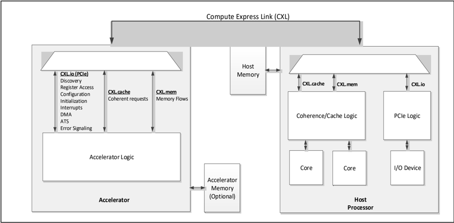

The CXL 2.0 specification enables additional usage models beyond CXL 1.1, while being fully backwards compatible with CXL 1.1 (and CXL 1.0). It enables managed hot-plug, security enhancements, persistent memory support, memory error reporting, and telemetry. CXL 2.0 also enables single-level switching support for fan-out as well as the ability to pool devices across multiple virtual hierarchies, including multi-domain support of memory devices. Figure 2 demonstrates memory and accelerator disaggregation through single level switching, in addition to fan-out, across multiple virtual hierarchies, each represented by a unique color. CXL 2.0 also enables these resources (memory or accelerators) to be off-lined from one domain and on-lined into another domain, allowing the resources to be time-multiplexed across different virtual hierarchies, depending on their resource demand.

CXL protocol is compatible with PCIe CEM Form Factor (4.0 and later), all form factors relating to EDSFF SSF-TA-1009 (revision 2.0 and later) and other form factors that support PCIe.

##### Figure 2. Fan-out and Pooling Enabled by Switches

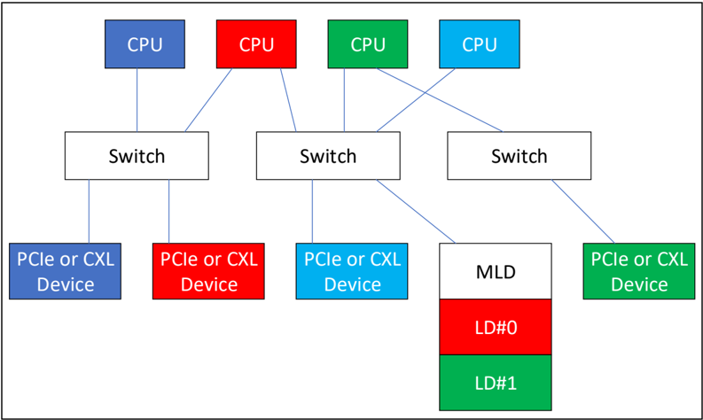

#### 1.4.2 Flex Bus

A Flex Bus port allows designs to choose between providing native PCIe protocol or CXL over a high-bandwidth, off-package link; the selection happens during link training via alternate protocol negotiation and depends on the device that is plugged into the slot. Flex Bus uses PCIe electricals, making it compatible with PCIe retimers, and form factors that support PCIe.

Figure 3 provides a high-level diagram of a Flex Bus port implementation, illustrating both a slot implementation and a custom implementation where the device is soldered down on the motherboard. The slot implementation can accommodate either a Flex Bus.CXL card or a PCIe card. One or two optional retimers can be inserted between the CPU and the device to extend the channel length. As illustrated in [Figure 4](#figure-4-flex-bus-usage-model-examples), this flexible port can be used to attach coherent accelerators or smart I/O to a Host processor.

##### Figure 3. CPU Flex Bus Port Example

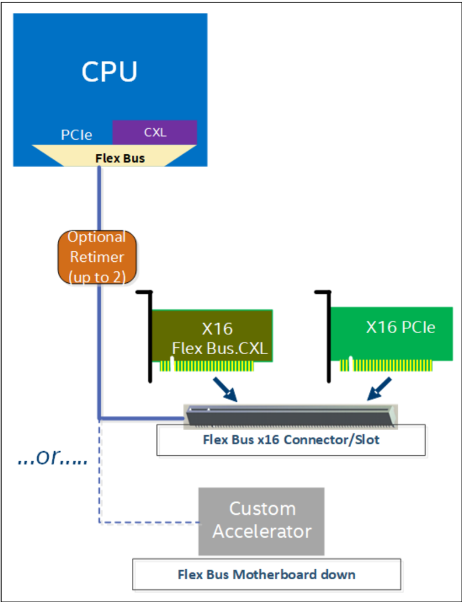

##### Figure 4. Flex Bus Usage Model Examples

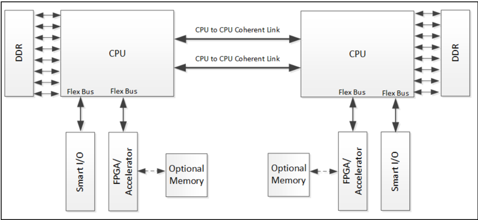

[Figure 5](#figure-5-remote-far-memory-usage-model-example) illustrates how a Flex Bus.CXL port can be used as a memory expansion port.

##### Figure 5. Remote Far Memory Usage Model Example

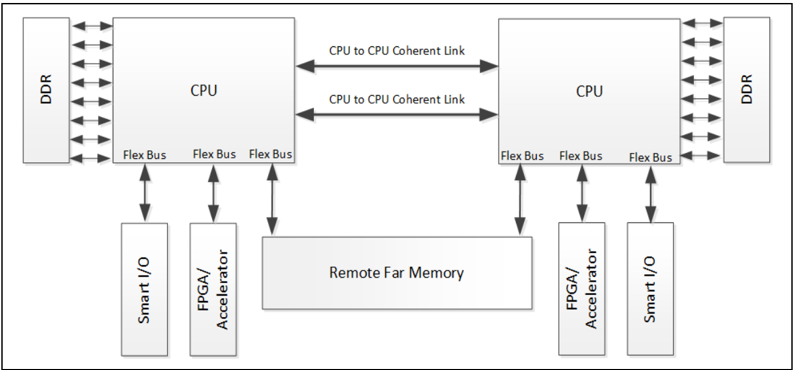

[Figure 6](#figure-6-cxl-downstream-port-connections) illustrates the connections supported below a CXL Downstream port.

##### Figure 6. CXL Downstream Port Connections

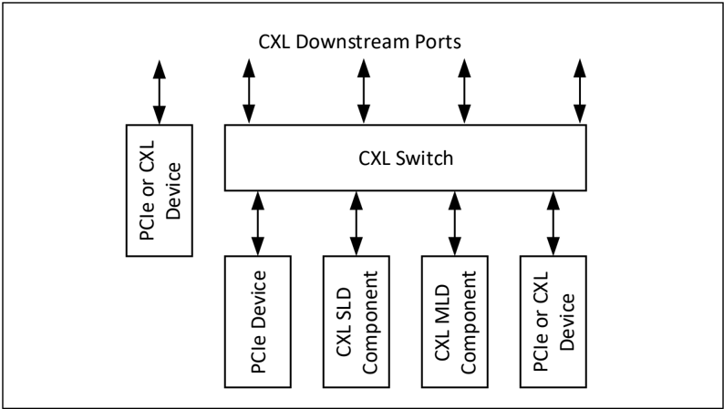

### 1.5 Flex Bus Link Features

Flex Bus provides a point-to-point interconnect that can transmit native PCIe protocol or dynamic multi-protocol CXL to provide I/O, caching, and memory protocols over PCIe electricals. The primary link attributes include support of the following features:

- Native PCIe mode, full feature support as defined in the PCIe specification
- CXL mode, as defined in this specification
- Configuration of PCIe vs CXL protocol mode
- Signaling rate of 32 GT/s, degraded rate of 16GT/s or 8 GT/s in CXL mode
- Link width support for x16, x8, x4, x2 (degraded mode), and x1 (degraded mode) in CXL mode
- Bifurcation (aka Link Subdivision) support to x4 in CXL mode

### 1.6 Flex Bus Layering Overview

Flex Bus architecture is organized as multiple layers, as illustrated in Figure 7. The CXL transaction (protocol) layer is subdivided into logic that handles CXL.io and logic that handles CXL.mem and CXL.cache; the CXL link layer is subdivided in the same manner. Note that the CXL.mem and CXL.cache logic are combined within the transaction layer and within the link layer. The CXL link layer interfaces with the CXL ARB/MUX, which interleaves the traffic from the two logic streams. Additionally, the PCIe transaction and data link layers are optionally implemented and, if implemented, are permitted to be converged with the CXL.io transaction and link layers, respectively. As a result of the link training process, the transaction and link layers are configured to operate in either PCIe mode or CXL mode. While a host CPU would most likely implement both modes, an accelerator AIC is permitted to implement only the CXL mode. The logical sub-block of the Flex Bus physical layer is a converged logical physical layer that can operate in either PCIe mode or CXL mode, depending on the results of alternate mode negotiation during the link training process.

#### Figure 7. Conceptual Diagram of Flex Bus Layering

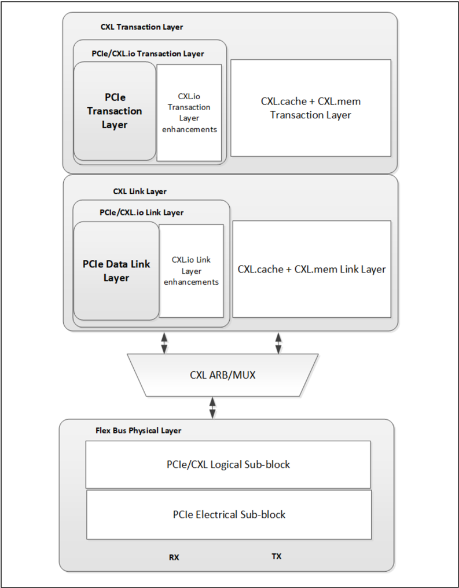

### 1.7 Document Scope

This document specifies the functional and operational details of the Flex Bus interconnect and the CXL protocol. It describes the CXL usage model and defines how the transaction, link, and physical layers operate. Reset, power management, and initialization/configuration flows are described. Additionally, RAS behavior is described. Please refer to the PCIe specification for PCIe protocol details.

The contents of this document are summarized in the following chapter highlights:

- [Section 2.0](#20-compute-express-link-system-architecture), 'Compute Express Link System Architecture'  - This chapter describes different profiles of devices that might attach to a CPU root complex over a CXL capable link. For each device profile, a description of the typical workload and system resource usage is provided along with an explanation of which CXL capabilities are relevant for that workload. Additionally, a Bias Based coherency model is introduced which optimizes the performance for accesses to deviceattached memory depending on whether the memory is in host bias, during which the memory is expected to be accessed mainly by the Host, or device bias, during which the memory is expected to be accessed mainly by the device.
- [Section 3.0](#30-compute-express-link-transaction-layer), 'Compute Express Link Transaction Layer'  - The transaction layer chapter is divided into subsections that describe details for CXL.io, CXL.cache, and CXL.mem. The CXL.io protocol is required for all implementations, while the other two protocols are optional depending on expected device usage and workload. The transaction layer specifies the transaction types, transaction layer packet formatting, transaction ordering rules, and crediting. The CXL.io protocol is based on the 'Transaction Layer Specification' chapter of the PCIe base specification; any deltas from the PCIe base specification are described in this chapter. These deltas include PCIe Vendor Defined Messages for reset and power management, modifications to the PCIe ATS request and completion formats to support accelerators, and Deferred Writes instruction definitions. For CXL.cache, this chapter describes the channels in each direction (i.e., request, response, and data), the transaction opcodes that flow through each channel, and the channel crediting and ordering rules. The transaction fields associated with each channel are also described. For CXL.mem, this chapter defines the message classes in each direction, the fields associated with each message class, and the message class ordering rules. Finally, this chapter provides flow diagrams that illustrate the sequence of transactions involved in completing host-initiated and device-initiated accesses to device-attached memory.
- [Section 4.0](#40-compute-express-link-link-layers), 'Compute Express Link Link Layers'  - The link layer is responsible for reliable transmission of the transaction layer packets across the Flex Bus link. This chapter is divided into subsections that describe details for CXL.io and for CXL.cache and CXL.mem. The CXL.io protocol is based on the 'Data Link Layer Specification' chapter of the PCIe base specification; any deltas from the PCIe base specification are described in this chapter. For CXL.cache and CXL.mem, the 528-bit flit layout is specified. The flit packing rules for selecting transactions from internal queues to fill the three slots in the flit are described. Other features described for CXL.cache and CXL.mem include the retry mechanism, link layer control flits, CRC calculation, and viral and poison.
- [Section 5.0](#50-compute-express-link-arbmux), 'Compute Express Link ARB/MUX'  - The ARB/MUX arbitrates between requests from the CXL link layers and multiplexes the data to forward to the physical layer. On the receive side, the ARB/MUX decodes the flit to determine the target to forward transactions to the appropriate CXL link layer. Additionally, the ARB/MUX maintains virtual link state machines for every link layer it interfaces with, processing power state transition requests from the local link layers and generating ARB/MUX link management packets to communicate with the remote ARB/MUX.
- [Section 6.0](#60-flex-bus-physical-layer), 'Flex Bus Physical Layer'  - The Flex Bus physical layer is responsible for training the link to bring it to operational state for transmission of PCIe packets or CXL flits. During operational state, it prepares the data from the CXL link layers or the PCIe link layer for transmission across the Flex Bus link; likewise, it converts data received from the link to the appropriate format to pass on to the appropriate link layer. This chapter describes the deltas from the PCIe base specification to support the CXL mode of operation. The framing of the CXL flits and the physical layer packet layout are described. The mode selection process to decide between CXL mode or PCIe mode, including hardware autonomous negotiation and software controlled selection is also described. Finally, CXL low latency modes are described.
- [Section 7.0](#70-switching), 'Switching'  - This chapter provides an overview of different CXL switching configurations and describes rules for how to configure switches. Additionally, the Fabric Manager application interface is specified.
- [Section 8.0](#80-control-and-status-registers), 'Control and Status Registers'  - This chapter provides details of the Flex Bus and CXL control and status registers. It describes the configuration space and memory mapped registers that are located in various CXL components.
- [Section 9.0](#90-reset-initialization-configuration-and-manageability), 'Reset, Initialization, Configuration and Manageability'  - This chapter describes the flows for boot, reset entry, and sleep state entry; this includes the transactions sent across the link to initiate and acknowledge entry as well as steps taken by a CXL device to prepare for entry into each of these states. Additionally, this chapter describes the software enumeration model of both CXL 1.1 and CXL 2.0 hierarchy and how the System Firmware view of the hierarchy may differ from the OS view. This chapter discusses different accelerator topologies, i.e., single CPU, multiple CPUs, and multiple nodes; for each topology, software management of the multiple Flex Bus links involved is described.
- [Section 10.0](#100-power-management), 'Power Management'  - This chapter provides details on protocol specific link power management and physical layer power management. It describes the overall power management flow in three phases: protocol specific PM entry negotiation, PM entry negotiation for ARB/MUX interfaces (managed independently per protocol), and PM entry process for the physical layer. The PM entry process for CXL.cache and CXL.mem is slightly different than the process for CXL.io; these processes are described in separate subsections in this chapter.
- [Section 11.0](#110-security), 'Security'  - This chapter provides details on the CXL Integrity and Data Encryption (CXL IDE) scheme used for securing CXL protocol flits transmitted across the link.
- [Section 12.0](#120-reliability-availability-and-serviceability), 'Reliability, Availability and Serviceability'  - This chapter describes the RAS capabilities supported by a CXL host and a CXL device. It describes how various types of errors are logged and signaled to the appropriate hardware or software error handling agent. It describes the link down flow and the viral handling expectation. Finally, it describes the error injection requirements.
- [Section 13.0](#130-performance-considerations), 'Performance Considerations'  - This chapter describes hardware and software considerations for optimizing performance across the Flex Bus link in CXL mode.
- [Section 14.0](#140-cxl-compliance-testing), 'CXL Compliance Testing'  - This chapter describes methodologies for ensuring that a device is compliant with the CXL specification.

## 2.0 Compute Express Link System Architecture

This section describes the performance advantages and key features of CXL. CXL is a high performance I/O bus architecture used to interconnect peripheral devices that can be either traditional non-coherent IO devices, memory devices, or accelerators with additional capabilities. The types of devices that can attach via CXL and the overall system architecture is described in Figure 8.

### Figure 8. CXL Device Types

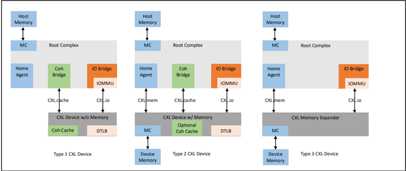

Before diving into the details of each type of CXL device, here's a foreword about where CXL is not applicable.

Traditional non-coherent IO devices rely primarily on standard Producer-Consumer ordering models and execute against Host-attached memory. For such devices, there is little interaction with the Host except for work submission and signaling on work completion boundaries. Such accelerators also tend to work on data streams or large contiguous data objects. These devices typically do not need the advanced capabilities provided by CXL and traditional PCIe is sufficient as an accelerator attach medium.

The following sections describe various profiles of CXL devices.

### 2.1 Type 1 CXL Device

Type 1 CXL devices have special needs for which having a fully coherent cache in the device becomes valuable. For such devices, standard Producer-Consumer ordering models do not work very well. One example of a device with special requirements is to perform complex atomics that are not part of the standard suite of atomic operations present on PCIe.

Basic cache coherency allows an accelerator to implement any ordering model it chooses and allows it to implement an unlimited number of atomic operations. These tend to require only small amounts of cache which can easily be tracked by standard processor snoop filter mechanisms. The size of cache that can be supported for such devices depends on the host's snoop filtering capacity. CXL supports such devices using its optional CXL.cache link over which an accelerator can use CXL.cache protocol for cache coherency transactions.

#### Figure 9. Type 1 - Device with Cache

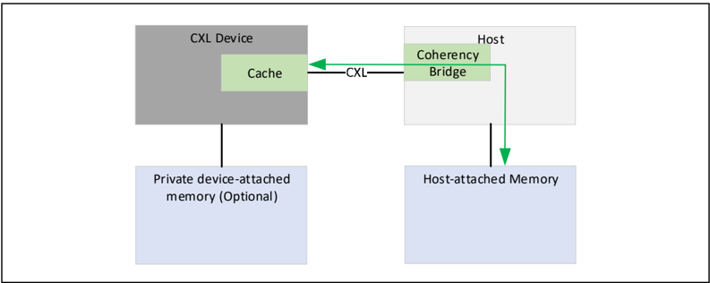

### 2.2 Type 2 CXL Device

Type 2 devices, in addition to fully coherent cache, also have memory, for example DDR, High Bandwidth Memory (HBM) etc., attached to the device. These devices execute against memory, but their performance comes from having massive bandwidth between the accelerator and device-attached memory. The key goal for CXL is to provide a means for the Host to push operands into device-attached memory and for the Host to pull results out of device-attached memory such that it doesn't add software and hardware cost that offsets the benefit of the accelerator. This spec refers to coherent system address mapped device-attached memory as Host-managed Device Memory (HDM).

There is an important distinction between HDM and traditional IO/PCIe Private Device Memory (PDM). An example of such a device is a GPGPU with attached GDDR. Such devices have treated device-attached memory as private. This means that the memory is not accessible to the Host and is not coherent with the rest of the system. It is managed entirely by the device hardware and driver and is used primarily as intermediate storage for the device with large datasets. The obvious disadvantage to a model such as this is that it involves large amounts of copies back and forth from the Host memory to device-attached memory as operands are brought in and results are written back. Please note that CXL does not preclude devices with PDM.

#### Figure 10. Type 2 Device - Device with Memory

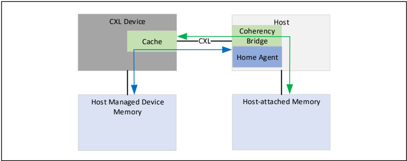

At a high level, there are two models of operation that are envisaged for HDM. These are described below.

#### 2.2.1 Bias Based Coherency Model

The Host-managed Device Memory (HDM) attached to a given device is referred to as device-attached memory to denote that it is local to only that device. The Bias Based coherency model defines two states of bias for device-attached memory: Host Bias and Device Bias. When the device-attached memory is in Host Bias state, it appears to the device just as regular Host-attached memory does. That is, if the device needs to access it, it needs to send a request to the Host which will resolve coherency for the requested line. On the other hand, when the device-attached memory is in Device Bias state, the device is guaranteed that the Host does not have the line in any cache. As such, the device can access it without sending any transaction (request, snoops, etc.) to the Host whatsoever. It is important to note that the Host itself sees a uniform view of device-attached memory regardless of the bias state. In both modes, coherency is preserved for device-attached memory.

The key benefits of Bias Based coherency model are:

- Helps maintain coherency for device-attached memory which is mapped to system coherent address space.
- Helps the device access its local attached memory at high bandwidth without incurring significant coherency overheads (e.g., snoops to the Host).
- Helps the Host access device-attached memory in a coherent, uniform manner, just as it would for Host-attached memory.

To maintain Bias modes, a Type 2 CXL Device will:

- Implement the Bias Table which tracks Bias on a page granularity (e.g., 1b per 4KB page) which can be cached in the device using a Bias Cache.
- Build support for Bias transitions using a Transition Agent (TA). This essentially looks like a DMA engine for 'cleaning up' pages, which essentially means to flush the host's caches for lines belonging to that page.
- Build support for basic load and store access to accelerator local memory for the benefit of the Host.

The bias modes are described in detail below.

##### 2.2.1.1 Host Bias

The Host Bias mode typically refers to the part of the cycle when the operands are being written to memory by the Host during work submission or when results are being read out from the memory after work completion. During Host Bias mode, coherency flows allows for high throughput access from the Host to device-attached memory (as shown by the blue arrows in Figure 11) whereas device access to device-attached memory is not optimal since they need to go through the host (as shown in green arrows in Figure 11).

###### Figure 11. Type 2 Device - Host Bias

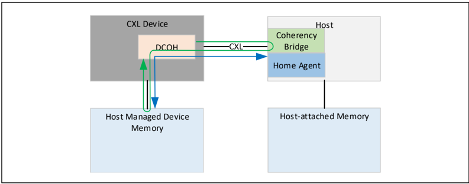

##### 2.2.1.2 Device Bias

The Device Bias mode is used when the device is executing the work, between work submission and completion, and in this mode, the device needs high bandwidth and low latency access to device-attached memory.

In this mode, device can access device-attached memory without consulting the Host's coherency engines (as shown in red arrows in Figure 12). The Host can still access device-attached memory but may be forced to give up ownership by the accelerator (as shown in green arrows in Figure 12). This results in the device seeing ideal latency &amp; bandwidth from device-attached memory, whereas the Host sees compromised performance.

###### Figure 12. Type 2 Device - Device Bias

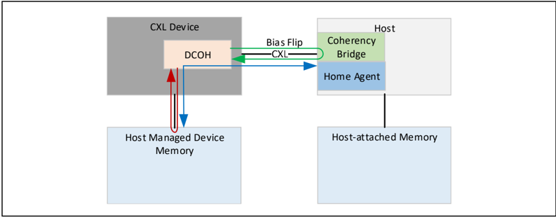

##### 2.2.1.3 Mode Management

There are two envisioned Bias Mode Management schemes - Software Assisted and Hardware Autonomous. CXL supports both modes. Examples of Bias Flows are present in Appendix A.

While two modes are described below, it is worth noting that strictly speaking, devices do not need to implement any bias. In this case, all of device-attached memory degenerates to Host Bias. This means that all accesses to device-attached memory must be routed through the Host. An accelerator is free to choose a custom mix of Software assisted and Hardware autonomous bias management scheme. The Host implementation is agnostic to any of the above choices.

##### 2.2.1.4 Software Assisted Bias Mode Management

With Software Assistance, we rely on software to know for a given page, which state of the work execution flow it resides in. This is useful for accelerators with phased computation with regular access patterns. Based on this, software can best optimize the coherency performance on a page granularity by choosing Host or Device Bias modes appropriately.

Here are some characteristics of Software Assisted Bias Mode Management:

- Software Assistance can be used to have data ready at an accelerator before computation.
- If data is not moved to accelerator memory in advance, it is generally moved on demand based on some attempted reference to the data by the accelerator.
- In an 'on demand' data fetch scenario, the accelerator must be able to find work to execute, for which data is already properly placed, or it must stall.
- Every cycle that an accelerator is stalled eats into its ability to add value over software running on a core.
- Simple accelerators typically cannot hide data fetch latencies.

Efficient software assisted data/coherency management is critical to the aforementioned class of simple accelerators.

##### 2.2.1.5 Hardware Autonomous Bias Mode Management

Software assisted coherency/data management is ideal for simple accelerators, but of lesser value to complex, programmable accelerators. At the same time, the complex problems frequently mapped to complex, programmable accelerators like GPUs present an enormously complex problem to programmers if software assisted coherency/data movement is a requirement. This is especially true for problems that split computation between Host and accelerator or problems with pointer based, tree based or sparse data sets.

The Hardware Autonomous Bias Mode Management, does not rely on software to appropriately manage page level coherency bias. Rather, it is the hardware which makes predictions on the bias mode based on the requester for a given page and adapts accordingly. Key benefits for this model are:

- Provide the same page granular coherency bias capability as in the software assisted model.
- Eliminate the need for software to identify and schedule page bias transitions prior to offload execution.
- Provide hardware support for dynamic bias transition during offload execution.
- Hardware support for this model can be a simple extension to the software assisted model.

- Link flows and Host support are unaffected.
- Impact limited primarily to actions taken at the accelerator when a Host touches a Device Biased page and vice-versa.
- Note that even though this is an ostensible hardware driven solution, hardware need not perform all transitions autonomously - though it may do so if desired.

It is sufficient if hardware provides hints (e.g., 'transition page X to bias Y now') but leaves the actual transition operations under software control.

### 2.3 Type 3 CXL Device

A Type 3 CXL Device supports CXL.io and CXL.mem protocols. An example of a Type 3 CXL device is a memory expander for the Host as shown in the figure below.

#### Figure 13. Type 3 - Memory Expander

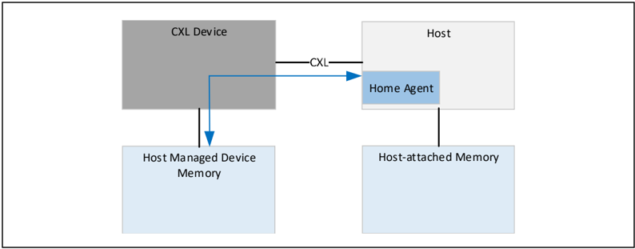

Since this is not an accelerator, the device does not make any requests over CXL.cache. The device operates primarily over CXL.mem to service requests sent from the Host. The CXL.io protocol is primarily used for device discovery, enumeration, error reporting and management. The CXL.io protocol is permitted to be used by the device for other IO specific application usages. The CXL architecture is independent of memory technology and allows for a range of memory organization possibilities depending on support implemented in the Host.

### 2.4 Multi Logical Device

CXL 2.0 supports only Type 3 MLD components. An MLD component can partition its resources into up to 16 isolated Logical Devices. Each Logical Device is identified by a Logical Device Identifier (LD-ID) in CXL.io and CXL.mem protocols. Each Logical Device visible to a Virtual Hierarchy (VH) operates as a Type 3 device. The LD-ID is transparent to software accessing a VH. MLD components have common Transaction and Link Layers for each protocol across all LDs.

An MLD component has one LD reserved for the FM and up to 16 LDs available for host binding. The FM owned LD (FMLD) allows the FM to configure resource allocation across LDs and manage the physical link shared with multiple VCSs. The FMLD's bus mastering capabilities are limited to generating error messages. Error messages generated by this function must only be routed to the FM.

The MLD component contains one MLD DVSEC (see [Section 8.1.9.2](#8192-register-offset-high-offset-varies)) that is only accessible by the FM and addressable by requests that carry an LD-ID of FFFFh in CXL LD-ID TLP Prefix. Switch implementations must guarantee that FM is the only entity that is permitted to use the LD-ID of FFFFh.

An MLD component is permitted to use FM API to configure LDs or have statically configured LDs. In both of these configurations the configured LD resource allocation is advertised through MLD DVSEC. In addition, the control registers in MLD DVSEC in the FMLD is also used by CXL switch to trigger Hot Reset of one or more LDs. See [Section 8.1.10.2](#81102-ld-id-hot-reset-vector-offset-0ch) for details.

#### 2.4.1 LD-ID for CXL.io and CXL.mem

LD-ID is a 16 bit Logical Device identifier applicable for CXL.io and CXL.mem requests and responses. All requests targeting and responses returned by an MLD device must include LD-ID.

Please refer to [Section 4.2.6](#426-link-layer-control-flit) for CXL.mem header formatting to carry the LD-ID field.

##### 2.4.1.1 LD-ID for CXL.mem

CXL.mem supports only the lower 4 bits of LD-ID and therefore can support up to 16 unique LD-ID values over the link. Requests and responses forwarded over an MLD Port are tagged with LD-ID.

##### 2.4.1.2 LD-ID for CXL.io

CXL.io supports carrying 16 bits of LD-ID for all requests and responses forwarded over an MLD Port. LD-ID 0xFFFF is reserved and is always used by the FM.

CXL.io utilizes the Vendor Defined Local TLP Prefix to carry 16 bits of LD-ID value. The format for Vendor Defined Local TLP prefix is as follows. CXL LD-ID Vendor Defined Local TLP prefix uses the VendPrefixL0 Local TLP Prefix type.

###### Table 3. LD-ID Link Local TLP Prefix

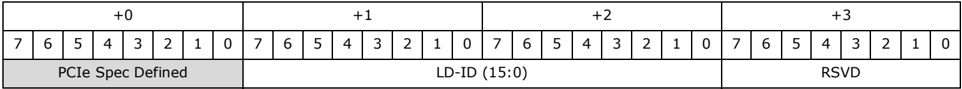

#### 2.4.2 Pooled Memory Device Configuration Registers

Each LD is visible to software as one or more PCIe EP Functions. While LD Functions support all the configuration registers, several control registers that impact common link behavior are virtualized and have no direct impact on the link. Each function of an LD must implement the configuration registers as described in the PCIe specification. Unless otherwise specified, the scope of the configuration registers is as described in the PCIe specification. For example, MSE - Memory space enable register controls a function's response to memory space.

[Table 4](#table-4-mld-pci-express-registers) lists the set of register fields that have modified behavior when compared to the PCIe Base Specification.

##### Table 4. MLD PCI Express Registers

AER - If an event is uncorrectable to the entire MLD, then it must be reported across all LDs. If the event is specific to a single LD then it must be isolated to that LD.

| Register/ Capability Structure             | Capability Register Fields                                                                                                                                  | LD-ID = 0xFFFFh                                         | All Other LDs                                                          |
|--------------------------------------------|-------------------------------------------------------------------------------------------------------------------------------------------------------------|---------------------------------------------------------|------------------------------------------------------------------------|
| BIST Register                              | All Fields                                                                                                                                                  | Supported                                               | Hardwired to all 0s                                                    |
| Device Capabilities Register               | Max_Payload_Size_Supported, Phantom Functions Supported, Extended Tag Field Supported, Endpoint L1 Acceptable Latency                                       | Supported                                               | Mirrors LD-ID = 0xFFFFh                                                |
|                                            | Endpoint L0s Acceptable Latency                                                                                                                             | Not supported                                           | Not supported                                                          |
|                                            | Captured Slot Power Limit Value, Captured Slot Power Scale                                                                                                  | Supported                                               | Mirrors LD-ID = 0xFFFFh                                                |
| Link Control Register                      | All Fields applicable to PCIe Endpoint                                                                                                                      | Supported (FMLD controls the fields) L0s not supported. | Read/Write with no effect                                              |
| Link Status Register                       | All Fields applicable to PCIe Endpoint                                                                                                                      | Supported                                               | Mirrors LD-ID = 0xFFFFh                                                |
| Link Capabilities Register                 | All Fields applicable to PCIe Endpoint                                                                                                                      | Supported                                               | Mirrors LD-ID = 0xFFFFh                                                |
| Link Control 2 Register                    | All Fields applicable to PCIe Endpoint                                                                                                                      | Supported                                               | Mirrors LD-ID = 0xFFFFh RW fields are Read/ Write with no effect       |
| Link Status 2 Register                     | All Fields applicable to PCIe Endpoint                                                                                                                      | Supported                                               | Mirrors LD-ID = 0xFFFFh                                                |
| MSI/MSI-X Capability Structures            | All registers                                                                                                                                               | Not supported                                           | Each Functions that requires MSI/MSI-X must support it.                |
| Secondary PCI Express Capability Registers | All register sets related to supported speeds (8, 16, 32 GT/ s)                                                                                             | Supported                                               | Mirrors LD-ID = 0xFFFFh RO/Hwinit fields are Read/Write with no effect |
|                                            | Lane Error Status, Local Data Parity Mismatch Status                                                                                                        | Supported                                               | Hardwired to all 0s                                                    |
|                                            | Received Modified TS Data1 Register, Received Modified TS Data 2 Register, Transmitted Modified TS Data1 Register, Transmitted Modified TS Data 2 Register, | Supported                                               | Mirrors LD-ID = 0xFFFFh                                                |
| Lane Margining                             |                                                                                                                                                             | Supported                                               | Not supported                                                          |
| L1 Substates Extended Capability           |                                                                                                                                                             | Not supported                                           | Not supported                                                          |
| AER                                        | Registers that apply to Endpoint functions                                                                                                                  | Supported                                               | Supported per LD                                                       |

AER – If an event is uncorrectable to the entire MLD, then it must be reported across all LDs. If the event is specific to a single LD then it must be isolated to that LD.

### 2.5 CXL Device Scaling

CXL Device Scaling limitations permit only a single Type 1 or Type 2 device per VH to be enabled.

## 3.0 Compute Express Link Transaction Layer

### 3.1 CXL.io

CXL.io provides a non-coherent load/store interface for I/O devices. Figure 14 shows where the CXL.io transaction layer exists in the Flex Bus layered hierarchy. Transaction types, transaction packet formatting, credit-based flow control, virtual channel management, and transaction ordering rules follow the PCIe definition; please refer to the 'Transaction Layer Specification' chapter of the PCI Express Base Specification for details. This chapter highlights notable PCIe operational modes or features that are used for CXL.io.

#### Figure 14. Flex Bus Layers -- CXL.io Transaction Layer Highlighted

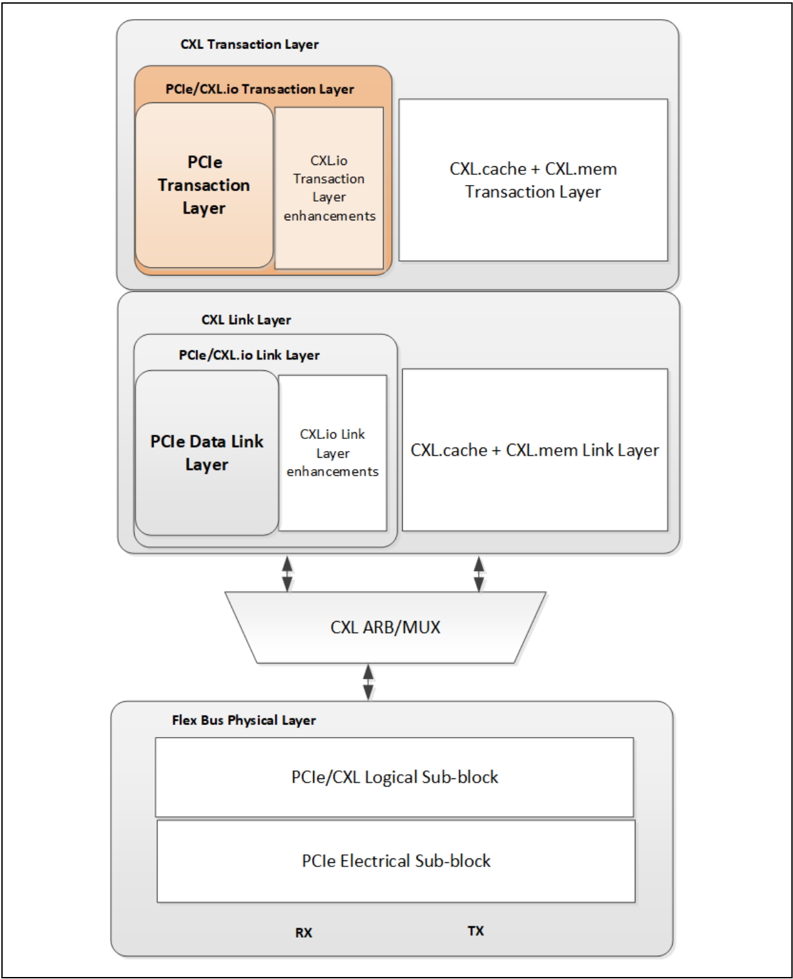

#### 3.1.1 CXL.io Endpoint

A CXL Device is required to support operating in both CXL 1.1 and CXL 2.0 modes. The CXL Alternate Protocol negotiation determines the mode of operation. When the link is configured to operate in CXL 1.1 mode a CXL.io endpoint must be exposed to software as a PCIe RCiEP, and when configured to operate in CXL 2.0 mode must be exposed to software as PCI Express Endpoint. Please refer to the PCIe 5.0 Base Specification for more details. Please refer to [Section 9.12](#912-cxl-20-enumeration).

A CXL.io endpoint function that participates in CXL protocol must not generate INTx messages. Non-CXL Function Map DVSEC ([Section 8.1.4](#814-non-cxl-function-map-dvsec)) enumerates functions that do not participate in CXL.cache or CXL.mem. Even though not recommended, these nonCXL functions are permitted to generate INTx messages.

CXL.io endpoints functions of MLD component, including non-CXL functions are not permitted to generate INTx messages.

#### 3.1.2 CXL Power Management VDM Format

The CXL power management messages are sent as PCIe Vendor Defined Type 0 messages with a 4 DW data payload. These include the PMREQ, PMRSP, and PMGO messages. [Figure 15](#figure-15-cxl-power-management-messages-packet-format) provides the format for the CXL PM VDM messages. The following are the characteristics of these messages:

- Fmt and Type fields are set to indicate message with data. All messages use routing of 'Local-Terminate at Receiver'. Message Code is set to Vendor Defined Type 0.
- Vendor ID field is set to 1E98h [1] .
- Byte 15 of the message header contains the VDM Code and is set to the value of 'CXL PM Message.' (68h)
- The 4 DW Data Payload contains the CXL PM Logical Opcode (e.g., PMREQ, GPF) and any other information related to the CXL PM message. Details of fields within the Data Payload are described in [Table 5](#table-5-cxl-power-management-messages-data-payload-fields-definitions).

If a CXL component receives PM VDM with poison (EP=1), the receiver shall drop such a message. Since the receiver is able to continue regular operation after receiving such a VDM, it shall treat this event as an advisory non-fatal error.

If the receiver Power Management Unit (PMU) does not understand the contents of PM VDM Payload, it shall silently drop that message and shall not signal an uncorrectable error.

1. NOTICE TO USERS: THE UNIQUE VALUE THAT IS PROVIDED IN THIS SPECIFICATION FOR USE IN VENDOR DEFINED MESSAGE FIELDS, DESIGNATED VENDOR SPECIFIC EXTENDED CAPABILITIES, AND ALTERNATE PROTOCOL NEGOTIATION ONLY AND MAY NOT BE USED IN ANY OTHER MANNER, AND A USER OF THE UNIQUE VALUE MAY NOT USE THE UNIQUE VALUE IN A MANNER THAT (A) ALTERS, MODIFIES, HARMS OR DAMAGES THE TECHNICAL FUNCTIONING, SAFETY OR SECURITY OF THE PCI-SIG ECOSYSTEM OR ANY PORTION THEREOF, OR (B) COULD OR WOULD REASONABLY BE DETERMINED TO ALTER, MODIFY, HARM OR DAMAGE THE TECHNICAL FUNCTIONING, SAFETY OR SECURITY OF THE PCI-SIG ECOSYSTEM OR ANY PORTION THEREOF (FOR PURPOSES OF THIS NOTICE. 'PCI-SIG ECOSYSTEM' MEANS THE PCI-SIG SPECIFICATIONS, MEMBERS OF PCI-SIG AND THEIR ASSOCIATED PRODUCTS AND SERVICES THAT INCORPORATE ALL OR A PORTION OF A PCISIG SPECIFICATION AND EXTENDS TO THOSE PRODUCTS AND SERVICES INTERFACING WITH PCI-SIG MEMBER PRODUCTS AND SERVICES).

##### Figure 15. CXL Power Management Messages Packet Format

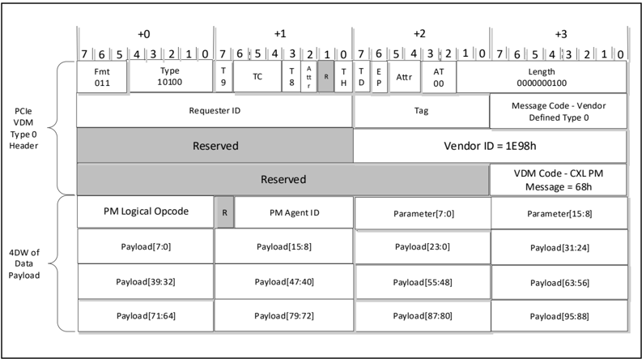

###### Table 5. CXL Power Management Messages -- Data Payload Fields Definitions

| Field                  | Description                                                                                                                                                                | Notes                                                                          |
|------------------------|----------------------------------------------------------------------------------------------------------------------------------------------------------------------------|--------------------------------------------------------------------------------|
| PM Logical Opcode[7:0] | Power Management Command: 00h - AGENT_INFO 02h - RESETPREP 04h - PMREQ (PMRSP and PMGO) 06h - Global Persistent Flush (GPF) FEh - CREDIT_RTN                               |                                                                                |
| PM Agent ID[6:0]       | PM2IP: Reserved IP2PM: PM agent ID assigned to the device. Host communicates the PM Agent ID to device via the TARGET_AGENT_ID field of the very first CREDIT_RTN message. | A device does not consume this value when it receives a message from the Host. |
| Parameter[15:0] | CREDIT_RTN(PM2IP and IP2PM): <br> Reserved  <br><br> AGENT_INFO(PM2IP and IP2PM): <br> [0] - REQUEST (set) /RESPONSE_N (cleared) <br><br> [7:1] - INDEX  <br> All others reserved  <br><br> PMREQ(PM2IP and IP2PM):  <br> [0] - REQUEST (set) /RESPONSE_N (cleared)  <br> [2] - GO  <br> All others reserved  <br><br> RESETPREP(PM2IP and IP2PM): <br> [0] - REQUEST (set) /RESPONSE_N (cleared)  <br> All others reserved  <br><br> GPF(PM2IP and IP2PM):  <br> [0] - REQUEST (set) /RESPONSE_N (cleared)  <br> All others reserved |         |
| Payload[95:0] | CREDIT_RTN: <br> [7:0] NUM_CREDITS (PM2IP and IP2PM) <br> [14:8] TARGET_AGENT_ID (Valid during the first PM2IP message, reserved in all other cases) <br> All others bits are reserved <br><br> AGENT_INFO (Request and Response): <br> if Param.Index == 0, <br> [7:0] - CAPABILITY_VECTOR <br> [0] - Always set to indicate support for PM messages defined in CXL 1.1 spec. <br> [1] - Support for GPF messages. <br> [7:2] - Reserved <br> all others reserved <br> else <br> all reserved <br> All other bits are reserved. <br><br> RESETPREP (Request and Response): <br> [7:0] - ResetType <br> 0x01 => host space transition from S0 to S1; <br> 0x03 => host space transition from S0 to S3; <br> 0x04 => host space transition from S0 to S4;  <br> 0x05 => host space transition from S0 to S5; <br> 0x10 => Host space reset (host space partition reset) <br> [15:8] - PrepType 0x00 => General Prep All others reserved <br> [17:16] - Reserved All other bits are reserved. <br> PMREQ: <br> [31:0] - PCIe LTR format (as defined in Bytes 12-15 of PCIe LTR message, see [Table 6](#table-6-pmreq-field-definitions)) <br> All others bits are reserved <br><br> GPF: <br> [7:0] - GPFType <br> [0] - Set to indicate powerfail is imminent. Only valid for Phase 1 request messages <br> [1] - Set to indicate device must flush its caches. Only valid for Phase 1 request messages <br> [7:2] - Reserved <br> [15:8] - GPFStatus <br> [8] - Set to indicate Cache Flush phase encountered an error. Only valid for Phase 1 responses and Phase 2 requests; <br> [15:9] - Reserved  [17:16] - Phase <br> 0x01 => Phase 1 <br> 0x02 => Phase 2 <br> All others reserved <br><br> All other bits are reserved. | CXL Agent must treat the TARGET_AGENT_ID field as Reserved when returning credits to Host. <br><br> Only Index 0 is defined for AGENT_INFO, all other Index values are reserved. |

###### Table 6. PMREQ Field Definitions

| Payload Bit Position   | LTR Field              |
|------------------------|------------------------|
| [31:24]                | Snoop Latency[7:0]     |
| [23:16]                | Snoop Latency[15:8]    |
| [15:8]                 | No-Snoop Latency[7:0]  |
| [7:0]                  | No-Snoop Latency[15:8] |

##### 3.1.2.1 Credit and PM Initialization

PM Credits and initialization process is link local. [Figure 16](#figure-16-power-management-credits-and-initialization) illustrates the use of PM2IP.CREDIT_RTN and PM2IP.AGENT_INFO messages to initialize Power Management messaging protocol intended to facilitate communication between the Downstream Port PMU and the Upstream Port PMU. A CXL switch provides an aggregation function for PM messages as described in [Section 9.1.2.1](#9121-switch-behavior).

GPF messages do not require credits and the receiver shall not generate CREDIT_RTN in response to GPF messages.

###### Figure 16. Power Management Credits and Initialization

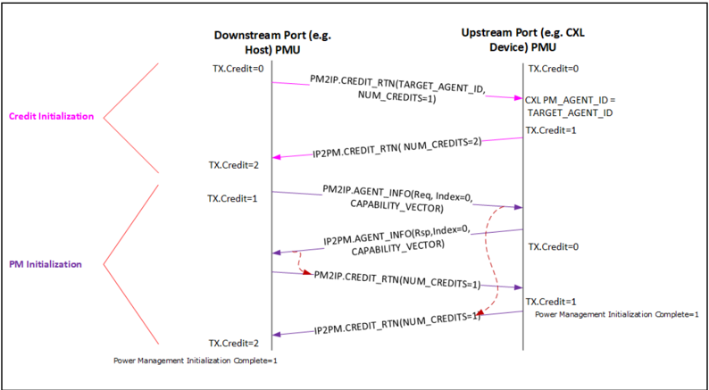

The CXL Upstream Port PMU must be able to receive and process CREDIT_RTN messages without dependency on any other PM2IP messages. Also, CREDIT_RTN messages do not use a credit. The CREDIT_RTN messages are used to initialize and update the TX credits on each side, so that flow control can be managed appropriately. During the very first CREDIT_RTN message during PM Initialization, the credits being sent via NUM_CREDITS field represent the number of credit-dependent PM messages that the initiator of CREDIT_RTN can receive from the other end. During the subsequent CREDIT_RTN messages, the NUM_CREDITS field represents the number of PM credits that were freed up since the last CREDIT_RTN message in the same direction. The very first CREDIT_RTN message is also used by the Downstream Port PMU to assign a PM_AGENT_ID to the Upstream Port PMU. This ID is communicated via the TARGET_AGENT_ID field in the CREDIT_RTN message. The Upstream Port PMU must wait for the CREDIT_RTN message from the Downstream Port PMU before initiating any IP2PM messages.

An Upstream Port PMU must support at least one credit, where a credit implies having sufficient buffering to sink a PM2IP message with 128 bits of payload.

After credit initialization, the Upstream Port PMU must wait for an AGENT_INFO message from the Downstream Port PMU. This message contains the CAPABILITY_VECTOR of the PM protocol of the Downstream Port PMU. Upstream Port PMU must send its CAPABILITY_VECTOR to the Downstream Port PMU in response to the AGENT_INFO Req from the Downstream Port PMU. When there is a mismatch, Downstream Port PMU may implement a compatibility mode to work with a less capable Upstream Port PMU. Alternatively, Downstream Port PMU may log the mismatch and report an error, if it does not know how to reliably function with a less capable Upstream Port PMU.

There is an expectation from the Upstream Port PMU that it restores credits to the Downstream Port PMU as soon as a message is received. Downstream Port PMU can have multiple messages in flight, if it was provided with multiple credits. Releasing credits in a timely manner will provide better performance for latency sensitive flows.

The following list summarizes the rules that must be followed by a Upstream Port PMU.

- Upstream Port PMU must wait to receive a PM2IP.CREDIT_RTN message before initiating any IP2PM messages.
- Upstream Port PMU must extract TARGET_AGENT_ID field from the first PM2IP message received from the Downstream Port PMU and use that as its PM_AGENT_ID in future messages.
- Upstream Port PMU must implement enough resources to sink and process any CREDIT_RTN messages without dependency on any other PM2IP or IP2PM messages or other message classes.
- Upstream Port PMU must implement at least one credit to sink a PM2IP message.
- Upstream Port PMU must return any credits to the Downstream Port PMU as soon as possible to prevent blocking of PM message communication over CXL Link.
- Upstream Port PMU are recommended to not withhold a credit for longer than 10us.

#### 3.1.3 CXL Error VDM Format

The CXL Error Messages are sent as PCIe Vendor Defined Type 0 messages with no data payload. Presently, this class includes a single type of message, namely Memory Error Firmware Notification (MEFN). [Figure 17](#figure-17-cxl-mefn-messages-packet-format) provides the format for the CXL Error VDM messages.

The following are the characteristics of the MEFN message:

- Fmt and Type fields are set to indicate message with no data.
- The message is sent using routing of 'Routed to Root Complex'. It is always initiated by a device.
- Message Code is set to Vendor Defined Type 0.
- Vendor ID field is set to 1E98h.
- Byte 15 of the message header contains the VDM Code and is set to the value of 'CXL Error Message.' (00h)
- Bytes 8, 9, 12, 13 are set to 0.
- Bits [7:4] of Byte 14 are set to 0. Bits [3:0] of Byte 14 are used to communicate the Firmware Interrupt Vector (abbreviated as FW Interrupt Vector in [Figure 17](#figure-17-cxl-mefn-messages-packet-format)).

##### Figure 17. CXL MEFN Messages Packet Format

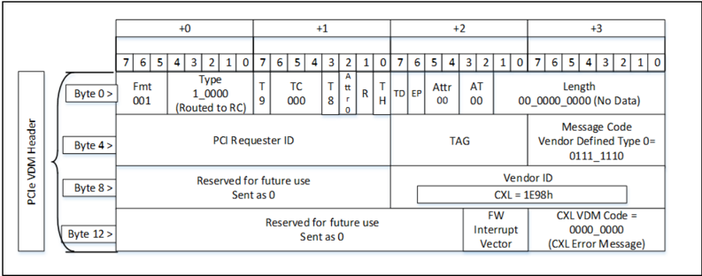

The encoding of FW Interrupt Vector field is host specific and thus not defined by the CXL specification. A host may support more than one type of Firmware environments and this field may be used to indicate to the host which one of these environments is to process this message.

#### 3.1.4 Optional PCIe Features Required for CXL

[Table 7](#table-7-optional-pcie-features-required-for-cxl) lists optional features per the PCIe Specification that are required to enabled CXL.

##### Table 7. Optional PCIe Features Required For CXL

| Optional PCIe Feature                 | Notes                                                                                                 |
|---------------------------------------|-------------------------------------------------------------------------------------------------------|
| Data Poisoning by transmitter         |                                                                                                       |
| ATS                                   | Only required if .cache is present (e.g. only for Type 1 & Type 2 devices but not for Type 3 devices) |
| Additional VCs and TCs beyond VC0/TC0 | VC0, optional VC1 for QoS                                                                             |
| Advanced Error Reporting (AER)        |                                                                                                       |

#### 3.1.5 Error Propagation

CXL.cache and CXL.mem errors detected by the device are propagated to the Upstream Port over the CXL.io traffic stream. These errors are logged as correctable and uncorrectable internal errors in the PCIe AER registers.

#### 3.1.6 Memory Type Indication on ATS

Requests to certain memory regions can only be issued on CXL.io and not on CXL.cache. It is up to the Host to decide what these memory regions are. For example, on x86 systems, the Host may choose to restrict access to Uncacheable (UC) type memory over CXL.io only. The Host indicates such regions by means of an indication on ATS completion to the device.

ATS requests sourced from a CXL device must set the 'Source-CXL' bit.

##### Figure 18. ATS 64-bit Request with CXL Indication

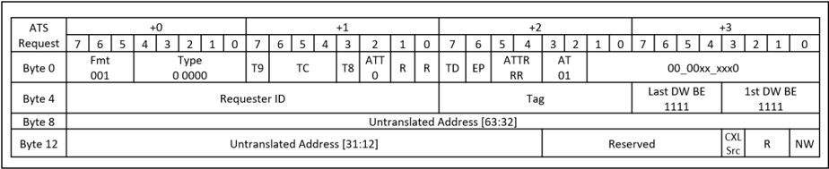

64-bit: DWORD3, Byte 3, Bit 3; 32-bit: DWORD2, Byte 3, Bit 3 as defined below

0b - Indicates request initiated by a Function that does not support Memory Type Indication on ATS

1b - Indicates request initiated by a Function that supports Memory Type Indication on ATS. As stated above all CXL Device Functions must set this bit.

This bit is Reserved in the ATS request as defined by the PCIe spec.

Note: ATS translation completion from the Host will carry the indication that requests to a given page can only be issued on CXL.io using the following bit, 'Issue-on-CXL.io', in the Translation Completion Data Entry:

##### Figure 19. ATS Translation Completion Data Entry with CXL Indication

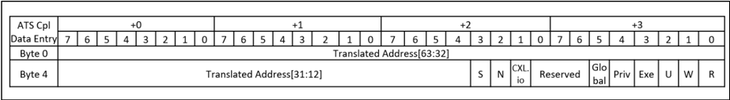

DWORD1, Byte 2, Bit 1 as defined below

0b - Requests to the page can be issued on all CXL protocols.

1b - Requests to the page can be issued by the Function on CXL.io only. It is a Function violation to issue requests to the page using CXL.Cache protocol.

Note: This bit is Reserved in the ATS completion as defined by the PCIe spec.

#### 3.1.7 Deferrable Writes

Deferrable Writes defined in CXL specification are only applicable when operating in CXL 1.1 mode. Refer to PCIe Specification for this functionality when operating in CXL 2.0 mode. Deferrable Writes enable scalable work submission to a CXL device by multiple software entities without explicit locks or software synchronization. Deferrable Writes are downstream non-posted memory writes. The completion for a Deferrable Write allows the device to indicate whether the command was successfully accepted or if it needs to be deferred.

On CXL.io, a Deferrable Write is sent as a NPMemWr32/64 transaction which has the following encodings (please note that the encoding for NPMemWr32 is deprecated in PCIe):

Fmt[2:0] - 010b/011b

Type[4:0] - 11011b

Since Deferrable Write is non-posted, the device is expected to send a Cpl response. The Completion Status field in the Cpl (with a Byte Count of '4) indicates whether work was successfully accepted or not. Successful work submission is accompanied by a 'Successful Completion' Completion Status. Unsuccessful work submission is accompanied by a 'Memory Request Retry Status' Completion Status. The encodings for these are:

Successful Completion (SC) - 000b

Memory Request Retry Status (MRS) - 010b

### 3.2 CXL.cache

#### 3.2.1 Overview

The CXL.cache protocol defines the interactions between the Device and Host as a number of requests that each have at least one associated response message and sometimes a data transfer. The interface consists of three channels in each direction: Request, Response, and Data. The channels are named for their direction, D2H for Device to Host and H2D for Host to Device, and the transactions they carry, Request, Response, and Data as shown in [Figure 20](#figure-20-cxlcache-channels). The independent channels allow different kinds of messages to use dedicated wires and achieve both decoupling and a higher effective throughput per wire.

D2H Request carries new requests from the Device to the Host. The requests typically target memory. Each request will receive zero, one or two responses and at most one 64-byte cacheline of data. The channel may be back pressured without issue. D2H Response carries all responses from the Device to the Host. Device responses to snoops indicate the state the line was left in the device caches, and may indicate that data is being returned to the Host to the provided data buffer. They may still be blocked temporarily for link layer credits, but should not require any other transaction to complete to free the credits. D2H Data carries all data and byte-enables from the Device to the Host. The data transfers can result either from implicit (as a result of snoop) or explicit write-backs (as a result of cache capacity eviction). In all cases a full 64-byte cacheline of data will be transferred. D2H Data transfers must make progress or deadlocks may occur. They may be blocked temporarily for link layer credits, but must not require any other transaction to complete to free the credits.

H2D Request carries requests from the Host to the Device. These are snoops to maintain coherency. Data may be returned for snoops. The request carries the location of the data buffer to which any return data should be written. H2D Requests may be back pressured for lack of device resources; however, the resources must free up without needing D2H Requests to make progress. H2D Response carries ordering messages and pulls for write data. Each response carries the request identifier from the original device request to indicate where the response should be routed. For write data pull responses, the message carries the location where the data should be written. H2D Responses can only be blocked temporarily for link layer credits. H2D Data delivers the data for device read requests. In all cases a full 64-byte cacheline of data will be transferred. H2D Data transfers can only be blocked temporarily for link layer credits.

##### Figure 20. CXL.cache Channels

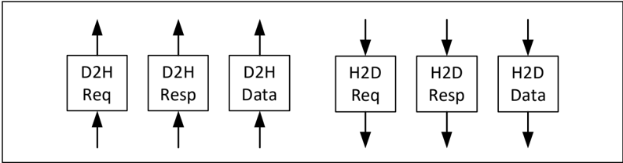

#### 3.2.2 CXL.cache Channel Description

##### 3.2.2.1 Channel Ordering

In general, all of the CXL.cache channels must work independently of each other to ensure that forward progress is maintained. For example, since requests from the device to the Host to a given address X will be blocked by the Host until it collects all snoop responses for this address X, linking the channels would lead to deadlock.

However, there is a specific instance where ordering between channels must be maintained for the sake of correctness. The Host needs to wait until Global Ordering (GO) messages, sent on H2D Response, are observed by the device before sending subsequent snoops for the same address. To limit the amount of buffering needed to track GO messages, the Host assumes that GO messages that have been sent over CXL.cache in a given cycle cannot be passed by snoops sent in a later cycle.

For transactions that have multiple concurrent messages within a single channel (e.g., FastGO and ExtCmp), the device/Host should assume that they can arrive in any order. For transactions that have multiple messages on a single channel with an expected order (e.g., WritePull and GO for WrInv) the Device/Host must ensure they are observed correctly using serializing messages (e.g. the Data message between WritePull and GO for WrInv as shown in Figure 24 ).

##### 3.2.2.2 Channel Crediting

To maintain the modularity of the interface no assumptions can be made on the ability to send a message on a channel since link layer credits may not be available at all times. Therefore, each channel must use a credit for sending any message and collect credit returns from the receiver. During operation, the receiver returns a credit whenever it has processed the message (i.e., freed up a buffer). It is not required that all credits are accounted for on either side, it is sufficient that credit counter saturates when full. If no credits are available, the sender must wait for the receiver to return one. The table below describes which channels must drain to maintain forward progress and which can be blocked indefinitely.

###### Table 8. CXL.cache Channel Crediting

| Channel             | Forward Progress Condition   | Blocking condition                                                                               | Description                                                                                       |
|---------------------|------------------------------|--------------------------------------------------------------------------------------------------|---------------------------------------------------------------------------------------------------|
| D2H Request (Req)   | Credited to Host             | Indefinite                                                                                       | Needs Host buffer, could be held by earlier requests                                              |
| D2H Response (Resp) | Pre-allocated                | Temporary link layer back pressure is allowed. Host may block waiting for H2D Response to drain. | Headed to specified Host buffer                                                                   |
| D2H Data            | Pre-allocated                | Temporary link layer back pressure is allowed. Host may block for H2D Data to drain.             | Headed to specified Host buffer                                                                   |
| H2D Request (Req)   | Credited to Device           | Must make progress. Temporary back pressure is allowed.                                          | May be temporarily back pressured due to lack of availability of D2H Response or D2H Data credits |
| H2D Response (Resp) | Pre-allocated                | Link layer only, must make progress. Temporary back pressure is allowed.                         | Headed to specified device buffer                                                                 |
| H2D Data            | Pre-allocated                | Link layer only, must make progress. Temporary back pressure is allowed.                         | Headed to specified device buffer                                                                 |

#### 3.2.3 CXL.cache Wire Description

The definition of each of the fields for each CXL.cache Channel is below.

##### 3.2.3.1 D2H Request

###### Table 9. CXL.cache - D2H Request Fields

| D2H Request    |   Width | Description                                                                                                                                                                                                                                                                                                                                                                                                                                                                              |
|----------------|---------|------------------------------------------------------------------------------------------------------------------------------------------------------------------------------------------------------------------------------------------------------------------------------------------------------------------------------------------------------------------------------------------------------------------------------------------------------------------------------------------|
| Valid          |       1 | The request is valid.                                                                                                                                                                                                                                                                                                                                                                                                                                                                    |
| Opcode         |       5 | The opcode specifies the operation of the request. Details in Table 18                                                                                                                                                                                                                                                                                                                                                                                                                   |
| Address [51:6] |      46 | Carries the physical address of coherent requests.                                                                                                                                                                                                                                                                                                                                                                                                                                       |
| CQID           |      12 | Command Queue ID: The CQID field contains the ID of the tracker entry that is associated with the request. When the response and data is returned for this request, the CQID is sent in the response or data message indicating to the device which tracker entry originated this request. Implementation Note: CQID usage depends on the round-trip transaction latency and desired bandwidth. To saturate link bandwidth for a x16 link @32GT/s, 11 bits of CQID should be sufficient. |
| NT             |       1 | For cacheable reads the NonTemporal field is used as a hint to indicate to the Host how it should be cached. Details in [Table 10](#table-10-non-temporal-encodings)                                                                                                                                                                                                                                                                                                                                                         |
| RSVD           |      14 |                                                                                                                                                                                                                                                                                                                                                                                                                                                                                          |
| Total          |      79 |                                                                                                                                                                                                                                                                                                                                                                                                                                                                                          |

###### Table 10. Non Temporal Encodings

| NonTemporal   | Definition                                                           |
|---------------|----------------------------------------------------------------------|
| 1b0           | Default behavior. This is Host implementation specific.              |
| 1b1           | Requested line should be moved to Least Recently Used (LRU) position |

##### 3.2.3.2 D2H Response

###### Table 11. CXL.cache - D2H Response Fields

| D2H Response   |   Width | Description                                                                                                                              |
|----------------|---------|------------------------------------------------------------------------------------------------------------------------------------------|
| Valid          |       1 | The response is valid                                                                                                                    |
| Opcode         |       5 | The opcode specifies the what kind of response is being signaled. Details in [Table 21](#table-21-d2h-response-encodings)                                                    |
| UQID           |      12 | Unique Queue ID: This is a reflection of the UQID sent with the H2D Request and indicates which Host entry is the target of the response |
| RSVD           |       2 |                                                                                                                                          |
| Total          |      20 |                                                                                                                                          |

##### 3.2.3.3 D2H Data

###### Table 12. CXL.cache - D2H Data Header Fields

| D2H Data Header   |   Width | Description                                                                                                                                                                                                                                                                        |
|-------------------|---------|------------------------------------------------------------------------------------------------------------------------------------------------------------------------------------------------------------------------------------------------------------------------------------|
| Valid             |       1 | The Valid signal indicates that this is a valid data message.                                                                                                                                                                                                                      |
| UQID              |      12 | Unique Queue ID: This is a reflection of the UQID sent with the H2D Response and indicates which Host entry is the target of the data transfer.                                                                                                                                    |
| ChunkValid        |       1 | In case of a 32B transfer on CXL.cache, this indicates what 32 byte chunk of the cacheline is represented by this transfer. If not set, it indicates the lower 32B and if set, it indicates the upper 32B. This field is ignored for a 64B transfer.                               |
| Bogus             |       1 | The Bogus field indicates that the data associated with this evict message was returned to a snoop after the D2H request was sent from the device but before a WritePull was received for the evict. This data is no longer the most current, so it should be dropped by the Host. |
| Poison            |       1 | The Poison field is an indication that this data chunk is corrupted and should not be used by the Host.                                                                                                                                                                            |
| RSVD              |       1 |                                                                                                                                                                                                                                                                                    |
| Total             |      17 |                                                                                                                                                                                                                                                                                    |

###### 3.2.3.3.1 Byte Enable

Although Byte Enable is technically part of the data header, it is not sent on the flit along with the rest of the data header fields. Instead, it is sent only if the value is not all 1's, as a data chunk as described in [Section 4.2.2](#422-high-level-cxlcachecxlmem-flit-overview). The Byte Enable field is 64 bits wide and indicates which of the bytes are valid for the contained data.

##### 3.2.3.4 H2D Request

###### Table 13. CXL.cache - H2D Request Fields

| H2D Request    |   Width | Description                                                                   |
|----------------|---------|-------------------------------------------------------------------------------|
| Valid          |       1 | The Valid signal indicates that this is a valid request.                      |
| Opcode         |       3 | The Opcode field indicates the kind of H2D request. Details in [Table 22](#table-22-cxlcache-mapping-of-host-to-device-requests-and-responses)       |
| Address [51:6] |      46 | The Address field indicates which cacheline the request targets.              |
| UQID           |      12 | Unique Queue ID: This indicates which Host entry is the source of the request |
| RSVD           |       2 |                                                                               |
| Total          |      64 |                                                                               |

##### 3.2.3.5 H2D Response

###### Table 14. CXL.cache - H2D Response Fields

| H2D Response   |   Width | Description                                                                                                                                                                                                     |
|----------------|---------|-----------------------------------------------------------------------------------------------------------------------------------------------------------------------------------------------------------------|
| Valid          |       1 | The Valid field indicates that this is a valid response to the device.                                                                                                                                          |
| Opcode         |       4 | The Opcode field indicates the type of the response being sent. Details in [Table 23](#table-23-h2d-response-opcode-encodings)                                                                                                                             |
| RspData        |      12 | The response Opcode determines how the RspData field is interpreted as shown in [Table 23](#table-23-h2d-response-opcode-encodings). Thus, depending on Opcode, it can either contain the UQID or the MESI information in bits [3:0] as shown in [Table 16](#table-16-cache-state-encoding-for-h2d-response). |
| RSP_PRE        |       2 | RSP_PRE carries performance monitoring information. Details in [Table 15](#table-15-rsp_pre-encodings)                                                                                                                                         |
| CQID           |      12 | Command Queue ID: This is a reflection of the CQID sent with the D2H Request and indicates which device entry is the target of the response.                                                                    |
| RSVD           |       1 |                                                                                                                                                                                                                 |
| Total          |      32 |                                                                                                                                                                                                                 |

###### Table 15. RSP_PRE Encodings

|   RSP_PRE[1:0] | Response                                   |
|----------------|--------------------------------------------|
|             00 | Host Cache Miss to Local CPU socket memory |
|             01 | Host Cache Hit                              |
|             10 | Host Cache Miss to Remote CPU socket memory |
|             11 | Reserved                                    |

###### Table 16. Cache State Encoding for H2D Response

| Cache State   | Encoding   |
|---------------|------------|
| Invalid (I)   | 4'b0011    |
| Shared (S)    | 4'b0001    |
| Exclusive (E) | 4'b0010    |
| Modified (M)  | 4'b0110    |
| Error (Err)   | 4'b0100    |

##### 3.2.3.6 H2D Data

###### Table 17. CXL.cache - H2D Data Header Fields

| H2D Data Header   |   Width | Description                                                                                                                                                                                                                                          |
|-------------------|---------|------------------------------------------------------------------------------------------------------------------------------------------------------------------------------------------------------------------------------------------------------|
| Valid             |       1 | The Valid field indicates that this is a valid data to the device.                                                                                                                                                                                   |
| CQID              |      12 | Command Queue ID: This is a reflection of the CQID sent with the D2H Request and indicates which device entry is the target of the data transfer.                                                                                                    |
| ChunkValid        |       1 | In case of a 32B transfer on CXL.cache, this indicates what 32 byte chunk of the cacheline is represented by this transfer. If not set, it indicates the lower 32B and if set, it indicates the upper 32B. This field is ignored for a 64B transfer. |
| Poison            |       1 | The Poison field indicates to the device that this data is corrupted and as such should not be used.                                                                                                                                                 |
| GO-Err            |       1 | The GO-ERR field indicates to the agent that this data is the result of an error condition and should not be cached or provided as response to snoops.                                                                                               |
| RSVD              |       8 |                                                                                                                                                                                                                                                      |
| Total             |      24 |                                                                                                                                                                                                                                                      |

#### 3.2.4 CXL.cache Transaction Description

##### 3.2.4.1 Device to Host Requests

###### 3.2.4.1.1 Device to Host (D2H) CXL.cache Request Semantics

For device to Host requests there are four different semantics: CXL.cache Read, CXL.cache Read0, CXL.cache Read0/Write, and CXL.cache Write. All device to Host CXL.cache transactions fall into the one of these four semantics, though the allowable responses and restrictions for each request type within a given semantic are different.

###### 3.2.4.1.2 CXL.cache Read

CXL.cache Reads must have a D2H request credit and send a request message on the D2H CXL.cache request channel. CXL.cache Read requests require zero or one response (GO) message and data messages totaling a single 64 byte cacheline of data. Both the response, if present, and data messages are directed at the device tracker entry provided in the initial D2H request packet's CQID field. The device entry must remain active until all the messages from the Host have been received. To ensure forward progress the device must have a reserved data buffer to be able to accept all 64 bytes of data immediately after the request is sent. However, the device may temporarily be unable to accept data from the Host due to prior data returns not draining. Once both the response message and the data messages have been received from the Host, the transaction can be considered complete and the entry deallocated from the device.

The figure below shows the elements required to complete a CXL.cache Read. Note that the response (GO) message can be received before, after, or between the data messages.

###### Figure 21. CXL.cache Read Behavior

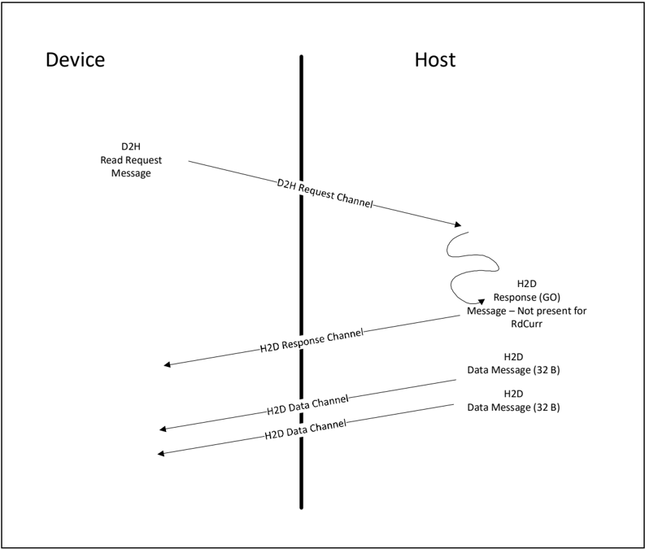

###### 3.2.4.1.3 CXL.cache Read0

CXL.cache Read0 must have a D2H request credit and send a message on the D2H CXL.cache request channel. CXL.cache Read0 requests receive a response message but no data messages. The response message is directed at the device entry indicated in the initial D2H request message's CQID value. Once the GO message is received for

these requests, they can be considered complete and the entry deallocated from the device. A data message must not be sent by the Host for these transactions. Most special cycles (e.g., CLFlush) and other miscellaneous requests fall into this category. Details in Table 18.

The following figure shows the elements required to complete a CXL.cache Read0 transaction.

###### Figure 22. CXL.cache Read0 Behavior

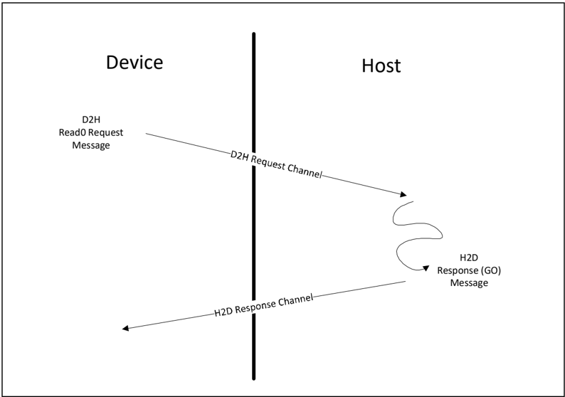

###### 3.2.4.1.4 CXL.cache Write

CXL.cache Write must have a D2H request credit before sending a request message on the D2H CXL.cache request channel. Once the Host has received the request message, it is required to send either two separate or one merged GO-I and WritePull message. The GO message must never arrive at the device before the WritePull but it can arrive at the same time in the combined message. If the transaction requires posted semantics then a combined GO-I/WritePull message can be used. If the transaction requires non-posted semantics, then WritePull will be issued first followed by the GO-I when the non-posted write is globally observed.

Upon receiving the GO-I message, the device will consider the store done from a memory ordering and cache coherency perspective, giving up snoop ownership of the cacheline (if the CXL.cache message is an Evict).

The WritePull message triggers the device to send data messages to the Host totaling exactly 64 bytes of data, though any number of byte enables can be set.

A CXL.cache write transaction is considered complete by the device once the device has received the GO-I message, and has sent the required data messages. At this point the entry can be deallocated from the device.

The Host considers a write to be done once it has received all 64 bytes of data, and has sent the GO-I response message. All device writes and Evicts fall into the CXL.cache Write semantic.

See Section Multiple Evicts to the Same Cache Line for more information on restrictions around multiple active write transactions.

Figure 23 shows the elements required to complete a CXL.cache Write transaction (that matches posted behavior). The WritePull (or the combined GO_WritePull) message triggers the data messages. There are restrictions on Snoops and WritePulls. See Section Device/Host Snoop/WritePull Assumptions for more details.

Figure 24 shows a case where the WritePull is a separate message from the GO (for example: strongly ordered uncacheable write).

Figure 25 shows the Host FastGO plus ExtCmp responses for weakly ordered write requests.

###### Figure 23. CXL.cache Device to Host Write Behavior

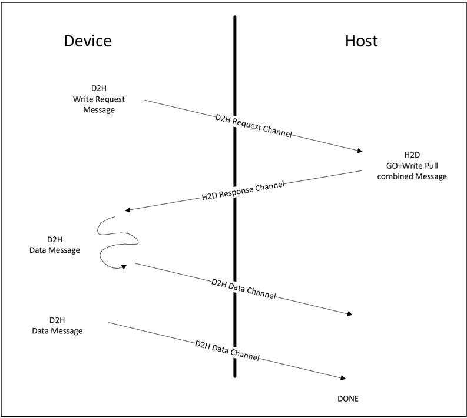

###### Figure 24. CXL.cache WrInv Transaction

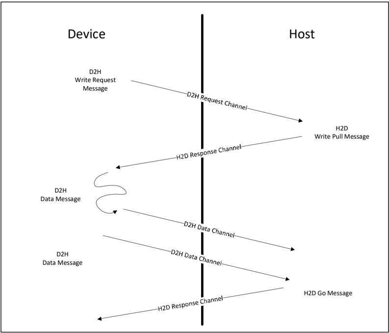

###### Figure 25. WOWrInv/F with FastGO/ExtCmp

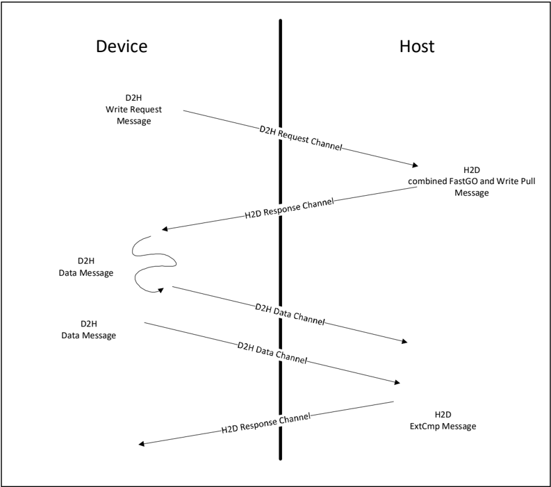

###### 3.2.4.1.5 CXL.cache Read0-Write Semantics

CXL.cache Read0-Write requests must have a D2H request credit before sending a request message on the D2H CXL.cache request channel. Once the Host has received the request message, it is required to send one merged GO-I and WritePull message.

The WritePull message triggers the device to send the data messages to the Host, which together transfer exactly 64 bytes of data though any number of byte enables can be set.

A CXL.cache Read0-write transaction is considered complete by the device once the device has received the GO-I message, and has sent the all required data messages. At this point the entry can be deallocated from the device.

The Host considers a read0-write to be done once it has received all 64 bytes of data, and has sent the GO-I response message. ItoMWr falls into the Read0-Write category.

###### Figure 26. CXL.cache Read0-Write Semantics

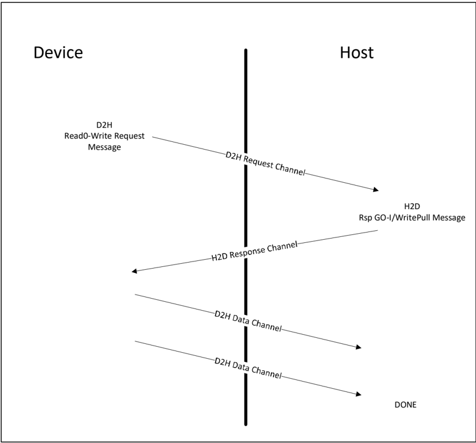

Table 18 summarizes all the opcodes available from Device to Host.

###### Table 18. CXL.cache. - Device to Host Requests

| CXL.cache Opcode   | Semantic    |   Opcode |
|--------------------|-------------|----------|
| RdCurr             | Read        |    00001 |
| RdOwn              | Read        |    00010 |
| RdShared           | Read        |    00011 |
| RdAny              | Read        |    00100 |
| RdOwnNoData        | Read0       |    00101 |
| ItoMWr             | Read0-Write |    00110 |
| MemWr              | Read0-Write |    00111 |
| CLFlush            | Read0       |    01000 |
| CleanEvict         | Write       |    01001 |
| DirtyEvict         | Write       |    01010 |
| CleanEvictNoData   | Write       |    01011 |
| WOWrInv            | Write       |    01100 |
| WOWrInvF           | Write       |    01101 |
| WrInv              | Write       |    01110 |
| CacheFlushed       | Read0       |    10000 |

###### 3.2.4.1.6 RdCurr

These are full cacheline read requests from the device for lines to get the most current data, but not change the existing state in any cache, including in the Host. The Host does not need to track the cacheline in the device that issued the RdCurr. RdCurr gets a data but no GO. The device receives the line in the Invalid state which means it gets one use of the line and cannot cache it.

###### 3.2.4.1.7 RdOwn

These are full cacheline reads requests from the device for lines to be cached in any writeable state. Typically, RdOwn request receives the line in Exclusive (GO-E) or Modified (GO-M) state. Lines in Modified state must not be dropped, and have to be written back to the Host.

Under error conditions, a RdOwn request may receive the line in Invalid (GO-I) or Error (GO-Err) state. Both will return synthesized data of all1s. The device is responsible for handling the error appropriately.

###### 3.2.4.1.8 RdShared

These are full cacheline read requests from the device for lines to cached in Shared state. Typically, RdShared request receives the line in Shared (GO-S) state.

Under error conditions, a RdShared request may receive the line in Invalid (GO-I) or Error (GO-Err) state. Both will return synthesized data of all1s. The device is responsible for handling the error appropriately.

###### 3.2.4.1.9 RdAny

These are full cacheline read requests from the device for lines to cached in any state. Typically, RdAny request receives the line in Shared (GO-S), Exclusive (GO-E) or Modified (GO-M) state. Lines in Modified state must not be dropped, and have to be written back to the Host.

Under error conditions, a RdAny request may receive the line in Invalid (GO-I) or Error (GO-Err) state. Both will return synthesized data of all1s. The device is responsible for handling the error appropriately.

###### 3.2.4.1.10 RdOwnNoData

These are requests to get exclusive ownership of the cacheline address indicated in the address field. The typical response is Exclusive (GO-E).

Under error conditions, a RdOwnNoData request may receive the line in Error (GO-Err) state. The device is responsible for handling the error appropriately.

###### 3.2.4.1.11 ItoMWr

This command requests exclusive ownership of the cacheline address indicated in the address field and atomically writes the cacheline back to the Host. The device guarantees the entire line will be modified, so no data needs to be transferred to the device. The typical response is GO-I-WritePull, which is sent once the request is granted ownership. The device must not retain a copy of the line.

If an error occurs, then GO-Err-WritePull is sent instead. The device sends the data to the Host, which drops it. The device is responsible for handling the error as appropriate.

###### 3.2.4.1.12 MemWr

The command behaves like the ItoMWr in that it atomically requests ownership of a cacheline and then writes a full cacheline back to the fabric. However, it differs from ItoMWr in where the data is written. Only if the command hits in a cache will the data be written there; on a miss the data will be written to directly to memory. The typical response is GO-I-WritePull once the request is granted ownership. The device must not retain a copy of the line.

If an error occurs, then GO-Err-WritePull is sent instead. The device sends the data to the Host, which drops it. The device is responsible for handling the error as appropriate.

###### 3.2.4.1.13 ClFlush

This is a request to the Host to invalidate the cacheline specified in the address field. The typical response is GO-I that will be sent from the Host upon completion in memory.

However, the Host may keep tracking the cacheline in Shared state if the Core has issued a Monitor to an address belonging in the cacheline. Thus, the Device must not rely on CLFlush/GO-I as an only and sufficient condition to flip a cacheline from Host to Device bias mode. Instead, the Device must initiate RdOwnNoData and receive an H2D Response of GO-E before it updates its Bias Table and may subsequently access the cacheline without notifying the Host.

Under error conditions, a ClFlush request may receive the line in the Error (GO-Err) state. The device is responsible for handling the error appropriately.

###### 3.2.4.1.14 CleanEvict

This is a request to the Host to evict a full 64 byte Exclusive cacheline from the device. Typically, CleanEvict receives GO-WritePull or GO-WritePullDrop. Receiving any means the device must relinquish snoop ownership of the line. For GO-WritePull the device will send the data as normal. For GO-WritePullDrop the device simply drops the data.

Once the device has issued this command and the address is subsequently snooped, but before the device has received the GO-WritePull or GO-WritePullDrop, the device must set the Bogus field in all D2H Data messages to indicate the data is now stale.

CleanEvict requests also guarantee to the Host that the device no longer contains any cached copies of this line. Only one CleanEvict from the device may be pending on CXL.cache for any given cacheline address.

CleanEvict is only expected for host-attached memory range of addresses. For deviceattached memory range, the equivalent operation can be completed internally within the device without sending a transaction to the Host.

###### 3.2.4.1.15 DirtyEvict

This is a request to the Host to evict a full 64 byte Modified cacheline from the device. Typically, DirtyEvict receives GO-WritePull from the Host at which point the device must relinquish snoop ownership of the line and send the data as normal.

Once the device has issued this command and the address is subsequently snooped, but before the device has received the GO-WritePull, the device must set the Bogus field in all D2H Data messages to indicate the data is now stale.

DirtyEvict requests also guarantee to the Host that the device no longer contains any cached copies of this line. Only one DirtyEvict from the device may be pending on CXL.cache for any given cacheline address.

In error conditions, a GO-Err-WritePull will be received. The device will send the data as normal, and the Host will drop it. The device is responsible for handling the error as appropriate.

DirtyEvict is only expected for host-attached memory range of addresses. For deviceattached memory range, the equivalent operation can be completed internally within the device without sending a transaction to the Host.

###### 3.2.4.1.16 CleanEvictNoData

This is a request for the device to update the Host that a clean line is dropped in the device. The sole purpose of this request is to update any snoop filters in the Host and no data will be exchanged.

CleanEvictNoData is only expected for host-attached memory range of addresses. For device-attached memory range, the equivalent operation can be completed internally within the device without sending a transaction to the Host.

###### 3.2.4.1.17 WOWrInv

This is a weakly ordered write invalidate line request of 0-63 bytes for write combining type stores. Any combination of byte enables may be set.

Typically, WOWrInv receives a FastGO-WritePull followed by an ExtCmp. Upon receiving the FastGO-WritePull the device sends the data to the Host. For host-attached memory, the Host sends the ExtCmp once the write is complete in memory.

In error conditions, a GO-Err-Writepull will be received. The device will send the data as normal, and the Host will drop it. The device is responsible for handling the error as appropriate. An ExtCmp will still be sent by the Host after the GO-Err in all cases.

###### 3.2.4.1.18 WOWrInvF

Same as WOWrInv (rules and flows), except it is a write of 64 bytes.

###### 3.2.4.1.19 WrInv

This is a write invalidate line request of 0-64 bytes. Typically, WrInv receives a WritePull followed by a GO. Upon getting the WritePull the device sends the data to the Host. The Host sends GO once the write complete in memory (both, host-attached or deviceattached).

In error conditions, a GO-Err is received. The device is responsible for handling the error as appropriate.

###### 3.2.4.1.20 CacheFlushed

This is an indication sent by the device to inform the Host that its caches are flushed, and it no longer contains any cachelines in the Shared, Exclusive or Modified state. The Host can use this information to clear its snoop filters and block snoops to the device and return a GO. Once the device receives the GO, it is guaranteed to not receive any snoops from the Host until the device sends the next cacheable D2H Request.

###### Table 19. D2H Request (Targeting Non Device-Attached Memory) Supported H2D Responses

| D2H Request      | WritePull   | GO_WritePull   | ExtCmp   | GO_WritePull_Drop   | FastGO_WritePull   | GO_ERR_WritePull   | GO-Err   | GO-I   | GO-S   | GO-E   | GO-M   |
|------------------|-------------|----------------|----------|---------------------|--------------------|--------------------|----------|--------|--------|--------|--------|
| CLFlush          |             |                |          |                     |                    |                    | X        | X      |        |        |        |
| RdShared         |             |                |          |                     |                    |                    | X        | X      | X      |        |        |
| RdAny            |             |                |          |                     |                    |                    | X        | X      | X      | X      | X      |
| ItoMWr           |             | X              |          |                     |                    | X                  |          |        |        |        |        |
| MemWr            |             | X              |          |                     |                    | X                  |          |        |        |        |        |
| CacheFlushed     |             |                |          |                     |                    |                    |          | X      |        |        |        |
| RdCurr           |             |                |          |                     |                    |                    |          |        |        |        |        |
| RdOwn            |             |                |          |                     |                    |                    | X        | X      |        | X      | X      |
| RdOwnNoData      |             |                |          |                     |                    |                    | X        |        |        | X      |        |
| CleanEvict       |             | X              |          | X                   |                    |                    |          |        |        |        |        |
| DirtyEvict       |             | X              |          |                     |                    | X                  |          |        |        |        |        |
| CleanEvictNoData |             |                |          |                     |                    |                    |          | X      |        |        |        |
| WOWrInv          |             |                | X        |                     | X                  | X                  |          |        |        |        |        |
| WOWrInvF         |             |                | X        |                     | X                  | X                  |          |        |        |        |        |
| WrInv            | X           |                |          |                     |                    |                    | X        | X      |        |        |        |

For requests targeting device-attached memory, if the region is in Device Bias, no transaction is expected on CXL.cache since the Device can complete those requests internally. If the region is in Host Bias, the table below shows how the device should expect the response.

###### Table 20. D2H Request (Targeting Device-Attached Memory) Supported Responses

| D2H Request      | Response on CXL.mem               | Response on CXL.cache                                                         |
|------------------|-----------------------------------|-------------------------------------------------------------------------------|
| RdCurr           | MemRdFwd (For Success Conditions) | GO-Err Bit set in H2D DH, Synthesized Data with all 1s (For Error Conditions) |
| RdOwn            | MemRdFwd (For Success Conditions) | GO-Err on H2D Response, Synthesized Data with all 1s (For Error Conditions)   |
| RdShared         | MemRdFwd (For Success Conditions) | GO-Err on H2D Response, Synthesized Data with all 1s (For Error Conditions)   |
| RdAny            | MemRdFwd (For Success Conditions) | GO-Err on H2D Response, Synthesized Data with all 1s (For Error Conditions)   |
| RdOwnNoData      | MemRdFwd (For Success Conditions) | GO-Err on H2D Response, Synthesized Data with all 1s (For Error Conditions)   |
| ItoMWr           | None                              | Same as host-attached memory                                                  |
| MemWr            | None                              | Same as host-attached memory                                                  |
| CLFlush          | MemRdFwd (For Success Conditions) | GO-Err on H2D Response (For Error Conditions)                                 |
| CleanEvict       | NA                                | NA                                                                            |
| DirtyEvict       | NA                                | NA                                                                            |
| CleanEvictNoData | NA                                | NA                                                                            |
| WOWrInv          | MemWrFwd (For Success Conditions) | GO_ERR_WritePull on H2D Response (For Error Conditions)                       |
| WOWrInvF         | MemWrFwd (For Success Conditions) | GO_ERR_WritePull on H2D Response (For Error Conditions)                       |
| WrInv            | None                              | Same as host-attached memory                                                  |
| CacheFlushed     | None                              | Same as host-attached memory                                                  |

CleanEvict, DirtyEvict and CleanEvictNoData targeting device-attached memory should always be completed internally by the device, regardless of bias state. For D2H Requests that receive a response on CXL.mem, the CQID associated with the CXL.cache request is reflected in the Tag of the CXL.mem MemRdFwd or MemWrFwd command. For MemRdFwd, the caching state of the line is reflected in the MetaValue field as described in [Table 32](#table-32-meta0-state-value-definition-type-2-devices-1).

##### 3.2.4.2 Device to Host Response

Responses are directed at the Host entry indicated in the UQID field in the original H2D request message.

###### Table 21. D2H Response Encodings

| Device CXL.cache Rsp   |   Opcode |
|------------------------|----------|
| RspIHitI               |    00100 |
| RspVHitV               |    00110 |
| RspIHitSE              |    00101 |
| RspSHitSE              |    00001 |
| RspSFwdM               |    00111 |
| RspIFwdM               |    01111 |
| RspVFwdV               |    10110 |

###### 3.2.4.2.1 RspIHitI

In general, this is the response that a device provides to a snoop when the line was not found in any caches. If the device returns RspIHitI for a snoop, the Host can assume the line has been cleared from that device.

###### 3.2.4.2.2 RspVHitV

In general, this is the response that a device provides to a snoop when the line was hit in the cache and no state change occurred. If the device returns an RspVHitV for a snoop, the Host can assume a copy of the line is present in one or more places in that device.

###### 3.2.4.2.3 RspIHitSE

In general, this is the response that a device provides to a snoop when the line was hit in a clean state in at least one cache and is now invalid. If the device returns an RspIHitSE for a snoop, the Host can assume the line has been cleared from that device.

###### 3.2.4.2.4 RspSHitSE

In general, this is the response that a device provides to a snoop when the line was hit in a clean state in at least one cache and is now downgraded to shared state. If the device returns an RspSHitSE for a snoop, the Host should assume the line is still in the device.

###### 3.2.4.2.5 RspSFwdM

This response indicates to the Host that the line being snooped is now in S state in the device, after having hit the line in Modified state. The device may choose to downgrade the line to Invalid. This response also indicates to the Host snoop tracking logic that 64 bytes of data will be transferred on the D2H CXL.cache Data Channel to the Host data buffer indicated in the original snoop's destination (UQID).

###### 3.2.4.2.6 RspIFwdM

(aka HITM) This response indicates to the Host that the line being snooped is now in I state in the device, after having hit the line in Modified state. The Host may now assume the device contains no more cached copies of this line. This response also indicates to the Host snoop tracking logic that 64 bytes of data will be transferred on the D2H CXL.cache Data Channel to the Host data buffer indicated in the original snoop's destination (UQID).

###### 3.2.4.2.7 RspVFwdV

This response indicates that the device is returning the current data to the Host and leaving the state unchanged. The Host must only forward the data to the requestor since there is no state information.

##### 3.2.4.3 Host to Device Requests

Snoops from the Host need not gain any credits besides local H2D request credits. The device will always send a Snoop Response message on the D2H CXL.cache Response channel. If the response is of the Rsp*Fwd* format, then the device must respond with 64 bytes of data via the D2H Data channel, directed at the UQID from the original snoop request message. If the response is not Rsp*Fwd*, the Host can consider the request complete upon receiving all of the snoop response messages. The device can stop tracking the snoop once the response has been sent for non-data forwarding cases, or after both the last chunk of data has been sent and the response has been sent.

The figure below shows the elements required to complete a CXL.cache snoop. Note that the response message can be received by the Host with any relative order with the data messages. The byte enable field is always all 1s for Snoop data transfers.

###### Figure 27. CXL.cache Snoop Behavior

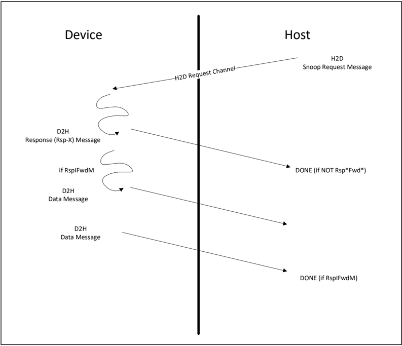

###### Table 22. CXL.cache - Mapping of Host to Device Requests and Responses

|         | Opcode   | RspIHitI   | RspVhitV   | RspSHitSE   | RspIHitSE   | RspSFwdM   | RspIFwdM   | RspVFwdV   |
|---------|----------|------------|------------|-------------|-------------|------------|------------|------------|
| SnpData | '001     | X          |            | X           |             | X          | X          |            |
| SnpInv  | '010     | X          |            |             | X           |            | X          |            |
| SnpCurr | '011     | X          | X          | X           |             | X          | X          | X          |

###### 3.2.4.3.1 SnpData

These are snoop requests from the Host for lines that are intended to be cached in either Shared or Exclusive state at the requester (the Exclusive state can be cached at the requester only if all devices respond with RspI). This type of snoop is typically triggered by data read requests. A device that receives this snoop must either invalidate or downgrade all cachelines to Shared state. If the device holds dirty data it must return it to the Host.

###### 3.2.4.3.2 SnpInv

These are snoop requests from the Host for lines that are intended to be granted ownership and Exclusive state at the requester. This type of snoop is typically triggered by write requests. A device that receives this snoop must invalidate all cachelines. If the device holds dirty data it must return it to the Host.

###### 3.2.4.3.3 SnpCur

This snoop gets the current version of the line, but doesn't require change of any cache state in the hierarchy. It is only sent on behalf of the RdCurr request. If the device holds data in Modified state it must return it to the Host. The cache state can remain unchanged in both the device and Host, and the Host should not update its caches.

##### 3.2.4.4 Host to Device Response

###### Table 23. H2D Response Opcode Encodings

| H2D Response Class   |   Encoding | RspData    |
|----------------------|------------|------------|
| WritePull            |       0001 | UQID       |
| GO                   |       0100 | MESI       |
| GO_WritePull         |       0101 | UQID       |
| ExtCmp               |       0110 | Don't Care |
| GO_WritePull_Drop    |       1000 | UQID       |
| Fast_GO              |       1100 | Don't Care |
| Fast_GO_WritePull    |       1101 | UQID       |
| GO_ERR_WritePull     |       1111 | UQID       |

###### 3.2.4.4.1 WritePull

This response tells the device to send the write data to the Host, but not to change the state of the line. This is used for WrInv where the data is needed before the GO-I can be sent. This is because GO-I is the notification that the write was completed by I/O.

###### 3.2.4.4.2 GO

The Global Observation (GO) message conveys that read requests are coherent and that write requests are coherent and consistent. It is an indication that the transaction has been observed by the system device and the MESI state that is encoded in the RspType field indicates what state the data associated with the transaction should be put in for the requester's caches. Details in [Table 14](#table-14-cxlcache-h2d-response-fields).

If the Host returns Modified state to the device, then the device is responsible for the dirty data and cannot drop the line without writing it back to the Host.

If the Host returns Invalid or Error state to the device, then the device must use the data at most once and not cache the data. Error responses to reads and cacheable write requests (for example, RdOwn or ItoMWr) will always be the result of an abort condition, so modified data can be safely dropped in the device.

###### 3.2.4.4.3 GO_WritePull

This is a combined GO + WritePull message. No cache state is transferred to the device. The GO+WritePull message is used for posted write types.

###### 3.2.4.4.4 ExtCmp

This response indicates that the data that was previously locally ordered (FastGO) has been observed throughout the system. Most importantly, accesses to memory will return the most up to date data.

###### 3.2.4.4.5 GO_WritePull_Drop

This message has the same semantics as Go_WritePull, except that the device should not send data to the Host. This response can be sent in place of GO_WritePull when the Host determines that the data is not required. This response will never be sent for partial writes since the byte enables will always need to be transferred.

###### 3.2.4.4.6 Fast_GO

Similar to GO, but only indicates that the request is locally observed. There will be a later ExtCmp message when the transaction is fully observable in memory. Devices that do not implement the Fast_GO feature may ignore this message and wait for the ExtCMP.

###### 3.2.4.4.7 Fast_GO_WritePull

Similar to GO_WritePull, but only indicates that the request is locally observed. There will be a later ExtCmp message when the transaction is fully observable in memory. Devices that do not implement the Fast_GO feature may ignore the GO message and wait for the ExtCMP. Data must always be sent for the WritePull though. No cache state is transferred to the device.

###### 3.2.4.4.8 GO_ERR_WritePull

Similar to GO_WritePull, but indicates that there was an error with the transaction that should be handled properly in the device. Data must be sent to the Host for the WritePull, and the Host will drop the data. No cache state is transferred to the device (assumed Error). An ExtCmp is still sent if it is expected by the originating request.

#### 3.2.5 Cacheability Details and Request Restrictions

These details and restrictions apply to all devices.

##### 3.2.5.1 GO-M Responses

GO-M responses from the Host indicate that the device is being granted the sole copy of modified data. The device must cache this data and write it back when it is done.

##### 3.2.5.2 Device/Host Snoop-GO-Data Assumptions

When the Host returns a GO response to a device, the expectation is that a snoop arriving to the same address of the request receiving the GO would see the results of that GO. For example, if the Host sends GO-E for an RdOwn request followed by a snoop to the same address immediately afterwards, then one would expect the device to transition the line to M state and reply with an RspIFwdM response back to the Host. In order to implement this principle, CXL.cache link layer ensures that the device will receive the two messages in separate slots to make the order completely unambiguous.

When the Host is sending a snoop to the device, the requirement is that no GO response will be sent to any requests with that address in the device until after the Host has received a response for the snoop and all implicit writeback (IWB) data (dirty data forwarded in response to a snoop) has been received.

When the Host returns data to the device for a read type request, and GO for that request has not yet been sent to the device, the Host may not send a snoop to that address until after the GO message has been sent. Since the new cache state is encoded in the response message for reads, sending a snoop to an address without having received GO, but after having received data, is ambiguous to the device as to what the snoop response should be in that situation.

Fundamentally, the GO that is associated with a read request also applies to the data returned with that request. Sending data for a read request implies that data is valid, meaning the device can consume it even if the GO has not yet arrived. The GO will arrive later and inform the device what state to cache the line in (if at all) and whether or not the data was the result of an error condition (such as hitting an address region the device was not allowed to access).

##### 3.2.5.3 Device/Host Snoop/WritePull Assumptions

The device requires that the Host cannot have both a WritePull and H2D Snoop active on CXL.cache to a given 64 byte address. The Host may not launch a snoop to a 64 byte address until all WritePull data from that address has been received by the Host. Conversely, the Host may not launch a WritePull for a write until the Host has received the snoop response (including data in case of Rsp*Fwd*) for any snoops to the pending writes address. Any violation of these requirements will mean that the Bogus field on the D2H Data channel will be unreliable.

##### 3.2.5.4 Snoop Responses and Data Transfer on CXL.cache Evicts

In order to snoop cache evictions (for example, DirtyEvict) and maintain an orderly transfer of snoop ownership from the device to the Host, cache evictions on CXL.cache must adhere to the following protocol.

If a device Evict transaction has been issued on the CXL.cache D2H request channel, but has not yet processed its WritePull from the Host, and a snoop hits the WB, the device must track this snoop hit. When the device begins to process the WritePull, the device must set the Bogus field in all of the D2H data messages sent to the Host. The intent is to communicate to the Host that the request data was already sent as IWB data, so the data from the Evict is potentially stale.

##### 3.2.5.5 Multiple Snoops to the Same Address

The Host is only allowed to have one snoop outstanding to a given cacheline address to a given device at one time. The Host must wait until it has received both the snoop response and all IWB data (if any) before dispatching the next snoop to that address.

##### 3.2.5.6 Multiple Reads to the Same Cache Line

Multiple read requests (cacheable or uncacheable) to the same cacheline are allowed only in the following specific cases where host tracking state is consistent regardless of the order requests are processed. The Host can freely reorder requests, so the device is responsible for ordering requests when required. For host memory, multiple RdCurr and/or CLFlush are allowed. For these commands the device ends in I-state, so there is no inconsistent state possible for host tracking of a device cache. With Type 2 devices, in addition to RdCurr and/or CLFlush, multiple RdOwnNoData (bias flip request) is allowed for device attached memory. This case is allowed because with device attached memory the host does not track the device's cache so re-ordering in the host will not create ambiguous state between device and host.

##### 3.2.5.7 Multiple Evicts to the Same Cache Line

Multiple Evicts to the same cacheline are not allowed. All Evict messages from the Device provide a guarantee to the Host that the evicted cacheline will no longer be present in the Device's caches.

Thus, it is a coherence violation send another Evict for the same cacheline without an intervening cacheable Read/Read0 request to that address.

##### 3.2.5.8 Multiple Write Requests to the Same Cache Line

Multiple WrInv/WOWrInv/ItoMWr/MemWr to the same cacheline are allowed to be outstanding on CXL.cache. The host or switch can freely reorder requests, and the Device may receive corresponding H2D Responses in reordered fashion. However, it is generally recommended that the Device should issue no more than one outstanding Write request for a given cacheline, and order multiple write requests to the same cacheline one after another whenever stringent ordering is warranted.

##### 3.2.5.9 Normal Global Observation (GO)

Normal Global Observation (GO) responses are sent only after the Host has guaranteed that request will have next ownership of the requested cacheline. GO messages for requests carry the cacheline state permitted through the MESI state or indicate that the data should only be used once and whether or not an error occurred.

##### 3.2.5.10 Relaxed Global Observation (FastGO)

FastGO is only allowed for requests that do not require strict ordering. The Host may return the FastGO once the request is guaranteed next ownership of the requested cacheline within the socket, but not necessarily in the system. Requests that receive a FastGO response and require completion messages are usually of the write combining memory type and the ordering requirement is that there will be a final completion (ExtCmp) message indicating that the request is at the stage where it is fully observed throughout the system.

##### 3.2.5.11 Evict to Device-Attached Memory

Device Evicts to device-attached memory are not allowed on CXL.cache. The device is only allowed to issue WrInv, WOWrInv* to device-attached memory.

##### 3.2.5.12 Memory Type on CXL.cache

To source requests on CXL.cache, devices need to get the Host Physical Address (HPA) from the Host by means of an ATS request on CXL.io. Due to memory type restrictions, on the ATS completion, the Host indicates to the device if a HPA can only be issued on CXL.io as described in [Section 3.1.6](#316-memory-type-indication-on-ats). The device is not allowed to issue requests to such HPAs on CXL.cache.

##### 3.2.5.13 General Assumptions

1. The Host will NOT preserve ordering of the CXL.cache requests as delivered by the device. The device must maintain the ordering of requests for the case(s) where ordering matters. For example, if D2H memory writes need to be ordered with respect to a MSI (on CXL.io), it is up to the device to implement the ordering. This is made possible by the non-posted nature of all requests on CXL.cache.
2. The order chosen by the Host will be conveyed differently for reads and writes. For reads, a Global Observation (GO) message conveys next ownership of the addressed cacheline; the data message conveys ordering with respect to other transactions. For writes, the GO message conveys both next ownership of the line and ordering with respect to other transactions.
3. The device may cache ownership and internally order writes to an address if a prior read to that address received either GO-E or GO-M.
4. For reads from the device, the Host transfers ownership of the cacheline with the GO message, even if the data response has not yet been received by the device. The device must respond to a snoop to a cacheline which has received GO, but if data from the current transaction is required (e.g., a RdOwn to write the line) the data portion of the snoop is delayed until the data response is received.
5. The Host must not send a snoop for an address where the device has received a data response for a previous read transaction but has not yet received the GO. Refer to [Section 3.2.5.2](#3252-devicehost-snoop-go-data-assumptions)
6. Write requests (other than Evicts) such as WrInv, WOWrInv*, ItoMWr and MemWr will never respond to WritePulls with data marked as Bogus.
7. The Host must not send two cacheline data responses to the same device request. The device may assume one-time use ownership (based on the request) and begin processing for any part of a cacheline received by the device before the GO message. Final state information will arrive with the GO message, at which time the device can either cache the line or drop it depending on the response.
8. For a given transaction, H2D Data transfers must come in consecutive packets in natural order with no interleaved transfers from other lines.
9. D2H Data transfer of a cacheline must come in consecutive packets with no interleaved transfers from other lines. The data must come in natural chunk order,

- that is, 64B transfers must complete the lower 32B half first, since snoops are always cacheline aligned.
10. Device snoop responses in D2H Response must not be dependent on any other channel or on any other requests in the device besides the availability of credits in the D2H Response channel. The Host must guarantee that the responses will eventually be serviced and return credits to the device.
11. The Host must not send a second snoop request to an address until all responses, plus data if required, for the prior snoop are collected.
12. H2D Response and H2D Data messages to the device must drain without the need for any other transaction to make progress.
13. The Host must not return GO-M for data that is not actually modified with respect to memory.
14. The Host must not write unmodified data back to memory.
15. Except for WOWrInv and WOWrInF, all other writes are strongly ordered

##### 3.2.5.14 Buried Cache State Rules

Whenever the Device initiates a new request on CXL.Cache protocol, Buried Cache state refers to the state of the cacheline registered in the Device's Coherency engine (DCOH) for which a particular request is being sent.

## Buried Cache State Rules:

- The Device must not issue a Read for a cacheline if it is buried in Modified, Exclusive, or Shared state.
- The Device must not issue RdOwnNoData if the cacheline is buried in Modified or Exclusive state. The Device may request for ownership in Exclusive state as an upgrade request from Shared state.
- The Device must not issue a Read0-Write if the cacheline is buried in Modified, Exclusive, or Shared state.
- All *Evict opcodes must adhere to apropos use case. For example, the Device is allowed to issue DirtyEvict for a cacheline only when it is buried in Modified state. For performance benefits, it is recommended that the Device should not silently drop a cacheline in Exclusive or Shared state and instead use CleanEvict* opcodes towards the Host.
- The CacheFlushed Opcode is not specific to a cacheline, it is an indication to the Host that all of the Device's caches are flushed. Thus, the Device must not issue CacheFlushed if there is any cacheline buried in Modified, Exclusive, or Shared state.

[Table 24](#table-24-allowed-opcodes-per-buried-cache-state) describes which Opcodes in D2H requests are allowed for a given Buried Cache State:

### Table 24. Allowed Opcodes Per Buried Cache State

| D2H Requests     | D2H Requests   | Buried Cache State   | Buried Cache State   | Buried Cache State   | Buried Cache State   |
|------------------|----------------|----------------------|----------------------|----------------------|----------------------|
| Opcodes          | Semantic       | Modified             | Exclusive            | Shared               | Invalid              |
| RdCurr           | Read           |                      |                      |                      | X                    |
| RdOwn            | Read           |                      |                      |                      | X                    |
| RdShared         | Read           |                      |                      |                      | X                    |
| RdAny            | Read           |                      |                      |                      | X                    |
| RdOwnNoData      | Read0          |                      |                      | X                    | X                    |
| ItoMWr           | Read0-Write    |                      |                      |                      | X                    |
| MemWr            | Read0-Write    |                      |                      |                      | X                    |
| CLFlush          | Read0          |                      |                      |                      | X                    |
| CleanEvict       | Write          |                      | X                    |                      |                      |
| DirtyEvict       | Write          | X                    |                      |                      |                      |
| CleanEvictNoData | Write          |                      | X                    | X                    |                      |
| WOWrInv          | Write          |                      |                      |                      | X                    |
| WOWrInvF         | Write          |                      |                      |                      | X                    |
| WrInv            | Write          |                      |                      |                      | X                    |
| CacheFlushed     | Read0          |                      |                      |                      | X                    |

### 3.3 CXL.mem

#### 3.3.1 Introduction

The CXL Memory Protocol is called CXL.mem, and it is a transactional interface between the CPU and Memory. It uses the phy and link layer of Compute Express Link (CXL) when communicating across dies. The protocol can be used for multiple different Memory attach options including when the Memory Controller is located in the Host CPU, when the Memory Controller is within an Accelerator device, or when the Memory Controller is moved to a memory buffer chip. It applies to different Memory types (volatile, persistent, etc.) and configurations (flat, hierarchical, etc.) as well.

The coherency engine in the CPU interfaces with the Memory (Mem) using CXL.mem requests and responses. In this configuration, the CPU coherency engine is regarded as the CXL.mem Master and the Mem device is regarded as the CXL.mem Subordinate. The CXL.mem Master is the agent which is responsible for sourcing CXL.mem requests (reads, writes, etc.) and a CXL.mem Subordinate is the agent which is responsible for responding to CXL.mem requests (data, completions, etc.).

When the Subordinate is an Accelerator, CXL.mem protocol assumes the presence of a device coherency engine (DCOH). This agent is assumed to be responsible for implementing coherency related functions such as snooping of device caches based on CXL.mem commands and update of Meta Data fields. Support for memory with Meta Data is optional but this needs to be negotiated with the Host in advance. The negotiation mechanisms are outside the scope of this specification. If Meta Data is not supported by device-attached memory, the DCOH will still need to use the Host supplied Meta Data updates to interpret the commands. If Meta Data is supported by device-attached memory, it can be used by Host to implement a coarse snoop filter for CPU sockets.

CXL.mem transactions from Master to Subordinate are called 'M2S' and transactions from Subordinate to Master are called 'S2M'.

Within M2S transactions, there are two message classes:

- Request without data - generically called Requests (Req)
- Request with Data - (RwD)

Similarly, within S2M transactions, there are two message classes:

- Response without data - generically called No Data Response (NDR)
- Response with data - generically called Data Response (DRS)

The next sections describe the above message classes and opcodes in detail.

#### 3.3.2 QoS Telemetry for Memory

QoS Telemetry for Memory is a mechanism for memory devices to indicate their current load level (DevLoad) in each response message for CXL.mem requests. This enables the host to meter the rate of CXL.mem requests to portions of devices, individual devices, or groups of devices as a function of their load level, optimizing the performance of those memory devices while limiting fabric congestion. This is especially important for CXL hierarchies containing multiple memory types (e.g., DRAM and persistent memory) and/or Multi-Logical-Device (MLD) components.

Certain aspects of QoS Telemetry are mandatory for current CXL memory devices while other aspects are optional. CXL switches have no unique requirements for supporting QoS Telemetry. It is strongly recommended for hosts to support QoS Telemetry as guided by the reference model contained in this section.

##### 3.3.2.1 QoS Telemetry Overview

The overall goal of QoS Telemetry is for memory devices to provide immediate and ongoing DevLoad feedback to their associated hosts, for use in dynamically adjusting host request rate throttling. If a device or set of devices become overloaded, the associated hosts increase their amount of request rate throttling. If such devices become underutilized, the associated hosts reduce their amount of request rate throttling. QoS Telemetry is architected to help hosts avoid overcompensating or undercompensating.

Host memory request rate throttling is optional and primarily implementation specific.

###### Table 25. Impact of DevLoad Indication on Host Request Rate Throttling

| DevLoad Indication Returned in Responses   | Host Request Rate Throttling        |
|--------------------------------------------|-------------------------------------|
| Light Load                                 | Reduce throttling (if any) soon     |
| Optimal Load                               | Make no change to throttling        |
| Moderate Overload                          | Increase throttling immediately     |
| Severe Overload                            | Invoke heavy throttling immediately |

To accommodate memory devices supporting multiple types of memory more optimally, a device is permitted to implement multiple QoS Classes , which are identified sets of traffic, between which the device supports differentiated QoS and significant performance isolation. For example, a device supporting both DRAM and persistent memory might implement two QoS Classes, one for each type of supported memory. Providing significant performance isolation may require independent internal resources; e.g., individual request queues for each QoS Class.

This version of the specification does not provide architected controls for providing bandwidth management between device QoS Classes.

MLDs provide differentiated QoS on a per-LD basis. MLDs have architected controls specifying the allocated bandwidth fraction for each LD when the MLD becomes overloaded. When the MLD is not overloaded, LDs can use more than their allocated bandwidth fraction, up to specified fraction limits based on maximum sustained device bandwidth.

The DevLoad indication from CXL 1.1 memory devices will always indicate Light Load, allowing those devices to operate as best they can with hosts that support QoS Telemetry, though they cannot have their memory request rate actively metered by the host. Light Load is used instead of Optimal Load in case any CXL 1.1 devices share the same host throttling range with current memory devices. If 1.1 devices were to indicate Optimal Load, they would overshadow the DevLoad of any current devices indicating Light Load.

##### 3.3.2.2 Reference Model for Host Support of QoS Telemetry

Host support for QoS Telemetry is strongly recommended but not mandatory.

QoS Telemetry provides no architected controls for host QoS Telemetry. However, if a host implements independent throttling for multiple distinct sets of memory devices below a given Root Port, the throttling must be based on HDM ranges, which are referred to as host throttling ranges.

The reference model in this section covers recommended aspects for how a host should support QoS Telemetry. Such aspects are not mandatory, but they should help maximize the effectiveness of QoS Telemetry in optimizing memory device performance while providing differentiated QoS and reducing CXL fabric congestion.

Each host is assumed to support distinct throttling levels on a throttling-range basis, represented by Throttle[Range]. Throttle[Range] is periodically adjusted by conceptual parameters NormalDelta &amp; SevereDelta. During each sampling period for a given Throttle[Range], the host records the highest DevLoad indication reported for that throttling range, referred to as LoadMax.

###### Table 26. Recommended Host Adjustment to Request Rate Throttling

| LoadMax Recorded by Host   | Recommended Host Adjustment to Request Rate Throttling   |
|----------------------------|----------------------------------------------------------|
| Light Load                 | Throttle[Range] decremented by NormalDelta               |
| Optimal Load               | Throttle[Range] unchanged                                |
| Moderate Overload          | Throttle[Range] incremented by NormalDelta               |
| Severe Overload            | Throttle[Range] incremented by SevereDelta               |

Any increments or decrements to Throttle[Range] should not overflow or underflow legal values.

Throttle[Range] is expected to be adjusted periodically, every tH nanoseconds unless a more immediate adjustment is warranted. The tH parameter should be configurable by platform-specific software, and ideally configurable on a per-throttling-range basis. When tH expires, the host should update Throttle[Range] based on LoadMax, as shown in [Table 26](#table-26-recommended-host-adjustment-to-request-rate-throttling), then reset LoadMax to its minimal value.

Round-trip fabric time is the sum of the time for a request message to travel from host to device, plus the time for a response message to travel from device to host. The optimal value for tH is anticipated to be a bit larger than the average round-trip fabric time for the associated set of devices; e.g., a few hundred nanoseconds. To avoid overcompensation by the host, time is needed for the received stream of DevLoad indications in responses to reflect the last Throttle[Range] adjustment before the host makes a new adjustment.

If the host receives a Moderate Overload or Severe Overload indication, it is strongly recommended for the host to make an immediate adjustment in throttling, without waiting for the end of the current tH sampling period. Following that, the host should reset LoadMax and then wait tH nanoseconds before making an additional throttling adjustment, in order to avoid overcompensating.

##### 3.3.2.3 Memory Device Support for QoS Telemetry

###### 3.3.2.3.1 QoS Telemetry Register Interfaces

An MLD must support a specified set of MLD commands from the MLD Component Command Set as documented in [Section 7.6.7.5](#7675-mld-component-command-set). These MLD commands provide access to a variety of architected capability, control, and status registers for a Fabric Manager to use via the FM API.

If an SLD supports the Memory Device Command set, it must support a specified set of SLD QoS Telemetry commands. See [Section 8.2.9.5](#8295-memory-device-commands). These SLD commands provide access to a variety of architected capability, control, and status fields for management by system software via the CXL Device Register interface.

Each 'architected QoS Telemetry' register is one that is accessible via the above mentioned MLD commands, SLD commands, or both.

###### 3.3.2.3.2 Memory Device QoS Class Support

Each CXL memory device may support one or more QoS Classes. The anticipated typical number is one to four, but higher numbers are not precluded. If a device supports only one type of media, it may be common for it to support one QoS Class. If a device supports two types of media, it may be common for it to support two QoS Classes. A device supporting multiple QoS Classes is referred to as a multi-QoS device.

This version of the specification does not provide architected controls for providing bandwidth management between device QoS Classes. Still, it is strongly recommended that multi-QoS devices track and report DevLoad indications for different QoS Classes independently, and that implementations provide as much performance isolation between different QoS Classes as possible.

###### 3.3.2.3.3 Memory Device Internal Loading (IntLoad)

A CXL memory device must continuously track its internal loading, referred to as IntLoad. A multi-QoS device should do so on a per-QoS-Class basis.

A device must determine IntLoad based at least on its internal request queuing. For example, a simple device may monitor the instantaneous request queue depth to determine which of the four IntLoad indications to report. It may also incorporate other internal resource utilizations, as summarized in [Table 27](#table-27-factors-for-determining-intload).

###### Table 27. Factors for Determining IntLoad

| IntLoad           | Queuing Delay Inside Device   | Device Internal Resource Utilization            |
|-------------------|-------------------------------|-------------------------------------------------|
| Light Load        | Minimal                       | Readily handles more requests                   |
| Optimal Load      | Modest to Moderate            | Optimally utilized                              |
| Moderate Overload | Significant                   | Limiting throughput and/or degrading efficiency |
| Severe Overload   | Very High                     | Heavily overloaded and/or degrading efficiency  |

The actual method of IntLoad determination is device-specific, but it is strongly recommended that multi-QoS devices implement separate request queues for each QoS Class. For complex devices, it is recommended for them to determine IntLoad based on internal resource utilization beyond just request queue depth monitoring.

Though the IntLoad described in this section is a primary factor in determining which DevLoad indication is returned in device responses, there are other factors that may come into play, depending upon the situation. See [Section 3.3.2.3.4](#33234-egress-port-backpressure) and [Section 3.3.2.3.5](#33235-temporary-throughput-reduction).

###### 3.3.2.3.4 Egress Port Backpressure

Even under a consistent Light Load, a memory device may experience flow control backpressure at its egress port. This is readily caused if an RP is oversubscribed by multiple memory devices below a switch. Prolonged egress port backpressure usually indicates that one or more upstream traffic queues between the device and the RP are full, and the delivery of responses from the device to the host is significantly delayed. This makes the QoS Telemetry feedback loop less responsive and the overall mechanism less effective. Egress Port Backpressure is an optional normative mechanism to help mitigate the negative effects of this condition.

## IMPLEMENTATION NOTE

Egress Port Backpressure Leading to Larger Request Queue Swings

When the QoS Telemetry feedback loop is less responsive, the device's request queue depth is prone to larger swings than normal.

When the queue depth is increasing, the delay in the host receiving Moderate Overload or Severe Overload indications results in the queue getting fuller than normal, in extreme cases filling completely and forcing the ingress port to exert backpressure to incoming downstream traffic.

When the queue depth is decreasing, the delay in the host receiving Light Load indications results in the queue getting more empty than normal, in extreme cases emptying completely, and causing device throughput to drop unnecessarily.

Use of the Egress Port Backpressure mechanism helps avoid upstream traffic queues between the device and its RP from filling for extended periods, reducing the delay of responses from the device to the host. This makes the QoS Telemetry feedback loop more responsive, helping avoid excessive request queue swings.

The Egress Port Congestion Supported capability bit and the Egress Port Congestion

## IMPLEMENTATION NOTE

Minimizing Head-of-Line Blocking with Upstream Responses from MLDs

When one or more upstream traffic queues become full between the MLD and one or more of its congested RPs, head-of-line (HOL) blocking associated with this congestion can delay or block traffic targeting other RPs that are not congested.

Egress port backpressure for extended periods usually indicates that the ingress port queue in the switch Downstream Port above the device is often full. Responses in that queue targeting congested RPs can block responses targeting uncongested RPs, reducing overall device throughput unnecessarily.

Use of the Egress Port Backpressure mechanism helps reduce the average depth of queues carrying upstream traffic. This reduces the delay of traffic targeting uncongested RPs, increasing overall device throughput.

Enable control bit are architected QoS Telemetry bits, which indicate support for this optional mechanism plus a means to enable or disable it. The architected Backpressure Average Percentage status field returns a current snapshot of the measured egress port average congestion.

QoS Telemetry architects two thresholds for the percentage of time that the egress port experiences flow control backpressure. This condition is defined as the egress port having flits or messages waiting for transmission but is unable to transmit them due to a lack of suitable flow control credits. If the percentage of congested time is greater than or equal to Egress Moderate Percentage, the device may return a DevLoad indication of Moderate Overload. If the percentage of congested time is greater than or equal to Egress Severe Percentage, the device may return a DevLoad indication of Severe Overload. The actual DevLoad indication returned for a given response may be the result of other factors as well.

A hardware mechanism for measuring Egress Port Congestion is described in [Section 3.3.2.3.8](#33238-egress-port-congestion-measurement-mechanism).

###### 3.3.2.3.5 Temporary Throughput Reduction

There are certain conditions under which a device may temporarily reduce its throughput. Envisioned examples include an NVM device undergoing media maintenance, a device cutting back its throughput for power/thermal reasons, and a DRAM device performing refresh. If a device is significantly reducing its throughput capacity for a temporary period, it may help mitigate this condition by indicating Moderate Overload or Severe Overload in its responses shortly before the condition occurs and only as long as really necessary. This is a device-specific optional mechanism.

The Temporary Throughput Reduction mechanism can give proactive advanced warning to associated hosts, which can then increase their throttling in time to avoid the device's internal request queue(s) from filling up and potentially causing ingress port congestion. The optimum amount of time for providing advanced warning is highly device-specific, and a function of several factors, including the current request rate, the amount of device internal buffering, the level/duration of throughput reduction, and the fabric round-trip time.

A device should not use the mechanism unless conditions truly warrant its use. For example, if the device is currently under Light Load, it's probably not necessary or appropriate to indicate an Overload condition in preparation for a coming event. Similarly, a device that indicates an Overload condition should not continue to indicate the Overload condition past the point where it's really needed.

The Temporary Throughput Reduction Supported capability bit and the Temporary Throughput Reduction Enable control bit are architected QoS Telemetry bits, which indicate support for this optional mechanism plus a means to enable or disable it.

## IMPLEMENTATION NOTE

Avoid Unnecessary Use of Temporary Throughput Reduction

Ideally a device should be designed to limit the severity and/or duration of its temporary throughput reduction events enough to where the use of this mechanism is not needed.

###### 3.3.2.3.6 DevLoad Indication by Multi-QoS &amp; Single-QoS SLDs

For SLDs, the DevLoad indication returned in each response is determined by the maximum of the device's IntLoad, Egress Port Congestion state, and Temporary Throughput Reduction state, as detailed in [Section 3.3.2.3.3](#33233-memory-device-internal-loading-intload), [Section 3.3.2.3.4](#33234-egress-port-backpressure), and [Section 3.3.2.3.5](#33235-temporary-throughput-reduction). For example, if IntLoad indicates Light Load, Egress Port Congestion indicates Moderate Overload, and Temporary Throughput Reduction does not indicate an overload, the resulting DevLoad indication for the response is Moderate Overload.

###### 3.3.2.3.7 DevLoad Indication by Multi-QoS &amp; Single-QoS MLDs

For MLDs, the DevLoad indication returned in each response is determined by the same factors as for SLDs, with additional factors used for providing differentiated QoS on a per-LD basis. Architected controls specify the allocated bandwidth for each LD as a fraction of total LD traffic when the MLD becomes overloaded. When the MLD is not overloaded, LDs can use more than their allocated bandwidth fraction, up to specified fraction limits based on maximum sustained device bandwidth, independent of overall LD activity.

Bandwidth utilization for each LD is measured continuously based on current requests being serviced, plus the recent history of requests that have been completed.

Current requests being serviced are tracked by ReqCnt[LD] counters, with one counter per LD. The ReqCnt counter for an LD is incremented each time a request for that LD is received. The ReqCnt counter for an LD is decremented each time a response by that LD is transmitted. ReqCnt reflects instantaneous 'committed' utilization, allowing the rapid reflection of incoming requests, especially when requests come in bursts.

The recent history of requests completed are tracked by CmpCnt[LD, Hist] registers, with one set of 16 Hist registers per LD. An architected configurable Completion Collection Interval control for the MLD determines the time interval over which transmitted responses are counted in the active (newest) Hist register/counter. At the end of each interval, the Hist register values for the LD are shifted from newer to older Hist registers, with the oldest value being discarded, and the active (newest) Hist register/counter being cleared. Further details on the hardware mechanism for CmpCnt[LD, Hist] are described in [Section 3.3.2.3.9](#33239-recent-transmitted-responses-measurement-mechanism).

Controls for LD bandwidth management consist of per-LD sets of registers called QoS Allocation Fraction[LD] and QoS Limit Fraction[LD]. For each LD, QoS Allocation Fraction specifies the fraction of current device utilization allocated for the LD across all its QoS classes. QoS Limit Fraction for each LD specifies the fraction of maximum sustained device utilization as a fixed limit for the LD across all its QoS classes, independent of overall LD activity.

Bandwidth utilization for each LD is based on the sum of its associated ReqCnt and CmpCnt[Hist] counters/registers. CmpCnt[Hist] reflects recent completed requests, and Completion Collection Interval controls how long this period of history covers; i.e., how quickly completed requests are 'forgotten'. CmpCnt reflects recent utilization to help avoid overcompensating for bursts of requests.

Together, ReqCnt &amp; CmpCnt[Hist] provide a simple, fair, &amp; tunable way to compute average utilization. A shorter response history emphasizes instantaneous committed utilization, improving responsiveness. A longer response history smooths the average utilization, reducing overcompensation.

ReqCmpBasis is an architected control register that provides the basis for limiting each LD's utilization of the device, independent of overall LD activity. Since ReqCmpBasis is compared against the sum of ReqCnt[] and CmpCnt[], its maximum value must be based on the maximum values of ReqCnt[] and CmpCnt[] summed across all active LDs. The maximum value of Sum(ReqCnt[*]) is a function of the device's internal queuing and how many requests it can be servicing concurrently. The maximum value of Sum(CmpCnt[*,*]) is a function of the device's maximum request service rate over the period of completion history recorded by CmpCnt[], which is directly influenced by the setting of Completion Collection Interval.

The FM programs ReqCmpBasis, the QoS Allocation Fraction array, and the QoS Limit Fraction array to control differentiated QoS between LDs. The FM is permitted to derate ReqCmpBasis below its maximum sustained estimate as a means of limiting power and heat dissipation.

To determine the DevLoad indication to return in each response, the device does the following:

```
Calculate TotalLoad = max(IntLoad[QoS], Egress Port Congestion state, Temporary Throughput Reduction state);

Calculate ReqCmpTotal and populate ReqCmpCnt[LD] array element
    ReqCmpTotal = 0;
    For each LD
        ReqCmpCnt[LD] = ReqCnt[LD] + Sum(CmpCnt[LD, *]);
        ReqCmpTotal += ReqCmpCnt[LD];
```

> **IMPLEMENTATION NOTE**
>
> **Avoiding Recalculation of ReqCmpTotal and ReqCmpCnt[] Array**
> 
> ReqCmpCnt[] is an array that avoids having to recalculate its values later in the algorithm.
>
> To avoid recalculating ReqCmpTotal and ReqCmpCnt[] array from scratch to determine the DevLoad indication to return in each response, it is strongly recommended that an implementation maintains these values on a running basis, only incrementally updating them as new requests arrive and responses are transmitted. The details are implementation specific.

> **IMPLEMENTATION NOTE**
>
> **Calculating the Adjusted Allocation Bandwidth**
>
> When the MLD is overloaded, some LDs may be over their allocation while others are within their allocation.
> 
> - Those LDs under their allocation (especially inactive LDs) contribute to a 'surplus' of bandwidth that can be distributed across active LDs that are above their allocation.
> - Those LDs over their allocation claim 'their fair share' of that surplus based on their allocation, and the load value for these LDs is based on an 'adjusted allocated bandwidth' that includes a prorated share of the surplus.
> 
> This adjusted allocation bandwidth algorithm avoids anomalies that otherwise occur when some LDs are using well below their allocation, especially if they are idle.

In subsequent algorithms, certain registers have integer and fraction portions, optimized for implementing the algorithms in dedicated hardware. The integer portion is described as being 16 bits unsigned, although it is permitted to be smaller or larger as needed by the specific implementation. It must be sized such that it will never overflow during normal operation. The fractional portion must be 8 bits. These registers are indicated by their name being in italics.

> **IMPLEMENTATION NOTE**
>
> **Registers with Integer and Fraction Portions**
>
> These registers can hold the product of a 16-bit unsigned integer and an 8-bit fraction, resulting in 24 bits with the radix point being between the upper 16 bits and the lower 8 bits. Rounding to an integer is readily accomplished by adding 0000.80h (0.5 decimal) and truncating the lower 8 bits.


```
If TotalLoad is Moderate Overload or Severe Overload, calculate the adjusted allocated bandwidth:

    ClaimAllocTotal = 0;

    SurplusTotal = 0;

    For each LD
        AllocCnt = QoS Allocation Fraction[LD] * ReqCmpTotal;

        If this LD is the (single) LD associated with the response

            AllocCntSaved = AllocCnt;

        If ReqCmpCnt[LD] > AllocCnt then

            ClaimAllocTotal += AllocCnt;

        Else

            SurplusTotal += AllocCnt - ReqCmpCnt[LD];

    For the single LD associated with the response

        If ReqCmpCnt[LD] > (AllocCntSaved + AllocCntSaved * SurplusTotal / ClaimAllocTotal) then LD is over its adjusted allocated bandwidth;  // Use this result in the subsequent table
```

> **IMPLEMENTATION NOTE**
> 
> **Determination of an LD Being Above its Adjusted Allocated Bandwidth**
> 
> The preceding equation requires a division, which is relatively expensive to implement in hardware dedicated for this determination. To enable hardware making this determination more efficiently, the following derived equivalent equation is strongly recommended:
> 
> ReqCmpCnt[LD] &gt; ( AllocCntSaved + AllocCntSaved * SurplusTotal / ClaimAllocTotal ) (ReqCmpCnt[LD] * ClaimAllocTotal ) &gt; ( AllocCntSaved * ClaimAllocTotal + AllocCntSaved * SurplusTotal )
> 
> (ReqCmpCnt[LD] * ClaimAllocTotal ) &gt; ( AllocCntSaved * ( ClaimAllocTotal + SurplusTotal ))
 
```
// Perform the bandwidth limit calculation for this LD

If ReqCmpCnt[LD] &gt;  QoS Limit Fraction [LD] * ReqCmpBasis then LD is over its limit BW;
```

### Table 28. Additional Factors for Determining DevLoad in MLDs

| TotalLoad                  | LD Over Limit BW?   | LD Over Adjusted Allocated BW?   | Returned DevLoad Indication   |
|----------------------------|---------------------|----------------------------------|-------------------------------|
| Light Load or Optimal Load | No                  | -                                | TotalLoad                     |
| Light Load or Optimal Load | Yes                 | -                                | Moderate Overload             |
| Moderate Overload          | No                  | No                               | Optimal Load                  |
| Moderate Overload          | No                  | Yes                              | Moderate Overload             |
| Moderate Overload          | Yes                 | -                                | Moderate Overload             |
| Severe Overload            | -                   | No                               | Moderate Overload             |
| Severe Overload            | -                   | Yes                              | Severe Overload               |

The preceding table is based on the following key policies for LD bandwidth management:

- The LD is always subject to its QoS Limit Fraction
- For TotalLoad indications of Light Load or Optimal Load, the LD can exceed its QoS Allocation Fraction, up to its QoS Limit Fraction
- For TotalLoad indications of Moderate Overload or Severe Overload, LDs with loads up to QoS Allocation Fraction get throttled less than LDs with loads that exceed QoS Allocation Fraction

###### 3.3.2.3.8 Egress Port Congestion Measurement Mechanism

This hardware mechanism measures the average egress port congestion on a rolling percentage basis.

FCBP(Flow Control Backpressured): this binary condition indicates the instantaneous state of the egress port. It is true if the port has messages or flits available to transmit but is unable to transmit any of them due to a lack of suitable flow control credits.

Backpressure Sample Interval register: this architected control register specifies the fixed interval in nanoseconds at which FCBP is sampled. It has a range of 0-31. One hundred samples are recorded, so a setting of 1 yields 100 nanoseconds of history. A setting of 31 yields 3.1 µsec of history. A setting of 0 disables the measurement mechanism, and it must indicate an average congestion percentage of 0.

BPhist[100] bit array: this stores the 100 most recent samples of FCBP. It is not accessible by software.

Backpressure Average Percentage: when this architected status register is read, it indicates the current number of Set bits in BPhist[100]. It ranges in value from 0 to 100.

The actual implementation of BPhist[100] and Backpressure Average Percentage is device specific. Here is a possible implementation approach:

- BPhist[100] is a shift register
- Backpressure Average Percentage is an up/down counter
- With each new FCBP sample:
- If the new sample (not yet in BPhist) and the oldest sample in BPhist are both 0b or both 1b, no change is made to Backpressure Average Percentage.
- If the new sample is 1b and the oldest sample is 0b, increment Backpressure Average Percentage.
- If the new sample is 0b and the oldest sample is 1b, decrement Backpressure Average Percentage.
- Shift BPhist[100], discarding the oldest sample and entering the new sample

###### 3.3.2.3.9 Recent Transmitted Responses Measurement Mechanism

This hardware mechanism measures the number of recently transmitted responses on a per-LD basis in the most recent 16 intervals of a configured time period.

Completion Collection Interval register: this architected control register specifies the interval over which transmitted responses are counted in an active Hist register. It has a range is 0-127. A setting of 1 yields 16 ns of history. A setting of 127 yields ~2 µsec of history. A setting of 0 disables the measurement mechanism, and it must indicate a response count of 0.

CmpCnt[LD, 16] registers; these registers track the total of recent transmitted responses on a per LD basis. CmpCnt[LD, 0] is a counter and is the newest value, while CmpCnt[LD, 1:15] are registers. These registers are not directly visible to software.

For each LD, at the end of each Completion Collection Interval:

- The 16 CmpCnt[LD, *] register values are shifted from newer to older
- The CmpCnt[LD, 15] Hist register value is discarded
- The CmpCnt[LD, 0] register is cleared and it counts transmitted responses in the next internal

#### 3.3.3 M2S Request (Req)

The Req message class generically contains reads, invalidates and signals going from the Master to the Subordinate.

##### Table 29. M2S Request Fields

| Field         |   Bits | Description                                                                                                                                                                                                                                                                                                                             |
|---------------|--------|-----------------------------------------------------------------------------------------------------------------------------------------------------------------------------------------------------------------------------------------------------------------------------------------------------------------------------------------|
| Valid         |      1 | The valid signal indicates that this is a valid request                                                                                                                                                                                                                                                                                 |
| MemOpcode     |      4 | Memory Operation - This specifies which, if any, operation needs to be performed on the data and associated information. Details in [Table 30](#table-30-m2s-req-memory-opcodes)                                                                                                                                                                                            |
| MetaField     |      2 | Meta Data Field - Up to 3 Meta Data Fields can be addressed. This specifies which, if any, Meta Data Field needs to be updated. Details of Meta Data Field in [Table 31](#table-31-meta-data-field-definition). If the Subordinate does not support memory with Meta Data, this field will still be used by the DCOH for interpreting Host commands as described in [Table 32](#table-32-meta0-state-value-definition-type-2-devices-1)    |
| MetaValue     |      2 | Meta Data Value - When MetaField is not No-Op, this specifies the value the field needs to be updated to. Details in [Table 32](#table-32-meta0-state-value-definition-type-2-devices-1). If the Subordinate does not support memory with Meta Data, this field will still be used by the device coherence engine for interpreting Host commands as described in [Table 32](#table-32-meta0-state-value-definition-type-2-devices-1)                          |
| SnpType       |      3 | Snoop Type - This specifies what snoop type, if any, needs to be issued by the DCOH and the minimum coherency state required by the Host. Details in [Table 33](#table-33-snoop-type-definition)                                                                                                                                                                           |
| Address[51:5] |     47 | This field specifies the Host Physical Address associated with the MemOpcode. Addr[5] is provisioned for future usages such as critical chunk first.                                                                                                                                                                                    |
| Tag           |     16 | The Tag field is used to specify the source entry in the Master which is pre- allocated for the duration of the CXL.mem transaction. This value needs to be reflected with the response from the Subordinate so the response can be routed appropriately. The exceptions are the MemRdFwd and MemWrFwd opcodes as described in [Table 30](#table-30-m2s-req-memory-opcodes) |
| TC            |      2 | Traffic Class - This can be used by the Master to specify the Quality of Service associated with the request. This is reserved for future usage.                                                                                                                                                                                        |
| LD-ID[3:0]    |      4 | Logical Device Identifier - This identifies a logical device within a multiple- logical device.                                                                                                                                                                                                                                         |
| RSVD          |      6 | Reserved                                                                                                                                                                                                                                                                                                                                |
| Total         |     87 |                                                                                                                                                                                                                                                                                                                                         |

##### Table 30. M2S Req Memory Opcodes

| Opcode    | Description                                                                                                                                                                                                                                                                                                                                                                                                                                       | Encoding            |
|-----------|---------------------------------------------------------------------------------------------------------------------------------------------------------------------------------------------------------------------------------------------------------------------------------------------------------------------------------------------------------------------------------------------------------------------------------------------------|---------------------|
| MemInv    | Invalidation request from the Master. Primarily for Meta Data updates. No data read or write required. If SnpType field contains valid commands, perform required snoops.                                                                                                                                                                                                                                                                         | '0000               |
| MemRd     | Normal memory data read operation. If MetaField contains valid commands, perform Meta Data updates. If SnpType field contains valid commands, perform required snoops.                                                                                                                                                                                                                                                                            | '0001               |
| MemRdData | Normal Memory data read operation. MetaField & MetaValue to be ignored. Instead, update Meta0-State as follows: If initial Meta0-State value = 'I', update Meta0-State value to 'A' Else, no update required If SnpType field contains valid commands, perform required snoops.                                                                                                                                                                   | '0010               |
| MemRdFwd  | This is an indication from the Host that data can be directly forwarded from device- attached memory to the device without any completion to the Host. This is typically sent as a result of a CXL.cache D2H read request to device-attached memory. The Tag field contains the reflected CQID sent along with the D2H read request. The SnpType is always NoOp for this Opcode. The caching state of the line is reflected in Meta0-State value. | '0011               |
| MemWrFwd  | This is an indication from the Host to the device that it owns the line and can update it without any completion to the Host. This is typically sent as a result of a CXL.cache D2H write request to device-attached memory. The Tag field contains the reflected CQID sent along with the D2H write request. The SnpType is always NoOp for this Opcode. The caching state of the line is reflected in Meta0-State value.                        | '0100               |
| MemSpecRd | Memory Speculative Read is issued in order to start a memory access before the home agent has resolved coherence in order to reduce access latency. This command does not receive a completion message. The Tag, MetaField, MetaValue, and SnpType are reserved. See a description of the use case in [Section 3.5.2.1](#3521-speculative-memory-read).                                                                                                                            | '1000               |
| MemInvNT  | This is similar to the MemInv command except that the NT is a hint that indicates the invalidation is non-temporal and the writeback is expected soon. However, this is a hint and not a guarantee.                                                                                                                                                                                                                                               | '1001               |
| Reserved  | Reserved                                                                                                                                                                                                                                                                                                                                                                                                                                          | '0110 <br> '0111 <br> 'Others |

##### Table 31. Meta Data Field Definition

| Meta Field   | Description                                                                                                                        | Encoding   |
|--------------|------------------------------------------------------------------------------------------------------------------------------------|------------|
| Meta State   | Update the Metadata bits with the value in the Meta Data Value field. Details of MetaValue associated with Meta0-State in [Table 32](#table-32-meta0-state-value-definition-type-2-devices-1) | 00         |
| Reserved     | Reserved                                                                                                                           | 01 <br> 10      |
| No-Op        | No meta data operation. Ignore value in MetaValue field                                                                            | 11         |

##### Table 32. Meta0-State Value Definition (Type 2 Devices) 1

| Encoding   | Description                                                                                                                                                                                                                                                                                                                                                                                                                             |
|------------|-----------------------------------------------------------------------------------------------------------------------------------------------------------------------------------------------------------------------------------------------------------------------------------------------------------------------------------------------------------------------------------------------------------------------------------------|
| 2'b00      | Invalid (I) - Indicates the Host does not have a cacheable copy of the line. The DCOH can use this information to grant exclusive ownership of the line to the device. When paired with a MemOpcode = MemInv and SnpType = SnpInv, this is used to communicate that the device should flush this line from its caches, if cached, to device-attached memory.                                                                            |
| 2'b10      | Any (A) - Indicates the Host may have an shared, exclusive or modified copy of the line. The DCOH can use this information to interpret that the Host likely wants to update the line and the device should not be given a copy of the line without first sending a request to the Host.                                                                                                                                                |
| 2'b11      | Shared (S) - Indicates the Host may have at most a shared copy of the line. The DCOH can use this information to interpret that the Host does not have an exclusive or modified copy of the line. If the device wants a shared or current copy of the line, the DCOH can provide this without sending a request to the Host. If the device wants an exclusive copy of the line, the DCOH will have to send a request to the Host first. |
| 2'b01      | Reserved                                                                                                                                                                                                                                                                                                                                                                                                                                |

##### Table 33. Snoop Type Definition

| SnpType Description   | Description                                                                                                                                                                                          | Encoding   |
|-----------------------|------------------------------------------------------------------------------------------------------------------------------------------------------------------------------------------------------|------------|
| No-Op                 | No snoop needs to be performed                                                                                                                                                                       | 000        |
| SnpData               | Snoop may be required - the requester needs at least a Shared copy of the line. Device may choose to give an exclusive copy of line as well.                                                         | 001        |
| SnpCur                | Snoop may be required - the requester needs the current value of the line. Requester guarantees the line will not be cached. Device need not change the state of the line in its caches, if present. | 010        |
| SnpInv                | Snoop may be required - the requester needs an exclusive copy of the line.                                                                                                                           | 011        |
| Reserved              |                                                                                                                                                                                                      | 1xx        |

Valid usage of M2S request semantics are described in [Table 34](#table-34-m2s-req-usage-sheet-2-of-2) but are not the complete set of legal flows. For complete set legal combinations see Appendix B.

##### Table 34. M2S Req Usage

| M2S Req   | Meta Field   | Meta Value   | SnpType   | S2M NDR        | S2M DRS   | Description                                                                                                |
|-----------|--------------|--------------|-----------|----------------|-----------|------------------------------------------------------------------------------------------------------------|
| MemRd     | Meta0-State  | A            | SnpInv    | Cmp-E          | MemData   | The Host wants an exclusive copy of the line                                                               |
| MemRd     | Meta0-State  | S            | SnpData   | Cmp-S or Cmp-E | MemData   | The Host wants a shared copy of the line                                                                   |
| MemRd     | No-Op        | NA           | SnpCur    | Cmp            | MemData   | The Host wants a non-cacheable but current value of the line                                               |
| MemRd     | No-Op        | NA           | SnpInv    | Cmp            | MemData   | The Host wants a non-cacheable value of the line and the device should invalidate the line from its caches |
| MemInv    | Meta0-State  | A            | SnpInv    | Cmp-E          | NA        | The Host wants ownership of the line without data                                                          |
| MemInvNT  | Meta0-State  | A            | SnpInv    | Cmp-E          | NA        | The Host wants ownership of the line without data. However, the Host expects this to be non- temporal and may do a writeback soon. |
| MemInv    | Meta0-State  | I            | SnpInv    | Cmp            | NA        | The Host wants the device to invalidate the line from its caches                                                                   |
| MemRdData | NA           | NA           | SnpData   | Cmp-S or Cmp-E | MemData   | The Host wants a cacheable copy in either exclusive or shared state                                                                |

#### 3.3.4 M2S Request with Data (RwD)

The Request with Data (RwD) message class generally contains writes from the Master to the Subordinate.

##### Table 35. M2S RwD Fields

| Field         |   Bits | Description                                                                                                                                                                                                                                                                                                                          |
|---------------|--------|--------------------------------------------------------------------------------------------------------------------------------------------------------------------------------------------------------------------------------------------------------------------------------------------------------------------------------------|
| Valid         |      1 | The valid signal indicates that this is a valid request                                                                                                                                                                                                                                                                              |
| MemOpcode     |      4 | Memory Operation - This specifies which, if any, operation needs to be performed on the data and associated information. Details in [Table 36](#table-36-m2s-rwd-memory-opcodes)                                                                                                                                                                                         |
| MetaField     |      2 | Meta Data Field - Up to 3 Meta Data Fields can be addressed. This specifies which, if any, Meta Data Field needs to be updated. Details of Meta Data Field in [Table 31](#table-31-meta-data-field-definition). If the Subordinate does not support memory with Meta Data, this field will still be used by the DCOH for interpreting Host commands as described in [Table 32](#table-32-meta0-state-value-definition-type-2-devices-1) |
| MetaValue     |      2 | Meta Data Value - When MetaField is not No-Op, this specifies the value the field needs to be updated to. Details in [Table 32](#table-32-meta0-state-value-definition-type-2-devices-1). If the Subordinate does not support memory with Meta Data, this field will still be used by the device coherence engine for interpreting Host commands as described in [Table 32](#table-32-meta0-state-value-definition-type-2-devices-1)                       |
| SnpType       |      3 | Snoop Type - This specifies what snoop type, if any, needs to be issued by the DCOH and the minimum coherency state required by the Host. Details in [Table 33](#table-33-snoop-type-definition)                                                                                                                                                                        |
| Address[51:6] |     46 | This field specifies the Host Physical Address associated with the MemOpcode.                                                                                                                                                                                                                                                        |
| Tag           |     16 | The Tag field is used to specify the source entry in the Master which is pre-allocated for the duration of the CXL.mem transaction. This value needs to be reflected with the response from the Subordinate so the response can be routed appropriately.                                                                             |
| TC            |      2 | Traffic Class - This can be used by the Master to specify the Quality of Service associated with the request. This is reserved for future usage.                                                                                                                                                                                     |
| Poison        |      1 | This indicates that the data contains an error. The handling of poisoned data is device specific. Please refer to the Chapter 12 for more details.                                                                                                                                                                                   |
| LD-ID[3:0]    |      4 | Logical Device Identifier - This identifies a logical device within a multiple-logical device.                                                                                                                                                                                                                                       |
| RSVD          |      6 |                                                                                                                                                                                                                                                                                                                                      |
| Total         |     87 |                                                                                                                                                                                                                                                                                                                                      |

##### Table 36. M2S RwD Memory Opcodes

| Opcode   | Description                                                                                                                                                                                                                                                                                                                                                                             | Encoding   |
|----------|-----------------------------------------------------------------------------------------------------------------------------------------------------------------------------------------------------------------------------------------------------------------------------------------------------------------------------------------------------------------------------------------|------------|
| MemWr    | Memory write command. Used for full line writes. If MetaField contains valid commands, perform Meta Data updates. If SnpType field contains valid commands, perform required snoops. If the snoop hits a Modified cacheline in the device, the DCOH will invalidate the cache and write the data from the Host to device-attached memory.                                               | '0001      |
| MemWrPtl | Memory Write Partial. Contains 64 byte enables, one for each byte of data. If MetaField contains valid commands, perform Meta Data updates. If SnpType field contains valid commands, perform required snoops. If the snoop hits a Modified cacheline in the device, the DCOH will need to perform a merge, invalidate the cache and write the contents back to device-attached memory. | '0010      |
| Reserved | Reserved                                                                                                                                                                                                                                                                                                                                                                                | Others     |

The definition of other fields are consistent with M2S Req (refer to [Section 3.3.3](#333-m2s-request-req), 'M2S Request (Req)' ). Valid usage of M2S RwD semantics are described in [Table 37](#table-37-m2s-rwd-usage) but are not complete. For complete set legal combinations see Appendix B.

##### Table 37. M2S RwD Usage

| M2S Req   | Meta Field   | Meta Value   | SnpType   | S2M NDR   | Description                                                                                                                                                                                                                                                      |
|-----------|--------------|--------------|-----------|-----------|------------------------------------------------------------------------------------------------------------------------------------------------------------------------------------------------------------------------------------------------------------------|
| MemWr     | Meta0-State  | I            | No-Op     | Cmp       | The Host wants to write the line back to memory and does not retain a cacheable copy.                                                                                                                                                                            |
| MemWr     | Meta0-State  | A            | No-Op     | Cmp       | The Host wants to write the line back to memory and retains a cacheable copy in shared, exclusive or modified state.                                                                                                                                             |
| MemWr     | Meta0-State  | I            | SnpInv    | Cmp       | The Host wants to write the line back to memory and does not retain a cacheable copy. In addition, the Host did not get ownership of the line before doing this write and needs the device to snoop-invalidate its caches before doing the write back to memory. |
| MemWrPtl  | Meta0-State  | I            | SnpInv    | Cmp       | Same as the above row except the data being written is partial and the device needs to merge the data if it finds a copy of the line in its caches.                                                                                                              |

#### 3.3.5 S2M No Data Response (NDR)

The NDR message class contains completions and indications from the Subordinate to the Master.

##### Table 38. S2M NDR Fields

| Field     |   Bits | Description                                                                                                                                                                                                                                                                                                                         |
|-----------|--------|-------------------------------------------------------------------------------------------------------------------------------------------------------------------------------------------------------------------------------------------------------------------------------------------------------------------------------------|
| Valid     |      1 | The valid signal indicates that this is a valid request                                                                                                                                                                                                                                                                             |
| Opcode    |      3 | Memory Operation - This specifies which, if any, operation needs to be performed on the data and associated information. Details in [Table 39](#table-39-s2m-ndr-opcodes)                                                                                                                                                                                        |
| MetaField |      2 | Meta Data Field - For devices that support memory with meta data, this field may be encode with Meta State in response to M2S Req. For devices that do not or in response to a M2S RwD, this field must be set to the No-Op encoding. No-Op may also be used by devices if the meta state is unreliable or corrupted in the device. |
| MetaValue  |      2 | Meta Data Value - If MetaField is No-Op this field is a don't care, otherwise it is Meta Data Field as read from memory.  |
| Tag        |     16 | Tag - This is a reflection of the Tag field sent with the associated M2S Req or M2S RwD.                                  |
| LD-ID[3:0] |      4 | Logical Device Identifier - This identifies a logical device within a multiple-logical device.                            |
| DevLoad    |      2 | Device Load - Indicates device load as defined in [Table 40](#table-40-devload-definition). Values are used to enforce QoS as described in [Section 3.3.2](#332-qos-telemetry-for-memory). |
| Total      |     30 |                                                                                                                           |

Opcodes for the NDR message class are defined in the table below.

##### Table 39. S2M NDR Opcodes

| Opcode   | Description                                                  | Encoding   |
|----------|--------------------------------------------------------------|------------|
| Cmp      | Completions for Writebacks, Reads and Invalidates            | '000       |
| Cmp-S    | Indication from the DCOH to the Host for Shared state        | '001       |
| Cmp-E    | Indication from the DCOH to the Host for Exclusive ownership | '010       |

[Table 40](#table-40-devload-definition) defines the DevLoad value used in NDR and DRS messages. The encodings were assigned to allow CXL1.1 backward compatibility such that the '00 value would cause no impact in the host. The values are linearly increasing if bit 0 is inverted.

##### Table 40. DevLoad Definition

| DevLoad Value     | Queuing Delay Inside Device   | Device Internal Resource Utilization                     | Encoding   |
|-------------------|-------------------------------|----------------------------------------------------------|------------|
| Light Load        | Minimal                       | Readily handles more requests                            | '00        |
| Optimal Load      | Modest to Moderate            | Optimally utilized (Also used as legacy CXL1.1 encoding) | '01        |
| Moderate Overload | Significant                   | Limiting request throughput and/or degrading efficiency  | '10        |
| Severe Overload   | Very High                     | Heavily overloaded and/or degrading efficiency           | '11        |

Definition of other fields are the same as for M2S message classes.

#### 3.3.6 S2M Data Response (DRS)

The DRS message class contains memory read data from the Subordinate to the Master.

The fields of the DRS message class are defined in the table below.

##### Table 41. S2M DRS Fields

| Field      |   Bits | Description                                                                                                                                                                                                                                                                           |
|------------|--------|---------------------------------------------------------------------------------------------------------------------------------------------------------------------------------------------------------------------------------------------------------------------------------------|
| Valid      |      1 | The valid signal indicates that this is a valid request.                                                                                                                                                                                                                              |
| Opcode     |      3 | Memory Operation - This specifies which, if any, operation needs to be performed on the data and associated information. Details in [Table 42](#table-42-s2m-drs-opcodes).                                                                                                                                         |
| MetaField  |      2 | Meta Data Field - For devices that support memory with meta data, this field can be encoded as Meta State. For devices that do not, this field must be encoded as No-Op. No-Op encoding may also be used by devices if the Meta State value is unreliable or corrupted in the device. |
| MetaValue  |      2 | Meta Data Value - If MetaField is No-Op this field is a don't care otherwise it must encoded the Meta Data field as read from Memory.                                                                                                                                                 |
| Tag        |     16 | Tag - This is a reflection of the Tag field sent with the associated M2S Req or M2S RwD.                                                                                                                                                                                              |
| Poison     |      1 | This indicates that the data contains an error. The handling of poisoned data is Host specific. Please refer to the Chapter 12 for more details.                                                                                                                                      |
| LD-ID[3:0] |      4 | Logical Device Identifier - This identifies a logical device within a multiple-logical device.                                                                                                                                                                                        |
| DevLoad    |      2 | Device Load - Indicates device load as defined in [Table 40](#table-40-devload-definition). Values are used to enforce QoS as described in [Section 3.3.2](#332-qos-telemetry-for-memory).                                                                                                                                                             |
| RSVD       |      9 |                                                                                                                                                                                                                                                                                       |
| Total      |     40 |                                                                                                                                                                                                                                                                                       |

##### Table 42. S2M DRS Opcodes

| Opcode   | Description                                  | Encoding   |
|----------|----------------------------------------------|------------|
| MemData  | Memory read data. Sent in response to Reads. | '000       |

#### 3.3.7 Forward Progress and Ordering Rules

- Req &amp; RwD message classes, each, need to be credited independently between each hop in a multi-hop fabric. Back pressure, due to lack of resources at the destination, is allowed. However, these must eventually drain without dependency on any other traffic type.
- A CXL.mem Request in the M2S Req channel must not pass a MemRdFwd or a MemWrFwd, if the Request and MemRdFwd or MemWrFwd are to the same cacheline address.
- Reason: As described in [Table 30](#table-30-m2s-req-memory-opcodes), MemRdFwd and MemWrFwd opcodes, sent on the M2S Req channel are, in fact, responses to CXL.cache D2H requests. The reason the response for certain CXL.cache D2H requests are on CXL.mem M2S Req channel is to ensure subsequent requests from the Host to the same address remain ordered behind it. This allows the host and device to avoid race conditions. An example of a transaction flow is shown Figure 40. Apart from the above, there is no ordering requirement for the Req, RwD, NDR &amp; DRS message classes or for different addresses within the Req message class.
- NDR &amp; DRS message classes, each, need to be pre-allocated at the source. This guarantees that the responses can sink and ensures forward progress.

- On CXL.mem, writes data is only guaranteed to be visible to a later access after the write is completed.
- CXL.mem requests need to make forward progress at the device without any dependency on any device initiated request. This includes any request from the device on CXL.io or CXL.cache.
- M2S &amp; S2M Data transfer of a cacheline must occur with no interleaved transfers from other lines. The data must come in natural chunk order, that is, 64B transfers must complete the lower 32B half first.

> **IMPLEMENTATION NOTE**
> 
> There are two cases of bypassing with device attached memory where messages in the M2S RwD channel may pass messages for the same cacheline address in M2S Req channel.
> 
> 1. Host generated weakly ordered writes (as showing in Figure 34) may bypass MemRdFwd and MemWrFwd. The result is the weakly ordered write may bypass older reads or writes from the Device.
> 2. For Device initiated RdCurr to the Host, the Host will send a MemRdFwd to the device after resolving coherency (as shown in [Figure 37](#figure-37-example-device-read-to-device-attached-memory)). After sending the MemRdFwd the Host may have an exclusive copy of the line (since RdCurr does not downgrade the coherency state at the target) allowing the Host to subsequently modify this line and send a MemWr to this address. This MemWr will not be ordered with respect to the previously sent MemRdFwd.
> 
> Both examples are legal because weakly ordered stores (in case #1) and RdCurr (in case #2) do not guarantee strong consistency.

### 3.4 Transaction Ordering Summary

[Table 43](#table-43-upstream-ordering-summary) captures the upstream ordering cases and [Table 44](#table-44-downstream-ordering-summary) captures the downstream ordering cases. Additional detail can be found in [Section 3.2.2.1](#3221-channel-ordering) for CXL.cache and [Section 3.3.7](#337-forward-progress-and-ordering-rules) for CXL.mem. The columns represent a first issued message and the rows represent a subsequently issued message. The table entry indicates the ordering relationship between the two messages. The table entries are defined as follows:

- Yes-the second message (row) must be allowed to pass the first (column) to avoid deadlock.(When blocking occurs, the second message is required to pass the first message. Fairness must be comprehended to prevent starvation.)
- Y/N-there are no ordering requirements. The second message may optionally pass the first message or be blocked by it.
- No-the second message must not be allowed to pass the first message. This is required to support the protocol ordering model.

#### Table 43. Upstream Ordering Summary

| Row Pass Column?   | .io TLPs (Col 2-5)   | S2M NDR/DRS D2H Rsp/Data (Col 6)   | D2H Req (Col 7)   |
|--------------------|----------------------|------------------------------------|-------------------|
| io TLPs (Row A-D)  | PCIe Base      | Yes(1)      | Yes(1)   |
| S2M NDR/DRS D2H Rsp/Data (Row E) | Yes(1)      | Y/N      | Yes(2)   |
| D2H Req (Row F)                  | Yes(1)      | Y/N      | Y/N      |

Explanation of row and column headers

Combining all pre-allocated channels into Col 6 and Row E.

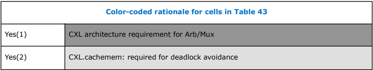

| Color-coded rationale for cells in [Table 43](#table-43-upstream-ordering-summary)   | Color-coded rationale for cells in [Table 43](#table-43-upstream-ordering-summary)   |
|-----------------------------------------------|-----------------------------------------------|
| Yes(1)                                        | CXL architecture requirement for Arb/Mux      |
| Yes(2)                                        | CXL.cachemem: required for deadlock avoidance |

#### Table 44. Downstream Ordering Summary

| Row Pass Column?   | .io TLPs (Col 2-5)   | M2S Req (Col 8)   | M2S RwD (Col 9)   | H2D Req (Col 10)   | H2D Resp (Col 11)   | H2D Data (Col 12)   |
|--------------------|----------------------|-------------------|-------------------|--------------------|---------------------|---------------------|
| .io TLPs (Row A-D) | PCIe Base            | Yes(1)            | Yes(1)            | Yes(1)             | Yes(1)              | Yes(1)              |
| M2S Req (Row G)    | Yes(1)               | a. No(5) <br> b. Y/N   | Y/N               | Yes(2)             | Y/N                 | Y/N                 |
| M2S RwD (Row H)    | Yes(1)               | Y/N               | Y/N               | Yes(2)             | Y/N                 | Y/N                 |
| H2D Req (Row I)    | Yes(1)               | Yes(3)            | Yes(3)            | Y/N                | a. No(4) <br> b. Y/N     | Yes(3)              |
| H2D Resp (Row J)   | Yes(1)               | Yes(2)            | Yes(2)            | Yes(2)             | Y/N                 | Y/N                 |
| H2D Data (Row K)   | Yes(1)               | Yes(2)            | Yes(2)            | Yes(2)             | Y/N                 | Y/N                 |

Explanation of row and column headers:

In Downstream direction pre-allocated channels are kept separate because of unique ordering requirements in each.

| Color-coded rationale for cells in [Table 44](#table-44-downstream-ordering-summary)   | Color-coded rationale for cells in [Table 44](#table-44-downstream-ordering-summary)   |
|-----------------------------------------------|-----------------------------------------------|
| Yes(1)                                        | CXL architecture requirement for Arb/Mux      |
| Yes(2)                                        | CXL.cachemem: required for deadlock avoidance |
| Yes(3)                                        | CXL.cachemem: performance optimization                 |
| No(4)                                         | Type 1/2 device: Snoop push GO requirement             |
| No(5)                                         | Type 2 device: MemRd*/MemInv* push MemFwd* requirement |

Explanation of table entries:

G8a MemRd*/MemInv* must not pass prior MemFwd* messages to the same cacheline address. This rule is applicable only for Type-2 devices that receive MemFwd* messages (Type 3 devices don't need to implement this rule).

G8b All other cases not covered by rule G8a do not have ordering required (Y/N).

I10 When a CXL.cache device is flushing its cache it must wait for all responses for cacheable access before sending CacheFlushed message. This is necessary because host must only observe CacheFlushed after all inflight messages are completed.

I11a Snoops must not pass prior GO* messages to the same cacheline address. GO messages do not carry the address, so implementations may where address cannot be inferred from UQID in the GO message will need to apply this rule strictly across all messages.

I11b Other case not covered by I11a are Y/N.

### 3.5 Transaction Flows to Device-Attached Memory

#### 3.5.1 Flows for Type 1 and Type 2 Devices

##### 3.5.1.1 Notes and Assumptions

The transaction flow diagrams below are intended to be illustrative of the flows between the Host and device for access to device-attached Memory using the Bias Based Coherency mechanism described in [Section 2.0](#20-compute-express-link-system-architecture). However, these flows are not comprehensive of every Host and device interaction. The diagrams below make the following assumptions:

- The device contains a coherency engine which is called DCOH in the diagrams below.
- The DCOH contains a Snoop Filter which tracks any caches (called Dev cache) implemented on the device. This is not strictly required, and the device is free to choose an implementation specific mechanism as long as the coherency rules are obeyed.
- The DCOH contains a Bias Table lookup mechanism. The implementation of this is device specific.
- The device specific aspects of the flow, illustrated using Red flow arrows, need not conform exactly to the pictures below. These can be implemented in a device specific manner.

###### Figure 28. Legend


##### 3.5.1.2 Requests from Host

Please note that the flows shown in this section (Requests from Host) do not change on the CXL interface regardless of the bias state of the target region. This effectively means that the device needs to give the Host a consistent response, as expected by the Host and shown below.

###### Figure 29. Example Cacheable Read from Host

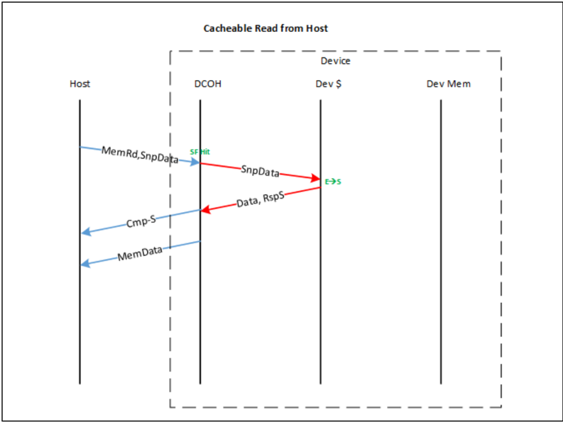

In the above example, the Host requested a cacheable non-exclusive copy of the line. The non-exclusive aspect of the request is communicated using the 'SnpData' semantic. In this example, the request got a snoop filter hit in the DCOH, which caused the device cache to be snooped. The device cache downgraded the state from Exclusive to Shared and returned the Shared data copy to the Host. The Host is told of the state of the line using the Cmp-S semantic.

###### Figure 30. Example Read for Ownership from Host

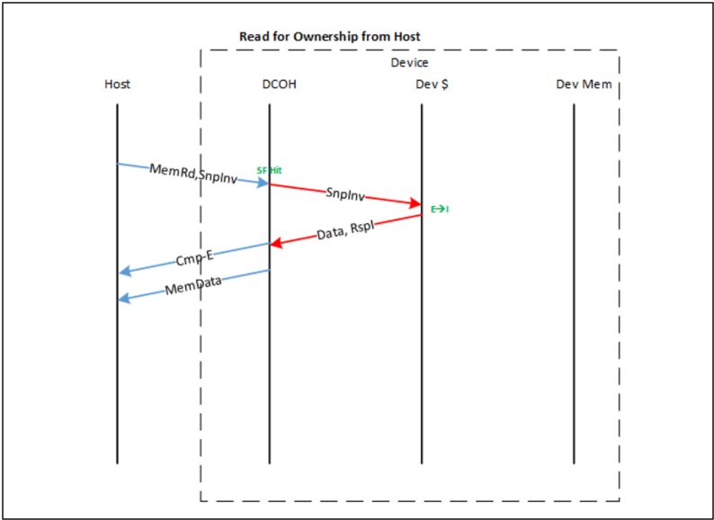

In the above example, the Host requested a cacheable exclusive copy of the line. The exclusive aspect of the request is communicated using the 'SnpInv' semantic, which asks the device to invalidate its caches. In this example, the request got a snoop filter hit in the DCOH, which caused the device cache to be snooped. The device cache downgraded the state from Exclusive to Invalid and returned the Exclusive data copy to the Host. The Host is told of the state of the line using the Cmp-E semantic.

###### Figure 31. Example Non Cacheable Read from Host

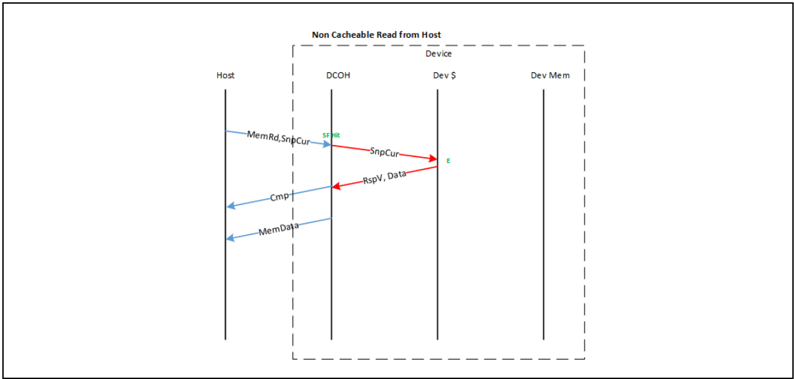

In the above example, the Host requested a non-cacheable copy of the line. The noncacheable aspect of the request is communicated using the 'SnpCurr' semantic. In this example, the request got a snoop filter hit in the DCOH, which caused the device cache to be snooped. The device cache did not need to change its caching state; however, it gave the current snapshot of the data. The Host is told that it is not allowed to cache the line using the Cmp semantic.

###### Figure 32. Example Ownership Request from Host - No Data Required

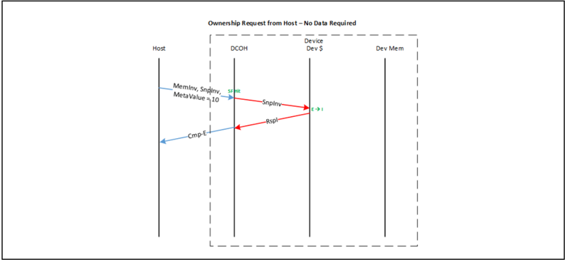

In the above example, the Host requested exclusive access to a line without requiring the device to send data. It communicates that to the device using an opcode of MemInv with a MetaValue of '10 (Any), which is significant in this case. It also asks the device to invalidate its caches with the SnpInv command. The device invalidates its caches and gives exclusive ownership to the Host as communicated using the Cmp-E semantic.

###### Figure 33. Example Flush from Host

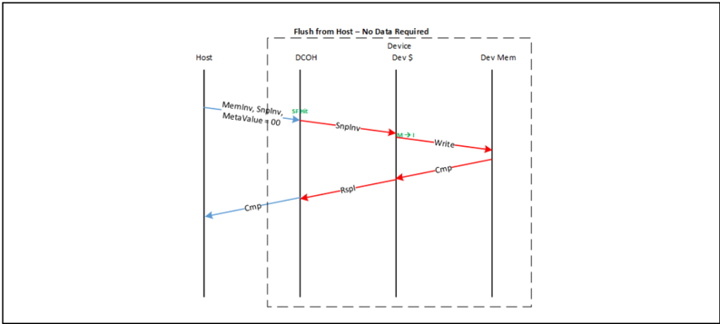

In the above example, the Host wants to flush a line from all caches, including the device's caches, to device memory. To do so, it uses an opcode of MemInv with a MetaValue of '00 (Invalid) and a SnpInv. The device flushes its caches and returns a Cmp indication to the Host.

###### Figure 34. Example Weakly Ordered Write from Host

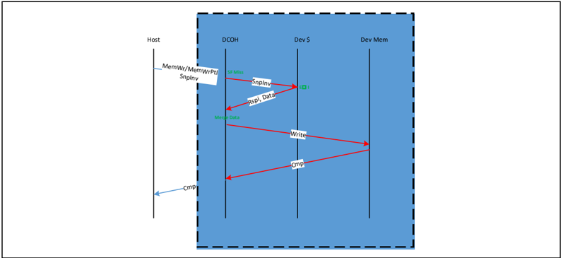

In the above example, the Host issues a weakly ordered write (partial or full line). The weakly ordered semantic is communicated by the embedded SnpInv. In this example, the device had a copy of the line cached. This resulted in a merge within the device before writing it back to memory and sending a Cmp indication to the Host.

###### Figure 35. Example Write from Host with Invalid Host Caches

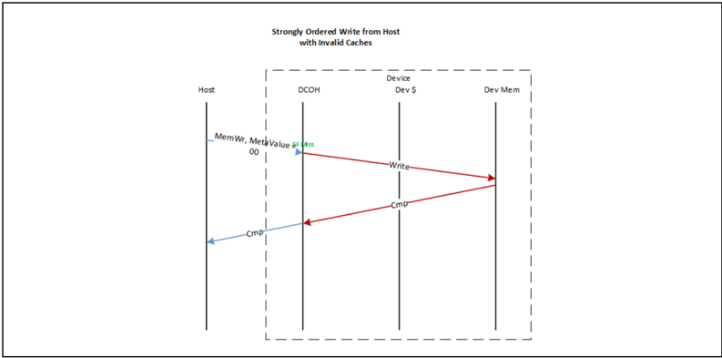

In the above example, the Host performed a write while guaranteeing to the device that it no longer has a valid cached copy of the line. The fact that the Host didn't need to snoop the device's caches means it previously acquired an exclusive copy of the line. The guarantee on no valid cached copy is indicated by a MetaValue of '00 (Invalid).

###### Figure 36. Example Write from Host with Valid Host Caches

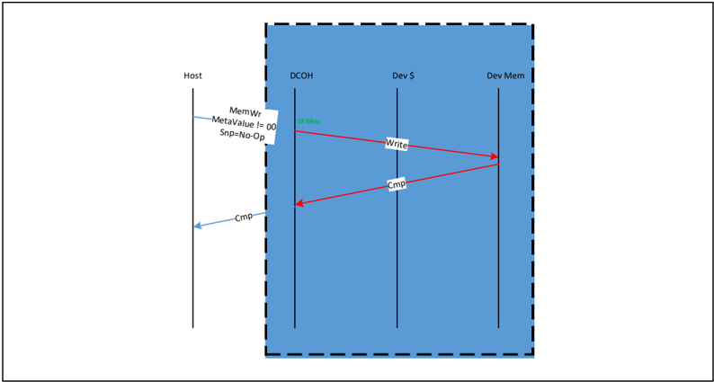

The above example is the same as the previous one except that the Host chose to retain a valid cacheable copy of the line after the write. This is communicated to the device using a MetaValue of not '00 (Invalid).

##### 3.5.1.3 Requests from Device in Host and Device Bias

###### Figure 37. Example Device Read to Device-Attached Memory

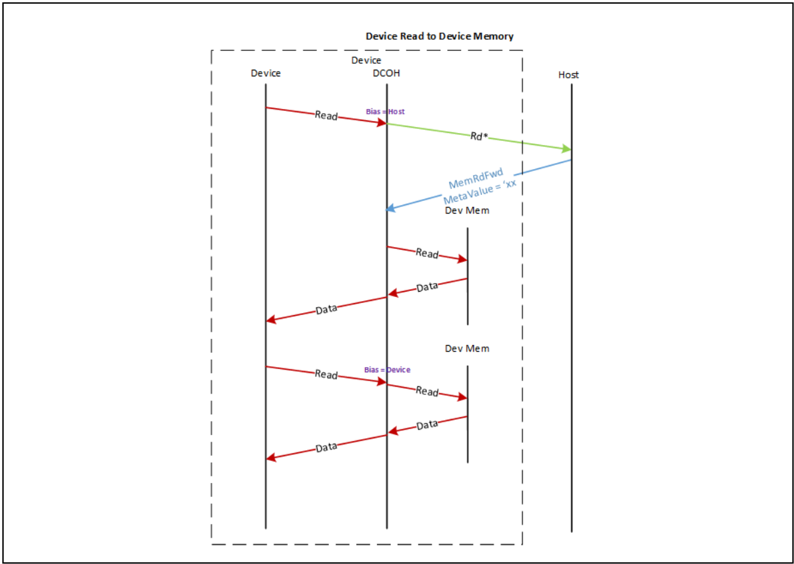

There are two flows shown above.

In the first one, a device read to device attached memory happened to find the line in Host bias. Since it is in Host bias, the device needs to send the request to the Host to resolve coherency. The Host, after resolving coherency, sends a MemRdFwd on CXL.mem to complete the transaction, at which point the device can complete the read internally.

In the second flow, the device read happened to find the line in Device Bias. Since it is in Device Bias, the read can be completed entirely within the device itself and no request needs to be sent to the Host.

###### Figure 38. Example Device Write to Device-Attached Memory in Host Bias

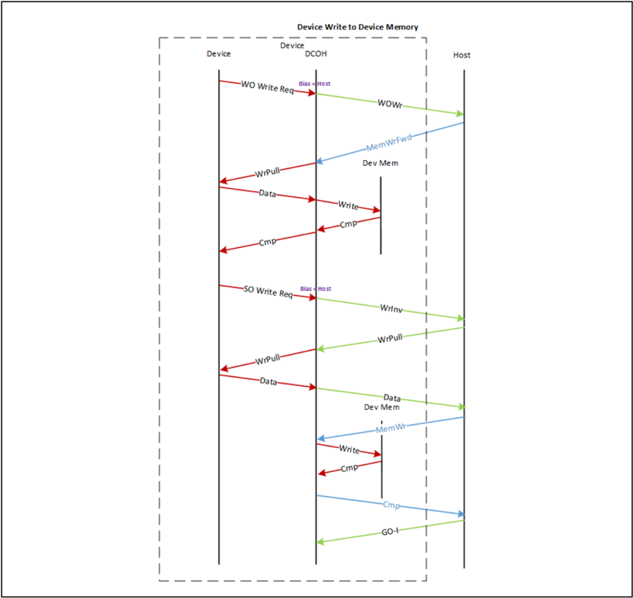

There are two flows shown above, both with the line in Host Bias: a weakly ordered write request and a strongly ordered write request.

In the case of the weakly ordered write request, the request is issued by the device to the Host to resolve coherency. The Host resolves coherency and sends a CXL.mem MemWrFwd opcode which carries the completion for the WOWrInv* command on CXL.cache. The CQID associated with the CXL.cache WOWrInv* command is reflected in the Tag of the CXL.mem MemWrFwd command. At this point, the device is allowed to complete the write internally. After sending the MemWrFwd, since the Host no longer fences against other accesses to the same line, this is considered a weakly ordered write.

In the second flow, the write is strongly ordered. To preserve the strongly ordered semantic, the Host fences against other accesses while this write completes. However, as can be seen, this involves two transfers of the data across the link, which is not efficient. Unless strongly ordered writes are absolutely required, better performance can be achieved with weakly ordered writes.

###### Figure 39. Example Device Write to Device-Attached Memory

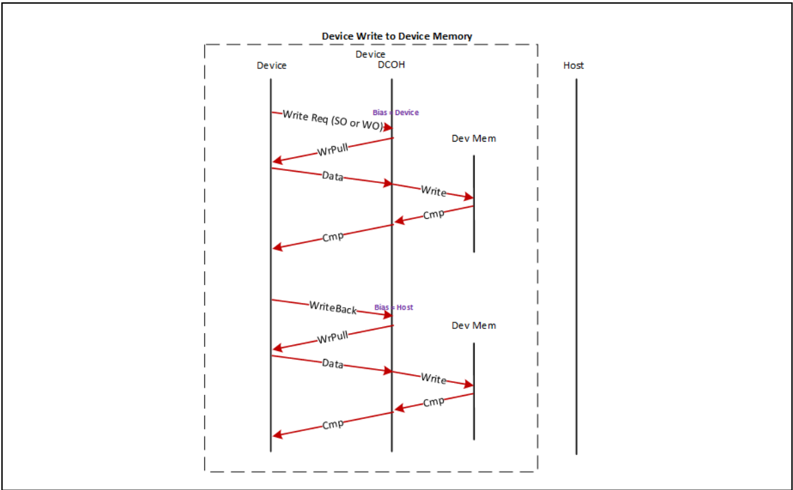

Again, two flows are shown above. In the first case, if a weakly or strongly ordered write finds the line in Device Bias, the write can be completed entirely within the device without having to send any indication to the Host.

The second flow shows a device writeback to device-attached memory. Please note that if the device is doing a writeback to device-attached memory, regardless of bias state, the request can be completed within the device without having to send a request to the Host.

###### Figure 40. Example Host to Device Bias Flip

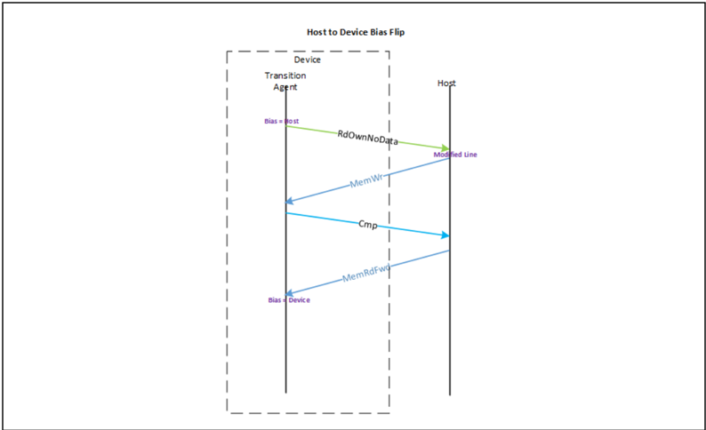

Please note that the MemRdFwd will carry the CQID of the RdOwnNoData transaction in the Tag. The reason for putting the RdOwnNoData completion (MemRdFwd) on CXL.mem is to ensure that subsequent M2S Req Channel requests from the Host to the same address are ordered behind the MemRdFwd. This allows the device to assume ownership of a line as soon as it receives a MemRdFwd without having to monitor requests from the Host.

#### 3.5.2 Type 2 and Type 3 Memory Flows

##### 3.5.2.1 Speculative Memory Read

To support latency saving, CXL.mem includes a speculative memory read command (MemSpecRd) which is used to start memory access before the home agent has resolved coherence. This command does not receive a completion message and can be dropped arbitrarily. The host, after resolving coherence, may issue a demand read (MemRd, MemRdOwn) that the device should merge with the earlier MemSpecRd to achieve latency savings. See Figure 41 for an example of this type of flow.

The MemSpecRd command can be observed while other memory access is in progress in the device to the same cacheline address. In this condition it is recommended that the device drops the MemSpecRd.

To avoid performance impact, it is recommended that MemSpecRd commands are treated as low priority to avoid adding latency to demand accesses. Under loaded conditions the MemSpecRd can hurt performance because of the extra bandwidth it consumes and should be dropped when loading of memory or loading of the CXL link is detected. QoS Telemetry data is one way loading of memory can be detected in the host or switch.

###### Figure 41. Example MemSpecRd

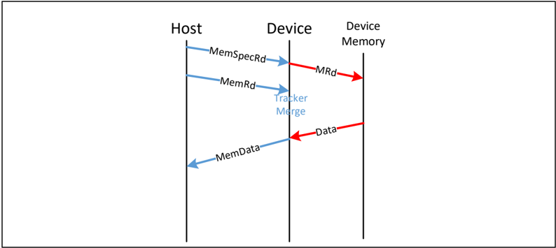

### 3.6 Flows for Type 3 Devices

Type 3 devices are memory expanders which neither cache host memory, nor require active management of a device cache by the Host. Thus, Type 3 devices do not have a DCOH agent. As such, the Host treats these devices as disaggregated memory controllers. This allows the transaction flows to Type 3 devices to be simplified to just two classes, reads and writes, as shown below. The legend shown in [Figure 28](#figure-28-legend) also applies to the transaction flows shown below.

#### Figure 42. Read from Host

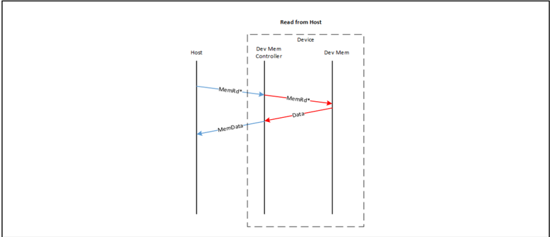

The key difference between M2S reads to Type 2 devices versus Type 3 devices is that there is no S2M NDR response message from Type 3 devices. Writes to Type 3 device always complete with a S2M NDR Cmp message just like Type 2 devices.

#### Figure 43. Write from Host

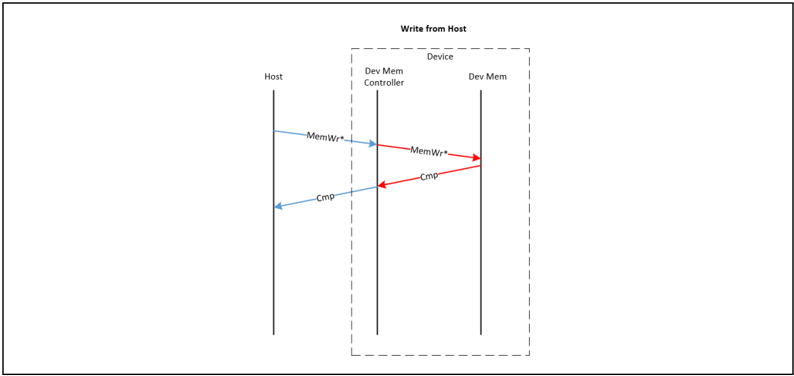

## 4.0 Compute Express Link Link Layers

### 4.1 CXL.io Link Layer

The CXL.io link layer acts as an intermediate stage between the CXL.io transaction layer and the Flex Bus Physical layer. Its primary responsibility is to provide a reliable mechanism for exchanging transaction layer packets (TLPs) between two components on the link. The PCIe Data Link Layer is utilized as the link layer for CXL.io Link layer . Please refer to chapter titled 'Data Link Layer Specification' in PCI Express Base Specification for details.

#### Figure 44. Flex Bus Layers - CXL.io Link Layer Highlighted

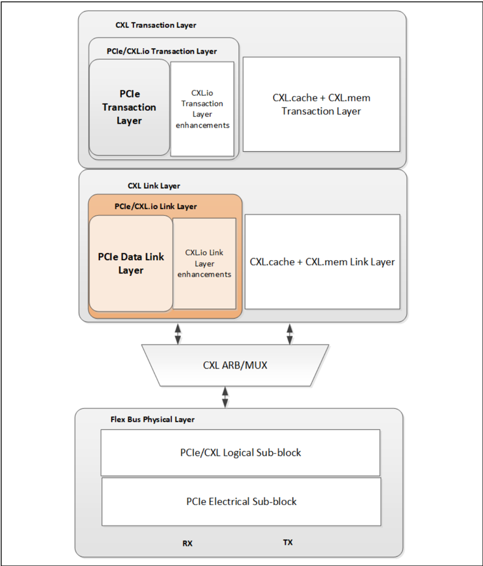

In addition, the CXL.io link layer implements the framing/deframing of CXL.io packets. CXL.io utilizes the Encoding for 8.0 GT/s and Higher data rates only, refer to section entitled 'Encoding for 8.0GT/s and Higher Data Rates' in the PCI Express Base Specification for details.

This chapter highlights the notable framing and application of symbols to lanes that are specific for CXL.io. Note that when viewed on the link, the framing symbol to lane mapping will be shifted due to additional CXL framing (i.e., two bytes of Protocol ID and two reserved bytes) and also due to interleaving with other CXL protocols.

For CXL.io, only the x16 Link transmitter and receiver framing requirements described in the PCI Express Base Specification apply irrespective of the negotiated link width. The framing related rules for N = 1, 2, 4 and 8 do not apply. For downgraded Link widths, where number of active lanes is less than x16, a single x16 data stream is formed using x16 framing rules and transferred over x16/(degraded link width) degraded link width streams.

CXL.io link layer forwards a framed IO packet to the Flex Bus Physical layer. The Flex Bus Physical layer framing rules are defined in Chapter 6.0.

The CXL.io link layer must guarantee that if a transmitted TLP ends precisely at the flit boundary, there must be a subsequent transmitted CXL.io flit. Please refer to [Section 6.2.8](#628-special-case-cxlio-when-a-tlp-ends-on-a-flit-boundary) for more details.

### 4.2 CXL.mem and CXL.cache Common Link Layer

#### 4.2.1 Introduction

The figure below shows where the CXL.cache and CXL.mem link layer exists in the Flex Bus layered hierarchy.

Compute Express Link Specification

##### Figure 45. Flex Bus Layers - CXL.cache + CXL.mem Link Layer Highlighted

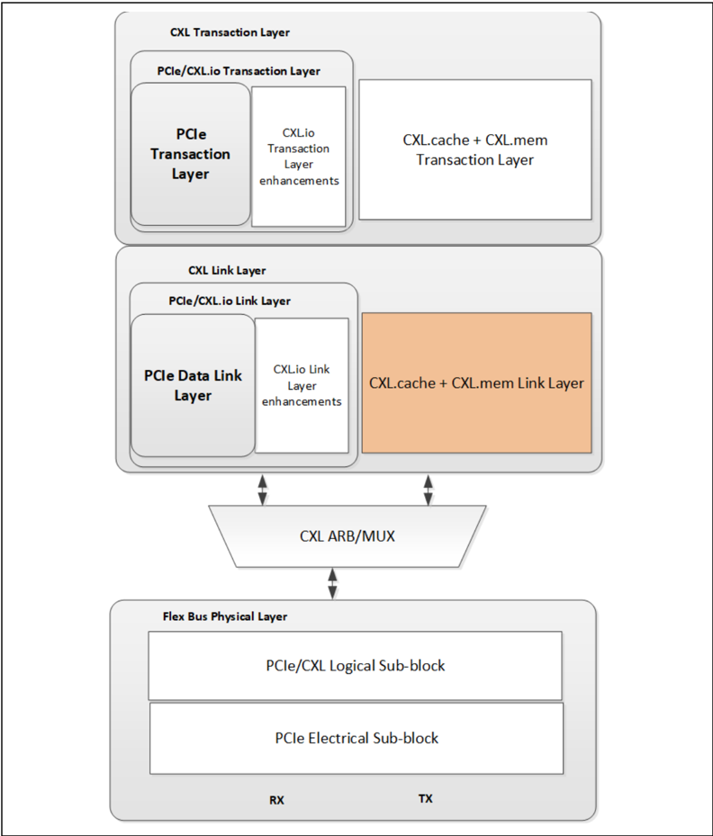

As previously mentioned, CXL.cache and CXL.mem protocols use a common Link Layer. This chapter defines the properties of this common Link Layer. Protocol information, including definition of fields, opcodes, transaction flows, etc. can be found in [Section 3.2](#32-cxlcache) and [Section 3.3](#33-cxlmem).

#### 4.2.2 High-Level CXL.cache/CXL.mem Flit Overview

The CXL.cache/mem flit size is a fixed 528b. There are 2B of CRC code and 4 slots of 16B each as shown below.

##### Figure 46. CXL.cache/.mem Protocol Flit Overview

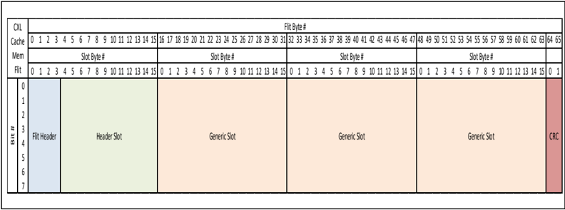

##### Figure 47. CXL.cache/.mem All Data Flit Overview

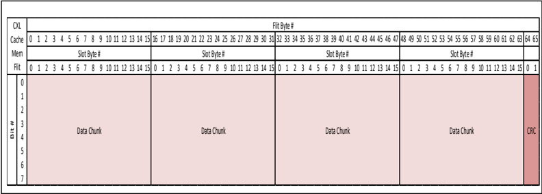

An example of a Protocol Flit in the device to Host direction is shown below. For detailed descriptions of slot formats please refer to [Section 4.2.3](#423-slot-format-definition)

##### Figure 48. Example of a Protocol Flit from Device to Host

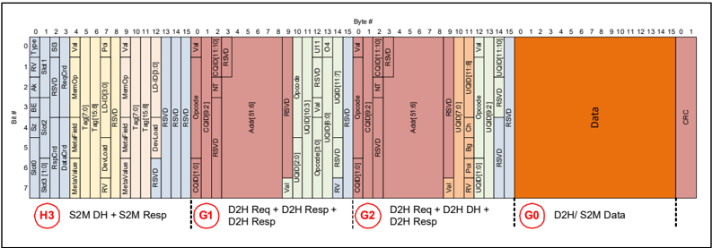

A 'Header' Slot is defined as one that carries a 'Header' of link-layer specific information, including the definition of the protocol-level messages contained in the rest of the header as well as in the other slots in the flit.

A 'Generic' Slot can carry one or more request/response messages or a single 16B data chunk.

The flit can be composed of a Header Slot and 3 Generic Slots or four 16B Data Chunks.

The flit header utilizes the same definition for both the Upstream as well as the Downstream ports summarized in the table below.

###### Table 45. CXL.cache/CXL.mem Flit Header Definition

| Field Name   | Brief Description                                                                                   |   Size |
|--------------|-----------------------------------------------------------------------------------------------------|--------|
| Type         | This field distinguishes between a Protocol or a Control Flit                                       |      1 |
| Ak           | This is an acknowledgment of 8 successful flit transfers Reserved for Retry, and Init control flits |      1 |
| BE           | Byte Enable (Reserved for control flits)                                                            |      1 |
| Sz           | Size (Reserved for control flits)                                                                   |      1 |
| ReqCrd       | Request Credit Return Reserved for Retry, and Init control flits                                    |      4 |
| DataCrd      | Data Credit Return Reserved for Retry, and Init control flits                                       |      4 |
| RspCrd       | Response Credit Return Reserved for Retry, and Init control flits                                   |      4 |
| Slot 0       | Slot 0 Format Type (Reserved for control flits)                                                     |      3 |
| Slot 1       | Slot 1 Format Type (Reserved for control flits)                                                     |      3 |
| Slot 2       | Slot 2 Format Type (Reserved for control flits)                                                     |      3 |
| Slot 3       | Slot 3 Format Type (Reserved for control flits)                                                     |      3 |
| RSVD         | Reserved                                                                                            |      4 |
| Total        |                                                                                                     |     32 |

In general, bits or encodings that are not defined will be marked 'Reserved' or 'RSVD' in this specification. These bits should be set to 0 by the sender of the packet and the receiver should ignore them. Please also note that certain fields with static 0/1 values will be checked by the receiving Link Layer when decoding a packet. For example, Control flits have several static bits defined. A Control flit that passes the CRC check but fails the static bit check should be treated as a standard CRC error or as a fatal error when in 'retry_local_normal' state of the LRSM. Logging and reporting of such errors is device specific. Checking of these bits reduces the probability of silent error under conditions where the CRC check fails to detect a long burst error. However, link layer must not cause fatal error whenever it is under shadow of CRC errors, i.e., its LRSM is not in 'retry_local_normal' state. This is prescribed because all-data-flit can alias to control messages after a CRC error and those alias cases may result in static bit check failure.

The following describes how the flit header information is encoded.

###### Table 46. Type Encoding

|    | Flit Type   | Description                                                                                                                              |
|----|-------------|------------------------------------------------------------------------------------------------------------------------------------------|
|  0 | Protocol    | This is a flit that carries CXL.cache or CXL.mem protocol related information                                                            |
|  1 | Control     | This is a flit inserted by the link layer purely for link layer specific functionality. These flits are not exposed to the upper layers. |

Note: The Ak field is used as part of the link layer retry protocol to signal CRC-passing receipt of flits from the remote transmitter. The transmitter sets the Ak bit to acknowledge successful receipt of 8 flits; a clear Ak bit is ignored by the receiver.

The BE (Byte Enable) and Sz (Size) fields have to do with the variable size of data messages. To reach its efficiency targets, the CXL.cache/mem link layer assumes that generally all bytes are enabled for most data, and that data is transmitted at the full cacheline granularity. When all bytes are enabled, the link layer does not transmit the byte enable bits, but instead clears the Byte Enable field of the corresponding flit header. When the receiver decodes that the Byte Enable field is clear, it must regenerate the byte enable bits as all ones before passing the data message on to the transaction layer. If the Byte Enable bit is set, the link layer Rx expects an additional data chunk slot containing byte enable information. Note that this will always be the last slot of data for the associated request.

Similarly, the Sz field reflects the fact that the CXL.cache/mem protocol allows transmission of data at the half cacheline granularity. When the Size bit is set, the link layer Rx expects four slots of data chunks, corresponding to a full cacheline. When the Size bit is clear , it expects only two slots of data chunks. In the latter case, each half cacheline transmission will be accompanied by its own data header. A critical assumption of packing the Size and Byte Enable information in the flit header is that the Tx flit packer may begin at most one data message per flit.

Multi-Data-Headers are not allowed to be sent when Sz=0 or BE=1 as described in the flit packing rules in [Section 4.2.5](#425-flit-packing-rules).

The following table describes legal values of Sz and BE for various data transfers. For cases where a 32B split transfer is sent that includes Byte Enables, the trailing Byte Enables apply only to the 32B sent. The Byte Enable bits that are applicable to that transfer are aligned based on which half of the cacheline is applicable to the transfer (BE[63:32] for Upper half or BE[31:0] for the lower half of the cacheline). This means that each of the split 32B transfers to form a cacheline of data will include Byte Enables if Byte Enables are needed. Illegal use will cause an uncorrectable error.

###### Table 47. Legal values of Sz and BE Fields

| Type of Data Transfer   | 32B Transfer Possible?   | BE Possible?   |
|-------------------------|--------------------------|----------------|
| CXL.cache H2D Data      | Yes                      | No             |
| CXL.mem M2S Data        | No                       | Yes            |
| CXL.cache D2H Data      | Yes                      | Yes            |
| CXL.mem S2M Data        | Yes                      | No             |

The transmitter sets the Credit Return fields to indicate resources available in the colocated receiver for use by the remote transmitter. Credits are given for transmission per message class, which is why the flit header contains independent Request, Response, and Data Credit Return fields. Note that there are no Requests sourced in S2M direction, and there are no Responses sourced in M2S direction. The details of the channel mapping are captured in Table 49. Credits returned for channels not supported by the device or host should be silently discarded. The granularity of credits is per message. These fields are encoded exponentially, as delineated in the table below.

Note: Messages sent on Data channels require a single data credit for the entire messages. This means 1 credit allows for one data transfer, including the header of the message, regardless of whether the transfer is 64B, 32B or contains Byte Enables.

###### Table 48. CXL.cache/CXL.mem Credit Return Encodings

| Credit Return Encoding[3]   | Protocol          |
|-----------------------------|-------------------|
| 0                           | CXL.cache         |
| 1                           | CXL.mem           |
| Credit Return Encoding[2:0] | Number of Credits |
| 000                         | 0                 |
| 001                         | 1                 |
| 010                         | 2                 |
| 011                         | 4                 |
| 100                         | 8                 |
| 101                         | 16                |
| 110                         | 32                |
| 111                         | 64                |

###### Table 49. ReqCrd/DataCrd/RspCrd Channel Mapping

| Credit Field   | Credit Bit 3 Encoding   | Link Direction   | Channel                      |
|----------------|-------------------------|------------------|------------------------------|
| ReqCrd         | 0 - CXL.Cache           | Upstream         | D2H Request                  |
| ReqCrd         | 0 - CXL.Cache           | Downstream       | H2D Request                  |
| ReqCrd         | 1 - CXL.Mem             | Upstream         | Reserved                     |
| ReqCrd         | 1 - CXL.Mem             | Downstream       | M2S Request                  |
| DataCrd        | 0 - CXL.Cache           | Upstream         | D2H Data                     |
| DataCrd        | 0 - CXL.Cache           | Downstream       | H2D Data                     |
| DataCrd        | 1 - CXL.Mem             | Upstream         | S2M Response with Data (DRS) |
| DataCrd        | 1 - CXL.Mem             | Downstream       | M2S Request with Data (RwD)  |
| RspCrd         | 0 - CXL.Cache           | Upstream         | D2H Response                 |
| RspCrd         | 0 - CXL.Cache           | Downstream       | H2D Response                 |
| RspCrd         | 1 - CXL.Mem             | Upstream         | S2M No Data Response (NDR)   |
| RspCrd         | 1 - CXL.Mem             | Downstream       | Reserved                     |

Finally, the Slot Format Type fields encode the Slot Format of both the header slot and of the other generic slots in the flit (if the Flit Type bit specifies that the flit is a Protocol Flit). The subsequent sections detail the protocol message contents of each slot format, but the table below provides a quick reference for the Slot Format field encoding.

Note: Format H6 is defined for use with Integrity and Data Encryption. See details of requirements for it's use in [Section 11.1](#111-cxl-ide).

###### Table 50. Slot Format Field Encoding

|   SlotFormat Encoding | H2D/M2S   | H2D/M2S         | D2H/S2M   | D2H/S2M          |
|-----------------------|-----------|-----------------|-----------|------------------|
|                       | Slot 0    | Slots 1,2 and 3 | Slot 0    | Slots 1, 2 and 3 |
|                   000 | H0        | G0              | H0        | G0               |
|                   001 | H1        | G1              | H1        | G1               |
|                   010 | H2        | G2              | H2        | G2               |
|                   011 | H3        | G3              | H3        | G3               |
|                   100 | H4        | G4              | H4        | G4               |
|                   101 | H5        | G5              | H5        | G5               |
|                   110 | H6        | RSVD            | H6        | G6               |
|                   111 | RSVD      | RSVD            | RSVD      | RSVD             |

The following tables describe the slot format and the type of message contained by each format for both directions.

###### Table 51. H2D/M2S Slot Formats

| Format to Req Type Mapping   | H2D/M2S                                                | H2D/M2S   |
|------------------------------|--------------------------------------------------------|-----------|
|                              | Type                                                   | Size      |
| H0                           | CXL.cache Req + CXL.cache Resp                         | 96        |
| H1                           | CXL.cache Data Header + 2 CXL.cache Resp               | 88        |
| H2                           | CXL.cache Req + CXL.cache Data Header                  | 88        |
| H3                           | 4 CXL.cache Data Header                                | 96        |
| H4                           | CXL.mem RwD Header                                     | 87        |
| H5                           | CXL.mem Req Only                                       | 87        |
| H6                           | MAC slot used for link integrity.                      | 96        |
| G0                           | CXL.cache/ CXL.mem Data Chunk                          | 128       |
| G1                           | 4 CXL.cache Resp                                       | 128       |
| G2                           | CXL.cache Req + CXL.cache Data Header + CXL.cache Resp | 120       |
| G3                           | 4 CXL.cache Data Header + CXL.cache Resp               | 128       |
| G4                           | CXL.mem Req + CXL.cache Data Header                    | 111       |
| G5                           | CXL.mem RwD Header + CXL.cache Resp                    | 119       |

###### Table 52. D2H/S2M Slot Formats

| Format to Req Type Mapping   | D2H/S2M                                                | D2H/S2M   |
|------------------------------|--------------------------------------------------------|-----------|
|                              | Type                                                   | Size      |
| H0                           | CXL.cache Data Header + 2 CXL.cache Resp + CXL.mem NDR | 87        |
| H1                           | CXL.cache Req + CXL.cache Data Header                  | 96        |
| H2                           | 4 CXL.cache Data Header + CXL.cache Resp               | 88        |
| H3                           | CXL.mem DRS Header + CXL.mem NDR                       | 70        |
| H4                           | 2 CXL.mem NDR                                          | 60        |
| H5                           | 2 CXL.mem DRS Header                                   | 80        |
| H6                           | MAC slot used for link integrity.                      | 96        |
| G0                           | CXL.cache/ CXL.mem Data Chunk                          | 128       |
| G1                           | CXL.cache Req + 2 CXL.cache Resp                       | 119       |
| G2                           | CXL.cache Req + CXL.cache Data Header + CXL.cache Resp | 116       |
| G3                           | 4 CXL.cache Data Header                                | 68        |
| G4                           | CXL.mem DRS Header + 2 CXL.mem NDR                     | 100       |
| G5                           | 2 CXL.mem NDR                                          | 60        |
| G6                           | 3 CXL.mem DRS Header                                   | 120       |

#### 4.2.3 Slot Format Definition

Slot diagrams in the section include abbreviations for bit field names to allow them to fit into the diagram. In the context of diagram most abbreviations are obvious, but the abbreviation list below ensures clarity.

- SL3 = Slot3[2]
- LI3 = LD-ID[3]
- U11 = UQID[11]
- O4 = Opcode[4]
- Val = Valid
- RV = Reserved
- RSVD = Reserved
- Poi = Poison
- Tag15 =Tag[15]
- MV0 = MetaValue[0]
- MV1 = MetaValue[1]
- R11 = RspData[11]

##### 4.2.3.1 H2D and M2S Formats

###### Figure 49. H0 - H2D Req + H2D Resp

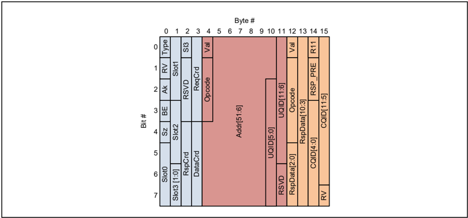

###### Figure 50. H1 - H2D Data Header + H2D Resp + H2D Resp

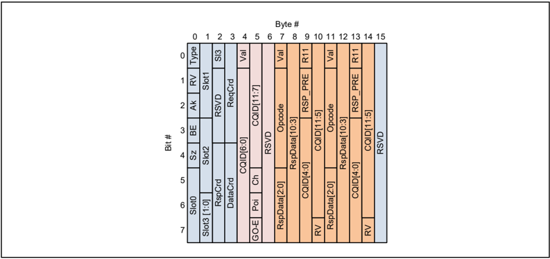

###### Figure 51. H2 - H2D Req + H2D Data Header

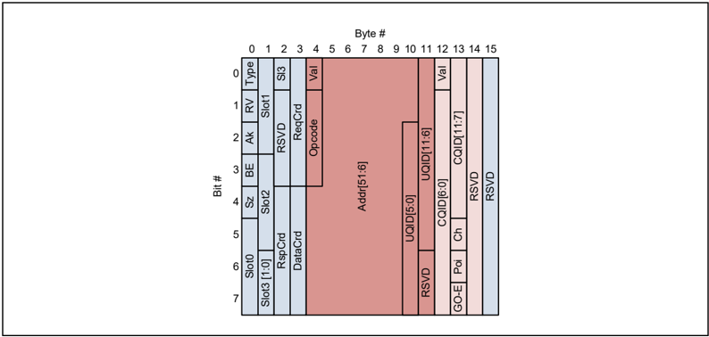

###### Figure 52. H3 - 4 H2D Data Header

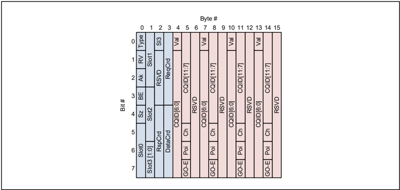

###### Figure 53. H4 - M2S RwD Header

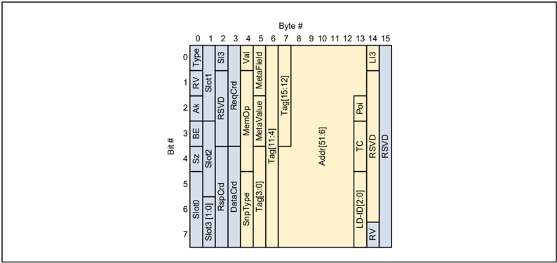

###### Figure 54. H5 - M2S Req

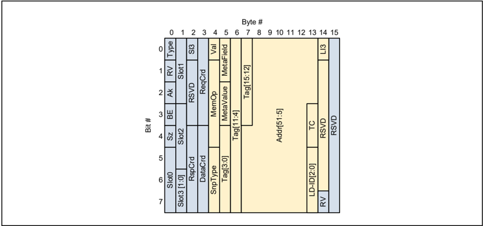

###### Figure 55. H6 - MAC


###### Figure 56. G0 - H2D/M2S Data

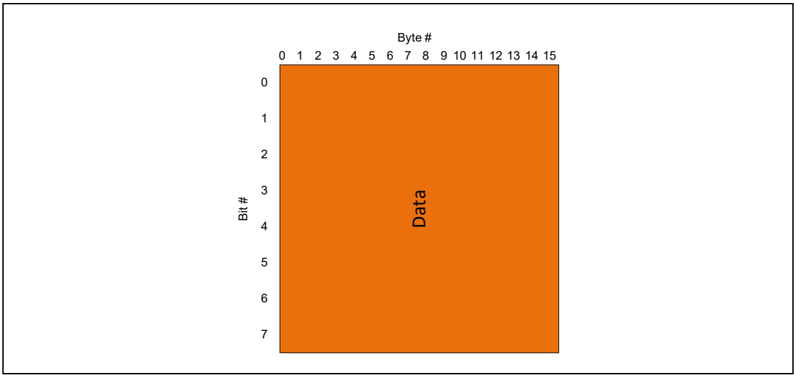

###### Figure 57. G0 - M2S Byte Enable

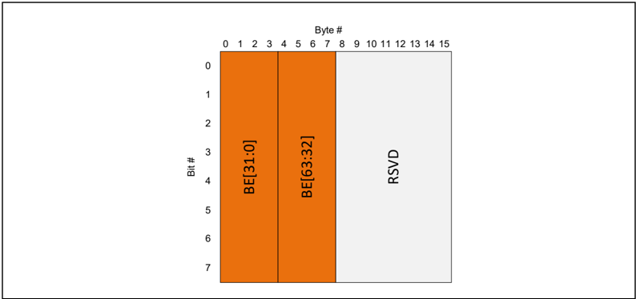

###### Figure 58. G1 - 4 H2D Resp

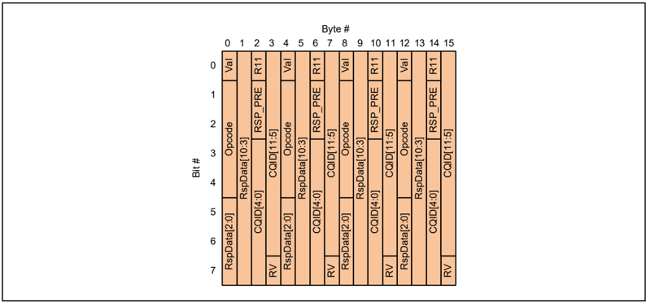

###### Figure 59. G2 - H2D Req + H2D Data Header + H2D Resp

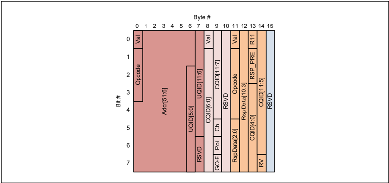

###### Figure 60. G3 - 4 H2D Data Header + H2D Resp

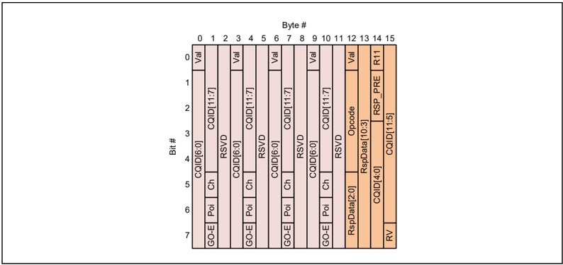

###### Figure 61. G4 - M2S Req + H2D Data Header

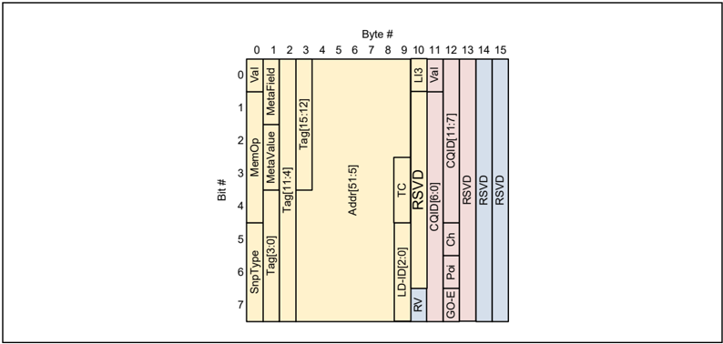

###### Figure 62. G5 - M2S RwD Header + H2D Resp

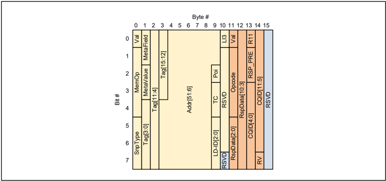

##### 4.2.3.2 D2H and S2M Formats

Slot definitions prior to CXL 2.0 ensure all header bits for a message are in contiguous bits. In CXL 2.0 the S2M NDR message expanded by two bits to fit the 2-bit DevLoad field. Some slot formats which carry NDR messages now include non-contiguous bits within the slot. The formats impacted are H4, G4, and G5 and the non-contiguous bits are denoted as 'DevLoad*' ('*' is the special indicator with separate color/pattern for the NDR message with non-contiguous bits). By expanding the slots in this way, backward compatible with CXL1.1 slot definition is maintained ensuring only RSVD slot

bits are used to expand the headers. Other slot formats which carry a single NDR message can be expanded and keep the contiguous header bits because the NDR message is the last message in the slot formats (see formats H0 and H3).

###### Figure 63. H0 - D2H Data Header + 2 D2H Resp + S2M NDR

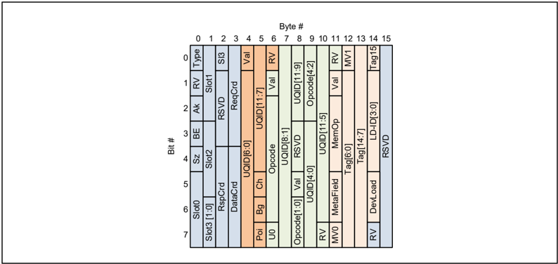

###### Figure 64. H1 - D2H Req + D2H Data Header

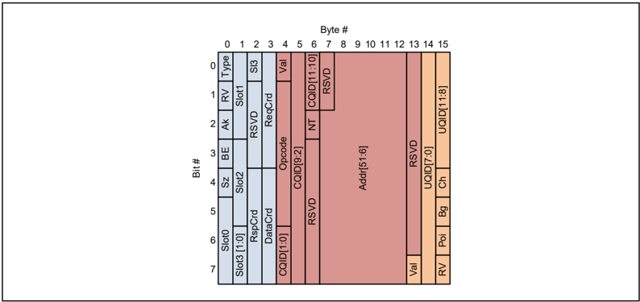

###### Figure 65. H2 - 4 D2H Data Header + D2H Resp

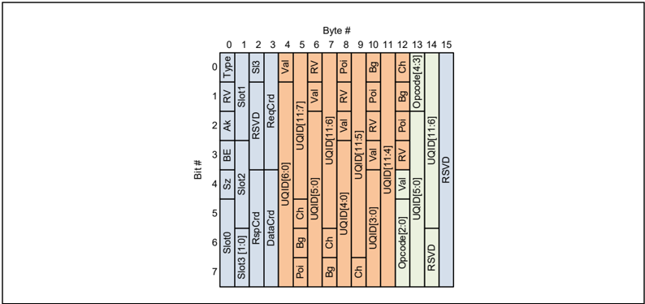

###### Figure 66. H3 - S2M DRS Header + S2M NDR

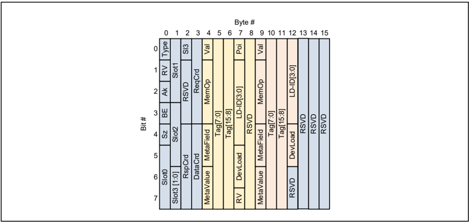

###### Figure 67. H4 - 2 S2M NDR

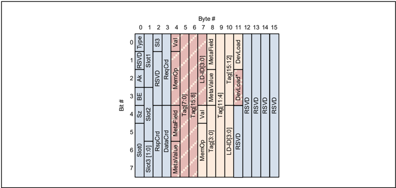

###### Figure 68. H5 - 2 S2M DRS Header

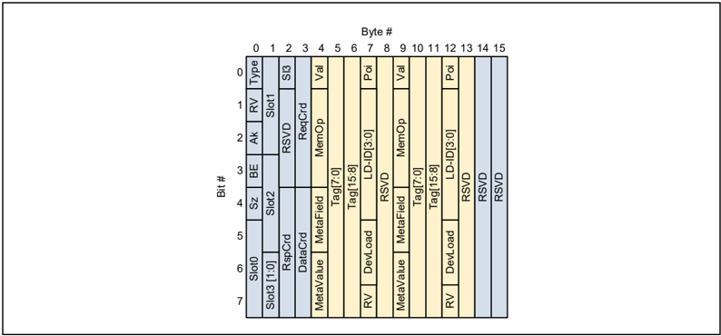

###### Figure 69. H6 - MAC

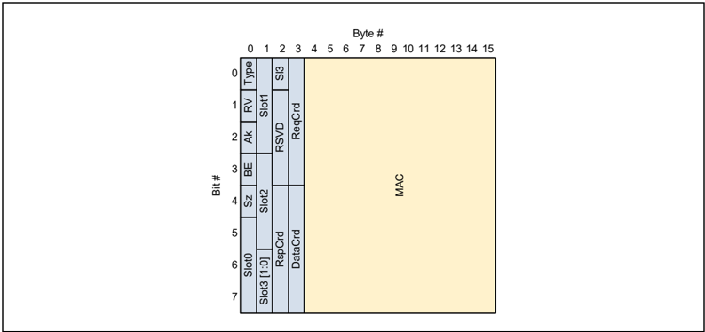

###### Figure 70. G0 - D2H/S2M Data


###### Figure 71. G0 - D2H Byte Enable


###### Figure 72. G1 - D2H Req + 2 D2H Resp

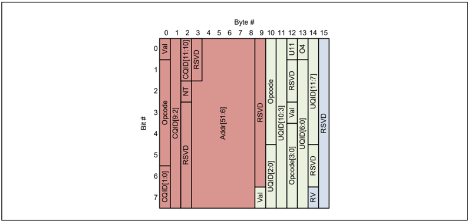

###### Figure 73. G2 - D2H Req + D2H Data Header + D2H Resp

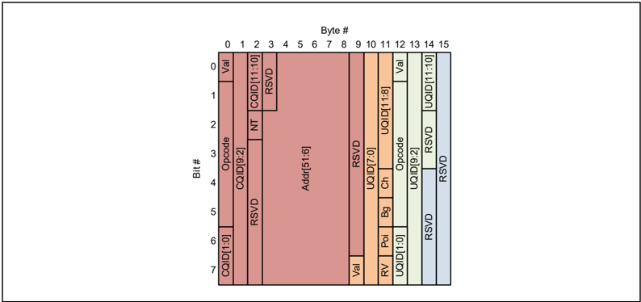

###### Figure 74. G3 - 4 D2H Data Header

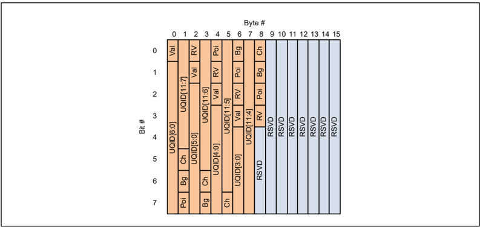

###### Figure 75. G4 - S2M DRS Header + 2 S2M NDR

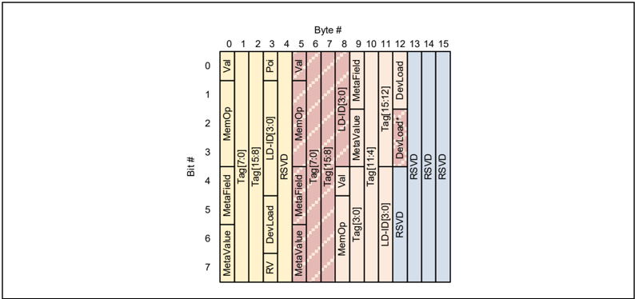

###### Figure 76. G5 - 2 S2M NDR

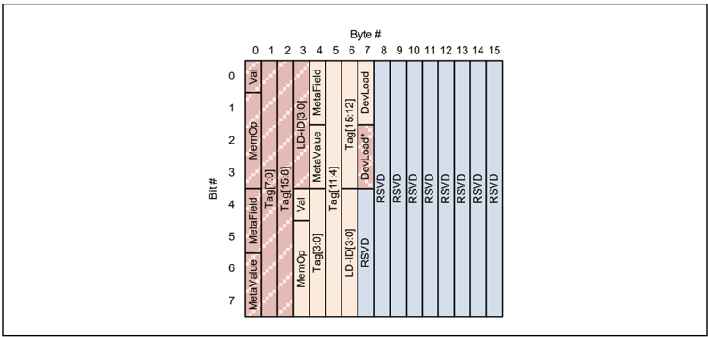

###### Figure 77. G6 - 3 S2M DRS Header

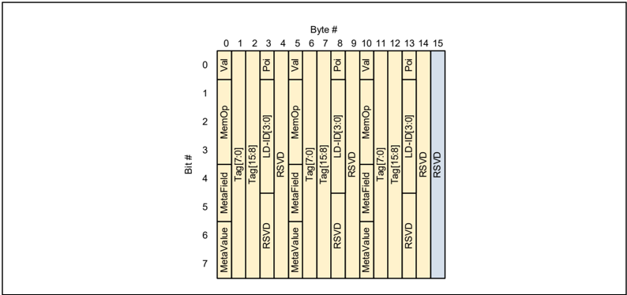

#### 4.2.4 Link Layer Registers

Architectural registers associated with CXL.cache and CXL.mem have been defined in [Section 8.2.5.11](#82511-cxl-link-capability-structure)

#### 4.2.5 Flit Packing Rules

The packing rules are defined below. It is assumed that a given queue has credits towards the RX and any protocol dependencies (SNP-GO ordering, for example) have already been considered:

- Rollover is defined as any time a data transfer needs more than one flit. Note that a data chunk which contains 128b (format G0), can only be scheduled in Slots 1, 2, and 3 of a protocol flit since Slot 0 has only 96b available, as 32b are taken up by the flit header . The following rules apply to Rollover data chunks.
    - If there's a rollover of more than 3 16B data chunks, the next flit must necessarily be an all data flit.
    - If there's a rollover of 3 16B data chunks, Slots 1, Slots 2 and Slots 3 must necessarily contain the 3 rollover data chunks. Slot 0 will be packed independently (it is allowed for Slot 0 to have the Data Header for the next data transfer).
    - If there's a rollover of 2 16B data chunks, Slots 1 and Slots 2 must necessarily contain the 2 rollover data chunks. Slot 0 and Slot 3 will be packed independently.
    - If there's a rollover of 1 16B data chunk, Slot 1 must necessarily contain the rollover data chunk. Slot 0, Slot 2 and Slot 3 will be packed independently.
    - If there's no rollover, each of the 4 slots will be packed independently.
- Care must be taken to ensure fairness between packing of CXL.mem &amp; CXL.cache transactions. Similarly, care must be taken to ensure fairness between channels within a given protocol. The exact mechanism to ensure fairness is implementation specific.
- Valid messages within a given slot need to be tightly packed. Which means, if a slot contains multiple possible locations for a given message, the Tx must pack the message in the first available location before advancing to the next available location.
- Valid messages within a given flit need to be tightly packed. Which means, if a flit contains multiple possible slots for a given message, the Tx must pack the message in the first available slot before advancing to the next available slot.
- Empty slots are defined as slots without any valid bits set and they may be mixed with other slots in any order as long as other packing rules are followed. For an example refer to Figure 48 where slot H3 could have no valid bits set indicating an empty slot, but the 1st and 2nd generic slots, G1 and G2 in the example, may have mixed valid bits set.
- If a valid Data Header is packed in a given slot, the next available slot for data transfer (Slot 1, Slot 2, Slot 3 or an all-data flit) will be guaranteed to have data associated with the header. The Rx will use this property to maintain a shadow copy of the Tx Rollover counts. This enables the Rx to expect all-data flits where a flit header is not present.
- For data transfers, the Tx must send 16B data chunks in cacheline order. That is, chunk order 01 for 32B transfers and chunk order 0123 for 64B transfers.
- A slot with more than one data header (e.g. H5 in the S2M direction, or G3 in the H2D direction) is called a multi-data header slot or a MDH slot. MDH slots can only be sent for full cacheline transfers when both 32B chunks are available to pack immediately. That is, BE = 0, Sz = 1. A MDH slot can only be used if both agents support MDH (defeature defined in [Section 8.2.5.11.7](#825117-cxl-link-layer-defeature-register-offset-0x30)). If MDH is received when disable it is considered a fatal error .
- A MDH slot format must be chosen by the Tx only if there is more than 1 valid Data Header to pack in that slot.
- Control flits cannot be interleaved with all-data flits. This also implies that when an all-data flit is expected following a protocol flit (due to Rollover), the Tx cannot send a Control flit before the all-data flit.
- For non-MDH containing flits, there can be at most 1 valid Data Header in that flit. Also, a MDH containing flit cannot be packed with another valid Data Header in the same flit.
- The maximum number of messages that can be sent in a given flit is restricted to reduce complexity in the receiver which writes these messages into credited queues. By restricting the number of messages across the entire flit, the number of write ports into the receiver's queues are constrained. The maximum messages in a flit (sum, across all slots) is:

    ```
        D2H Request --> 4
        D2H Response --> 2
        D2H Data Header --> 4
        D2H Data --> 4*16B
        S2M NDR --> 2
        S2M DRS Header --> 3
        S2M DRS Data --> 4*16B

        H2D Request --> 2
        H2D Response --> 4
        H2D Data Header --> 4
        H2D Data --> 4*16B
        M2S Req --> 2
        M2S RwD Header --> 1
        M2S RwD Data --> 4*16B
    ```

- For a given slot, lower bit positions are defined as bit positions that appear starting from lower order Byte #. That is, bits are ordered starting from (Byte 0, Bit 0) through (Byte 15, Bit 7).
- For multi-bit message fields like Address[MSB:LSB], less significant bits will appear in lower order bit positions.
- Message ordering within a flit is based on flit bit numbering, i.e. the earliest messages are placed at the lowest flit bit positions and progressively later messages are placed at progressively higher bit positions. Examples: An M2S Req 0 packed in Slot 0 precedes an M2S Req 1 packed in Slot 1. Similarly, a Snoop packed in Slot 1 follows a GO packed in Slot 0, and this ordering must be maintained. Finally, for Header Slot Format H1, an H2D Response packed starting from Byte 7 precedes an H2D Response packed starting from Byte 11.

#### 4.2.6 Link Layer Control Flit

Link Layer Control flits do not follow flow control rules applicable to protocol flits. That is, they can be sent from an entity without any credits. These flits must be processed and consumed by the receiver within the period to transmit a flit on the channel since there are no storage or flow control mechanisms for these flits. The following table lists all the Controls Flits supported by the CXL.cache/CXL.mem link layer.

In CXL 2.0 a 3-bit CTL_FMT field is added to control messages and uses bits that were reserved in CXL1.1 control messages. All control messages used in CXL1.1 have this field encoded as 'b000 to maintain backward compatibility. This field is used to distinguish formats added in CXL 2.0 control messages that require a larger payload field. The new format increases the payload field from 64-bits to 96-bits and uses CTL_FMT encoding of 'b001.

##### Table 53. CXL.cache/CXL.mem Link Layer Control Types

| LLCTRL Encoding   | LLCTRLType Name   | Description                                                                                                            | Retryable? (Enters the LLRB)   |
|-------------------|-------------------|------------------------------------------------------------------------------------------------------------------------|--------------------------------|
| 'b0001            | RETRY             | Link layer retry flit                                                                                                  | No                             |
| 'b0000            | LLCRD             | Flit containing only link layer QoS Telemetry, credit return and/or Ack information, but no protocol information.      | Yes                            |
| 'b0010            | IDE               | Integrity and Data Encryption control messages. Use in flows described in [Section 11.1](#111-cxl-ide) which are introduced in CXL 2.0 | Yes                            |
| 'b1100            | INIT              | Link layer initialization flit                                                                                         | Yes                            |
| Others            | Reserved          | n/a                                                                                                                    | n/a                            |

Open: A detailed description of the control flits is present below.

[Table 54](#table-54-cxlcachecxlmem-link-layer-control-details-sheet-2-of-3). CXL.cache/CXL.mem Link Layer Control Details (Sheet 1 of 3)

| Flit Type   | CTL_FMT / LLCTRL   | SubType   | SubType Description   | Payload   | Payload Description   |
|-------------|--------------------|-----------|-----------------------|-----------|-----------------------|
| LLCRD       | 000/0000           | 0000      | RSVD                  | 63:0      | RSVD                  |
| LLCRD       | 000/0000           | 0001      | Acknowledge           | 2:0       | Acknowledge[2:0]      |
| LLCRD       | 000/0000           | 0001      | Acknowledge           | 3         | RSVD                  |
| LLCRD       | 000/0000           | 0001      | Acknowledge           | 7:4       | Acknowledge[7:4]      |
| LLCRD       | 000/0000           | 0001      | Acknowledge           | 63:8      | RSVD                  |
| LLCRD       | 000/0000           | Others    | RSVD                  | 63:0      | RSVD                  |
| RETRY       | 000/0001           | 0000      | RETRY.Idle            | 63:0      | RSVD                                                                                                                                                                                                                                                                                         |
| RETRY       | 000/0001           | 0010      | RETRY.Req             | 7:0       | Requester's Retry Sequence Number (Eseq)                                                                                                                                                                                                                                                     |
| RETRY       | 000/0001           | 0010      | RETRY.Req             | 15:8      | RSVD                                                                                                                                                                                                                                                                                         |
| RETRY       | 000/0001           | 0010      | RETRY.Req             | 20:16     | Contains NUM_RETRY                                                                                                                                                                                                                                                                           |
| RETRY       | 000/0001           | 0010      | RETRY.Req             | 25:21     | Contains NUM_PHY_REINIT (for debug)                                                                                                                                                                                                                                                          |
| RETRY       | 000/0001           | 0010      | RETRY.Req             | 63:26     | RSVD                                                                                                                                                                                                                                                                                         |
| RETRY       | 000/0001           | 0010      | RETRY.Ack             | 0         | Empty: The Empty indicates that the LLR contains no valid data and therefore the NUM_RETRY value should be reset                                                                                                                                                                             |
| RETRY       | 000/0001           | 0010      | RETRY.Ack             | 1         | Viral: The Viral bit indicates that the transmitting agent is in a Viral state                                                                                                                                                                                                               |
| RETRY       | 000/0001           | 0010      | RETRY.Ack             | 2         | RSVD                                                                                                                                                                                                                                                                                         |
| RETRY       | 000/0001           | 0010      | RETRY.Ack             | 7:3       | Contain an echo of the NUM_RETRY value from the LLR.Req                                                                                                                                                                                                                                      |
| RETRY       | 000/0001           | 0010      | RETRY.Ack             | 15:8      | Contains the WrPtr value of the retry queue for debug purposes                                                                                                                                                                                                                               |
| RETRY       | 000/0001           | 0010      | RETRY.Ack             | 23:16     | Contains an echo of the Eseq from the LLR.Req                                                                                                                                                                                                                                                |
| RETRY       | 000/0001           | 0010      | RETRY.Ack             | 31:24     | Contains the NumFreeBuf value of the retry queue for debug purposes                                                                                                                                                                                                                          |
| RETRY       | 000/0001           | 0010      | RETRY.Ack             | 47:32     | Viral LD-ID Vector[15:0]: Included for MLD links to indicate which LD- ID is impacted by viral. Only applicable if viral bit (bit 1 of this payload) is set. bit 0 of the vector encodes LD-ID =0, bit 1 is LD- ID=1, etc. Field is treated as Reserved for ports that do not support LD-ID. |
| RETRY       | 000/0001           | 0010      | RETRY.Ack             | 63:48     | RSVD                                                                                                                                                                                                                                                                                         |
| RETRY       | 000/0001           | 0011      | RETRY.Frame           | 63:0      | Payload is RSVD. Flit required to be sent before a RETRY.Req or RETRY.Ack flit to allow said flit to be decoded without risk of aliasing.                                                                                                                                                    |
| RETRY       | 000/0001           | Others    | RSVD                  | 63:0      | RSVD                                                                                                                                                                                                                                                                                         |
| IDE         | 001/0010           | 0000      | IDE.Idle              | 95:0      | Payload RSVD Message Sent as part of IDE flows to pad sequences with idle flits. Refer to Chapter 11.0 for details on the use of this message.      |
| IDE         | 001/0010           | 0001      | IDE.Start             | 95:0      | Payload RSVD Message sent to begin flit encryption.                                                                                                 |
| IDE         | 001/0010           | 0010      | IDE.TMAC              | 95:0      | MAC Field uses all 96-bits of payload. Truncated MAC Message sent to complete a MAC epoch early. Only used when no protocol messages exist to send. |
| IDE         | 001/0010           | others    | RSVD                  | 95:0      | RSVD                                                                                                                                                |
| INIT        | 000/1100           | 1000      | INIT.Param            | 3:0       | Interconnect Version: Version of CXL the port is compliant with. CXL 1.0/1.1 = '0001 CXL 2.0 = '0010 Others Reserved                                |
| INIT        | 000/1100           | 1000      | INIT.Param            | 7:4       | RSVD                                                                                                                                                |
| INIT        | 000/1100           | 1000      | INIT.Param            | 12:8      | RSVD                                                                                                                                                |
| INIT        | 000/1100           | 1000      | INIT.Param            | 23:13     | RSVD                                                                                                                                                |
| INIT        | 000/1100           | 1000      | INIT.Param            | 31:24     | LLR Wrap Value: Value after which LLR sequence counter should wrap to zero.                                                                         |
| INIT        | 000/1100           | 1000      | INIT.Param            | 63:32     | RSVD                                                                                                                                                |
| INIT        | 000/1100           | Others    | RSVD                  | 63:0      | RSVD                                                                                                                                                |

In the LLCRD flit, the total number of flit acknowledgments being returned is determined by creating the Full_Ack return value, where

Full_Ack = {Acknowledge[7:4],Ak,Acknowledge[2:0]}, where the Ak bit is from the flit header.

The flit formats for the control flit are illustrated below.

###### Figure 78. LLCRD Flit Format (Only Slot 0 is Valid. Others are Reserved)

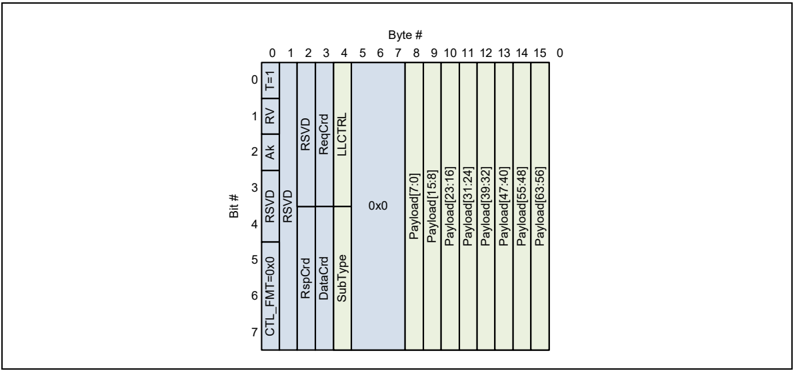

###### Figure 79. Retry Flit Format (Only Slot 0 is Valid. Others are Reserved)

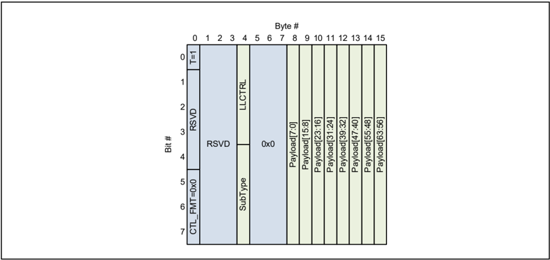

###### Figure 80. Init Flit Format (Only Slot 0 is Valid. Others are Reserved)

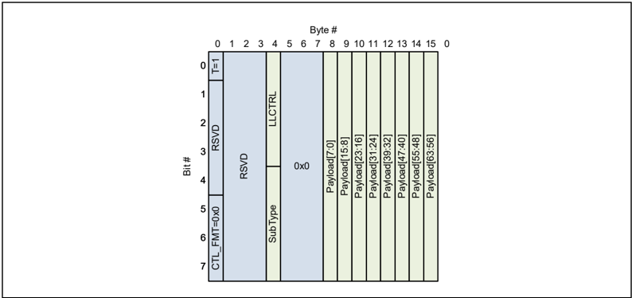

###### Figure 81. IDE Flit Format (Only Slot 0 is Valid. Others are Reserved)

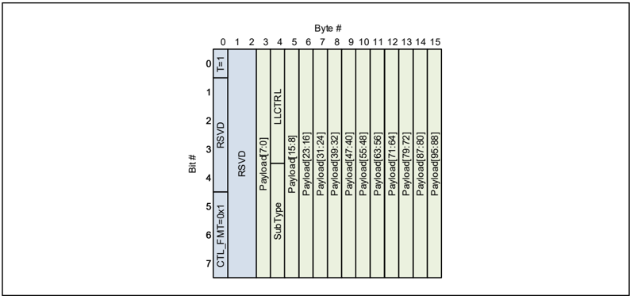

Note:

The RETRY.Req and RETRY.Ack flits belong to the type of flit that receiving devices must respond to even in the shadow of a previous CRC error. In addition to checking the CRC of a RETRY flit, the receiving device should also check as many defined bits (those listed as having hardcoded 1/0 values) as possible in order to increase confidence in qualifying an incoming flit as a RETRY message.

#### 4.2.7 Link Layer Initialization

Link Layer Initialization must be started after a physical layer link down to link up transition and the link has trained successfully to L0. During Initialization and after the Init Flit has been sent the Cache/Mem Link Layer can only send Control-Retry flits until Link Initialization is complete. The following describes how the link layer is initialized and credits are exchanged.

- The Tx portion of the Link Layer must wait until the Rx portion of the Link Layer has received at least one valid flit that is CRC clean before sending the ControlINIT.Param flit. Before this condition is met, the Link Layer must transmit only Control-Retry flits, i.e., Retry.Frame/Req/Ack/Idle flits.
    - If for any reason the Rx portion of the Link Layer is not ready to begin processing flits beyond Control-INIT and Control-Retry, the Tx will stall transmission of LLCTR-INIT.Param flit
    - Retry.Frame/Req/Ack are sent during this time as part of the regular Retry flow.
    - Retry.Idle flits are sent prior to sending a Init.Param flit even without a retry condition to ensure the remote agent can observe a valid flit.
- The Control-INIT.Param flit must be the first non-Control-Retry flit transmitted by the Link Layer
- The Rx portion of the Link Layer must be able to receive an Control-INIT.Param flit immediately upon completion of Physical Layer initialization because the very first valid flit may be a Control-INIT.Param
- Received Control-INIT.Param values (i.e., LLR Wrap Value) must be made 'active', that is, applied to their respective hardware states within 8 flit clocks of error-free reception of Control-INIT.Param flit.
    - Until an error-free INIT.Param flit is received and these values are applied, LLR Wrap Value shall assume a default value of 9 for the purposes of ESEQ tracking.
- Any non-Retry flits received before Control-INIT.Param flit will trigger an Uncorrectable Error.
- Only a single Control-INIT.Param flit is sent. Any CRC error conditions with an Control-INIT.Param flit will be dealt with by the Retry state machine and replayed from the Link Layer Retry Buffer.
- Receipt of an Control-INIT.Param flit after an Control-INIT.Param flit has already been received should be considered an Uncorrectable Error.
- It is the responsibility of the Rx to transmit credits to the sender using standard credit return mechanisms after link initialization. Each entity should know how many buffers it has and set its credit return counters to these values. Then, during normal operation, the standard credit return logic will return these credits to the sender.
- Immediately after link initialization, the credit exchange mechanism will use the LLCRD flit format.
- It is possible that the receiver will make available more credits than the sender can track for a given message class. For correct operation, it is therefore required that the credit counters at the sender be saturating. Receiver will drop all credits in receives for unsupported channels (example: Type 3 device receiving any CXL.Cache credits).
- Credits should be sized to achieve desired levels of bandwidth considering roundtrip time of credit return latency. This is implementation and usage dependent.

#### 4.2.8 CXL.cache/CXL.mem Link Layer Retry

The link layer provides recovery from transmission errors using retransmission, or Link Layer Retry (LLR). The sender buffers every retryable flit sent in a local link layer retry buffer (LLRB). To uniquely identify flits in this buffer , the retry scheme relies on sequence numbers which are maintained within each device. Unlike in PCIe, CXL.cache/ .mem sequence numbers are not communicated between devices with each flit to optimize link efficiency. The exchange of sequence numbers occurs only through link layer control flits during a LLR sequence. The sequence numbers are set to a

predetermined value (zero) during Link Layer Initialization and they are implemented using a wrap-around counter. The counter wraps back to zero after reaching the depth of the retry buffer. This scheme makes the following assumptions:

- The round-trip delay between devices is more than the maximum of the link layer clock or flit period.
- All protocol flits are stored in the retry buffer. See [Section 4.2.8.5.1](#42851-local-retry-state-machine-lrsm) for further details on the handling of non-retryable control flits.

Note that for efficient operation, the size of the retry buffer must be more than the round-trip delay. This includes:

- Time to send a flit from the sender
- Flight time of the flit from sender to receiver
- Processing time at the receiver to detect an error in the flit
- Time to accumulate and, if needed, force Ack return and send embedded Ack return back to the sender
- Flight time of the Ack return from the receiver to the sender
- Processing time of Ack return at the original sender

Otherwise, the LLR scheme will introduce latency, as the transmitter will have to wait for the receiver to confirm correct receipt of a previous flit before the transmitter can free space in its LLRB and send a new flit. Note that the error case is not significant because transmission of new flits is effectively stalled until successful retransmission of the erroneous flit anyway.

##### 4.2.8.1 LLR Variables

The retry scheme maintains two state machines and several state variables. Although the following text describes them in terms of one transmitter and one receiver, both the transmitter and receiver side of the retry state machines and the corresponding state variables are present at each device because of the bidirectional nature of the link. Since both sides of the link implement both transmitter and receiver state machines, for clarity this discussion will use the term 'local' to refer to the entity that detects a CRC error, and 'remote' to refer to the entity that sent the flit that was received erroneously.

The receiving device uses the following state variables to keep track of the sequence number of the next flit to arrive.

- ESeq : This indicates the expected sequence number of the next valid flit at the receiving link layer entity. ESeq is incremented by one (modulo the size of the LLRB) on error-free reception of a retryable flit. ESeq stops incrementing after an error is detected on a received flit until retransmission begins (RETRY.Ack message is received). Link Layer Initialization sets ESeq to 0. Note that there is no way for the receiver to know that an error was for a non-retryable vs retryable flit. For any CRC error it will initiate the link layer retry flow as usual, and effectively the transmitter will resend from the first retryable flit sent.

The sending entity maintains two indices into its LLRB, as indicated below.

- WrPtr : This indexes the entry of the LLRB that will record the next new flit. When an entity sends a flit, it copies that flit into the LLRB entry indicated by the WrPtr and then increments the WrPtr by one (modulo the size of the LLRB). This is implemented using a wrap-around counter that wraps around to 0 after reaching the depth of the LLRB. Non-Retryable Control flits do not affect the WrPtr. WrPtr stops incrementing after receiving an error indication at the remote entity (RETRY.Req message) except as described in the implementation note below, until normal operation resumes again (all flits from the LLRB have been retransmitted). WrPtr is initialized to 0 and is incremented only when a flit is put into the LLRB.

> **IMPLEMENTATION NOTE**
> 
> WrPtr may continue to increment after receiving Retry.Req message if there are prescheduled All Data Flits that are not yet sent over the link. This implementation will ensure that All Data Flits not interleaved with other flits are correctly logged into the Link Layer Retry Buffer.

- RdPtr : This is used to read the contents out of the LLRB during a retry scenario. The value of this pointer is set by the sequence number sent with the retransmission request (RETRY.Req message). The RdPtr is incremented by one (modulo the size of the LLRB) whenever a flit is sent, either from the LLRB in response to a retry request or when a new flit arrives from the transaction layer and irrespective of the states of the local or remote retry state machines. If a flit is being sent when the RdPtr and WrPtr are the same, then it indicates that a new flit is being sent, otherwise it must be a flit from the retry buffer .

The LLR scheme uses an explicit acknowledgment that is sent from the receiver to the sender to remove flits from the LLRB at the sender. The acknowledgment is indicated via an ACK bit in the headers of flits flowing in the reverse direction. In CXL.cache, a single ACK bit represents 8 acknowledgments. Each entity keeps track of the number of available LLRB entries and the number of received flits pending acknowledgment through the following variables.

- NumFreeBuf : This indicates the number of free LLRB entries at the entity. NumFreeBuf is decremented by 1 whenever an LLRB entry is used to store a transmitted flit. NumFreeBuf is incremented by the value encoded in the Ack/ Full_Ack (Ack is the protocol flit bit AK, Full_Ack defined as part of LLCRD message) field of a received flit. NumFreeBuf is initialized at reset time to the size of the LLRB. The maximum number of retry queues at any entity is limited to 255 (8 bit counter). Also, note that the retry buffer at any entity is never filled to its capacity, therefore NumFreeBuf is never '0. If there is only 1 retry buffer entry available, then the sender cannot send a Retryable flit. This restriction is required to avoid ambiguity between a full or an empty retry buffer during a retry sequence that may result into incorrect operation. This implies if there are only 2 retry buffer entries left (NumFreeBuf = 2), then the sender can send an Ack bearing flit only if the outgoing flit encodes a value of at least 1 (which may be a Protocol flit with Ak bit set), else a LLCRD control flit is sent with Full_Ack value of at least 1. This is required to avoid deadlock at the link layer due to retry buffer becoming full at both entities on a link and their inability to send ACK through header flits. This rule also creates an implicit expectation that you cannot start a sequence of 'All Data Flits' that cannot be completed before NumFreeBuf=2 because you must be able to inject the Ack bearing flit when NumFreeBuf=2 is reached.
- NumAck : This indicates the number of acknowledgments accumulated at the receiver. NumAck increments by 1 when a retryable flit is received. NumAck is decremented by 8 when the ACK bit is set in the header of an outgoing flit. If the outgoing flit is coming from the LLRB and its ACK bit is set, NumAck does not decrement. At initialization, NumAck is set to 0. The minimum size of the NumAck field is the size of the LLRB. NumAck at each entity must be able to keep track of at least 255 acknowledgments.

The LLR protocol requires that the number of retry queue entries at each entity must be at least 22 entries (Size of Forced Ack (16) + Max All-Data-Flit (4) + 2) to prevent deadlock.

##### 4.2.8.2 LLCRD Forcing

Recall that the LLR protocol requires space available in the LLRB to transmit a new flit, and that the sender must receive explicit acknowledgment from the receiver before freeing space in the LLRB. In scenarios where the traffic flow is very asymmetric, this requirement could result in traffic throttling and possibly even starvation.

Suppose that the A → B direction has very heavy traffic, but there is no traffic at all in the B → A direction. In this case A could exhaust its LLRB size, while B never has any return traffic in which to embed Acks. In CXL we want to minimize injected traffic to reserve bandwidth for the other traffic stream(s) sharing the link.

To avoid starvation, CXL must permit LLCRD Control message forcing (injection of a non-traffic flit to carry an Acknowledge and Credit return), but this function must be constrained to avoid wasting bandwidth. In CXL, when B has accumulated a programmable minimum number of Acks to return, B's CXL.cache/mem link layer will inject a LLCRD flit to return an Acknowledge. The threshold of pending Acknowledges before forcing the LLCRD can be adjusted using the 'Ack Force Threshold' field in the 'CXL Link Layer Ack Timer Control Register'.

There is also a timer-controlled mechanism to force LLCRD when the timer reaches a threshold. The timer will clear whenever an ACK/CRD carrying message is sent. It will increment every link layer clock an ACK/CRD carrying message is not sent and any Credit value to return is greater than 0 or Acknowledge to return is greater than 1. The reason the Acknowledge threshold value is specified as 'greater than 1', as opposed to 'greater than 0', is to avoid repeated forcing of LLCRD when no other retryable flits are being sent. If the timer incremented when the pending Acknowledge count is 'greater than 0', there would be a continuous exchange of LLCRD messages carrying Acknowledges on an otherwise idle link; this is because the LLCRD is itself retryable and results in a returning Acknowledge in the other direction. The result is that the link layer would never be truly idle when the transaction layer traffic is idle. The timer threshold to force LLCRD is configurable using the 'Ack or CRD flush retimer' field in the 'CXL Link Layer Ack Timer Control Register'. It should also be noted that the CXL.cache link layer must accumulate a minimum of 8 Acks to set the ACK bit in a CXL.cache and CXL.mem flit header. If LLCRD forcing occurred after the accumulation of 8 Acks, it could result in a negative beat pattern where real traffic always arrives soon after a forced Ack, but not long enough after for enough Acks to re-accumulate to set the ACK bit. In the worst case this could double the bandwidth consumption of the CXL.cache side. By waiting for at least 16 Acks to accumulate, the CXL.cache/mem link layer ensures that it can still opportunistically return Acks in a protocol flit avoiding the need to force an LLCRD for Ack return. It is recommended that the Ack Force Threshold value be set to 16 or greater in the 'CXL Link Layer Ack Timer Control Register' to reduce overhead of LLCRD injection.

It is recommended that link layer prioritize other link layer flits before LLCRD forcing.

Pseudo-code for forcing function below:

```
IF (SENDING_ACK_CRD_MESSAGE==FALSE AND (ACK_TO_RETURN >1 OR CRD_TO_RETURN>0))

    TimerValue++

ELSE

    TimerValue=0

IF (TimerValue >=Ack_or_CRD_Flush_Retimer OR ACK_TO_RETURN >= Ack Force_Threshold)

    Force_LLCRD = TRUE

ELSE

    Force_LLCRD=FALSE
```

Note: Ack_or_CRD_Flush_Retimer and Ack_Force_Threshold are values that come from 'CXL Link Layer Ack Timer Control Register'.

Note: LLCRD forcing may also occur for QoS Telemetry load value changes as described in [Section 4.2.6](#426-link-layer-control-flit).

### Figure 82. Retry Buffer and Related Pointers.

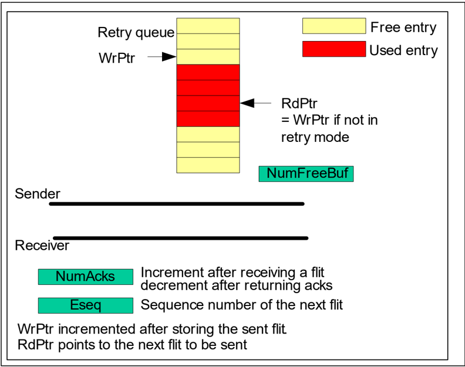

##### 4.2.8.3 LLR Control Flits

The LLR Scheme uses several link layer control flits of the RETRY format to communicate the state information and the implicit sequence numbers between the entities.

- RETRY.Req: This flit is sent from the entity that received a flit in error to the sending entity. The flit contains the expected sequence number (ESeq) at the receiving entity, indicating the index of the flit in the retry queue at the remote entity that must be retransmitted. It also contains the NUM_RETRY value of the sending entity which is defined in [Section 4.2.8.5.1](#42851-local-retry-state-machine-lrsm). This message is also triggered as part of the Initialization sequence even when no error is observed as described in [Section 4.2.7](#427-link-layer-initialization).
- RETRY.Ack: This flit is sent from the entity that is responding to an error detected at the remote entity. It contains a reflection of the NUM_RETRY value from the corresponding Retry.Req message. The flit contains the WrPtr value at the sending entity for debug purposes only. The WrPtr value should not be used by the retry state machines in any way. This flit will be followed by the flit identified for retry by the ESeq number.
- RETRY.Idle: This flit is sent during the retry sequence when there are no protocol flits to be sent (see [Section 4.2.8.5.2](#42852-timeout-definition) for details) or a retry queue is not ready to be sent. For example, it can be used for debug purposes for designs that need additional time between sending the RETRY.Ack and the actual contents of the LLR queue.
- RETRY.Frame: This flit is sent in conjunction with a RETRY.Req or RETRY.Ack flit to prevent aliased decoding of these flits. See [Section 4.2.8.5](#4285-llr-state-machines) for further details.

The table below describes the impact of RETRY messages on the local and remote retry state machines. In this context, the 'sender' refers to the Device sending the message and the 'receiver' refers to the Device receiving the message. Note that how this maps to which device detected the CRC error and which sent the erroneous message depends on the message type; e.g., for a RETRY.Req sequence, the sender detected the CRC error, but for a RETRY.Ack sequence, it's the receiver that detected the CRC error.

##### 4.2.8.4 RETRY Framing Sequences

Recall that the CXL.cache/mem flit formatting specifies an all-data flit for link efficiency. This flit is encoded as part of the header of the preceding flit and contains no header information of its own. This introduces the possibility that the data contained in this flit could happen to match the encoding of a RETRY flit.

This introduces a problem at the receiver. It must be certain to decode the actual RETRY flit, but it must not falsely decode an aliasing data flit as a RETRY flit. In theory it might use the header information of the stream it receives in the shadow of a CRC error to determine whether it should attempt to decode the subsequent flit. Therefore, the receiver cannot know with certainty which flits to treat as header-containing (decode) and which to ignore (all-data).

CXL introduces the RETRY.Frame flit for this purpose to disambiguate a control sequence from an all-data flit (ADF). Due to MDH, 4 ADF can be sent back-to-back. Hence, a RETRY.Req sequence comprises 5 RETRY.Frame flits immediately followed by a RETRY.Req flit, and a RETRY.Ack sequence comprises 5 RETRY.Frame flits immediately followed by a RETRY.Ack flit. This is shown in Figure 83.

###### Table 55. Control Flits and Their Effect on Sender and Receiver States

| RETRY Message                                                                               | Sender State                                                                                 | Receiver State                                                                                               |
|---------------------------------------------------------------------------------------------|----------------------------------------------------------------------------------------------|--------------------------------------------------------------------------------------------------------------|
| RETRY.Idle                                                                                  | Unchanged.                                                                                   | Unchanged.                                                                                                   |
| RETRY.Frame + RETRY.Req Sequence                                                            | Local Retry State Machine (LRSM) is updated. NUM_RETRY is incremented. See [Section 4.2.8.5.1](#42851-local-retry-state-machine-lrsm) | Remote Retry State Machine (RRSM) is updated. RdPtr is set to ESeq sent with the flit. See [Section 4.2.8.5.3](#42853-remote-retry-state-machine-rrsm) |
| RETRY.Frame + RETRY.Ack Sequence                                                            | RRSM is updated.                                                                             | LRSM is updated.                                                                                             |
| RETRY.Frame, RETRY.Req, or RETRY.Ack message that is not as part of a valid framed sequence | Unchanged.                                                                                   | Unchanged (drop the flit).                                                                                   |

Note: A RETRY.Ack sequence that arrives when a RETRY.Ack is not expected will be treated as an error by the receiver. Error resolution in this case is device specific though it is recommended that this results in the machine halting operation. It is recommended that this error condition not change the state of the LRSM.

##### 4.2.8.5 LLR State Machines

The LLR scheme is implemented with two state machines: Remote Retry State Machine (RRSM) and Local Retry State Machine (LRSM). These state machines are implemented by each entity and together determine the overall state of the transmitter and receiver at the entity. The states of the retry state machines are used by the send and receive controllers to determine what flit to send and the actions needed to process a received flit.

###### 4.2.8.5.1 Local Retry State Machine (LRSM)

This state machine is activated at the entity that detects an error on a received flit. The possible states for this state machine are:

- RETRY_LOCAL_NORMAL: This is the initial or default state indicating normal operation (no CRC error has been detected).
- RETRY_LLRREQ: This state indicates that the receiver has detected an error on a received flit and a RETRY.Req sequence must be sent to the remote entity.
- RETRY_LOCAL_IDLE: This state indicates that the receiver is waiting for a RETRY.Ack sequence from the remote entity in response to its RETRY.Req sequence. The implementation may require sub-states of RETRY_LOCAL_IDLE to capture, for example, the case where the last flit received is a Frame flit and the next flit expected is a RETRY.Ack.
- RETRY_PHY_REINIT: The state machine remains in this state for the duration of a physical layer retrain.
- RETRY_ABORT: This state indicates that the retry attempt has failed and the link cannot recover. Error logging and reporting in this case is device specific. This is a terminal state.

The local retry state machine also has the three counters described below. The counters and thresholds described below are implementation specific.

- TIMEOUT : This counter is enabled whenever a RETRY.Req request is sent from an entity and the LRSM state becomes RETRY_LOCAL_IDLE. The TIMEOUT counter is disabled and the counting stops when the LRSM state changes to some state other than RETRY_LOCAL_IDLE. The TIMEOUT counter is reset to 0 at link layer initialization and whenever the LRSM state changes from RETRY_LOCAL_IDLE to RETRY_LOCAL_NORMAL or RETRY_LLRREQ. The TIMEOUT counter is also reset when the Physical layer returns from re-initialization (the LRSM transition through RETRY_PHY_REINIT to RETRY_LLRREQ). If the counter has reached its threshold without receiving a Retry.Ack sequence, then the RETRY.Req request is sent again to retry the same flit. See [Section 4.2.8.5.2](#42852-timeout-definition) for a description of when TIMEOUT increments. Note: It is suggested that the value of TIMEOUT should be no less than 4096 transfers.
- NUM_RETRY : This counter is used to count the number of RETRY.Req requests sent to retry the same flit. The counter remains enabled during the whole retry sequence (state is not RETRY_LOCAL_NORMAL). It is reset to 0 at initialization. It is also reset to 0 when a RETRY.Ack sequence is received with the Empty bit set or whenever the LRSM state is RETRY_LOCAL_NORMAL and an error-free retryable flit is received. The counter is incremented whenever the LRSM state changes from RETRY_LOCAL_LLRREQ to RETRY_LOCAL_IDLE. If the counter reaches a threshold (called MAX_NUM_RETRY), then the local retry state machine transitions to the RETRY_PHY_REINIT. The NUM_RETRY counter is also reset when the Physical layer exits from LTSSM recovery state (the LRSM transition through RETRY_PHY_REINIT to RETRY_LLRREQ). Note: It is suggested that the value of MAX_NUM_RETRY should be no less than 0xA.
- NUM_PHY_REINIT : This counter is used to count the number of physical layer reinitializations generated during a LLR sequence. The counter remains enabled during the whole retry sequence (state is not RETRY_LOCAL_NORMAL). It is reset to 0 at initialization and after successful completion of the retry sequence. The counter is incremented whenever the LRSM changes from RETRY_LLRREQ to RETRY_PHY_REINIT. If the counter reaches a threshold (called MAX_NUM_PHY_REINIT) instead of transitioning from RETRY_LLRREQ to RETRY_PHY_REINIT, the LRSM will transition to RETRY_ABORT. The NUM_PHY_REINIT counter is also reset whenever a Retry.Ack sequence is received with the Empty bit set. Note: It is suggested that the value of MAX_NUM_PHY_REINIT should be no less than 0xA.

Note that the condition of TIMEOUT reaching its threshold is not mutually exclusive with other conditions that cause the LRSM state transitions. Retry.Ack sequences can be assumed to never arrive at the time that the retry requesting device times out and sends a new RETRY.Req sequence (by appropriately setting the value of TIMEOUT - see [Section 4.2.8.5.2](#42852-timeout-definition)). If this case occurs, no guarantees are made regarding the behavior of the device (behavior is 'undefined' from a Spec perspective and is not validated from an implementation perspective). Consequently, the LLR Timeout value should not be reduced unless it can be certain this case will not occur. If an error is detected at the same time as TIMEOUT reaches its threshold, then the error on the received flit is ignored, TIMEOUT is taken, and a repeat Retry.Req sequence is sent to the remote entity.

###### Table 56. Local Retry State Transitions

| Current Local Retry State   | Condition                                                                                                                    | Next Local Retry State   | Actions                                                                                                                                                                                                                                  |
|-----------------------------|------------------------------------------------------------------------------------------------------------------------------|--------------------------|------------------------------------------------------------------------------------------------------------------------------------------------------------------------------------------------------------------------------------------|
| RETRY_LOCAL_NORMAL          | An error free retryable flit is received.                                                                                    | RETRY_LOCAL_NORMAL       | Increment NumFreeBuf using the amount specified in the ACK or Full_Ack fields. Increment NumAck by 1. Increment Eseq by 1. NUM_RETRY is reset to 0. NUM_PHY_REINIT is reset to 0. Received flit is processed normally by the link layer. |
| RETRY_LOCAL_NORMAL          | Error free non-retryable flit (other than Retry.Req sequence) is received.                                                   | RETRY_LOCAL_NORMAL       | Received flit is processed.                                                                                                                                                                                                              |
| RETRY_LOCAL_NORMAL          | Error free Retry.Req sequence is received.                                                                                   | RETRY_LOCAL_NORMAL       | RRSM is updated.                                                                                                                                                                                                                         |
| RETRY_LOCAL_NORMAL          | Error is detected on a received flit.                                                                                        | RETRY_LLRREQ             | Received flit is discarded.                                                                                                                                                                                                              |
| RETRY_LOCAL_NORMAL          | PHY_RESET 1 / PHY_REINIT 2 detected.                                                                                         | RETRY_PHY_REINIT         | None.                                                                                                                                                                                                                                    |
| RETRY_LLRREQ                | NUM_RETRY == MAX_NUM_RETRY and NUM_PHY_REINIT == MAX_NUM_PHY_REINIT                                                          | RETRY_ABORT              | Indicate link failure.                                                                                                                                                                                                                   |
| RETRY_LLRREQ                | NUM_RETRY == MAX_NUM_RETRY and NUM_PHY_REINIT < MAX_NUM_PHY_REINIT                                                           | RETRY_PHY_REINIT         | If an error-free Retry.Req or Retry.Ack sequence is received, process the flit. Any other flit is discarded. RetrainRequest is sent to physical layer. Increment NUM_PHY_REINIT.                                                         |
| RETRY_LLRREQ                | NUM_RETRY < MAX_NUM_RETRY and a Retry.Req sequence has not been sent.                                                        | RETRY_LLRREQ             | If an error-free Retry.Req or Retry.Ack sequence is received, process the flit. Any other flit is discarded.                                                                                                                             |
| RETRY_LLRREQ                | NUM_RETRY < MAX_NUM_RETRY and a Retry.Req sequence has been sent.                                                            | RETRY_LOCAL_IDLE         | If an error free Retry.Req or Retry.Ack sequence is received, process the flit. Any other flit is discarded. Increment NUM_RETRY.                                                                                                        |
| RETRY_LLRREQ                | PHY_RESET 1 / PHY_REINIT 2 detected.                                                                                         | RETRY_PHY_REINIT         | None.                                                                                                                                                                                                                                    |
| RETRY_LLRREQ                | Error is detected on a received flit                                                                                         | RETRY_LLRREQ             | Received flit is discarded.                                                                                                                                                                                                              |
| RETRY_PHY_REINIT            | Physical layer still in reinit.                                                                                              | RETRY_PHY_REINIT         | None.                                                                                                                                                                                                                                    |
| RETRY_PHY_REINIT            | Physical layer returns from Reinit.                                                                                          | RETRY_LLRREQ             | Received flit is discarded. NUM_RETRY is reset to 0.                                                                                                                                                                                     |
| RETRY_LOCAL_IDLE            | Retry.Ack sequence is received and NUM_RETRY from Retry.Ack matches the value of the last Retry.Req sent by the local entity | RETRY_LOCAL_NORMAL       | TIMEOUT is reset to 0. If Retry.Ack sequence is received with Empty bit set, NUM_RETRY is reset to 0 and NUM_PHY_REINIT is reset to 0.                                                                                                   |
| RETRY_LOCAL_IDLE            | Retry.Ack sequence is received and NUM_RETRY from Retry.Ack does NOT match the value of the last Retry.Req sent by the local entity | RETRY_LOCAL_IDLE         | Any received retryable flit is discarded  |
| RETRY_LOCAL_IDLE            | TIMEOUT has reached its threshold.                                                                                                  | RETRY_LLRREQ             | TIMEOUT is reset to 0.                    |
| RETRY_LOCAL_IDLE            | Error is detected on a received flit.                                                                                               | RETRY_LOCAL_IDLE         | Any received retryable flit is discarded. |
| RETRY_LOCAL_IDLE            | A flit other than RETRY.Ack/ Retry.Req sequence is received.                                                                        | RETRY_LOCAL_IDLE         | Any received retryable flit is discarded. |
| RETRY_LOCAL_IDLE            | A Retry.Req sequence is received.                                                                                                   | RETRY_LOCAL_IDLE         | RRSM is updated.                          |
| RETRY_LOCAL_IDLE            | PHY_RESET 1 / PHY_REINIT 2 detected.                                                                                                | RETRY_PHY_REINIT         | None.                                     |
| RETRY_ABORT                 | A flit is received.                                                                                                                 | RETRY_ABORT              | All received flits are discarded.         |

1. PHY_RESET is the condition of Physical Layer telling the Link Layer it needs to initiate a Link Layer Retry due to exit from LTSSM Recovery state.
2. PHY_REINIT is the condition of the Link Layer instructing the Phy to retrain.

###### 4.2.8.5.2 TIMEOUT Definition

After the local receiver has detected a CRC error, triggering the LRSM, the local Tx sends a RETRY.Req sequence to initiate LLR. At this time, the local Tx also starts its TIMEOUT counter.

The purpose of this counter is to decide that either the Retry.Req sequence or corresponding Retry.Ack sequence has been lost, and that another RETRY.Req attempt should be made. Recall that it is a fatal error to receive multiple Retry.Ack sequences(i.e., a subsequent Ack without a corresponding Req is unexpected). To reduce the risk of this fatal error condition we check NUM_RETRY value returned to filter out Retry.Ack messages from the prior retry sequence. This is done to remove fatal condition where a single retry sequence incurs a timeout while the Ack message is in flight. The TIMEOUT counter should be capable of handling worst-case latency for a Retry.Req sequence to reach the remote side and for the corresponding Retry.Ack sequence to return.

Certain unpredictable events (such as low power transitions, etc.) that interrupt link availability could add a very large amount of latency to the RETRY round-trip. To make the TIMEOUT robust to such events, instead of incrementing per link layer clock, TIMEOUT increments whenever the local Tx transmits a flit, protocol or control. Due to the TIMEOUT protocol, it must force injection of RETRY.Idle flits if it has no real traffic to send, so that the TIMEOUT counter continues to increment.

###### 4.2.8.5.3 Remote Retry State Machine (RRSM)

The remote retry state machine is activated at an entity if a flit sent from that entity is received in error by the local receiver , resulting in a link layer retry request (Retry.Req sequence) from the remote entity. The possible states for this state machine are:

- RETRY_REMOTE_NORMAL: This is the initial or default state indicating normal operation.
- RETRY_LLRACK: This state indicates that a link layer retry request (Retry.Req sequence) has been received from the remote entity and a Retry.Ack sequence followed by flits from the retry queue must be (re)sent.

The remote retry state machine transitions are described in the table below.

###### Table 57. Remote Retry State Transition

| Current Remote Retry State   | Condition                                                        | Next Remote Retry State   |
|------------------------------|------------------------------------------------------------------|---------------------------|
| RETRY_REMOTE_NORMAL          | Any flit, other than error free Retry.Req sequence, is received. | RETRY_REMOTE_NORMAL       |
| RETRY_REMOTE_NORMAL          | Error free Retry.Req sequence received.                          | RETRY_LLRACK              |
| RETRY_LLRACK                 | Retry.Ack sequence not sent.                                     | RETRY_LLRACK              |
| RETRY_LLRACK                 | Retry.Ack sequence sent.                                         | RETRY_REMOTE_NORMAL       |
| RETRY_LLRACK                 | Physical Layer Reinitialization                                  | RETRY_REMOTE_NORMAL       |

Note: In order to select the priority of sending flits, the following rules apply:

1. Whenever the RRSM state becomes RETRY_LLRACK, the entity must give priority to sending the Control flit with Retry.Ack
2. Except RRSM state of RETRY_LLRACK, the priority goes to LRSM state of RETRY_LLRREQ and in that case the entity must send a Control flit with Retry.Req over all other flits except an all-data flit sequence.

The overall sequence of replay is shown in Figure 83.

### Figure 83. CXL.cache/mem Replay Diagram

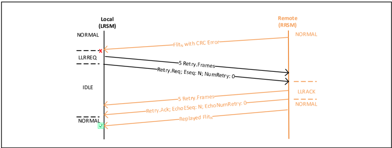

##### 4.2.8.6 Interaction with Physical Layer Reinitialization

On detection of a physical layer LTSSM Recovery, the receiver side of the link layer must force a link layer retry on the next flit. Forcing an error will either initiate LLR or cause a current LLR to follow the correct error path. The LLR will ensure that no retryable flits are dropped during the physical layer reinit. Without initiating a LLR it is possible that packets/flits in flight on the physical wires could be lost or the sequence numbers could get mismatched.

Upon detection of a physical layer LTSSM Recovery, the LLR RRSM needs to be reset to its initial state and any instance of Retry.Ack sequence needs to be cleared in the link layer and physical layer. The device needs to make sure it receives a Retry.Req sequence before it ever transmits a RETRY.Ack sequence.

##### 4.2.8.7 CXL.cache/CXL.mem Flit CRC

The CXL.cache Link Layer uses a 16b CRC for transmission error detection. The 16b CRC is over the 528 bit flit. The assumptions about the type errors is as follows:

- Bit ordering runs down each lane
- Bit Errors occur randomly or in bursts down a lane, with majority of errors single bit random errors.
- Random errors can statistically cause multiple bit errors in a single flit, so it is more likely to get 2 errors in a flit then 3 errors, and more likely to get 3 errors in a flit then 4 errors, and so on...
- There is no requirement for primitive polynomial (a polynomial that generates all elements of an extension field from a base field) since we do have a fixed payload. Primitive may be the result, but it's not required.

###### 4.2.8.7.1 CRC-16 Polynomial and Detection Properties

The CRC polynomial to be used is 0x1f053.

- The 16b CRC Polynomial has the following properties:
- All Single, double, and triple bit errors detected
- Polynomial selection based on best 4-bit error detection characteristics and perfect 1, 2, 3-bit error detection

###### 4.2.8.7.2 CRC-16 Computation

Below are the 512 bit data masks for use with an XOR tree to produce the 16 CRC bits. Data Mask bits [511:0] for each CRC bit are applied to the Flit bits [511:0] and XOR is performed. The resulting CRC bits are included as flit bits [527:512] are defined to be CRC[15:00]. Pseudo code example for CRC bit 15 of this is CRC[15] = XOR (DM[15][511:0] AND Flit[511:0]).

The Flit Data Masks for the 16 CRC bits are located below:

```
DM[15][511:0] =
512'hEF9C_D9F_C4BB_B83A_3E84_A97C_D7AE_DA13_FAEB_01B8_5B20_4A4C_AE1E_79D9_7753_5D21_DC7F_DD6A_38F0_3E7_F5F5_2A2C_636D_B05C_3978_EA30_CD50_E0D9_9B06_93D4_746B_2431

DM[14][511:0] =
512'h9852_B505_26E6_6427_21C6_FDC2_BC79_B71A_079E_8164_76B0_6F6A_F911_4535_CCFA_F3B1_3240_33DF_2488_214C_0F0F_BF3A_52DB_6872_25C4_9F28_ABF8_90B5_5685_DA3E_4E5E_B629

DM[13][511:0] =
512'h23B5_837B_57C8_8A29_AE67_D79D_8992_0192_F924_410A_6078_7DF9_D296_DB43_912E_24F9_455F_C485_AAB4_2ED1_F272_F5B1_4A00_0465_2B9A_A5A4_98AC_A883_3044_7ECB_5344_7F25

DM[12][511:0] =
512'h7E46_1844_6F5F_FD2E_E9B7_42B2_1367_DACD_8679_213D_6B1C_74B0_4755_1478_BFC4_4F5D_7ED0_3F28_EDAA_291F_0CCC_50F4_C66D_B26E_ACB5_B8E2_8106_B4908_0324_ACB1_DDC9_1BA3

DM[11][511:0] =
512'h50BF_D5DB_F314_46AD_4A5F_0825_DE1D_377D_B97D_9126_EEAE_7014_8DB4_F3E5_28B1_7A8F_6317_C2FE_4E25_2AF8_7393_0256_005B_696B_6F22_3641_8DD3_B95_9A94_C58C_9A8F_A9E0

DM[10][511:0] =
512'hA85F_EAEED_F98A_2356_A52F_8412_EF0E_9BBE_DCEB_C893_7757_380A_46DA_79F2_9458_BD47_B18B_E17F_2712_957C_39C9_8128_B02D_B4B5_B791_1B20_C6E9_DD4A_CD4A_62C6_4D47_D4F0

DM[09][511:0] =
512'h542F_F576_FCC5_11AB_5297_C209_7787_4DDF_6E75_E449_BBAB_9C05_236D_3CF9_4A2C_5EA3_D8C5_F0BF_9398_4ABE_1CE4_C095_8016_DA5A_DBC8_8D90_6374_EEA5_66A5_3163_26A3_EA78

DM[08] [511:0] = 
512'h2A17_FABB_E67E62_88D5_A94B_E104_BBC3_A6EF_B73A_F224_DDD5_CE02_91B6_9E7C_A516_2F51_EC62_F85F_C9C_A55F_0E72_604A_C00B_6D2D_6DE4_46C8_31BA_7752_B352_98B1_9351_F53C

DM[07] [511:0] = 
512'h10B_FBD5_DFB3_446A_D4A5_F082_5DE1_D377_DB9D_7912_6EEA_E701_48DB_4F3E_528B_17A8_F631_7C2F_E4E2_52AF_8739_3025_6005_B696_B6F2_2364_18DD_3BA9_59A9_4C58_C9A8_FA9E

DM[06] [511:0] = 
512'h8A85_FEAE_F98E_A235_6A52_F841_2F0E_F9EB_FEDC_BC89_3775_7380_A6D_A79F_2945_8BD4_7B18_BE17_F271_2957_C39C_D9812_B002_DB4B_5B79_11B2_0C6E_9D4_ACD4_A62C_64D4_7D4F

DM[05] [511:0] = 
512'haADE_26AE_AB77_E920_8BAD_D55C_40D6_AEEC_0C0C_5FFC_C09A_F38C_FC28_AA16_E3F1_98CB_E1F3_8261_C1C8_AADC_143B_6625_3B6C_DDF9_94C4_62E9_CB67_AE33_CD6C_C0C2_4601_1A96

DM[04] [511:0] = 
512'hD56_F137_55B_FFB4_950_4D56_EAEA_206B_5767_0606_2FFE_604D_79C6_7E14_550B_71F8_CC65_F0F9_C130_E0E4_556E_0A1D_B312_9DB6_6ECA2_3174_E53B_D73_19E_B6G6_6061_2300_8D4B

DM[03] [511:0] = 
512'h852B_5052_E66_4272_1C6F_DC2B_C79B_71A0_7988_1647_6B06_F6AF_9114_535C_CFAF_3B13_2403_3DF2_4882_14C0_F0FB_F3A5_2DB6_8772_5C49_F28A_BF89_EB55_685D_A3E4_E5EB_6294

DM[02] [511:0] = 
512'hC295_A829_3733_2139_0E37_EE15_E3CD_B8D0_3CF4_OB23_B583_7B57_C88A_29AE_67D7_9D89_9201_9EF9_2441_0A0_6787D_F9D2_96DB_4391_2E24_F945_5FC4_85AA_B42E_D1F2_72F5_B14A

DM[01] [511:0] = 
512'h614A_D414_9B99_909_C871_B70A_F1E6_DC68_1E7A_0591_DAC1_DBAD_E445_14D7_33EE_CEC4_C900_CF7C_9220_8530_3C3E_FCE9_4B6D_A1C8_9712_7CA2_AFE2_2D5_5A17_68F9_397A_D8A5

DM[00] [511:0] = 
512'hDF39_B3F_8377_7074_7D0_52F9_AF5D_B427_F5D6_0370_B640_9949_5C3C_F3B2_EEA6_BA43_B8FF_BAD4_71E0_7CEF_EBEA_5458_C6DB_60B8_72F1_D461_9AA1_C1B3_360D_27A8_E8D6_4863
```
#### 4.2.9 Poison and Viral

##### 4.2.9.1 Viral

Viral is a containment feature as described in [Section 12.4](#124-cxl-viral-handling), 'CXL Viral Handling' . As such, when the local socket is in a viral state, it is the responsibility of all off-die interfaces to convey this state to the remote side for appropriate handling. The CXL.cache/mem link layer conveys viral status information. As soon as the viral status is detected locally, the link layer forces a CRC error on the next outgoing flit. If there is no traffic to send, the transmitter will send a LLCRD flit with a CRC error. It then embeds viral status information in the Retry.Ack message it generates as part of the defined CRC error recovery flow.

There are two primary benefits to this methodology. First, by using the RETRY.Ack to convey viral status, we do not have to allocate a bit for this in protocol flits. Second, it allows immediate indication of viral and reduces the risk of race conditions between the viral distribution path and the datapath. These risks could be particularly exacerbated by the large CXL.cache flit size and the potential limitations in which components (header, slots) allocate dedicated fields for viral indication.

To support MLD components, first introduced in CXL 2.0, a Viral LD-ID Vector is defined in the Retry.Ack to encode which LD-ID is impacted by the viral state. This allows viral to be indicated to any set of Logical Devices. This vector is only applicable when the primary viral bit is set, and is only applicable to links that support multiple LD-ID

(referred to as MLD - Multi-Logical Device). Links without LD-ID support (referred to as SLD - Single Logical Device) will treat the vector as Reserved. For MLD, the encoding of all zeros indicates that all LD-ID are in viral and is equivalent to an encoding of all ones.

## 5.0 Compute Express Link ARB/MUX

The figure below shows where the CXL ARB/MUX exists in the Flex Bus layered hierarchy. The ARB/MUX provides dynamic muxing of the CXL.io and CXL.cache/ CXL.mem link layer control and data signals to interface with the Flex Bus physical layer.

### Figure 84. Flex Bus Layers - CXL ARB/MUX Highlighted

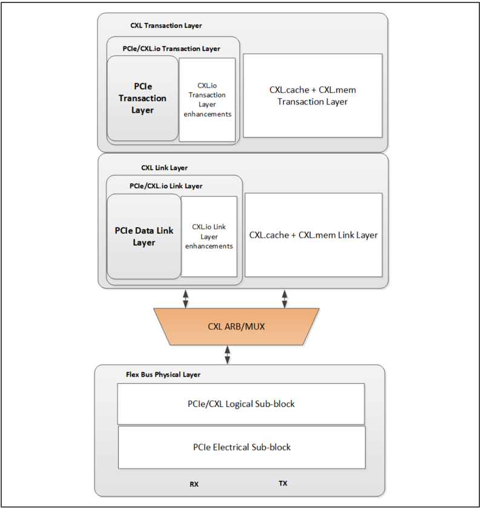

In the transmit direction, the ARB/MUX arbitrates between requests from the CXL link layers and multiplexes the data. It also processes power state transition requests from the link layers: resolving them to a single request to forward to the physical layer, maintaining virtual link state machines (vLSMs) for each link layer interface, and generating ARB/MUX link management packets (ALMPs) to communicate the power state transition requests across the link on behalf of each link layer . Please refer to [Section 10.3](#103-compute-express-link-power-management), [Section 10.4](#104-cxlio-link-power-management), and [Section 10.5](#105-cxlcache-cxlmem-link-power-management) for more details on how the ALMPs are utilized in the overall flow for power state transitions. In PCIe mode, the ARB/MUX is bypassed, and thus ALMP generation by the ARB/MUX is disabled.

In the receive direction, the ARB/MUX determines the protocol associated with the CXL flit and forwards the flit to the appropriate link layer. It also processes the ALMP packets, participating in any required handshakes and updating its vLSMs as appropriate.

### 5.1 Virtual LSM States

The ARB/MUX maintains vLSMs for each CXL link layer it interfaces with, transitioning the state based on power state transition requests it receives from the local link layer or from the remote ARB/MUX on behalf of a remote link layer. Table 58 below lists the different possible states for the vLSMs. PM States and Retrain are virtual states that can differ across interfaces (CXL.io and CXL.cache and CXL.mem), however all other states such as LinkReset, LinkDisable and LinkError are forwarded to the Link Layer and are therefore synchronized across interfaces.

#### Table 58. Virtual LSM States Maintained Per Link Layer Interface

| Virtual LSM State   | Description                                                                                     |
|---------------------|-------------------------------------------------------------------------------------------------|
| Reset               | Power-on default state during which initialization occurs                                       |
| Active              | Normal operational state                                                                        |
| L1.0                | Power savings state, from which the link can enter Active via Retrain (maps to PCIe L1)         |
| L1.1                | Power savings state, from which the link can enter Active via Retrain (reserved for future use) |
| L1.2                | Power savings state, from which the link can enter Active via Retrain (reserved for future use) |
| L1.3                | Power savings state, from which the link can enter Active via Retrain (reserved for future use) |
| DAPM                | Deepest Allowable PM State (not a resolved state; a request that resolves to an L1 substate)    |
| SLEEP_L2            | Power savings state, from which the link must go through Reset to reach Active                  |
| LinkReset           | Reset propagation state resulting from software or hardware initiated reset                     |
| LinkError           | Link Error state due to hardware detected errors                                                |
| LinkDisable         | Software controlled link disable state                                                          |
| Retrain             | Transitory state that transitions to Active                                                     |

Note: When the Physical Layer enters Hot-Reset or LinkDisable state, that state is communicated to all link layers as LinkReset or LinkDisable respectively. No ALMPs are exchanged, irrespective of who requested, for these transitions. LinkError should take the LTSSM to Detect.

The ARB/MUX looks at the state of each vLSM to resolve to a single state request to forward to the physical layer as specified in [Table 59](#table-59-arbmux-multiple-virtual-lsm-resolution-table). For example, if current vLSM[0] state is L1.0 (row = L1.0) and current vLSM[1] state is Active (column = Active), then the resolved request from the ARB/MUX to the Physical layer will be Active.

### Table 59. ARB/MUX Multiple Virtual LSM Resolution Table

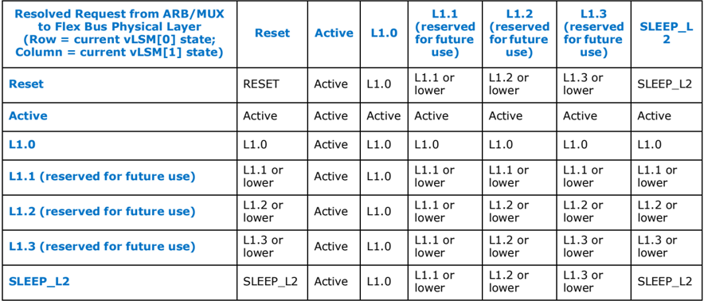

| Resolved Request from ARB/MUX to Flex Bus Physical Layer (Row = current vLSM[0] state; Column = current vLSM[1] state)   | Reset         | Active   | L1.0   | L1.1 (reserved for future use)   | L1.2 (reserved forfuture use)   | L1.3 (reserved for future use)   | SLEEP_L 2     |
|--------------------------------------------------------------------------------------------------------------------------|---------------|----------|--------|----------------------------------|---------------------------------|----------------------------------|---------------|
| Reset                                                                                                                    | RESET         | Active   | L1.0   | L1.1 or lower                    | L1.2 or lower                   | L1.3 or lower                    | SLEEP_L2      |
| Active                                                                                                                   | Active        | Active   | Active | Active                           | Active                          | Active                           | Active        |
| L1.0                                                                                                                     | L1.0          | Active   | L1.0   | L1.0                             | L1.0                            | L1.0                             | L1.0          |
| L1.1 (reserved for future use)                                                                                           | L1.1 or lower | Active   | L1.0   | L1.1 or lower                    | L1.1 or lower                   | L1.1 or lower                    | L1.1 or lower |
| L1.2 (reserved for future use)                                                                                           | L1.2 or lower | Active   | L1.0   | L1.1 or lower                    | L1.2 or lower                   | L1.2 or lower                    | L1.2 or lower |
| L1.3 (reserved for future use)                                                                                           | L1.3 or lower | Active   | L1.0   | L1.1 or lower                    | L1.2 or lower                   | L1.3 or lower                    | L1.3 or lower |
| SLEEP_L2                                                                                                                 | SLEEP_L2      | Active   | L1.0   | L1.1 or lower                    | L1.2 or lower                   | L1.3 or lower                    | SLEEP_L2      |

Based on the requested state from one or more of the Link Layers, ARB/MUX will change the state request to the physical layer for the desired link state.

For implementations in which the Link Layers support directing the ARB/MUX to LinkReset or LinkError or LinkDisable, the ARB/MUX must unconditionally propagate these requests from the requesting Link Layer to the Physical Layer; this takes priority over [Table 59](#table-59-arbmux-multiple-virtual-lsm-resolution-table).

[Table 60](#table-60-arbmux-state-transition-table) describes the conditions under which a vLSM transitions from one state to the next. A transition to the next state happens after all the steps in the trigger conditions column are complete. Some of the trigger conditions are sequential and indicate a series of actions from multiple sources. For example, on the transition from Active to L1.x state on an Upstream Port, the state transition will not occur until the vLSM has received a request to enter L1.x from the Link Layer followed by the vLSM sending a Request ALMP{L1.x} to the remote vLSM. Next the vLSM must wait to receive a Status ALMP{L1.x} from the remote vLSM. Once all these conditions are met in sequence, the vLSM will transition to the L1.x state as requested.

[Table 60](#table-60-arbmux-state-transition-table). ARB/MUX State Transition Table

| Current vLSM State              | Next State   | Upstream Port Trigger Condition                                                                                                                                                                                                                                                                                                                                                                                                                                                                                                        | Downstream Port Trigger Condition                                                                                                                                                                                                                                                                                                                                                                                                                                                                                                      |
|---------------------------------|--------------|----------------------------------------------------------------------------------------------------------------------------------------------------------------------------------------------------------------------------------------------------------------------------------------------------------------------------------------------------------------------------------------------------------------------------------------------------------------------------------------------------------------------------------------|----------------------------------------------------------------------------------------------------------------------------------------------------------------------------------------------------------------------------------------------------------------------------------------------------------------------------------------------------------------------------------------------------------------------------------------------------------------------------------------------------------------------------------------|
| Active                          | L1.x         | Upon receiving a Request to enter L1.x from Link Layer, the ARB/MUX must initiate a Request ALMP{L1.x} and receive a Status ALMP{L1.x} from the remote vLSM                                                                                                                                                                                                                                                                                                                                                                            | Upon receiving a Request to enter L1.x from Link Layer and receiving a Request ALMP{L1.x} from the Remote vLSM, the ARB/MUX must send Status ALMP{L1.x} to the remote vLSM                                                                                                                                                                                                                                                                                                                                                             |
| Active                          | L2           | Upon receiving a Request to enter L2 from Link Layer the ARB/MUX must initiate a Request ALMP{L2} and receive a Status ALMP{L2} from the remote vLSM                                                                                                                                                                                                                                                                                                                                                                                   | Upon receiving a Request to enter L2 from Link Layer and receiving a Request ALMP{L2} from the Remote vLSM the ARB/MUX must send Status ALMP{L2} to the remote vLSM                                                                                                                                                                                                                                                                                                                                                                    |
| Active                          | Reset        | Physical Layer transitions from Recovery to L0 and State Status ALMP synchronization for Recovery exit resolves to Reset. (see [Section 5.1.2.3](#5123-status-synchronization-protocol))                                                                                                                                                                                                                                                                                                                                                                                        | N/A                                                                                                                                                                                                                                                                                                                                                                                                                                                                                                                                    |
| L1                              | Retrain      | Upon receiving an ALMP Active request from remote ARB/MUX                                                                                                                                                                                                                                                                                                                                                                                                                                                                              | Upon receiving an ALMP Active request from remote ARB/MUX                                                                                                                                                                                                                                                                                                                                                                                                                                                                              |
| Active                          | Retrain      | Any of the following conditions are met: 1) Physical Layer LTSSM enters Recovery. 2) Physical Layer transitions from Recovery to L0 and State Status ALMP synchronization for Recovery exit resolves to Retrain. (see [Section 5.1.2.3](#5123-status-synchronization-protocol))                                                                                                                                                                                                                                                                                                 | Physical Layer LTSSM enters Recovery.                                                                                                                                                                                                                                                                                                                                                                                                                                                                                                  |
| Retrain                         | Active       | Link Layer is requesting Active and any of the following conditions are met: 1) Physical Layer transitions from Recovery to L0 and State Status ALMP synchronization for Recovery exit resolves to Active. 2) Physical Layer transitions from Recovery to L0 and State Status ALMP synchronization for Recovery exit does not resolve to Active. Entry to Active ALMP exchange protocol is complete. (See [Section 5.1.2.2](#5122-entry-to-active-exchange-protocol)) 3) Physical Layer has been in L0. Entry to Active ALMP exchange protocol is complete. (See [Section 5.1.2.2](#5122-entry-to-active-exchange-protocol)) | Link Layer is requesting Active and any of the following conditions are met: 1) Physical Layer transitions from Recovery to L0 and State Status ALMP synchronization for Recovery exit resolves to Active. 2) Physical Layer transitions from Recovery to L0 and State Status ALMP synchronization for Recovery exit does not resolve to Active. Entry to Active ALMP exchange protocol is complete. (See [Section 5.1.2.2](#5122-entry-to-active-exchange-protocol)) 3) Physical Layer has been in L0. Entry to Active ALMP exchange protocol is complete. (See [Section 5.1.2.2](#5122-entry-to-active-exchange-protocol)) |
| ANY (Except Disable/ LinkError) | LinkReset    | Physical Layer LTSSM in Hot Reset                                                                                                                                                                                                                                                                                                                                                                                                                                                                                                      | Physical Layer LTSSM in Hot Reset                                                                                                                                                                                                                                                                                                                                                                                                                                                                                                      |
| ANY (Except LinkError)          | Disabled     | Physical Layer LTSSM in Disabled state                                                                                                                                                                                                                                                                                                                                                                                                                                                                                                 | Physical Layer LTSSM in Disabled state                                                                                                                                                                                                                                                                                                                                                                                                                                                                                                 |
| ANY                             | LinkError    | Directed to enter LinkError from Link Layer or indication of LinkError from Physical Layer                                                                                                                                                                                                                                                                                                                                                                                                                                             | Directed to enter LinkError from Link Layer or indication of LinkError from Physical Layer                                                                                                                                                                                                                                                                                                                                                                                                                                             |
| L2                              | Reset        | Implementation Specific. Refer to rule 3 in [Section 5.1.1](#511-additional-rules-for-local-vlsm-transitions).                                                                                                                                                                                                                                                                                                                                                                                                                                                                             | Implementation Specific. Refer to rule 3 in [Section 5.1.1](#511-additional-rules-for-local-vlsm-transitions).                                                                                                                                                                                                                                                                                                                                                                                                                                                                             |
| Disabled                        | Reset        | Implementation Specific. Refer to rule 3 in [Section 5.1.1](#511-additional-rules-for-local-vlsm-transitions).                                                                                                                                                                                                                                                                                                                                                                                                                                                                             | Implementation Specific. Refer to rule 3 in [Section 5.1.1](#511-additional-rules-for-local-vlsm-transitions).                                                                                                                                                                                                                                                                                                                                                                                                                                                                             |
| LinkError            | Reset        | Implementation Specific. Refer to rule 3 in [Section 5.1.1](#511-additional-rules-for-local-vlsm-transitions).                                                                                                                                                                                                                                                   | Implementation Specific. Refer to rule 3 in [Section 5.1.1](#511-additional-rules-for-local-vlsm-transitions).                                                                                                                                                                                                                                                   |
| LinkReset            | Reset        | Implementation Specific. Refer to rule 3 in [Section 5.1.1](#511-additional-rules-for-local-vlsm-transitions).                                                                                                                                                                                                                                                   | Implementation Specific. Refer to rule 3 in [Section 5.1.1](#511-additional-rules-for-local-vlsm-transitions).                                                                                                                                                                                                                                                   |
| Reset                | Active       | Any of the following conditions are met: 1) Link Layer is asking for Active and Entry to Active ALMP exchange protocol is complete (See [Section 5.1.2.2](#5122-entry-to-active-exchange-protocol)) 2) Physical Layer transitions from Recovery to L0 and State Status ALMP synchronization for Recovery exit resolves to Active. (see [Section 5.1.2.3](#5123-status-synchronization-protocol)) | Any of the following conditions are met: 1) Link Layer is asking for Active and Entry to Active ALMP exchange protocol is complete (See [Section 5.1.2.2](#5122-entry-to-active-exchange-protocol)) 2) Physical Layer transitions from Recovery to L0 and State Status ALMP synchronization for Recovery exit resolves to Active. (see [Section 5.1.2.3](#5123-status-synchronization-protocol)) |

#### 5.1.1 Additional Rules for Local vLSM Transitions

1. If any Link Layer requests entry into Retrain to the ARB/MUX, ARB/MUX must forward the request to the Physical Layer to initiate LTSSM transition to Recovery. In accordance with the Active to Retrain transition trigger condition - once LTSSM is in Recovery, ARB/MUX should reflect Retrain to all vLSMs that are in Active state.
2. Once a vLSM is in Retrain state, it is expected that the corresponding Link Layer will eventually request ARB/MUX for a transition to Active.
3. If the LTSSM moves to Detect, each vLSM must eventually transition to Reset.

#### 5.1.2 Rules for Virtual LSM State Transitions Across Link

This section refers to vLSM state transitions.

##### 5.1.2.1 General Rules

- The link cannot operate for any other protocols if CXL.io protocol is down. (CXL.io operation is a minimum requirement)

##### 5.1.2.2 Entry to Active Exchange Protocol

The ALMP protocol required for the entry to active consists of 4 ALMP exchanges between the local and remote vLSMs as seen in [Figure 85](#figure-85-entry-to-active-protocol-exchange). Entry to active begins with an Active State Request ALMP sent to the remote vLSM which responds with an Active State Status ALMP. The only valid response to an Active State Request is an Active State Status once the corresponding Link Layer is ready to receive protocol flits. The remote vLSM must also send an Active State Request ALMP to the local vLSM which responds with an Active State Status ALMP.

During initial link training, the Upstream Port (UP) must wait for a non-physical layer flit (i.e. a flit that was not generated by the physical layer of the Downstream Port (DP)) before transmitting any ALMPs (please refer to [Section 6.3.1](#631-pcie-vs-flex-buscxl-mode-selection)). Thus, during initial link training, the first ALMP is always sent from the Downstream Port (DP) to the Upstream Port (UP). If additional Active exchange handshakes occur subsequently (for example, as part of PM exit), the Active request ALMP can be initiated from either side.

Once Active State Status ALMP has been sent and received by a vLSM, the vLSM transitions to Active State.

###### Figure 85. Entry to Active Protocol Exchange

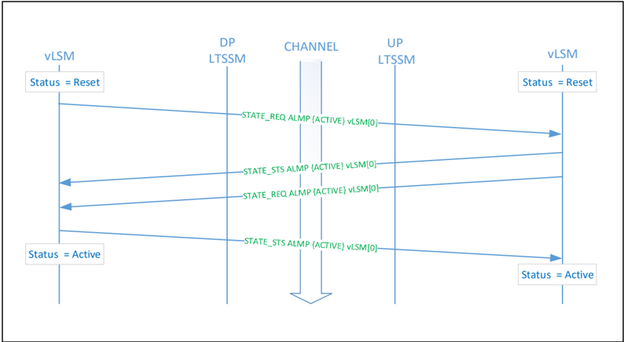

##### 5.1.2.3 Status Synchronization Protocol

After highest negotiated speed of operation is reached during initial link training, all subsequent LTSSM Recovery transitions must be signaled to ARB/MUX. vLSM Status Synchronization Protocol must be performed after Recovery exit. A Link Layer cannot conduct any other communication on the link coming out of LTSSM recovery until Status Synchronization Protocol is complete for the corresponding vLSM. Figure 86 shows an example of Status Synchronization Protocol.

The Status Synchronization Protocol completion requires the following events in the given order:

1. Status Exchange: Transmit a State Status ALMP, and receive an error free State Status ALMP. The state indicated in the transmitted State Status ALMP is a snapshot of the vLSM state. Refer to [Section 5.1.2.3.1](#51231-vlsm-snapshot-rule).
2. A corresponding State Status Resolution based on the sent and received State Status ALMPs during the synchronization exchange. See Table 61 for determining the resolved vLSM state.
3. New State Request and Status ALMP exchanges when applicable. This occurs if the resolved vLSM state is not the same as the Link Layer requested state.

###### 5.1.2.3.1 vLSM Snapshot Rule

A STATUS_EXCHANGE_PENDING variable is used to determine when a snapshot of the vLSM can be taken. The following rules apply:

1. A snapshot of the vLSM is taken before entry to LTSSM Recovery if the STATUS_EXCHANGE_PENDING variable is clear for that vLSM.
2. A STATUS_EXCHANGE_PENDING variable is set for a vLSM once a snapshot is taken.

3. STATUS_EXCHANGE_PENDING variable is cleared on reset or on completion of Status Exchange (i.e. Transmit a State Status ALMP, and receive an error free State Status ALMP).

This is to account for situations where a corrupted State Status ALMP during Status Exchange can lead to additional LTSSM transitions through Recovery. See Figure 95 for an example of this flow.

###### Figure 86. Example Status Exchange

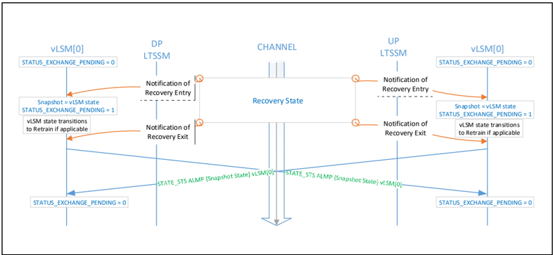

###### Table 61. vLSM State Resolution After Status Exchange

|   No. | Sent Status ALMP   | Received Status ALMP   | Resolved vLSM State   |
|-------|--------------------|------------------------|-----------------------|
|     1 | Reset              | Reset                  | Reset                 |
|     2 | Reset              | Active                 | Active                |
|     3 | Reset              | L2                     | Reset                 |
|     4 | Active             | Reset                  | Active                |
|     5 | Active             | Active                 | Active                |
|     6 | Active             | Retrain                | Active                |
|     7 | Active             | L1.x                   | Retrain               |
|     8 | Active             | L2                     | Reset                 |
|     9 | Retrain            | Active                 | Active                |
|    10 | Retrain            | Retrain                | Retrain               |
|    11 | Retrain            | L1.x                   | Retrain               |
|    12 | L1.x               | Active                 | L1.x                  |
|    13 | L1.x               | Retrain                | L1.x                  |
|    14 | L1.x               | L1.x                   | L1.x                  |
|    15 | L2                 | Active                 | L2                    |
|    16 | L2                 | Reset                  | L2                    |
|    17 | L2                 | L2                     | L2                    |

###### 5.1.2.3.2 Notes on State Resolution after Status Exchange (Table 61)

- For the rows where the resolved state is Active, the corresponding ARB/MUX must make sure that protocol flits received immediately after the State Status ALMP from remote ARB/MUX can be serviced by the Link Layer of the corresponding vLSM. One way to guarantee this is to ensure that for these cases the Link Layer receiver is ready before sending the State Status ALMP during Status Exchange.
- Rows 7 and 11 will result in L1 exit flow following state resolution. The corresponding ARB/MUX must initiate a transition to Active through new State Request ALMPs. Once both DP and UP vLSMs are in Active, the Link Layers can redo PM entry negotiation if required. Similarly, for row 10 if reached during PM negotiation, it is required for both vLSMs to initiate Active request ALMPs.
- When supported, rows 3 and 8 will result in L2 exit flow following state resolution. Since the LTSSM will eventually move to Detect, each vLSM will eventually transition to Reset state.
- Rows 7 and 8 are applicable for Upstream Ports only. Since entry into PM is always initiated by Upstream Port, and it cannot transition its vLSM to PM unless the Downstream Port has done so, there is no case where these rows can apply for Downstream Ports.
- Behavior is undefined and implementation specific for combinations not captured in Table 61.

##### 5.1.2.4 State Request ALMP

The following rules apply for sending a State Request ALMP. A State Request ALMP is sent to request a state change to Active or PM. For PM, the request can only be initiated by the ARB/MUX on the Upstream Port.

###### 5.1.2.4.1 For Entry Into Active

- All Recovery state operations must complete before the entry to Active sequence starts
- An ALMP State Request is sent to initiate the entry into Active State.
- A vLSM must send a Request and receive a Status before the transmitter is considered active. This is not equivalent to vLSM Active state.
- Protocol layer flits must only be transmitted once the vLSM has reached Active state.

Figure 87 shows an example of entry into the Active state. The flows in Figure 87 show four independent actions (ALMP handshakes) that may not necessarily happen in the order or small time-frame shown. The vLSM transmitter and receiver may become active independently. Both transmitter and receiver must be active before the vLSM state is Active. The transmitter becomes active after a vLSM has transmitted a Request ALMP{Active} and received a Status ALMP{Active}. The receiver becomes active after a vLSM receives a Request ALMP{Active} and sends a Status ALMP{Active} in response.

Please refer to [Section 5.1.2.2](#5122-entry-to-active-exchange-protocol) for rules regarding the Active State Request/Status handshake protocol.

###### Figure 87. CXL Entry to Active Example Flow

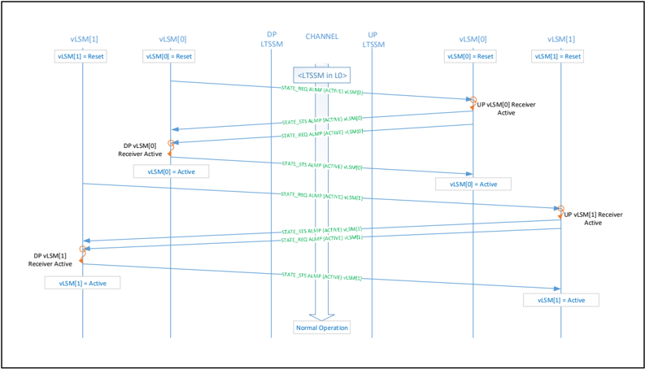

###### 5.1.2.4.2 For Entry into PM State (L1/L2)

- An ALMP State Request is sent to initiate the entry into PM States. Only Upstream Ports can initiate entry into PM states.
- For Upstream Ports, a vLSM must send a Request and receive a Status before the PM negotiation is considered complete for the corresponding vLSM.

[Figure 88](#figure-88-cxl-entry-to-pm-state-example) shows an example of Entry to PM State (L1) initiated by the UP ARB/MUX. Each vLSM will be ready to enter L1 State once the vLSM has sent a Request ALMP{L1} and received a Status ALMP{L1} in return or the vLSM has received a Request ALMP{L1} and sent a Status ALMP{L1} in return. The vLSMs operate independently and actions may not complete in the order or the timeframe shown. Once all vLSMs are ready to enter PM State (L1), the Channel will complete EIOS exchange and enter L1.

###### Figure 88. CXL Entry to PM State Example

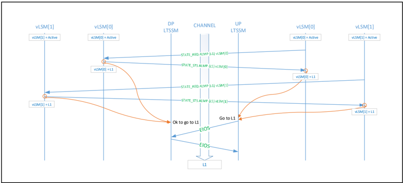

##### 5.1.2.5 State Status ALMP

###### 5.1.2.5.1 When State Request ALMP is received

- A State Status ALMP is sent after a State Request ALMP is received for entry into Active State or PM States when entry to the PM state is accepted. No State Status ALMP is sent if the PM state is not accepted. See [Section 10.3](#103-compute-express-link-power-management), 'Compute Express Link Power Management'  for more details.

###### 5.1.2.5.2 Recovery State

- The vLSM will trigger link Recovery if a State Status ALMP is received without a State Request first being sent by the vLSM except when the State Status ALMP is received for synchronization purposes (i.e. after link exits Recovery).

Figure 89 shows a general example of Recovery exit. Please refer to [Section 5.1.2.3](#5123-status-synchronization-protocol) for details on the status synchronization protocol.

###### Figure 89. CXL Recovery Exit Example Flow

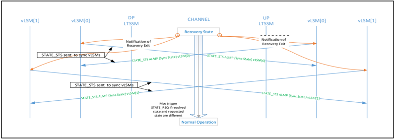

On Exit from Recovery, the vLSMs on either side of the channel will send a Status ALMP in order to synchronize the vLSMs. The Status ALMPs for synchronization may trigger a State Request ALMP if the resolved state and the Link Layer requested state are not the same, as seen in Figure 90. Refer to [Section 5.1.2.3](#5123-status-synchronization-protocol) for the rules that apply during state synchronization. The ALMP for synchronization may trigger a re-entry to recovery in the case of unexpected ALMPs. This is explained using the example of initial link training flows in [Section 5.1.3.1](#5131-initial-link-training). If the resolved states from both vLSMs are the same as the Link Layer requested state, the vLSMs are considered synchronized and will continue normal operation.

Figure 90 shows an example of the exit from a PM State (L1) through Recovery. The DP vLSM[0] in L1 state receives the Active Request, and the link enters Recovery. After the exit from recovery, each vLSM sends Status ALMP{L1} to synchronize the vLSMs. Because the resolved state after synchronization is not equal to the requested state, Request ALMP{Active} and Status ALMP{Active} handshakes are completed to enter Active State.

###### Figure 90. CXL Exit from PM State Example

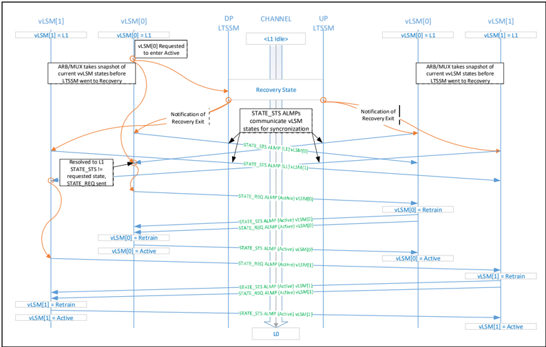

##### 5.1.2.6 Unexpected ALMPs

The following situations describe circumstances where an unexpected ALMP will trigger link recovery:

- When performing the Status Synchronization Protocol after exit from recovery, any ALMP other than a Status ALMP is considered an unexpected ALMP and will trigger recovery.
- When an Active Request ALMP has been sent, receipt of any ALMP other than an Active State Status ALMP or an Active Request ALMP is considered an unexpected ALMP and will trigger recovery.
- As outlined in [Section 5.1.2.5.2](#51252-recovery-state),a State Status ALMP received without a State Request ALMP first being sent is an unexpected ALMP except during the Status Synchronization Protocol.

#### 5.1.3 Applications of the vLSM State Transition Rules

##### 5.1.3.1 Initial Link Training

As the link trains from Gen1 speed to the highest supported speed (Gen3 or higher for CXL), the LTSSM may go through several Recovery to L0 to Recovery transitions. Implementations are not required to expose ARB/MUX to all of these Recovery transitions. Depending on whether these initial Recovery transitions are hidden from the ARB/MUX or not, four different scenarios can happen for the initial ALMP handshakes. In all cases, the vLSM state transition rules guarantee that the situation will resolve itself with the vLSMs reaching Active state. These scenarios are presented in the following figures. Note that the figures are illustrative examples, and implementations must follow the rules outlined in the previous sections. Only one vLSM handshake is shown in the figures, but the similar handshakes can happen for the second vLSM as well.

Figure 91 shows an example of the scenario where both DP and UP are hiding the initial recovery transitions from ARB/MUX. Since neither of them saw a notification of recovery entry, they proceed with the exchange of Active request and status ALMPs to transition into Active state. Note that the first ALMP (Active request ALMP) is sent from DP to UP.

###### Figure 91. Both DP and UP Hide Recovery Transitions from ARB/MUX

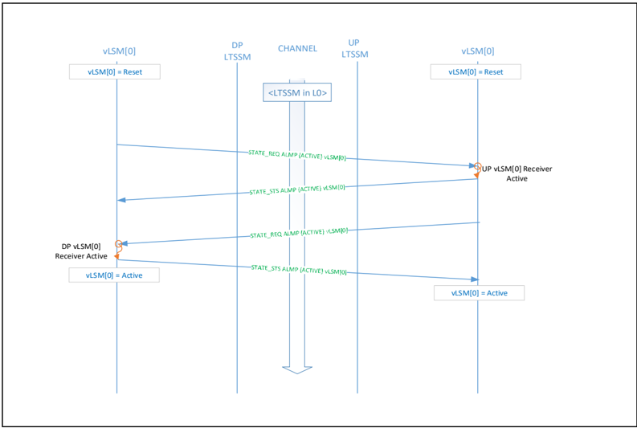

Figure 92 shows an example where both DP and UP notify the ARB/MUX of at least one recovery transition during initial link training. In this case, first state status synchronization ALMPs are exchanged (indicating Reset state), followed by regular exchange of Active request and status ALMPs (not shown explicitly). Note that the first ALMP (Reset status) is sent from DP to UP.

###### Figure 92. Both DP and UP Notify ARB/MUX of Recovery Transitions

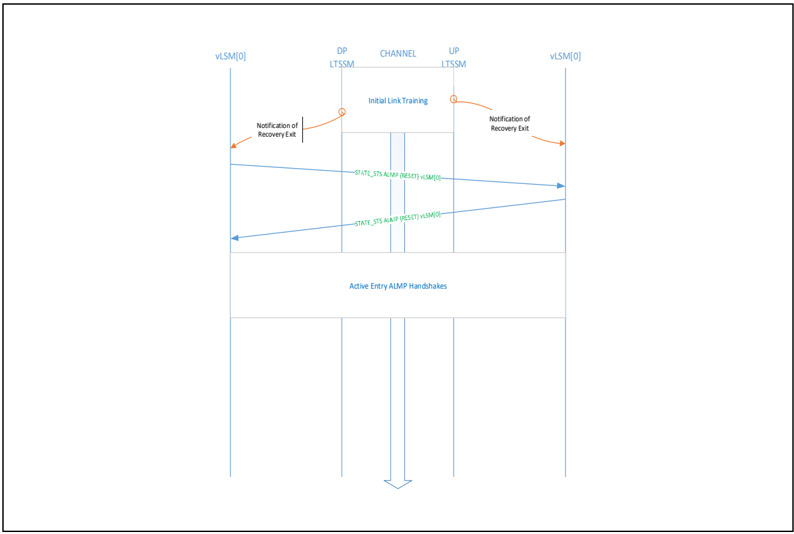

Figure 93 shows an example of the scenario where DP hides initial recovery transitions from the ARB/MUX, but the UP does not. In this case, DP ARB/MUX has not seen recovery transition, so it begins by sending an Active state request ALMP to the UP. This is interpreted as an unexpected ALMP by the UP and it triggers link recovery (which must now be notified to both ARB/MUX, since it is after reaching operation at highest supported link speed). State status synchronization with state=Reset is performed followed by regular Active request and status handshakes (not shown explicitly).

###### Figure 93. DP Hides Initial Recovery, UP Does Not

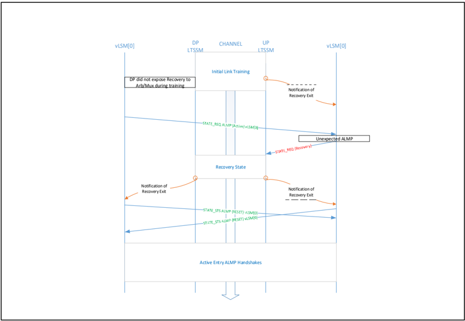

Figure 94 shows an example of the scenario where the UP hides initial recovery transitions, but the DP does not. In this case, the DP first sends a Reset status ALMP. This will cause UP to trigger link recovery as a result of the rules in [Section 5.1.2.5](#5125-state-status-almp) (which must now be notified to both ARB/MUX, since it is after reaching operation at highest supported link speed). State status synchronization with state=Reset is performed followed by regular Active request and status handshakes (not shown explicitly).

###### Figure 94. UP Hides Initial Recovery, DP Does Not

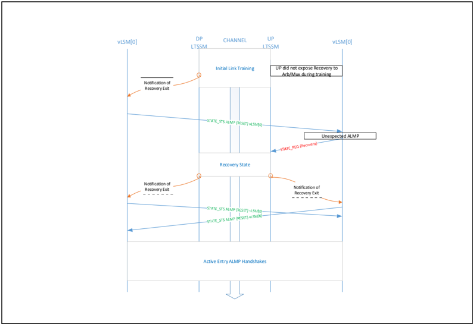

##### 5.1.3.2 Status Exchange Snapshot Example

Figure 95 shows an example of a case where a State Status ALMP during Status Exchange gets corrupted for vLSM[1] on the UP. A corrupted ALMP is when the lower four DWs don't match for a received ALMP; it indicates a bit error on the lower four DWs of the ALMP during transmission. ARB/MUX triggers LTSSM Recovery as a result. When the recovery entry notification is received for the second Recovery entry, the snapshot of vLSM[1] on the UP is still Active - since the status exchanges had not completed successfully.

###### Figure 95. Snapshot Example During Status Synchronization

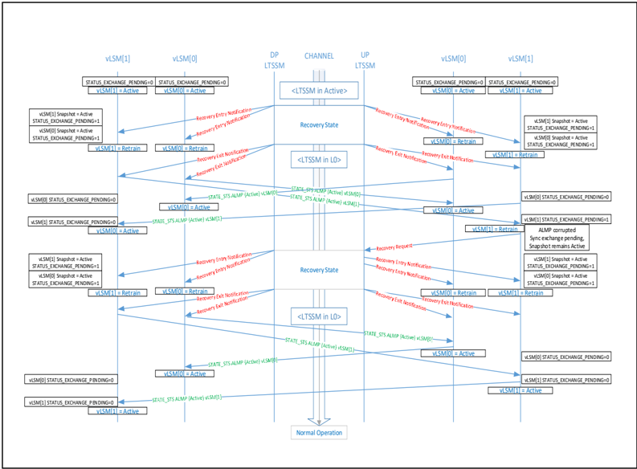

##### 5.1.3.3 L1 Abort Example

[Figure 96](#figure-96-l1-abort-example) shows an example of a scenario that could arise during L1 transition of the physical link. It begins with successful L1 entry by both vLSMs through corresponding PM request and status ALMP handshakes. The ARB/MUX even requests the Physical Layer to take the LTSSM to L1 for both the DP and UP. However, there happens to be a race and one of the vLSMs requests Active before EIOS is received by the DP Physical Layer. This causes the ARB/MUX to remove the request for L1 entry (L1 abort), while sending an Active request ALMP to the UP. When EIOS is eventually received by the physical layer, since the ARB/MUX on the DP side is not requesting L1 (and there is no support for L0s in CXL), the Physical Layer must take the LTSSM to Recovery to resolve this condition. On Recovery exit, both the DP and UP ARB/MUX send their corresponding vLSM state status as part of the synchronization protocol. For vLSM[1], since the resolved state status (Retrain) is not the same as desired state status (Active), another Active request ALMP must be sent by the DP to the UP. Similarly, on the UP side, the received state status (L1) is not the same as the desired state status (Active - since the vLSM moving to Retrain will trigger the UP link layer to request Active), the UP ARB/MUX will initiate an Active request ALMP to the DP. Once Active state status ALMP has been sent and received, the corresponding ARB/MUX will move the vLSM to Active, and the protocol level flit transfer can begin.

###### Figure 96. L1 Abort Example

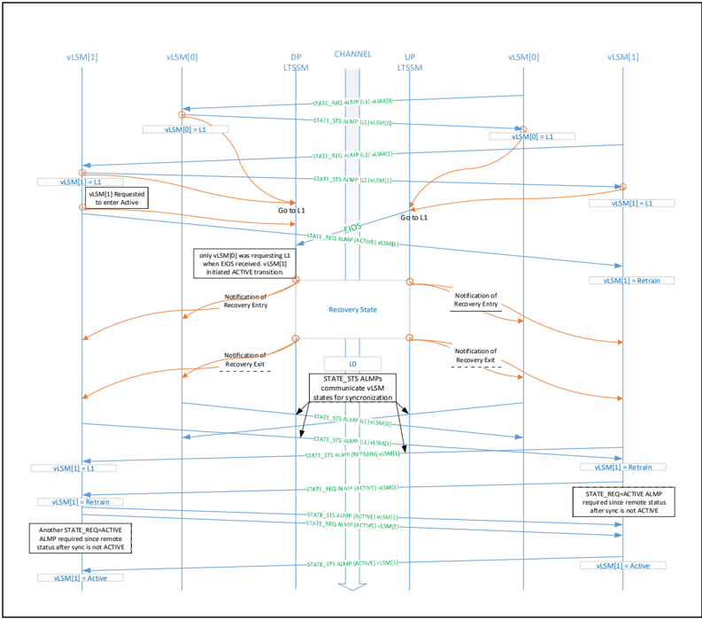

### 5.2 ARB/MUX Link Management Packets

The ARB/MUX uses ALMPs to communicate virtual link state transition requests and responses associated with each link layer to the remote ARB/MUX.

An ALMP is a 1DW packet with format shown in [Figure 97](#figure-97-arbmux-link-management-packet-format) below. This 1DW packet is replicated four times on the lower 16-bytes of a 528-bit flit to provide data integrity protection; the flit is zero padded on the upper bits. If the ARB/MUX detects an error in the ALMP, it initiates a retrain of the link.

#### Figure 97. ARB/MUX Link Management Packet Format

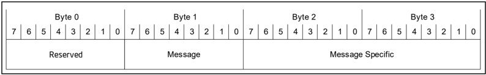

Bytes 1, 2 and 3 of the ALMP packet are as shown in [Table 62](#table-62-almp-byte-2-and-byte-3-encoding) below. The message code used in Byte 1 of the ALMP is 0000_1000b. ALMPs can be request or status type. The local ARB/MUX initiates transition of a remote vLSM using a request ALMP. After receiving a request ALMP, the local ARB/MUX processes the transition request and

returns a status ALMP to indicate that the transition has occurred. If the transition request is not accepted, no status ALMP is sent and both local and remote vLSMs remain in their current state.

##### Table 62. ALMP Byte 2 and Byte 3 Encoding

| Byte1 Bit   | Description                                                                                                                                                                                                                                                                                                                                                                                                                                                                                                                             |
|-------------|-----------------------------------------------------------------------------------------------------------------------------------------------------------------------------------------------------------------------------------------------------------------------------------------------------------------------------------------------------------------------------------------------------------------------------------------------------------------------------------------------------------------------------------------|
| 7:0         | Message Encoding: 0000_1000b: Virtual LSM ALMP is encoded in bytes 2 and 3 All others: Reserved                                                                                                                                                                                                                                                                                                                                                                                                                                         |
| Byte2 Bit   | Description                                                                                                                                                                                                                                                                                                                                                                                                                                                                                                                             |
| 3:0         | Virtual LSM State Encoding: 0000: Reset (for Status ALMP) 0000: Reserved (for Request ALMP) 0001: ACTIVE 0010: Reserved 0011: DEEPEST ALLOWABLE PM STATE (for Request ALMP) 0011: Reserved (for Status ALMP) 0100: IDLE_L1.0 (maps to PCIe L1) 0101: IDLE_L1.1 (reserved for future use) 0110: IDLE_L1.2 (reserved for future use) 0111: IDLE_L1.3 (reserved for future use) 1000: L2 1001: Reserved 1010: Reserved 1011: Retrain (for Status ALMP only) 1011: Reserved (for Request ALMP) 1100: Reserved 1101: Reserved 1110: Reserved |
| 6:4         | Reserved                                                                                                                                                                                                                                                                                                                                                                                                                                                                                                                                |
| 7           | Request/Status Type 1: Virtual LSM Request ALMP 0: Virtual LSM Status ALMP                                                                                                                                                                                                                                                                                                                                                                                                                                                              |
| Byte3 Bit   | Description                                                                                                                                                                                                                                                                                                                                                                                                                                                                                                                             |
| 3:0         | Virtual LSM Instance Number: Indicates the targeted Virtual LSM interface when there are multiple Virtual LSMs present. 0001: ALMP for CXL.io 0010: ALMP for CXL.cache and CXL.mem All other encodings are Reserved.                                                                                                                                                                                                                                                                                                                    |
| 7:4         | Reserved                                                                                                                                                                                                                                                                                                                                                                                                                                                                                                                                |

#### 5.2.1 ARB/MUX Bypass Feature

The ARB/MUX must disable generation of ALMPs when the Flex Bus link is operating in PCIe mode. Determination of the bypass condition can be via hwinit or during link training.

### 5.3 Arbitration and Data Multiplexing/Demultiplexing

The ARB/MUX is responsible for arbitrating between requests from the CXL link layers and multiplexing the data based on the arbitration results. The arbitration policy is implementation specific as long as it satisfies the timing requirements of the higher level protocols being transferred over the Flex Bus link. Additionally, there must be a way to program the relative arbitration weightages associated with the CXL.io and CXL.cache+CXL.mem link layers as they arbitrate to transmit traffic over the Flex Bus link. See [Section 8.2.6.1](#8261-arbmux-arbitration-control-register-for-cxlio-offset-0x180) for more details. Interleaving of traffic between different CXL protocols is done at the 528-bit flit boundary.

## 6.0 Flex Bus Physical Layer

### 6.1 Overview

#### Figure 98. Flex Bus Layers -- Physical Layer Highlighted

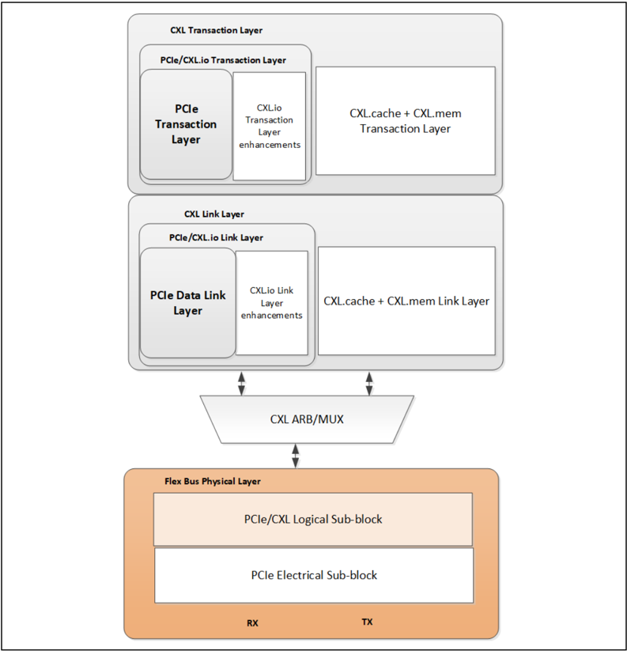

The figure above shows where the Flex Bus physical layer exists in the Flex Bus layered hierarchy. On the transmit side, the Flex Bus physical layer prepares data received from either the PCIe link layer or the CXL ARB/MUX for transmission across the Flex Bus link.

On the receive side, the Flex Bus physical layer deserializes the data received on the Flex Bus link and converts it to the appropriate format to forward to the PCIe link layer or the ARB/MUX. The Flex Bus physical layer consists of a logical sub-block, aka the logical PHY, and an electrical sub-block. The logical PHY operates in PCIe mode during initial link training and switches over to CXL mode, if appropriate, depending on the results of alternate mode negotiation, during recovery after training to 2.5 GT/s. The electrical sub-block follows the PCIe specification.

In CXL mode, normal operation occurs at native link width and 32 GT/s link speed. Bifurcation (aka link subdivision) into x8 and x4 widths is supported in CXL mode. Degraded modes of operation include 8 GT/s or 16 GT/s link speed and smaller link widths of x2 and x1. [Table 63](#table-63-flex-buscxl-link-speeds-and-widths-for-normal-and-degraded-mode) summarizes the supported CXL combinations. In PCIe mode, the link supports all widths and speeds defined in the PCIe specification, as well as the ability to bifurcate.

##### Table 63. Flex Bus.CXL Link Speeds and Widths for Normal and Degraded Mode

| Link Speed   | Native Width   | Degraded Modes Supported                                                |
|--------------|----------------|-------------------------------------------------------------------------|
| 32 GT/s      | x16            | x16 @16 GT/s or 8 GT/s; x8, x4, x2, or x1 @32 GT/s or 16 GT/s or 8 GT/s |
| 32 GT/s      | x8             | x8 @16 GT/s or 8 GT/s; x4, x2, or x1 @32 GT/s or 16 GT/s or 8 GT/s      |
| 32 GT/s      | x4             | x4 @16 GT/s or 8 GT/s; x2 or x1 @32 GT/s or 16 GT/s or 8 GT/s           |

This chapter focuses on the details of the logical PHY. The Flex Bus logical PHY is based on the PCIe logical PHY; PCIe mode of operation follows the PCIe specification exactly while Flex Bus.CXL mode has deltas from PCIe that affect link training and framing. Please refer to the 'Physical Layer Logical Block' chapter of the PCI Express Base Specification for details on PCIe mode of operation. The Flex Bus.CXL deltas are described in this chapter.

### 6.2 Flex Bus.CXL Framing and Packet Layout

The Flex Bus.CXL framing and packet layout is described in this section for x16,x8,x4, x2, and x1 widths.

#### 6.2.1 Ordered Set Blocks and Data Blocks

Flex Bus.CXL uses the PCIe concept of Ordered Set blocks and data blocks. Each block spans 128 bits per lane and potentially two bits of Sync Header per lane.

Ordered Set blocks are used for training, entering and exiting Electrical Idle, transitions to data blocks, and clock tolerance compensation; they are the same as defined in the PCIe base specification. A 2-bit Sync Header with value 01b is inserted before each 128 bits transmitted per lane in an Ordered Set block when 128/130b encoding is used; in the latency optimized mode, there is no Sync Header.

Data blocks are used for transmission of the flits received from the CXL link layer. A 16bit Protocol ID field is associated with each 528-bit flit payload (512 bits of payload + 16 bits of CRC) received from the link layer, which is striped across the lanes on an 8bit granularity; the placement of the protocol ID depends on the width. A 2-bit Sync Header with value 10b is inserted before every 128 bits transmitted per lane in a data block when 128/130b encoding is used; in the latency optimized mode, there is no Sync Header. A 528-bit flit may traverse the boundary between data blocks.

Transitions between Ordered Set blocks and data blocks are indicated in a couple of ways. One way is via the 2-bit Sync Header of 01b for Ordered Set blocks and 10b for data blocks. The second way is via the use of Start of Data Stream (SDS) Ordered Sets and End of Data Stream (EDS) tokens. Unlike PCIe where the EDS token is explicit, Flex Bus.CXL encodes the EDS indication in the protocol ID value; the latter is referred to as an 'implied EDS token'.

#### 6.2.2 Protocol ID[15:0]

The 16-bit protocol ID field specifies whether the transmitted flit is CXL.io, CXL.cache/ CXL.mem, or some other payload. The table below provides a list of valid 16-bit protocol ID encodings. Encodings that include an implied EDS token signify that the next block after the block in which the current flit ends is an Ordered Set block. Implied EDS tokens can only occur with the last flit transmitted in a data block.

NULL flits are inserted into the data stream by the physical layer when there are no valid flits available from the link layer. A NULL flit transferred with an implied EDS token ends precisely at the data block boundary preceding the Ordered Set block; these are variable length flits, up to 528 bits, intended to facilitate transition to Ordered Set blocks as quickly as possible. When 128/130b encoding is used, the variable length NULL flit ends on the first block boundary encountered after the 16-bit protocol ID has been transmitted, and the Ordered Set is transmitted in the next block. Because Ordered Set blocks are inserted at fixed block intervals that align to the flit boundary when Sync Headers are disabled (as described in [Section 6.7.1](#671-skp-ordered-set-frequency-and-l1recovery-entry)), variable length NULL flits will always contain a fixed 528-bit payload when Sync Headers are disabled. Please see [Section 6.7.1](#671-skp-ordered-set-frequency-and-l1recovery-entry) for examples of NULL flit with implied EDS usage scenarios. A NULL flit is comprised of all zeros payload.

An 8-bit encoding with a hamming distance of four is replicated to create the 16-bit encoding for error protection against bit flips. A correctable protocol ID framing error is logged but no further error handling action is required if only one 8-bit encoding group looks incorrect; the correct 8-bit encoding group is used for normal processing. If both 8-bit encoding groups are incorrect, an uncorrectable protocol ID framing error is logged, the flit is dropped, and the physical layer enters into recovery to retrain the link.

The physical layer is responsible for dropping any flits it receives with invalid protocol IDs. This includes dropping any flits with unexpected protocol IDs that correspond to Flex Bus defined protocols that have not been enabled during negotiation; protocol IDs associated with flits generated by physical layer or by the ARB/MUX must not be treated as unexpected. When a flit is dropped due to an unexpected protocol ID, the physical layer logs an unexpected protocol ID error in the Flex Bus DVSEC Port Status register.

Please refer to [Section 6.2.9](#629-framing-errors) for additional details about protocol ID error detection and handling.

##### Table 64. Flex Bus.CXL Protocol IDs

|   Protocol ID[15:0] | Description                                                                                                                                                                              |
|---------------------|------------------------------------------------------------------------------------------------------------------------------------------------------------------------------------------|
| 1111_1111_1111_1111 | CXL.io                                                                                                                                                                                   |
| 1101_0010_1101_0010 | CXL.io with implied EDS token                                                                                                                                                            |
| 0101_0101_0101_0101 | CXL.cache/CXL.mem                                                                                                                                                                        |
| 1000_0111_1000_0111 | CXL.cache/CXL.mem with implied EDS token                                                                                                                                                 |
| 1001_1001_1001_1001 | NULL flit (generated by the Physical Layer)                                                                                                                                              |
| 0100_1011_0100_1011 | NULL flit with implied EDS token: Variable length flit containing NULLs that ends precisely at the data block boundary preceding the Ordered Set block (generated by the Physical Layer) |
| 1100_1100_1100_1100 | CXL ARB/MUX Link Management Packets (ALMPs)                        |
| 0001_1110_0001_1110 | CXL ARB/MUX Link Management Packets (ALMPs) with implied EDS token |
| All Others          | Reserved                                                           |

#### 6.2.3 x16 Packet Layout

[Figure 99](#figure-99-flex-bus-x16-packet-layout) below shows the x16 packet layout. First, the 16-bits of protocol ID are transferred, split on an 8-bit granularity across consecutive lanes; this is followed by transfer of the 528-bit flit, striped across the lanes on an 8-bit granularity. Depending on the symbol time, as labeled on the leftmost column in the figure, the Protocol ID plus flit transfer may start on lane 0, lane 4, lane 8, or lane 12. The pattern of transfer repeats after every 17 symbol times. The two-bit Sync Header shown in the figure, inserted after every 128 bits transferred per lane, is not present for the latency optimized mode where Sync Header bypass is negotiated.

##### Figure 99. Flex Bus x16 Packet Layout

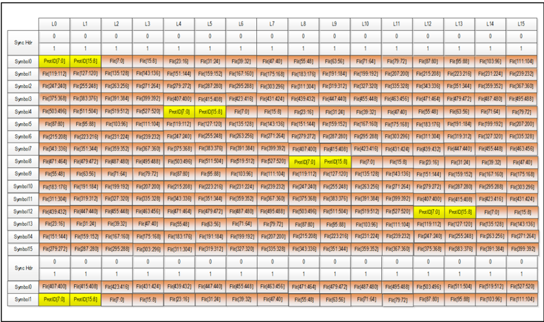

Figure 100 provides an example where CXL.io and CXL.cache/CXL.mem traffic is interleaved with an interleave granularity of two flits on a x16 link. The top figure shows what the CXL.io stream looks like before mapping to the Flex Bus lanes and before interleaving with CXL.cache/CXL.mem traffic; the framing rules follow the x16 framing rules specified in the PCI Express specification, as stated in [Section 4.1](#41-cxlio-link-layer). The bottom figure shows the final result when the two streams are interleaved on the Flex Bus lanes. For CXL.io flits, after transferring the 16-bit protocol ID, 512 bits are used to transfer CXL.io traffic and 16 bits are unused. For CXL.cachemem flits, after transferring the 16-bit protocol ID, 528 bits are used to transfer a CXL.cachemem flit. Please refer to Chapter 4.0, 'Compute Express Link Link Layers' for more details on the

flit format. As this example illustrates, the PCIe TLPs and DLLPs encapsulated within the CXL.io stream may be interrupted by non-related CXL traffic if they cross a flit boundary.

##### Figure 100. Flex Bus x16 Protocol Interleaving Example

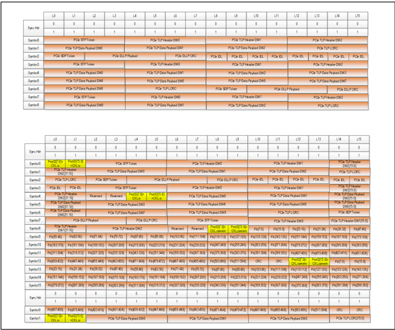

#### 6.2.4 x8 Packet Layout

Figure 101 below shows the x8 packet layout. 16-bits of Protocol ID followed by a 528bit flit are striped across the lanes on an 8-bit granularity. Depending on the symbol time, the Protocol ID plus flit transfer may start on lane 0 or lane 4. The pattern of transfer repeats after every 17 symbol times. The two-bit Sync Header shown in the figure is not present for the latency optimized mode.

##### Figure 101. Flex Bus x8 Packet Layout

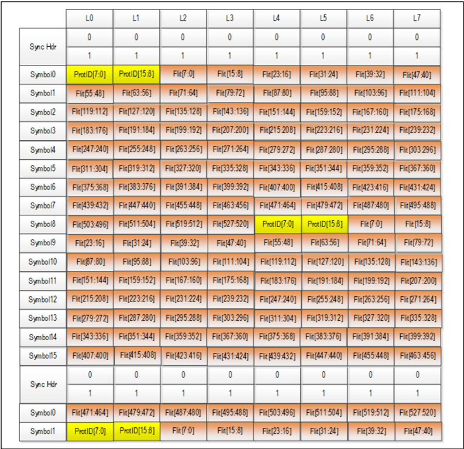

Figure 102 illustrates how CXL.io and CXL.cache/CXL.mem traffic is interleaved on a x8 Flex Bus link. The same traffic from the x16 example in Figure 100 is mapped to a x8 link.

##### Figure 102. Flex Bus x8 Protocol Interleaving Example

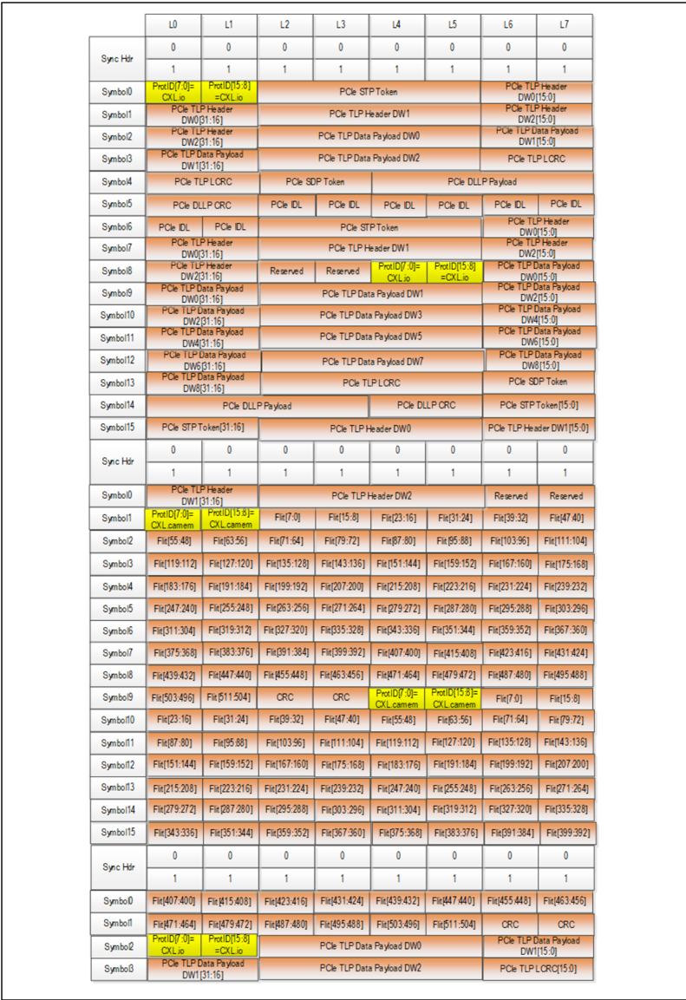

#### 6.2.5 x4 Packet Layout

[Figure 103](#figure-103-flex-bus-x4-packet-layout) below shows the x4 packet layout. 16-bits of Protocol ID followed by a 528bit flit are striped across the lanes on an 8-bit granularity. The Protocol ID plus flit transfer always starts on lane 0; the entire transfer takes 17 symbol times. The two-bit Sync Header shown in the figure is not present for the latency optimized mode.

##### Figure 103. Flex Bus x4 Packet Layout

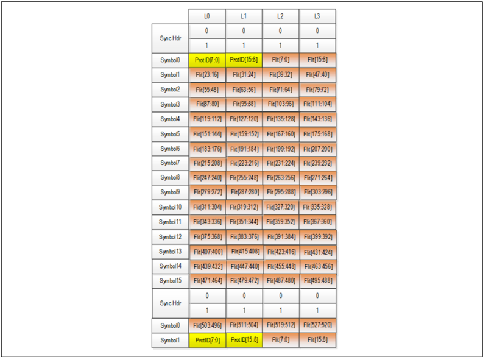

#### 6.2.6 x2 Packet Layout

The x2 packet layout looks very similar to the x4 packet layout in that the Protocol ID aligns to lane 0. 16-bits of Protocol ID followed by a 528-bit flit are striped across two lanes on an 8-bit granularity, taking 34 symbol times to complete the transfer.

#### 6.2.7 x1 Packet Layout

The x1 packet layout is used only in degraded mode. The 16-bits of Protocol ID followed by 528-bit flit are transferred on a single lane, taking 68 symbol times to complete the transfer.

#### 6.2.8 Special Case: CXL.io -- When a TLP Ends on a Flit Boundary

For CXL.io traffic, if a TLP ends on a flit boundary and there is no additional CXL.io traffic to send, the receiver still requires a subsequent EDB indication if it is a nullified TLP or all IDLE flit or a DLLP to confirm it is a good TLP before processing the TLP. Figure 104 illustrates a scenario where the first CXL.io flit encapsulates a TLP that ends at the flit boundary, and the transmitter has no more TLPs or DLLPs to send. To ensure

that the transmitted TLP that ended on the flit boundary is processed by the receiver, a subsequent CXL.io flit containing PCIe IDLE tokens is transmitted; this flit is generated by the link layer.

##### Figure 104. CXL.io TLP Ending on Flit Boundary Example

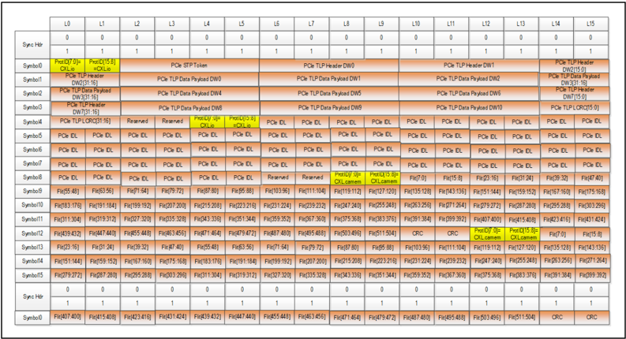

#### 6.2.9 Framing Errors

The physical layer is responsible for detecting framing errors and, subsequently, initiating entry into recovery to retrain the link.

The following are framing errors detected by the physical layer:

- Sync Header errors
- Protocol ID framing errors
- EDS insertion errors
- PCIe framing errors located within the 528-bit CXL.io flit

Protocol ID framing errors are described in [Section 6.2.2](#622-protocol-id150) and summarized below in [Table 65](#table-65-protocol-id-framing-errors). A protocol ID with a value that is defined in the CXL specification is considered a valid protocol ID. A valid protocol ID is either expected or unexpected. An expected protocol ID is one that corresponds to a protocol that was enabled during negotiation. An unexpected protocol ID is one that corresponds to a protocol that was not enabled during negotiation. A protocol ID with a value that is not defined in the CXL specification is considered an invalid protocol ID. Whenever a flit is dropped by the physical layer due to either an Unexpected Protocol ID Framing Error or an Uncorrectable Protocol ID Framing Error, the physical layer enters LTSSM recovery to retrain the link and notifies the link layers to enter recovery and, if applicable, to initiate link level retry.

##### Table 65. Protocol ID Framing Errors

| Protocol ID[7:0]   | Protocol ID[15:8]                              | Expected Action                                                                                                                                                                                                                        |
|--------------------|------------------------------------------------|----------------------------------------------------------------------------------------------------------------------------------------------------------------------------------------------------------------------------------------|
| Invalid            | Valid & Expected                               | Process normally using Protocol ID[15:8]; Log as CXL_Correctable_Protocol_ID_Fra ming_Error in DVSEC Flex Bus Port Status register.                                                                                                    |
| Valid & Expected   | Invalid                                        | Process normally using Protocol ID[7:0]; Log as CXL_Correctable_Protocol_ID_Fra ming_Error in DVSEC Flex Bus Port Status register.                                                                                                     |
| Valid & Unexpected | Valid & Unexpected & Equal to Protocol ID[7:0] | Drop flit and log as CXL_Unexpected_Protocol_ID_Dro pped in DVSEC Flex Bus Port Status register; enter LTSSM recovery to retrain the link; notify link layers to enter recovery and, if applicable, initiate link level retry          |
| Invalid            | Valid & Unexpected                             | Drop flit and log as CXL_Unexpected_Protocol_ID_Dro pped in DVSEC Flex Bus Port Status register; enter LTSSM recovery to retrain the link; notify link layers to enter recovery and, if applicable, initiate link level retry          |
| Valid & Unexpected | Invalid                                        | Drop flit and log as CXL_Unexpected_Protocol_ID_Dro pped in DVSEC Flex Bus Port Status register; enter LTSSM recovery to retrain the link; notify link layers to enter recovery and, if applicable, initiate link level retry          |
| Valid              | Valid & Not Equal to Protocol ID[7:0]          | Drop flit and log as CXL_Uncorrectable_Protocol_ID_Fr aming_Error in DVSEC Flex Bus Port Status register; enter LTSSM recovery to retrain the link; notify link layers to enter recovery and, if applicable, initiate link level retry |
| Invalid            | Invalid                                        | Drop flit and log as CXL_Uncorrectable_Protocol_ID_Fr aming_Error in DVSEC Flex Bus Port Status register; enter LTSSM recovery to retrain the link; notify link layers to enter recovery and, if applicable, initiate link level retry |

### 6.3 Link Training

#### 6.3.1 PCIe vs Flex Bus.CXL Mode Selection

Upon exit from LTSSM Detect, an Flex Bus link begins training and completes link width negotiation and speed negotiation according to the PCIe LTSSM rules. During link training, the Downstream Port initiates Flex Bus mode negotiation via the PCIe alternate mode negotiation mechanism. Flex Bus mode negotiation is completed before entering L0 at 2.5 GT/s. If Sync Header bypass is negotiated, Sync Headers are bypassed as soon as the link has transitioned to a speed of 8GT/s or higher. The Flex Bus logical PHY transmits NULL flits after it sends the SDS Ordered Set as soon as it transitions to 8GT/s or higher link speeds if CXL mode was negotiated earlier in the training process. These NULL flits are used in place of PCIe Idle Symbols to facilitate certain LTSSM transitions to L0 as described in [Section 6.4](#64-recoveryidle-and-configidle-transitions-to-l0). After the link has transitioned to its final speed, it can start sending CXL traffic on behalf of the upper layers after the SDS Ordered Set is transmitted if that was what was negotiated earlier in the training process. For upstream facing ports, the physical layer notifies the upper layers that the link is up and available for transmission only after it has received a flit that was not generated by the physical layer of the partner Downstream Port (refer to [Table 64](#table-64-flex-buscxl-protocol-ids-sheet-2-of-2)). To operate in CXL mode, the link speed must be at least 8 GT/s. If the link is unable to transition to a speed of 8 GT/s or greater after committing to CXL mode during link training at 2.5 GT/s, the link may ultimately fail to link up even if the device is PCIe capable.

##### 6.3.1.1 Hardware Autonomous Mode Negotiation

Dynamic hardware negotiation of Flex Bus mode occurs during link training in the LTSSM Configuration state before entering L0 at Gen1 speeds using the alternate protocol negotiation mechanism, facilitated by exchanging modified TS1 and TS2 Ordered Sets as defined by the PCIe 5.0 base specification. The Downstream Port initiates the negotiation process by sending TS1 Ordered Sets advertising its Flex Bus capabilities. The Upstream Port responds with a proposal based on its own capabilities and those advertised by the host. The host communicates the final decision of which capabilities to enable by sending modified TS2 Ordered Sets before or during Configuration.Complete.

Please refer to the PCIe 5.0 base specification for details on how the various fields of the modified TS1/TS2 OS are set. Table 66 shows how the modified TS1/TS2 OS is used for Flex Bus mode negotiation. The 'Flex Bus Mode Negotiation Usage' column describes the deltas from the PCIe base specification definition that are applicable for Flex Bus mode negotiation. Additional explanation is provided in [Table 68](#table-68-additional-information-on-symbols-12-14-of-modified-ts1ts2-ordered-sets). The presence of retimer1 and retimer2 must be programmed into the Flex Bus Port DVSEC by software before the negotiation begins; if retimers are present the relevant retimer bits in the modified TS1/TS2 OS are used.

###### Table 66. Modified TS1/TS2 Ordered Set for Flex Bus Mode Negotiation

| Symbol Number   | PCIe Description                                                                                                                                                                                         | Flex Bus Mode Negotiation Usage                                                                                                                                                                                                                                                                                                                                                                                                                                                                                                  |
|-----------------|----------------------------------------------------------------------------------------------------------------------------------------------------------------------------------------------------------|----------------------------------------------------------------------------------------------------------------------------------------------------------------------------------------------------------------------------------------------------------------------------------------------------------------------------------------------------------------------------------------------------------------------------------------------------------------------------------------------------------------------------------|
| 0 through 4     | See PCIe 5.0 Base Spec Symbol                                                                                                                                                                            |                                                                                                                                                                                                                                                                                                                                                                                                                                                                                                                                  |
| 5               | Training Control Bits 0:5: See PCIe 5.0 Base Bits 7:6: Modified TS1/TS2 supported (see PCIe 5.0 Base Spec for details                                                                                    | Bit 7:6 = 11b                                                                                                                                                                                                                                                                                                                                                                                                                                                                                                                    |
| 6               | For Modified TS1: TS1 Identifier , encoded as D10.2 (4Ah) For Modified TS2: TS2 Identifier , encoded as D5.2 (45h)                                                                                       | TS1 Identifier during Phase 1 of Flex Bus mode negotiation TS2 Identifier during Phase 2 of Flex Bus mode negotiation                                                                                                                                                                                                                                                                                                                                                                                                            |
| 7               | For Modified TS1: TS1 Identifier , encoded as D10.2 (4Ah) For Modified TS2: TS2 Identifier , encoded as D5.2 (45h)                                                                                       | TS1 Identifier during Phase 1 of Flex Bus mode negotiation TS2 Identifier during Phase 2 of Flex Bus mode negotiation                                                                                                                                                                                                                                                                                                                                                                                                            |
| 8-9             | Bits 0:2: Usage (see PCIe 5.0 Base Spec) Bits 3:4: Alternate Protocol Negotiation Status if Usage is 010b, Reserved Otherwise (see PCIe 5.0 Base Spec for details) Bits 5:15: Alternate Protocol Details | Bits 2:0 = 010b (indicating alternate protocols) Bits 4:3 = Alternate Protocol Negotiation Status per PCIe spec Bit 7:5 = Alternate Protocol ID (3'd0 = 'Flex Bus') Bit 8: Common Clock Bits 15:9: Reserved                                                                                                                                                                                                                                                                                                                      |
| 10-11           | Alternate Protocol ID/Vendor ID if Usage = 010b See PCIe 5.0 Base Spec for other descriptions applicable to other Usage values                                                                           | 1E98h                                                                                                                                                                                                                                                                                                                                                                                                                                                                                                                            |
| 12-14           | See PCIe 5.0 Base Spec If Usage = 010b, Specific proprietary usage                                                                                                                                       | Bits 7:0 = Flex Bus Mode Selection, where Bit 0: PCIe capable/enable Bit 1: CXL.io capable/enable Bit 2: CXL.mem capable/enable Bit 3: CXL.cache capable/enable Bit 4: CXL 2.0 capable/enable Bit 7:5: Reserved Bits 23:8 = Flex Bus Additional Info, where Bit 8: Multi-Logical Device capable/enable Bit 9: Reserved Bit 10: Sync Header Bypass capable/enable Bit 11: Reserved Bit 12: Retimer1 CXL aware 1 Bit 13: Reserved Bit 14: Retimer2 CXL aware 2 Bits 23:15: Reserved Please refer to [Table 68](#table-68-additional-information-on-symbols-12-14-of-modified-ts1ts2-ordered-sets) for more information. |
| 15              | See PCIe 5.0 Base Spec                                                                                                                                                                                   |                                                                                                                                                                                                                                                                                                                                                                                                                                                                                                                                  |

Notes:

1. Retimer1 is equivalent to Retimer X or Retimer Z in the PCI Express Specification
2. Retimer2 is equivalent to Retimer Y in the PCI Express Specification

### Table 67. Additional Information on Symbols 8-9 of Modified TS1/TS2 Ordered Set

| Bit Field in Symbols 8-9   | Description                                                                                                                                                                                               |
|----------------------------|-----------------------------------------------------------------------------------------------------------------------------------------------------------------------------------------------------------|
| Alternate Protocol ID[2:0] | This is set to 3'd0 to indicate Flex Bus                                                                                                                                                                  |
| Common Clock               | The Downstream Port uses this bit to communicate to retimers that there is a common reference clock. Depending on implementation, retimers may use this information to determine what features to enable. |

### Table 68. Additional Information on Symbols 12-14 of Modified TS1/TS2 Ordered Sets

| Bit Field in Symbols 12-14           | Description                                                                                                                                                                                                                                                                                                                                                                                                                                                                                                                                                                                                                                                                                                                                                                                                                |
|--------------------------------------|----------------------------------------------------------------------------------------------------------------------------------------------------------------------------------------------------------------------------------------------------------------------------------------------------------------------------------------------------------------------------------------------------------------------------------------------------------------------------------------------------------------------------------------------------------------------------------------------------------------------------------------------------------------------------------------------------------------------------------------------------------------------------------------------------------------------------|
| PCIe capable/enable                  | The Downstream Port and Upstream Port advertise their capability in Phase 1 as set in the Flex Bus Port Control register in [Section 8.2.1.3.2](#82132-dvsec-flex-bus-port-control-offset-0ch). The Downstream Port communicates the results of the negotiation in Phase 2. 1                                                                                                                                                                                                                                                                                                                                                                                                                                                                                                                                                                                               |
| CXL.io capable/enable                | The Downstream Port and Upstream Port advertise their capability in Phase 1 as set in the Flex Bus Port Control register in [Section 8.2.1.3.2](#82132-dvsec-flex-bus-port-control-offset-0ch). The Downstream Port communicates the results of the negotiation in Phase 2. This bit must be set to 1'd1 if CXL 2.0 capable/enable bit is set.                                                                                                                                                                                                                                                                                                                                                                                                                                                                                                                              |
| CXL.mem capable/enable               | The Downstream Port and Upstream Port advertise their capability in Phase 1 as set in the Flex Bus Port Control register in [Section 8.2.1.3.2](#82132-dvsec-flex-bus-port-control-offset-0ch). The Downstream Port communicates the results of the negotiation in Phase 2.                                                                                                                                                                                                                                                                                                                                                                                                                                                                                                                                                                                                 |
| CXL.cache capable/enable             | The Downstream Port and Upstream Port advertise their capability in Phase 1 as set in the Flex Bus Port Control register in [Section 8.2.1.3.2](#82132-dvsec-flex-bus-port-control-offset-0ch). The Downstream Port communicates the results of the negotiation in Phase 2.                                                                                                                                                                                                                                                                                                                                                                                                                                                                                                                                                                                                 |
| CXL 2.0 capable/enable               | The Downstream Port and Upstream Port advertise their capability in Phase 1 as set in the Flex Bus Port Control register in [Section 8.2.1.3.2](#82132-dvsec-flex-bus-port-control-offset-0ch). The Downstream Port communicates the results of the negotiation in Phase2. Note: This bit is reserved on CXL 1.1 components.                                                                                                                                                                                                                                                                                                                                                                                                                                                                                                                                                |
| Multi-Logical Device capable/ enable | The Downstream Port and Upstream Port advertise their capability in Phase 1 as set in the Flex Bus Port Control register in [Section 8.2.1.3.2](#82132-dvsec-flex-bus-port-control-offset-0ch). A switch Upstream Port must always advertise 1'b0 in this bit. The Downstream Port communicates the results of the negotiation in Phase 2. Note: This bit is reserved on CXL1.1 components.                                                                                                                                                                                                                                                                                                                                                                                                                                                                                 |
| Sync Header Bypass capable/ enable   | The Downstream Port, Upstream Port, and any retimers advertise their capability in Phase 1; the Downstream Port and Upstream Port advertise the value as set in the Flex Bus Port Control register in [Section 8.2.1.3.2](#82132-dvsec-flex-bus-port-control-offset-0ch). The Downstream Port communicates the results of the negotiation in Phase 2. Note: The Retimer must pass this bit unmodified from its Upstream Pseudo Port to its Downstream Pseudo Port. The retimer clears this bit if it does not support this feature when passing from its Downstream Pseudo Port to its Upstream Pseudo Port but it must never set it (only an Upstream Port can set this bit in that direction). If the Retimer(s) do not advertise that they are CXL aware, the Downstream Port assumes this feature is not supported by the Retimer(s) regardless of how this bit is set. |
| Retimer1 CXL aware                   | Retimer1 advertises whether it is CXL aware in Phase 1. If it is CXL aware, it must use the 'Sync Header Bypass capable/enable' bit. 2                                                                                                                                                                                                                                                                                                                                                                                                                                                                                                                                                                                                                                                                                     |
| Retimer2 CXL aware                   | Retimer2 advertises whether it is CXL aware in Phase 1. If it is CXL aware, it must use the 'Sync Header Bypass capable/enable' bit. 3                                                                                                                                                                                                                                                                                                                                                                                                                                                                                                                                                                                                                                                                                     |

Notes:

1. PCIe mode and CXL mode are mutually exclusive when the Downstream Port communicates the results of the negotiation in Phase 2.
2. Retimer1 is equivalent to Retimer X or Retimer Z in the PCI Express Specification
3. Retimer2 is equivalent to Retimer Y in the PCI Express Specification

Hardware autonomous mode negotiation is a two phase process that occurs while in Configuration.Lanenum.Wait, Configuration.Lanenum.Accept, and Configuration.Complete before entering L0 at Gen1 speed:

- Phase 1: The Downstream Port sends a stream of modified TS1 Ordered Sets advertising its Flex Bus capabilities; the Upstream Port responds by sending a stream of modified TS1 Ordered Sets indicating which Flex Bus capabilities it wishes to enable. This exchange occurs during Configuration.Lanenum.Wait and/or Configuration.Lanenum.Accept. At the end of this phase, the Downstream Port has enough information to make a final selection of which capabilities to enable. The Downstream Port uses the Flex Bus capabilities information received in the first two consecutively received modified TS1 Ordered Sets in which the Alternate Protocol Negotiation status indicates that the Upstream Port supports the requested protocol.
- Phase 2: The Downstream Port sends a stream of modified TS2 Ordered Sets to the Upstream Port to indicate whether the link should operate in PCIe mode or in CXL mode; for CXL mode, it also specifies which CXL protocols and features to enable and whether to operate in 1.1 or 2.0 mode. The Downstream Port must set the Flex Bus enable bits identically in the 16 consecutive modified TS2 Ordered Sets sent before transitioning to Configuration.Idle. The Upstream Port acknowledges the enable request by sending modified TS2 Ordered Sets with the same Flex Bus enable bits set. This exchange occurs during Configuration.Complete. CXL alternate protocol negotiation successfully completes only after the Downstream Port has confirmed that the Flex Bus enable bits reflected in the eight consecutive modified TS2 Ordered Sets it receives that causes the transition to Configuration.Idle match what it transmitted; otherwise, the Downstream Port logs an error in the Flex Bus Port Status register and the physical layer LTSSM returns to Detect. If the Upstream Port receives an enable request in which the Flex Bus enable bits are not a subset of what it advertised in Phase 1, the behavior is undefined.

The Flex Bus negotiation process is complete before entering L0 at 2.5GT/s. At this point the upper layers may be notified of the decision. If CXL mode is negotiated, the physical layer enables all the negotiated modes and features only after reaching L0 at 8GT/s or higher speed.

Note: If CXL is negotiated but the link does not achieve a speed of at least 8GT/s, the link will fail to link up and go back to LTSSM Detect.

A flow chart describing the mode negotiation process during link training is provided in Figure 105 below. Note, while this flow chart represents the flow for several scenarios, it is not intended to cover all possible scenarios.

### Figure 105. Flex Bus Mode Negotiation During Link Training (Sample Flow)

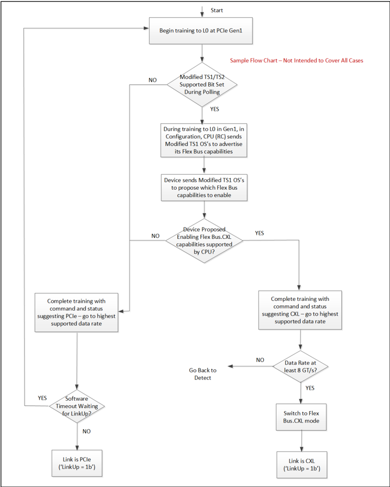

##### 6.3.1.2 CXL 2.0 Versus CXL 1.1 Negotiation

CXL 2.0 supports switching and hot add, features that are not supported in CXL 1.1. This difference in supported features impacts the link training behavior. [Table 69](#table-69-cxl-20-versus-cxl11-link-training-resolution) specifies the Flex Bus physical layer link training result for all possible combinations of upstream and downstream components. The table was constructed based upon the following assumptions:

- CXL 2.0 capable Endpoints and Switches are required to support hot add as a downstream component.
- CXL 2.0 capable Downstream Ports are not required to support hot add; however, this capability is enforced at the software level. The Flex Bus physical layer will allow the link to train successfully for hot add scenarios if both the upstream component and downstream component are CXL 2.0 capable.
- For CXL 1.1 capable hosts, BIOS prevents CXL hot add scenarios by disabling CXL alternate protocol negotiation before handing control over to the OS. The Flex Bus physical layer does not have to handle these scenarios.
- For CXL 2.0 capable Downstream Ports, BIOS sets the Disable_CXL1p1_Training bit in the Flex Bus port DVSEC before handing control to the OS. For a host, the Flex Bus physical layer uses the Disable_CXL1p1_Training bit to distinguish between initial power-on scenarios and hot add scenarios to determine appropriate link training behavior with CXL1.1 Endpoints.

The motivation for forcing the Flex Bus physical layer to fail CXL training for certain combinations of upstream component and downstream component is to avoid unpredictable software behavior if the link were allowed to train. For the specific combination of a CXL 1.1 capable Host and a CXL 2.0 capable Switch, the Switch Upstream Port is responsible for ensuring CXL alternate protocol negotiation fails by returning a value of 01b in the Alternate Protocol Negotiation Status field of the modified TS1 to indicate that it does not support the requested protocol; this must occur during Phase 1 of the alternate protocol negotiation process after the Switch Upstream Port observes that the Host is not CXL 2.0 capable.

###### Table 69. CXL 2.0 Versus CXL1.1 Link Training Resolution

| Upstream Component       | Downstream Component       | Link Training Result                                                                                             |
|--------------------------|----------------------------|------------------------------------------------------------------------------------------------------------------|
| Host - CXL 2.0 capable   | Switch - CXL 2.0 capable   | CXL 2.0 mode                                                                                                     |
| Host - CXL 1.1 capable   | Switch - CXL 2.0 capable   | Fail CXL alternate protocol negotiation                                                                          |
| Host - CXL 2.0 capable   | Endpoint - CXL 2.0 capable | CXL 2.0 mode                                                                                                     |
| Host - CXL 2.0 capable   | Endpoint - CXL 1.1 capable | CXL 1.1 mode (RCiEP) for initial power-on scenario; fail CXL alternate protocol negotiation for hot add scenario |
| Host - CXL 1.1 capable   | Endpoint - CXL 2.0 capable | CXL 1.1 mode (RCiEP) - assumes no hot add                                                                        |
| Host - CXL 1.1 capable   | Endpoint - CXL 1.1 capable | CXL 1.1 mode (RCiEP) - assumes no hot add                                                                        |
| Switch - CXL 2.0 capable | Endpoint - CXL 2.0 capable | CXL 2.0 mode                                                                                                     |
| Switch - CXL 2.0 capable | Endpoint - CXL 1.1 capable | CXL 1.1 mode (RCiEP for initial power-on scenario; fail CXL alternate protocol negotiation for hot add scenario  |

###### 6.3.1.2.1 Retimer Presence Detection

During CXL alternate protocol negotiation, the presence of a retimer impacts whether the Sync Header bypass optimization can be enabled as described in [Table 68](#table-68-additional-information-on-symbols-12-14-of-modified-ts1ts2-ordered-sets). While CXL 1.1 capable Downstream Ports rely on BIOS to program the Retimer1_Present and Retimer2_Present bits in the Flex Bus Port Control register prior to the start of link training, CXL 2.0 capable Downstream Ports must ignore those register bits as BIOS is not involved with hot plug scenarios.

CXL 2.0 capable Downstream Ports must determine retimer presence for CXL alternate protocol negotiation by sampling the 'Retimers Present' and 'Two Retimers Present' bits in the received TS2 Ordered Sets. CXL 2.0 capable Downstream Ports adhere to the following steps for determining and using retimer presence information:

1. During Polling.Configuration LTSSM state, the Downstream Port samples the 'Retimer Present' bit and the 'Two Retimers Present' bit for use during CXL alternate protocol negotiation. If the 'Retimer Present' bit is set to 1b in the 8 consecutively received TS2 Ordered Sets that causes the transition to Configuration, then the Downstream Port must assume a retimer is present for the purposes of CXL alternate protocol negotiation. If the 'Two Retimers Present' bit is set to 1b in the 8 consecutively received TS2 Ordered Sets that causes the transition to Configuration, then the Downstream Port must assume two retimers are present for the purposes of CXL alternate protocol negotiation.
2. During CXL alternate protocol negotiation, the Downstream Port uses the information sampled in step #1 along with the CXL alternate protocol negotiation bits in the modified TS1 Ordered Set to determine whether to enable the Sync Header bypass optimization. If a retimer was detected in step #1 on any lane associated with the configured link, then the Downstream Port assumes a retimer is present. If two retimers were detected in step #1 on any lane associated with the configured link, then the Downstream Port assumes two retimers are present.
3. During Configuration.Complete, per the PCIe base specification, the Downstream Port captures 'Retimer Present' and 'Two Retimers Present' information from the received modified TS2 Ordered Sets into the 'Link Status 2' register. If the values sampled in this step are not consistent with the values sampled during Polling.Configuration, the Downstream Port logs an error in the Flex Bus Port Status register, brings the LTSSM to Detect, and retrains the link with the Sync Header bypass optimization disabled.

##### 6.3.1.3 Flex Bus.CXL Negotiation with Maximum Supported Link Speed of 8GT/s or 16GT/s

If a CXL1.1 physical layer implementation supports Flex Bus.CXL operation only at a maximum speed of 8GT/s or 16GT/s, it must still advertise support of 32GT/s speed during link training at 2.5GT/s to perform alternate protocol negotiation using modified TS1 and TS2 Ordered Sets. Once the alternate protocol negotiation is complete, the Flex Bus logical PHY can then advertise the true maximum link speed that it supports as per the PCIe Specification. It is strongly recommended that CXL2.0 devices support 32 GT/s link rate; however, a CXL2.0 device is permitted to use the algorithm described in this section to enable CXL alternate protocol negotiation if it does not support 32 GT/ s link rate.

> **IMPLEMENTATION NOTE**
> A CXL device that advertises support of 32GT/s in early training when it does not truly support 32 GT/s link rate may have compatibility issues for Polling.Compliance and Loopback entry from Config.LinkWidthStart. Please see the PCIe specification for more details. Devices that do this must ensure that they provide a mechanism to disable this behavior for the purposes of Polling.Compliance and Loopback testing scenarios.

##### 6.3.1.4 Link Width Degradation and Speed Downgrade

If the link is operating in Flex Bus.CXL and degrades to a lower speed or lower link width that is still compatible with Flex Bus.CXL mode, the link should remain in Flex Bus.CXL mode after exiting recovery without having to go through the process of mode negotiation again. If the link drops to a speed or width not compatible with Flex Bus.CXL and cannot recover, the link must go down to the LTSSM Detect state; any subsequent action is implementation specific.

### 6.4 Recovery.Idle and Config.Idle Transitions to L0

The PCI Express Specification requires transmission and receipt of a specific number of consecutive Idle data Symbols on configured lanes to transition from Recovery.Idle to L0 or Config.Idle to L0 (see the PCI Express Specification). When the Flex Bus logical PHY is in CXL mode, it looks for NULL flits instead of Idle Symbols to initiate the transition to L0. When in CXL mode and either Recovery.Idle or Config.Idle, the next state is L0 if four consecutive NULL flits are received and eight NULL flits are sent after receiving one NULL flit; all other rules called out in the PCI Express Specification regarding these transitions apply.

### 6.5 L1 Abort Scenario

Since the CXL ARB/MUX virtualizes the link state seen by the link layers and only requests the physical layer to transition to L1 when the link layers are in agreement, there may be a race condition that results in an L1 abort scenario. In this case, the physical layer may receive an EIOS or detect Electrical Idle when the ARB/MUX is no longer requesting entry to L1. In this scenario, the physical layer is required to initiate recovery on the link to bring it back to L0.

### 6.6 Exit from Recovery

Upon exit from recovery, the receiver assumes that any partial TLPs that were transmitted prior to recovery entry are terminated and must be retransmitted in full via a link level retry. Partial TLPs include TLPs for which a subsequent EDB, Idle, or valid framing token were not received before entering recovery. The transmitter must satisfy any requirements to enable the receiver to make this assumption.

### 6.7 Retimers and Low Latency Mode

The CXL specification supports the following features that can be enabled to optimize latency: bypass of sync hdr insertion and use of a drift buffer instead of an elastic buffer. Enablement of sync hdr bypass is negotiated during the Flex Bus mode negotiation process described in [Section 6.3.1.1](#6311-hardware-autonomous-mode-negotiation). The Downstream Port, Upstream Port, and any retimers advertise their sync hdr bypass capability during Phase 1; and the Downstream Port communicates the final decision on whether to enable Sync Header bypass during Phase 2. Drift buffer mode is decided locally by each component. The rules for enabling each feature are summarized in [Table 70](#table-70-rules-of-enable-low-latency-mode-features); these rules are expected to be enforced by hardware.

#### Table 70. Rules of Enable Low Latency Mode Features

| Feature                                  | Conditions For Enabling                                                                                                                                                   | Notes                                                                                                                                                          |
|------------------------------------------|---------------------------------------------------------------------------------------------------------------------------------------------------------------------------|----------------------------------------------------------------------------------------------------------------------------------------------------------------|
| Sync Hdr Bypass                          | 1) All components support 2) Common reference clock 3) No retimer present or retimer cannot add or delete SKPS (e.g., in low latency bypass mode) 4) Not in loopback mode |                                                                                                                                                                |
| Drift Buffer (instead of elastic buffer) | 1) Common reference clock                                                                                                                                                 | Each component can enable this independently (i.e., does not have to be coordinated). The physical layer logs in the Flex Bus Port DVSEC when this is enabled. |

#### 6.7.1 SKP Ordered Set Frequency and L1/Recovery Entry

In Flex Bus.CXL mode, if Sync Header bypass is enabled, the following rules apply:

- After the SDS, the physical layer must schedule a control SKP Ordered Set or SKP Ordered Set after every 340 data blocks, unless it is exiting the data stream. Note: The control SKP OSs are alternated with regular SKP OSs at 16 GT/s or higher speeds; at 8 GT/s, only regular SKP OSs are scheduled.
- When exiting the data stream, the physical layer must replace the scheduled control SKP OS (or SKP OS) with either an EIOS (for L1 entry) or EIEOS (for all other cases including recovery).

When the sync hdr bypass optimization is enabled, retimers rely on the above mechanism to know when L1/recovery entry is occurring. When sync hdr bypass is not enabled, retimers must not rely on the above mechanism.

While the above algorithm dictates the control SKP OS and SKP OS frequency within the data stream, it should be noted that CXL devices must still satisfy the PCIe base specification requirement of control SKP OS and SKP OS insertion, which is at least once every 370 to 375 blocks when not operating in SRIS.

Figure 106 illustrates a scenario where a NULL flit with implied EDS token is sent as the last flit before exiting the data stream in the case where sync hdr bypass is enabled. In this example, near the end of the 339th block, the link layer has no flits to send, so the physical layer inserts a NULL flit. Since there is exactly one flit's worth of time before the next Ordered Set must be sent, a NULL flit with implied EDS token is used. In this case, the variable length NULL flit with EDS token crosses a block boundary and contains a 528-bit payload of zeros.

Figure 107 illustrates a scenario where a NULL flit with implied EDS token is sent as the last flit before exiting the data stream in the case where 128/130b encoding is used. In this example, the NULL flit contains only a 16-bit payload of zeros.

##### Figure 106. NULL Flit w/EDS and Sync Header Bypass Optimization

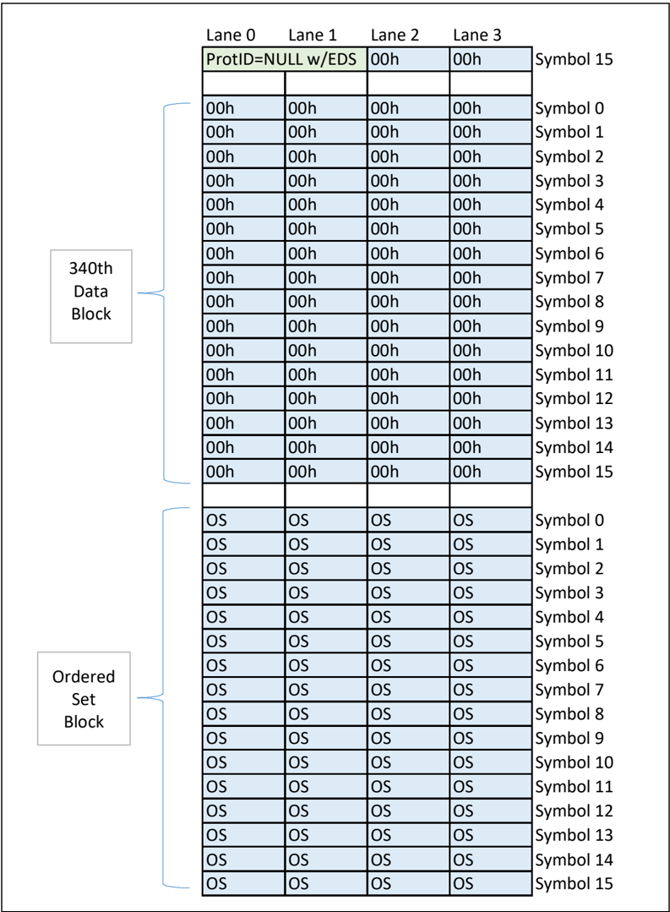

##### Figure 107. NULL Flit w/EDS and 128/130b Encoding

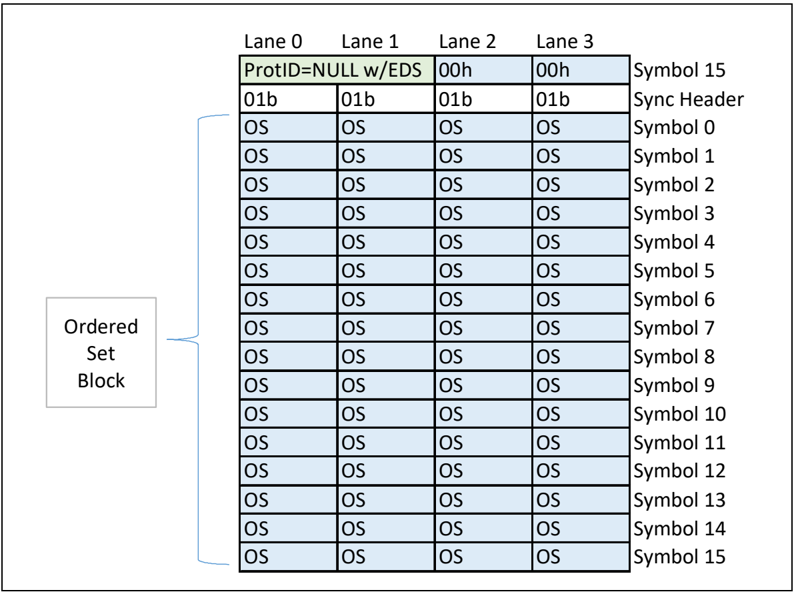

## 7.0 Switching

### 7.1 Overview

This section provides an architecture overview of different CXL switch configurations.

#### 7.1.1 Single VCS Switch

A single VCS switch consists of a single CXL Upstream port and one or more Downstream Ports as illustrated in Figure 108.

##### Figure 108. Example of a Single VCS Switch

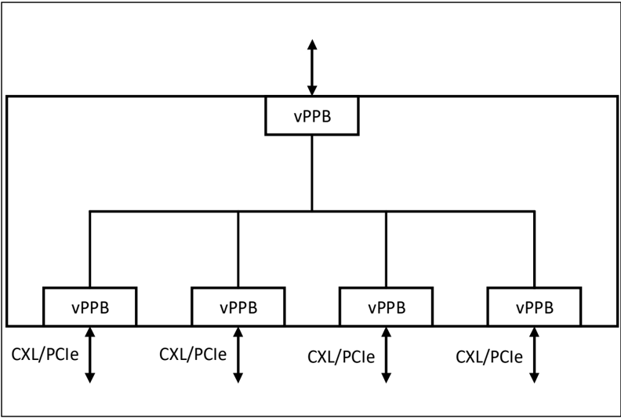

A Single VCS switch is governed by the following rules:

- Must have a single USP
- Must have one or more DSPs
- DSPs must support operating in CXL or PCIe mode of operation
- All non-MLD (includes PCIe and SLD) ports support a single Virtual Hierarchy below the vPPB
- Downstream Switch Port must be capable of supporting CXL 1.1 link
- Must support the CXL 2.0 Extensions DVSEC for Ports

- The DVSEC defines registers to support CXL.io decode to support CXL 1.1 and registers for CXL Memory Decode. The address decode for CXL.io is in addition to the address decode mechanism supported by vPPB.
- Fabric Manager is optional for Single VCS Switch

#### 7.1.2 Multiple VCS Switch

A Multiple VCS Switch consists of multiple Upstream Ports and one or more Downstream Ports per VCS as illustrated in Figure 109.

##### Figure 109. Example of a Multiple VCS Switch with SLD Ports

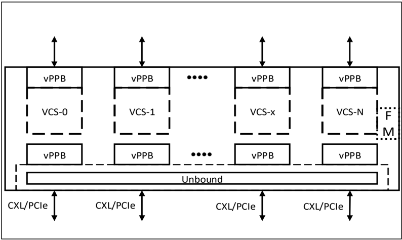

A Multiple VCS Switch is governed by the following rules:

- Must have more than one USP
- Must have one or more Downstream Switch Ports per VCS
- The binding of upstream vPPB to physical port and the structure of the VCS (including number of vPPBs, the default vPPB capability structures, and any initial bindings of downstream vPPBs to physical ports) is defined using switch vendor specific methods.
- Each Downstream Switch Port must be bound to a PPB or vPPB.
- Fabric Manager is optional for Multiple VCS switches. An FM is required for Multiple VCS switches that require bind/unbind, or that support MLD ports. Each DSP can be reassigned to a different VCS through the managed hot-plug flow orchestrated by Fabric Manager.
- When configured , each USP and its associated DSPs form a Single VCS Switch and operate as per the Single VCS Switch rules.
- DSPs must support operating in CXL or PCIe mode of operation.
- All non-MLD ports support a single Virtual Hierarchy below the Downstream Switch Port .
- DSPs must be capable of supporting CXL 1.1 link

#### 7.1.3 Multiple VCS Switch with MLD Ports

A Multiple VCS Switch with MLD Ports consists of multiple Upstream Port Switches and a combination of one or more Downstream MLD Ports. as illustrated in [Figure 110](#figure-110-example-of-a-multiple-root-switch-port-with-pooled-memory-devices).

##### Figure 110. Example of a Multiple Root Switch Port with Pooled Memory Devices

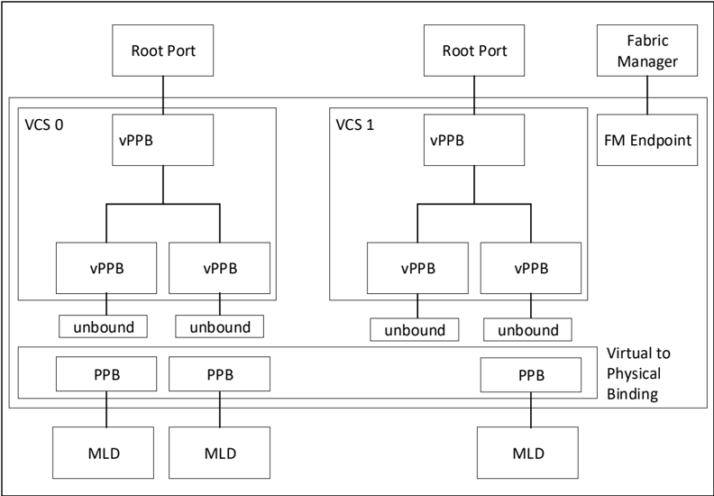

A Multiple Root Port Switch supporting MLD is governed by the following rules:

- More than one USP
- One or more Downstream vPPBs per VCS.
- Each SLD Downstream Switch Port is configured to connect to a Single VCS.
- An MLD Capable Downstream Switch Port can be connected to up to 16 USPs.
- Each of the DSPs can be reassigned to a different VCS through the managed hotplug flow orchestrated by Fabric Manager
- Each of the LD instances in an MLD component can be reassigned to a different VCS through the managed hot-plug flow orchestrated by Fabric Manager.
- When configured, each USP and its associated DSPs and DSP VH instances are virtualized to form a Single VCS Switch, and operate as per the Single VCS Switch rules.
- Downstream Switch Ports must support operating in CXL or PCIe mode of operation
- All non-MLD ports support a single Virtual Hierarchy below the Downstream Switch Port
- Downstream Switch Port must be capable of supporting CXL 1.1 link
- Each CXL Switch Hierarchy must enable at most a single a single CXL 1.1 device.

### 7.2 Switch Configuration and Composition

This section describes the CXL Switch initialization options and related configuration and composition procedures.

#### 7.2.1 CXL Switch Initialization Options

The CXL Switch can be initialized using three different methods:

1. Static
2. FM boots before the host(s)
3. Fabric Manager and Host Boot Simultaneously

##### 7.2.1.1 Static Initialization

[Figure 111](#figure-111-static-cxl-switch-with-two-vcss) shows a statically initialized CXL switch with 2 VCSs. In this example the downstream vPPBs are statically bound to ports and are available to the host at boot. Managed hot add of Devices is supported using standard PCIe mechanisms.

###### Figure 111. Static CXL Switch With Two VCSs

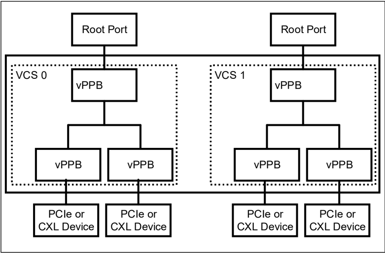

## Static Switch Characteristics:

- No support for MLD Ports
- No support for rebinding of ports to a different VCS
- No FM is required
- At switch boot, all VCSs and Downstream Port bindings are statically configured using switch vendor defined mechanisms (e.g. configuration file in SPI Flash)
- Supports CXL 1.1, CXL 2.0, or PCIe Downstream Ports

- VCSs, including vPPBs, behave identically to a PCIe switch, along with the addition of supporting CXL protocols
- Each VCS is ready for enumeration when the host boots
- Hot add and managed hot remove are supported
- Async removal of CXL 2.0 devices is not supported

A switch providing internal Endpoint functions is outside the scope of the CXL specification. Any internal Endpoints must be compliant with the PCIe Base Specification.

##### 7.2.1.2 Fabric Manager Boots First

In cases where the FM boots first (prior to host(s)), the switch is permitted to be initialized as described in the following example Figure 112.

###### Figure 112. Example of CXL Switch Initialization When FM Boots First

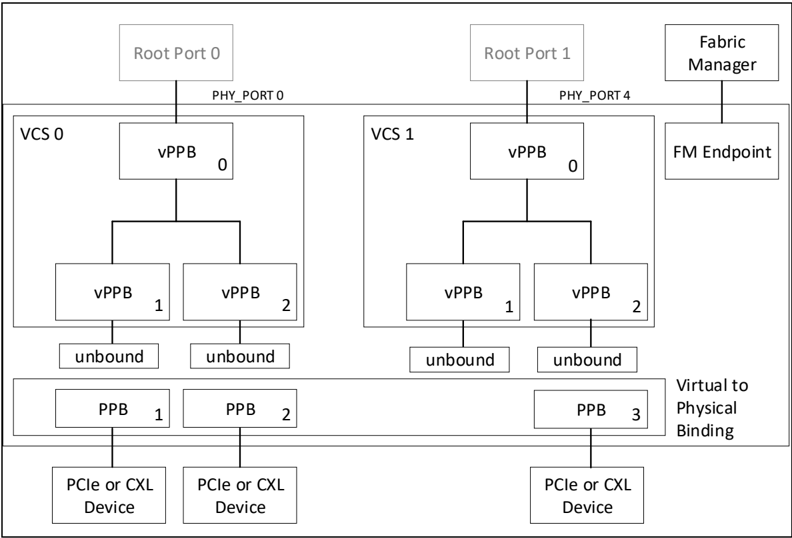

1. Switch and FM boot
2. In this example the downstream vPPBs are statically bound to ports and are available to the host at boot. Managed hot add of Devices is supported using standard PCIe mechanisms.
3. All Downstream Ports are not bound to VCSs, so they are owned by the FM
4. DSPs link up and the switch notifies the FM using managed hot add notification

###### Figure 113. Example of CXL Switch after Initialization Completes

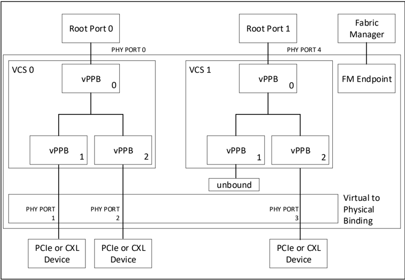

As shown in the example above in Figure 115, the following steps are taken to configure the switch after initialization completes:

5. FM sends bind command BIND (VCS0, VPPB1, PHY_PORT_ID1) to the switch. The switch then configures virtual to physical binding as described in items.
6. Switch remaps vPPB virtual port numbers to physical port numbers.
7. Switch remaps vPPB connector definition (PERST#, PRSNT#) to physical connector.
8. Switch disables the link using PPB Link Disable.
9. At this point all Physical downstream PPB functionality (Capabilities, etc.) maps directly to the vPPB including Link Disable, which releases the port for linkup.
10. The FM-owned PPB no longer exists for this port.
11. When the hosts boot, the switch is ready for enumeration.

##### 7.2.1.3 Fabric Manager and Host Boot Simultaneously

###### Figure 114. Example of Switch with Fabric Manager and Host Boot Simultaneously

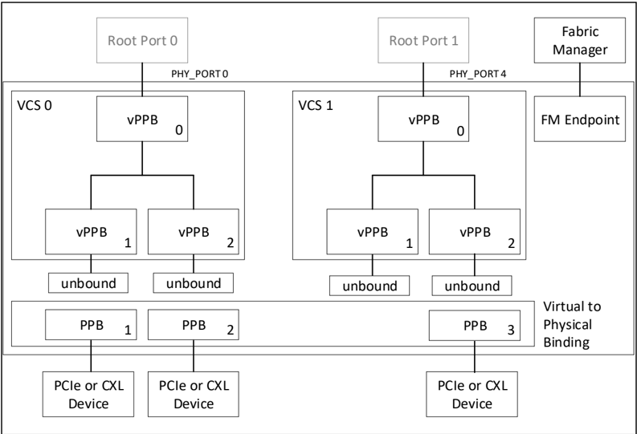

In the case where Switch, FM, and Host boot at the same time:

1. VCSs are statically defined.
2. vPPBs within each VCS are unbound and presented to the host as link down.
3. Switch discovers downstream devices and presents them to the FM.
4. Host enumerates the VH and configures DVSEC in the US PPB.
5. FM performs port binding to vPPBs.
6. The switch performs virtual to physical binding.
7. Each bound port results in a hot add indication to the host.

###### Figure 115. Example of Switch with Single Power-on/Reset Domain Post Configuration

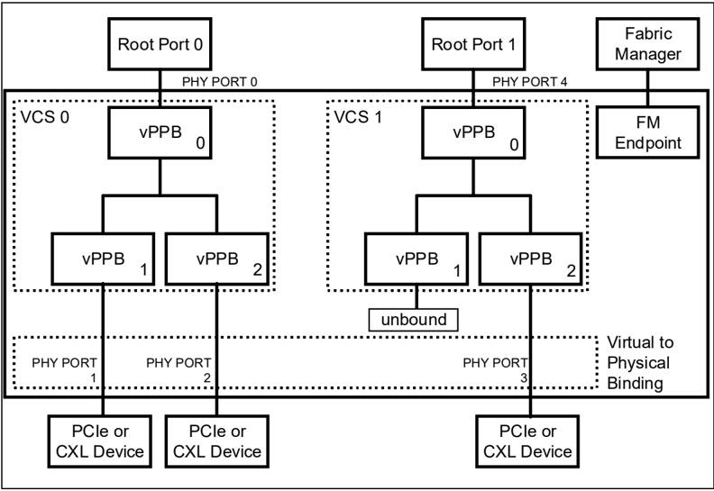

#### 7.2.2 Sideband Signal Operation

The availability of slot sideband control signals is decided by the form factor specifications. Any form factor can be supported, but if the form factor supports the following signals, they must be driven by the switch or connected to the switch for proper operation.

All other sideband signals have no constraints and are supported exactly as in PCIe.

##### Table 71. CXL Switch Sideband Signal Requirements

| Signal Name   | Signal Description                                                                               | Requirement                                                                          |
|---------------|--------------------------------------------------------------------------------------------------|--------------------------------------------------------------------------------------|
| USP PERST#    | PCIe Reset provides a fundamental reset to the VCS                                               | If it exists this signal must be connected to the switch                             |
| USP ATTN#     | Attention button indicates a request to the host for a managed hot remove of the switch          | If hot remove of the switch is supported this signal must be generated by the switch |
| DSP PERST#    | PCIe Reset provides a power on reset to the downstream link partner                              | If it exists this signal must be generated by the switch                             |
| DSP PRSNT#    | Out-of-band Presence Detect indicates that a device has been connected to the slot               | If it exists this signal must be connected to the switch                             |
| DSP ATTN#     | Attention button indicates a request to the host for a managed hot remove of the downstream slot | If managed hot removal is supported, this signal must be connected to the switch     |

This list provides the minimum sideband signal set to support managed hot plug. Other optional sidebands signals such as Attention LED, Power LED, Manual Retention Latch, Electromechanical Lock, etc. may also be used to for managed hot plug. The behavior of these sideband signals is identical to PCIe.

#### 7.2.3 Binding and Unbinding

This section describes the details of Binding and Unbinding of CXL Devices to a vPPB.

##### 7.2.3.1 Binding and Unbinding of a Single Logical Device Port

A Single Logical Device (SLD) port refers to a port that is bound to only one VCS. That port can be linked up with a PCIe device or CXL Type 1, Type 2, or Type 3 SLD components. In general, the vPPB bound to the SLD port behaves the same as a PPB in a PCIe switch. An exception is that a vPPB can be unbound from any physical port. In this case the vPPB appears to the host as if it is in a linkdown state with no Presence Detect indication. Since re-binding of ports is a required feature, this switch must have a Fabric Manager API support and Fabric Manager connection. The Fabric Manager can bind any unused physical port to the unbound vPPB. After binding all of the vPPB port settings are applied to that physical port.

[Figure 116](#figure-116-example-of-binding-and-unbinding-of-an-sld-port) shows the state of the switch after the Fabric Manager has executed an unbind command to vPPB2 in VCS0. The act of unbinding the vPPB also leaves the port unbound. It becomes FM owned and is then controlled by the PPB settings for that physical port. Through the FM API, the FM has CXL.io access to each FM-owned SLD port or FM-owned LD within an MLD component. It can choose to prepare the logical device for rebinding by triggering FLR or CXL Reset. The switch prohibits any CXL.io access from the FM to a bound SLD port and any CXL.io access from the FM to a bound LD within an MLD component. The FM API does not support FM generation of CXL.mem or CXL.cache transactions to any port.

###### Figure 116. Example of Binding and Unbinding of an SLD Port

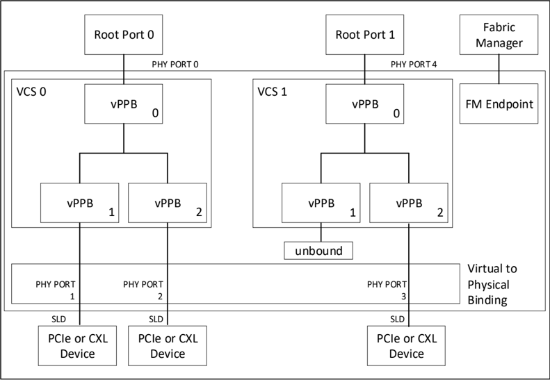

[Figure 117](#figure-117-example-of-cxl-switch-configuration-after-an-unbind-command) shows the state of the switch after the Fabric Manager has executed an unbind command to vPPB2 in VCS0. Unbind of the vPPB causes the switch to assert Link Disable to the port. The port then becomes FM owned and is controlled by the PPB settings for that physical port. Through the FM API, the FM has CXL.io access to each FM-owned SLD port or FM-owned LD within a an MLD component. It can choose to prepare the logical device for rebinding by triggering FLR or CXL Reset. The switch prohibits any CXL.io access from the FM to a bound SLD port and any CXL.io access from the FM to a bound LD within an MLD component. The FM API does not support FM generation of CXL.mem or CXL.cache transactions to any port.

###### Figure 117. Example of CXL Switch Configuration After an Unbind Command

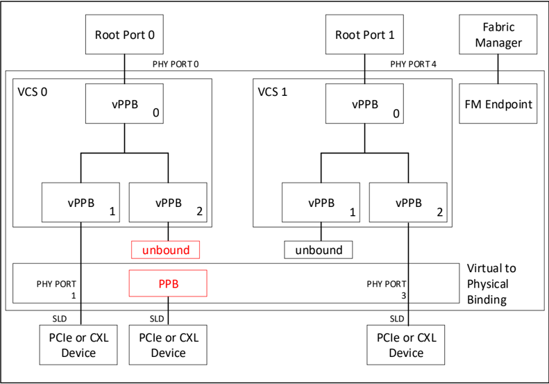

[Figure 118](#figure-118-example-of-cxl-switch-configuration-after-a-bind-command) shows the state of the switch after the FM executes the bind command to connect VCS1.vPPB1 to the unbound physical port. The successful command execution results in the switch sending a hot add indication to host 1. Enumeration, configuration, and operation of the host and Type 3 device is identical to a hot add of a device.

###### Figure 118. Example of CXL Switch Configuration after a Bind Command

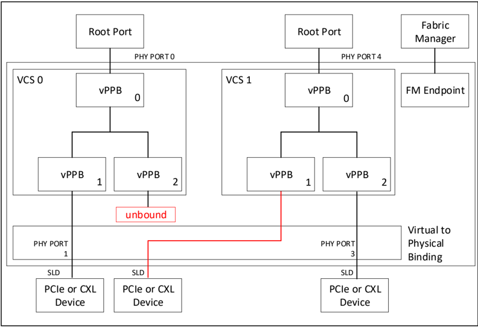

##### 7.2.3.2 Binding and Unbinding of a Pooled Device

A pooled device contains multiple Logical Devices so traffic over the physical port can be associated with multiple DS vPPBs. The switch behavior for binding and unbinding of an MLD component is similar to that of an SLD component with some notable differences:

1. The physical link cannot be impacted by binding and unbinding of a Logical Device within an MLD component, so PERST#, Hot Reset, and Link Disable cannot be asserted, and there must be no impact to the traffic of other VCSs during the bind or unbind commands.
2. The physical PPB for an MLD port is always owned by the FM. The FM is responsible for port link control, AER, DPC, etc., and manages it using the FM API.
3. The FM may need to manage the pooled device in order to change memory allocations, enable the LD, etc.

[Figure 119](#figure-119-example-of-a-cxl-switch-before-binding-of-lds-within-pooled-device) shows a CXL switch after boot and before binding of any LDs within the pooled device. Note that the FM is not a PCIe Root Port and the switch is responsible for enumerating the FMLD after any physical reset since the switch is responsible for proxying commands from FM to the device. The PPB of an MLD port is always owned by the FM since the FM is responsible for configuration and error handling of the physical port. After linkup the FM is notified that it is a Type 3 pooled device.

###### Figure 119. Example of a CXL Switch Before Binding of LDs Within Pooled Device

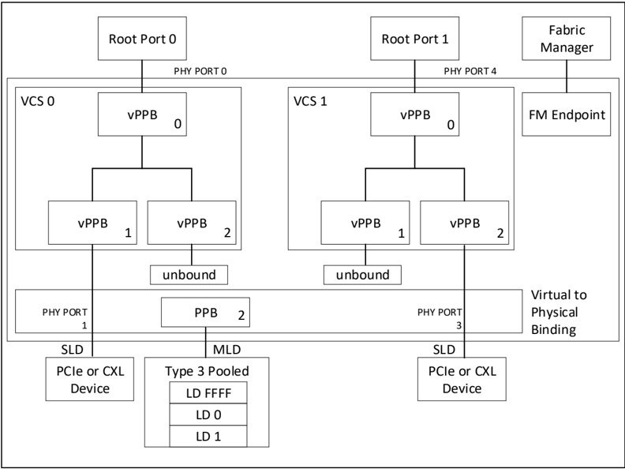

The FM configures the pooled device for Logical Device 1 and sets its memory allocation, etc. The FM performs a bind command for the unbound vPPB 2 in VCS 0 to LD 1 in the Type 3 pooled device. The switch performs the virtual to physical translations such that all CXL.io and CXL.mem transactions targeting vPPB 2 in VCS0 are routed to the MLD port with LD-ID set to 1. Additionally, all CXL.io and CXL.mem transactions from LD 1 in the pooled device are routed according to the host configuration of VCS 0. After binding, the vPPB notifies the host of a hot add the same as if it were binding a vPPB to an SLD port.

Figure 120 shows the state of the switch after binding LD 1 to VCS 0.

###### Figure 120. Example of a CXL Switch After Binding of LD-ID 1 Within Pooled Device

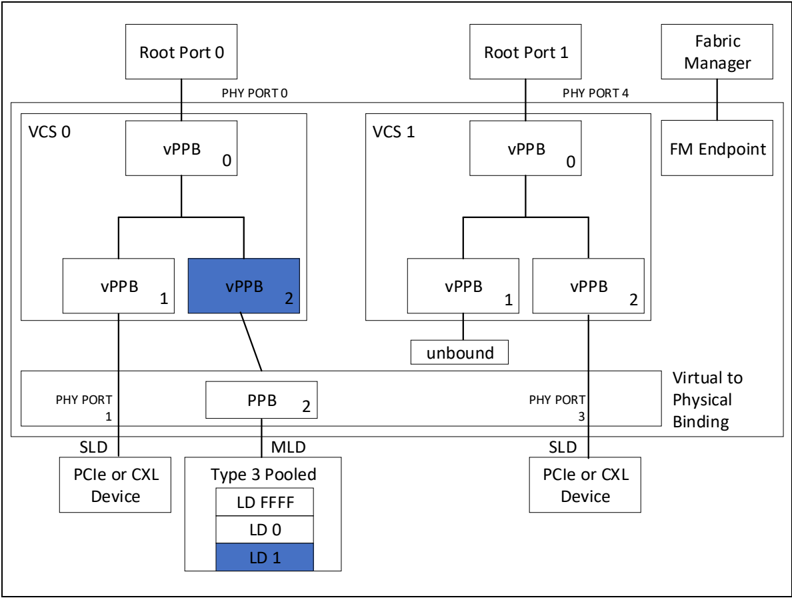

The FM configures the pooled device for Logical Device 0 and sets its memory allocation, etc. The FM performs a bind command for the unbound vPPB 1 in VCS 1 to Logical Device 0 in the Type 3 pooled device. The switch performs the virtual to physical translations such that all CXL.io and CXL.mem transactions targeting the vPPB in VCS1 are routed to the MLD port with LD-ID set to 0. Additionally, all CXL.io and CXL.mem transactions from LD-ID = 0 in the pooled device are routed to the USP of VCS 1. After binding, the vPPB notifies the host of a hot add the same as if it were binding a vPPB to an SLD port.

Figure 121 shows the state of the switch after binding LD 0 to VCS 1.

###### Figure 121. Example of a CXL Switch After Binding of LD-IDs 0 and 1 Within Pooled Device

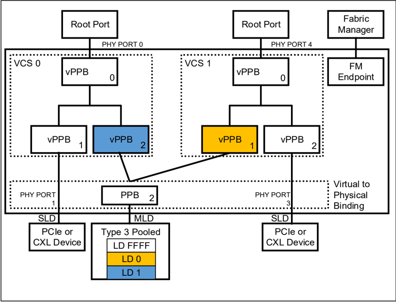

After binding LDs to vPPBs the switch behavior is different from a bound SLD Port with respect to control, status, error notification and error handling. [Section 7.3.4](#734-fm-owned-ppb-cxl-handling) describes the differences in behavior for every bit in every register.

#### 7.2.4 PPB and vPPB Behavior for MLD Ports

An MLD port provides a virtualized interface such that multiple vPPBs can access LDs over a shared physical interface. As a result, the characteristics and behavior of a vPPB bound to an MLD port is different than the behavior of a vPPB bound to an SLD port. This section defines the differences between them. If not mentioned in this section, the features and behavior of a vPPB bound to an MLD port are the same as one bound to an SLD port.

This section uses the following terminology:

- Hardwire to 0 refers to status and optional control register bits that are initialized to 0. Writes to these bits have no effect.
- The term 'Read/Write with no Effect' refers to control register bits where writes are recorded but have no effect on operation. Reads to those bits reflect the previously written value or the initialization value if it has not been changed since initialization.

##### 7.2.4.1 MLD Type 1 Configuration Space Header

###### Table 72. MLD Type 1 Configuration Space Header

| Register                | Register Fields                                                         | FM Owned PPB   | All Other vPPBs                               |
|-------------------------|-------------------------------------------------------------------------|----------------|-----------------------------------------------|
| Bridge Control Register | Parity Error Response Enable                                            | Supported      | Hardwired to all 0s                           |
| Bridge Control Register | SERR# Enable                                                            | Supported      | Read/Write with no effect                     |
| Bridge Control Register | ISA Enable                                                              | Not supported  | Not supported                                 |
| Bridge Control Register | Secondary Bus Reset Refer to section 7.7 for SBR details for MLD ports. | Supported      | Read/Write with no effect. Optional FM Event. |

##### 7.2.4.2 MLD PCI-Compatible Configuration Registers

###### Table 73. MLD PCI-Compatible Configuration Registers

| Register/ Capability Structure   | Capability Register Fields   | FM Owned PPB                          | All vPPBs Bound to the MLD Port   |
|----------------------------------|------------------------------|---------------------------------------|-----------------------------------|
| Command Register                 | I/O Space Enable             | Hardwire to 0s                        | Hardwire to 0s                    |
| Command Register                 | Memory Space Enable          | Supported                             | Supported per vPPB                |
| Command Register                 | Bus Master Enable            | Supported                             | Supported per vPPB                |
| Command Register                 | Parity Error Response        | Supported                             | Read/Write with no effect         |
| Command Register                 | SERR# Enable                 | Supported                             | Supported per vPPB                |
| Command Register                 | Interrupt Disable            | Supported                             | Hardwire to 0s                    |
| Status Register                  | Interrupt status             | Hardwire to 0 (INTx is not supported) | Hardwire to 0s                    |
| Status Register                  | Master Data Parity Error     | Supported                             | Hardwire to 0s                    |
| Status Register                  | Signaled System Error        | Supported                             | Supported per vPPB                |
| Status Register                  | Detected Parity Error        | Supported                             | Hardwire to 0s                    |

##### 7.2.4.3 MLD PCI Express Capability Structure

###### Table 74. MLD PCI Express Capability Structure

| Register/ Capability Structure   | Capability Register Fields             | FM Owned PPB                                                                                             | All vPPBs Bound to the MLD Port   |
|----------------------------------|----------------------------------------|----------------------------------------------------------------------------------------------------------|-----------------------------------|
| Device Capabilities Register     | Max_Payload_Size Supported             | Configured by the FM to the max value supported by switch hardware and min value configured in all vPPBs | Mirrors PPB                       |
| Device Capabilities Register     | Phantom Functions Supported            | Hardwire to 0s                                                                                           | Hardwire to 0s                    |
| Device Capabilities Register     | Extended Tag Field Supported           | Supported                                                                                                | Mirrors PPB                       |
| Device Control Register          | Max_Payload_Size                       | Configured by the FM to Max_Payload Size Supported                                                       | Read/Write with no effect         |
| Link Capabilities Register       | Link Bandwidth Notification Capability | Hardwire to 0s                                                                                           | Hardwire to 0s                    |
| Link Capabilities                | ASPM Support                               | No L0s support             | No L0s support                                                                          |
| Link Capabilities                | Clock Power Management                     | No PM L1 Substates support | No PM L1 Substates support                                                              |
| Link Control                     | ASPM Control                               | Supported                  | Switch only enables ASPM if all vPPBs bound to this MLD have enabled ASPM               |
| Link Control                     | Link Disable                               | Supported                  | The switch handles it as an unbind by discarding all traffic to/ from this LD-ID.       |
| Link Control                     | Retrain Link                               | Supported                  | Read/Write with no effect                                                               |
| Link Control                     | Common Clock Configuration                 | Supported                  | Read/Write with no effect                                                               |
| Link Control                     | Extended Synch                             | Supported                  | Read/Write with no effect                                                               |
| Link Control                     | Hardware Autonomous Width Disable          | Supported                  | Read/Write with no effect                                                               |
| Link Control                     | Link Bandwidth Management Interrupt Enable | Supported                  | Read/Write with no effect                                                               |
| Link Control                     | Link Autonomous Bandwidth Interrupt Enable | Supported                  | Supported per vPPB. Each host can be notified of autonomous speed change                |
| Link Control                     | DRS Signaling Control                      | Supported                  | Switch sends DRS after receiving DRS on the link and after binding of the vPPB to an LD |
| Link Status register             | Current Link Speed                         | Supported                  | Mirrors PPB                                                                             |
| Link Status register             | Negotiated Link Width                      | Supported                  | Mirrors PPB                                                                             |
| Link Status register             | Link Training                              | Supported                  | Hardwire to 0s                                                                          |
| Link Status register             | Slot Clock Configuration                   | Supported                  | Mirrors PPB                                                                             |
| Link Status register             | Data Link Layer Active                     | Supported                  | Mirrors PPB                                                                             |
| Link Status register             | Link Autonomous Bandwidth Status           | Supported                  | Supported per vPPB                                                                      |
| Slot Capabilities Register       | Hot Plug Surprise                          | Hardwire to 0s             | Hardwire to 0s                                                                          |
| Slot Capabilities Register       | Physical Slot Number                       | Supported                  | Mirrors PPB                                                                             |
| Slot Status Register             | Attention Button Pressed           | Supported      | Mirrors PPB or is set by the switch on unbind        |
| Slot Status Register             | Power Fault Detected               | Supported      | Mirrors PPB                                          |
| Slot Status Register             | MRL Sensor Changed                 | Supported      | Mirrors PPB                                          |
| Slot Status Register             | Presence Detect Changed            | Supported      | Mirrors PPB or is set by the switch on unbind        |
| Slot Status Register             | MRL Sensor State                   | Supported      | Mirrors PPB                                          |
| Slot Status Register             | Presence Detect State              | Supported      | Mirrors PPB or set by the switch on bind or unbind   |
| Slot Status Register             | Electromechanical Interlock Status | Supported      | Mirrors PPB                                          |
| Slot Status Register             | Data Link Layer State Changed      | Supported      | Mirrors PPB or set by the switch on bind or unbind   |
| Device Capabilities 2 Register   | OBFF Supported                     | Hardwire to 0s | Hardwire to 0s                                       |
| Device Control 2 Register        | ARI Forwarding Enable              | Supported      | Supported per vPPB                                   |
| Device Control 2 Register        | Atomic Op Egress Blocking          | Supported      | Mirrors PPB. Read/ Write with no effect              |
| Device Control 2 Register        | LTR Mechanism Enabled              | Supported      | Supported per vPPB                                   |
| Device Control 2 Register        | Emergency Power Reduction Request  | Supported      | Read/Write with no effect. Optional FM notification. |
| Device Control 2 Register        | End-End TLP Prefix Blocking        | Supported      | Mirrors PPB. Read/ Write with no effect              |
| Link Control 2 Register          | Target Link Speed                  | Supported      | Read/Write with no effect. Optional FM notification. |
| Link Control 2 Register          | Enter Compliance                   | Supported      | Read/Write with no effect                            |
| Link Control 2 Register          | Hardware Autonomous Speed Disable  | Supported      | Read/Write with no effect. Optional FM notification. |
| Link Control 2 Register          | Selectable De-emphasis             | Supported      | Read/Write with no effect                            |
| Link Control 2 Register          | Transmit Margin                    | Supported      | Read/Write with no effect                            |
| Link Control 2 Register          | Enter Modified Compliance          | Supported      | Read/Write with no effect                            |
| Link Control 2 Register          | Compliance SOS                     | Supported      | Read/Write with no effect                            |
| Link Control 2 Register          | Compliance Preset/De- emphasis     | Supported      | Read/Write with no effect                            |
| Link Status 2 Register           | Current De-emphasis Level                | Supported      | Mirrors PPB                                                                             |
| Link Status 2 Register           | Equalization 8.0 GT/s Complete           | Supported      | Mirrors PPB                                                                             |
| Link Status 2 Register           | Equalization 8.0 GT/s Phase 1 Successful | Supported      | Mirrors PPB                                                                             |
| Link Status 2 Register           | Equalization 8.0 GT/s Phase 2 Successful | Supported      | Mirrors PPB                                                                             |
| Link Status 2 Register           | Equalization 8.0 GT/s Phase 3 Successful | Supported      | Mirrors PPB                                                                             |
| Link Status 2 Register           | Link Equalization Request 8.0 GT/s       | Supported      | Read/Write with no effect                                                               |
| Link Status 2 Register           | Retimer Presence Detected                | Supported      | Mirrors PPB                                                                             |
| Link Status 2 Register           | Two Retimers Presence Detected           | Supported      | Mirrors PPB                                                                             |
| Link Status 2 Register           | Crosslink Resolution                     | Hardwire to 0s | Hardwire to 0s                                                                          |
| Link Status 2 Register           | Downstream Component Presence            | Supported      | Reflects the binding state of the vPPB                                                  |
| Link Status 2 Register           | DRS Message Received                     | Supported      | Switch sends DRS after receiving DRS on the link and after binding of the vPPB to an LD |
| Link Status 2 Register           |                                          | Supported      |                                                                                         |

##### 7.2.4.4 MLD PPB Secondary PCI Express Capability Structure

All fields in the Secondary PCI Express Capability Structure for a Virtual PPB shall behave identical to PCIe except the following:

###### Table 75. MLD Secondary PCI Express Capability Structure

| Register/ Capability Structure          | Capability Register Fields                 | FM Owned PPB   | All vPPBs Bound to the MLD Port   |
|-----------------------------------------|--------------------------------------------|----------------|-----------------------------------|
| Link Control 3 Register                 | Perform Equalization                       | Supported      | Read/Write with no effect         |
| Link Control 3 Register                 | Link Equalization Request Interrupt Enable | Supported      | Read/Write with no effect         |
| Link Control 3 Register                 | Enable Lower SKP OS Generation Vector      | Supported      | Read/Write with no effect         |
| Lane Error Status Register              | All fields                                 | Supported      | Mirrors PPB                       |
| Lane Equalization Control Register      | All fields                                 | Supported      | Read/Write with no effect         |
| Data Link Feature Capabilities Register | All fields                                 | Supported      | Hardwire to 0s                    |
| Data Link Feature Status Register       | All fields                                 | Supported      | Hardwire to 0s                    |

##### 7.2.4.5 MLD Physical Layer 16.0 GT/s Extended Capability

All fields in the Secondary PCI Express Capability Structure for a Virtual PPB shall behave identical to PCIe except the following:

###### Table 76. MLD Physical Layer 16.0 GT/s Extended Capability

| Register/ Capability Structure                                | Capability Register Fields                   | FM Owned PPB   | All vPPBs Bound to the MLD Port   |
|---------------------------------------------------------------|----------------------------------------------|----------------|-----------------------------------|
| 16.0 GT/s Status Register                                     | All fields                                   | Supported      | Mirrors PPB                       |
| 16.0 GT/s Local Data Parity Mismatch Status Register          | Local Data Parity Mismatch Status Register   | Supported      | Mirrors PPB                       |
| 16.0 GT/s First Retimer Data Parity Mismatch Status Register  | First Retimer Data Parity Mismatch Status    | Supported      | Mirrors PPB                       |
| 16.0 GT/s Second Retimer Data Parity Mismatch Status Register | Second Retimer Data Parity Mismatch Status   | Supported      | Mirrors PPB                       |
| 16.0 GT/s Lane Equalization Control Register                  | Downstream Port 16.0 GT/s Transmitter Preset | Supported      | Mirrors PPB                       |

##### 7.2.4.6 MLD Physical Layer 32.0 GT/s Extended Capability

###### Table 77. MLD Physical Layer 32.0 GT/s Extended Capability

| Register/ Capability Structure               | Capability Register Fields                            | FM Owned PPB   | All vPPBs Bound to the MLD Port   |
|----------------------------------------------|-------------------------------------------------------|----------------|-----------------------------------|
| 32.0 GT/s Capabilities Register              | All fields                                            | Supported      | Mirrors PPB                       |
| 32.0 GT/s Control Register                   | All fields                                            | Supported      | Read/Write with no effect         |
| 32.0 GT/s Status Register                    | Link Equalization Request 32.0 GT/s                   | Supported      | Read/Write with no effect         |
| 32.0 GT/s Status Register                    | All fields except Link Equalization Request 32.0 GT/s | Supported      | Mirrors PPB                       |
| Received Modified TS Data 1 Register         | All fields                                            | Supported      | Mirrors PPB                       |
| Received Modified TS Data 2 Register         | All fields                                            | Supported      | Mirrors PPB                       |
| Transmitted Modified TS Data 1 Register      | All fields                                            | Supported      | Mirrors PPB                       |
| 32.0 GT/s Lane Equalization Control Register | Downstream Port 32.0 GT/s Transmitter Preset          | Supported      | Mirrors PPB                       |

##### 7.2.4.7 MLD Lane Margining at the Receiver Extended Capability

###### Table 78. MLD Lane Margining at the Receiver Extended Capability

| Register/ Capability Structure   | Capability Register Fields   | FM Owned PPB   | All vPPBs Bound to the MLD Port                               |
|----------------------------------|------------------------------|----------------|---------------------------------------------------------------|
| Margining Port Status Register   | All fields                   | Supported      | Always indicates Margining Ready and Margining Software Ready |
| Margining Lane Control Register  | All fields                   | Supported      | Read/Write with no effect                                     |

#### 7.2.5 MLD ACS Extended Capability

CXL.io Requests and Completions are routed to the USP

##### Table 79. MLD ACS Extended Capability

| Register/ Capability Structure   | Capability Register Fields             | FM Owned PPB   | All vPPBs Bound to the MLD Port                      |
|----------------------------------|----------------------------------------|----------------|------------------------------------------------------|
| ACS Capability Register          | All fields                             | Supported      | Supported since a vPPB can be bound to any port type |
| ACS Control Register             | ACS Source Validation Enable           | Hardwire to 0  | Read/Write with no effect                            |
| ACS Control Register             | ACS Translation Blocking Enable        | Hardwire to 0  | Read/Write with no effect                            |
| ACS Control Register             | ACS P2P Request Redirect Enable        | Hardwire to 1  | Read/Write with no effect                            |
| ACS Control Register             | ACS P2P Completion Redirect Enable     | Hardwire to 1  | Read/Write with no effect                            |
| ACS Control Register             | ACS Upstream Forwarding Enable         | Hardwire to 0  | Read/Write with no effect                            |
| ACS Control Register             | ACS P2P Egress Control Enable          | Hardwire to 0  | Read/Write with no effect                            |
| ACS Control Register             | ACS Direct Translated P2P Enable       | Hardwire to 0  | Read/Write with no effect                            |
| ACS Control Register             | ACS I/O Request Blocking Enable        | Hardwire to 0  | Read/Write with no effect                            |
| ACS Control Register             | ACS DSP Memory Target Access Control   | Hardwire to 0s | Read/Write with no effect                            |
| ACS Control Register             | ACS Unclaimed Request Redirect Control | Hardwire to 0  | Read/Write with no effect                            |

#### 7.2.6 MLD PCIe Extended Capabilities

All fields in the PCI Express Extended Capability structures for a vPPB shall behave identical to PCIe except the following:

#### 7.2.7 MLD Advanced Error Reporting Extended Capability

AER in an MLD port is separated into Triggering, Notifications, and Reporting. Triggering and AER Header Logging is handled at switch ingress and egress using switch vendor specific means. Notification is also switch vendor specific, but it results in the vPPB logic for all vPPBs bound to the MLD port being informed of the AER errors that have been triggered. The vPPB logic is responsible for generating the Advanced Error Reporting status and error messages for each vPPB based on the AER Mask and Severity registers.

vPPBs bound to an MLD port support all of the AER Mask and Severity configurability but some of the Notifications are suppressed to avoid confusion.

The PPB has its own AER Mask and Severity registers and the FM is notified of error conditions based on the Event Notification settings.

Errors that are not vPPB specific are provided to the host with a header log containing all 1's data. The hardware header log is provided only to the FM through the PPB.

Table 80 lists the AER Notifications and their routing indications the PPB and vPPBs.

##### Table 80. MLD Advanced Error Reporting Extended Capability

| Hardware Triggers   | AER Error                                     | FM Owned PPB   | All vPPBs Bound to the MLD Port         |
|---------------------|-----------------------------------------------|----------------|-----------------------------------------|
| AER Notifications   | Data Link Protocol Error                      | Supported      | Supported per vPPB                      |
|                     | Surprise Down Error                           | Supported      | Supported per vPPB                      |
|                     | Poisoned TLP Received                         | Supported      | Hardwire to 0                           |
|                     | Flow Control Protocol Error                   | Supported      | Supported per vPPB                      |
|                     | Completer abort                               | Supported      | Supported to the vPPB that generated it |
|                     | Unexpected completion                         | Supported      | Supported to the vPPB that received it  |
|                     | Receiver Overflow                             | Supported      | Supported per vPPB                      |
|                     | Malformed TLP                                 | Supported      | Supported per vPPB                      |
|                     | ECRC Error                                    | Supported      | Hardwire to 0                           |
|                     | Unsupported Request                           | Supported      | Supported per vPPB                      |
|                     | ACS violation                                 | Supported      | Hardwire to 0                           |
|                     | Uncorrectable Internal Error                  | Supported      | Supported per vPPB                      |
|                     | MC 1 Blocked                                  | Supported      | Hardwire to 0                           |
|                     | Atomic Op Egress Block                        | Supported      | Hardwire to 0                           |
|                     | E2E TLP Prefix Block                          | Supported      | Hardwire to 0                           |
|                     | Poisoned TLP Egress block                     | Supported      | Hardwire to 0                           |
|                     | Bad TLP (correctable)                         | Supported      | Supported per vPPB                      |
|                     | Bad DLLP (correctable)                        | Supported      | Supported per vPPB                      |
|                     | Replay Timer Timeout (correctable)            | Supported      | Supported per vPPB                      |
|                     | Replay Number Rollover (correctable)          | Supported      | Supported per vPPB                      |
|                     | Other Advisory Non-Fatal (correctable)        | Supported      | Supported per vPPB                      |
|                     | Corrected Internal Error Status (correctable) | Supported      | Supported per vPPB                      |
|                     | Header Log Overflow Status (correctable)      | Supported      | Supported per vPPB                      |

NOTE:

1. Refers to Multicast.

#### 7.2.8 MLD DPC Extended Capability

Downstream Port Containment has special behavior for an MLD Port. The FM configures the AER Mask and Severity registers in the PPB and also configures the AER Mask and Severity registers in the FMLD in the pooled device. As in an SLD port an unmasked uncorrectable error detected in the PPB and a received ERR_NONFATAL and/or ERR_FATAL received from the FMLD can trigger DPC.

Continuing the model of the ultimate receiver being the entity that detects and reports errors, the ERR_FATAL and ERR_NONFATAL.messages sent by a Logical Device can trigger a virtual DPC in the PPB. When virtual DPC is triggered, the switch discards all traffic received from and transmitted to that specific LD. The LD remains bound to the vPPB and the FM is also notified. Software triggered DPC also triggers virtual DPC on a vPPB.

When the DPC trigger is cleared the switch autonomously allows passing of traffic to/ from the LD. Reporting of the DPC trigger to the host is identical to PCIe.

##### Table 81. MLD PPB DPC Extended Capability

| Register/ Capability Structure   | Capability Register Fields   | FM Owned PPB   | All vPPBs Bound to the MLD Port                          |
|----------------------------------|------------------------------|----------------|----------------------------------------------------------|
| DPC Control Register             | DPC Trigger Enable           | Supported      | Unmasked uncorrectable errors do not trigger virtual DPC |
| DPC Control Register             | DPC Trigger Reason           | Supported      | Unmasked uncorrectable error is not a valid value        |

### 7.3 CXL.io, CXL.cache/CXL.mem Decode and Forwarding

#### 7.3.1 CXL.io

Within a VCS the CXL.io traffic must obey the same request, completion, address decode and forwarding rules for a Switch as defined in PCI Express Specification. There are additional decode rules defined to support a CXL 1.1 device connected to a switch.

##### 7.3.1.1 CXL.io Decode

When a TLP is decoded by PPB, it determines the destination PPB to route the TLP based on the rules defined in PCIe Base Specification. Unless otherwise specified all rules defined in PCIe Base specification apply for routing of CXL.io TLPs. TLPs must be routed to PPBs within the same VCS. Routing of TLPs to and from a FM owned PPB need to follow additional rules as defined in [Section 7.2.3](#723-binding-and-unbinding). P2P inside a Switch complex is limited to PPBs within a VCS.

##### 7.3.1.2 CXL 1.1 Support

CXL 1.1 devices are not supported behind ports configured to operate as FM owned PPB. CXL 1.1 devices when connected behind a switch must appear to software as RCiEP devices. The mechanism defined in this section enables this functionality.

###### Figure 122. CXL Switch with a Downstream Link Auto-Negotiated to Operate as CXL 1.1

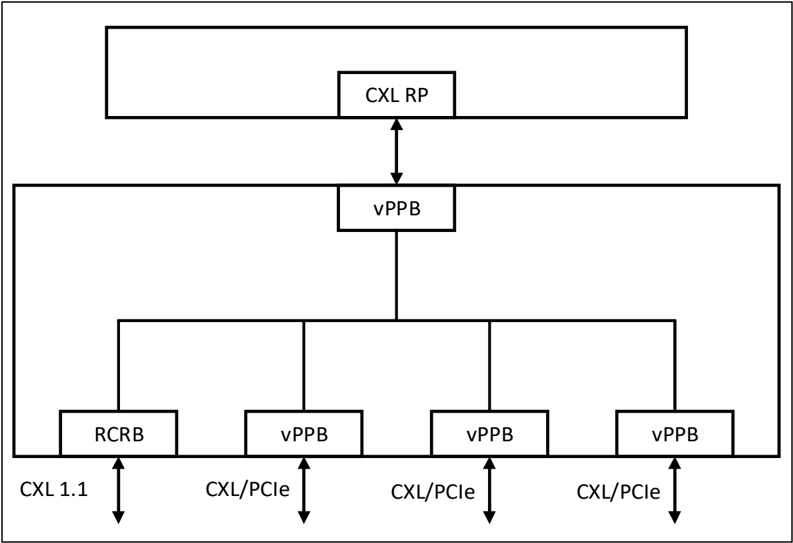

The CXL 2.0 Extensions DVSEC for Ports (see [Section 8.1.5](#815-cxl-20-extensions-dvsec-for-ports)) defines the alternate MMIO and Bus Range Decode windows for forwarding of requests to CXL 1.1 devices connected behind a Downstream Port.

#### 7.3.2 CXL.cache

Only one of the CXL SLD ports in VCS is allowed to be enabled to support Type 1 or Type 2 devices. Requests and Responses received on USP are routed to the associated DSP and vice-versa. Therefore, additional decode registers are not required for CXL.cache. CXL Cache is not supported over FM owned PPBs.

#### 7.3.3 CXL.mem

The HDM Decode DVSEC capability contains registers that define the Memory Address Decode Ranges for Memory. CXL.mem requests originate from the Host/RP and flow downstream to the Devices through the switch and responses originate from the Device and flow upstream to the RP.

##### 7.3.3.1 CXL.mem Request Decode

All CXl.mem Requests received by the USP target one of the Downstream PPB within the VCS. The address decode registers in VCS determine the downstream VCS PPB to route the request. The VCS PPB may be a VCS owned PPB or a FM owned PPB. See [Section 7.3.4](#734-fm-owned-ppb-cxl-handling) for additional routing rules.

##### 7.3.3.2 CXL.mem Response Decode

CXL.mem Responses received by the DSP target one and only one Upstream Port. For VCS owned PPB the responses are routed to the Upstream Port of that VCS. Responses received on a FM owned PPB go through additional decode rules to determine the VCSID to route the requests to. See [Section 7.3.4](#734-fm-owned-ppb-cxl-handling) for additional routing rules.

##### 7.3.3.3 QoS Message Aggregation

Please refer to [Section 3.3.2](#332-qos-telemetry-for-memory).

#### 7.3.4 FM Owned PPB CXL Handling

All PPBs are FM owned. A PPB can be connected to a port that is disconnected, linked up as CXL 1.1, CXL 2.0 SLD, or CXL 2.0 MLD. SLD components can be bound to a host or unbound. Unbound SLD components can be accessed by the FM using CXL.io transactions via the FM API. LDs within an MLD component can be bound to a host or unbound. Unbound LDs are FM owned and can be accessed through the switch using CXL.io transactions via the FM API.

For all CXL.io transactions driven by the FM API, the switch acts as a virtual Root Complex for PPBs and Endpoints. The switch is responsible for enumerating the functions associated with that port and sending/receiving CXL.io traffic.

### 7.4 CXL Switch PM

#### 7.4.1 CXL Switch ASPM L1

ASPM L1 for switch Ports is as defined in Chapter 10.

#### 7.4.2 CXL Switch PCI-PM and L2

A vPPB in a VCS operates the same as a PCIe vPPB for handling of PME messages.

#### 7.4.3 CXL Switch Message Management

CXL VDMs are of the type 'Local - Terminate at Receiver' type. When a switch is present in the hierarchy, the switch implements the message aggregation function and therefore all Host generate messages terminate at the switch. The switch aggregation function is responsible for re-generating these messages on the Downstream Port. All messages and responses generated by CXL device are aggregated and consolidated by the switch and consolidated messages or responses are generated by the Upstream Port of the switch.

The PM message credit exchanges occur between the Host and Switch Aggregation port, and separately between the Switch Aggregation Port and Device.

##### Table 82. CXL Switch Message Management

| Message Type         | Type             | Switch Message Aggregation and Consolidation Responsibility                                                                                                    |
|----------------------|------------------|----------------------------------------------------------------------------------------------------------------------------------------------------------------|
| PM Reset Messages    | Host Initiated   | Host generated requests terminate at Upstream Port, broadcast messages to all ports within VCS hierarchy                                                       |
| Sx Entry             | Host Initiated   | Host generated requests terminate at upstream port, broadcast messages to all ports within VCS hierarchy                                                       |
| GPF Phase 1 Req      | Host Initiated   | Host generated requests terminate at upstream port, broadcast messages to all ports within VCS hierarchy                                                       |
| GPF Phase 2 Req      | Host Initiated   | Host generated requests terminate at upstream port, broadcast messages to all ports within VCS hierarchy                                                       |
| PM Reset Acknowledge | Device Responses | Device generated responses terminate at Downstream Port within VCS hierarchy. Switch aggregates responses from all other connected ports within VCS hierarchy. |
| Sx Entry             | Device Responses | Device generated responses terminate at Downstream Port within VCS hierarchy. Switch aggregates responses from all other connected ports within VCS hierarchy. |
| GPF Phase 1 Response | Device Responses | Device generated responses terminate at Downstream Port within VCS hierarchy. Switch aggregates responses from all other connected ports within VCS hierarchy. |
| GPF Phase 2 Response | Device Responses | Device generated responses terminate at Downstream Port within VCS hierarchy. Switch aggregates responses from all other connected ports within VCS hierarchy. |
| PM Reset Acknowledge | Device Responses | Device generated responses terminate at Downstream Port within VCS hierarchy. Switch aggregates responses from all other connected ports within VCS hierarchy. |

### 7.5 CXL Switch RAS

#### Table 83. CXL Switch RAS

| Host Action                 | Description              | Switch Action for Non- Pooled Devices   | Switch Action for Pooled Devices                                                                                        |
|-----------------------------|--------------------------|-----------------------------------------|-------------------------------------------------------------------------------------------------------------------------|
| Switch boot                 | Power-on reset pin       | Assert PERST# Release PERST#            | Assert PERST# Release PERST#                                                                                            |
| Upstream PERST# assert      | VCS fundamental reset    | Send Hot Reset                          | Write to MLD DVSEC to trigger LD Hot Reset of the associated LD. <Note> Only the FMLD provides the MLD DVSEC capability |
| FM port reset               | Reset of an FM owned DSP | Send Hot Reset                          | Send Hot Reset                                                                                                          |
| USP received Hot Reset      | VCS fundamental reset    | Send Hot Reset                          | Write to MLD DVSEC to trigger LD Hot Reset of the associated LD                                                         |
| US vPPB Secondary Bus Reset | VCS US SBR               | Send Hot Reset                          | Write to MLD DVSEC to trigger LD Hot Reset of the associated LD                                                         |
| DS vPPB Secondary Bus Reset | VCS DS SBR               | Send Hot Reset                          | Write to MLD DVSEC to trigger LD Hot Reset of the associated LD                                                         |
| Host writes FLR             | Device FLR               | No switch involvement                   | No switch involvement                                                                                                   |
| Switch watchdog timeout     | Switch fatal error       | Equivalent to power-on reset            | Equivalent to power- on reset                                                                                           |

Because the MLD DVSEC only exists in the FMLD, the switch must use the FM LD-ID in the CXL.io configuration write transaction when triggering LD reset.

### 7.6 Fabric Manager Application Programming Interface

This section describes the Fabric Manager Application Programming Interface.

#### 7.6.1 CXL Fabric Management

CXL devices can be configured statically or dynamically via a Fabric Manager (FM), an external logical process that queries and configures the system's operational state using the FM commands defined in this specification. The FM is defined as the logical process that decides when reconfiguration is necessary and initiates the commands to perform configurations. It can take any form, including, but not limited to, software running on a host machine, embedded software running on a BMC, embedded firmware running on another CXL device or CXL switch, or a state machine running within the CXL device itself.

#### 7.6.2 Fabric Management Model

CXL devices are configured by FMs through the Fabric Manager Application Programming Interface (FM API).

##### Figure 123. Example of Fabric Management Model

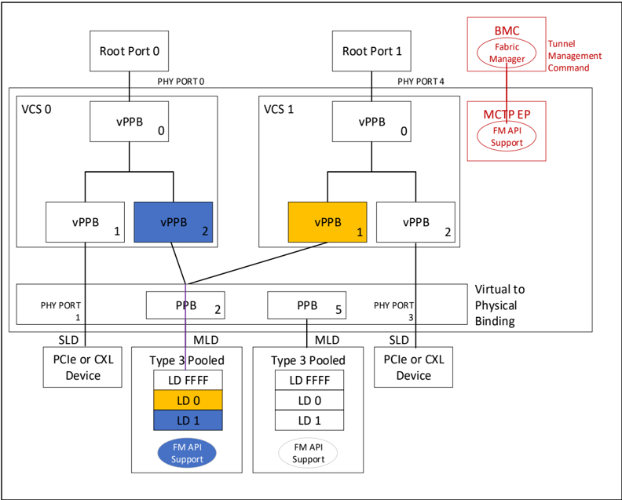

The FM API consists of request messages, response messages and event notification messages. FMs issue request messages and CXL devices issue response and event notification messages. MCTP may be used as the transport protocol.

MCTP messages may be sent over a variety of interfaces. The following list provides a number of examples, but should not be considered a complete list:

- An FM directly connected to a CXL device through any media interface that supports the MCTP transport protocol can issue FM commands directly to the device. This includes delivery over sideband buses such as SMBus as well as VDM delivery over a standard PCIe tree topology where the responder is mapped to a CXL attached device.
- An FM directly connected to a CXL switch may use the switch to tunnel FM commands to MLD components directly attached to the switch. In this case, the FM issues the 'Tunnel Management Command' command to the switch specifying the switch port to which the device is connected. Responses are returned to the FM by the switch. In addition to MCTP message delivery, the FM command set provides the FM with the ability to have the switch proxy config cycles and memory accesses to a Downstream Port on the FM's behalf.

- An FM may also be embedded within a CXL device. The communication interface between such a FW module and the device hardware is considered a vendor implementation detail and is not covered in this specification.

Support for multiple Management Ports and coordination of multiple active FMs falls outside the scope of this specification.

#### 7.6.3 FM Command Transport Protocol

FM API commands may be transported as MCTP Message as defined in CXL FM API over MCTP Binding Specification 1 .

##### Figure 124. FM API Message Format

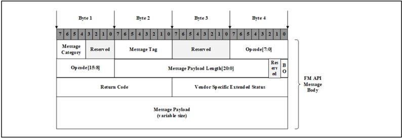

###### Table 84. FM API Message Format

| Bytes   | Description                                                                                                                                                                                                                                                                  |
|---------|------------------------------------------------------------------------------------------------------------------------------------------------------------------------------------------------------------------------------------------------------------------------------|
| 0       | Bits (3:0): Message Category: Type of FM API message: • 0h = Request • 1h = Response • 2h = Event Notification • All other encodings reserved Bits (7:4): Reserved                                                                                                           |
| 1       | Message Tag: Tag number assigned to request messages by the FM used to track response messages when multiple request messages are outstanding. Response messages shall use the tag number from the corresponding Request message. Must be 0 for Event Notification messages. |
| 2       | Reserved                                                                                                                                                                                                                                                                     |
| 4-3     | Opcode: As defined in [Table 205](#table-205-cxl-fm-api-command-opcodes) .                                                                                                                                                                                                                                            |
| 7-5     | Bits (20:0): Message Payload Length - As defined in [Table 205](#table-205-cxl-fm-api-command-opcodes). Bit (22:21): Reserved Bit(23): Background Operation: As defined in [Section 8.2.8.4.6](#82846-mailbox-status-register-mailbox-registers-capability-offset-10h). Must be 0 for Request messages and Event Notification Messages.                                                         |
| 9-8       | Return Code: As defined in [Table 150](#table-150-command-return-codes). Must be 0 for Request messages and Event Notification Messages                                                                              |
| 11-10     | Vendor Specific Extended Status: As defined in [Section 8.2.8.4.6](#82846-mailbox-status-register-mailbox-registers-capability-offset-10h). Must be 0 for Request messages and Event Notification Messages                                                  |
| Varies-12 | Message Payload: The length of this field is specified in the Message Payload Length field above. The format depends on Opcode and Message Category , as defined in [Section 7.6.7](#767-fabric-management-application-programming-interface) |

1. www.dmtf.org

#### 7.6.4 CXL Switch Management

Dynamic configuration of a switch by an FM is not required for basic switch functionality but is required to support MLDs or CXL fabric topologies.

##### 7.6.4.1 Initial Configuration

The non-volatile memory of the switch stores in a vendor-specific format all necessary configuration settings required to prepare the switch for initial operation. This includes:

- Port configuration, including direction (upstream or downstream), width, supported rates, etc.
- Virtual CXL Switch configuration, including number of vPPBs for each VCS, Initial port binding configuration, etc., and
- Management port access settings, including any vendor-defined permission settings for management.

##### 7.6.4.2 Dynamic Configuration

After initial configuration is complete and a Management Port on the switch is operational, an FM can send Management Commands to the switch.

An FM may perform the following dynamic management actions on a CXL switch:

- Query switch information and configuration details
- Bind or Unbind ports
- Register for or receive and handle event notifications from the switch (e.g., hot plug, surprise removal and failures)

When a switch port is connected to a nested PCIe switch and that port is bound to a vPPB, the management of that PCIe switch and its downstream device will be handled by the VCS's host, not the FM. Management by the FM of individual ports and EPs on a nested PCIe switch will be considered in future versions of the CXL specification.

##### 7.6.4.3 MLD Port Management

A switch with MLD Ports requires an FM to perform the following management activities:

- MLD discovery
- LD binding/unbinding
- Management Command Tunneling

#### 7.6.5 MLD Component Management

The FM can connect to an MLD over a direct connection or by tunneling its management commands through the management port of the CXL switch to which the device is connected. The FM can perform the following operations:

- Memory allocation and QoS Telemetry management
- Security (e.g., LD erasure after unbinding)
- Error handling

##### Figure 125. Example of MLD Management Requiring Tunneling

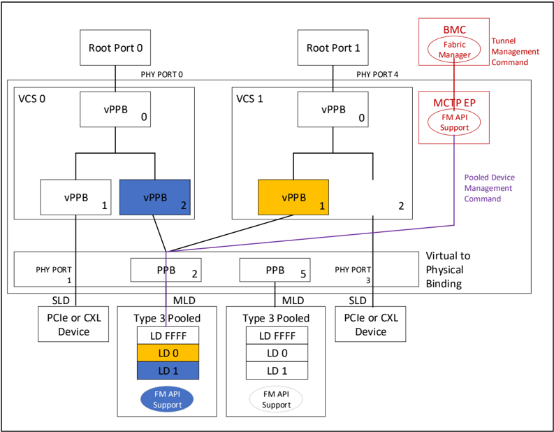

#### 7.6.6 Management Requirements for System Operations

This section presents examples of system use cases to highlight the role and responsibilities of the FM in system management. These use case discussions also serve to itemize the FM commands that CXL devices must support to facilitate each specific system behavior.

##### 7.6.6.1 Initial System Discovery

As the CXL system initializes, the FM can begin discovering all direct-attached CXL devices across all supported media interfaces. Devices supporting the FM API may be discovered using transport specific mechanisms such as the MCTP discovery process, as defined in the MCTP Base Specification.

FM issues Get Supported Logs, as defined in [Section 8.2.9.4.1](#82941-get-supported-logs-opcode-0400h), to determine which command opcodes are supported.

##### 7.6.6.2 CXL Switch Discovery

After a CXL switch is released from reset, it loads its initial configuration from nonvolatile memory. Ports configured as DS PPBs will be released from reset to link up. Upon detection of a switch, the FM will query its capacity, capabilities, and connected devices. The Physical Switch Command Set is required for all switches implementing FM API support. The Virtual Switch Command Set is required for all switches that support multiple host ports.

An example of an FM Switch discovery process is as follows:

1. FM issues Identify Switch Device to check switch port count, enabled port IDs, number of supported LDs, and enabled VCS IDs.
2. FM issues Get Physical Port State for each enabled port to check port configuration (US or DS), link state, and attached device type. This allows the FM to check for any port link-up issues and create an inventory of devices for binding. If any MLD components are discovered, the FM can begin MLD Port management activities.
3. If the switch supports multiple host ports, FM issues Get Virtual CXL Switch Info for each enabled VCS to check for all active vPPBs in the system and create a list of binding targets.

##### 7.6.6.3 MLD and Switch MLD Port Management

MLDs must be connected to a CXL switch to share their LDs among VCSs. If an MLD Device is discovered in the system, the FM will need to prepare it for binding. A switch must support the MLD Port Command Set in order to support the use of MLDs. All MLD components require support for the MLD Component Command Set.

1. FM issues management commands to the device's LD FFFFh using Tunnel Management Command .
2. FM can execute advanced or vendor-specific management activities, such as encryption or authentication, using the Send LD CXL.io Configuration Request and Send LD CXL.io Memory Request commands.

##### 7.6.6.4 Event Notifications

1. To facilitate some system operations, the FM requires event notifications so it can execute its role in the process in a timely manner (e.g., notifying hosts of an asserted Attention Button on an MLD during Managed Hot-Removal). If supported by the device, the FM can check the current event notification settings with the Get Event Interrupt Policy command and modify them with the Set Event Interrupt Policy command.
2. If supported by the device, the event logs can be read with the Get Event Records command to check for any error events experienced by the device that might impact normal operation.

##### 7.6.6.5 Binding Ports and LDs on a Switch

Once all devices, VCSs, and vPPBs have been discovered, the FM can begin binding ports and LDs to hosts as follows:

1. FM issues the Bind vPPB command specifying a physical port, VCS ID and vPPB index to bind the physical port to the vPPB. An LD-ID must also be specified if the physical port is connected to an MLD. The switch is permitted to initiate a Managed Hot Add if the host has already booted, as defined in [Section 9.9](#99-hot-plug).

2. U pon completion of the binding process, the switch notifies the FM by generating a Virtual CXL Switch Event Record .

##### 7.6.6.6 Unbinding Ports and LDs on a Switch

The FM can unbind devices or LDs from a VCS with the following steps :

1. FM issues the Unbind vPPB command specifying a VCS ID and vPPB index to unbind the physical port from the vPPB. The switch initiates a Managed HotRemove or Surprise Hot-Remove depending on the command options, as defined in the PCIe 5.0 Base Specification.
2. Upon completion of the unbinding process, the switch will generate a Virtual CXL Switch Event Record .

##### 7.6.6.7 Hot-Add and Managed Hot-Removal of Devices

When a device is Hot-Added to an unbound port on a switch, the FM receives a notification and is responsible for binding as described in the steps below:

1. The switch notifies the FM by generating Physical Switch Event Records as the Presence Detect sideband signal is asserted and the port links up.
2. FM issues the Get Physical Port State command for the physical port that has linked up to discover the connected device type. The FM can now bind the physical port to a vPPB. If it's an MLD Device, then the FM can proceed with MLD Port management activities, otherwise the device is ready for binding.

When a device is Hot-Removed from an unbound port on a switch, the FM receives a notification. The switch notifies the FM by generating Physical Switch Event Records as the Presence Detect sideband is deasserted and the associated port links down.

1. The switch notifies the FM by generating Physical Switch Event Records as the Presence Detect sideband is deasserted and the associated port links down.

When an SLD or PCIe device is Hot-Added to a bound port, the FM can be notified but is not involved. When a Surprise or Managed Hot-Removal of an SLD or PCIe device takes place on a bound port, the FM can be notified but is not involved.

A bound port will not advertise support for MLDs during negotiation, so MLD components will link up as an SLD. Refer to the specification for MLD components for additional details on link up.

The FM manages managed hot-removal of MLDs as follows:

1. When the Attention Button sideband is asserted on an MLD port, the Attention state bit is updated in the corresponding PPB and vPPB CSRs and the switch notifies the FM and hosts with LDs bound from that MLD. The hosts are notified with the MSI/ MSI-X interrupts assigned to affected vPPB and a Virtual CXL Switch Event Record is generated.
2. As defined in the PCIe specification, hosts will read the Attention State bit in their vPPB's CSR and prepare for removal of the LD. When a host is ready for the LD to be removed, it will set the Attention LED bit in the associated vPPB's CSR. The switch records these CSR updates by generating Virtual CXL Switch Event Records . The FM unbinds each assigned LD with the Unbind vPPB command as it receives notifications for each host.
3. When all host handshakes are complete, the MLD is ready for removal. The FM uses the Send PPB CXL.io Configuration Request command to set the Attention LED bit in the MLD port PPB to indicate that the MLD can be physically removed. The timeout value for the host handshakes to complete is implementation specific. There is no requirement for the FM to force the unbind operation, but it can do so using the 'Simulate Surprise Hot-Remove' unbinding option in the Unbind vPPB command.

##### 7.6.6.8 Surprise Removal of Devices

There are two kinds of surprise removals: physical removal of a device, and surprise link down. The key difference between the two is the state of the presence pin, which will be deasserted after a physical removal but will remain asserted after a surprise link down. The switch notifies the FM of a surprise removal by generating Virtual CXL Switch Event Records for the change in link status and Presence Detect, as applicable.

Three cases of Surprise Removal are described below:

1. When a Surprise Removal of a device takes place on an unbound port, the FM must be notified.
2. When a Surprise Removal of an SLD or PCIe device takes place on a bound port, the FM is permitted to be notified but must not be involved in any error handling operations.
3. When a Surprise Removal of an MLD component takes place, the FM must be notified. The switch will automatically unbind any existing LD bindings. The FM must perform error handling and port management activities, the details of which are considered implementation specific .

#### 7.6.7 Fabric Management Application Programming Interface

The FM manages all devices in a CXL system via the sets of commands defined in the FM API. This specification defines the minimum command set requirements for each device type.

##### Table 85. Common FM API Message Header

| Command Set Name                                   | Switch FM API Requirement                          | MLD FM API Requirement                             |
|----------------------------------------------------|----------------------------------------------------|----------------------------------------------------|
| Events                                             | O                                                  | O                                                  |
| Timestamp                                          | O                                                  | O                                                  |
| Switch Event Notifications                         | O                                                  | P                                                  |
| Physical Switch                                    | M                                                  | P                                                  |
| Virtual Switch                                     | O                                                  | P                                                  |
| MLD Port                                           | O                                                  | P                                                  |
| MLD component                                      | P                                                  | M                                                  |
| NOTE: *M = Mandatory, O = Optional, P = Prohibited | NOTE: *M = Mandatory, O = Optional, P = Prohibited | NOTE: *M = Mandatory, O = Optional, P = Prohibited |

Note: CXL switches and MLDs require FM API support to facilitate the advanced system capabilities outlined in [Section 7.6.6](#766-management-requirements-for-system-operations), 'Management Requirements for System Operations'. FM API is optional for all other CXL device types.

Command opcodes are found in [Table 205](#table-205-cxl-fm-api-command-opcodes). The following subsections define the commands grouped in each command set. Within each set commands are marked as mandatory (M) or optional (O). If a set is supported, the required commands within that set must be implemented, but only if that set is supported by the device. For example, the Get Virtual CXL Switch Information command is required in the Virtual

Switch Command Set, but that set is optional for switches. That means a switch does not need to support the Get Virtual CXL Switch Information command if it does not support the Virtual Switch Command Set.

All commands have been defined as stand-alone operations; there are no explicit dependencies between commands, so optional commands can be implemented or not on a per-command basis. Requirements for the implementation of commands are driven instead by desired system functionality. [Section 7.6.6](#766-management-requirements-for-system-operations), 'Management Requirements for System Operations' identifies the minimum command sets and commands required to implement defined system capabilities.

##### 7.6.7.1 Switch Event Notifications Command Set

This optional command set is used by devices to send notifications to the FM. The following commands are defined:

###### Table 86. Switch Event Notifications Command Set Requirements

| Command Name       | Requirement   |
|--------------------|---------------|
| Event Notification | O             |

*O = Optional

###### 7.6.7.1.1 Event Notification (Opcode 5000h)

This command is used by a CXL device to send notifications to the FM. It is only sent by CXL devices. Any commands of this type received by CXL devices should be silently discarded. There is no response for this command, it is a notification to the FM that there are either new events to be read from the Event Records or that the FM must initiate other management activities. The FM acknowledges a notification by clearing it with the Manage Events command. A single notification is sent every 10 ms after the last notification was sent until the FM has cleared all event records.

Possible Command Return Codes:

- Success
- Invalid Parameter
- Internal Error
- Retry Required

Command Effects:

- None

### Table 87. Event Notification Payload

| Bytes   | Description                                                                                                                                                                                     |
|---------|-------------------------------------------------------------------------------------------------------------------------------------------------------------------------------------------------|
| 0       | Event Log: The specific device event log generating the notification 00h = Informational Event Log 01h = Warning Event Log 02h = Failure Event Log 03h = Fatal Event Log Other values reserved. |
| 7-1     | Reserved                                                                                                                                                                                        |
| 131-8   | Event Record                                                                                                                                                                                    |

###### 7.6.7.1.2 Physical Switch Command Set

This command set is only supported by and must be supported by CXL switches with FM API support. The following commands are defined:

###### Table 88. Physical Switch Command Set Requirements

| Command Set Name                      | Requirement   |
|---------------------------------------|---------------|
| Identify Switch Device                | M             |
| Get Physical Port State               | M             |
| Physical Port Control                 | O             |
| Send PPB CXL.io Configuration Request | O             |

###### 7.6.7.1.3 Identify Switch Device (Opcode 5100h)

This command retrieves information about the capabilities and capacity of a CXL switch.

Possible Command Return Codes:

- Success
- Internal Error
- Retry Required

Command Effects:

- None

### Table 89. Identify Switch Device Response Payload

| Bytes   | Description                                                                                                                                                                                                                                                                                                                                                             |
|---------|-------------------------------------------------------------------------------------------------------------------------------------------------------------------------------------------------------------------------------------------------------------------------------------------------------------------------------------------------------------------------|
| 0       | Device Management Version: Version of FM API command set supported by device. Currently 1.                                                                                                                                                                                                                                                                              |
| 1       | Reserved                                                                                                                                                                                                                                                                                                                                                                |
| 3-2     | PCIe Vendor ID: As defined in PCIe 5.0 Base Specification                                                                                                                                                                                                                                                                                                               |
| 5-4     | PCIe System ID: As defined in PCIe 5.0 Base Specification                                                                                                                                                                                                                                                                                                               |
| 7-6     | PCIe Subsystem Vendor ID: As defined in PCIe 5.0 Base Specification                                                                                                                                                                                                                                                                                                     |
| 9-8     | PCIe Subsystem ID: As defined in PCIe 5.0 Base Specification                                                                                                                                                                                                                                                                                                            |
| 11-10   | Reserved                                                                                                                                                                                                                                                                                                                                                                |
| 19-12   | Device Serial Number: Refer to definition of Device Serial Number Extended Capability in PCIe 5.0 Base Specification                                                                                                                                                                                                                                                    |
| 20      | Ingress Port ID: Ingress management port index of the received request message. For CXL/PCIe ports, this corresponds to the physical port number. For non-CXL/PCIe, this corresponds to a vendor-specific index of the buses supported by the device, starting at 0. For example, a request received on the second of 2 SMBuses supported by a device would return a 1. |
| 21      | Reserved                                                                                                                                                                                                                                                                                                                                                                |
| 22      | Number of Physical Ports: Total number of physical ports in the CXL switch, including inactive/disabled ports                                                                                                                                                                                                                                                           |
| 23      | Number of VCSs: Maximum number of virtual CXL switches supported by the CXL switch                                                                                                         |
| 55-24   | Active Port Bitmask: Bitmask defining whether a physical port is enabled (1) or disabled (0). Each bit corresponds 1:1 with a port, with the least significant bit corresponding to port 0 |
| 87-56   | Active VCS Bitmask: Bitmask defining whether a VCS is enabled (1) or disabled (0). Each bit corresponds 1:1 with a VCS ID, with the least significant bit corresponding to VCS 0           |
| 89-88   | Total Number of VPPBs: Maximum number of virtual PPBs supported by the CXL switch                                                                                                          |
| 91-90   | Number of Active VPPBs: Total number of VPPBs in use across all VCSs                                                                                                                       |
| 92      | Number of HDM Decoders: Number of HDM decoders available per USP                                                                                                                           |

###### 7.6.7.1.4 Get Physical Port State (Opcode 5101h)

This command retrieves the physical port information.

Possible Command Return Codes:

- Success
- Invalid Parameter
- Internal Error
- Retry Required

Command Effects:

- None

### Table 90. Get Physical Port State Request Payload

| Bytes    | Description                                                                |
|----------|----------------------------------------------------------------------------|
| 0        | Number of Ports: Number of ports requested.                                |
| Varies-1 | Port ID List: 1 byte ID of requested port, repeated Number of Ports times. |

### Table 91. Get Physical Port State Response Payload

| Bytes    | Description                                                                                           |
|----------|-------------------------------------------------------------------------------------------------------|
| 0        | Number of Ports: Number of port information blocks returned.                                          |
| 3-1      | Reserved                                                                                              |
| Varies-4 | Port Information List: Port information block as defined in [Table 92](#table-92-get-physical-port-state-port-information-block-format), repeated Number of Ports times. |

### Table 92. Get Physical Port State Port Information Block Format

|   Bytes | Description                                                                                                                                                                                                                                                         |
|---------|---------------------------------------------------------------------------------------------------------------------------------------------------------------------------------------------------------------------------------------------------------------------|
|       0 | Port ID                                                                                                                                                                                                                                                             |
|       1 | Bits [3:0]: Current Port Configuration State : 0 - Disabled 1 - Bind in progress 2 - Unbind in progress 3 - DSP port 4 - USP port 5 - Reserved (Fabric Link) 6 - 0xE - Reserved for future CXL use 0xF - Invalid Port_ID; all subsequent field values are undefined |
|       2 | Bits[3:0] Connected device CXL version: 0 - Connection not CXL or disconnected 1 - CXL 1.1 2 - CXL 2.0 3 - 0xF - Reserved for future CXL use                                                                                                                        |
|       3 | Reserved                                                                                                                                                                                                                                                            |
|       4 | Connected device type : 0 - No device detected 1 - PCIe Device 2 - CXL type 1 device 3 - CXL type 2 device 4 - CXL type 3 device 5 - CXL type 3 pooled device 6 - Reserved (CXL switch) 7 - 0xF - Reserved for future CXL use                                       |
|       5 | Connected CXL Version: Bitmask defining which CXL versions are supported (1) or not (0) by this port: Bit 0 - CXL 1.1 Bit 1 - CXL 2.0 All other bits reserved for future CXL use Undefined if Connected CXL Version is 0                                            |
|       6 | Bits[5:0]: Maximum Link Width: Value encoding matches 'Maximum Link Width' field in PCIe Link Capabilities Register in the PCI Express Capability structure. Bits[7:6]: Reserved                                                                                    |
|       7 | Bits[5:0]: Negotiated Link Width: Value encoding matches 'Negotiated Link Width' field in PCIe Link Capabilities Register in the PCI Express Capability structure. Bits[7:6]: Reserved                                                                              |
|       8 | Bits[5:0]: Supported Link Speeds Vector: Value encoding matches 'Supported Link Speeds Vector' field in PCIe Link Capabilities 2 Register in the PCI Express Capability structure. Bits[7:6]: Reserved                                                              |
|       9 | Bits[5:0]: Max Link Speed: Value encoding matches 'Max Link Speed' field in PCIe Link Capabilities Register in the PCI Express Capability structure. Bits[7:6]: Reserved                                                                                            |
| 10      | Bits[5:0]: Current Link Speed: Value encoding matches 'Current Link Speed' field in PCIe Link Status Register in the PCI Express Capability structure. Bits[7:6]: Reserved                                                                                |
| 11      | LTSSM State : Current link LTSSM Major state: 0 - Detect 1 - Polling 2 - Configuration 3 - Recovery 4 - L0 5 - L0s 6 - L1 7 - L2 8 - Disabled 9 - Loopback 10 - Hot Reset                                                                                 |
| 12      | First negotiated lane number                                                                                                                                                                                                                              |
| 14-13   | Link state flags : Bit [0] - Lane reversal state: standard lane ordering (0) or reversed ordering (1) Bit [1] - Port PCIe Reset state (PERST#) Bit [2] - Port Presence pin state (PRSNT#) Bit [3] - Power Control state (PWR_CTRL) Bits [15:4] - Reserved |
| 15      | Supported LD Count : Number of additional LDs supported by this port. All ports must support at least one LD. This field defines how many additional LDs can be supported beyond that value.                                                              |

###### 7.6.7.1.5 Physical Port Control (Opcode 5102h)

This command is used by the FM to control unbound ports and MLD ports, including issuing resets and controlling sidebands.

Possible Command Return Codes:

- Success
- Invalid Parameter
- Unsupported
- Internal Error
- Retry Required

Command Effects:

- None

### Table 93. Get Physical Port State Request Payload

|   Bytes | Description                                                                                                                              |
|---------|------------------------------------------------------------------------------------------------------------------------------------------|
|       0 | PPB ID: Physical PPB ID, which corresponds 1:1 to associated physical port number                                                        |
|       1 | Port Opcode: Code defining which operation to perform: 0x00 - Assert PERST 0x01 - Deassert PERST 0x02 - Reset PPB 0x03 - 0xFF - Reserved |

###### 7.6.7.1.6 Send PPB CXL.io Configuration Request (Opcode 5103h)

This command sends CXL.io Config requests to the specified physical port's PPB. This command is only processed for unbound ports and MLD ports.

Possible Command Return Codes:

- Success
- Invalid Parameter
- Internal Error
- Retry Required

Command Effects:

- None

### Table 94. Send PPB CXL.io Configuration Request Payload

| Bytes   | Description                                                                                                                                                                                                                                                                                                     |
|---------|-----------------------------------------------------------------------------------------------------------------------------------------------------------------------------------------------------------------------------------------------------------------------------------------------------------------|
| 0       | PPB ID: Target PPB's physical port.                                                                                                                                                                                                                                                                             |
| 3-1     | Bits[7:0]: Register Number: as defined in PCIe 5.0 Base Specification Bits[11:8]: Extended Register Number : as defined in PCIe 5.0 Base Specification Bits[15:12]: First Dword Byte Enable: as defined in PCIe 5.0 Base Specification Bits[22:16]: Reserved Bits[23]: Transaction Type : Read (0) or Write (1) |
| 7-4     | Transaction Data: Write data. Only valid for write transactions                                                                                                                                                                                                                                                 |

### Table 95. Send PPB CXL.io Configuration Response Payload

| Bytes   | Description                                              |
|---------|----------------------------------------------------------|
| 3-0     | Return Data: Read data. Only valid for read transactions |

##### 7.6.7.2 Virtual Switch Command Set

This command set is only supported by CXL switch. It is required for switches that support more than one VCS. The following commands are defined:

###### Table 96. Virtual Switch Command Set Requirements

| Command Set Name            | Requirement   |
|-----------------------------|---------------|
| Get Virtual CXL Switch Info | M             |
| Bind VPPB                   | O             |
| Unbind vPPB                 | O             |
| Generate AER Event          | O             |

###### 7.6.7.2.1 Get Virtual CXL Switch Info (opcode 5200h)

This command retrieves information on a specified number of VCSs in the switch. Due to the possibility of variable numbers of vPPBs in each VCS, the returned array has variably sized elements.

Possible Command Return Codes:

- Success
- Invalid Parameter
- Internal Error
- Retry Required

Command Effects:

- None

### Table 97. Get Virtual CXL Switch Info Request Payload

| Bytes     | Description                                                             |
|-----------|-------------------------------------------------------------------------|
| 0         | Number of VCSs: Number of VCSs requested.                               |
| Varies -1 | VCS ID List: 1 byte ID of requested VCS, repeated Number of VCSs times. |

### Table 98. Get Virtual CXL Switch Info Response Payload

| Bytes     | Description                                                                                        |
|-----------|----------------------------------------------------------------------------------------------------|
| 0         | Number of VCSs: Number of VCS information blocks returned.                                         |
| 3-1       | Reserved                                                                                           |
| Varies -4 | VCS Information List: VCS information block as defined in [Table 99](#table-99-get-virtual-cxl-switch-info-vcs-information-block-format), repeated Number of VCSs times. |

### Table 99. Get Virtual CXL Switch Info VCS Information Block Format

| Bytes                          | Description                                                                                                                                                                              |
|--------------------------------|------------------------------------------------------------------------------------------------------------------------------------------------------------------------------------------|
| 0                              | Virtual CXL Switch ID                                                                                                                                                                    |
| 1                              | VCS State: Current state of the VCS: 0 - Disabled 1 - Enabled 2 to 0xFE - Reserved 0xFF - Invalid VCS_ID; all subsequent field values are invalid                                        |
| 2                              | USP ID: Physical port ID of the CXL switch for the Upstream Port                                                                                                                         |
| 3                              | Number of vPPBs                                                                                                                                                                          |
| 4                              | PPB[0] Binding Status: 0 - Unbound 1 - Bind or unbind in progress 2 - Bound Physical Port 3 - Bound LD                                                                                   |
| 5                              | PPB[0] Bound Port ID : Physical port number of bound port                                                                                                                                |
| 6                              | PPB[0] Bound LD ID : ID of LD bound to port from MLD on associated physical port. Only valid if VPPB[0]_Status is 3, 0xFF otherwise.                                                     |
| 7                              | Reserved                                                                                                                                                                                 |
| …                              | …                                                                                                                                                                                        |
| 4 + ( Number of vPPBs - 1) * 3 | PPB[Number of vPPBs - 1] Binding Status: 0 - Unbound 1 - Bind or unbind in progress 2 - Bound Physical Port 3 - Bound LD                                                                 |
| 5 + ( Number of vPPBs - 1) * 3 | PPB[Number of vPPBs - 1] Bound Port ID : Physical port number of bound port                                                                                                              |
| 6 + ( Number of vPPBs - 1) * 3 | PPB[Number of vPPBs - 1] Bound LD ID : ID of LD bound to port from MLD on associated physical port. Only valid if PPB[Number of vPPBs - 1] Binding Status is 'Bound LD', 0xFF otherwise. |
| 7 + ( Number of vPPBs - 1) * 3 | Reserved                                                                                                                                                                                 |

###### 7.6.7.2.2 Bind vPPB (Opcode 5201h)

This command performs a binding operation on the specified vPPB. If the bind target is a physical port connected to a Type 1, Type 2, Type 3, or PCIe device or a physical port whose link is down, the specified physical port of the CXL switch is fully bound to the vPPB. If the bind target is a physical port connected to an MLD, then a corresponding LD-ID must also be specified.

All binding operations are executed as background commands. The switch notifies the FM of binding completion through the generation of event records, as defined in [Section 7.6.6](#766-management-requirements-for-system-operations), 'Management Requirements for System Operations'.

Possible Command Return Codes:

- Background Command Started
- Invalid Parameter

- Unsupported
- Internal Error
- Retry Required
- Busy

Command Effects:

- Background Operation

### Table 100. Bind vPPB Request Payload

| Bytes   | Description                                                                   |
|---------|-------------------------------------------------------------------------------|
| 0       | Virtual CXL Switch ID                                                         |
| 1       | vPPB ID : Index of the vPPB within the VCS specified in VCS_ID                |
| 2       | Physical port ID                                                              |
| 3       | Reserved                                                                      |
| 5-4     | LD ID: LD-ID if target port is an MLD port. Must be FFFFh for other EP types. |

##### 7.6.7.3 Unbind vPPB (Opcode 5202h)

This command unbinds the physical port or LD from the virtual hierarchy PPB. All unbinding operations are executed as background commands. The switch notifies the FM of unbinding completion through the generation of event records, as defined in [Section 7.6.6](#766-management-requirements-for-system-operations), 'Management Requirements for System Operations'.

Possible Command Return Codes:

- Background Command Started
- Invalid Parameter
- Unsupported
- Internal Error
- Retry Required
- Busy

Command Effects:

- Background Operation

### Table 101. Unbind vPPB Request Payload

|   Bytes | Description                                                                                                                                                 |
|---------|-------------------------------------------------------------------------------------------------------------------------------------------------------------|
|       0 | Virtual CXL Switch ID                                                                                                                                       |
|       1 | vPPB ID : Index of the vPPB within the VCS specified in VCS_ID                                                                                              |
|       2 | Bits[3:0]: Unbind Option: 0 - Wait for port link down before unbinding 1 - Simulate Managed Hot-Remove 2 - Simulate Surprise Hot-Remove Bits[7:4]: Reserved |

###### 7.6.7.3.1 Generate AER Event (Opcode 5203h)

This command generates an AER event on a specified VCS's PPB (US PPB or DS vPPB). The switch must respect the Host's AER mask settings.

Possible Command Return Codes:

- Success
- Invalid Parameter
- Unsupported
- Internal Error
- Retry Required

Command Effects:

- None

### Table 102. Generate AER Event Request Payload

| Bytes   | Description                                                                            |
|---------|----------------------------------------------------------------------------------------|
| 0       | Virtual CXL Switch ID                                                                  |
| 1       | vPPB ID : Index of the vPPB within the VCS specified in VCS_ID                         |
| 3-2     | Reserved                                                                               |
| 7-4     | AER Error: AER error type, as defined in the PCIe Specification                        |
| 39-8    | AER Header: TLP Header to place in AER registers, as defined in the PCIe specification |

##### 7.6.7.4 MLD Port Command Set

This command set is only supported by CXL switches. It is required to support MLDs in a CXL system. The following commands are defined:

###### Table 103. MLD Port Command Set Requirements

| Command Set Name                     | Requirement   |
|--------------------------------------|---------------|
| Tunnel Management Command            | M             |
| Send LD CXL.io Configuration Request | M             |
| Send LD CXL.io Memory Request        | M             |

###### 7.6.7.4.1 Tunnel Management Command (Opcode 5300h)

This command tunnels the provided FM Command encapsulated as an MCTP request to LD 0xFFFF of the MLD on the specified port. Response size varies based on the tunneled FM command's definition. Tunneled FM commands sent to any port other than an MLD port will be discarded and this command's response will indicate a failure.

Possible Command Return Codes:

- Success
- Invalid Parameter
- Unsupported
- Internal Error
- Retry Required

Command Effects:

- None

### Table 104. Tunnel Management Command Request Payload

| Bytes    | Description                                               |
|----------|-----------------------------------------------------------|
| 0        | Port ID: Egress port ID                                   |
| 1        | Reserved                                                  |
| 3-2      | Command Size: Number of valid bytes in Management Command |
| Varies-4 | Management Command: Raw MCTP Message Body to transmit     |

### Table 105. Tunnel Management Command Response Payload

| Bytes    | Description                                                  |
|----------|--------------------------------------------------------------|
| 1-0      | Response Length: Number of valid bytes in Response Message . |
| 3-2      | Reserved                                                     |
| Varies-4 | Response Message: Response message sent by MLD               |

###### 7.6.7.4.2 Send LD CXL.io Configuration Request (Opcode 5301h)

This command allows the FM to read or write the CXL.io Config Space of an unbound LD or FMLD. The switch will convert the request into a CfgRd/CfgWr TLPs to the target device.

Possible Command Return Codes:

- Success
- Invalid Parameter
- Unsupported
- Internal Error
- Retry Required

Command Effects:

- None

### Table 106. Send LD CXL.io Configuration Request Payload

| Bytes   | Description                                                                                                                                                                                                                                                                                                     |
|---------|-----------------------------------------------------------------------------------------------------------------------------------------------------------------------------------------------------------------------------------------------------------------------------------------------------------------|
| 0       | PPB ID: Target PPB's physical port.                                                                                                                                                                                                                                                                             |
| 3-1     | Bits[7:0]: Register Number: as defined in PCIe 5.0 Base Specification Bits[11:8]: Extended Register Number : as defined in PCIe 5.0 Base Specification Bits[15:12]: First Dword Byte Enable: as defined in PCIe 5.0 Base Specification Bits[22:16]: Reserved Bits[23]: Transaction Type : Read (0) or Write (1) |
| 5-4     | LD ID : Target LD ID                                                                                                                                                                                                                                                                                            |
| 7-6     | Reserved                                                                                                                                                                                                                                                                                                        |
| 11-8    | Transaction Data: Write data. Only valid for write transactions                                                                                                                                                                                                                                                 |

### Table 107. Send LD CXL.io Configuration Response Payload

| Bytes   | Description                                              |
|---------|----------------------------------------------------------|
| 3-0     | Return Data: Read data. Only valid for read transactions |

###### 7.6.7.4.3 Send LD CXL.io Memory Request (Opcode 5302h)

This command allows the FM to batch read or write the CXL.io Mem Space of an unbound LD or FMLD The switch will convert the request into MemRd/MemWr TLPs to the target device.

Possible Command Return Codes:

- Success
- Invalid Parameter
- Unsupported
- Internal Error
- Retry Required

Command Effects:

- None

### Table 108. Send LD CXL.io Memory Request Payload

| Bytes     | Description                                                                                                                                                                                                                                                  |
|-----------|--------------------------------------------------------------------------------------------------------------------------------------------------------------------------------------------------------------------------------------------------------------|
| 0         | Port ID: Target MLD port.                                                                                                                                                                                                                                    |
| 3-1       | Bits[11:0]: Reserved Bits[15:12]: First Dword Byte Enable: as defined in PCIe 5.0 Base Specification Bits[19:16]: Last Dword Byte Enable: as defined in PCIe 5.0 Base Specification Bits[22:20]: Reserved Bits[23]: Transaction Type : Read (0) or Write (1) |
| 5-4       | LD ID : Target LD ID                                                                                                                                                                                                                                         |
| 7-6       | Transaction Length: Transaction length in bytes, up to a maximum of 4 kB (0x1000)                                                                                                                                                                            |
| 15-8      | Transaction Offset: Offset into target device's Mem Space                                                                                                                                                                                                    |
| Varies-16 | Transaction Data: Write data. Only valid for write transactions                                                                                                                                                                                              |

### Table 109. Send LD CXL.io Memory Request Response Payload

| Bytes    | Description                                              |
|----------|----------------------------------------------------------|
| 1-0      | Return Size: Number of successfully transferred bytes.   |
| 3-2      | Reserved                                                 |
| Varies-4 | Return Data: Read data. Only valid for read transactions |

##### 7.6.7.5 MLD Component Command Set

This command set is only supported by and must be supported by MLD components implementing FM API support. These commands are processed by MLDs. When an FM is connected to a CXL switch that supports the FM API and does not have a direct connection to an MLD, these commands are passed to the MLD using the Tunnel Management Command . The following commands are defined:

###### Table 110. MLD Component Command Set Requirements

| Command Set Name     | Requirement   |
|----------------------|---------------|
| Get LD Info          | M             |
| Get LD Allocations   | M             |
| Set LD Allocations   | O             |
| Get QoS Control      | M             |
| Set QoS Control      | M             |
| Get QoS Status       | O             |
| Get QoS Allocated BW | M             |
| Set QoS Allocated BW | M             |
| Get QoS BW Limit     | M             |
| Set QoS BW Limit     | M             |

###### 7.6.7.5.1 Get LD Info (Opcode 5400h)

This command retrieves the configurations of the MLD.

Possible Command Return Codes:

- Success
- Invalid Parameter
- Unsupported
- Internal Error
- Retry Required

Command Effects:

- None

### Table 111. Get LD Info Response Payload

| Bytes   | Description                                                                                                                                                                                                                                                                                                                                                                                                                                 |
|---------|---------------------------------------------------------------------------------------------------------------------------------------------------------------------------------------------------------------------------------------------------------------------------------------------------------------------------------------------------------------------------------------------------------------------------------------------|
| 7-0     | Memory Size: Total device memory capacity                                                                                                                                                                                                                                                                                                                                                                                                   |
| 9-8     | LD Count: Number of logical devices supported                                                                                                                                                                                                                                                                                                                                                                                               |
| 10      | QoS Telemetry Capability: Optional QoS Telemetry for memory MLD capabilities for management by a FM. See [Section 3.3.2](#332-qos-telemetry-for-memory). Bit(0) Egress Port Congestion Supported: When set, the associated feature is supported and the Get QoS Status command must be implemented. See [Section 3.3.2.3.4](#33234-egress-port-backpressure) Bit(1) Temporary Throughput Reduction Supported: When set, the associated feature is supported. See [Section 3.3.2.3.5](#33235-temporary-throughput-reduction) All other bits are reserved. |

###### 7.6.7.5.2 Get LD Allocations (Opcode 5401h)

This command gets the memory allocations of the MLD.

Possible Command Return Codes:

- Success
- Invalid Parameter
- Unsupported
- Internal Error
- Retry Required

Command Effects:

- None

### Table 112. Get LD Allocations Response Payload

| Bytes    | Description                                                                                                                                                     |
|----------|-----------------------------------------------------------------------------------------------------------------------------------------------------------------|
| 0        | Number of LDs: Number of LD information blocks returned.                                                                                                        |
| 1        | Memory Granularity : - This field specifies the granularity of the memory sizes configured for each LD: 0h - 256 MB 1h - 512 MB 2h - 1 GB All others - Reserved |
| 3-2      | Reserved                                                                                                                                                        |
| Varies-4 | LD Allocation List: LD Allocation blocks for each LD, as defined in [Table 113](#table-113-ld-allocations-list-format), repeated Number of LDs times.                                                    |

### Table 113. LD Allocations List Format

| Bytes   | Description                                                                                                                                                      |
|---------|------------------------------------------------------------------------------------------------------------------------------------------------------------------|
| 7-0     | Range 1 Allocation Multiplier: Memory allocation range 1 for LD. This value is multiplied with Memory Granularity to calculate memory allocation range in bytes. |
| 15-8    | Range 2 Allocation Multiplier: Memory allocation range 2 for LD. This value is multiplied with Memory Granularity to calculate memory allocation range in bytes. |

###### 7.6.7.5.3 Set LD Allocations (Opcode 5402h)

This command sets the memory allocation for each LD. This command will fail if the device fails to allocate any of the allocations defined in the request. The allocations provided in the response reflect the state of the LD allocations after the command is processed which allows the FM to check for partial success.

Possible Command Return Codes:

- Success
- Invalid Parameter
- Unsupported
- Internal Error
- Retry Required

Command Effects:

- Configuration Change after Cold Reset
- Immediate Configuration Change
- Immediate Data Change

### Table 114. Set LD Allocations Request Payload

| Bytes    | Description                                                                                                  |
|----------|--------------------------------------------------------------------------------------------------------------|
| 0        | Number of LDs: Number of LDs to configure.                                                                   |
| 3-1      | Reserved                                                                                                     |
| Varies-4 | LD Allocation List: LD Allocation blocks for each LD, as defined in [Table 113](#table-113-ld-allocations-list-format), repeated Number of LDs times. |

### Table 115. Set LD Allocations Response Payload

| Bytes    | Description                                                                                                          |
|----------|----------------------------------------------------------------------------------------------------------------------|
| 0        | Number of LDs: Number of LDs configured.                                                                             |
| 3-1      | Reserved                                                                                                             |
| Varies-4 | LD Allocation List: Updated LD Allocation blocks for each LD, as defined in [Table 113](#table-113-ld-allocations-list-format), repeated Number of LDs times. |

###### 7.6.7.5.4 Get QoS Control (Opcode 5403h)

This command gets the MLD's QoS control parameters.

Possible Command Return Codes:

- Success
- Internal Error
- Retry Required
- Invalid Payload Length

Command Effects:

- None

### Table 116. Payload for Get QoS Control Response, Set QoS Control Request, and Set QoS Control Response

| Bytes   | Description                                                                                                                                                                                                                                               |
|---------|-----------------------------------------------------------------------------------------------------------------------------------------------------------------------------------------------------------------------------------------------------------|
| 0       | QoS Telemetry Control : Default is 00h Bit(0): Egress Port Congestion Enable : See [Section 3.3.2.3.4](#33234-egress-port-backpressure) Bit(1): Temporary Throughput Reduction Enable : See [Section 3.3.2.3.5](#33235-temporary-throughput-reduction) All other bits are reserved                                                    |
| 1       | Egress Moderate Percentage: Threshold in percent for Egress Port Congestion mechanism to indicate moderate congestion. Valid range is 1-100. Default is 10.                                                                                               |
| 2       | Egress Severe Percentage : Threshold in percent for Egress Port Congestion mechanism to indicate severe congestion. Valid range is 1-100. Default is 25                                                                                                   |
| 3       | Backpressure Sample Interval : Interval in ns for Egress Port Congestion mechanism to take samples. Valid range is 0-15. Default is 8 (800 ns of history). Value of 0 disables the mechanism. See [Section 3.3.2.3.8](#33238-egress-port-congestion-measurement-mechanism)                                       |
| 5-4     | ReqCmpBasis : Estimated maximum sustained sum of requests and recent responses across the entire device, serving as the basis for QoS Limit Fraction. Valid range is 0-65,535. Value of 0 disables the mechanism. Default is 0. See [Section 3.3.2.3.7](#33237-devload-indication-by-multi-qos-amp-single-qos-mlds)     |
| 6       | Completion Collection Interval : Interval in ns for Completion Counting mechanism to collect the number of transmitted responses in a single counter. Valid range is 0-255. Default is 64 (1.024 µs of history, given 16 counters). See [Section 3.3.2.3.9](#33239-recent-transmitted-responses-measurement-mechanism) |

###### 7.6.7.5.5 Set QoS Control (Opcode 5404h)

This command sets the MLD's QoS control parameters, as defined in [Table 116](#table-116-payload-for-get-qos-control-response-set-qos-control-request-and-set-qos-control-response). The device must complete the set operation before returning the response. The command response returns the resulting QoS control parameters, as defined in the same table. This command will fail, returning Invalid Parameter, if any of the parameters are outside their valid range.

Possible Command Codes:

- Success
- Invalid Parameter
- Internal Error

- Retry Required
- Invalid Payload Length

Command Effects:

- Immediate Policy Change

Payload for Set QoS Control Request and Response is documented in [Table 116](#table-116-payload-for-get-qos-control-response-set-qos-control-request-and-set-qos-control-response).

###### 7.6.7.5.6 Get QoS Status (Opcode 5405h)

This command gets the MLD's QoS Status. This command is mandatory if the Egress Port Congestion Supported bit is set. See [Table 111](#table-111-get-ld-info-response-payload).

Possible Command Return Codes:

- Success
- Unsupported
- Internal Error
- Retry Required
- Invalid Payload Length

Command Effects:

- None

### Table 117. Get QoS Status Response Payload

|   Bytes | Description                                                                                                              |
|---------|--------------------------------------------------------------------------------------------------------------------------|
|       0 | Backpressure Average Percentage : Current snapshot of the measured Egress Port average congestion. See [Section 3.3.2.3.8](#33238-egress-port-congestion-measurement-mechanism) |

###### 7.6.7.5.7 Get QoS Allocated BW (Opcode 5406h)

This command gets the MLD's QoS allocated bandwidth on a per-LD basis. See [Section 3.3.2.3.7](#33237-devload-indication-by-multi-qos-amp-single-qos-mlds).

Possible Command Return Codes:

- Success
- Internal Error
- Retry Required
- Invalid Payload Length

Command Effects:

- None

### Table 118. Payload for Get QoS Allocated BW Response, Set QoS Allocated BW Request, and Set QoS Allocated BW Response

| Bytes   | Description                                                                                                                                                                                                                                                 |
|---------|-------------------------------------------------------------------------------------------------------------------------------------------------------------------------------------------------------------------------------------------------------------|
| (n-1)-0 | QoS Allocation Fraction: Byte array of allocated bandwidth fractions, where n = LD Count, as returned by the Get LD Info command. The valid range of each array element is 0-255. Default value is 0. Value in each byte is the fraction multiplied by 256. |

###### 7.6.7.5.8 Set QoS Allocated BW (Opcode 5407h)

This command sets the MLD's QoS allocated bandwidth on a per-LD basis, as defined in [Section 3.3.2.3.7](#33237-devload-indication-by-multi-qos-amp-single-qos-mlds).The device must complete the set operation before returning the response. The command response returns the resulting QoS allocated bandwidth, as defined in the same table. This command will fail, returning Invalid Parameter, if any of the parameters are outside their valid range.

Possible Command Return Codes:

- Success
- Invalid Parameter
- Internal Error
- Retry Required
- Invalid Payload Length

Command Effects:

- Configuration Change after Cold Reset
- Immediate Configuration Change
- Immediate Data Change

Payload for Set QoS Allocated BW Request and Response is documented in [Table 116](#table-116-payload-for-get-qos-control-response-set-qos-control-request-and-set-qos-control-response).

###### 7.6.7.5.9 Get QoS BW Limit (Opcode 5408h)

This command gets the MLD's QoS bandwidth limit on a per-LD basis. See [Section 3.3.2.3.7](#33237-devload-indication-by-multi-qos-amp-single-qos-mlds).

Possible Command Return Codes:

- Success
- Internal Error
- Retry Required
- Invalid Payload Length

Command Effects:

- None

### Table 119. Payload for Get QoS BW Limit Response, Set QoS BW Limit Request, and Set QoS BW Limit Response

| Bytes   | Description                                                                                                                                                                                                                                                 |
|---------|-------------------------------------------------------------------------------------------------------------------------------------------------------------------------------------------------------------------------------------------------------------|
| (n-1)-0 | QoS Limit Fraction: Byte array of allocated bandwidth limit fractions, where n = LD Count, as returned by the Get QoS BW command. The valid range of each array element is 0-255. Default value is 0. Value in each byte is the fraction multiplied by 256. |

###### 7.6.7.5.10 Set QoS BW Limit (Opcode 5409h)

This command sets the MLD's QoS bandwidth limit on a per-LD basis, as defined in [Section 3.3.2.3.7](#33237-devload-indication-by-multi-qos-amp-single-qos-mlds). The device must complete the set operation before returning the response. The command response returns the resulting QoS bandwidth limit, as defined in the same table. This command will fail, returning Invalid Parameter, if any of the parameters are outside their valid range.

Possible Command Return Codes:

- Success
- Invalid Parameter
- Internal Error
- Retry Required
- Invalid Payload Length

Command Effects:

- Configuration Change after Cold Reset
- Immediate Configuration Change
- Immediate Data Change

Payload for Set QoS BW Limit Request and Response is documented in [Table 116](#table-116-payload-for-get-qos-control-response-set-qos-control-request-and-set-qos-control-response).

#### 7.6.8 Fabric Management Event Records

The FM API uses the Event Records framework defined in [Section 8.2.9.1.1](#82911-event-records). This section defines the format of event records specific to Fabric Management activities.

##### 7.6.8.1 Physical Switch Event Records

Physical Switch Event Records define events related to physical switch ports, as defined in the following table.

###### Table 120. Physical Switch Events Record Format

| Bytes   | Description                                                                                                                                |
|---------|--------------------------------------------------------------------------------------------------------------------------------------------|
| 15-0    | Event Record Identifier: This field shall be set to 77cf9271-9c02-470b-9fe4- bc7b75f2da97 which identifies a Physical Switch Event Record. |
| 47-16   | Common Event Record: See corresponding common event record fields defined in [Section 8.2.9.1.1](#82911-event-records).                                            |
| 48      | Physical Port ID : Physical Port generating the event                                                                                      |
| 49      | Event Type: Identifies the type of event that occurred. 00h = Link State Change 01h = Slot Status Register Updated                                                                                     |
| 51-50   | Slot Status Register : as defined in PCIe Specification                                                                                                                                                |
| 52      | Reserved                                                                                                                                                                                               |
| 53      | Bits [3:0]: Current Port Configuration State : See [Section 7.6.7.1.2](#76712-physical-switch-command-set) Bits [7:4]: Reserved                                                                                                              |
| 54      | Bits [3:0] Connected device CXL version: See [Section 7.6.7.1.2](#76712-physical-switch-command-set) Bits [7:4]: Reserved                                                                                                                    |
| 55      | Reserved                                                                                                                                                                                               |
| 56      | Connected device type: See [Section 7.6.7.1.2](#76712-physical-switch-command-set)                                                                                                                                                           |
| 57      | Connected CXL Version: See [Section 7.6.7.1.2](#76712-physical-switch-command-set)                                                                                                                                                           |
| 58      | Bits[5:0]: Maximum Link Width: Value encoding matches 'Maximum Link Width' field in PCIe Link Capabilities Register in the PCI Express Capability structure. Bits[7:6]: Reserved                       |
| 59      | Bits[5:0]: Negotiated Link Width: Value encoding matches 'Negotiated Link Width' field in PCIe Link Capabilities Register in the PCI Express Capability structure. Bits[7:6]: Reserved                 |
| 60      | Bits[5:0]: Supported Link Speeds Vector: Value encoding matches 'Supported Link Speeds Vector' field in PCIe Link Capabilities 2 Register in the PCI Express Capability structure. Bits[7:6]: Reserved |
| 61      | Bits[5:0]: Max Link Speed: Value encoding matches 'Max Link Speed' field in PCIe Link Capabilities Register in the PCI Express Capability structure. Bits[7:6]: Reserved                               |
| 62      | Bits[5:0]: Current Link Speed: Value encoding matches 'Current Link Speed' field in PCIe Link Status Register in the PCI Express Capability structure. Bits[7:6]: Reserved                             |
| 63      | LTSSM State : See [Section 7.6.7.1.2](#76712-physical-switch-command-set)                                                                                                                                                                    |
| 64      | First negotiated lane number                                                                                                                                                                           |
| 66-65   | Link state flags : See [Section 7.6.7.1.2](#76712-physical-switch-command-set)                                                                                                                                                               |
| 127-67  | Reserved                                                                                                                                                                                               |

##### 7.6.8.2 Virtual CXL Switch Event Records

Virtual CXL Switch Event Records define events related to VCSes and vPPBs, as defined in the following table.

###### Table 121. Virtual CXL Switch Event Record Format

| Bytes   | Description                                                                                                                               |
|---------|-------------------------------------------------------------------------------------------------------------------------------------------|
| 15-0    | Event Record Identifier: This field shall be set to 40d26425-3396-4c4d-a5da- 3d47263af425 which identifies a Virtual Switch Event Record. |
| 47-16   | Common Event Record: See corresponding common event record fields defined in [Section 8.2.9.1.1](#82911-event-records).                                           |
| 48      | VCS ID                                                                                                                                    |
| 49      | vPPB ID                                                                                                                                                                                                                                                                                                                                                |
| 50      | Event Type: Identifies the type of event that occurred. 00h = Binding Change 01h = Secondary Bus Reset 02h = Link Control Register Updated 03h = Slot Control Register Updated                                                                                                                                                                         |
| 51      | PPB Binding Status: Current vPPB binding state, as defined in 7.9.6.3.1. If Event Type is 00h, this field contains the updated binding state of a vPPB following the binding change. Successful bind and unbind operations generate events on the Informational Event Log. Failed bind and unbind operations generate events on the Warning Event Log. |
| 52      | PPB Port ID: Current vPPB bound port ID, as defined in 7.9.6.3.1. If Event Type is 00h, this field contains the updated binding state of a vPPB following the binding change. Successful bind and unbind operations generate events on the Informational Event Log. Failed bind and unbind operations generate events on the Warning Event Log.        |
| 53      | PPB LD ID: Current vPPB bound LD ID, as defined in 7.9.6.3.1. If Event Type is 00h, this field contains the updated binding state of a vPPB following the binding change. Successful bind and unbind operations generate events on the Informational Event Log. Failed bind and unbind operations generate events on the Warning Event Log.            |
| 55-54   | Link Control Register Value: Current Link Control register value, as defined in PCIe 5.0 Base Specification                                                                                                                                                                                                                                            |
| 57-56   | Slot Control Register Value: Current Slot Control register value, as defined in PCIe 5.0 Base Specification                                                                                                                                                                                                                                            |
| 127-58  | Reserved                                                                                                                                                                                                                                                                                                                                               |

##### 7.6.8.3 MLD Port Event Records

MLD Port Event Records define events related to switch ports connected to MLDs, as defined in the following table.

###### Table 122. MLD Port Event Records Payload

| Bytes   | Description                                                                                                                                                                                                                                                                                                                                                       |
|---------|-------------------------------------------------------------------------------------------------------------------------------------------------------------------------------------------------------------------------------------------------------------------------------------------------------------------------------------------------------------------|
| 15-0    | Event Record Identifier: This field shall be set to 8dc44363-0c96-4710-b7bf- 04bb99534c3f which identifies a MLD Port Event Record.                                                                                                                                                                                                                               |
| 47-16   | Common Event Record: See corresponding common event record fields defined in [Section 8.2.9.1.1](#82911-event-records).                                                                                                                                                                                                                                                                   |
| 48      | Event Type: Identifies the type of event that occurred. 00h = Error Correctable Message Received. Events of this type shall be added to the Warning Event Log 01h = Error Non-Fatal Message Received. Events of this type shall be added to the Failure Event Log 02h = Error Fatal Message Received. Events of this type shall be added to the Failure Event Log |
| 49      | Port ID : ID of the MLD port generating the event                                                                                                                                                                                                                                                                                                                 |
| 51-50   | Reserved                                                                                                                                                                                                                                                                                                                                                          |
| 59-52   | Error Message : Full error message received by the switch                                                                                                                                                                                                                                                                                                         |
| 127-60  | Reserved                                                                                                                                                                                                                                                                                                                                                          |

Compute Express Link Specification

## 8.0 Control and Status Registers

The Compute Express Link device control and status registers are mapped into separate spaces: configuration space and memory mapped space. Configuration space registers are accessed using configuration reads and configuration writes. Memory mapped registers are accessed using memory reads and memory writes. [Table 123](#table-123-register-attributes) summarizes the attributes for the register bits defined in this chapter. Unless otherwise specified, the definition of these attributes is consistent with the PCI Express Base Specification.

All numeric values in various registers and data structures are always encoded in little endian format.

CXL components have the same requirements as PCIe with respect to hardware initializing the register fields to their default values, with notable exceptions for systemintegrated devices. See the PCI Express Base specification for details.

### Table 123. Register Attributes

| Attribute   | Description                                                                                                                                                                                                                                                                                                                                                                                                                                                                       |
|-------------|-----------------------------------------------------------------------------------------------------------------------------------------------------------------------------------------------------------------------------------------------------------------------------------------------------------------------------------------------------------------------------------------------------------------------------------------------------------------------------------|
| RO          | Read Only.                                                                                                                                                                                                                                                                                                                                                                                                                                                                        |
| ROS         | Read Only Sticky. Not affected by CXL Reset. Otherwise, the behavior follows PCIe Base Specification.                                                                                                                                                                                                                                                                                                                                                                             |
| RW          | Read-Write                                                                                                                                                                                                                                                                                                                                                                                                                                                                        |
| RWS         | Read-Write-Sticky. Not affected by CXL Reset. Otherwise, the behavior follows PCIe Base Specification.                                                                                                                                                                                                                                                                                                                                                                            |
| RWO         | Read-Write-One-To-Lock. This attribute is not defined in PCI Express Base Specification and is unique to CXL. Field becomes RO after writing one to it. Cleared by hot reset, warm reset or cold reset.Not affected by CXL Reset.                                                                                                                                                                                                                                                 |
| RWL         | Read-Write-Lockable. This attribute is not defined in PCI Express Base Specification and is unique to CXL. These bits follow RW behavior until they are locked. Once locked, the value cannot be altered by software until the next hot reset, warm reset or cold reset. Upon hot reset, warm reset or cold reset, the behavior reverts back to RW. Not affected by CXL Reset. The locking condition associated with each RWL field is specified as part of the field definition. |
| RW1CS       | Read-Write-One-To-Clear-Sticky. Not affected by CXL Reset. Otherwise, the behavior follows PCIe Base Specification.                                                                                                                                                                                                                                                                                                                                                               |
| HwInit      | Hardware Initialized   |
| RsvdP       | Reserved and Preserved |
| RsvdZ       | Reserved and Zero      |

### 8.1 Configuration Space Registers

CXL configuration space registers are implemented by CXL 1.1 devices, CXL 2.0 devices, CXL Switches and CXL 2.0 Root Ports. CXL 1.1 Upstream and Downstream Ports do not map any registers into configuration space.

#### 8.1.1 PCI Express Designated Vendor-Specific Extended Capability (DVSEC) ID Assignment

CXL specification defined configuration space registers are grouped into blocks and each block is enumerated as a PCI Express Designated Vendor-Specific Extended Capability (DVSEC) structure. DVSEC Vendor ID field is set to 1E98h to indicate these Capability structures are defined by the CXL specification.

DVSEC Revision ID field represents the version of the DVSEC structure. The DVSEC Revision ID is incremented whenever the structure is extended to add more functionality. Backward compatibility shall be maintained during this process. For all values of n, DVSEC Revision ID n+1 structure may extend Revision ID n by replacing fields that are marked as reserved in Revision ID n, but must not redefine the meaning of existing fields. Software that was written for a lower Revision ID may continue to operate on CXL DVSEC structures with a higher Revision ID, but will not be able to take advantage of new functionality.

The following values of DVSEC ID are defined by CXL specification

##### Table 124. CXL DVSEC ID Assignment

| CXL Capability                                     |   DVSEC ID |   Highest DVSEC Revision ID | Mandatory 1      | Not Permitted                      | Optional              |
|----------------------------------------------------|------------|-----------------------------|------------------|------------------------------------|-----------------------|
| PCIe DVSEC for CXL Device ([Section 8.1.3](#813-pcie-dvsec-for-cxl-device))          |          0 |                           1 | D1, D2, LD, FMLD | P, UP1, DP1, R, USP, DSP           |                       |
| Non-CXL Function Map DVSEC ([Section 8.1.4](#814-non-cxl-function-map-dvsec))         |          2 |                           0 |                  | P, UP1, DP1, R, DSP                | D1. D2, LD, FMLD, USP |
| CXL 2.0 Extensions DVSEC for Ports ([Section 8.1.5](#815-cxl-20-extensions-dvsec-for-ports)) |          3 |                           0 | R, USP, DSP      | P, D1, D2, LD, FMLD, UP1, DP1      |                       |
| GPF DVSEC for CXL Ports ([Section 8.1.6](#816-gpf-dvsec-for-cxl-port))            |          4 |                           0 | R, DSP           | P, D1, D2, LD, FMLD, UP1, DP1, USP |                       |
| GPF DVSEC for CXL Devices ([Section 8.1.7](#817-gpf-dvsec-for-cxl-device))          |          5 |                           0 | D2, LD           | P, UP1, DP1, R, USP, DSP, FMLD     | D1                    |
| PCIe DVSEC for Flex Bus Port ([Section 8.1.8](#818-pcie-dvsec-for-flex-bus-port))     | 7          |                           1 | D1, D2, LD, FMLD, UP1, DP1, R, USP, DSP | P                                   |              |
| Register Locator DVSEC ([Section 8.1.9](#819-register-locator-dvsec))           | 8          |                           0 | D2, LD, FMLD, R, USP, DSP               | P                                   | D1, UP1, DP1 |
| MLD DVSEC ([Section 8.1.10](#8110-mld-dvsec))                       | 9          |                           0 | FMLD                                    | P, D1, D2, LD,UP1, DP1, R, USP, DSP |              |
| PCIe DVSEC for Test Capability ([Section 14.16.1](#14161-cxl-device-test-capability-advertisement)) | 0Ah        |                           0 | D1                                      | P, LD, FMLD, DP1, UP1, R, USP, DSP  | D2           |

#### 8.1.2 CXL Data Object Exchange (DOE) Type Assignment

Data Object Exchange (DOE) is a PCI SIG defined mechanism for the host to perform data object exchanges with a PCIe Function.

The following values of DOE Type are defined by CXL specification. CXL Specification defined Data Object Exchange Messages use Vendor ID of 1E98h.

##### Table 125. CXL DOE Type Assignment

| CXL Capability                                                |   DOE Type | Mandatory   | Not Permitted             | Optional   |
|---------------------------------------------------------------|------------|-------------|---------------------------|------------|
| Compliance (See Compliance Chapter) 1                         |          0 | LD, FMLD    | P, UP1, DP1, R, USP, DSP  | D1, D2     |
| Reserved                                                      |          1 |             |                           |            |
| Table Access (Coherent Device Attributes), see [Section 8.1.11](#8111-table-access-doe) |          2 | D2, LD, USP | FMLD, P, UP1, DP1, R, DSP | D1         |

#### 8.1.3 PCIe DVSEC for CXL Device

Note: CXL 1.1 specification referred to this DVSEC as 'PCIe DVSEC for Flex Bus Device' and used the term 'Flex Bus' while referring to various register names and fields. CXL 2.0 specification renamed the DVSEC and the register/field names by replacing the term 'Flex Bus' with the term 'CXL' while retaining the functionality.

A CXL 1.1 device creates a new PCIe enumeration hierarchy. As such, it spawns a new Root Bus and can expose one or more PCIe device numbers and function numbers at this bus number. These are exposed as Root Complex Integrated Endpoints (RCiEP).

The PCIe configuration space of Device 0, Function 0 shall include the CXL PCI Express Designated Vendor-Specific Extended Capability (DVSEC) as shown in Figure 126. The capability, status and control fields in Device 0, Function 0 DVSEC control the CXL functionality of the entire CXL device.

A CXL 2.0 device is enumerated like a standard PCIe Endpoint and appears below a CXL 2.0 Root Port or a CXL Switch. It shall expose one PCIe device number and one or more function numbers at the secondary bus number of the parent Port. These are exposed as standard PCIe Endpoints (EP). The PCIe configuration space of Device 0, Function 0 shall include the CXL PCI Express Designated Vendor-Specific Extended Capability (DVSEC) as shown in Figure 126. The capability, status and control fields in Device 0, Function 0 DVSEC control the CXL functionality of the entire CXL device.

Software may use the presence of this DVSEC to differentiate between a CXL device and a PCIe device. As such, a standard PCIe device must not expose this DVSEC. See [Table 124](#table-124-cxl-dvsec-id-assignment-sheet-2-of-2) for the complete listing.

Please refer to the PCIe Specification for a description of the standard DVSEC register fields.

##### Figure 126. PCIe DVSEC for CXL Device

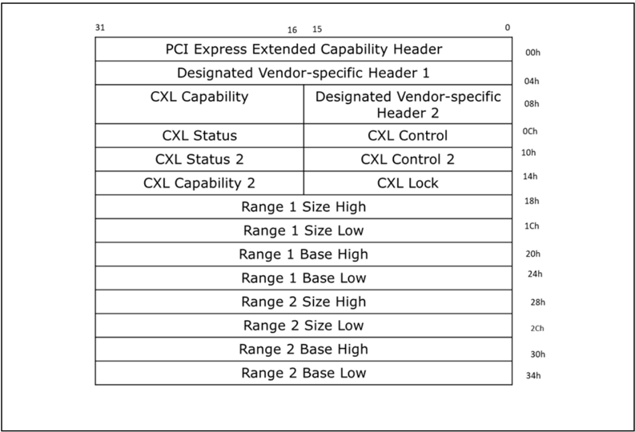

| 31                                     | 1615                                   |
|----------------------------------------|----------------------------------------|
| PCI Express Extended Capability Header | PCI Express Extended Capability Header |
| Designated Vendor-specific Header 1    | Designated Vendor-specific Header 1    |
| CXL Capability                         | DesignatedVendor-specific Header 2     |
| CXL Status                             | CXL Control                            |
| CXL Status 2                           | CXL Control 2                          |
| CXL Capability 2                       | CXL Lock                               |
| Range 1 Size High                      | Range 1 Size High                      |
| Range 1 Size Low                       | Range 1 Size Low                       |
| Range 1 Base High                      | Range 1 Base High                      |
| Range 1Base Low                        | Range 1Base Low                        |
| Range 2 Size High                      | Range 2 Size High                      |
| Range 2 Size Low                       | Range 2 Size Low                       |
| Range 2 Base High                      | Range 2 Base High                      |
| Range2BaseLow                          | Range2BaseLow                          |

To advertise CXL capability, the standard DVSEC register fields shall be set to the values shown in the table below. The DVSEC Length field is set to 38h bytes to accommodate the registers included in the DVSEC. The DVSEC ID is set to 0h to advertise that this is a PCIe DVSEC for CXL Device structure. DVSEC Revision ID of 0h represents the structure as defined in CXL 1.1 specification. DVSEC Revision ID of 01h represents the structure as defined in this specification. DVSEC Revision ID 01h structure extends Revision ID 0h by replacing fields that are marked as reserved in CXL 1.1 specification, but does not redefine the meaning of existing fields. CXL 1.1 device may implement Revision ID 0 or 1. CXL 2.0 device is not permitted to implement Revision ID 0 and must implement Revision ID 1.

###### Table 126. PCI Express DVSEC Register Settings for CXL Device

| Register                                         | Bit Location   | Field           | Value   |
|--------------------------------------------------|----------------|-----------------|---------|
| Designated Vendor-Specific Header 1 (offset 04h) | 15:0           | DVSEC Vendor ID | 1E98h   |
| Designated Vendor-Specific Header 1 (offset 04h) | 19:16          | DVSEC Revision  | 1h      |
| Designated Vendor-Specific Header 1 (offset 04h) | 31:20          | DVSEC Length    | 38h     |
| Designated Vendor-Specific Header 2 (offset 08h) | 15:0           | DVSEC ID        | 0h      |

The CXL device specific registers are described in the following subsections.

##### 8.1.3.1 DVSEC CXL Capability (Offset 0Ah)

| Bit   | Attributes   | Description                                                                                                                                                                                                                                                                                                                                                                                                                                                                                                                                                                     |
|-------|--------------|---------------------------------------------------------------------------------------------------------------------------------------------------------------------------------------------------------------------------------------------------------------------------------------------------------------------------------------------------------------------------------------------------------------------------------------------------------------------------------------------------------------------------------------------------------------------------------|
| 0     | RO           | Cache_Capable: If set, indicates CXL.cache protocol support when operating in Flex Bus.CXL mode. This must be 0 for all functions of an MLD.                                                                                                                                                                                                                                                                                                                                                                                                                                    |
| 1     | RO           | IO_Capable: If set, indicates CXL.io protocol support when operating in Flex Bus.CXL mode. Must be 1.                                                                                                                                                                                                                                                                                                                                                                                                                                                                           |
| 2     | RO           | Mem_Capable: If set, indicates CXL.mem protocol support when operating in Flex Bus.CXL mode. This must be 1 for all functions of an MLD.                                                                                                                                                                                                                                                                                                                                                                                                                                        |
| 3     | RO           | Mem_HwInit_Mode: If set, indicates this CXL.mem capable device initializes memory with assistance from hardware and firmware located on the device. If clear, indicates memory is initialized by host software such as device driver. This bit must be ignored if CXL.mem_Capable=0.                                                                                                                                                                                                                                                                                            |
| 5:4   | RO           | HDM_Count: Number of HDM ranges implemented by the CXL device and reported through this function. 00 - Zero ranges. This setting is illegal if CXL.mem Capable=1. 01 - One HDM range. 10 - Two HDM ranges 11 - Reserved This field must return 00 if CXL.mem_Capable=0.                                                                                                                                                                                                                                                                                                         |
| 6     | RO           | Cache Writeback and Invalidate Capable: If set, indicates the device implements Disable Caching and Initiate Cache Write Back and Invalidation control bits in CXL Control2 register and Cache Invalid status bit in CXL Status2 register. All CXL 2.0 devices shall set this capability bit if CXL.Cache_Capable=1.                                                                                                                                                                                                                                                            |
| 7     | RO           | CXL Reset Capable: If set, indicates the device supports CXL Reset and implements the CXL Reset Timeout field in this register, I nitiate CXL Reset bit in CXL Control2 register and CXL Reset Completion Status in CXL Status2 register. This field must report the same value for all functions of an MLD.                                                                                                                                                                                                                                                                    |
| 10:8  | RO           | CXL Reset Timeout: If CXL Reset Capable bit is set, this field indicates the maximum time that the device may take to complete the CXL Reset. If CXL Reset Mem Clr Capable bit is 1, this time also accounts for the time needed for clearing or randomizing of volatile HDM Ranges. If CXL Reset completion status bit in CXL Status2 register is not set after the passage of this time duration, software may assume CXL Reset has failed. This value must be the same for all functions of an MLD. Encoding: 000b - 10 ms 001b - 100 ms 010b - 1 s 011b - 10 s 100b - 100 s |
| 11    | HwInit       | CXL Reset Mem Clr Capable: When set, Device is capable of clearing or randomizing of volatile HDM Ranges during CLX Reset.                                                                                                                                                                                                                                                                                                                                                                                                                                                      |
| 12    | RsvdP        | Reserved.                                                                                                                                                                                                                                                                                                                                                                                                                                                                                                                                                                       |
|    13 | HwInit       | Multiple Logical Device: If set, indicates this is a Logical Device in an MLD, including the FM owned LD. If clear, it indicates this is an SLD.                                                                                                                                                                                                                          |
|    14 | RO           | Viral_Capable: If set, indicates CXL device supports Viral handling. This value must be the 1 for all devices.                                                                                                                                                                                                                                                            |
|    15 | HwInit       | PM Init Completion Reporting Capable: If set, indicates that the CXL device is capable of supporting Power Management Initialization Complete flag. All CXL 2.0 devices shall set this capability bit. CXL 1.1 devices may implement this capability. This capability is not applicable to switches and Root Ports. Switches and Root Ports shall hardwire this bit to 0. |

##### 8.1.3.2 DVSEC CXL Control (Offset 0Ch)

| Bit   | Attributes   | Description                                                                                                                                                                                                                                                                                                                                                                                                                                                                            |
|-------|--------------|----------------------------------------------------------------------------------------------------------------------------------------------------------------------------------------------------------------------------------------------------------------------------------------------------------------------------------------------------------------------------------------------------------------------------------------------------------------------------------------|
| 0     | RWL          | Cache_Enable: When set, enables CXL.cache protocol operation when in Flex Bus.CXL mode. Locked by CONFIG_LOCK. Default value of this bit is 0.                                                                                                                                                                                                                                                                                                                                         |
| 1     | RO           | IO_Enable: When set, enables CXL.io protocol operation when in Flex Bus.CXL mode. This bit always returns 1.                                                                                                                                                                                                                                                                                                                                                                           |
| 2     | RWL          | Mem_Enable: When set, enables CXL.mem protocol operation when in Flex Bus.CXL mode. Locked by CONFIG_LOCK. Default value of this bit is 0.                                                                                                                                                                                                                                                                                                                                             |
| 7:3   | RWL          | Cache_SF_Coverage: Performance hint to the device. Locked by CONFIG_LOCK. 0x00: Indicates no Snoop Filter coverage on the Host For all other values of N: Indicates Snoop Filter coverage on the Host of 2^(N+15d) Bytes. For example, if this field contains the value 5, it indicates snoop filter coverage of 1 MB. Default value of this field is 0.                                                                                                                               |
| 10:8  | RWL          | Cache_SF_Granularity: Performance hint to the device. Locked by CONFIG_LOCK. 000: Indicates 64B granular tracking on the Host 001: Indicates 128B granular tracking on the Host 010: Indicates 256B granular tracking on the Host 011: Indicates 512B granular tracking on the Host 100: Indicates 1KB granular tracking on the Host 101: Indicates 2KB granular tracking on the Host 110: Indicates 4KB granular tracking on the Host 111: Reserved Default value of this field is 0. |
| 11    | RWL          | Cache_Clean_Eviction: Performance hint to the device. Locked by CONFIG_LOCK. 0: Indicates clean evictions from device caches are needed for best performance 1: Indicates clean evictions from device caches are NOT needed for best performance Default value of this bit is 0.                                                                                                                                                                                                       |
| 13:12 | RsvdP        | Reserved.                                                                                                                                                                                                                                                                                                                                                                                                                                                                              |
| 14    | RWL          | Viral_Enable: When set, enables Viral handling in the CXL device. Locked by CONFIG_LOCK. If 0, the CXL device may ignore the viral that it receives. Default value of this bit is 0.                                                                                                                                                                                                                                                                                                   |
| 15    | RsvdP        | Reserved.                                                                                                                                                                                                                                                                                                                                                                                                                                                                              |

##### 8.1.3.3 DVSEC CXL Status (Offset 0Eh)

| Bit   | Attributes   | Description                                                                                                                                                                                                          |
|-------|--------------|----------------------------------------------------------------------------------------------------------------------------------------------------------------------------------------------------------------------|
| 13:0  | RsvdZ        | Reserved.                                                                                                                                                                                                            |
| 14    | RW1CS        | Viral_Status: When set, indicates that the CXL device has entered Viral. Viral. This bit does not indicate that the device is currently in Viral condition. See [Section 12.4](#124-cxl-viral-handling), 'CXL Viral Handling' for more details. |
| 15    | RsvdZ        | Reserved.                                                                                                                                                                                                            |

##### 8.1.3.4 DVSEC CXL Control2 (Offset 10h)

| Bit   | Attributes   | Description                                                                                                                                                                                                                                                                                                                                                                                                                                                       |
|-------|--------------|-------------------------------------------------------------------------------------------------------------------------------------------------------------------------------------------------------------------------------------------------------------------------------------------------------------------------------------------------------------------------------------------------------------------------------------------------------------------|
| 0     | RW           | Disable Caching: When set to 1, device shall no longer cache new modified lines in its local cache. Device shall continue to correctly respond to CXL.cache transactions. Default value of this bit is 0.                                                                                                                                                                                                                                                         |
| 1     | RW           | Initiate Cache Write Back and Invalidation: When set to 1, device shall write back all modified lines in the local cache and invalidate all lines. The device shall send CacheFlushed message to host as required by CXL.Cache protocol to indicate it does not hold any modified lines. If this bit is set when Disable Caching =0, the device behavior is undefined. This bit always returns the value of 0 when read by the software. A write of 0 is ignored. |
| 2     | RW           | Initiate CXL Reset: When set to 1, device shall initiate CXL Reset as defined in [Section 9.7](#97-cxl-reset). This bit always returns the value of 0 when read by the software. A write of 0 is ignored. If Software sets this bit while the previous CXL Reset is in progress, the results are undefined.                                                                                                                                                                        |
| 3     | RW           | CXL Reset Mem Clr Enable: When set, and CXL Reset Mem Clr Capable returns 1, Device shall clear or randomize volatile HDM ranges as part of the CXL Reset operation. When CXL Reset Mem Clr Capable is clear, this bit is ignored and volatile HDM ranges may or may not be cleared or randomized during CXL Reset.                                                                                                                                               |
| 15:4  | RsvdP        | Reserved.                                                                                                                                                                                                                                                                                                                                                                                                                                                         |

##### 8.1.3.5 DVSEC CXL Status2 (Offset 12h)

| Bit   | Attributes   | Description                                                                                                                                                                                                                                                                                                                                                                                                                                                             |
|-------|--------------|-------------------------------------------------------------------------------------------------------------------------------------------------------------------------------------------------------------------------------------------------------------------------------------------------------------------------------------------------------------------------------------------------------------------------------------------------------------------------|
| 0     | RO           | Cache Invalid: When set, device guarantees that it does not hold any valid lines and Disable Caching =1. This bit shall read as 0 when Disable Caching = 0.                                                                                                                                                                                                                                                                                                             |
| 1     | RO           | CXL Reset complete: When set, device has successfully completed CXL Reset as defined in [Section 9.7](#97-cxl-reset). Device shall clear this bit upon transition of Initiate CXL Reset bit from 0 to 1, prior to initiating CXL Reset flow.                                                                                                                                                                                                                                             |
| 2     | RO           | CXL Reset Error: When set, device has completed CXL Reset with errors. Additional information may be available in device error records(Figure 8.2.9.1.1). Host software or Fabric Manager may optionally re-issue CXL Reset. Device shall clear this bit upon transition of Initiate CXL Reset bit from 0 to 1, prior to initiating CXL Reset flow.                                                                                                                     |
| 14:2  | RsvdZ        | Reserved.                                                                                                                                                                                                                                                                                                                                                                                                                                                               |
| 15    | RO           | Power Management Initialization Complete: When set, it indicates that the device has successfully completed Power Management Initialization Flow described in [Figure 16](#figure-16-power-management-credits-and-initialization) and is ready to process various Power Management messages. If this bit is not set within 100 ms of link-up, software may conclude that the Power Management initialization has failed and may issue Secondary Bus Reset to force link re-initialization and Power Management re-initialization. |

##### 8.1.3.6 DVSEC CXL Lock (Offset 14h)

| Bit   | Attributes   | Description                                                                                                                                                                                                                                                                                                                                             |
|-------|--------------|---------------------------------------------------------------------------------------------------------------------------------------------------------------------------------------------------------------------------------------------------------------------------------------------------------------------------------------------------------|
| 0     | RWO          | CONFIG_LOCK: When set, all register fields in the PCIe DVSEC for CXL Devices Capability with RWL attribute become read only. Consult individual register fields for details. This bit is cleared upon device Conventional Reset. This bit and all the fields that are locked by this bit are not affected by CXL Reset. Default value of this bit is 0. |
| 15:1  | RsvdP        | Reserved.                                                                                                                                                                                                                                                                                                                                               |

##### 8.1.3.7 DVSEC CXL Capability2 (Offset 16h)

| Bit   | Attributes   | Description                                                                                                                                                                                                   |
|-------|--------------|---------------------------------------------------------------------------------------------------------------------------------------------------------------------------------------------------------------|
| 3:0   | RO           | Cache Size Unit: 0000b - Cache size is not reported. 0001b - 64K 0010b - 1 MB Other - Reserved A CXL device that is not capable of CXL.cache shall return the value of 0.                                     |
| 7:4   | RsvdP        | Reserved.                                                                                                                                                                                                     |
| 15:8  | RO           | Cache Size: Expressed in multiples of Cache Size Unit. If Cache Size=4 and Cache Size Unit=0001b, the device has 256K sized cache. A CXL device that is not capable of CXL.cache shall return the value of 0. |

##### 8.1.3.8 DVSEC CXL Range registers

These registers are not applicable to an FM owned LD.

DVSEC CXL Range 1 register set must be implemented if CXL.mem Capable=1. DVSEC CXL Range 2 register set must be implemented if (CXL.mem Capable=1 and HDM_Count=10b). Each set contains 4 registers - Size High, Size Low, Base High, Base Low.

A CXL.mem capable device is permitted to report zero memory size.

###### 8.1.3.8.1 DVSEC CXL Range 1 Size High (Offset 18h)

| Bit   | Attributes   | Description                                                             |
|-------|--------------|-------------------------------------------------------------------------|
| 31:0  | RO           | Memory_Size_High: Corresponds to bits 63:32 of CXL Range 1 memory size. |

###### 8.1.3.8.2 DVSEC CXL Range1 Size Low (Offset 1Ch)

| Bit   | Attributes   | Description                                                                                                                                                                                                                                                                                                                                                                                                                                                                                                                                                                                                                                                                                                                                                                                                                                                                                                                                                                                                                                                                                                                                                                                                                                                                                                                                                                                                                                                                                                                                                                                                                                                                                                  |
|-------|--------------|--------------------------------------------------------------------------------------------------------------------------------------------------------------------------------------------------------------------------------------------------------------------------------------------------------------------------------------------------------------------------------------------------------------------------------------------------------------------------------------------------------------------------------------------------------------------------------------------------------------------------------------------------------------------------------------------------------------------------------------------------------------------------------------------------------------------------------------------------------------------------------------------------------------------------------------------------------------------------------------------------------------------------------------------------------------------------------------------------------------------------------------------------------------------------------------------------------------------------------------------------------------------------------------------------------------------------------------------------------------------------------------------------------------------------------------------------------------------------------------------------------------------------------------------------------------------------------------------------------------------------------------------------------------------------------------------------------------|
| 0     | RO           | Memory_Info_Valid: When set, indicates that the CXL Range 1 Size high and Size Low registers are valid. Must be set within 1 second of deassertion of reset to CXL device.                                                                                                                                                                                                                                                                                                                                                                                                                                                                                                                                                                                                                                                                                                                                                                                                                                                                                                                                                                                                                                                                                                                                                                                                                                                                                                                                                                                                                                                                                                                                   |
| 1     | RO           | Memory_Active: When set, indicates that the CXL Range 1 memory is fully initialized and available for software use. Must be set within Range 1.Memory_Active_Timeout of deassertion of reset to CXL device if CXL.mem HwInit Mode=1.                                                                                                                                                                                                                                                                                                                                                                                                                                                                                                                                                                                                                                                                                                                                                                                                                                                                                                                                                                                                                                                                                                                                                                                                                                                                                                                                                                                                                                                                         |
| 4:2   | RO           | Media_Type: Indicates the memory media characteristics 000 - Volatile memory, this setting is deprecated starting with CXL 2.0 001 - Non-volatile memory, this setting is deprecated starting with CXL 2.0 010 - The memory characteristics are communicated via CDAT ([Section 8.1.11](#8111-table-access-doe)) and not via this field. Other encodings are reserved. CXL 2.0 and future CXL.mem devices shall set this field to 010.                                                                                                                                                                                                                                                                                                                                                                                                                                                                                                                                                                                                                                                                                                                                                                                                                                                                                                                                                                                                                                                                                                                                                                                                                                                                                                 |
| 7:5   | RO           | Memory_Class: Indicates the class of memory 000 - Memory Class (e.g., normal DRAM), this setting is deprecated starting with CXL 2.0 001 - Storage Class, this setting is deprecated starting with CXL 2.0 010 - The memory characteristics are communicated via CDAT ([Section 8.1.11](#8111-table-access-doe)) and not via this field. All other encodings are reserved. CXL 2.0 and future CXL.mem devices shall set this field to 010.                                                                                                                                                                                                                                                                                                                                                                                                                                                                                                                                                                                                                                                                                                                                                                                                                                                                                                                                                                                                                                                                                                                                                                                                                                                                                             |
| 12:8  | RO           | Desired_Interleave: If a CXL.mem capable CXL 1.1 device is connected to a single CPU via multiple CXL links, this field represents the memory interleaving desired by the device. BIOS will configure the CPU to interleave accesses to this HDM range across links at this granularity. or the closest possible value supported by the host. In the case of CXL 2.0 device, this field represents the minimum desired interleave granularity for optimal device performance. Software should program the Interleave Granularity (IG) field in the HDM Decoder 0/n Control Registers ([Section 8.2.5.12.7](#825127-cxl-hdm-decoder-0-control-register-offset-20h) and [Section 8.2.5.12.15](#8251215-cxl-hdm-decoder-n-control-register-offset-20hn20h)) to be an exact match or any larger granularity advertised by the device via CXL HDM Decoder Capability Register ([Section 8.2.5.12.1](#825121-cxl-hdm-decoder-capability-register-offset-00h)). This field is treated as a hint. The device shall function correctly if the actual programmed value programmed in Interleave Granularity (IG) field in the HDM Decoder 0/n Control Registers is less than what is reported via this field. 00000 - No Interleave 00001 - 256 Byte Granularity 00010 - 4K Interleave The above encodings are backwards compatible with CXL 1.1. The following encodings are new for CXL 2.0 00011- 512 Bytes 00100 - 1024 Bytes 00101 - 2048 Bytes 00110 - 8192 Bytes 00111 - 16384 Bytes all other settings are reserved. Notes: • If a CXL 2.0 Device has different desired interleave values for DPA ranges covered by this CXL Range 1, it should report a value that best fits the requirements for all such ranges (e.g. max of the values) • If CXL 2.0 devices in an Interleave Set advertise different values for this field, Software may choose the smallest value that best fits the set. |
| 15:13 | HwInit       | Memory_Active_Timeout: For devices that advertises Mem_HwInit_Mode=1, this field indicates the maximum time that the device is permitted to take to set Memory_Active bit in this register after a hot reset, warm reset or a cold reset. If Memory_Active bit is not set after the passage of this time duration, software may assume that the HDM reported by this range has failed. This value must be the same for all functions of an MLD. Encoding: 000b - 1 s 001b - 4 s 010b - 16 s 011b - 64 s 100b - 256 s All other - Reserved |
| 27:16 | RsvdP        | Reserved.                                                                                                                                                                                                                                                                                                                                                                                                                                                                                                                                 |
| 31:28 | RO           | Memory_Size_Low: Corresponds to bits 31:28 of CXL Range 1 memory size.                                                                                                                                                                                                                                                                                                                                                                                                                                                                    |

###### 8.1.3.8.3 DVSEC CXL Range 1 Base High (Offset 20h)

| Bit   | Attributes   | Description                                                                                                                                                                                                                                                                                                                                                                                                                                                                                                                  |
|-------|--------------|------------------------------------------------------------------------------------------------------------------------------------------------------------------------------------------------------------------------------------------------------------------------------------------------------------------------------------------------------------------------------------------------------------------------------------------------------------------------------------------------------------------------------|
| 31:0  | RWL          | Memory_Base_High: Corresponds to bits 63:32 of CXL Range 1 base in the host address space. Locked by CONFIG_LOCK. If a device implements CXL HDM Decoder Capability registers and software has enabled HDM Decoder by setting HDM Decoder Enable bit in CXL HDM Decoder Global Control register, the value of this field is not used during address decode. It is recommended that software program this to match CXL HDM Decoder 0 Base High Register for backward compatibility reasons. Default value of this field is 0. |

###### 8.1.3.8.4 DVSEC CXL Range 1 Base Low (Offset 24h)

| Bit   | Attributes   | Description                                                                                                                                                                                                                                                                                                                                                                                                                                                                                                                |
|-------|--------------|----------------------------------------------------------------------------------------------------------------------------------------------------------------------------------------------------------------------------------------------------------------------------------------------------------------------------------------------------------------------------------------------------------------------------------------------------------------------------------------------------------------------------|
| 27:0  | RsvdP        | Reserved.                                                                                                                                                                                                                                                                                                                                                                                                                                                                                                                  |
| 31:28 | RWL          | Memory_Base_Low: Corresponds to bits 31:28 of CXL Range 1 base in the host address space. Locked by CONFIG_LOCK. If a device implements CXL HDM Decoder Capability registers and software has enabled HDM Decoder by setting HDM Decoder Enable bit in CXL HDM Decoder Global Control register, the value of this field is not used during address decode. It is recommended that software program this to match CXL HDM Decoder 0 Base Low Register for backward compatibility reasons. Default value of this field is 0. |

A CXL.mem capable device that does not implement CXL HDM Decoder Capability registers directs host accesses to an address A within its local HDM memory if the following two equations are satisfied -

Memory_Base[63:28] &lt;= (A &gt;&gt;28) &lt; Memory_ Base[63:28]+Memory_Size[63:28]

Memory_Active AND Mem_Enable=1

, where &gt;&gt; represents a bitwise right shift operation.

A CXL.mem capable device that implements CXL HDM Decoder Capability registers follows the above behavior as long as HDM Decoder Enable bit in CXL HDM Decoder Global Control register is zero.

If the address A is not backed by real memory (e.g. a device with less than 256 MB of memory), a device that does not implement CXL HDM Decoder Capability registers must handle those accesses gracefully i.e. return all 1's on reads and drop writes.

Aliasing (mapping more than one Host Physical Address (HPA) to a single Device Physical Address) is forbidden.

###### 8.1.3.8.5 DVSEC CXL Range 2 Size High (Offset 28h)

| Bit   | Attributes   | Description                                                             |
|-------|--------------|-------------------------------------------------------------------------|
| 31:0  | RO           | Memory_Size_High: Corresponds to bits 63:32 of CXL Range 2 memory size. |

###### 8.1.3.8.6 DVSEC CXL Range 2 Size Low (Offset 2Ch)

| Bit   | Attributes   | Description                                                                                                                                                                                                                                                                                                                                                                                                                                                                     |
|-------|--------------|---------------------------------------------------------------------------------------------------------------------------------------------------------------------------------------------------------------------------------------------------------------------------------------------------------------------------------------------------------------------------------------------------------------------------------------------------------------------------------|
| 0     | RO           | Memory_Info_Valid: When set, indicates that the CXL Range 2 Size high and Size Low registers are valid. Must be set within 1 second of deassertion of reset to CXL device.                                                                                                                                                                                                                                                                                                      |
| 1     | RO           | Memory_Active: When set, indicates that the CXL Range 2 memory is fully initialized and available for software use. Must be set within Range 2.Memory_Active_Timeout of deassertion of reset to CXL device if CXL.mem HwInit Mode=1.                                                                                                                                                                                                                                            |
| 4:2   | RO           | Media_Type: Indicates the memory media characteristics 000 - Volatile memory, this setting is deprecated starting with CXL 2.0 001 - Non-volatile memory, this setting is deprecated starting with CXL 2.0 010 - The memory characteristics are communicated via CDAT ([Section 8.1.11](#8111-table-access-doe)) and not via this field. 111 - Not Memory. This setting is deprecated starting with CXL 2.0 Other encodings are reserved. CXL 2.0 and future CXL.mem devices shall set this field to 010. |
| 7:5   | RO           | Memory_Class: Indicates the class of memory 000 - Memory Class (e.g., normal DRAM), this setting is deprecated starting with CXL 2.0 001 - Storage Class, this setting is deprecated starting with CXL 2.0 010 - The memory characteristics are communicated via CDAT ([Section 8.1.11](#8111-table-access-doe)) and not via this field. All other encodings are reserved. CXL 2.0 and future CXL.mem devices shall set this field to 010.                                                                |
| 12:8  | RO           | Desired_Interleave: If a CXL.mem capable CXL 1.1 device is connected to a single CPU via multiple Flex Bus links, this field represents the memory interleaving desired by the device. BIOS will configure the CPU to interleave accesses to this HDM range across links at this granularity or the closest possible value supported by the host. In the case of CXL 2.0 device, this field represents the minimum desired interleave granularity for optimal device performance. Software should program the Interleave Granularity (IG) field in the HDM Decoder 0/n Control Registers ([Section 8.2.5.12.7](#825127-cxl-hdm-decoder-0-control-register-offset-20h) and [Section 8.2.5.12.15](#8251215-cxl-hdm-decoder-n-control-register-offset-20hn20h)) to be an exact match or any larger granularity advertised by the device via CXL HDM Decoder Capability Register ([Section 8.2.5.12.1](#825121-cxl-hdm-decoder-capability-register-offset-00h)). This field is treated as a hint. The device shall function correctly if the actual programmed value programmed in Interleave Granularity (IG) field in the HDM Decoder 0/n Control Registers is less than what is reported via this field. 00000 - No Interleave 00001 - 256 Byte 00010 - 4096 Bytes The above encodings are backwards compatible with CXL 1.1. The following encodings are new for CXL 2.0 00011- 512 Bytes 00100 - 1024 Bytes 00101 - 2048 Bytes 00110 - 8192 Bytes 00111 - 16384 Bytes all other settings are reserved Notes: • If a CXL 2.0 Device has different desired interleave values for DPA ranges covered by this CXL Range 2, it should report a value that best fits the requirements for all such ranges (e.g. max of the values) • If CXL 2.0 devices in an Interleave Set advertise different values for this field, |
| 15:13 | HwInit       | Memory_Active_Timeout: For devices that advertises Mem_HwInit_Mode=1, this field indicates the maximum time that the device is permitted to take to set Memory_Active bit in this register after a Conventional Reset. If Memory_Active bit is not set after the passage of this time duration, software may assume that the HDM reported by this range has failed. This value must be the same for all functions of an MLD. Encoding: 000b - 1 s 001b - 4 s 010b - 16 s 011b - 64 s 100b - 256 s All other - Reserved                                                                                                                                                                                                                                                                                                                                                                                                                                                                                                                                                                                                                                                                                                                                                                                                                                                                                                                                                                                                                                                                                                            |
| 27:16 | RsvdP        | Reserved.                                                                                                                                                                                                                                                                                                                                                                                                                                                                                                                                                                                                                                                                                                                                                                                                                                                                                                                                                                                                                                                                                                                                                                                                                                                                                                                                                                                                                                                                                                                                                                                                                         |
| 31:28 | RO           | Memory_Size_Low: Corresponds to bits 31:28 of CXL Range 2 memory size.                                                                                                                                                                                                                                                                                                                                                                                                                                                                                                                                                                                                                                                                                                                                                                                                                                                                                                                                                                                                                                                                                                                                                                                                                                                                                                                                                                                                                                                                                                                                                            |

###### 8.1.3.8.7 DVSEC CXL Range 2 Base High (Offset 30h)

| Bit   | Attributes   | Description                                                                                                                                                                                                                                                                                                                                                                                                                                                                                                                                  |
|-------|--------------|----------------------------------------------------------------------------------------------------------------------------------------------------------------------------------------------------------------------------------------------------------------------------------------------------------------------------------------------------------------------------------------------------------------------------------------------------------------------------------------------------------------------------------------------|
| 31:0  | RWL          | Memory_Base_High: Corresponds to bits 63:32 of CXL Range 2 base in the host address space. Locked by CONFIG_LOCK. If a device implements CXL HDM Decoder Capability registers and software has enabled HDM Decoder by setting HDM Decoder Enable bit in CXL HDM Decoder Global Control register, the value of this field is not used during address decode. It is recommended that software program this to match the corresponding CXL HDM Decoder Base High Register for backward compatibility reasons. Default value of this field is 0. |

###### 8.1.3.8.8 DVSEC CXL Range 2 Base Low (Offset 34h)

| Bit   | Attributes   | Description                                                                                                                                                                                                                                                                                                                                                                                                                                                                                                                                |
|-------|--------------|--------------------------------------------------------------------------------------------------------------------------------------------------------------------------------------------------------------------------------------------------------------------------------------------------------------------------------------------------------------------------------------------------------------------------------------------------------------------------------------------------------------------------------------------|
| 27:0  | RsvdP        | Reserved                                                                                                                                                                                                                                                                                                                                                                                                                                                                                                                                   |
| 31:28 | RWL          | Memory_Base_Low: Corresponds to bits 31:28 of CXL Range 2 base in the host address space. Locked by CONFIG_LOCK. If a device implements CXL HDM Decoder Capability registers and software has enabled HDM Decoder by setting HDM Decoder Enable bit in CXL HDM Decoder Global Control register, the value of this field is not used during address decode. It is recommended that software program this to match the corresponding CXL HDM Decoder Base Low Register for backward compatibility reasons. Default value of this field is 0. |

#### 8.1.4 Non-CXL Function Map DVSEC

##### Figure 127. Non-CXL Function Map DVSEC

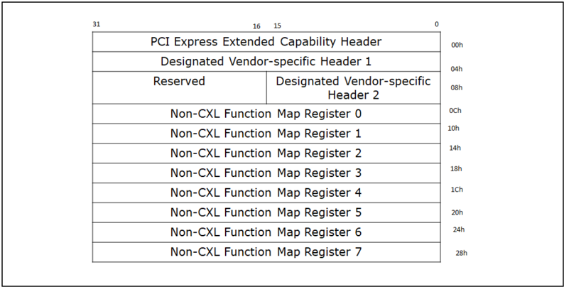

This DVSEC capability identifies the list of device and function numbers associated with non-virtual functions (i.e. functions that are not a Virtual Function) implemented by CXL device that are incapable of participating in CXL.Cache or CXL.Mem protocol. The PCIe configuration space of Device 0, Function 0 of a CXL 2.0 Endpoint or CXL 1.1 RCiEP may include Non-CXL Function Map DVSEC as shown in [Figure 127](#figure-127-non-cxl-function-map-dvsec). See [Table 124](#table-124-cxl-dvsec-id-assignment-sheet-2-of-2) for the complete listing.To advertise this capability, the standard DVSEC register fields must be set to the values shown in the table below. The DVSEC Length

field must be set to 2Ch bytes to accommodate the registers included in the DVSEC. The DVSEC ID must be set to 02 to advertise that this is a Non-CXL Function Map DVSEC capability structure for CXL ports.

If this DVSEC capability is present, it must be included in Device 0, Function 0 of a CXL Device.

Absence of Non-CXL Function Map DVSEC indicates that PCIe DVSEC for CXL Device ([Section 8.1.3](#813-pcie-dvsec-for-cxl-device)) located on Device 0, Function 0 governs whether all Functions participate in CXL.Cache and CXL.Mem protocol.

###### Table 127. Non-CXL Function Map DVSEC

| Register                                         | Bit Location   | Field           | Value   |
|--------------------------------------------------|----------------|-----------------|---------|
| Designated Vendor-Specific Header 1 (offset 04h) | 15:0           | DVSEC Vendor ID | 1E98h   |
| Designated Vendor-Specific Header 1 (offset 04h) | 19:16          | DVSEC Revision  | 0h      |
| Designated Vendor-Specific Header 1 (offset 04h) | 31:20          | DVSEC Length    | 2Ch     |
| Designated Vendor-Specific Header 2 (offset 08h) | 15:0           | DVSEC ID        | 02h     |

##### 8.1.4.1 Non-CXL Function Map Register 0 (Offset 0Ch)

| Bit   | Attributes   | Description                                                                                                                                                                                                                                                                                                                                                                                                                                                                                                                                                                                                                                                                                                                                                             |
|-------|--------------|-------------------------------------------------------------------------------------------------------------------------------------------------------------------------------------------------------------------------------------------------------------------------------------------------------------------------------------------------------------------------------------------------------------------------------------------------------------------------------------------------------------------------------------------------------------------------------------------------------------------------------------------------------------------------------------------------------------------------------------------------------------------------|
| 31:0  | HwInit       | Non CXL Function: Each bit represents a non-virtual function number implemented by the device on the same bus as the function that carries PCIe DVSEC for CXL Device. When a bit is set, the corresponding Device/Function number or Function number (ARI device) is not capable of participating in CXL.Cache or CXL.Mem protocol. Bits corresponding to Non-existent Device/Function or Function numbers shall always return 0. If the device does not support ARI, bit x in this register maps to Device x, Function 0. If the device supports ARI, bit x in this register maps to Function x. Bit 0 of this register shall always be set to 1 since PCIe DVSEC for CXL Device declares whether Device 0, Function 0 participates in CXL.Cache and CXL.Mem protocol. |

##### 8.1.4.2 Non-CXL Function Map Register 1 (Offset 10h)

| Bit   | Attributes   | Description                                                                                                                                                                                                                                                                                                                                                                                                                                                                                                                                                                                          |
|-------|--------------|------------------------------------------------------------------------------------------------------------------------------------------------------------------------------------------------------------------------------------------------------------------------------------------------------------------------------------------------------------------------------------------------------------------------------------------------------------------------------------------------------------------------------------------------------------------------------------------------------|
| 31:0  | HwInit       | Non CXL Function: Each bit represents a non-virtual function number implemented by the device on the same bus as the function that carries PCIe DVSEC for CXL Device. When a bit is set, the corresponding Device/Function number or Function number (ARI device) is not capable of participating in CXL.Cache or CXL.Mem protocol. Bits corresponding to Non-existent Device/Function or Function numbers shall always return 0. If the device does not support ARI, bit x in this register maps to Device x, Function 1. If the device supports ARI, bit x in this register maps to Function x+32. |

##### 8.1.4.3 Non-CXL Function Map Register 2 (Offset 14h)

| Bit   | Attributes   | Description                                                                                                                                                                                                                                                                                                                                                                                                                                                                                                                                                                                            |
|-------|--------------|--------------------------------------------------------------------------------------------------------------------------------------------------------------------------------------------------------------------------------------------------------------------------------------------------------------------------------------------------------------------------------------------------------------------------------------------------------------------------------------------------------------------------------------------------------------------------------------------------------|
| 31:0  | HwInit       | Non CXL Function: Each bit represents a non-virtual function number implemented by the device on the same bus as the function that carries PCIe DVSEC for CXL Device. When a bit is set, the corresponding Device/Function number or Function number (ARI device) is not capable of participating in CXL.Cache or CXL.Mem protocol. Bits corresponding to Non-existent Device/Function or Function numbers shall always return 0. If the device does not support ARI, bit x in this register maps to Device x, Function 2. If the device supports ARI, bit x in this register maps to Function (x+64). |

##### 8.1.4.4 Non-CXL Function Map Register 3(Offset 18h)

| Bit   | Attributes   | Description                                                                                                                                                                                                                                                                                                                                                                                                                                                                                                                                                                                            |
|-------|--------------|--------------------------------------------------------------------------------------------------------------------------------------------------------------------------------------------------------------------------------------------------------------------------------------------------------------------------------------------------------------------------------------------------------------------------------------------------------------------------------------------------------------------------------------------------------------------------------------------------------|
| 31:0  | HwInit       | Non CXL Function: Each bit represents a non-virtual function number implemented by the device on the same bus as the function that carries PCIe DVSEC for CXL Device. When a bit is set, the corresponding Device/Function number or Function number (ARI device) is not capable of participating in CXL.Cache or CXL.Mem protocol. Bits corresponding to Non-existent Device/Function or Function numbers shall always return 0. If the device does not support ARI, bit x in this register maps to Device x, Function 3. If the device supports ARI, bit x in this register maps to Function (x+96). |

##### 8.1.4.5 Non-CXL Function Map Register 4 (Offset 1Ch)

| Bit   | Attributes   | Description                                                                                                                                                                                                                                                                                                                                                                                                                                                                                                                                                                                             |
|-------|--------------|---------------------------------------------------------------------------------------------------------------------------------------------------------------------------------------------------------------------------------------------------------------------------------------------------------------------------------------------------------------------------------------------------------------------------------------------------------------------------------------------------------------------------------------------------------------------------------------------------------|
| 31:0  | HwInit       | Non CXL Function: Each bit represents a non-virtual function number implemented by the device on the same bus as the function that carries PCIe DVSEC for CXL Device. When a bit is set, the corresponding Device/Function number or Function number (ARI device) is not capable of participating in CXL.Cache or CXL.Mem protocol. Bits corresponding to Non-existent Device/Function or Function numbers shall always return 0. If the device does not support ARI, bit x in this register maps to Device x, Function 4. If the device supports ARI, bit x in this register maps to Function (x+128). |

##### 8.1.4.6 Non-CXL Function Map Register 5 (Offset 20h)

| Bit   | Attributes   | Description                                                                                                                                                                                                                                                                                                                                                                                                                                                                                                                                                                                             |
|-------|--------------|---------------------------------------------------------------------------------------------------------------------------------------------------------------------------------------------------------------------------------------------------------------------------------------------------------------------------------------------------------------------------------------------------------------------------------------------------------------------------------------------------------------------------------------------------------------------------------------------------------|
| 31:0  | HwInit       | Non CXL Function: Each bit represents a non-virtual function number implemented by the device on the same bus as the function that carries PCIe DVSEC for CXL Device. When a bit is set, the corresponding Device/Function number or Function number (ARI device) is not capable of participating in CXL.Cache or CXL.Mem protocol. Bits corresponding to Non-existent Device/Function or Function numbers shall always return 0. If the device does not support ARI, bit x in this register maps to Device x, Function 5. If the device supports ARI, bit x in this register maps to Function (x+160). |

##### 8.1.4.7 Non-CXL Function Map Register 6 (Offset 24h)

| Bit   | Attributes   | Description                                                                                                                                                                                                                                                                                                                                                                                                                                                                                                                                                                                             |
|-------|--------------|---------------------------------------------------------------------------------------------------------------------------------------------------------------------------------------------------------------------------------------------------------------------------------------------------------------------------------------------------------------------------------------------------------------------------------------------------------------------------------------------------------------------------------------------------------------------------------------------------------|
| 31:0  | HwInit       | Non CXL Function: Each bit represents a non-virtual function number implemented by the device on the same bus as the function that carries PCIe DVSEC for CXL Device. When a bit is set, the corresponding Device/Function number or Function number (ARI device) is not capable of participating in CXL.Cache or CXL.Mem protocol. Bits corresponding to Non-existent Device/Function or Function numbers shall always return 0. If the device does not support ARI, bit x in this register maps to Device x, Function 6. If the device supports ARI, bit x in this register maps to Function (x+192). |

##### 8.1.4.8 Non-CXL Function Map Register 7(Offset 28h)

| Bit   | Attributes   | Description                                                                                                                                                                                                                                                                                                                                                                                                                                                                                                                                                                                                      |
|-------|--------------|------------------------------------------------------------------------------------------------------------------------------------------------------------------------------------------------------------------------------------------------------------------------------------------------------------------------------------------------------------------------------------------------------------------------------------------------------------------------------------------------------------------------------------------------------------------------------------------------------------------|
| 31:0  | HwInit       | Non CXL Function: Each bit represents a non-virtual function number implemented by the device on the same bus as the physical function that carries PCIe DVSEC for CXL Device. When a bit is set, the corresponding Device/Function number or Function number (ARI device) is not capable of participating in CXL.Cache or CXL.Mem protocol. Bits corresponding to Non-existent Device/Function or Function numbers shall always return 0. If the device does not support ARI, bit x in this register maps to Device x, Function 7. If the device supports ARI, bit x in this register maps to Function (x+224). |

#### 8.1.5 CXL 2.0 Extensions DVSEC for Ports

##### Figure 128. CXL 2.0 Extensions DVSEC for Ports

| PCI Express Extended Capability Header   | PCI Express Extended Capability Header   | PCI Express Extended Capability Header   |
|------------------------------------------|------------------------------------------|------------------------------------------|
| Designated Vendor-specific Header 1      | Designated Vendor-specific Header 1      | Designated Vendor-specific Header 1      |
| CXLPortExtensionStatus                   | CXLPortExtensionStatus                   | Designated Vendor-specific Header 2      |
| Alt Bus Limit                            | Alt Bus Base                             | Port Control Extensions                  |
| Alternate Memory Limit                   | Alternate Memory Limit                   | Alternate Memory Base                    |
| Alt Prefetch Memory Limit                | Alt Prefetch Memory Limit                | Alt Prefetch Memory Base                 |
| Alternate Prefetchable Memory Base High  | Alternate Prefetchable Memory Base High  | Alternate Prefetchable Memory Base High  |
| Alternate Prefetchable Memory Limit High | Alternate Prefetchable Memory Limit High | Alternate Prefetchable Memory Limit High |
| CXL RCRB Base                            | CXL RCRB Base                            | CXL RCRB Base                            |
| CXL RCRB BaSe High                       | CXL RCRB BaSe High                       | CXL RCRB BaSe High                       |

The PCIe configuration space of a CXL 2.0 Root Port, CXL Downstream Switch Port and CXL Upstream Switch Port must implement this DVSEC capability as shown in [Figure 128](#figure-128-cxl-20-extensions-dvsec-for-ports). See [Table 124](#table-124-cxl-dvsec-id-assignment-sheet-2-of-2) for the complete listing. To advertise this capability, the

standard DVSEC register fields must be set to the values shown in the table below. The DVSEC Length field must be set to 28h bytes to accommodate the registers included in the DVSEC. The DVSEC ID must be set to 0x3 to advertise that this is a CXL 2.0 Extension DVSEC capability structure for CXL ports.

###### Table 128. CXL 2.0 Extensions DVSEC for Ports - Header

| Register                                         | Bit Location   | Field           | Value   |
|--------------------------------------------------|----------------|-----------------|---------|
| Designated Vendor-Specific Header 1 (offset 04h) | 15:0           | DVSEC Vendor ID | 1E98h   |
| Designated Vendor-Specific Header 1 (offset 04h) | 19:16          | DVSEC Revision  | 0h      |
| Designated Vendor-Specific Header 1 (offset 04h) | 31:20          | DVSEC Length    | 28h     |
| Designated Vendor-Specific Header 2 (offset 08h) | 15:0           | DVSEC ID        | 03h     |

##### 8.1.5.1 CXL Port Extension Status (Offset 0Ah)

| Bit   | Attributes   | Description                                                                                                                                                                                                                                                                                                                                                                                                                                                                                                                                  |
|-------|--------------|----------------------------------------------------------------------------------------------------------------------------------------------------------------------------------------------------------------------------------------------------------------------------------------------------------------------------------------------------------------------------------------------------------------------------------------------------------------------------------------------------------------------------------------------|
| 0     | RO           | Port Power Management Initialization Complete: When set, it indicates that the Root Port, the Upstream Switch Port or the Downstream Switch Port has successfully completed the Power Management Initialization Flow as described in [Figure 16](#figure-16-power-management-credits-and-initialization) and is ready to process various Power Management events. If this bit is not set within 100 ms of link-up, software may conclude that the Power Management initialization has failed and may issue Secondary Bus Reset to force link re-initialization and Power Management re-initialization. |
| 13:1  | RsvdP        | Reserved                                                                                                                                                                                                                                                                                                                                                                                                                                                                                                                                     |
| 14    | RW1CS        | Viral Status: When set, indicates that the Upstream Switch Port or the Downstream Switch Port has entered Viral. See [Section 12.4](#124-cxl-viral-handling) for more details. This bit is not applicable to Root ports and reads shall return the value of 0.                                                                                                                                                                                                                                                                                                          |
| 15    | RsvdP        | Reserved                                                                                                                                                                                                                                                                                                                                                                                                                                                                                                                                     |

##### 8.1.5.2 Port Control Extensions (Offset 0Ch)

| Bit   | Attributes   | Description                                                                                                                                                                                                                                                                                                                                                                                                                                                                                                                                                                                                                                                                                                                                                                                                                                                                                                                                                                           |
|-------|--------------|---------------------------------------------------------------------------------------------------------------------------------------------------------------------------------------------------------------------------------------------------------------------------------------------------------------------------------------------------------------------------------------------------------------------------------------------------------------------------------------------------------------------------------------------------------------------------------------------------------------------------------------------------------------------------------------------------------------------------------------------------------------------------------------------------------------------------------------------------------------------------------------------------------------------------------------------------------------------------------------|
| 0     | RW           | Unmask SBR- When 0, SBR bit in Bridge Control register of this Port has no effect. When 1, the Port shall generate hot reset when SBR bit in Bridge Control gets set to 1. Default value of this field is 0. When the Port is operating in PCIe mode or CXL 1.1 mode, this field has no effect on SBR functionality and Port shall follow PCI Express Specification.                                                                                                                                                                                                                                                                                                                                                                                                                                                                                                                                                                                                                  |
| 1     | RW           | Unmask Link Disable - When 0, Link Disable bit in Link Control register of this Port has no effect. When 1, the Port shall disable the CXL Link when Link Disable bit in Link Control gets set to 1 and Link is re-enabled when Link Disable bit in Link control is set to 0, Default value of this field is 0. When the Port is operating in PCIe mode or CXL 1.1 mode, this field has no effect on Link Disable functionality and the Port shall follow PCI Express Specification.                                                                                                                                                                                                                                                                                                                                                                                                                                                                                                  |
| 2     | RW           | Alt Memory and ID Space Enable - When set to 1, Port positively decodes downstream transactions to ranges specified in Alternate Memory Base/Limit registers, Alternate Prefetchable Memory Base/Limit, Alternate Prefetchable Base/ Limit Upper 32 Bits and Alternate Bus Base/Limit registers irrespective of Memory Space Enable bit in PCI Command Register. When set to 0, the Port does not decode downstream transactions to ranges specified in Alternate Memory Base/Limit registers, Alternate Prefetchable Memory Base/Limit, Alternate Prefetchable Base/Limit Upper 32 Bits and Alternate Bus Base/ Limit registers irrespective of Memory Space Enable bit in PCI Command Register. Default value of this field is 0. Firmware/Software must ensure this bit is 0 when the Port is operating in PCIe                                                                                                                                                                    |
| 3     | RW           | Alt BME - This bit overrides the state of BME bit in Command Register if the requestor's bus number is in the range specified by Alternate Bus Base and Alternate Bus Limit range. This bit alone controls forwarding of Memory or I/O Requests by a Port in the Upstream direction if the requestor's bus number is in the range specified by Alternate Bus Base and Alternate Bus Limit range. if the requestor's bus number is in the range specified by Alternate Bus Base and Alternate Bus Limit range and this bit is 0b, Memory and I/O Requests received at a Root Port or the Downstream side of a Switch Port must be handled as Unsupported Requests (UR), and for Non-Posted Requests a Completion with UR Completion Status must be returned. This bit does not affect forwarding of Completions in either the Upstream or Downstream direction. Default value of this field is 0. Firmware/Software must ensure this bit is 0 when the Port is operating in PCIe mode. |
| 13:4  | RsvdP        | Reserved                                                                                                                                                                                                                                                                                                                                                                                                                                                                                                                                                                                                                                                                                                                                                                                                                                                                                                                                                                              |
| 14    | RW           | Viral Enable: When set, enables Viral generation functionality of the Upstream Switch Port or the Downstream Switch Port. See [Section 12.4](#124-cxl-viral-handling) for more details. If 0, the port shall not generate viral. Default value of this bit is 0. Regardless of the state of this bit, a switch shall always forward viral as described in [Section 12.4](#124-cxl-viral-handling). This bit is not applicable to Root ports and reads shall return the value of 0. Viral behavior of a Root Port may be controlled by a host specific configuration mechanism.                                                                                                                                                                                                                                                                                                                                                                                                                                                              |
| 15    | RsvdP        | Reserved.                                                                                                                                                                                                                                                                                                                                                                                                                                                                                                                                                                                                                                                                                                                                                                                                                                                                                                                                                                             |

##### 8.1.5.3 Alternate Bus Base (Offset 0Eh)

Alternate Bus Base Number and Alternate Bus Limit Number registers define a bus range that is decoded by the Port in addition to the standard Secondary Bus Number to Subordinate Bus Number range. An ID-Routed TLP transactions received from primary interface is forwarded to the secondary interface if the bus number is not less than the Alternate Bus Base and not greater than Alternate Bus Limit. See Figure 148.

| Bit   | Attributes   | Description                                                                                                                                      |
|-------|--------------|--------------------------------------------------------------------------------------------------------------------------------------------------|
| 7:0   | RW           | Alt Bus Base - The lowest bus number that is positively decoded by this Port as part of alternate decode path. Default value of this field is 0. |

##### 8.1.5.4 Alternate Bus Limit (Offset 0Fh)

See Alternate Bus Base.

| Bit   | Attributes   | Description                                                                                                                                                                                                               |
|-------|--------------|---------------------------------------------------------------------------------------------------------------------------------------------------------------------------------------------------------------------------|
| 7:0   | RW           | Alt Bus Limit - The highest bus number that is positively decoded by this Port as part of alternate decode path. Default value of this field is 0. Alternate bus decoder is disabled if Alt Memory and ID Space Enable=0. |

##### 8.1.5.5 Alternate Memory Base (Offset 10h)

Alternate Memory Base and Alternate Memory Limit registers define a memory mapped address range that is in addition to the standard Memory Base and Memory Limit registers. Alternate Memory Base and Alternate Memory Limit registers are functionally equivalent to PCI Express defined Memory Base and Memory Limit registers. These are used by the Port to determine when to forward memory transactions from one interface to the other. See Figure 147.

| Bit   | Attributes   | Description                                                                                                                                                                               |
|-------|--------------|-------------------------------------------------------------------------------------------------------------------------------------------------------------------------------------------|
| 3:0   | RsvdP        | Reserved.                                                                                                                                                                                 |
| 15:4  | RW           | Alt Mem Base: Corresponds to A[31:20] of the CXL.io Alternate memory base address. See definition of Memory Base register in PCI Express Specification. Default value of this field is 0. |

##### 8.1.5.6 Alternate Memory Limit (Offset 12h)

See Alternate Memory Base.

| Bit   | Attributes   | Description                                                                                                                                                                                  |
|-------|--------------|----------------------------------------------------------------------------------------------------------------------------------------------------------------------------------------------|
| 3:0   | RsvdP        | Reserved.                                                                                                                                                                                    |
| 15:4  | RW           | Alt Mem Limit: Corresponds to A[31:20] of the CXL.io Alternate memory limit address. See definition of Memory Limit register in PCI Express Specification. Default value of this field is 0. |

##### 8.1.5.7 Alternate Prefetchable Memory Base (Offset 14h)

Alternate Prefetchable Memory Base, Alternate Prefetchable Memory Base High, Alternate Prefetchable Memory Limit and Alternate Prefetchable Memory Limit High registers define a 64 bit memory mapped address range that is in addition to the one defined by the PCIe standard Prefetchable Memory Base, Prefetchable Base Upper 32 bits, Prefetchable Memory Limit and Prefetchable Limit Upper 32 bits registers.

Alternate Prefetchable Memory registers are functionally equivalent to PCI Express defined Prefetchable Memory registers. These are used by the Port to determine when to forward Prefetchable memory transactions from one interface to the other.

| Bit   | Attributes   | Description                                                                                                                                                                                                                  |
|-------|--------------|------------------------------------------------------------------------------------------------------------------------------------------------------------------------------------------------------------------------------|
| 3:0   | RsvdP        | Reserved.                                                                                                                                                                                                                    |
| 15:4  | RW           | Alt Prefetch Mem Base: Corresponds to A[31:20] of the CXL.io Alternate Prefetchable memory base address. See definition of Prefetchable Memory Base register in PCI Express Specification. Default value of this field is 0. |

##### 8.1.5.8 Alternate Prefetchable Memory Limit (Offset 16h)

See Alternate Prefetchable Memory Base.

| Bit   | Attributes   | Description                                                                                                                                                                                                                     |
|-------|--------------|---------------------------------------------------------------------------------------------------------------------------------------------------------------------------------------------------------------------------------|
| 3:0   | RsvdP        | Reserved.                                                                                                                                                                                                                       |
| 15:4  | RW           | Alt Prefetch Mem Limit: Corresponds to A[31:20] of the CXL.io Alternate Prefetchable memory limit address. See definition of Prefetchable memory limit register in PCI Express Specification. Default value of this field is 0. |

##### 8.1.5.9 Alternate Memory Prefetchable Base High (Offset 18h)

See Alternate Prefetchable Memory Base.

| Bit   | Attributes   | Description                                                                                                                                                                                                                          |
|-------|--------------|--------------------------------------------------------------------------------------------------------------------------------------------------------------------------------------------------------------------------------------|
| 31:0  | RW           | Alt Prefetch Base High: Corresponds to A[63:32] of the CXL.io Alternate Prefetchable memory base address. See definition of Prefetchable Base Upper 32 Bits register in PCI Express Specification. Default value of this field is 0. |

##### 8.1.5.10 Alternate Prefetchable Memory Limit High (Offset 1Ch)

See Alternate Prefetchable Memory Base.

| Bit   | Attributes   | Description                                                                                                                                                                                                                             |
|-------|--------------|-----------------------------------------------------------------------------------------------------------------------------------------------------------------------------------------------------------------------------------------|
| 31:0  | RW           | Alt Prefetch Limit High: Corresponds to A[63:32] of the CXL.io Alternate Prefetchable memory limit address. See definition of Prefetchable Limit Upper 32 Bits register in PCI Express Specification. Default value of this field is 0. |

##### 8.1.5.11 CXL RCRB Base (Offset 20h)

This register is only relevant to CXL 2.0 Downstream Ports. Software programs this register to transition a Port to operate in CXL 1.1 addressing mode. Software may take this step upon determining that the Port is connected to a CXL 1.1 device.

System Firmware must ensure CXL RCRB Enable is 0, whenever the Port is operating in PCIe mode.

| Bit   | Attributes   | Description                                                                                                                                                                                                                                                                                                                                                                                                                                                                                                                                                                         |
|-------|--------------|-------------------------------------------------------------------------------------------------------------------------------------------------------------------------------------------------------------------------------------------------------------------------------------------------------------------------------------------------------------------------------------------------------------------------------------------------------------------------------------------------------------------------------------------------------------------------------------|
| 0     | RW           | CXL RCRB Enable: When set, the RCRB region is enabled and the registers belonging to this Port can be accessed via CXL 1.1 compatible mechanism. After this write is completed, the Port registers shall no longer appear in configuration space, but rather in MMIO space starting at RCRB Base. Once a Port is transitioned to CXL 1.1 addressing mode, the software is responsible for ensuring it remains in that mode until the next Conventional reset and RCRB Base Address is not modified, otherwise the hardware behavior is undefined. Default value of this field is 0. |
| 12:1  | RsvdP        | Reserved                                                                                                                                                                                                                                                                                                                                                                                                                                                                                                                                                                            |
| 31:13 | RW           | CXL RCRB Base Address Low: This points to the address bits[31:13] of an 8K memory region where the lower 4K hosts the Downstream CXL 1.1 Port RCRB and the upper 4K hosts the Upstream Port RCRB. Default value of this field is 0.                                                                                                                                                                                                                                                                                                                                                 |

##### 8.1.5.12 CXL RCRB Base High (Offset 24h)

| Bit   | Attributes   | Description                                                                                                                                                                                                                           |
|-------|--------------|---------------------------------------------------------------------------------------------------------------------------------------------------------------------------------------------------------------------------------------|
| 31:0  | RW           | CXL RCRB Base Address High: This points to the address bits [63:32] of an 8K memory region where the lower 4K hosts the Downstream CXL 1.1 Port RCRB and the upper 4K hosts the Upstream Port RCRB. Default value of this field is 0. |

#### 8.1.6 GPF DVSEC for CXL Port

##### Figure 129. GPF DVSEC for CXL Port

| 31                                  | 1615                                | 1615   |
|-------------------------------------|-------------------------------------|--------|
| PCIExpressExtended CapabilityHeader | PCIExpressExtended CapabilityHeader | 00h    |
| DesignatedVendor-specificHeader1    | DesignatedVendor-specificHeader1    | 04h    |
| Reserved                            | DesignatedVendor-specific Header2   | 08h    |
| GPFPhase2Control                    | GPFPhase1Control                    | oCh    |

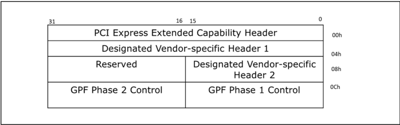

The PCIe configuration space of CXL Downstream Switch Ports and CXL 2.0 capable Root Ports must implement this DVSEC capability as shown in [Figure 129](#figure-129-gpf-dvsec-for-cxl-port). See [Table 124](#table-124-cxl-dvsec-id-assignment-sheet-2-of-2) for the complete listing.

To advertise this capability, the standard DVSEC register fields must be set to the values shown in the table below. The DVSEC Length field must be set to 10h bytes to accommodate the registers included in the DVSEC. The DVSEC ID must be set to 04h to advertise that this is an GPF DVSEC capability structure for CXL ports.

###### Table 129. GPF DVSEC for CXL Port - Header

| Register                                         | Bit Location   | Field           | Value   |
|--------------------------------------------------|----------------|-----------------|---------|
| Designated Vendor-Specific Header 1 (offset 04h) | 15:0           | DVSEC Vendor ID | 1E98h   |
| Designated Vendor-Specific Header 1 (offset 04h) | 19:16          | DVSEC Revision  | 0h      |
| Designated Vendor-Specific Header 1 (offset 04h) | 31:20          | DVSEC Length    | 10h     |
| Designated Vendor-Specific Header 2 (offset 08h) | 15:0           | DVSEC ID        | 04h     |

##### 8.1.6.1 GPF Phase 1 Control (Offset 0Ch)

| Bit   | Attributes   | Description                                                                                                                                                                                                    |
|-------|--------------|----------------------------------------------------------------------------------------------------------------------------------------------------------------------------------------------------------------|
| 3:0   | RW           | Port GPF Phase 1 Timeout Base: This field determines the GPF Phase 1 timeout. The timeout duration is calculated by multiplying the Timeout Base with the Timeout Scale.                                       |
| 7:4   | RsvdP        | Reserved                                                                                                                                                                                                       |
| 11:8  | RW           | Port GPF Phase 1 Timeout Scale: This field specifies the time scale associated with GPF Phase 1 Timeout. 000b 1 us 001b 10 us 010b 100 us 011b 1 ms 100b 10 ms 101b 100 ms 110b 1 s 111b 10 s Other - reserved |
| 15:12 | RsvdP        | Reserved                                                                                                                                                                                                       |

##### 8.1.6.2 GPF Phase 2 Control (Offset 0Eh)

| Bit   | Attributes   | Description                                                                                                                                                              |
|-------|--------------|--------------------------------------------------------------------------------------------------------------------------------------------------------------------------|
| 3:0   | RW           | Port GPF Phase 2 Timeout Base: This field determines the GPF Phase 2 timeout. The timeout duration is calculated by multiplying the Timeout Base with the Timeout Scale. |
| 7:4   | RsvdP        | Reserved                                                                                                                                                                                                       |
| 11:8  | RW           | Port GPF Phase 2 Timeout Scale: This field specifies the time scale associated with GPF Phase 2 Timeout. 000b 1 us 001b 10 us 010b 100 us 011b 1 ms 100b 10 ms 101b 100 ms 110b 1 s 111b 10 s Other - reserved |
| 15:12 | RsvdP        | Reserved.                                                                                                                                                                                                      |

#### 8.1.7 GPF DVSEC for CXL Device

##### Figure 130. GPF DVSEC for CXL Device

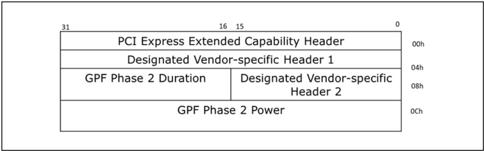

Device 0, Function 0 of a CXL.mem capable devices must implement this DVSEC capability (see [Figure 130](#figure-130-gpf-dvsec-for-cxl-device)) if the device supports GPF. See [Table 124](#table-124-cxl-dvsec-id-assignment-sheet-2-of-2) for the complete listing. A device that does not support CXL.mem must not implement DVSEC Revision 0 this capability. To advertise this capability, the standard DVSEC register fields must be set to the values shown in [Table 130](#table-130-gpf-dvsec-for-cxl-device-header). The DVSEC Length field must be set to 10h bytes to accommodate the registers included in the DVSEC. The DVSEC ID must be set to 05h to advertise that this is an GPF DVSEC structure for CXL Devices.

###### Table 130. GPF DVSEC for CXL Device - Header

| Register                                         | Bit Location   | Field           | Value   |
|--------------------------------------------------|----------------|-----------------|---------|
| Designated Vendor-Specific Header 1 (offset 04h) | 15:0           | DVSEC Vendor ID | 1E98h   |
| Designated Vendor-Specific Header 1 (offset 04h) | 19:16          | DVSEC Revision  | 0h      |
| Designated Vendor-Specific Header 1 (offset 04h) | 31:20          | DVSEC Length    | 10h     |
| Designated Vendor-Specific Header 2 (offset 08h) | 15:0           | DVSEC ID        | 05h     |

##### 8.1.7.1 GPF Phase 2 Duration (Offset 0Ah)

| Bit   | Attributes   | Description                                                                                                                                                                                                       |
|-------|--------------|-------------------------------------------------------------------------------------------------------------------------------------------------------------------------------------------------------------------|
| 3:0   | RO           | Device GPF Phase 2 Time Base: This field reports the maximum amount of time this device would take to complete GPF Phase 2. The time duration is calculated by multiplying the Time Base with the Time Scale.     |
| 7:4   | RsvdP        | Reserved                                                                                                                                                                                                          |
| 11:8  | RO           | Device GPF Phase 2 Time Scale: This field specifies the time scale associated with Device GPF Phase 2 Time. 000b 1 us 001b 10 us 010b 100 us 011b 1 ms 100b 10 ms 101b 100 ms 110b 1 s 111b 10 s Other - reserved |
| 15:12 | RsvdP        | Reserved                                                                                                                                                                                                          |

##### 8.1.7.2 GPF Phase 2 Power (Offset 0Ch)

| Bit   | Attributes   | Description                                                                                                     |
|-------|--------------|-----------------------------------------------------------------------------------------------------------------|
| 31:0  | RO           | GPF Phase 2 active power: Active power consumed by the device during GPF Phase 2. Expressed in multiples of mW. |

#### 8.1.8 PCIe DVSEC for Flex Bus Port

See [Section 8.2.1.3](#8213-flex-bus-port-dvsec) for the register layout.

In CXL 1.1 hosts and devices, this DVSEC is accessed via CXL 1.1 RCRB.

The DVSEC associated with a CXL 2.0 device shall be accessible via Device 0, Function 0 of the device. Upstream Switch Ports, Downstream Switch Ports and CXL 2.0 Root Ports shall implement this DVSEC in the Configuration Space associated with the Port. See [Table 124](#table-124-cxl-dvsec-id-assignment-sheet-2-of-2) for the complete listing.

#### 8.1.9 Register Locator DVSEC

The PCIe configuration space of a CXL 2.0 Root Port, CXL Downstream Switch Port, CXL Upstream Switch Port and CXL 2.0 Device must implement this DVSEC capability. This DVSEC capability contains one or more Register Block entries. Figure 131 illustrates a DVSEC Capability with 3 Register Block Entries. See [Table 124](#table-124-cxl-dvsec-id-assignment-sheet-2-of-2) for the complete listing.

##### Figure 131. Register Locator DVSEC with 3 Register Block Entries

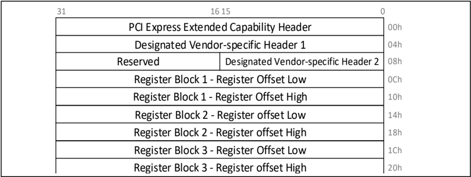

| 31                                      | 0 15 16                                 |
|-----------------------------------------|-----------------------------------------|
| PCI Express Extended Capability Header  | PCI Express Extended Capability Header  |
| Designated Vendor-specific Header 1     | Designated Vendor-specific Header 1     |
| Reserved                                | Designated Vendor-specific Header 2 08h |
| Register Block 1 - Register Offset Low  | Register Block 1 - Register Offset Low  |
| Register Block 1 - Register Offset High | Register Block 1 - Register Offset High |
| Register Block 2 - Register offset Low  | Register Block 2 - Register offset Low  |
| Register Block 2 - Register offset High | Register Block 2 - Register offset High |
| Register Block 3 - Register Offset Low  | Register Block 3 - Register Offset Low  |
| Register Block 3 - Register offset High | Register Block 3 - Register offset High |

Each register block included in the Register Locator DVSEC has an Offset Low and an Offset High register to specify the location of the registers within the Memory Space. The Offset Low register includes an identifier which specifies the type of CXL registers. Each register block identifier shall only occur once in the Register Locator DVSEC structure. Each register block must be wholly contained in the address range covered by the associated BAR.

To advertise this capability, the standard DVSEC register fields must be set to the values shown in the table below. The DVSEC Length field must be set to h (0Ch+ n * 8) bytes to accommodate the registers included in the DVSEC, where n is the number of Register Blocks described by this Capability. The DVSEC ID must be set to 08h to advertise that this is a CXL 2.0 Register Locator DVSEC capability structure.

###### Table 131. Register Locator DVSEC - Header

| Register                                         | Bit Location   | Field           | Value   |
|--------------------------------------------------|----------------|-----------------|---------|
| Designated Vendor-Specific Header 1 (offset 04h) | 15:0           | DVSEC Vendor ID | 1E98h   |
| Designated Vendor-Specific Header 1 (offset 04h) | 19:16          | DVSEC Revision  | 0h      |
| Designated Vendor-Specific Header 1 (offset 04h) | 31:20          | DVSEC Length    | varies  |
| Designated Vendor-Specific Header 2 (offset 08h) | 15:0           | DVSEC ID        | 08h     |

##### 8.1.9.1 Register Offset Low (Offset Varies)

This register reports the BAR Indicator Register (BIR), Register Block Identifier and the lower address bits of the BAR offset associated with Register Block.

| Bit   | Attributes   | Description                                                                                                                                                                                                                                                                                                                                                                                                                                                                                                                                                                                             |
|-------|--------------|---------------------------------------------------------------------------------------------------------------------------------------------------------------------------------------------------------------------------------------------------------------------------------------------------------------------------------------------------------------------------------------------------------------------------------------------------------------------------------------------------------------------------------------------------------------------------------------------------------|
| 2:0   | HwInit       | Register BIR - Indicates which one of a Function's Base Address Registers, located beginning at 10h in Configuration Space, or entry in the Enhanced Allocation capability with a matching BAR Equivalent Indicator (BEI), is used to map the CXL Registers into Memory Space. Defined encodings are: • 0 Base Address Register 10h • 1 Base Address Register 14h • 2 Base Address Register 18h • 3 Base Address Register 1Ch • 4 Base Address Register 20h • 5 Base Address Register 24h All other Reserved. The Registers block must be wholly contained within the specified BAR.                    |
| 7:3   | RsvdP        | Reserved.                                                                                                                                                                                                                                                                                                                                                                                                                                                                                                                                                                                               |
| 15:8  | HwInit       | Register Block Identifier - Identifies the type of CXL registers. Defined encodings are: • 00h Indicates the register block entry is empty and the Register BIR, Register Block Offset Low and Register Block Offset High fields are invalid. • 01h Component Registers. The format of the Component Register block is defined in [Section 8.2.4](#824-component-register-layout-and-definition). • 02h BAR Virtualization ACL Registers. The format of the Component Register block is defined in [Section 8.2.7](#827-bar-virtualization-acl-register-block). • 03h CXL Memory Device Registers. The format of the CXL Memory Device Register block is defined in [Section 8.2.8](#828-cxl-device-register-interface). All other Reserved. |
| 31:16 | HwInit       | Register Block Offset Low - A[31:16] of offset from the address contained by one of the Function's Base Address Registers to point to the base of the Register Block. Register Block Offset is 64K aligned. Hence A[15:0] is zero.                                                                                                                                                                                                                                                                                                                                                                      |

##### 8.1.9.2 Register Offset High (Offset Varies)

This register reports the higher address bits of the BAR offset associated with the Register Block. Zeroed if the register block entry in the Register Locator DVSEC is empty.

| Bit   | Attributes   | Description                                                                                                                                                            |
|-------|--------------|------------------------------------------------------------------------------------------------------------------------------------------------------------------------|
| 31:0  | HwInit       | Register Block Offset High - A[63:32] of offset from the address contained by one of the Function's Base Address Registers to point to the base of the Register Block. |

#### 8.1.10 MLD DVSEC

The MLD DVSEC (see [Figure 132](#figure-132-mld-dvsec)) applies to FM owned LD only and must not be implemented by any other functions. See [Table 124](#table-124-cxl-dvsec-id-assignment-sheet-2-of-2) for the complete listing.

To advertise this capability, the standard DVSEC register fields must be set to the values shown in the table below. The DVSEC Length field must be set to 10h bytes to accommodate the registers included in the DVSEC. The DVSEC ID must be set to 09h to advertise that this is an MLD DVSEC capability structure.

##### Figure 132. MLD DVSEC

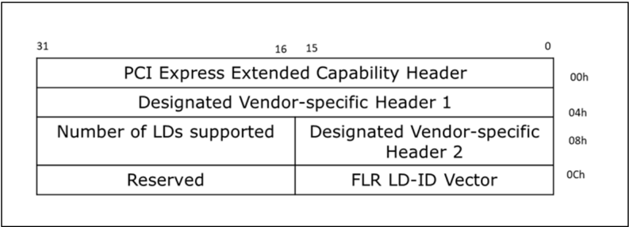

###### Table 132. MLD DVSEC - Header

| Register                                         | Bit Location   | Field           | Value   |
|--------------------------------------------------|----------------|-----------------|---------|
| Designated Vendor-Specific Header 1 (offset 04h) | 15:0           | DVSEC Vendor ID | 1E98h   |
| Designated Vendor-Specific Header 1 (offset 04h) | 19:16          | DVSEC Revision  | 0h      |
| Designated Vendor-Specific Header 1 (offset 04h) | 31:20          | DVSEC Length    | 10h     |
| Designated Vendor-Specific Header 2 (offset 08h) | 15:0           | DVSEC ID        | 09h     |

##### 8.1.10.1 Number of LD Supported (Offset 0Ah)

This register is used by an MLD to advertise the number of LDs supported.

| Bit   | Attributes   | Description                                                                                                                                                                                                                                                                        |
|-------|--------------|------------------------------------------------------------------------------------------------------------------------------------------------------------------------------------------------------------------------------------------------------------------------------------|
| 15:0  | HwInit       | Number of LDs Supported - This field indicates the number of LDs (not counting FM owned LD) that are supported. An MLD must be associated with at least one LD. As such, 0 is an illegal value for this field. Up to 16 LDs are supported; encodings greater than 16 are reserved. |

##### 8.1.10.2 LD-ID Hot Reset Vector (Offset 0Ch)

This register is used by the switch to trigger hot reset of the logical device or devices associated with LD-ID Hot Reset Vector bit positions that are set to a value of 1b.

| Bit   | Attributes   | Description                                                                                                                                                                                                                                                                                                                                |
|-------|--------------|--------------------------------------------------------------------------------------------------------------------------------------------------------------------------------------------------------------------------------------------------------------------------------------------------------------------------------------------|
| 15:0  | RW           | LD-ID Hot Reset Vector - Each bit position in this vector represents an LD-ID. Up to 16 LD-IDs are supported. Setting any bit position to 1b triggers a hot reset of the associated logical device. Multiple bits can be set simultaneously to trigger hot reset of multiple logical devices. Read of this register returns a value of 0h. |

#### 8.1.11 Table Access DOE

Coherent Device Attributes [Table 1](#table-1-terminology-acronyms)  (CDAT) allows a device or switch to expose its performance attributes such as latency and bandwidth characteristics and other attributes of the device or switch. A CXL Upstream Switch Port or Device 0, Function 0 of a CXL device may implement Table Access DOE capability, which can be used to read out CDAT, one entry at a time. See [Table 125](#table-125-cxl-doe-type-assignment) for the complete listing.

1. See https://www.uefi.org/uefi and ACPI Specification

A device may interrupt the host when CDAT content changes using the MSI associated with this DOE Capability instance. A device may share the instance of this DOE mailbox with other Data Objects.

This type of Data object is identified as shown below. The Vendor ID must be set to the CXL Vendor ID to indicate that this Object Type is defined by the CXL Specification. The Data Object Type must be set to 2h to advertise that this is a Table Access type of data object.

##### Table 133. Coherent Device Attributes- Data Object Header

| Field            | Bit Location   | Value   |
|------------------|----------------|---------|
| Vendor ID        | 15:0           | 1E98h   |
| Data Object Type | 23:16          | 2h      |

##### 8.1.11.1 Read Entry

Read the specified entry from the specified table within the device or the switch.

###### Table 134. Read Entry Request

| Data Object Byte Location   |   Length | Description                                                                                                                      |
|-----------------------------|----------|----------------------------------------------------------------------------------------------------------------------------------|
| 0                           |        8 | Standard DOE Request Header - See PCIe Specification.                                                                            |
| 8                           |        1 | Table Access Request Code - 0 to indicate this is a request to read an entry. All other values are reserved.                     |
| 9                           |        1 | Table Type - 0 - CDAT All other types are reserved.                                                                              |
| 0Ah                         |        2 | EntryHandle - Handle value associated with the entry being requested.EntryHandle=0 represents the very first entry in the table. |

###### Table 135. Read Entry Response

| Data Object Byte Location   | Length   | Description                                                                                                                                                           |
|-----------------------------|----------|-----------------------------------------------------------------------------------------------------------------------------------------------------------------------|
| 0                           | 8        | Standard DOE Request Header - See PCIe Specification.                                                                                                                 |
| 8                           | 1        | Table Access Response Code - 0 to indicate this is a response to read entry request.                                                                                  |
| 9                           | 1        | Table Type - 0 - CDAT All other types are reserved. Shall match the input supplied during the matching Read Entry Request.                                            |
| 0Ah                         | 2        | EntryHandle - EntryHandle value associated with the next entry in the Table. EntryHandle=FFFFh represents the very last entry in the table and thus end of the table. |
| 0Ch                         | Variable | The current table entry.                                                                                                                                              |

#### 8.1.12 Memory Device Configuration Space Layout

This section defines the configuration space registers required for CXL memory devices.

##### 8.1.12.1 PCI Header - Class Code Register (Offset 09h)

To advertise CXL memory device interface support, the PCI Header, Class Code Register (Offset 09h) shall be implemented as follows. Such a CXL device shall advertise a Register DVSEC Locator entry with Register Block Identifier=03h.

| Bit   | Attributes   | Description                                                                                                                                         |
|-------|--------------|-----------------------------------------------------------------------------------------------------------------------------------------------------|
| 7:0   | RO           | Programming Interface (PI): This field specifies the device supports the CXL 2.0 or later memory device programming interface. Shall be set to 10h. |
| 15:8  | RO           | Sub Class Code (SCC): Indicates the sub class code as CXL memory device. Shall be set to 02h.                                                       |
| 23:16 | RO           | Base Class Code (BCC): Indicates the base class code as a memory controller. Shall be set to 05h.                                                   |

##### 8.1.12.2 Memory Device PCIe Capabilities and Extended Capabilities

The optional PCI and PCIe capabilities described in this section are required for a CXL memory device. Refer to the PCIe Base Specification for definitions of the associated registers.

###### Table 136. Memory Device PCIe Capabilities and Extended Capabilities

| PCIe Capabilities and Extended Capabilities   | Notes                                      |
|-----------------------------------------------|--------------------------------------------|
| Device Serial Number Extended Capability      | Uniquely identifies the CXL memory device. |

### 8.2 Memory Mapped Registers

CXL memory mapped registers are located in six general regions as specified in [Table 137](#table-137-cxl-memory-mapped-registers-regions). Notably, the CXL 1.1 Downstream Port and CXL 1.1 Upstream Port are not discoverable through PCIe configuration space. Instead, the CXL 1.1 Downstream and Upstream Port registers are implemented using PCIe root complex registers blocks (RCRBs). Additionally, the CXL 1.1 Downstream and Upstream ports each implement an MEMBAR0 region (also known as Component Registers) to host registers for configuring the CXL subsystem components associated with the respective Port. MEMBAR0 register ([Figure 134](#figure-134-cxl-downstream-port-rcrb)) holds the address of Component Registers.

The CXL 1.1 memory mapped register regions appear in memory space as shown in Figure 133. Note that the RCRBs do not overlap with the MEMBAR0 regions. Also, note that the Upstream Port's MEMBAR0 region must fall within the range specified by the Downstream Port's memory base and limit register. So long as these requirements are satisfied, the details of how the RCRBs are mapped into memory space are implementation specific.

Software shall use CXL.io Memory Read and Write to access memory mapped register defined in this section. Unless otherwise specified, software shall restrict the accesses width based on the following:

- A 32 bit register shall be accessed as a 1 Byte, 2 Bytes or 4 Bytes quantity.
- A 64 bit register shall be accessed as a 1 Byte, 2 Bytes, 4 Bytes or 8 Bytes quantity

- The address shall be a multiple of the access width, e.g. when accessing a register as a 4 Byte quantity, the address shall be multiple of 4.
- The accesses shall map to contiguous bytes.

If these rules are not followed, the behavior is undefined.

#### Table 137. CXL Memory Mapped Registers Regions

| Memory Mapped Region                                | Description                                                                                                                                                                                                                                                                            | Location                                                                                                                                                                                                                                                                                                                                                                                                                                                                                                                                                          |
|-----------------------------------------------------|----------------------------------------------------------------------------------------------------------------------------------------------------------------------------------------------------------------------------------------------------------------------------------------|-------------------------------------------------------------------------------------------------------------------------------------------------------------------------------------------------------------------------------------------------------------------------------------------------------------------------------------------------------------------------------------------------------------------------------------------------------------------------------------------------------------------------------------------------------------------|
| CXL 1.1 Downstream Port RCRB                        | This is a 4K region with registers based upon PCIe defined registers for a Root Port with deltas listed in this chapter. Includes registers from PCIe Type 1 Config Header and PCIe capabilities and extended capabilities.                                                            | This is a contiguous 4K memory region relocatable via an implementation specific mechanism. This region is located outside of the Downstream Port's MEMBAR0 region. Note: The combined CXL 1.1 Downstream and Upstream Port RCRBs are a contiguous 8K region.                                                                                                                                                                                                                                                                                                     |
| CXL 1.1 Upstream Port RCRB                          | This is a 4K region with registers based upon PCIe defined registers for an Upstream Port with deltas listed in this chapter. Includes 64B Config Header and PCIe capabilities and extended capabilities.                                                                              | This is a contiguous 4K memory region relocatable via an implementation specific mechanism. This region is located outside of the Upstream Port's MEMBAR0 region. This region may be located within the range specified by the Downstream Port's memory base/limit registers, but that is not a requirement. Note: The combined CXL 1.1 Downstream and Upstream Port RCRBs are a contiguous 8K region. The CXL 1.1 Upstream Port captures the base of its RCRB from the Address field of the first MMIO Read (MRd) request received after the Conventional Reset. |
| CXL 1.1 Downstream Port Component Registers         | This memory region hosts registers that allow software to configure CXL Downstream Port subsystem components, such as the CXL protocol, link, and physical layers and the CXL ARB/MUX.                                                                                                 | The location of this region is specified by a 64-bit MEMBAR0 register located at offset 0x10 and 0x14 of the Downstream Port's RCRB.                                                                                                                                                                                                                                                                                                                                                                                                                              |
| CXL 1.1 Upstream Port Component Registers           | This memory region hosts registers that allow software to configure CXL Upstream Port subsystem components, such as CXL protocol, link, and physical layers and the CXL ARB/MUX.                                                                                                       | The location of this region is specified by a 64-bit MEMBAR0 register located at offset 0x10 and 0x14 of the Upstream Port's RCRB. This region is located within the range specified by the Downstream Port's memory base/limit registers.                                                                                                                                                                                                                                                                                                                        |
| CXL 2.0 Port Specific Component Registers           | This memory region hosts registers that allow software to configure CXL Port subsystem components, such as CXL protocol, link, and physical layers and the CXL ARB/ MUX. These are located in CXL 2.0 Root Ports, CXL Switch Downstream Ports, CXL Upstream Ports and CXL 2.0 Devices. | The CXL 2.0 Port specific component registers are mapped in memory space allocated via a standard PCIe BAR associated with the appropriate PCIe non-virtual Function. Register Locator DVSEC structure ([Section 8.1.9](#819-register-locator-dvsec)) describes the BAR number and the offset within the BAR where these registers are mapped.                                                                                                                                                                                                                                                   |
| CXL 2.0 CHBCR (CXL Host Bridge Component Registers) | This memory region hosts registers that allow software to configure CXL functionality that affects multiple Root Ports such as Memory Interleaving.                                                                                                                                    | These registers are mapped in memory space, but the base address is discovered via ACPI CEDT Table([Section 9.14.1](#9141-cxl-early-discovery-table-cedt)).                                                                                                                                                                                                                                                                                                                                                                                                                                               |

##### Figure 133. CXL 1.1 Memory Mapped Register Regions

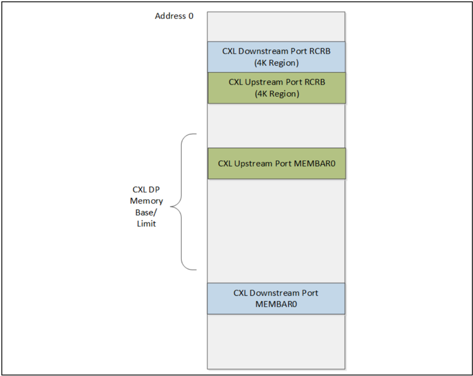

#### 8.2.1 CXL 1.1 Upstream and Downstream Port Registers

##### 8.2.1.1 CXL 1.1 Downstream Port RCRB

The CXL 1.1 Downstream Port RCRB is a 4K memory region that contains registers based upon the PCIe specification defined registers for a Root Port. [Figure 134](#figure-134-cxl-downstream-port-rcrb) illustrates the layout of the CXL RCRB for a Downstream Port. With the exception of the first DWORD, the first 64 bytes of the CXL DP RCRB implement the registers from a PCIe Type 1 Configuration Header. The first DWORD of the RCRB contains a NULL Extended Capability ID with a Version of 0h and a Next Capability Offset pointer. A 64bit MEMBAR0 is implemented at offset 10h and 14h; this points to a private memory region that hosts registers for configuring Downstream Port subsystem components as specified in [Table 137](#table-137-cxl-memory-mapped-registers-regions). The supported PCIe capabilities and extended capabilities are discovered by following the linked lists of pointers. Supported PCIe capabilities are mapped into the offset range from 040h to 0FFh. Supported PCIe extended capabilities are mapped into the offset range from 100h to FFFh. The CXL Downstream Port supported PCIe capabilities and extended capabilities are listed in [Table 138](#table-138-cxl-11-downstream-port-pcie-capabilities-and-extended-capabilities-sheet-1-of-2); please refer to the PCIe 5.0 Base Specification for definitions of the associated registers.

###### Figure 134. CXL Downstream Port RCRB

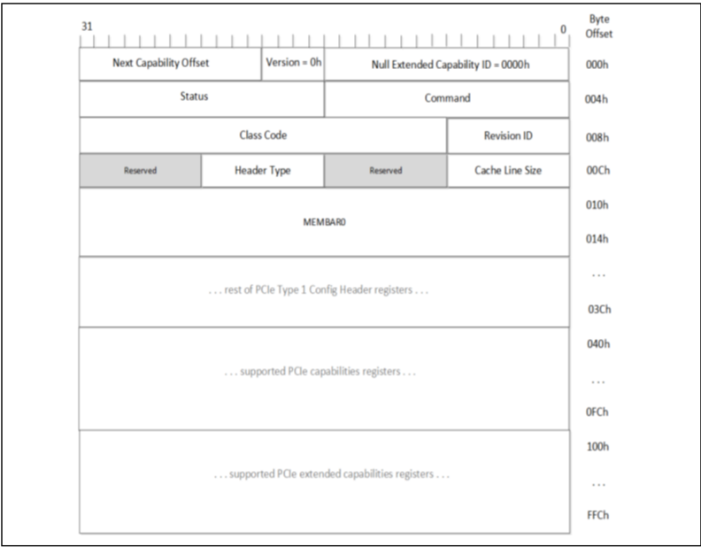

###### Table 138. CXL 1.1 Downstream Port PCIe Capabilities and Extended Capabilities

| PCIe Capabilities and Extended Capabilities   | Exceptions 1                                                                                                                       | Notes                                                                                                          |
|-----------------------------------------------|------------------------------------------------------------------------------------------------------------------------------------|----------------------------------------------------------------------------------------------------------------|
| PCI Express Capability                        | Slot Capabilities, Slot Control, Slot Status, Slot Capabilities 2, Slot Control 2, and Slot Status 2 registers are not applicable. | N/A                                                                                                            |
| PCI Power Management Capability               | Not Applicable. Software should ignore.                                                                                            | N/A                                                                                                            |
| MSI Capability                                | Not Applicable. Software should ignore.                                                                                            | N/A                                                                                                            |
| Advanced Error Reporting Extended Capability  | Not Applicable. Software should ignore.                                                                                            | Required for CXL device despite being optional for PCIe. Downstream Port is required to forward ERR_ messages. |
| ACS Extended Capability                       | None                                                                                                                               | N/A                                                                                                            |
| Multicast Extended Capability                 | Not Applicable. Software should ignore.                                                                                            | N/A                                                                                                            |

[Table 138](#table-138-cxl-11-downstream-port-pcie-capabilities-and-extended-capabilities-sheet-1-of-2). CXL 1.1 Downstream Port PCIe Capabilities and Extended Capabilities (Sheet 2 of 2)

| PCIe Capabilities and Extended Capabilities            | Exceptions 1                                                                                                         | Notes                                                               |
|--------------------------------------------------------|----------------------------------------------------------------------------------------------------------------------|---------------------------------------------------------------------|
| Downstream Port Containment Extended Capability        | Use with care. DPC trigger will bring down physical link, reset device state, disrupt CXL.cache and CXL.mem traffic. | N/A                                                                 |
| Designated Vendor-Specific Extended Capability (DVSEC) | None                                                                                                                 | Please refer to [Section 8.2.1.3](#8213-flex-bus-port-dvsec) for Flex Bus Port DVSEC definition. |
| Secondary PCI Express Extended Capability              | None                                                                                                                 | None                                                                |
| Data Link Feature Extended Capability                  | None                                                                                                                 | None                                                                |
| Physical Layer 16.0 GT/s Extended Capability           | None                                                                                                                 | None                                                                |
| Physical Layer 32.0 GT/s Extended Capability           | None                                                                                                                 | None                                                                |
| Lane Margining at the Receiver Extended Capability     | None                                                                                                                 | None                                                                |
| Alternate Protocol Extended Capability                 | None                                                                                                                 | None                                                                |

##### 8.2.1.2 CXL 1.1 Upstream Port RCRB

The CXL 1.1 Upstream Port RCRB is a 4K memory region that contains registers based upon the PCIe specification defined registers. The Upstream Port captures the upper address bits [63:12] of the first memory read received after link initialization as the base address for the Upstream Port RCRB. Figure 135 illustrates the layout of the CXL RCRB for an Upstream Port. With the exception of the first DW, the first 64 bytes of the CXL UP RCRB implement the registers from a PCIe Type 0 Configuration Header. The first DW of the RCRB contains a NULL Extended Capability ID with a Version of 0h and a Next Capability Offset pointer. A 64-bit BAR (labeled MEMBAR0) is implemented at offset 10h and 14h; this points to a memory region that hosts registers for configuring Upstream Port subsystem CXL.mem as specified in [Table 137](#table-137-cxl-memory-mapped-registers-regions). The supported PCIe capabilities and extended capabilities are discovered by following the linked lists of pointers. Supported PCIe capabilities are mapped into the offset range from 040h to 0FFh. Supported PCIe extended capabilities are mapped into the offset range from 100h to FFFh. The CXL Upstream Port supported PCIe capabilities and extended capabilities are listed in Table 139; please refer to the PCIe 5.0 Base Specification for definitions of the associated registers.

The following standard registers that are part of the PCI Type 0 header definition are considered reserved and have no effect on the behavior of CXL 1.1 Upstream Port:

- Command Register (Offset 04h)
- Status Register (Offset 06h).

Per PCIe Base Specification, the following registers in the PCI Express Capability are marked reserved for an RCiEP and shall not be implemented by the Device 0, Function 0 of the CXL 1.1 Device.

- Link Registers - Link Capabilities Register, Link Control Register, Link Status Register, Link Capabilities 2 Register, Link Control 2 Register and Link Status 2 Register

- Slot Registers - Slot Capabilities Register, Slot Control Register, Slot Status Register, Slot Capabilities 2 Register, Slot Control 2 Register and Slot Status 2 Register
- Root Port Registers - Root Capabilities Register, Root Control Register and Root Status Register.

Software must reference the Link Registers in the Upstream Port RCRB PCI Express Capability structure in order to discover the link capabilities and link status; and configure the link properties. These registers shall follow the PCIe Base Specification definition of an Upstream Switch Port. Software must set the ASPM Control field in the Link Control register if it wishes to enable CXL.io L1.

All fields in Upstream Port's Device Capabilities Register, Device Control Register, Device Status Register, Device Capabilities 2 Register, Device Control 2 Register and Device Status 2 Register are reserved.

The Device/Port Type, Slots Implemented and Interrupt Message Number fields in the Upstream Port's Capability Register are reserved.

###### Figure 135. CXL 1.1 Upstream Port RCRB

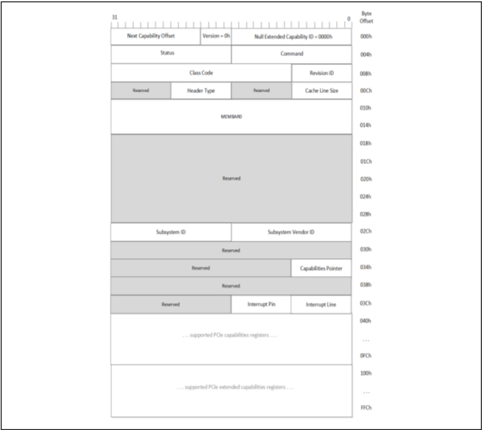

###### Table 139. CXL 1.1 Upstream Port PCIe Capabilities and Extended Capabilities

| PCIe Capabilities and Extended Capabilities            | Exceptions 1                            | Notes                                                                                                                                    |
|--------------------------------------------------------|-----------------------------------------|------------------------------------------------------------------------------------------------------------------------------------------|
| PCI Express Capability                                 | See [Section 8.2.1.2](#8212-cxl-11-upstream-port-rcrb).                    | None.                                                                                                                                    |
| Advanced Error Reporting Extended Capability           | Not Applicable. Software should ignore. | Required for CXL devices despite being optional for PCIe. Link/ Protocol errors detected by Upstream Port are logged/reported via RCiEP. |
| Virtual Channel Extended Capability                    | None                                    | VC0 and VC1                                                                                                                              |
| Designated Vendor-Specific Extended Capability (DVSEC) | None                                    | Please refer to [Section 8.2.1.3](#8213-flex-bus-port-dvsec) for Flex Bus Port DVSEC definition.                                                                      |
| Secondary PCI Express Extended Capability              | None                                    | None                                                                                                                                     |
| Data Link Feature Extended Capability                  | None                                    | None                                                                                                                                     |
| Physical Layer 16.0 GT/s Extended Capability           | None                                    | None                                                                                                                                     |
| Physical Layer 32.0 GT/s Extended Capability           | None                                    | None                                                                                                                                     |
| Lane Margining at the Receiver Extended Capability     | None                                    | None                                                                                                                                     |
| Alternate Protocol Extended Capability                 | None                                    | None                                                                                                                                     |

##### 8.2.1.3 Flex Bus Port DVSEC

All CXL ports implement a Flex Bus Port DVSEC. This DVSEC is located in the RCRBs of the 1.1 Upstream and 1.1 Downstream ports. CXL 1.1 ports may implement DVSEC Revision = 0 or 1 of this DVSEC. See [Table 124](#table-124-cxl-dvsec-id-assignment-sheet-2-of-2) for the complete listing. If a CXL 1.1 Port implements Revision = 1, software shall ignore certain fields that are specified as 'reserved for CXL 1.1' below.

This DVSEC is also located in the configuration space of CXL 2.0 Root Ports, Upstream Switch Ports, Downstream Switch Port and CXL 2.0 Device's primary function (Device 0, Function 0). CXL 2.0 components shall report DVSEC Revision = 1 of this DVSEC.

Figure 136 shows the layout of the Flex Bus Port DVSEC and [Table 140](#table-140-pci-express-dvsec-header-registers-settings-for-flex-bus-port) shows how the header1 and header2 registers shall be set. The following subsections give details of the registers defined in the Flex Bus Port DVSEC.

###### Figure 136. PCIe DVSEC for Flex Bus Port

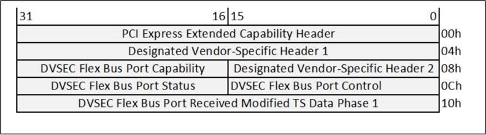

###### Table 140. PCI Express DVSEC Header Registers Settings for Flex Bus Port

| Register                                         | Bit Location   | Field           | Value                                 |
|--------------------------------------------------|----------------|-----------------|---------------------------------------|
| Designated Vendor-Specific Header 1 (Offset 04h) | 15:0           | DVSEC Vendor ID | 1E98h                                 |
| Designated Vendor-Specific Header 1 (Offset 04h) | 19:16          | DVSEC Revision  | 0x1:CXL 2.0, 0:CXL 1.1                |
| Designated Vendor-Specific Header 1 (Offset 04h) | 31:20          | DVSEC Length    | 10h for Revision 0 14h for Revision 1 |
| Designated Vendor-Specific Header 2 (Offset 08h) | 15:0           | DVSEC ID        | 0x7                                   |

###### 8.2.1.3.1 DVSEC Flex Bus Port Capability (Offset 0Ah)

Note:

The Mem_Capable, IO_Capable, and Cache_Capable fields are also present in the Flex Bus DVSEC for the device. This allows for future scalability where multiple devices, each with potentially different capabilities, may be populated behind a single Port.

| Bit   | Attributes   | Description                                                                                                                                                                                                                                                                                    |
|-------|--------------|------------------------------------------------------------------------------------------------------------------------------------------------------------------------------------------------------------------------------------------------------------------------------------------------|
| 0     | RO           | Cache_Capable: If set, indicates CXL.cache protocol support when operating in Flex Bus.CXL mode. This should be set to 0 for all functions of an MLD.                                                                                                                                          |
| 1     | RO           | IO_Capable: If set, indicates CXL.io protocol support when operating in Flex Bus.CXL mode. Must be 1.                                                                                                                                                                                          |
| 2     | RO           | Mem_Capable: If set, indicates CXL.mem protocol support when operating in Flex Bus.CXL mode. This must be 1 for all functions of an MLD.                                                                                                                                                       |
| 4:3   | RsvdP        | Reserved                                                                                                                                                                                                                                                                                       |
| 5     | RO           | CXL2p0_Capable: If set, indicates CXL Revision 2.0 functionality support available when operating in Flex Bus.CXL mode. This bit is reserved on CXL1.1 components. This must be 1 for all functions of an MLD.                                                                                 |
| 6     | RO           | CXL_Multi-Logical_Device_Capable: If set, indicates Multi-Logical Device support available when operating in Flex Bus.CXL mode. This bit is reserved on CXL 1.1 components. This bit must be set to 0 on CXL2.0 host Downstream ports. The value must be the same for all functions of an MLD. |
| 15:7  | RsvdP        | Reserved                                                                                                                                                                                                                                                                                       |

###### 8.2.1.3.2 DVSEC Flex Bus Port Control (Offset 0Ch)

The Flex Bus physical layer uses the values that software sets in this register as a starting point for alternate protocol negotiation as long as the corresponding bit in the Flex Bus Port Capability register is set. The Flex Bus physical layer shall sample the values in this register only during exit from the Detect LTSSM state; the physical layer shall ignore any changes to this register in all other LTSSM states.

| Bit   | Attributes                              | Description                                                                                                                                                                                                                                                                                                                               |
|-------|-----------------------------------------|-------------------------------------------------------------------------------------------------------------------------------------------------------------------------------------------------------------------------------------------------------------------------------------------------------------------------------------------|
| 0     | RW if Downstream Port, HwInit otherwise | Cache_Enable: When set, enables CXL.cache protocol operation when in Flex Bus.CXL mode. Default value of this field is 0.                                                                                                                                                                                                                 |
| 1     | RO                                      | IO_Enable: When set, enables CXL.io protocol operation when in Flex Bus.CXL mode. (Must always be set to 1)                                                                                                                                                                                                                               |
| 2     | RW if Downstream Port, HwInit otherwise | Mem_Enable: When set, enables CXL.mem protocol operation when in Flex Bus.CXL mode. Default value of this field is 0.                                                                                                                                                                                                                     |
| 3     | RW if Downstream Port, HwInit otherwise | CXL_Sync_Hdr_Bypass_Enable: When set, enables bypass of the 2-bit sync header by the Flex Bus physical layer when operating in Flex Bus.CXL mode. This is a performance optimization. Default value of this field is 0.                                                                                                                   |
| 4     | RW if Downstream Port, HwInit otherwise | Drift_Buffer_Enable: When set, enables drift buffer (instead of elastic buffer) if there is a common reference clock. Default value of this field is 0.                                                                                                                                                                                   |
| 5     | RW if Downstream Port, HwInit otherwise | CXL2p0_Enable: When set, enable CXL2.0 protocol operation when in Flex Bus.CXL mode. This bit is reserved on CXL1.1 components. Default value of this field is 0.                                                                                                                                                                         |
| 6     | RW if Downstream Port, HwInit otherwise | CXL_Multi-Logical_Device_Enable: When set, enable Multi-Logical Device operation when in Flex Bus.CXL mode. This bit is reserved on CXL1.1 components. This bit shall always be set to 0 for CXL2.0 host Downstream ports. Default value of this field is 0.                                                                              |
| 7     | RW if Downstream Port, HwInit otherwise | Disable_CXL1p1_Training: When set, CXL1.0 training is disabled. Typical usage model is that System Firmware will use this bit to disable hot plug of CXL1.1 devices below a CXL2.0 Downstream Port. This bit is reserved on all CXL Upstream ports and on CXL1.1 components. Default value of this field is 0.                            |
| 8     | RW if Downstream Port, RsvdP otherwise  | Retimer1_Present: When set, indicates presence of retimer1. This bit is defined only for a Downstream Port. This bit is reserved for an Upstream Port. Default value of this field is 0. This bit is only used by CXL1.1 Downstream Ports. Downstream Ports compliant to CXL Specification 2.0 and later revisions shall ignore this bit. |
| 9     | RW if Downstream Port, RsvdP otherwise  | Retimer2_Present: When set, indicates presence of retimer2. This bit is defined only for a Downstream Port. This bit is reserved for an Upstream Port. Default value of this field is 0. This bit is only used by CXL1.1 Downstream Ports. Downstream Ports compliant to CXL Specification 2.0 and later revisions shall ignore this bit. |
| 15:10 | RsvdP                                   | Reserved                                                                                                                                                                                                                                                                                                                                  |

###### 8.2.1.3.3 DVSEC Flex Bus Port Status (Offset 0Eh)

The Flex Bus physical layer reports the results of alternate protocol negotiation in this register.

|   Bit | Attributes   | Description                                                                                                                                            |
|-------|--------------|--------------------------------------------------------------------------------------------------------------------------------------------------------|
|     0 | RO           | Cache_Enabled: When set, indicates that CXL.cache protocol operation has been enabled as a result of PCIe alternate protocol negotiation for Flex Bus. |
|     1 | RO           | IO_Enabled: When set, indicates that CXL.io protocol operation has been enabled as a result of PCIe alternate protocol negotiation for Flex Bus.       |
|     2 | RO           | Mem_Enabled: When set, indicates that CXL.mem protocol operation has been enabled as a result of PCIe alternate protocol negotiation for Flex Bus.     |
| 3     | RO           | CXL_Sync_Hdr_Bypass_Enabled: When set, indicates that bypass of the 2-bit sync header by the Flex Bus physical layer has been enabled when operating in Flex Bus.CXL mode as a result of PCIe alternate protocol negotiation for Flex Bus.                                                                                                                                                                                                                                            |
| 4     | RO           | Drift_Buffer_Enabled: When set, indicates that the physical layer has enabled its drift buffer instead of its elastic buffer.                                                                                                                                                                                                                                                                                                                                                         |
| 5     | RO           | CXL2p0_Enabled: When set, indicates that CXL2.0 protocol operation has been enabled as a result of PCIe alternate protocol negotiation for Flex Bus.                                                                                                                                                                                                                                                                                                                                  |
| 6     | RO           | CXL_Multi-Logical_Device_Enabled: When set, indicates that CXL Multi-Logical Device operation has been negotiated.                                                                                                                                                                                                                                                                                                                                                                    |
| 7     | RsvdZ        | Reserved                                                                                                                                                                                                                                                                                                                                                                                                                                                                              |
| 8     | RW1CS        | CXL_Correctable_Protocol_ID_Framing_Error: See [Section 6.2.2](#622-protocol-id150) for more details.                                                                                                                                                                                                                                                                                                                                                                                                        |
| 9     | RW1CS        | CXL_Uncorrectable_Protocol_ID_Framing_Error: See [Section 6.2.2](#622-protocol-id150) for more details.                                                                                                                                                                                                                                                                                                                                                                                                      |
| 10    | RW1CS        | CXL_Unexpected_Protocol_ID_Dropped: When set, indicates that the physical layer dropped a flit with an unexpected protocol ID that is not due to an Uncorrectable Protocol ID Framing Error. See [Section 6.2.2](#622-protocol-id150) for more details                                                                                                                                                                                                                                                       |
| 11    | RW1CS        | CXL_Retimers_Present_Mismatched: When set, indicates that the Downstream Port physical layer detected an inconsistency in the 'Retimers Present' or 'Two Retimers Present' bits in the received TS2 Ordered Sets during Polling.Config versus Config.Complete LTSSM states. The physical layer will force disable of the sync header bypass optimization when this error condition has been detected. See [Section 6.3.1.2.1](#63121-retimer-presence-detection) for more details. This bit is reserved on Upstream Ports. |
| 12    | RW1CS        | FlexBusEnableBits_Phase2_Mismatch: When set, indicates that the Downstream Port physical layer detected that the Upstream Port did not reflect precisely the Flex Bus enable bits located in symbols 12-14 of the modified TS2 during Phase 2 of the negotiation. Please refer to [Section 6.3.1.1](#6311-hardware-autonomous-mode-negotiation) for more details. This bit is reserved on Upstream Ports.                                                                                                                           |
| 15:13 | RsvdZ        | Reserved ().                                                                                                                                                                                                                                                                                                                                                                                                                                                                          |

###### 8.2.1.3.4 DVSEC Flex Bus Port Received Modified TS Data Phase1 (Offset 10h)

If CXL alternate protocol negotiation is enabled and the 'Modified TS Received' bit is set in the PCIe register '32GT/s Status Register', then this register contains the values received in Symbols 12 through 14 of the Modified TS1 Ordered Set during Phase1 of CXL alternate protocol negotiation. This register is not defined in the CXL1.1 specification.

| Bit   | Attributes   | Description                                                                                                                                                                            |
|-------|--------------|----------------------------------------------------------------------------------------------------------------------------------------------------------------------------------------|
| 23:0  | RO           | Received_Flex_Bus_Data_Phase_1: This field contains the values received in Symbols 12 through 14 of the Modified TS1 Ordered Set during Phase 1 of CXL alternate protocol negotiation. |
| 31:24 | RsvdZ        | Reserved.                                                                                                                                                                              |

#### 8.2.2 CXL 1.1 Upstream and Downstream Port Subsystem Component Registers

The CXL 1.1 Upstream and Downstream Port subsystem components implement registers in memory space allocated via the MEMBAR0 register. In general, these registers are expected to be implementation specific; [Section 8.2.4](#824-component-register-layout-and-definition) defines the architected registers. [Table 141](#table-141-cxl-subsystem-component-register-ranges) lists the relevant offset ranges from MEMBAR0 for CXL.io, CXL.cache, CXL.mem, and CXL ARB/MUX registers.

Software shall use CXL.io Memory Read and Write to access CXL Component registers defined in [Section 8.2.5](#825-cxlcache-and-cxlmem-registers) and [Section 8.2.6](#826-cxl-arbmux-registers). Software shall restrict the accesses width based on the following rules:

- A 32 bit register shall be accessed as a 4 Bytes quantity. Partial reads are not permitted.
- A 64 bit register shall be accessed as a 8 Bytes quantity. Partial reads are not permitted.
- The accesses shall map to contiguous bytes.

If these rules are not followed, the behavior is undefined. Note that these rules are more stringent than the general rules for memory mapped registers that are specified in [Section 8.2](#82-memory-mapped-registers).

#### 8.2.3 CXL 2.0 Component Registers

CXL 2.0 Component Registers may be specific to a CXL 2.0 Port or may cover more than one Port. See Figure 152 and Figure 153.

The CXL 2.0 Port specific component registers are mapped in memory space allocated via a standard PCIe BAR. The Register Locator DVSEC structure ([Section 8.1.9](#819-register-locator-dvsec)) describes the BAR number and the offset within the BAR where these registers are mapped.

CXL 2.0 Root Complex may contain Component Registers that control the functionality of one or more CXL 2.0 Root Ports. These are labeled CHBCR. These registers are also mapped in memory space, and the base address is discovered via ACPI CEDT Table.

The access restrictions specified in [Section 8.2.2](#822-cxl-11-upstream-and-downstream-port-subsystem-component-registers) also apply to CXL 2.0 Component Registers.

#### 8.2.4 Component Register Layout and Definition

##### Table 141. CXL Subsystem Component Register Ranges

| Range                   | Size   | Destination                     |
|-------------------------|--------|---------------------------------|
| 0000_0000h - 0000_0FFFh | 4K     | CXL.io registers                |
| 0000_1000h - 0000_1FFFh | 4K     | CXL.cache and CXL.mem registers |
| 0000_2000h - 0000_DFFFh | 48K    | Implementation specific         |
| 0000_E000h - 0000_E3FFh | 1K     | CXL ARB/MUX registers           |
| 0000_E400h - 0000_FFFFh | 7K     | Reserved                        |

The layout and discovery mechanism of the Component Register is identical for CXL 1.1 Upstream Ports, CXL 1.1 Downstream Ports, CXL 2.0 Ports and CXL 2.0 Host Bridges (CHBCR). [Table 141](#table-141-cxl-subsystem-component-register-ranges) lists the relevant offset ranges from the Base of the Component Register Block for CXL.io, CXL.cache, CXL.mem, and CXL ARB/MUX registers.

#### 8.2.5 CXL.cache and CXL.mem Registers

Within the 4KB region of memory space assigned to CXL.cache and CXL.mem, the location of architecturally specified registers will be described using an array of pointers. The array, described in [Table 144](#table-144-cxlcache-and-cxlmem-architectural-register-header-example), will be located starting at offset 0x0 of this 4KB region. The first element of the array will declare the version of CXL.cache and CXL.mem protocol as well as the size of the array. Each subsequent element will then host the pointers to capability specific register blocks within the 4KB region.

For each capability ID, CXL_Capability_Version field is incremented whenever the structure is extended to add more functionality. Backward compatibility shall be maintained during this process. For all values of n, CXL_Capability_Version=n+1 structure may extend CXL_Capability_Version=n by replacing fields that are marked as reserved in CXL_Capability_Version= n, but shall not redefine the meaning of existing fields. Software that was written for a lower CXL_Capability_Version may continue to operate on structures with a higher CXL_Capability_Version, but will not be able to take advantage of new functionality.

CXL_Capability_ID field represents the functionality and CXL_Capability_Version represents the version of the structure. The following values of CXL_Capability_ID are defined by CXL specification.

##### Table 142. CXL_Capability_ID Assignment

| Capability                                          |   ID |   Highest version | Mandatory 1                             | Not Permitted                      | Optional              |
|-----------------------------------------------------|------|-------------------|-----------------------------------------|------------------------------------|-----------------------|
| CXL Capability ([Section 8.2.5.1](#8251-cxl-capability-header-register-offset-0x0))                    |    1 |                 1 | D1, D2, LD, FMLD, UP1, DP1, R, USP, DSP | P                                  |                       |
| CXL RAS Capability ([Section 8.2.5.9](#8259-cxl-ras-capability-structure))                |    2 |                 2 | D1, D2, LD, FMLD, UP1, DP1, R, USP, DSP | P                                  |                       |
| CXL Security Capability ([Section 8.2.5.10](#82510-cxl-security-capability-structure))          |    3 |                 1 | DP1                                     | All others                         |                       |
| CXL Link Capability ([Section 8.2.5.11](#82511-cxl-link-capability-structure))              |    4 |                 1 | D1, D2, LD, FMLD, UP1, DP1, R, USP, DSP | P                                  |                       |
| CXL HDM Decoder_Capability ([Section 8.2.5.12](#82512-cxl-hdm-decoder-capability-structure))       |    5 |                 1 | Type 3 D2, LD, R, USP                   | All others                         | Type 2 D2             |
| CXL Extended Security Capability ([Section 8.2.5.13](#82513-cxl-extended-security-capability-structure)) |    6 |                 1 | R                                       | All others                         |                       |
| CXL IDE Capability([Section 8.2.5.14](#82514-cxl-ide-capability-structure))                |    7 |                 1 |                                         | P, D1, LD, UP1, DP1,               | D2, FMLD, R, USP, DSP |
| CXL Snoop Filter Capability ([Section 8.2.5.14.5](#825145-key-refresh-time-capability-offset-10h))    |    8 |                 1 | R                                       | P, D1, D2, LD, FMLD, UP1, USP, DSP | DP1                   |

##### Table 143. CXL.cache and CXL.mem Architectural Register Discovery

| Offset                                                         | Register Name                                                                                                                                                                                                                                                                                                                                |
|----------------------------------------------------------------|----------------------------------------------------------------------------------------------------------------------------------------------------------------------------------------------------------------------------------------------------------------------------------------------------------------------------------------------|
| 0x0                                                            | CXL_Capability_Header                                                                                                                                                                                                                                                                                                                        |
| 0x4 (Length =n*4, where n is the number of capability headers) | An array of individual capability headers. CXL 1.1 defined capabilities are - • CXL_RAS_Capability_Header, • CXL_Security_Capability_Header, • CXL_Link_Capability_Header CXL 2.0 introduces • CXL_HDM_Decoder_Capability_Header • CXL_Extended_ Security_Capability_Header • CXL_IDE_Capability_Header • CXL_Snoop_Filter_Capability_Header |

##### Table 144. CXL.cache and CXL.mem Architectural Register Header Example

| Offset   | Register Name                  |
|----------|--------------------------------|
| 0x0      | CXL_Capability_Header          |
| 0x4      | CXL_RAS_Capability_Header      |
| 0x8      | CXL_Security_Capability_Header |
| 0xC      | CXL_Link_Capability_Header     |

##### 8.2.5.1 CXL Capability Header Register (Offset 0x0)

| Bit Location   | Attributes   | Description                                                                                                                                                                                                             |
|----------------|--------------|-------------------------------------------------------------------------------------------------------------------------------------------------------------------------------------------------------------------------|
| 15:0           | RO           | CXL_Capability_ID: This defines the nature and format of the CXL_Capability register. For the CXL_Capability_Header register, this field must be 0x1.                                                                   |
| 19:16          | RO           | CXL_Capability_Version: This defines the version number of the CXL_Capability structure present. For this the prior version of the specification, this field must be 0x1.                                               |
| 23:20          | RO           | CXL_Cache_Mem_Version: This defines the version of the CXL Cache Mem Protocol supported. For this and the prior versions of the specification, this field must be 0x1.                                                  |
| 31:24          | RO           | Array_Size: This defines the number of elements present in the CXL_Capability array, not including the CXL_Capability_Header element. Each element is 1 DWORD in size and is located contiguous with previous elements. |

##### 8.2.5.2 CXL RAS Capability Header (Offset: Varies)

| Bit Location   | Attributes   | Description                                                                                                                                                     |
|----------------|--------------|-----------------------------------------------------------------------------------------------------------------------------------------------------------------|
| 15:0           | RO           | CXL_Capability_ID: This defines the nature and format of the CXL_Capability register. For the CXL_RAS_Capability_Pointer register, this field shall be 0x2.     |
| 19:16          | RO           | CXL_Capability_Version: This defines the version number of the CXL_Capability structure present. For this version of the specification, this field must be 0x2. |
| 31:20          | RO           | CXL_RAS_Capability_Pointer: This defines the offset of the CXL_Capability relative to beginning of CXL_Capability_Header register. Details in [Section 8.2.5.9](#8259-cxl-ras-capability-structure).  |

##### 8.2.5.3 CXL Security Capability Header (Offset: Varies)

| Bit Location   | Attributes   | Description                                                                                                                                                         |
|----------------|--------------|---------------------------------------------------------------------------------------------------------------------------------------------------------------------|
| 15:0           | RO           | CXL_Capability_ID: This defines the nature and format of the CXL_Capability register. For the CXL_Security_Capability_Pointer register, this field shall be 0x3.    |
| 19:16          | RO           | CXL_Capability_Version: This defines the version number of the CXL_Capability structure present. For this version of the specification, this field must be 0x1.     |
| 31:20          | RO           | CXL_Security_Capability_Pointer: This defines the offset of the CXL_Capability relative to beginning of CXL_Capability_Header register. Details in [Section 8.2.5.10](#82510-cxl-security-capability-structure) |

##### 8.2.5.4 CXL Link Capability Header (Offset:Varies)

| Bit Location   | Attributes   | Description                                                                                                                                                                                                                                       |
|----------------|--------------|---------------------------------------------------------------------------------------------------------------------------------------------------------------------------------------------------------------------------------------------------|
| 15:0           | RO           | CXL_Capability_ID: This defines the nature and format of the CXL_Capability register. For the CXL_Link_Capability_Pointer register, this field shall be 0x4.                                                                                      |
| 19:16          | RO           | CXL_Capability_Version: This defines the version number of the CXL_Capability structure present. Version 0x1 represents the structure as defined in CXL 1.1 specification. Version 0x2 represents the structure as defined in this specification. |
| 31:20          | RO           | CXL_Link_Capability_Pointer: This defines the offset of the CXL_Capability relative to beginning of CXL_Capability_Header register. Details in [Section 8.2.5.11](#82511-cxl-link-capability-structure)                                                                                   |

##### 8.2.5.5 CXL HDM Decoder Capability Header (Offset: Varies)

| Bit Location   | Attributes   | Description                                                                                                                                                            |
|----------------|--------------|------------------------------------------------------------------------------------------------------------------------------------------------------------------------|
| 15:0           | RO           | CXL_Capability_ID: This defines the nature and format of the CXL_Capability register. For the CXL_HDM_Decoder_Capability_Pointer register, this field shall be 0x5.    |
| 19:16          | RO           | CXL_Capability_Version: This defines the version number of the CXL_Capability structure present. For this version of the specification, this field must be 0x1.        |
| 31:20          | RO           | CXL_HDM_Decoder_Capability_Pointer: This defines the offset of the CXL_Capability relative to beginning of CXL_Capability_Header register. Details in [Section 8.2.5.12](#82512-cxl-hdm-decoder-capability-structure) |

##### 8.2.5.6 CXL Extended Security Capability Header (Offset: Varies)

| Bit Location   | Attributes   | Description                                                                                                                                                                  |
|----------------|--------------|------------------------------------------------------------------------------------------------------------------------------------------------------------------------------|
| 15:0           | RO           | CXL_Capability_ID: This defines the nature and format of the CXL_Capability register. For the CXL_Extended Security_Capability_Pointer register, this field shall be 0x6.    |
| 19:16          | RO           | CXL_Capability_Version: This defines the version number of the CXL_Capability structure present. For this version of the specification, this field must be 0x1.              |
| 31:20          | RO           | CXL_Extended_Security_Capability_Pointer: This defines the offset of the CXL_Capability relative to beginning of CXL_Capability_Header register. Details in [Section 8.2.5.13](#82513-cxl-extended-security-capability-structure) |

##### 8.2.5.7 CXL IDE Capability Header (Offset: Varies)

This capability header is present in all ports that implement CXL IDE.

| Bit Location   | Attributes   | Description                                                                                                                                                         |
|----------------|--------------|---------------------------------------------------------------------------------------------------------------------------------------------------------------------|
| 15:0           | RO           | CXL_Capability_ID: This defines the nature and format of the CXL_Capability register. For the CXL_IDE_Capability_Header register, this field shall be 0x7.          |
| 19:16          | RO           | CXL_Capability_Version: This defines the version number of the CXL_Capability structure present. For this version of the specification, this field must be 0x1.     |
| 31:20          | RO           | CXL IDE Capability Pointer: This defines the offset of the CXL IDE Capability relative to beginning of CXL_Capability_Header register. Details in [Section 8.2.5.14](#82514-cxl-ide-capability-structure). |

##### 8.2.5.8 CXL Snoop Filter Capability Header (Offset: Varies)

This capability header is required for Root Ports and optional for CXL 1.1 Downstream Ports.

| Bit Location   | Attributes   | Description                                                                                                                                                                           |
|----------------|--------------|---------------------------------------------------------------------------------------------------------------------------------------------------------------------------------------|
| 15:0           | RO           | CXL_Capability_ID: This defines the nature and format of the CXL_Capability register. For the CXL_Snoop_Filter_Capability_Header register, this field shall be 0x8.                   |
| 19:16          | RO           | CXL_Capability_Version: This defines the version number of the CXL_Capability structure present. For this version of the specification, this field shall be 0x1.                      |
| 31:20          | RO           | CXL Snoop Filter Capability Pointer: This defines the offset of the CXL Snoop Filter Capability relative to beginning of CXL_Capability_Header register. Details in [Section 8.2.5.15](#82515-cxl-snoop-filter-capability-structure). |

##### 8.2.5.9 CXL RAS Capability Structure

| Offset   | Register Name                         |
|----------|---------------------------------------|
| 0x0      | Uncorrectable Error Status Register   |
| 0x4      | Uncorrectable Error Mask Register     |
| 0x8      | Uncorrectable Error Severity Register |
| 0xC      | Correctable Error Status Register     |
| 0x10     | Correctable Error Mask Register       |
| 0x14     | Error Capability and Control Register |
| 0x18     | Header Log Registers                  |

###### 8.2.5.9.1 Uncorrectable Error Status Register (Offset 0x0)

| Bit Location   | Attributes   | Description                                                                                                                                                                                                                                 |
|----------------|--------------|---------------------------------------------------------------------------------------------------------------------------------------------------------------------------------------------------------------------------------------------|
| 0              | RW1CS        | Cache_Data_Parity: Internal Data Parity error on CXL.cache. Header Log contains H2D Data Header.                                                                                                                                            |
| 1              | RW1CS        | Cache_Address _Parity: Internal Address Parity error on CXL.cache. Header Log contains H2D Data Header.                                                                                                                                     |
| 2              | RW1CS        | Cache_BE_Parity: Internal Byte Enable Parity error on CXL.cache. Header Log contains H2D Data Header.                                                                                                                                       |
| 3              | RW1CS        | Cache_Data_ECC: Internal Data ECC error on CXL.cache. Header Log contains H2D Data Header.                                                                                                                                                  |
| 4              | RW1CS        | Mem_Data_Parity: Internal Data Parity error on CXL.mem. Header Log contains M2S RwD Data Header.                                                                                                                                            |
| 5              | RW1CS        | Mem_Address_Parity: Internal Address Parity error on CXL.mem. If Bit 0 of Header Log is '0, rest of Header Log contains M2S Req. If Bit 0 of Header Log is '1, rest of Header Log contains M2S RwD Data Header.                             |
| 6              | RW1CS        | Mem_BE_Parity : Internal Byte Enable Parity error on CXL.mem. Header Log contains M2S RwD Data Header.                                                                                                                                      |
| 7              | RW1CS        | Mem_Data_ECC: Internal Data ECC error on CXL.mem. Header Log contains M2S RwD Data Header.                                                                                                                                                  |
| 8              | RW1CS        | REINIT_Threshold: REINIT Threshold Hit. Header Log not applicable.                                                                                                                                                                          |
| 9              | RW1CS        | Rsvd_Encoding_Violation: Received unrecognized encoding. Header Log contains the entire flit received.                                                                                                                                      |
| 10             | RW1CS        | Poison_Received: Received Poison from the peer.                                                                                                                                                                                             |
| 11             | RW1CS        | Receiver_Overflow: First 3b of the Header Log are relevant and should be interpreted as such: 3'b000 --> D2H Req 3'b001 --> D2H Rsp 3'b010 --> D2H Data 3'b100 --> S2M NDR 3'b101 --> S2M DRS The above shows which buffer had the overflow |
| 13:12         | RsvdZ        | Reserved (Do not use)                                                                                                                                                                                                                       |
| 14             | RW1CS        | Internal_Error: Component specific error                                                                                                                                                                                                    |
| 15             | RW1CS        | CXL_IDE_Tx_Error: See [Section 8.2.5.14.4](#825144-cxl-ide-error-status-offset-0ch) for the next level details.                                                                                                                                                                        |
| 16             | RW1CS        | CXL_IDE_Rx_Error: See [Section 8.2.5.14.4](#825144-cxl-ide-error-status-offset-0ch) for the next level details.                                                                                                                                                                        |
| 31:17          | RsvdZ        | Reserved                                                                                                                                                                                                                                    |

###### 8.2.5.9.2 Uncorrectable Error Mask Register (Offset 0x4)

The Uncorrectable Error Mask Register controls reporting of individual errors. When a bit is set, the corresponding error status bit in Uncorrectable Error Status Register upon the error event is not set, the error is not recorded or reported in the Header Log and is not signaled.

| Bit Location   | Attributes   | Description                                                    |
|----------------|--------------|----------------------------------------------------------------|
| 0              | RWS          | Cache_Data_Parity_Mask Default value for this field is 1.      |
| 1              | RWS          | Cache_Address_Parity_Mask Default value for this field is 1    |
| 2              | RWS          | Cache_BE_Parity_Mask Default value for this field is 1         |
| 3              | RWS          | Cache_Data_ECC_Mask Default value for this field is 1          |
| 4              | RWS          | Mem_Data_Parity_Mask Default value for this field is 1         |
| 5              | RWS          | Mem_Address_Parity_Mask Default value for this field is 1      |
| 6              | RWS          | Mem_BE_Parity_Mask Default value for this field is 1           |
| 7              | RWS          | Mem_Data_ECC_Mask Default value for this field is 1            |
| 8              | RWS          | REINIT_Threshold_Mask Default value for this field is 1        |
| 9              | RWS          | Rsvd_Encoding_Violation_Mask Default value for this field is 1 |
| 10             | RWS          | Poison_Received_Mask Default value for this field is 1         |
| 11             | RWS          | Receiver_Overflow_Mask                                         |
| 13:12          | RsvdP        | Reserved (Do not use)                                          |
| 14             | RWS          | Internal_Error_Mask: Default value for this field is 1         |
| 15             | RWS          | CXL_IDE_Tx_Mask Default value for this field is 1              |
| 16             | RWS          | CXL_IDE_Rx_Mask Default value for this field is 1              |
| 31:17          | RsvdP        | Reserved                                                       |

###### 8.2.5.9.3 Uncorrectable Error Severity Register (Offset 0x8)

The Uncorrectable Error Severity Register controls whether an individual error is reported as a Non-fatal or Fatal error. An error is reported as fatal uncorrectable when the corresponding error bit in the severity register is Set. If the bit is Clear , the corresponding error is reported as non-fatal uncorrectable error.

|   Bit Location | Attributes   | Description                                                      |
|----------------|--------------|------------------------------------------------------------------|
|              0 | RWS          | Cache_Data_Parity_Severity Default value for this field is 1     |
|              1 | RWS          | Cache_Address _Parity_Severity Default value for this field is 1 |
|              2 | RWS          | Cache_BE_Parity_Severity Default value for this field is 1       |
|              3 | RWS          | Cache_Data_ECC_Severity Default value for this field is 1        |

| Bit Location   | Attributes   | Description                                                        |
|----------------|--------------|--------------------------------------------------------------------|
| 4              | RWS          | Mem_Data_Parity_Severity Default value for this field is 1         |
| 5              | RWS          | Mem_Address_Parity_Severity Default value for this field is 1      |
| 6              | RWS          | Mem_BE_Parity_Severity Default value for this field is 1           |
| 7              | RWS          | Mem_Data_ECC_Severity Default value for this field is 1            |
| 8              | RWS          | REINIT_Threshold_Severity Default value for this field is 1        |
| 9              | RWS          | Rsvd_Encoding_Violation_Severity Default value for this field is 1 |
| 10             | RWS          | Poison_Received_Severity Default value for this field is 1         |
| 11             | RWS          | Receiver_Overflow_Severity Default value for this field is 1       |
| 13:12          | RsvdP        | Reserved (Do not use)                                              |
| 14             | RWS          | Internal_Error_Severity: Default value for this field is 1         |
| 15             | RWS          | CXL_IDE_Tx_Severity Default value for this field is 1              |
| 16             | RWS          | CXL_IDE_Rx_Severity Default value for this field is 1              |
| 31:17          | RsvdP        | Reserved                                                           |

## Correctable Error Status Register (Offset 0xC)

| Bit Location   | Attributes   | Description                                                         |
|----------------|--------------|---------------------------------------------------------------------|
| 0              | RW1CS        | Cache_Data_ECC: Internal Data ECC error on CXL.cache.               |
| 1              | RW1CS        | Mem_Data_ECC: Internal Data ECC error on CXL.mem.                   |
| 2              | RW1CS        | CRC_Threshold: CRC Threshold Hit                                    |
| 3              | RW1CS        | Retry_Threshold: Retry Threshold Hit                                |
| 4              | RW1CS        | Cache_Poison_Received: Received Poison from the peer on CXL.cache.  |
| 5              | RW1CS        | Mem_Poison_Received: Received Poison from the peer on CXL.mem.      |
| 6              | RW1CS        | Physical_Layer_Error: Received error indication from Physical Layer |
| 31:7           | RsvdZ        | Reserved                                                            |

###### 8.2.5.9.4 Correctable Error Mask Register (Offset 0x10)

The Correctable Error Mask Register controls reporting of individual errors. When a bit is set in this register , the corresponding error status bit is not set upon the error event, and the error is not signaled.

| Bit Location   | Attributes   | Description                                                   |
|----------------|--------------|---------------------------------------------------------------|
| 0              | RWS          | Cache_Data_ECC_Mask Default value for this field is 1         |
| 1              | RWS          | Mem_Data_ECC_Mask Default value for this field is 1           |
| 2              | RWS          | CRC_Threshold_Mask Default value for this field is 1          |
| 3              | RWS          | Retry_Threshold_Mask Default value for this field is 1        |
| 4              | RWS          | Cache_Poison_Received_Mask .Default value for this field is 1 |
| 5              | RWS          | Mem_Poison_Received_Mask Default value for this field is 1    |
| 6              | RWS          | Physical_Layer_Error_Mask Default value for this field is 1   |
| 31:7           | RsvdP        | Reserved                                                      |

###### 8.2.5.9.5 Error Capabilities and Control Register (Offset 0x14)

| Bit Location   | Attributes   | Description                                                                                                                                                                                                                                                                                                                                                                                                                                                                                                                                         |
|----------------|--------------|-----------------------------------------------------------------------------------------------------------------------------------------------------------------------------------------------------------------------------------------------------------------------------------------------------------------------------------------------------------------------------------------------------------------------------------------------------------------------------------------------------------------------------------------------------|
| 5:0            | ROS          | First_Error_Pointer: This identifies the bit position of the first error reported in the Uncorrectable Error Status register.                                                                                                                                                                                                                                                                                                                                                                                                                       |
| 8:6            | RsvdP        | Reserved                                                                                                                                                                                                                                                                                                                                                                                                                                                                                                                                            |
| 9              | RO           | Multiple_Header_Recording_Capability: If this bit is set, it indicates if recording more than one error header is supported.                                                                                                                                                                                                                                                                                                                                                                                                                        |
| 12:10          | RsvdP        | Reserved                                                                                                                                                                                                                                                                                                                                                                                                                                                                                                                                            |
| 13             | RWS          | Poison_Enabled: If this bit is 0, CXL 1.1 Upstream Ports, CXL 1.1 Downstream Ports and CXL 2.0 Root Port shall treat poison received on CXL.cache or CXL.mem as uncorrectable error and log the error in Uncorrectable Error Status Register. If this bit is 1, these ports shall treat poison received on CXL.cache or CXL.mem as correctable error and log the error in Correctable Error Status Register. This bit defaults to 1. This bit is hardwired to 1 in CXL 2.0 Upstream Switch Port, CXL 2.0 Downstream Switch Port and CXL 2.0 device. |
| 31:14          | RsvdZ        | Reserved                                                                                                                                                                                                                                                                                                                                                                                                                                                                                                                                            |

###### 8.2.5.9.6 Header Log Registers (Offset 0x18)

| Bit Location   | Attributes   | Description                                                                                                                                                                                                                                                                                                                             |
|----------------|--------------|-----------------------------------------------------------------------------------------------------------------------------------------------------------------------------------------------------------------------------------------------------------------------------------------------------------------------------------------|
| 511:0          | ROS          | Header Log: The information logged here depends on the type of Uncorrectable Error Status bit recorded as described in [Section 8.2.5.9.1](#82591-uncorrectable-error-status-register-offset-0x0). If multiple errors are logged in Uncorrectable Error Status register, First_Error_Pointer field in Error Capabilities and Control Register identifies the error that this log corresponds to. |

##### 8.2.5.10 CXL Security Capability Structure

This capability structure only applies for CXL 1.1 Downstream Port.

| Offset   | Register Name                |
|----------|------------------------------|
| 0x0      | CXL Security Policy Register |

###### 8.2.5.10.1 CXL Security Policy Register (Offset 0x0)

###### Table 145. Device Trust Level

| Bit Location   | Attributes   | Description                                                                                                                                                                                                                                                                                                                                                                                                                                                                                                                                                                                                                                                                                                                                                                                                                                                          |
|----------------|--------------|----------------------------------------------------------------------------------------------------------------------------------------------------------------------------------------------------------------------------------------------------------------------------------------------------------------------------------------------------------------------------------------------------------------------------------------------------------------------------------------------------------------------------------------------------------------------------------------------------------------------------------------------------------------------------------------------------------------------------------------------------------------------------------------------------------------------------------------------------------------------|
| 1:0            | RW           | Device Trust Level: '0 --> Trusted CXL Device. At this setting, a CXL Device will be able to get access on CXL.cache for both host-attached and device attached memory ranges. The Host can still protect security sensitive memory regions. '1 --> Trusted for Device Attached Memory Range Only. At this setting, a CXL Device will be able to get access on CXL.cache for device attached memory ranges only. Requests on CXL.cache for host-attached memory ranges will be aborted by the Host. '2 --> Untrusted CXL Device. At this setting, all requests on CXL.cache will be aborted by the Host. Please note that these settings only apply to requests on CXL.cache. The device can still source requests on CXL.io regardless of these settings. Protection on CXL.io will be implemented using IOMMU based page tables. Default value of this field is 2. |
| 31:2           | RsvdP        | Reserved                                                                                                                                                                                                                                                                                                                                                                                                                                                                                                                                                                                                                                                                                                                                                                                                                                                             |

##### 8.2.5.11 CXL Link Capability Structure

| Offset   | Register Name                             |
|----------|-------------------------------------------|
| 0x0      | CXL Link Layer Capability Register        |
| 0x8      | CXL Link Control and Status Register      |
| 0x10     | CXL Link Rx Credit Control Register       |
| 0x18     | CXL Link Rx Credit Return Status Register |
| 0x20     | CXL Link Tx Credit Status Register        |
| 0x28     | CXL Link Ack Timer Control Register       |
| 0x30     | CXL Link Defeature                        |

###### 8.2.5.11.1 CXL Link Layer Capability Register (Offset 0x0)

| Bit Location   | Attributes   | Description                                                                                                                                                                                                                               |
|----------------|--------------|-------------------------------------------------------------------------------------------------------------------------------------------------------------------------------------------------------------------------------------------|
| 3:0            | RWS          | CXL Link Version Supported: Version of CXL Specification the Port is compliant with. For CXL 1.0, this should be 0001b. The value in this field does not affect the link behavior. The reset default for a CXL 2.0 capable port is 0010b. |
| 7:4            | RO           | CXL Link Version Received: Version of CXL Specification received from INIT.Param flit. Used for debug.                                                                                                                                    |
| 15:8           | RWS          | LLR Wrap Value Supported: LLR Wrap value supported by this entity. Used for debug. The default value of this field will be implementation dependent.                                                                                      |
| 23:16          | RO           | LLR Wrap Value Received: LLR Wrap value received from INIT.Param flit. Used for debug.                                                                                                                                                    |
| 28:24          | RO           | NUM_Retry_Received: Num_Retry value reflected in the last Retry.Req message received. Used for debug.           |
| 33:29          | RO           | NUM_Phy_Reinit_Received: Num_Phy_Reinit value reflected in the last Retry.Req message received. Used for debug. |
| 41:34          | RO           | Wr_Ptr_Received: Wr_Ptr value reflected in the last Retry.Ack message received                                  |
| 49:42          | RO           | Echo_Eseq_Received: Echo_Eseq value reflected in the last Retry.Ack message received                            |
| 57:50          | RO           | Num_Free_Buf_Received: Num_Free_Buf value reflected in the last Retry.Ack message received                      |
| 58             | RO           | No_LL_Reset_Support: If set, indicates that the LL_Reset configuration bit is not supported.                    |
| 63:59          | RsvdP        | Reserved                                                                                                        |

###### 8.2.5.11.2 CXL Link Layer Control and Status Register (Offset 0x8)

| Bit Location   | Attributes   | Description                                                                                                                                                                                                                                                                                                                                                                                                                                                                                                                                                                                   |
|----------------|--------------|-----------------------------------------------------------------------------------------------------------------------------------------------------------------------------------------------------------------------------------------------------------------------------------------------------------------------------------------------------------------------------------------------------------------------------------------------------------------------------------------------------------------------------------------------------------------------------------------------|
| 0              | RW           | LL_Reset: Re-initialize without resetting values in sticky registers. When this bit is set, the link layer reset is initiated. When link layer reset completes, hardware will clear the bit to '0. Entity triggering LL_Reset should ensure that link is quiesced. Support for this bit is optional. If LL_Reset is not supported, NO_LL_Reset_Support bit in CXL Link Layer Control and Status Register shall be set (see [Section 8.2.5.11.2](#825112-cxl-link-layer-control-and-status-register-offset-0x8)). The use of this bit is expected to be for debug. Any production need for Link Layer re-initialization is to be satisfied using CXL Hot Reset. |
| 1              | RWS          | LL_Init_Stall: If set, link layer stalls the transmission of the LLCTRL-INIT.Param flit until this bit is cleared The default value of this field is 0.                                                                                                                                                                                                                                                                                                                                                                                                                                       |
| 2              | RWS          | LL_Crd_Stall: If set, link layer stalls credit initialization until this bit is cleared The reset default value of this field is 0.                                                                                                                                                                                                                                                                                                                                                                                                                                                           |
| 4:3            | RO           | INIT_State: This field reflects the current initialization status of the Link Layer, including any stall conditions controlled by bits 2:1 '00 --> NOT_RDY_FOR_INIT (stalled or unstalled): LLCTRL- INIT.Param flit not sent '01 --> PARAM_EX: LLCTRL-INIT.Param sent and waiting to receive it '10 --> CRD_RETURN_STALL: Parameter exchanged successfully, and Credit return is stalled '11 --> INIT_DONE: Link Initialization Done - LLCTRL- INIT.Param flit sent and received, and initial credit refund not stalled                                                                       |
| 12:5           | RO           | LL_Retry_Buffer_Consumed: Snapshot of link layer retry buffer consumed                                                                                                                                                                                                                                                                                                                                                                                                                                                                                                                        |
| 63:13          | RsvdP        | Reserved                                                                                                                                                                                                                                                                                                                                                                                                                                                                                                                                                                                      |

###### 8.2.5.11.3 CXL Link Layer Rx Credit Control Register (Offset 0x10)

The default settings are component specific. The contents of this register represent the credits advertised by the component.

Software may program this register and issue a hot reset in order to operate the component with credit settings that are lower than the default. The values in these registers take effect on the next hot reset. If software configures any of these fields to a value that is higher than the default, the results will be undefined.

| Bit Location   | Attributes   | Description                                                                                                                                                                                                 |
|----------------|--------------|-------------------------------------------------------------------------------------------------------------------------------------------------------------------------------------------------------------|
| 9:0            | RWS          | Cache Req Credits: Credits to advertise for Cache Request channel at init. The default value represents the maximum number of Cache Request channel credits the component supports.                         |
| 19:10          | RWS          | Cache Rsp Credits: Credits to advertise for Cache Response channel at init. The default value represents the maximum number of Cache Response channel credits the component supports.                       |
| 29:20          | RWS          | Cache Data Credits: Credits to advertise for Cache Data channel at init. The default value represents the maximum number of Cache Data channel credits the component supports.                              |
| 39:30          | RWS          | Mem Req _Rsp Credits: Credits to advertise for Mem Request or Response channel at init. The default value represents the maximum number of Mem Request and Response channel credits the component supports. |
| 49:40          | RWS          | Mem Data Credits: Credits to advertise for Mem Data channel at init. The default value represents the maximum number of Mem Date channel credits the component supports.                                    |
| 63:50          | RsvdP        | Reserved                                                                                                                                                                                                    |

###### 8.2.5.11.4 CXL Link Layer Rx Credit Return Status Register (Offset 0x18)

| Bit Location   | Attributes   | Description                                                                                          |
|----------------|--------------|------------------------------------------------------------------------------------------------------|
| 9:0            | RO           | Cache Req Credits: Running snapshot of accumulated Cache Request credits to be returned              |
| 19:10          | RO           | Cache Rsp Credits: Running snapshot of accumulated Cache Response credits to be returned             |
| 29:20          | RO           | Cache Data Credits: Running snapshot of accumulated Cache Data credits to be returned                |
| 39:30          | RO           | Mem Req _Rsp Credits: Running snapshot of accumulated Mem Request or Response credits to be returned |
| 49:40          | RO           | Mem Data Credits: Running snapshot of accumulated Mem Data credits to be returned                    |
| 63:50          | RsvdP        | Reserved                                                                                             |

###### 8.2.5.11.5 CXL Link Layer Tx Credit Status Register (Offset 0x20)

| Bit Location   | Attributes   | Description                                                                  |
|----------------|--------------|------------------------------------------------------------------------------|
| 9:0            | RO           | Cache Req Credits: Running snapshot of Cache Request credits for Tx          |
| 19:10          | RO           | Cache Rsp Credits: Running snapshot of Cache Response credits for Tx         |
| 29:20          | RO           | Cache Data Credits: Running snapshot of Cache Data credits for Tx            |
| 39:30          | RO           | Mem Req _Rsp Credits: Running snapshot of Mem Req or Response credits for Tx |
| 49:40          | RO           | Mem Data Credits: Running snapshot of Mem Data credits for Tx                |
| 63:50          | RsvdP        | Reserved                                                                     |

###### 8.2.5.11.6 CXL Link Layer Ack Timer Control Register (Offset 0x28)

The default settings are component specific.

Software may program this register and issue a hot reset in order to operate the component with settings that are different from the default. The values in these registers take effect on the next hot reset.

| Bit Location   | Attributes   | Description                                                                                                                                                                                                                                                                                                                                                                                                                                              |
|----------------|--------------|----------------------------------------------------------------------------------------------------------------------------------------------------------------------------------------------------------------------------------------------------------------------------------------------------------------------------------------------------------------------------------------------------------------------------------------------------------|
| 7:0            | RWS          | Ack Force Threshold: This specifies how many Flit Acks the Link Layer should accumulate before injecting a LLCRD. The recommended default value is 0x10 (16 decimal). If configured to a value greater than (LLR Wrap Value Received - 6), the behavior will be undefined. If configured to a value below 10h, the behavior will be undefined. See [Section 4.2.8.2](#4282-llcrd-forcing) for additional details.                                                               |
| 17:8           | RWS          | Ack or CRD Flush Retimer: This specifies how many link layer clock cycles the entity should wait in case of idle, before flushing accumulated Acks or CRD using a LLCRD. This applies for any case where accumulated Acks is greater than 1 or accumulated CRD for any channel is greater than 0. The recommended default value is 0x20. If configured to a value below 20h, the behavior will be undefined. See [Section 4.2.8.2](#4282-llcrd-forcing) for additional details. |
| 63:18          | RsvdP        | Reserved                                                                                                                                                                                                                                                                                                                                                                                                                                                 |

###### 8.2.5.11.7 CXL Link Layer Defeature Register (Offset 0x30)

| Bit Location   | Attributes   | Description                                                                                                                                                                                                                         |
|----------------|--------------|-------------------------------------------------------------------------------------------------------------------------------------------------------------------------------------------------------------------------------------|
| 0              | RWS          | MDH Disable: Write '1 to disable MDH. Software needs to ensure it programs this value consistently on the UP & DP. After programming, a hot reset is required for the disable to take effect. The default value of this field is 0. |
| 63:1           | RsvdP        | Reserved                                                                                                                                                                                                                            |

##### 8.2.5.12 CXL HDM Decoder Capability Structure

CXL HDM Decoder Capability Structure enables interleaving of HDM across CXL.memcapable devices.

A CXL Host Bridge is identified as an ACPI device with Host Interface ID (HID) of 'ACPI0016' and is associated with one or more CXL Root ports. Any CXL 2.0 Host Bridge that is associated with more than one CXL Root Port must contain one instance of this capability structure in the CHBCR. This capability structure resolves the target CXL Root Ports for a given memory address.

A CXL switch component may contain one Upstream Switch Port and one or more Downstream Switch Ports. A CXL Upstream Switch Port that is capable of routing CXL.mem traffic to more than one Downstream Switch Ports shall contain one instance of this capability structure. The capability structure, located in CXL Upstream Switch Port, resolves the target CXL Downstream Switch Ports for a given memory address.

A CXL 2.0 Type 3 device shall contain one instance of this capability structure. The capability structure, located in a device, translates the Host Physical Address (HPA) into a Device Physical Address (DPA) after taking interleaving into account.

| Offset                    | Register Name                                                                                                                   |
|---------------------------|---------------------------------------------------------------------------------------------------------------------------------|
| 0h                        | CXL HDM Decoder Capability Register                                                                                             |
| 4h                        | CXL HDM Decoder Global Control Register                                                                                         |
| 8h                        | Reserved                                                                                                                        |
| 0Ch                       | Reserved                                                                                                                        |
| Decoder 0:                |                                                                                                                                 |
| 10h                       | CXL HDM Decoder 0 Base Low Register                                                                                             |
| 14h                       | CXL HDM Decoder 0 Base High Register                                                                                            |
| 18h                       | CXL HDM Decoder 0 Size Low Register                                                                                             |
| 1Ch                       | CXL HDM Decoder 0 Size High Register                                                                                            |
| 20h                       | CXL HDM Decoder 0 Control Register                                                                                              |
| 24h                       | CXL HDM Decoder 0 Target List Low Register (not applicable to devices) CXL HDM Decoder 0 DPA Skip Low Register (devices only)   |
| 28h                       | CXL HDM Decoder 0 Target List High Register (not applicable to devices) CXL HDM Decoder 0 DPA Skip High Register (devices only) |
| Decoder 1:                |                                                                                                                                 |
| 30h - 4Fh                 | CXL HDM Decoder 1 registers                                                                                                     |
|                           | …                                                                                                                               |
| Decoder n:                |                                                                                                                                 |
| 20h *n+ 10h : 20h*n + 2Fh | CXL HDM Decoder n registers                                                                                                     |

###### 8.2.5.12.1 CXL HDM Decoder Capability Register (Offset 00h)

| Bit Location   | Attributes   | Description                                                                                                                                                                                                                                                                 |
|----------------|--------------|-----------------------------------------------------------------------------------------------------------------------------------------------------------------------------------------------------------------------------------------------------------------------------|
| 3:0            | RO           | Decoder Count: Reports the number of memory address decoders implemented by the component. 0 - 1 Decoder 1 - 2 Decoders 2 - 4 Decoders 3- 6 Decoders 4- 8 Decoders 5- 10 Decoders All other values are reserved                                                             |
| 7:4            | RO           | Target Count: The number of target ports each decoder supports (applicable to Upstream Switch Port and Root Port only). Maximum of 8. 1 - 1 target port 2 - 2 target ports 4 - 4 target ports 8 - 8 target ports All other values are reserved.                             |
| 8              | RO           | If set, the component supports interleaving based on Address bit 11, Address bit 10, Address bit 9 and Address bit 8. Root Ports and Upstream Switch Ports shall always set this bit indicating support for interleaving based on Address bit 11-8.                         |
| 9              | RO           | If set, the component supports interleaving based on Address bit 14, Address bit 13 and Address bit 12. Root ports and switches shall always set this bit indicating support for interleaving based on Address bits 14-12.                                                  |
| 10             | RO           | Poison On Decode Error Capability: If set, the component is capable of returning poison on read access to addresses that are not positively decoded by any HDM Decoders in this component. If clear, the component is not capable of returning poison under such scenarios. |
| 31:11          | RsvdP        | Reserved.                                                                                                                                                                                                                                                                   |

###### 8.2.5.12.2 CXL HDM Decoder Global Control Register (Offset 04h)

| Bit Location   | Attributes   | Description                                                                                                                                                                                                                                                                                                                                                                                                                                                                                                                |
|----------------|--------------|----------------------------------------------------------------------------------------------------------------------------------------------------------------------------------------------------------------------------------------------------------------------------------------------------------------------------------------------------------------------------------------------------------------------------------------------------------------------------------------------------------------------------|
| 0              | RW           | Poison On Decode Error Enable: This bit is RO and is hard-wired to 0 if Poison On Decode Error Capability=0. If set, the component returns poison on read access to addresses that are not positively decoded by the component. If clear, the component returns all 1's data without a poison under such scenarios. Note: Writes to addresses that are not positively decoded shall be dropped and a No Data Response ([Section 3.3.5](#335-s2m-no-data-response-ndr)) shall be sent regardless of the state of this bit. Default value of this field is 0. |
| 1              | RW           | HDM Decoder Enable: This bit is only applicable to CXL.mem devices and shall return 0 on Root Ports and Upstream Switch Ports. When this bit is set, device shall use HDM decoders to decode CXL.mem transactions and not use HDM Base registers in DVSEC ID 0. Root Ports and Upstream Switch Ports always use HDM Decoders to decode CXL.mem transactions. Default value of this field is 0.                                                                                                                             |
| 31:2           | RsvdP        | Reserved.                                                                                                                                                                                                                                                                                                                                                                                                                                                                                                                  |

###### 8.2.5.12.3 CXL HDM Decoder 0 Base Low Register (Offset 10h)

| Bit Location   | Attributes   | Description                                                                                                                                                 |
|----------------|--------------|-------------------------------------------------------------------------------------------------------------------------------------------------------------|
| 27:0           | RsvdP        | Reserved.                                                                                                                                                   |
| 31:28          | RWL          | Memory Base Low: Corresponds to bits 31:28 of the base of the address range managed by decoder 0. The locking behavior is described in [Section 8.2.5.12.21](#8251221-decoder-protection). |

###### 8.2.5.12.4 CXL HDM Decoder 0 Base High Register (Offset 14h)

| Bit Location   | Attributes   | Description                                                                                                                                                                                    |
|----------------|--------------|------------------------------------------------------------------------------------------------------------------------------------------------------------------------------------------------|
| 31:0           | RWL          | Memory Base High: Corresponds to bits 63:32 of the base of the address range managed by decoder 0. The locking behavior is described in [Section 8.2.5.12.21](#8251221-decoder-protection). Default value of this field is 0. |

###### 8.2.5.12.5 CXL HDM Decoder 0 Size Low Register (Offset 18h)

| Bit Location   | Attributes   | Description                                                                                                                                                                                   |
|----------------|--------------|-----------------------------------------------------------------------------------------------------------------------------------------------------------------------------------------------|
| 27:0           | RsvdP        | Reserved.                                                                                                                                                                                     |
| 31:28          | RWL          | Memory Size Low: Corresponds to bits 31:28 of the size of the address range managed by decoder 0. The locking behavior is described in [Section 8.2.5.12.21](#8251221-decoder-protection). Default value of this field is 0. |

###### 8.2.5.12.6 CXL HDM Decoder 0 Size High Register (Offset 1Ch)

| Bit Location   | Attributes   | Description                                                                                                                                                                                |
|----------------|--------------|--------------------------------------------------------------------------------------------------------------------------------------------------------------------------------------------|
| 31:0           | RWL          | Memory Size High: Corresponds to bits 63:32 of the size of address range managed by decoder 0. The locking behavior is described in [Section 8.2.5.12.21](#8251221-decoder-protection). Default value of this field is 0. |

###### 8.2.5.12.7 CXL HDM Decoder 0 Control Register (Offset 20h)

| Bit Location   | Attributes   | Description                                                                                                                                                                                                                                                                                                                                                                                                                                                                                                    |
|----------------|--------------|----------------------------------------------------------------------------------------------------------------------------------------------------------------------------------------------------------------------------------------------------------------------------------------------------------------------------------------------------------------------------------------------------------------------------------------------------------------------------------------------------------------|
| 3:0            | RWL          | Interleave granularity (IG). The number of consecutive bytes that are assigned to each target in the Target List. 0 - 256 Bytes 1 - 512 Bytes 2 - 1024 Bytes (1KB) 3 - 2048 Bytes (2KB) 4 - 4096 Bytes (4KB) 5 - 8192 Bytes (8 KB) 6 - 16384 Bytes (16 KB) All other - Reserved The device reports its desired interleave setting via Desired_Interleave field in DVSEC Flex Bus Range1/Range 2 Size Low register. The locking behavior is described in [Section 8.2.5.12.21](#8251221-decoder-protection). Default value of this field is 0. |
| 7:4            | RWL          | Interleave Ways (IW). The number of targets across which this memory range is interleaved. 0 - 1 way 1 - 2 way 2 - 4 way 3 - 8 way All other reserved. The locking behavior is described in [Section 8.2.5.12.21](#8251221-decoder-protection). Default value of this field is 0.                                                                                                                                                                                                                                                             |
| 8              | RWL          | Lock On Commit - If set, all RWL fields in Decoder 0 registers will become read only when Committed changes to 1. The locking behavior is described in [Section 8.2.5.12.21](#8251221-decoder-protection). Default value of this field is 0.                                                                                                                                                                                                                                                                                                  |
| 9              | RWL          | Commit - Software sets this to 1 to commit this decoder. The locking behavior is described in [Section 8.2.5.12.21](#8251221-decoder-protection). Default value of this field is 0.                                                                                                                                                                                                                                                                                                                                                           |
| 10             | RO           | Committed - Indicates the decoder is active                                                                                                                                                                                                                                                                                                                                                                                                                                                                    |
| 11             | RO           | Error Not Committed - Indicates the decode programming had an error and decoder is not active.                                                                                                                                                                                                                                                                                                                                                                                                                 |
| 12             | RWL          | Target Device Type 0: Target is a CXL Type 2 Device 1: Target is a CXL Type 3 Device The locking behavior is described in [Section 8.2.5.12.21](#8251221-decoder-protection). Default value of this field is 0.                                                                                                                                                                                                                                                                                                                               |
| 31:13          | RsvdP        | Reserved.                                                                                                                                                                                                                                                                                                                                                                                                                                                                                                      |

###### 8.2.5.12.8 CXL HDM Decoder 0 Target List Low Register (Offset 24h)

This register is not applicable to devices, which use this field as DPA Skip Low as described in [Section 8.2.5.12.9](#825129-cxl-hdm-decoder-0-dpa-skip-low-register-offset-24h).The Target Port Identifier for a given Downstream Port is reported via Port Number field in Link Capabilities Register. (See PCI Express Base Specification).

| Bit Location   | Attributes   | Description                                                                                                                                                               |
|----------------|--------------|---------------------------------------------------------------------------------------------------------------------------------------------------------------------------|
| 7:0            | RWL          | Target Port Identifier for Interleave Way=0. The locking behavior is described in [Section 8.2.5.12.21](#8251221-decoder-protection). Default value of this field is 0.                                  |
| 15:8           | RWL          | Target Port Identifier for Interleave Way=1. The locking behavior is described in [Section 8.2.5.12.21](#8251221-decoder-protection). Default value of this field is 0. Valid if Decoder 0 Control.IW>0. |
| 23:16          | RWL          | Target Port Identifier for Interleave Way=2. The locking behavior is described in [Section 8.2.5.12.21](#8251221-decoder-protection). Default value of this field is 0. Valid if Decoder 0 Control.IW>1. |
| 31:24          | RWL          | Target Port Identifier for Interleave Way=3. The locking behavior is described in [Section 8.2.5.12.21](#8251221-decoder-protection). Default value of this field is 0. Valid if Decoder 0 Control.IW>1. |

The targets must be distinct if LockOnCommit=1. In that case, Target Port identifier cannot repeat. For example, Target Port Identifiers for Interleave Way=0, 1, 2, 3 must be distinct if Control.IW=2 (4 way interleave).

###### 8.2.5.12.9 CXL HDM Decoder 0 DPA Skip Low Register (Offset 24h)

This register is applicable to devices only, for non-devices this field contains the Target List Low Register as described in [Section 8.2.5.12.8](#825128-cxl-hdm-decoder-0-target-list-low-register-offset-24h).

| Bit Location   | Attributes   | Description                                                                                                                                                                                                                                                |
|----------------|--------------|------------------------------------------------------------------------------------------------------------------------------------------------------------------------------------------------------------------------------------------------------------|
| 27:0           | RsvdP        | Reserved.                                                                                                                                                                                                                                                  |
| 31:28          | RWL          | DPA Skip Low: Corresponds to bits 31:28 of the DPA Skip length which, when non-zero, specifies a length of DPA space that is skipped, unmapped by any decoder, prior to the HPA to DPA mapping provided by this decoder. Default value of this field is 0. |

###### 8.2.5.12.10 CXL HDM Decoder 0 Target List High Register (Offset 28h)

This register is not applicable to devices, which use this field as DPA Skip High as described in [Section 8.2.5.12.11](#8251211-cxl-hdm-decoder-0-dpa-skip-high-register-offset-28h). Returns the Target Port associated with Interleave Way 4 through 7.

The targets must be distinct. For example, all 8 Target Port Identifiers must be distinct if Control.IW=3.

| Bit Location   | Attributes   | Description                                                                                                                                                               |
|----------------|--------------|---------------------------------------------------------------------------------------------------------------------------------------------------------------------------|
| 7:0            | RWL          | Target Port Identifier for Interleave Way=4. The locking behavior is described in [Section 8.2.5.12.21](#8251221-decoder-protection). Default value of this field is 0. Valid if Decoder 0 Control.IW>2. |
| 15:8           | RWL          | Target Port Identifier for Interleave Way=5. The locking behavior is described in [Section 8.2.5.12.21](#8251221-decoder-protection). Default value of this field is 0. Valid if Decoder 0 Control.IW>2. |
| 23:16          | RWL          | Target Port Identifier for Interleave Way=6. The locking behavior is described in [Section 8.2.5.12.21](#8251221-decoder-protection). Default value of this field is 0. Valid if Decoder 0 Control.IW>2. |
| 31:24          | RWL          | Target Port Identifier for Interleave Way=7. The locking behavior is described in [Section 8.2.5.12.21](#8251221-decoder-protection). Default value of this field is 0. Valid if Decoder 0 Control.IW>2. |

###### 8.2.5.12.11 CXL HDM Decoder 0 DPA Skip High Register (Offset 28h)

This register is applicable to devices only, for non-devices this field contains the Target List High Register as described in [Section 8.2.5.12.10](#8251210-cxl-hdm-decoder-0-target-list-high-register-offset-28h).

| Bit Location   | Attributes   | Description                                                                                                                                                                                                                                                 |
|----------------|--------------|-------------------------------------------------------------------------------------------------------------------------------------------------------------------------------------------------------------------------------------------------------------|
| 31:0           | RWL          | DPA Skip High: Corresponds to bits 63:32 of the DPA Skip length which, when non-zero, specifies a length of DPA space that is skipped, unmapped by any decoder, prior to the HPA to DPA mapping provided by this decoder. Default value of this field is 0. |

###### 8.2.5.12.12 CXL HDM Decoder n Base Low Register (Offset 20h*n+10h)

| Bit Location   | Attributes   | Description                                                                                                                                                                                   |
|----------------|--------------|-----------------------------------------------------------------------------------------------------------------------------------------------------------------------------------------------|
| 31:28          | RWL          | Memory Base Low: Corresponds to bits 31:28 of the base of the address range managed by decoder n. The locking behavior is described in [Section 8.2.5.12.21](#8251221-decoder-protection). Default value of this field is 0. |

###### 8.2.5.12.13 CXL HDM Decoder n Base High Register (Offset 20h*n+14h)

| Bit Location   | Attributes   | Description                                                                                                                                                                                    |
|----------------|--------------|------------------------------------------------------------------------------------------------------------------------------------------------------------------------------------------------|
| 31:0           | RWL          | Memory Base High: Corresponds to bits 63:32 of the base of the address range managed by decoder n. The locking behavior is described in [Section 8.2.5.12.21](#8251221-decoder-protection). Default value of this field is 0. |

###### Figure 137. CXL HDM Decoder n Size Low Register (Offset 20h*n+18h)

| Bit Location   | Attributes   | Description                                                                                                                                                                                   |
|----------------|--------------|-----------------------------------------------------------------------------------------------------------------------------------------------------------------------------------------------|
| 27:0           | RsvdP        | Reserved.                                                                                                                                                                                     |
| 31:28          | RWL          | Memory Size Low: Corresponds to bits 31:28 of the size of the address range managed by decoder n. The locking behavior is described in [Section 8.2.5.12.21](#8251221-decoder-protection). Default value of this field is 0. |

###### 8.2.5.12.14 CXL HDM Decoder n Size High Register (Offset 20h*n+1Ch)

| Bit Location   | Attributes   | Description                                                                                                                                                                                |
|----------------|--------------|--------------------------------------------------------------------------------------------------------------------------------------------------------------------------------------------|
| 31:0           | RWL          | Memory Size High: Corresponds to bits 63:32 of the size of address range managed by decoder n. The locking behavior is described in [Section 8.2.5.12.21](#8251221-decoder-protection). Default value of this field is 0. |

###### 8.2.5.12.15 CXL HDM Decoder n Control Register (Offset 20h*n+20h)

| Bit Location   | Attributes   | Description                                                                                                                                                                                                                                                                                                                                                                                                                                                                                                    |
|----------------|--------------|----------------------------------------------------------------------------------------------------------------------------------------------------------------------------------------------------------------------------------------------------------------------------------------------------------------------------------------------------------------------------------------------------------------------------------------------------------------------------------------------------------------|
| 3:0            | RWL          | Interleave granularity (IG). The number of consecutive bytes that are assigned to each target in the Target List. 0 - 256 Bytes 1 - 512 Bytes 2 - 1024 Bytes (1KB) 3 - 2048 Bytes (2KB) 4 - 4096 Bytes (4KB) 5 - 8192 Bytes (8 KB) 6 - 16384 Bytes (16 KB) All other - Reserved The device reports its desired interleave setting via Desired_Interleave field in DVSEC Flex Bus Range1/Range 2 Size Low register. The locking behavior is described in [Section 8.2.5.12.21](#8251221-decoder-protection). Default value of this field is 0. |
| 7:4            | RWL          | Interleave Ways (IW). The number of targets across which decode n memory range is interleaved. 0 - 1 way (no interleaving) 1 - 2 way interleaving 2 - 4 way interleaving 3 - 8 way interleaving All other reserved The locking behavior is described in [Section 8.2.5.12.21](#8251221-decoder-protection). Default value of this field is 0.                                                                                                                                                                                                 |
| 8              | RWL          | Lock On Commit - If set, all RWL fields in decoder n shall become read only when Committed changes to 1. The locking behavior is described in [Section 8.2.5.12.21](#8251221-decoder-protection). Default value of this field is 0.                                                                                                                                                                                                                                                                                                           |
| 9              | RWL          | Commit - SWSoftware sets this to 1 to commit decoder n. The locking behavior is described in [Section 8.2.5.12.21](#8251221-decoder-protection). Default value of this field is 0.                                                                                                                                                                                                                                                                                                                                                            |
| 10    | RO    | Committed - Indicates decoder n is active.                                                                                                                                       |
| 11    | RO    | Error Not Committed - Indicates programming of decoder n had an error and decoder n is not active.                                                                               |
| 12    | RWL   | Target Device Type 0: Target is a CXL Type 2 Device 1: Target is a CXL Type 3 Device The locking behavior is described in [Section 8.2.5.12.21](#8251221-decoder-protection). Default value of this field is 0. |
| 31:13 | RsvdP | Reserved.                                                                                                                                                                        |

###### 8.2.5.12.16 CXL HDM Decoder n Target List Low Register (Offset 20h*n+24h)

This register is not applicable to devices, which use this field as DPA Skip Low as described in [Section 8.2.5.12.17](#8251217-cxl-hdm-decoder-n-dpa-skip-low-register-offset-20hn-24h). The targets must be distinct and identifier cannot repeat. For example, Target Port Identifiers for Interleave Way=0, 1, 2, 3 must be distinct if Control.IW=2.

The Target Port Identifier for a given Downstream Port is reported via Port Number field in Link Capabilities Register. (See PCI Express Base Specification).

| Bit Location   | Attributes   | Description                                                                                                                                                               |
|----------------|--------------|---------------------------------------------------------------------------------------------------------------------------------------------------------------------------|
| 7:0            | RWL          | Target Port Identifier for Interleave Way=0. The locking behavior is described in [Section 8.2.5.12.21](#8251221-decoder-protection). Default value of this field is 0.                                  |
| 15:8           | RWL          | Target Port Identifier for Interleave Way=1. Valid if Decoder n Control.IW>0. The locking behavior is described in [Section 8.2.5.12.21](#8251221-decoder-protection). Default value of this field is 0. |
| 23:16          | RWL          | Target Port Identifier for Interleave Way=2. Valid if Decoder n Control.IW>1. The locking behavior is described in [Section 8.2.5.12.21](#8251221-decoder-protection). Default value of this field is 0. |
| 31:24          | RWL          | Target Port Identifier for Interleave Way=3. Valid if Decoder n Control.IW>1 The locking behavior is described in [Section 8.2.5.12.21](#8251221-decoder-protection). Default value of this field is 0.  |

###### 8.2.5.12.17 CXL HDM Decoder n DPA Skip Low Register (Offset 20h*n + 24h)

This register is applicable to devices only, for non-devices this field contains the Target List Low Register as described in [Section 8.2.5.12.16](#8251216-cxl-hdm-decoder-n-target-list-low-register-offset-20hn24h).

| Bit Location   | Attributes   | Description                                                                                                                                                                                                                                                |
|----------------|--------------|------------------------------------------------------------------------------------------------------------------------------------------------------------------------------------------------------------------------------------------------------------|
| 27:0           | RsvdP        | Reserved.                                                                                                                                                                                                                                                  |
| 31:28          | RWL          | DPA Skip Low: Corresponds to bits 31:28 of the DPA Skip length which, when non-zero, specifies a length of DPA space that is skipped, unmapped by any decoder, prior to the HPA to DPA mapping provided by this decoder. Default value of this field is 0. |

###### 8.2.5.12.18 CXL HDM Decoder n Target List High Register (Offset 20h*n+28h)

This register is not applicable to devices, which use this field as DPA Skip High as described in [Section 8.2.5.12.19](#8251219-cxl-hdm-decoder-n-dpa-skip-high-register-offset-20hn-28h). Returns the Target Port associated with Interleave Way 4 through 7.

The targets must be distinct. For example, all 8 Target Port Identifiers must be distinct if Control.IW=3.

| Bit Location   | Attributes   | Description                                                                                                                                                               |
|----------------|--------------|---------------------------------------------------------------------------------------------------------------------------------------------------------------------------|
| 7:0            | RWL          | Target Port Identifier for Interleave Way=4. Valid if Decoder n Control.IW>2. The locking behavior is described in [Section 8.2.5.12.21](#8251221-decoder-protection). Default value of this field is 0. |
| 15:8           | RWL          | Target Port Identifier for Interleave Way=5 Valid if Decoder n Control.IW>2. The locking behavior is described in [Section 8.2.5.12.21](#8251221-decoder-protection). Default value of this field is 0.  |
| 23:16          | RWL          | Target Port Identifier for Interleave Way=6 Valid if Decoder n Control.IW>2. The locking behavior is described in [Section 8.2.5.12.21](#8251221-decoder-protection). Default value of this field is 0.  |
| 31:24          | RWL          | Target Port Identifier for Interleave Way=7. Valid if Decoder n Control.IW>2. The locking behavior is described in [Section 8.2.5.12.21](#8251221-decoder-protection). Default value of this field is 0. |

###### 8.2.5.12.19 CXL HDM Decoder n DPA Skip High Register (Offset 20h*n + 28h)

This register is applicable to devices only, for non-devices this field contains the Target List High Register as described in [Section 8.2.5.12.18](#8251218-cxl-hdm-decoder-n-target-list-high-register-offset-20hn28h).

| Bit Location   | Attributes   | Description                                                                                                                                                                                                                                                 |
|----------------|--------------|-------------------------------------------------------------------------------------------------------------------------------------------------------------------------------------------------------------------------------------------------------------|
| 31:0           | RWL          | DPA Skip High: Corresponds to bits 63:32 of the DPA Skip length which, when non-zero, specifies a length of DPA space that is skipped, unmapped by any decoder, prior to the HPA to DPA mapping provided by this decoder. Default value of this field is 0. |

###### 8.2.5.12.20 Committing Decoder Programming

If Software intends to set Lock On Commit, Software must configure the decoders in order. In other words, decoder m must be configured and committed before decoder m+1 for all values of m. Decoder m must cover an HPA range that is below decoder m+1.

Each interleave decoder must be committed before it actively decodes CXL.Mem transactions. Software configures all the registers associated with the individual decoder and optionally sets the Lock On Commit bit prior to setting the Commit bit. When the Commit bit in decoder m+1 transitions from 0 to 1 and Lock On Commit=1, the decoder logic shall perform the following consistency checks before setting Committed bit

- Decoder[m+1].Base &gt;= (Decoder[m].Base+Decoder[m].Size). This ensures that the Base of the decoder being committed is greater than or equal to the limit of the previous decoder. This check is not applicable when committing the decoder 0.
- Decoder[m+1].Base &lt;= Decoder[m+1].Base+Decoder[m+1].Size (no wraparound)
- Target Port Identifiers for Interleave Way=0 through 2**IW -1 must be distinct. This ensures no two interleave ways are pointing to the same target.
- Decoder[m].Committed=1. This ensures that the previous decoder is committed and has passed the above checks.

Decoder logic does not allow Decoder[m+1] registers to be modified while these checks are in progress (Commit=1, (Committed OR ErrorNotCommited)=0).

These checks ensure that all decoders within a given component are self-consistent and do not create aliasing.

It is legal for software to program Decoder Size to 0 and commit it. Such a decoder will not participate in HDM decode.

If these checks fail and the decoder is not committed, decoder logic shall set Error Not Committed flag. Software may remedy this situation by clearing the Commit bit, reprogramming the decoder with legal values and setting Commit bit once again.

If Lock On Commit=0, decoder logic does not implement the above checks. Software is fully responsible for avoiding aliasing and protecting the HDM Decoder registers via other mechanisms such as CPU page tables.

Decoder logic shall set either Committed or Error Not Committed flag within 10 ms of a write to the Commit bit.

###### 8.2.5.12.21 Decoder Protection

Software may choose to set Lock On Commit bit prior to setting Commit. If Lock On Commit is 1, Decoder logic shall perform alias checks listed in the previous section prior to committing the decoder and further disallow modifications to all RWL fields in that decoder when the decoder is in Committed state.

If Lock On Commit is 0, software may clear Commit bit, reprogram the decoder fields and set Commit bit again for the new values to take effect. In order to avoid misbehavior, software is responsible for quiescing memory traffic that is targeting the decoder while it is being reprogrammed. If decoder logic does not positively decode an address of a read, it may either return all 1s or return poison based on CXL HDM Decoder Global Control Register setting. During reprogramming, software must follow the same restrictions as the initial programming. Specifically, decoder m must be configured and committed before decoder m+1 for all values of m; Decoder m must cover an HPA range that is below decoder m+1 and all Targets must be distinct.

> **IMPLEMENTATION NOTE**
>
> Software may set Lock On Commit=1 in systems that do not support hot-plug. In such systems, the decoders are generally programmed at boot time, can be arranged in increasing HPA order and never modified until the next reset.
> 
> If the system supports CXL hot-plug, software may need significant flexibility in terms of reprogramming the decoders during runtime. In such systems, software may choose to leave Lock On Commit=0.

> **IMPLEMENTATION NOTE**
>
> Root Port and Upstream Switch Port Decode Flow
>
> Step 1: Check if the incoming HPA satisfies Base &lt;= HPA &lt; Base+Size for any active decoder. If no decoder satisfies this equation for a write, drop the writes. If no decoder satisfies this equation for a read and Poison On Decode Error Enable=0, return all 1's. If no decoder satisfies this equation for a read and Poison On Decode Error Enable=1, return poison.
> 
> Step2: If Decoder[n] satisfies this equation.
>
> - Extract IW bits starting with bit position IG+8 in HPA 1 . This returns the Interleave Way
> - Send transactions to downstream Port=Decoder[n].Target List[Interleave Way] Example
> - HPA = 129 GB + 1028d
> - Decoder[2].Base= 128 GB, Decoder[2].Size = 4 GB.
> - Assume IW=2 (4 way), IG = 1 (512 bytes).
> 
> Step 1: Decoder[2] positively decodes this address, so n=2. Step 2:
> 
> - Extracting bits 10:9 from HPA returns Interleave Way=2. (HPA=…_xxxx_0000_0100_0000_0100b)
> 
> Forward access to Port number Decoder[2].Target List Low[23:16]

1.  In the general case, the bits must be extracted from (HPA - Base[n]). However, Decoder Base is a multiple of 256M and the highest interleave granularity is 16K. Therefore, extracting IW bits from HPA still returns the correct Index value.

> **IMPLEMENTATION NOTE**
> 
> **Device Decode Logic**
> 
> As part of Commit processing flow, the device decoder logic may accumulate DPABase field for every decoder as follows.
> 
> - Decoder[0].DPABase = Decoder[0].DPASkip,
> 
> Decoder[m+1]. DPABase = Decoder[m+1].DPASkip + Decoder[m].DPABase + (Decoder[m].Size / 2 ** IW)
> 
> DPABase is not exposed to software, but may be tracked internally by the decoder logic to speed up decode process. Decoder[m].DPABase represents the lowest DPA address that the lowest HPA address decoded by Decoder[m] maps to. The DPA mappings for a device typically start at DPA 0 for Decoder[0] and are sequentially accumulated with each additional decoder used, however the DPASkip field in the decoder may be used to leave ranges of DPA unmapped, as required by the needs of the platform.
> 
> During the decode:
> 
> Step 1: check if the incoming HPA satisfies Base &lt;= HPA &lt; Base+Size for any active decoder. If no decoder satisfies this equation for a write, drop the writes. If no decoder satisfies this equation for a read and Poison On Decode Error Enable=0, return all 1's. If no decoder satisfies this equation for a read and Poison On Decode Error Enable=1, return poison.
> 
> Step 2: If Decoder[n] satisfies this equation.
> 
> - Calculate HPAOffset = HPA - Decoder[n].Base
> - Remove IW bits starting with bit position IG+8 in HPAOffset to get DPAOffset. This operation will right shift the bits above IG+IW+8 by IW positions.
> - DPA=DPAOffset + Decoder[n].DPABase.
> 
> Example
> 
> - HPA = 129 GB + 1028d
> - Software programmed Decoder[0].Base= 32 GB, Decoder[1].Size = 32 GB.
> - Software programmed Decoder[1].Base= 128 GB, Decoder[1].Size = 4 GB.
> - Assume IW=3 (8 way), IG = 1 (512 bytes) for both decoders.
> - Decoder[1].DPABase= 32/8 GB = 4 GB
> 
> Step 1: Select Decoder[1].
> 
> Step 2:
> 
> - HPAOffset = 1 GB + 1028d (0x4000_0404, 0x0404= 0000_0100_0000_0100b)
> - Removing bits 11:9 from HPA returns DPAOffset=0x800_0004.
> 
> Add DPABase 4 GB to get DPA= 0x1_0800_0004

##### 8.2.5.13 CXL Extended Security Capability Structure

This capability structure only applies to CXL Root Complex and may be located in CHBCR.

| Offset   | Register Name                                           |
|----------|---------------------------------------------------------|
| 0h       | CXL Extended Security Structure Entry Count.n (Max 256) |
| 24h      | Root Port 1 Security Policy                             |
| 8h       | Root Port 1 ID                                          |
| 0Ch      | Root Port 2 Security Policy                             |
| 10h      | Root Port 2 ID                                          |
| ...      | ...                                                     |
| 8* n- 4  | Root Port n Security Policy                             |
| 8* n     | Root Port n ID                                          |

###### Table 146. CXL Extended Security Structure Entry Count

| Bit Location   | Attributes   | Description                                                                                                                                                                                                                                                                                          |
|----------------|--------------|------------------------------------------------------------------------------------------------------------------------------------------------------------------------------------------------------------------------------------------------------------------------------------------------------|
| 7:0            | HwInit       | The number of Extended Security Structures that are part of this capability structure. The number of entries must match the CXL.cache capable Root Ports that are associated with this Host Bridge. Each entry consists of two DWORD registers - Security Policy Register and Root Port ID Register. |
| 31:8           | RsvdP        | Reserved                                                                                                                                                                                                                                                                                             |

###### Table 147. Root Port n Security Policy Register

| Bit Location   | Attributes   | Description                                                                                                                           |
|----------------|--------------|---------------------------------------------------------------------------------------------------------------------------------------|
| 1:0            | RW           | Trust Level for the CXL.cache Device below Root Port n: See [Table 145](#table-145-device-trust-level) for definition of this field. Default value of this field is 2. |
| 31:2           | RsvdP        | Reserved                                                                                                                              |

###### Table 148. Root Port n ID Register

| Bit Location   | Attributes   | Description                                                                                                                                |
|----------------|--------------|--------------------------------------------------------------------------------------------------------------------------------------------|
| 7:0            | HwInit       | Port Identifier of the Root Port n (referenced using Port Number field in Link Capabilities Register. See PCI Express Base Specification). |
| 31:8           | RsvdP        | Reserved                                                                                                                                   |

##### 8.2.5.14 CXL IDE Capability Structure

| Offset   | Register Name                        |
|----------|--------------------------------------|
| 0h       | CXL IDE Capability Register          |
| 04h      | CXL IDE Control                      |
| 08h      | CXL IDE Status                       |
| 0Ch      | CXL IDE Error Status                 |
| 10h      | Key Refresh Time Capability          |
| 14h      | Truncation Transmit Delay Capability |
| 18h      | Key Refresh Time Control             |
| 1Ch      | Truncation Transmit Delay Control    |

###### 8.2.5.14.1 CXL IDE Capability (Offset 0)

| Bit Location   | Attributes     | Description                                                                                                                                                                                                                                 |
|----------------|----------------|---------------------------------------------------------------------------------------------------------------------------------------------------------------------------------------------------------------------------------------------|
| 0              | HwInit / RsvdP | CXL IDE Capable - When Set, indicates that the Port support CXL IDE                                                                                                                                                                         |
| 16:1           | HwInit / RsvdP | Supported CXL IDE Modes: Bit 1 of the register - If set, Skid Mode is supported. Bit 2 of the register- If set, Containment mode is supported. If bit 0 of this register is set, this bit must be set as well. All other bits are reserved. |
| 21:17          | HwInit         | Supported Algorithms - Indicates the supported algorithms for securing CXL IDE, encoded as: 00000b - AES-GCM 256 key size, 96b MAC Others - Reserved                                                                                        |
| 31:22          | RsvdP          | Reserved                                                                                                                                                                                                                                    |

###### 8.2.5.14.2 CXL IDE Control (Offset 04h)

| Bit Location   | Attributes   | Description                                                                                                                                                                                                                                                                                                                |
|----------------|--------------|----------------------------------------------------------------------------------------------------------------------------------------------------------------------------------------------------------------------------------------------------------------------------------------------------------------------------|
| 0              | RW           | PCRC Disable: When set, the component disable enhancing the MAC generation with the plaintext CRC. Software must ensure that this bit is programmed consistently on both ends of the CXL link. Changes to this field when CXL.cachemem IDE is active results in undefined behavior. The default values of this field is 0. |
| 31:1           | RsvdZ        | Reserved.                                                                                                                                                                                                                                                                                                                  |

###### 8.2.5.14.3 CXL IDE Status (Offset 08h)

| Bit Location   | Attributes   | Description                                                                                                          |
|----------------|--------------|----------------------------------------------------------------------------------------------------------------------|
| 3:0            | RO           | Rx IDE Status: 0: Reserved 1: Active Containment Mode 2: Active Skid Mode 4: Fail Insecure Error All other reserved. |
| 7:4            | RO           | Tx IDE Status: 0: Reserved 1: Active Containment Mode 2: Active Skid Mode 4: Fail Insecure Error All other reserved. |
| 31:8           | RsvdZ        | Reserved.                                                                                                            |

###### 8.2.5.14.4 CXL IDE Error Status (Offset 0ch)

| Bit Location   | Attributes   | Description                                                                                                                                                                                                                                                                                                                                                                                                                                                                                                                                                                                                                                                                                                                                                                                                                                                                                                                                                              |
|----------------|--------------|--------------------------------------------------------------------------------------------------------------------------------------------------------------------------------------------------------------------------------------------------------------------------------------------------------------------------------------------------------------------------------------------------------------------------------------------------------------------------------------------------------------------------------------------------------------------------------------------------------------------------------------------------------------------------------------------------------------------------------------------------------------------------------------------------------------------------------------------------------------------------------------------------------------------------------------------------------------------------|
| 3:0            | RW1CS        | Rx Error Status: Describes the error condition that transitioned the link to Fail Insecure Mode. 0b0000: No Error 0b0001: Integrity failure on received secure traffic 0b0010: MAC Header received when the link is not in secure mode (when integrity is not enabled and the receiver detects MAC header) 0b0011: MAC header received when not expected (No MAC EPCOH running but the receiver detects a MAC header) 0b0100: MAC Header not received when expected (MAC header not received within 6 flit after MAC EPCOH has terminated) 0b0101: Truncated MAC flit received when not expected (if the receiver gets truncated MAC flit corresponding to a completed MAC EPCOH) 0b0110:After early MAC termination, the receiver detects a protocol before the truncation delay 0b0111: Protocol flit received earlier than expected after key switch (less than Rx Key Refresh Time number of IDE Idle flits after start_indication) All other encodings are reserved |
| 7:4            | RW1CS        | Tx IDE Status: 0: No Error All other encodings are reserved.                                                                                                                                                                                                                                                                                                                                                                                                                                                                                                                                                                                                                                                                                                                                                                                                                                                                                                             |
| 31:8           | RsvdZ        | Reserved.                                                                                                                                                                                                                                                                                                                                                                                                                                                                                                                                                                                                                                                                                                                                                                                                                                                                                                                                                                |

###### 8.2.5.14.5 Key Refresh Time Capability (Offset 10h)

| Bit Location   | Attributes   | Description                                                                                                                                                                                                                                                        |
|----------------|--------------|--------------------------------------------------------------------------------------------------------------------------------------------------------------------------------------------------------------------------------------------------------------------|
| 31:0           | HwInit       | Rx Min Key Refresh Time - Number of flits the receiver needs to be ready to receive protocol flits after IDE.start flit is received. Transmitter is configured by Software to block transmission of protocol flits for at least this duration when switching keys. |

###### 8.2.5.14.6 Truncation Transmit Delay Capability (Offset 14h)

| Bit Location   | Attributes   | Description                                                                                                                                                                                                                                                |
|----------------|--------------|------------------------------------------------------------------------------------------------------------------------------------------------------------------------------------------------------------------------------------------------------------|
| 7:0            | HwInit       | Rx Min Truncation Transmit Delay - Number of flits the receiver needs to be ready to receive protocol flits after a Truncated MAC is received. Transmitter is configured, by software, to block transmission of protocol flits for at least this duration. |
| 31:8           | RsvdP        | Reserved                                                                                                                                                                                                                                                   |

###### 8.2.5.14.7 Key Refresh Time Control (Offset 18h)

| Bit Location   | Attributes   | Description                                                                                                                                                 |
|----------------|--------------|-------------------------------------------------------------------------------------------------------------------------------------------------------------|
| 31:0           | RW           | Tx Key Refresh Time - Minimum number of flits transmitter needs to block transmission of protocol flits after IDE.Start has sent. Used when switching keys. |

###### 8.2.5.14.8 Truncation Transmit Delay Control (Offset 1Ch)

| Bit Location   | Attributes   | Description                                                                                                                                                                                                                                                                        |
|----------------|--------------|------------------------------------------------------------------------------------------------------------------------------------------------------------------------------------------------------------------------------------------------------------------------------------|
| 7:0            | RW           | Tx Truncation Transmit Delay - Configuration parameter to account for the potential discarding of any precomputed values by the receiver. This parameter feeds into the computation of minimum number of IDE idle flits Transmitter needs send after sending a truncated MAC flit. |
| 31:8           | RsvdP        | Reserved                                                                                                                                                                                                                                                                           |

##### 8.2.5.15 CXL Snoop Filter Capability Structure

| Offset   | Register Name         |
|----------|-----------------------|
| 0h       | Snoop Filter Group ID |
| 04h      | Snoop Filter Capacity |

###### 8.2.5.15.1 Snoop Filter Group ID (Offset 0)

| Bit Location   | Attributes   | Description                                                                                                                                                                                                 |
|----------------|--------------|-------------------------------------------------------------------------------------------------------------------------------------------------------------------------------------------------------------|
| 15:0           | HwInit       | Group ID - Uniquely identifies a snoop filter instance that is used to track CXL.cache devices below this Port. All Ports that share a single Snoop Filter instance shall set this field to the same value. |
| 31:16          | RsvdP        | Reserved                                                                                                                                                                                                    |

###### 8.2.5.15.2 Snoop Filter Effective Size (Offset 4)

| Bit Location   | Attributes   | Description                                                                                                                                                            |
|----------------|--------------|------------------------------------------------------------------------------------------------------------------------------------------------------------------------|
| 31:0           | HwInit       | Capacity - Effective Snoop Filter Capacity representing the size of cache that can be effectively tracked by the Snoop Filter with this Group ID, in multiples of 64K. |

#### 8.2.6 CXL ARB/MUX Registers

The following registers are located within the 4 KB region of memory space assigned to CXL ARB/MUX.

##### 8.2.6.1 ARB/MUX Arbitration Control Register for CXL.io (Offset 0x180)

| Bit   | Attributes   | Description                                                                                                                                                                            |
|-------|--------------|----------------------------------------------------------------------------------------------------------------------------------------------------------------------------------------|
| 3:0   | RsvdP        | Reserved                                                                                                                                                                               |
| 7:4   | RW           | CXL.io Weighted Round Robin Arbitration Weight: This is the weight assigned to CXL.io in the weighted round robin arbitration between CXL protocols. Default value of this field is 0. |
| 31:8  | RsvdP        | Reserved                                                                                                                                                                               |

##### 8.2.6.2 ARB/MUX Arbitration Control Register for CXL.cache and CXL.mem (Offset 0x1C0)

| Bit   | Attributes   | Description                                                                                                                                                                                                          |
|-------|--------------|----------------------------------------------------------------------------------------------------------------------------------------------------------------------------------------------------------------------|
| 3:0   | RsvdP        | Reserved                                                                                                                                                                                                             |
| 7:4   | RW           | CXL.cache and CXL.mem Weighted Round Robin Arbitration Weight: This is the weight assigned to CXL.cache and CXL.mem in the weighted round robin arbitration between CXL protocols. Default value of this field is 0. |
| 31:8  | RsvdP        | Reserved                                                                                                                                                                                                             |

#### 8.2.7 BAR Virtualization ACL Register Block

These registers are located at a 64K aligned offset within one of the device's BARs (or BEI) as indicated by the DVSEC ID 8 BAR Virtualization ACL Register Base register. They may be implemented by a CXL 2.0 or 1.1 device that implements the DVSEC BAR Virtualization ACL Register Base register. The registers specify a standard way of communicating to the hypervisors which sections of the device BAR register space are safe to assign to a Virtual Machine (VM) when the PF is directly assigned to that VM. Identifying which registers are not safe for assignment to a VM will depend on the device micro architecture and the device security objectives, and is outside the scope of the specification, but examples could include registers that could affect correct operation of the device memory controller, perform device burn-in by altering its frequency or voltage, or bypass hypervisor protections for isolation of device memory assigned to one VM from the rest of the system.

The registers consist of an array of 3 tuples of register blocks. Each tuple represents a set of contiguous registers that are safe to assign to a VM. The 3 tuple consists of the BAR number (or BAR Equivalent Index), Offset within the BAR to the start of the registers which can be safely assigned (64K aligned), and the size of the assigned register block (multiple of 64Kbytes).

##### Table 149. BAR Virtualization ACL Register Block Layout

| Offset    | Register Name                                         |
|-----------|-------------------------------------------------------|
| 0h        | BAR Virtualization ACL Size register                  |
| Entry 0:  |                                                       |
| 8h        | BAR Virtualization ACL Array Entry Offset Register[0] |
| 10h       | BAR Virtualization ACL Array Entry Size Register[0]   |
| Entry 1:  |                                                       |
| 18h       | BAR Virtualization ACL Array Entry Offset Register[1] |
| 20h       | BAR Virtualization ACL Array Entry Size Register[1]   |
| Entry n:  |                                                       |
| 10h *n+ 8 | ...                                                   |

##### 8.2.7.1 BAR Virtualization ACL Size Register (Offset 00h)

| Bit   | Attributes   | Description                                                                                                                                                                                       |
|-------|--------------|---------------------------------------------------------------------------------------------------------------------------------------------------------------------------------------------------|
| 9:0   | HwInit       | Number of Array Entries - Number of array elements starting at Offset 8 in this register block. Each array element consists of two 64 bit registers - Entry offset Register, Entry Size Register. |
| 31:10 | RsVdP        | Reserved                                                                                                                                                                                          |

###### 8.2.7.1.1 BAR Virtualization ACL Array Entry Offset Register (Offset varies)

| Bit   | Attributes   | Description                                                                                                                                                                                                                                                                                                                                                                                                                                                        |
|-------|--------------|--------------------------------------------------------------------------------------------------------------------------------------------------------------------------------------------------------------------------------------------------------------------------------------------------------------------------------------------------------------------------------------------------------------------------------------------------------------------|
| 3:0   | HwInit       | Register BIR - Indicates which one of a Function's Base Address Registers, located beginning at 10h in Configuration Space, or entry in the Enhanced Allocation capability with a matching BAR Equivalent Indicator (BEI), is being referenced. Defined encodings are: 0 Base Address Register 10h 1 Base Address Register 14h 2 Base Address Register 18h 3 Base Address Register 1Ch 4 Base Address Register 20h 5 Base Address Register 24h All other Reserved. |
| 15:4  | RsVdP        | Reserved                                                                                                                                                                                                                                                                                                                                                                                                                                                           |
| 63:16 | HwInit       | Start Offset- offset][63:16] from the address contained by the function's BAR register to the Register block within that BAR that can be safely assigned to a Virtual Machine. The starting offset is 64 Kbyte aligned since Offset[15:0] are assumed to be 0.                                                                                                                                                                                                     |

###### 8.2.7.1.2 BAR Virtualization ACL Array Entry Size Register(Offset varies)

| Bit   | Attributes   | Description                                                                                                                                                                              |
|-------|--------------|------------------------------------------------------------------------------------------------------------------------------------------------------------------------------------------|
| 15:0  | RsVdP        | Reserved                                                                                                                                                                                 |
| 63:16 | HwInit       | Size - Indicates the Size[63:16] of the register space in bytes within the BAR that can be safely assigned to a VM. Size is a multiple of 64Kbytes since Size[15:0] are assumed to be 0. |

#### 8.2.8 CXL Device Register Interface

CXL device registers are mapped in memory space allocated via a standard PCIe BAR. Register Locator DVSEC structure ([Section 8.1.9](#819-register-locator-dvsec)) describes the BAR number and the offset within the BAR where these registers are mapped. The PCIe BAR shall be marked as prefetchable in the PCI header. At the beginning of the CXL device register block is a CXL Device Capabilities Array Register which defines the size of the CXL Device Capabilities Array followed by a list of CXL Device Capability headers. Each header contains an offset to the capability specific register structure from the start of the CXL device register block.

An MLD device shall implement one instance of this in the MMIO space of all applicable LDs.

No registers defined in [Section 8.2.8](#828-cxl-device-register-interface) are larger than 64-bits wide so that is the maximum access size allowed for these registers. If this rule is not followed, the behavior is undefined.

##### Figure 138. CXL Memory Device Registers

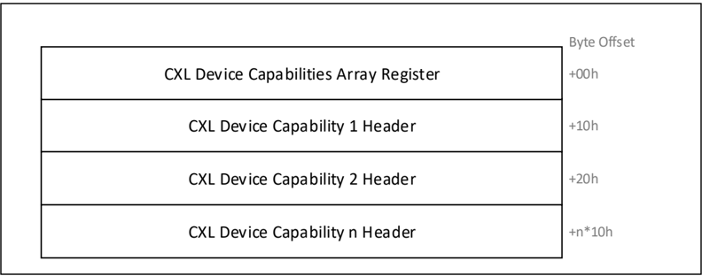

| +00h Byte Offset                       |
|----------------------------------------|
| CXL Device Capabilities Array Register |
| CXL Device Capability 1 Header +10h    |
| CXL Device Capability 2 Header +20h    |
| CXL Device Capability n Header +n*10h  |

##### 8.2.8.1 CXL Device Capabilities Array Register (Offset 00h)

| Bits   | Attributes   | Description                                                                                                                                                                                                                                                                                                                       |
|--------|--------------|-----------------------------------------------------------------------------------------------------------------------------------------------------------------------------------------------------------------------------------------------------------------------------------------------------------------------------------|
| 15:0   | RO           | Capability ID: Defines the nature and format of the capability register structure. For the CXL Device Capabilities Array Register, this field shall be set to 0000h.                                                                                                                                                              |
| 23:16  | RO           | Version: Defines the version of the capability structure present. This field shall be set to 01h. Software shall check this version number during initialization to determine the layout of the device capabilities, treating an unknown version number as an error preventing any further access to the device by that software. |
| 31:24  | RO           | Reserved                                                                                                                                                                                                                                                                                                                          |
| 47:32  | RO           | Capabilities Count: The number of elements in the CXL device capabilities array, not including this header register. Each capability header element is 16 bytes in length and contiguous to previous elements.                                                                                                                    |

##### 8.2.8.2 CXL Device Capability Header Register (Offset Varies)

Each capability in the CXL device capabilities array is described by a CXL Device Capability Header Register which identifies the specific capability and points to the capability register structure in register space.

| Bits   | Attributes   | Description                                                                                                                                                                                                                                                                                                                                                                                                                                                                                                                                                                                                                                                                                                                                                                                                                                                                         |
|--------|--------------|-------------------------------------------------------------------------------------------------------------------------------------------------------------------------------------------------------------------------------------------------------------------------------------------------------------------------------------------------------------------------------------------------------------------------------------------------------------------------------------------------------------------------------------------------------------------------------------------------------------------------------------------------------------------------------------------------------------------------------------------------------------------------------------------------------------------------------------------------------------------------------------|
| 15:0   | RO           | Capability ID: Defines the supported capability register structure. See [Section 8.2.8.2.1](#82821-cxl-device-capabilities) for the list of capability identifiers.                                                                                                                                                                                                                                                                                                                                                                                                                                                                                                                                                                                                                                                                                                                                                   |
| 23:16  | RO           | Version: Defines the version of the capability register structure. The version is incremented whenever the capability register structure is extended to add more functionality. Backward compatibility shall be maintained during this process. For all values of n, version n+1 may extend version n by replacing fields that are marked as reserved in version n but must not redefine the meaning of existing fields. Software that was written for a lower version may continue to operate on capability structures with a higher version but will not be able to take advantage of new functionality. If backwards compatibility cannot be maintained, a new capability ID shall be created. Each field in a capability register structure is assumed to be introduced in version 1 of that structure unless otherwise stated in the field's definition in this specification. |
| 31:24  | RO           | Reserved                                                                                                                                                                                                                                                                                                                                                                                                                                                                                                                                                                                                                                                                                                                                                                                                                                                                            |
| 63:32  | RO           | Offset: Offset of the capability register structure from the start of the CXL device registers. The offset of performance sensitive registers and security sensitive registers shall be in separate 4 KB regions within the CXL device register space.                                                                                                                                                                                                                                                                                                                                                                                                                                                                                                                                                                                                                              |
| 95:64  | RO           | Length: Size of the capability register structure in bytes.                                                                                                                                                                                                                                                                                                                                                                                                                                                                                                                                                                                                                                                                                                                                                                                                                         |
| 127:96 | RO           | Reserved                                                                                                                                                                                                                                                                                                                                                                                                                                                                                                                                                                                                                                                                                                                                                                                                                                                                            |

###### 8.2.8.2.1 CXL Device Capabilities

CXL device capability register structures are identified by a 2-byte identifier as specified in the table below. Capability identifiers 0000h-3FFFh describe generic CXL device capabilities. Capability identifiers 4000h-7FFFh describe specific capabilities associated with the Class Code Register in the PCI Header (Offset 09h). Capability identifiers 8000h-FFFFh describe vendor specific capabilities.

Capability identifiers 0000h-3FFFh that are not specified in this table are reserved.

| Capability ID   | Description                                                                                                                                      | Required*   | Version   |
|-----------------|--------------------------------------------------------------------------------------------------------------------------------------------------|-------------|-----------|
| 0001h           | Device Status Registers: Describes the generic CXL device status registers. Only one instance of this register structure shall exist per device. | M           | 01h       |
| 0002h           | P rimary Mailbox Registers: Describes the primary mailbox registers. Only one instance of this register structure shall exist per device.        | M           | 01h       |
| 0003h           | Secondary Mailbox Registers: Describes the secondary mailbox registers. At most one instance of this register structure shall exist per device.  | O           | 01h       |

##### 8.2.8.3 Device Status Registers (Offset Varies)

###### 8.2.8.3.1 Event Status Register (Device Status Registers Capability Offset + 00h)

The Event Status Register indicates which events are currently ready for host actions, such as fetching event log records. The host may choose to poll for these events by periodically reading this register, or it may choose to enable interrupts for some of these events, essentially telling the host when to poll. The only poll-able/interruptible events that are not indicated in this register are mailbox command completions since each set of mailbox registers provides that information directly.

Unless otherwise stated in the field definitions below, each field is present in version 1 and later of this structure. The device shall report the version of this structure in the Version field of the CXL Device Capability Header Register.

| Bits   | Attributes   | Description                                                                                                                                                                                                                                                                                                                                                                         |
|--------|--------------|-------------------------------------------------------------------------------------------------------------------------------------------------------------------------------------------------------------------------------------------------------------------------------------------------------------------------------------------------------------------------------------|
| 31:0   | RO           | Event Status: When set, one or more event records exist in the specified event log. Use the Get and Clear Event Records commands to retrieve and clear the event records. Once the event log has zero event records, the bit is cleared. • Bit[0]: Informational Event Log • Bit[1]: Warning Event Log • Bit[2]: Failure Event Log • Bit[3]: Fatal Event Log • Bits[31:4]: Reserved |
| 63:32  | RO           | Reserved                                                                                                                                                                                                                                                                                                                                                                            |

##### 8.2.8.4 Mailbox Registers (Offset Varies)

The mailbox registers provide the ability to issue a command to the device. Refer to [Section 8.2.9](#829-cxl-device-command-interface) for details about the commands. There are two types of mailboxes: primary and secondary. The register interface for both types of mailboxes is the same and is described in this section. The difference between the two types of mailboxes is their intended use and commands allowed. Details on these differences are described in [Section 8.2.8.4.1](#82841-attributes-of-the-primary-mailbox) and [Section 8.2.8.4.2](#82842-attributes-of-the-secondary-mailbox). Devices implementing more than one mailbox shall process commands from those mailboxes in a manner which avoids 'starvation,' so that commands submitted to one mailbox do not prevent commands from other mailboxes from being handled. The exact algorithm for accepting commands from multiple mailboxes is implementation specific.

The mailbox interface shall be used in a single-threaded manner only. It is software's responsibility to avoid simultaneous, uncoordinated access to a mailbox using techniques such as locking.

The mailbox command timeout is 2 seconds. Commands that require a longer execution time shall be completed asynchronously in the background. Only one command can be executed in the background at a time. The status of a background command can be retrieved from the Background Command Status Register. Background commands do not continue to execute across Conventional Resets. For devices with multiple mailboxes, only the primary mailbox shall be used to issue background commands.

Devices may support sending MSI/MSI-X interrupts to indicate command status. Support for mailbox interrupts is enumerated in the Mailbox Capabilities Register and enabled in the Mailbox Control Register. Mailbox interrupts are only supported on the primary mailbox.

Unless otherwise stated in the field definitions for the mailbox registers below, each field is present in version 1 and later of these structures. The device shall report the version of these structures in the Version field of the CXL Device Capability Header Register.

The flow for executing a command is described below. The term 'caller' represents the entity submitting the command:

1. Caller reads MB Control Register to verify doorbell is clear
2. Caller writes Command Register
3. Caller writes Command Payload Registers if input payload is non-empty
4. Caller writes MB Control Register to set doorbell
5. Caller either polls for doorbell to be clear or waits for interrupt if configured
6. Caller reads MB Status Register to fetch Return code
7. If command successful, Caller reads Command Register to get Payload Length
8. If output payload is non-empty, host reads Command Payload Registers

In case of a timeout, the caller may attempt to recover the device by either issuing CXL reset, hot reset, warm reset or a cold reset to the device.

When a command is successfully started as a background operation, the device shall return the Background Command Started return code defined in Section 8.2.8.4.5.1. While the command is executing in the background, the device should update the percentage complete in the Background Command Status Register at least once per second. Once the command completes in the background, the device shall update the Background Command Status Register with the appropriate return code as defined in Section 8.2.8.4.5.1. The caller may then retrieve the results of the background operation by issuing a new command.

The mailbox registers are described below.

###### Figure 139. Mailbox Registers

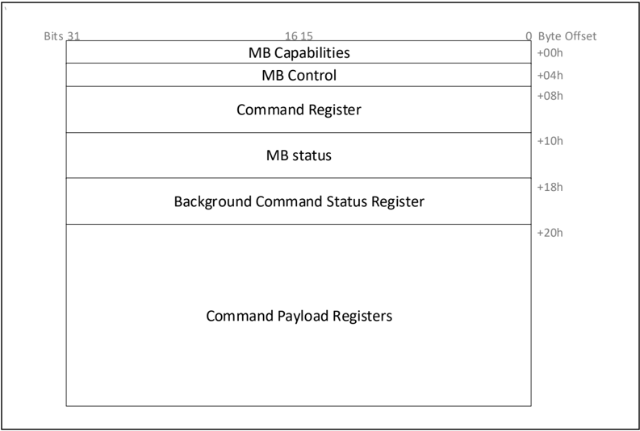

###### 8.2.8.4.1 Attributes of the Primary Mailbox

The primary mailbox supports all commands described in [Section 8.2.9](#829-cxl-device-command-interface). The primary mailbox also supports the optional feature to provide mailbox completion interrupts, if implemented by a device. Implementation of the primary mailbox is mandatory.

The exact details on how the primary mailbox is used may vary from platform to platform. The intended use is to provide the main method for submitting commands to the device, used by both pre-boot software and OS software. The platform shall coordinate the use of the primary mailbox so that only one software entity 'owns' the mailbox at a given time and that the transfer of ownership happens in-between mailbox commands so that one entity cannot corrupt the mailbox state of the other. The intended practice is that the pre-boot software uses the primary mailbox until control is transferred to the OS being booted, and at that time the OS takes over sole ownership of the primary mailbox until the OS is shutdown. Since the physical address of the primary mailbox can change due to PCIe reconfiguration performed by the primary mailbox owner, each time the primary mailbox changes ownership, the new owner shall read the appropriate configuration registers to find the current location of the mailbox registers, just as it does during device initialization.

###### 8.2.8.4.2 Attributes of the Secondary Mailbox

The secondary mailbox, if implemented by a device, supports only a subset of the commands described in [Section 8.2.9](#829-cxl-device-command-interface). The Command Effects Log shall specify which commands are allowed on the secondary mailbox, and all other commands shall return the error Unsupported Mailbox. The secondary mailbox does not support mailbox completion interrupts. Implementation of the secondary mailbox is optional.

The exact details on how the secondary mailbox is used may vary from platform to platform. The intended use is to provide a method for submitting commands to the device by platform firmware that processes events while the OS owns the primary mailbox. By using the secondary mailbox, platform firmware does not corrupt the state of any in-progress mailbox operations on the primary mailbox.

Devices shall indicate which commands are allowed on the secondary mailbox by setting the Secondary Mailbox Supported flag for the supported opcodes in the Command Effects Log. Exactly which commands are supported on the secondary mailbox is implementation specific. It is recommended (but not required) that the secondary mailbox supports all commands in the Events, Logs, and Identify command sets defined in [Section 8.2.9](#829-cxl-device-command-interface).

Since the physical address of the secondary mailbox can change due to PCIe reconfiguration performed by the primary mailbox owner, each time the secondary mailbox is used, the software using it shall read the appropriate configuration registers to find the current location of the mailbox registers.

###### 8.2.8.4.3 Mailbox Capabilities Register (Mailbox Registers Capability Offset + 00h)

| Bits   | Attributes   | Description                                                                                                                                                                                                                                                                                                                                                                                                                                                                                                                                                                                                                                                                                                                                                                                                                                                                                                                                                                                                                                                                                                                                                                                                                                                                                                                                                                                                                                           |
|--------|--------------|-------------------------------------------------------------------------------------------------------------------------------------------------------------------------------------------------------------------------------------------------------------------------------------------------------------------------------------------------------------------------------------------------------------------------------------------------------------------------------------------------------------------------------------------------------------------------------------------------------------------------------------------------------------------------------------------------------------------------------------------------------------------------------------------------------------------------------------------------------------------------------------------------------------------------------------------------------------------------------------------------------------------------------------------------------------------------------------------------------------------------------------------------------------------------------------------------------------------------------------------------------------------------------------------------------------------------------------------------------------------------------------------------------------------------------------------------------|
| 4:0    | RO           | Payload Size: Size of the Command Payload Registers in bytes, expressed as 2^n. The minimum size is 256 bytes (n=8) and the maximum size is 1 MB (n=20).                                                                                                                                                                                                                                                                                                                                                                                                                                                                                                                                                                                                                                                                                                                                                                                                                                                                                                                                                                                                                                                                                                                                                                                                                                                                                              |
| 5      | RO           | MB Doorbell Interrupt Capable: When set, indicates the device supports signaling an MSI/MSI-X interrupt when the doorbell is cleared. Only valid for the primary mailbox. This bit shall be zero for the secondary mailbox.                                                                                                                                                                                                                                                                                                                                                                                                                                                                                                                                                                                                                                                                                                                                                                                                                                                                                                                                                                                                                                                                                                                                                                                                                           |
| 6      | RO           | Background Command Complete Interrupt Capable: When set, indicates the device supports signaling an MSI/MSI-X interrupt when a command completes in the background. Only valid for the primary mailbox. This bit shall be zero for the secondary mailbox.                                                                                                                                                                                                                                                                                                                                                                                                                                                                                                                                                                                                                                                                                                                                                                                                                                                                                                                                                                                                                                                                                                                                                                                             |
| 10:7   | RO           | Interrupt Message Number : This field indicates which MSI/MSI-X vector is used for the interrupt message generated in association with this mailbox instance. Only valid for the primary mailbox. This bit shall be zero for the secondary mailbox. For MSI, the value in this field indicates the offset between the base Message Data and the interrupt message that is generated. Hardware is required to update this field so that it is correct if the number of MSI Messages assigned to the Function changes when software writes to the Multiple Message Enable field in the Message Control Register for MSI. For MSI-X, the value in this field indicates which MSI-X Table entry is used to generate the interrupt message. The entry shall be one of the first 16 entries even if the Function implements more than 16 entries. The value in this field shall be within the range configured by system software to the device. For a given MSI-X implementation, the entry shall remain constant. If both MSI and MSI-X are implemented, they are permitted to use different vectors, though software is permitted to enable only one mechanism at a time. If MSI-X is enabled, the value in this field shall indicate the vector for MSI-X. If MSI is enabled or neither is enabled, the value in this field indicate the vector for MSI. If software enables both MSI and MSI-X at the same time, the value in this field is undefined. |
| 31:11  | RsvdP        | Reserved                                                                                                                                                                                                                                                                                                                                                                                                                                                                                                                                                                                                                                                                                                                                                                                                                                                                                                                                                                                                                                                                                                                                                                                                                                                                                                                                                                                                                                              |

###### 8.2.8.4.4 Mailbox Control Register (Mailbox Registers Capability Offset + 04h)

| Bits   | Attributes   | Description                                                                                                                                                                                                                                                                                                                                                                                                                                                                                                                                     |
|--------|--------------|-------------------------------------------------------------------------------------------------------------------------------------------------------------------------------------------------------------------------------------------------------------------------------------------------------------------------------------------------------------------------------------------------------------------------------------------------------------------------------------------------------------------------------------------------|
| 0      | RW           | Doorbell: When clear, the device is ready to accept a new command. Set by the caller to notify the device that the command inputs are ready. Read-only when set. Cleared by the device when the command completes, or the command is started in the background.                                                                                                                                                                                                                                                                                 |
| 1      | RW           | MB Doorbell Interrupt: If doorbell interrupts are supported on this mailbox, this register is set by the caller to enable signaling an MSI/MSI-X interrupt when the doorbell is cleared. Read-only when the doorbell is set. Ignored if doorbell interrupts are not supported on this mailbox instance (MB Doorbell Interrupt Capable = 0 in the Mailbox Capabilities Register). • 0b = Disabled • 1b = Enabled                                                                                                                                 |
| 2      | RW           | Background Command Complete Interrupt: If background command complete interrupts are supported on this mailbox, this register is set by the caller to enable signaling an interrupt when the command completes in the background. Ignored if the command is not a background command. Read-only when the doorbell is set. Ignored if background command complete interrupts are not supported on this mailbox instance (Background Command Complete Interrupt Capable = 0 in the Mailbox Capabilities Register). • 0b = Disabled • 1b = Enabled |
| 31:3   | RsvdP        | Reserved                                                                                                                                                                                                                                                                                                                                                                                                                                                                                                                                        |

###### 8.2.8.4.5 Command Register (Mailbox Registers Capability Offset + 08h)

This register shall only be used by the caller when the doorbell in the Mailbox Control Register is clear.

| Bits   | Attributes   | Description                                                                                                                                                                                                                                                                                                                           |
|--------|--------------|---------------------------------------------------------------------------------------------------------------------------------------------------------------------------------------------------------------------------------------------------------------------------------------------------------------------------------------|
| 15:0   | RW           | Command Opcode: The command identifier. Refer to [Section 8.2.9](#829-cxl-device-command-interface) for the list of command opcodes.                                                                                                                                                                                                                                       |
| 36:16  | RW           | Payload Length: The size of the data in the command payload registers (0-Payload Size). Expressed in bytes. Written by the caller to provide the command input payload size to the device prior to setting the doorbell. Written by the device to provide the command output payload size to the caller when the doorbell is cleared. |
| 63:37  | RsvdP        | Reserved                                                                                                                                                                                                                                                                                                                              |

###### 8.2.8.4.5.1 Command Return Codes

In general, retries are not recommended for commands that return an error except when indicated in the return code definition.

###### Table 150. Command Return Codes

| Value   | Definition                                                                                                                                               |
|---------|----------------------------------------------------------------------------------------------------------------------------------------------------------|
| 0000h   | Success: The command completed successfully.                                                                                                             |
| 0001h   | Background Command Started: The background command started successfully. Refer to the Background Command Status register to retrieve the command result. |
| 0002h   | Invalid Input: A command input was invalid.                                                                                                              |
| 0003h   | Unsupported: The command is not supported.                                                                                                               |
| 0004h   | Internal Error: The command was not completed due to an internal device error.                                                                                                                         |
| 0005h   | Retry Required: The command was not completed due to a temporary error. An optional single retry may resolve the issue.                                                                                |
| 0006h   | Busy: The device is currently busy processing a background operation. Wait until background command completes and then retry the command.                                                              |
| 0007h   | Media Disabled: The command could not be completed because it requires media access and media is disabled.                                                                                             |
| 0008h   | FW Transfer in Progress: Only one FW package can be transferred at a time. Complete the current FW package transfer before starting a new one.                                                         |
| 0009h   | FW Transfer Out of Order: The FW package transfer was aborted because the FW package content was transferred out of order.                                                                             |
| 000Ah   | FW Authentication Failed: The FW package was not saved to the device because the FW package authentication failed.                                                                                     |
| 000Bh   | Invalid Slot: The FW slot specified is not supported or not valid for the requested operation.                                                                                                         |
| 000Ch   | Activation Failed, FW Rolled Back: The new FW failed to activate and rolled back to the previous active FW.                                                                                            |
| 000Dh   | Activation Failed, Cold Reset Required: The new FW failed to activate. A cold reset is required.                                                                                                       |
| 000Eh   | Invalid Handle: One or more Event Record Handles were invalid.                                                                                                                                         |
| 000Fh   | Invalid Physical Address: The physical address specified is invalid.                                                                                                                                   |
| 0010h   | Inject Poison Limit Reached: The device's limit on allowed poison injection has been reached. Clear injected poison requests before attempting to inject more.                                         |
| 0011h   | Permanent Media Failure: The device could not clear poison due to a permanent issue with the media.                                                                                                    |
| 0012h   | Aborted: The background command was aborted by the device.                                                                                                                                             |
| 0013h   | Invalid Security State: The command is not valid in the current security state.                                                                                                                        |
| 0014h   | Incorrect Passphrase: The passphrase does not match the currently set passphrase.                                                                                                                      |
| 0015h   | Unsupported Mailbox: The command is not supported on the mailbox it was issued on. Used to indicate an unsupported command issued on the secondary mailbox.                                            |
| 0016h   | Invalid Payload Length: The payload length specified in the Command Register is not valid. The device is required to perform this check prior to processing any command defined in this specification. |

###### 8.2.8.4.6 Mailbox Status Register (Mailbox Registers Capability Offset + 10h)

| Bits   | Attributes   | Description                                                                                                                                                                                                                                                                                                                                                                                                             |
|--------|--------------|-------------------------------------------------------------------------------------------------------------------------------------------------------------------------------------------------------------------------------------------------------------------------------------------------------------------------------------------------------------------------------------------------------------------------|
| 0      | RO           | Background Operation: When set, the device is executing a command in the background. Only one command can be executing in the background, therefore additional background commands shall be rejected with the busy return code. Refer to the Background Command Status Register to retrieve the status of the background command. Only valid for the primary mailbox. This bit shall be zero for the secondary mailbox. |
| 31:1   | RO           | Reserved                                                                                                                                                                                                                                                                                                                                                                                                                |
| 47:32  | RO           | Return Code: The result of the command. Only valid after the doorbell is cleared. Refer to Section 8.2.8.4.5.1.                                                                                                                                                                                                                                                                                                         |
| 63:48  | RO           | Vendor Specific Extended Status: The vendor specific extended status information. Only valid after the doorbell is cleared.                                                                                                                                                                                                                                                                                             |

###### 8.2.8.4.7 Background Command Status Register (Mailbox Registers Capability Offset + 18h)

Reports information about the last command executed in the background since the last cold or warm or hot reset. Zeroed if no background command status is available. Only valid for the primary mailbox, this register shall be zeroed on the secondary mailbox.

| Bits   | Attributes   | Description                                                                                                                                     |
|--------|--------------|-------------------------------------------------------------------------------------------------------------------------------------------------|
| 15:0   | RO           | Command Opcode: The command identifier of the last command executed in the background. Refer to [Section 8.2.9](#829-cxl-device-command-interface) for the list of command opcodes.  |
| 22:16  | RO           | Percentage Complete: The percentage complete (0-100) of the background command.                                                                 |
| 31:23  | RsvdP        | Reserved                                                                                                                                        |
| 47:32  | RO           | Return Code: The result of the command run in the background. Only valid when Percentage Complete = 100. Refer to Section 8.2.8.4.5.1.          |
| 63:48  | RO           | Vendor Specific Extended Status: The vendor specific extended status of the last background command. Only valid when Percentage Complete = 100. |

###### 8.2.8.4.8 Command Payload Registers (Mailbox Registers Capability Offset + 20h)

These registers shall only be used by the caller when the doorbell in the Mailbox Control Register is clear.

|   Offset | Length   | Attributes   | Description                                                                                                                                                                                                                                                                                                                                                                                                                                                                            |
|----------|----------|--------------|----------------------------------------------------------------------------------------------------------------------------------------------------------------------------------------------------------------------------------------------------------------------------------------------------------------------------------------------------------------------------------------------------------------------------------------------------------------------------------------|
|        0 | Varies   | RW           | Payload: Written by the caller to provide the command input payload to the device prior to setting the doorbell. Written by the device to provide the command output payload back to the caller when the doorbell is cleared. The size of the payload data is specified in the Command Register. Any data beyond the size specified in the Command Register shall be ignored by the caller and the device. Refer to [Section 8.2.9](#829-cxl-device-command-interface) for the format of the payload data for each command. |

##### 8.2.8.5 Memory Device Registers

This section describes the capability registers specific to CXL memory devices that implement the PCI Header Class Code Register as defined in [Section 8.1.12.1](#81121-pci-header-class-code-register-offset-09h).

CXL memory device register structures are identified by a 2-byte identifier as specified in the table below. Capability identifiers 4000h-7FFFh describe capabilities registers specific to CXL memory devices that implement the PCI Header Class Code Register as defined in [Section 8.1.12.1](#81121-pci-header-class-code-register-offset-09h).

Capability identifiers 4000h-7FFFh that are not specified in this table are reserved.

###### Table 151. CXL Memory Device Capabilities Identifiers

| Capability ID   | Description                                                                                                                                                 | Required   | Version   |
|-----------------|-------------------------------------------------------------------------------------------------------------------------------------------------------------|------------|-----------|
| 4000h           | Memory Device Status Registers: Describes the memory device specific status registers. Only one instance of this register structure shall exist per device. | M          | 01h       |

*M = mandatory for all devices that implement a Register DVSEC Locator entry with Register Block Identifier=03h; PM = mandatory for devices that support persistence and implement a Register DVSEC Locator entry with Register Block Identifier=03h; O = Optional.

###### 8.2.8.5.1 Memory Device Status Registers (Offset Varies)

The CXL memory device status registers provide information about the status of the memory device.

###### 8.2.8.5.1.1 Memory Device Status Register (Memory Device Status Registers Capability Offset + 00h)

Unless otherwise stated in the field definitions below, each field is present in version 1 and later of this structure. The device shall report the version of this structure in the Version field of the CXL Device Capability Header Register.

| Bits   | Attributes   | Description                                                                                                                                                                                                                                                                                                                                                                                                                                                                                                                                                                                                                |
|--------|--------------|----------------------------------------------------------------------------------------------------------------------------------------------------------------------------------------------------------------------------------------------------------------------------------------------------------------------------------------------------------------------------------------------------------------------------------------------------------------------------------------------------------------------------------------------------------------------------------------------------------------------------|
| 0      | RO           | Device Fatal: When set, the device has encountered a fatal error. Vendor specific device replacement or recovery is recommended.                                                                                                                                                                                                                                                                                                                                                                                                                                                                                           |
| 1      | RO           | FW Halt: When set, the device has encountered a FW error and is not responding.                                                                                                                                                                                                                                                                                                                                                                                                                                                                                                                                            |
| 3:2    | RO           | Media Status: Describes the status of the device media. • 00b = Not Ready - Media training is incomplete. • 01b = Ready - The media trained successfully and is ready for use. • 10b = Error - The media failed to train or encountered an error. • 11b = Disabled - Access to the media is disabled. If the media is not in the ready state, user data is not accessible.                                                                                                                                                                                                                                                 |
| 4      | RO           | Mailbox Interfaces Ready: When set, the device is ready to accept commands through the mailbox register interfaces.                                                                                                                                                                                                                                                                                                                                                                                                                                                                                                        |
| 7:5    | RO           | Reset Needed: When non-zero, indicates the least impactful reset type needed to return the device to the operational state. A cold reset is considered more impactful than a warm reset. A warm reset is considered more impactful that a hot reset, which is more impactful than a CXL reset. This field returns non-zero value if FW Halt is set or Media Status is not in the ready state. 000 =Device is operational and no reset is required 001 = Cold Reset 010 = Warm Reset 011 = Hot Reset 100 = CXL Reset (Device must not report this value if it does not support CXL Reset) All other encodings are reserved. |
| 63:8   | RsvdP        | Reserved                                                                                                                                                                                                                                                                                                                                                                                                                                                                                                                                                                                                                   |

#### 8.2.9 CXL Device Command Interface

CXL device commands are identified by a 2-byte Opcode as specified in the table below. Opcodes 0000h-3FFFh describe generic CXL device commands. Opcodes 4000h-BFFFh describe Class Code specific commands. Opcodes C000h-FFFFh describe vendor specific commands.

Opcodes 0000h-3FFFh that are not specified in this table are reserved.

Opcodes also provide an implicit major version number, which means a command's definition shall not change in an incompatible way in future revisions of this specification. Instead, if an incompatible change is required, the specification defining the change shall define a new opcode for the changed command. Commands may evolve by defining new fields in areas of the parameter and payload definitions that were originally defined as Reserved, but only in a way where software written using the earlier definition will continue to work correctly, and software written to the new definition can use the zero value or the payload size to detect devices that do not support the new field. This implicit minor versioning allows software to be written with the understanding that an opcode shall only evolve by adding backward-compatible changes.

##### Table 152. CXL Device Command Opcodes

| Opcode                 | Opcode            | Opcode                                         | Opcode          | Required*   | Input Payload   | Output Payload   |
|------------------------|-------------------|------------------------------------------------|-----------------|-------------|-----------------|------------------|
| Command Set Bits[15:8] | Command Bits[7:0] | Command Bits[7:0]                              | Combined Opcode |             | Size (B)        | Size (B)         |
|                        | 00h               | Get Event Records ([Section 8.2.9.1.2](#82912-get-event-records-opcode-0100h))          | 0100h           | M           | 1               | 20h+             |
|                        | 01h               | Clear Event Records ([Section 8.2.9.1.3](#82913-clear-event-records-opcode-0101h))        | 0101h           | M           | 8+              | 0                |
|                        | 02h               | Get Event Interrupt Policy ([Section 8.2.9.1.4](#82914-get-event-interrupt-policy-opcode-0102h)) | 0102h           | M           | 0               | 4                |
|                        | 03h               | Set Event Interrupt Policy ([Section 8.2.9.1.5](#82915-set-event-interrupt-policy-opcode-0103h)) | 0103h           | M           | 4               | 0                |
|                        | 00h               | Get FW Info ([Section 8.2.9.2.1](#82921-get-fw-info-opcode-0200h))                | 0200h           | O           | 0               | 50h              |
|                        | 01h               | Transfer FW ([Section 8.2.9.2.2](#82922-transfer-fw-opcode-0201h))                | 0201h           | O           | 80h+            | 0                |
|                        | 02h               | Activate FW ([Section 8.2.9.2.3](#82923-activate-fw-opcode-0202h))                | 0202h           | O           | 2               | 0                |
|                        | 00h               | Get Timestamp ([Section 8.2.9.3.1](#82931-get-timestamp-opcode-0300h))              | 0300h           | O           | 0               | 8                |
|                        | 01h               | Set Timestamp ([Section 8.2.9.3.2](#82932-set-timestamp-opcode-0301h))              | 0301h           | O           | 8               | 0                |
|                        | 00h               | Get Supported Logs ([Section 8.2.9.4.1](#82941-get-supported-logs-opcode-0400h))         | 0400h           | M           | 0               | 8+               |
|                        | 01h               | Get Log ([Section 8.2.9.4.2](#82942-get-log-opcode-0401h))                    | 0401h           | M           | 18h             | 0+               |

*M = mandatory for all devices that implement a Register DVSEC Locator entry with Register Block Identifier=03h; O = Optional.

+Indicates a variable length payload follows the size indicated.

##### 8.2.9.1 Events

This section defines the standard event record format that all CXL devices shall utilize when reporting events to the host. Also defined are the Get Event Record and Clear Event Record commands which operate on those event records. The device shall support at least 1 event record in each event log. Devices shall return event records to the host in the temporal order the device detected the events in. The event occurring the earliest in time, in the specific event log, shall be returned first.

###### 8.2.9.1.1 Event Records

This section describes the events reported by devices through the Get Event Records command. The device shall utilize the Common Event Record format when generating events for any event log.

A device implement a Register DVSEC Locator entry with Register Block Identifier=03h shall utilize the Memory Module Event Record format when reporting general device events and shall utilize either the General Media Event Record or DRAM Event Record when reporting media events.

###### Table 153. Common Event Record Format

| Byte Offset   | Length   | Description                                                                                                                                                                                                                                                                                                                                                                                                                                                                                                                                                                                                                                                                                                                                                                                                                                                                                                                                                                 |
|---------------|----------|-----------------------------------------------------------------------------------------------------------------------------------------------------------------------------------------------------------------------------------------------------------------------------------------------------------------------------------------------------------------------------------------------------------------------------------------------------------------------------------------------------------------------------------------------------------------------------------------------------------------------------------------------------------------------------------------------------------------------------------------------------------------------------------------------------------------------------------------------------------------------------------------------------------------------------------------------------------------------------|
| 0             | 10h      | Event Record Identifier: UUID representing the specific Event Record format. The following UUIDs are defined in this spec • fbcd0a77-c260-417f-85a9-088b1621eba6 - General Media Event Record (See [Table 154](#table-154-general-media-event-record)) • 601dcbb3-9c06-4eab-b8af-4e9bfb5c9624 - DRAM Event Record (See [Table 155](#table-155-dram-event-record)) • fe927475-dd59-4339-a586-79bab113b774 - Memory Module Event Record (See [Table 156](#table-156-memory-module-event-record)) • 77cf9271-9c02-470b-9fe4-bc7b75f2da97 - Physical Switch Event Record (See [Table 120](#table-120-physical-switch-events-record-format)) • 40d26425-3396-4c4d-a5da-3d47263af425 - Virtual Switch Event Record (See [Table 121](#table-121-virtual-cxl-switch-event-record-format)) • 8dc44363-0c96-4710-b7bf-04bb99534c3f - MLD Port Event Record (See [Table 122](#table-122-mld-port-event-records-payload))                                                                                                                                                                                                                                                                                                                                      |
| 10h           | 1        | Event Record Length: Number of valid bytes that are in the event record, including all fields.                                                                                                                                                                                                                                                                                                                                                                                                                                                                                                                                                                                                                                                                                                                                                                                                                                                                              |
| 11h           | 3        | Event Record Flags: Multiple bits may be set • Bits[1:0]: Event Record Severity: The severity of the event. This shall match the event log where the event was placed by the device. - 00h = Informational Event - 01h = Warning Event - 02h = Failure Event - 03h = Fatal Event • Bit[2]: Permanent Condition: The event reported represents a permanent condition for the device. This shall not be set when reporting Event Record Severity of Informational. • Bit[3]: Maintenance Needed: The device requires maintenance. This shall not be set when reporting Event Record Severity of Informational. • Bit[4]: Performance Degraded - The device is no longer operating at optimal performance. This shall not be set when reporting Event Record Severity of Informational. • Bit[5]: Hardware Replacement Needed - The device should be replaced immediately. This shall not be set when reporting Event Record Severity of Informational. • Bits[23:6]: Reserved |
| 14h           | 2        | Event Record Handle: The event log unique handle for this event record. This is the value the host shall use when requesting the device to clear events using the Clear Event Records command. This value shall be non- zero. |
| 16h           | 2        | Related Event Record Handle: Optional event record handle to another related event in the same event log. If there are no related events, this field shall be set to 0.                                                       |
| 18h           | 8        | Event Record Timestamp : The time the device recorded the event. The number of unsigned nanoseconds that have elapsed since midnight, 01- Jan-1970, UTC. If the device does not have a valid timestamp, return 0.             |
| 20h           | 10h      | Reserved                                                                                                                                                                                                                      |
| 30h           | 50h      | Event Record Data: Format depends on the Event Record Identifier                                                                                                                                                              |

###### 8.2.9.1.1.1 General Media Event Record

The General Media Event Record defines a general media related event. The device shall generate a General Media Event Record for each general media event occurrence.

###### Table 154. General Media Event Record

| Byte Offset   | Length   | Description                                                                                                                                                                                                                                                                                                                                                                                                                                                                                                                                                                                                                                                                                            |
|---------------|----------|--------------------------------------------------------------------------------------------------------------------------------------------------------------------------------------------------------------------------------------------------------------------------------------------------------------------------------------------------------------------------------------------------------------------------------------------------------------------------------------------------------------------------------------------------------------------------------------------------------------------------------------------------------------------------------------------------------|
| 0             | 10h      | Event Record Identifier: This field shall be set to fbcd0a77-c260-417f- 85a9-088b1621eba6 which identifies a General Media Event Record.                                                                                                                                                                                                                                                                                                                                                                                                                                                                                                                                                               |
| 10h           | 20h      | Common Event Record: See corresponding common event record fields defined in [Section 8.2.9.1.1](#82911-event-records) .                                                                                                                                                                                                                                                                                                                                                                                                                                                                                                                                                                                                       |
| 30h           | 8        | Physical Address: The physical address where the memory event occurred. • Bit[0]: Volatile: When set, indicates the DPA field is in the volatile memory range. When clear, indicates the DPA is in the persistent memory range. • Bits[5:1]: Reserved • Bits[7:6]: DPA[7:6] • Bits[15:8]: DPA[15:8] • …                                                                                                                                                                                                                                                                                                                                                                                                |
| 38h           | 1        | Memory Event Descriptor: Additional memory event information. Unless stated below, these shall be valid for every Memory Event Type reported. • Bit[0]: Uncorrectable Event: When set, indicates the reported event is uncorrectable by the device. When clear, indicates the reported event was corrected by the device. • Bit[1]: Threshold Event: When set, the event is the result of a threshold on the device having been reached. When clear, the event is not the result of a threshold limit. • Bit[2]: Poison List Overflow Event: When set, the Poison List has overflowed, and this event is not in the Poison List. When clear, the Poison List has not overflowed. • Bits[7:3]: Reserved |
| 39h           | 1        | Memory Event Type: Identifies the type of event that occurred. The specific memory event types logged by the device will depend on the RAS mechanisms implemented in the device and is implementation dependent. • 00h = Media ECC Error • 01h = Invalid Address - A host access was for an invalid address range. The DPA field shall contain the invalid DPA the host attempted to access. When returning this event type, the Poison List Overflow Event descriptor does not apply. • 02h = Data path Error -Internal device data path, media link, or internal device structure errors not directly related to the media Other values reserved.                                                    |
| 3Ah           | 1        | Transaction Type: The first device detected transaction that caused the event to occur. • 00h = Unknown/Unreported • 01h = Host Read • 02h = Host Write • 03h = Host Scan Media • 04h = Host Inject Poison • 05h = Internal Media Scrub • 06h = Internal Media Management Other values reserved.     |
| 3Bh           | 2        | Validity Flags: Indicators of what fields are valid in the returned data • Bit[0]: When set, the Channel field is valid • Bit[1]: When set, the Rank field is valid • Bit[2]: When set, the Device field is valid • Bit[3]: When set, the Component Identifier field is valid • Bits[15:4]: Reserved |
| 3Dh           | 1        | Channel: The channel of the memory event location. A channel is defined as an interface that can be independently accessed for a transaction. The CXL device may support one or more channels.                                                                                                       |
| 3Eh           | 1        | Rank: The rank of the memory event location. A rank is defined as a set of memory devices on a channel that together execute a transaction. Multiple ranks may share a channel.                                                                                                                      |
| 3Fh           | 3        | Device: A bit mask representing all devices in the rank associated with the memory event location.                                                                                                                                                                                                   |
| 42h           | 10h      | Component Identifier: Device specific component identifier for the event. This may describe a field replaceable sub-component of the device.                                                                                                                                                         |
| 52h           | 2Eh      | Reserved                                                                                                                                                                                                                                                                                             |

###### 8.2.9.1.1.2 DRAM Event Record

The DRAM Event Record defines a DRAM related event. The device shall generate a DRAM Event Record for each DRAM event occurrence.

###### Table 155. DRAM Event Record

| Byte Offset   | Length   | Description                                                                                                                                                                                                                                                                                                                      |
|---------------|----------|----------------------------------------------------------------------------------------------------------------------------------------------------------------------------------------------------------------------------------------------------------------------------------------------------------------------------------|
| 0             | 10h      | Event Record Identifier: This field shall be set to 601dcbb3-9c06-4eab- b8af-4e9bfb5c9624 which identifies a DRAM Event Record.                                                                                                                                                                                                  |
| 10h           | 20h      | Common Event Record: See corresponding common event record fields defined in [Section 8.2.9.1.1](#82911-event-records) .                                                                                                                                                                                                                                 |
| 30h           | 8        | Physical Address: The physical address where the memory event occurred. • Bit[0]: Volatile: When set, indicates the DPA field is in the volatile memory range. When clear, indicates the DPA is in the persistent memory range • Bits[5:1]: Reserved • Bits[7:6]: DPA[7:6] • Bits[15:8]: DPA[15:8] • … • Bits[63:56]: DPA[63:56] |
| 38h           |        1 | Memory Event Descriptor: Additional memory event information. Unless stated below, these shall be valid for every Memory Event Type reported. • Bit[0]: Uncorrectable Event: When set, indicates the reported event is uncorrectable by the device. When clear, indicates the reported event was corrected by the device. • Bit[1]: Threshold Event: When set, the event is the result of a threshold on the device having been reached. When clear, the event is not the result of a threshold limit. • Bit[2]: Poison List Overflow Event: When set, the • Poison List has overflowed, and this event is not in the Poison List. • Bits[7:3]: Reserved                     |
| 39h           |        1 | Memory Event Type: Identifies the type of event that occurred. The specific memory event types logged by the device will depend on the RAS mechanisms implemented in the device and is implementation dependent. • 00h = Media ECC Error • 01h = Scrub Media ECC Error • 02h = Invalid Address - A host access was for an invalid address. The DPA field shall contain the invalid DPA the host attempted to access. When returning this event type, the Poison List Overflow Event descriptor does not apply. • 03h = Data path Error - Internal device data path, media link, or internal device structure errors not directly related to the media Other values reserved. |
| 3Ah           |        1 | Transaction Type: The first device detected transaction that caused the event to occur. • 00h = Unknown/Unreported • 01h = Host Read • 02h = Host Write • 03h = Host Scan Media • 04h = Host Inject Poison • 05h = Internal Media Scrub • 06h = Internal Media Management Other values reserved.                                                                                                                                                                                                                                                                                                                                                                             |
| 3Bh           |        2 | Validity Flags: Indicators of what fields are valid in the returned data • Bit[0]: When set, the Channel field is valid • Bit[1]: When set, the Rank field is valid • Bit[2]: When set, the Nibble Mask field is valid • Bit[3]: When set, the Bank Group field is valid • Bit[4]: When set, the Bank field is valid • Bit[5]: When set, the Row field is valid • Bit[6]: When set, the Column field is valid • Bit[7]: When set, the Correction Mask field is valid • Bits[15:8]: Reserved                                                                                                                                                                                  |
| 3Dh           |        1 | Channel: The channel of the memory event location. A channel is defined as an interface that can be independently accessed for a transaction. The CXL device may support one or more channels.                                                                                                                                                                                                                                                                                                                                                                                                                                                                               |
| 3Eh           |        1 | Rank: The rank of the memory event location. A rank is defined as a set of memory devices on a channel that together execute a transaction. Multiple ranks may share a channel.                                                                                                                                                                                                                                                                                                                                                                                                                                                                                              |
| 3Fh           |        3 | Nibble Mask: Identifies one or more nibbles in error on the memory bus producing the event. Nibble Mask bit 0 shall be set if nibble 0 on the memory bus produced the event, etc. This field should be valid for corrected memory errors. See the example below on how this field is intended to be utilized.                                                                                                                                                                                                                                                                                                                                                                |
| 42h           |        1 | Bank Group: The bank group of the memory event location                                                                                                                                                                                                                                                                                                                                                                                                                                                                                                                                                                                                                      |
| 43h           |        1 | Bank: The bank number of the memory event location                                                                                                                                                                                                                                                                                                                                                                                                                                                                                                                                                                                                                           |
| 44h           |        3 | Row: The row number of the memory event location                                                                                                                                                                                                                                                                                                                                                                                                                                                                                                                                                                                                                             |
| 47h           | 2        | Column: The column number of the memory event location                                                                                                                                                                                                                                                                                                                                                                                                                                                                                                                                                                                                            |
| 49h           | 20h      | Correction Mask: Identifies the bits in error within that nibble in error on the memory bus producing the event. The lowest nibble in error in the Nibble Mask utilizes Correction Mask 0, the next lowest nibble utilizes Correction Mask 1, etc. Burst position 0 utilizes Correction Mask nibble 0, etc. Four correction masks allow for up to 4 nibbles in error. This field should be valid for corrected memory errors. See the example below on how this field is intended to be utilized. Offset 49h: Correction Mask 0 (8 bytes) Offset 51h: Correction Mask 1 (8 bytes) Offset 59h: Correction Mask 2 (8 bytes) Offset 61h: Correction Mask 3 (8 bytes) |
| 69h           | 17h      | Reserved                                                                                                                                                                                                                                                                                                                                                                                                                                                                                                                                                                                                                                                          |

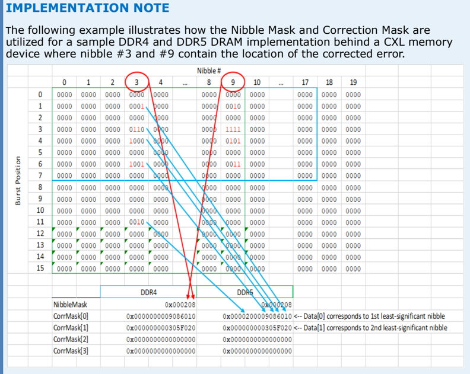

###### 8.2.9.1.1.3 Memory Module Event Record

The layout of a Memory Module Event Record is shown below.

###### Table 156. Memory Module Event Record

| Byte Offset   | Length   | Description                                                                                                                                                                                                                                                                                                                                                                                                                                                                                                                                                      |
|---------------|----------|------------------------------------------------------------------------------------------------------------------------------------------------------------------------------------------------------------------------------------------------------------------------------------------------------------------------------------------------------------------------------------------------------------------------------------------------------------------------------------------------------------------------------------------------------------------|
| 0             | 10h      | Event Record Identifier: This field shall be set to fe927475-dd59-4339- a586-79bab113b774 which identifies a Memory Module Event Record.                                                                                                                                                                                                                                                                                                                                                                                                                         |
| 10h           | 20h      | Common Event Record: See corresponding common event record fields defined in [Section 8.2.9.1.1](#82911-event-records) .                                                                                                                                                                                                                                                                                                                                                                                                                                                                 |
| 30h           | 1        | Device Event Type: Identifies the type of event that occurred. The specific device event types logged by the device will depend on the RAS mechanisms implemented in the device and is implementation dependent. • 00h = Health Status Change • 01h = Media Status Change • 02h = Life Used Change • 03h = Temperature Change • 04h = Data path Error -Internal device data path, media link or internal device structure errors not directly related to the media • 05h = LSA Error - An error occurred in the device Label Storage Area Other values reserved. |
| 31h           | 12h      | Device Health Information: A complete copy of the device's health info at the time of the event. The format of this field is described in [Table 181](#table-181-get-health-info-output-payload) .                                                                                                                                                                                                                                                                                                                                                                                                            |
| 43h           | 3Dh      | Reserved                                                                                                                                                                                                                                                                                                                                                                                                                                                                                                                                                         |

###### 8.2.9.1.1.4 Vendor Specific Event Record

The layout of a vendor specific event record is shown below.

###### Table 157. Vendor Specific Event Record

| Byte Offset   | Length   | Description                                                                                                          |
|---------------|----------|----------------------------------------------------------------------------------------------------------------------|
| 0             | 10h      | Vendor Specific Event Record Identifier: Vendor specific UUID representing the format of this vendor specific event. |
| 10h           | 20h      | Common Event Record: See corresponding common event record fields defined in [Section 8.2.9.1.1](#82911-event-records) .                     |
| 30h           | 50h      | Vendor Specific Event Data                                                                                           |

###### 8.2.9.1.2 Get Event Records (Opcode 0100h)

Retrieve the next event records that may exist in the device's requested event log. This command shall retrieve as many event records from the event log that fit into the mailbox output payload. The device shall set the More Event Records indicator if there are more events to get beyond what fits in the output payload. Devices shall return event records to the host in the temporal order the device detected the events in. The event occurring the earliest in time, in the specific event log, shall be returned first.

Event records shall be cleared from the device for the device to recycle those entries for a future event. Each returned event record includes an event log specific, non-zero, record handle that the host shall utilize when clearing events from the device's event log. The device shall maintain unique handles for every event placed in each event log.

In response to this command, the device shall return an overflow indicator when there are more events detected than could be stored in the specific event log. This indicator shall remain set until the host has consumed one or more events and called Clear Event Records to return the event handles to the device. When an event log overflows, the device shall retain all event records, in the specific event log, that occurred before the overflow event.

Possible Command Return Codes:

- Success
- Invalid Parameter
- Internal Error
- Retry Required
- Invalid Payload Length

Command Effects:

- None

### Table 158. Get Event Records Input Payload

|   Byte Offset |   Length | Description                                                                                                                                                                                                        |
|---------------|----------|--------------------------------------------------------------------------------------------------------------------------------------------------------------------------------------------------------------------|
|             0 |        1 | Event Log: The specific device event log to retrieve the next event records for • 00h = Informational Event Log • 01h = Warning Event Log • 02h = Failure Event Log • 03h = Fatal Event Log Other values reserved. |

### Table 159. Get Event Records Output Payload

| Byte Offset   |   Length | Description                                                                                                                                                                                                                                                                                                                                                                                                                                                                                                                                                                                                                                                                                                                                                                                   |
|---------------|----------|-----------------------------------------------------------------------------------------------------------------------------------------------------------------------------------------------------------------------------------------------------------------------------------------------------------------------------------------------------------------------------------------------------------------------------------------------------------------------------------------------------------------------------------------------------------------------------------------------------------------------------------------------------------------------------------------------------------------------------------------------------------------------------------------------|
| 0             |        1 | Flags: • Bit[0]: Overflow - This bit shall be set by the device when errors occur that the device cannot log without overwriting an existing log event. When set, the Overflow Error Count, First Overflow Event Timestamp and Last Overflow Event Timestamp fields shall be valid. This indicator shall remain set until the host has consumed one or more events and returned the event handles to the device or cleared all the events using the Clear Event Records command. • Bit[1]: More Event Records - This bit shall be set by the device if there are more event records to retrieve than fit in the Get Event Records output payload. The host should continue to retrieve records using this command, until this indicator is no longer set by the device. • Bits[7:2]: Reserved |
| 1             |        1 | Reserved                                                                                                                                                                                                                                                                                                                                                                                                                                                                                                                                                                                                                                                                                                                                                                                      |
| 2             |        2 | Overflow Error Count: The number of errors detected by the device that were not logged due to an overflow of this event log. The counter does not wrap if more errors occur than can be counted. A value of 0 indicates the device does not have a count of errors that occurred after the overflow was established. This field is only valid if the overflow indicator is set.                                                                                                                                                                                                                                                                                                                                                                                                               |
| 4             |        8 | First Overflow Event Timestamp: The time of the first event that caused the overflow of the event log to occur. This field is only valid if the overflow indicator is set. The number of unsigned nanoseconds that have elapsed since midnight, 01-Jan-1970, UTC. If the device does not have a valid timestamp, return 0.                                                                                                                                                                                                                                                                                                                                                                                                                                                                    |
| 0Ch           |        8 | Last Overflow Event Timestamp: The time of the last event that the device detected since the overflow of the event log occurred. This field is only valid if the overflow indicator is set. The number of unsigned nanoseconds that have elapsed since midnight, 01-Jan-1970, UTC. If the device does not have a valid timestamp, return 0.                                                                                                                                                                                                                                                                                                                                                                                                                                                   |
| 14h           | 2        | Event Record Count: The number of event records in the Event Records list. A value of 0 indicates that there are no more event records to return. |
| 16h           | 0Ah      | Reserved                                                                                                                                          |
| 20h           | Varies   | Event Records: A list of returned Event Records.                                                                                                  |

###### 8.2.9.1.3 Clear Event Records (Opcode 0101h)

Clear Event Records provides a mechanism for the host to clear events it has consumed from the device's Event Log.

If the host has more events to clear than space in the input payload, it shall utilize multiple calls to Clear Event Records to clear them all.

If the Event Log has overflowed, the host may clear all the device's stored event logs for the requested Event Log instead of explicitly clearing each event with the unique handle.

Possible Command Return Codes:

- Success
- Invalid Parameter
- Internal Error
- Retry Required
- Invalid Handle
- Invalid Payload Length

Command Effects:

- Immediate Log Change

### Table 160. Clear Event Records Input Payload

|   Byte Offset |   Length | Description                                                                                                                                                                                                                                                                                                                          |
|---------------|----------|--------------------------------------------------------------------------------------------------------------------------------------------------------------------------------------------------------------------------------------------------------------------------------------------------------------------------------------|
|             0 |        1 | Event Log: The specific device Event Log to clear the Event Records for • 00h = Informational Event Log • 01h = Warning Event Log • 02h = Failure Event Log • 03h = Fatal Event Log Other values reserved.                                                                                                                           |
|             1 |        1 | Clear Event Flags: • Bit[0]: Clear All Events: When set, the device shall clear all events that it currently has stored internally for the requested Event Log. When utilizing this mechanism, if the event log has not overflowed, it is possible to clear events that the host has not yet been notified of. • Bits[7:1]: Reserved |
|             2 | 1        | Number of Event Record Handles : The number of Event Record Handles in the Clear Event Records input payload. If Clear All Events is set, this shall be 0.                                                                                                                                                                                                                            |
|             3 | 3        | Reserved                                                                                                                                                                                                                                                                                                                                                                              |
|             6 | Varies   | Event Record Handles: A list of Event Record Handles the host has consumed and the device shall now remove from its internal Event Log store. These values are device specific and reported to the host in each event record using the Get Event Records command. All event record handles shall be non-zero value. A value of 0 shall be treated by the device as an invalid handle. |

###### 8.2.9.1.4 Get Event Interrupt Policy (Opcode 0102h)

Retrieve the settings for interrupts that are signaled for device events.

Possible:

- Success
- Internal Error
- Retry Required
- Invalid Payload Length

Command Effects:

- None

### Table 161. Get Event Interrupt Policy Output Payload

|   Byte Offset |   Length | Description                                                                                                                                                                                                                                                                                                                                                                                             |
|---------------|----------|---------------------------------------------------------------------------------------------------------------------------------------------------------------------------------------------------------------------------------------------------------------------------------------------------------------------------------------------------------------------------------------------------------|
|             0 |        1 | Informational Event Log Interrupt Settings: When enabled, the device shall signal an interrupt when the information event log transitions from having no entries to having one or more entries. • Bits[1:0]: Interrupt Mode - 00b = No interrupts - 01b = MSI/MSI-X - 10b = FW Interrupt (EFN VDM) - 11b = Reserved • Bits[3:2]: Reserved • Bits[7:4]: Interrupt Message Number - see definition below. |
|             1 |        1 | Warning Event Log Interrupt Settings: When enabled, the device shall signal an interrupt when the warning event log transitions from having no entries to having one or more entries. • Bits[1:0]: Interrupt Mode - 00b = No interrupts - 01b = MSI/MSI-X - 10b = FW Interrupt (EFN VDM) - 11b = Reserved • Bits[3:2]: Reserved                                                                         |
|             2 |        1 | Failure Event Log Interrupt Settings: When enabled, the device shall signal an interrupt when the failure event log transitions from having no entries to having one or more entries. • Bits[1:0]: Interrupt Mode - 00b = No interrupts - 01b = MSI/MSI-X - 10b = FW Interrupt (EFN VDM) - 11b = Reserved • Bits[3:2]: Reserved • Bits[7:4]: Interrupt Message Number - see definition below.           |
|             3 |        1 | Fatal Event Log Interrupt Settings: When enabled, the device shall signal an interrupt when the fatal event log transitions from having no entries to having one or more entries. • Bits[1:0]: Interrupt Mode - 00b = No interrupts - 01b = MSI/MSI-X - 10b = FW Interrupt (EFN VDM) - 11b = Reserved • Bits[3:2]: Reserved • Bits[7:4]: Interrupt Message Number - see definition below.               |

Interrupt message number is defined as follows:

If Interrupt Mode = MSI/MSI-X:

    For MSI, interrupt message number indicates the offset between the base Message Data and the interrupt message that is generated. Hardware is required to update this field so that it is correct if the number of MSI Messages assigned to the Function changes when software writes to the Multiple Message Enable field in the Message Control Register for MSI.

    For MSI-X, interrupt message number indicates which MSI-X Table entry is used to generate the interrupt message. The entry shall be one of the first 16 entries even if the Function implements more than 16 entries. The value shall be within the range configured by system software to the device. For a given MSI-X

    implementation, the entry shall remain constant.

    If both MSI and MSI-X are implemented, they are permitted to use different vectors, though software is permitted to enable only one mechanism at a time. If MSI-X is enabled, interrupt message number shall indicate the vector for MSI-X. If MSI is enabled or neither is enabled, interrupt message number shall indicate the vector for MSI. If software enables both MSI and MSI-X at the same time, interrupt message number is undefined.

If Interrupt Mode = FW Interrupt:

    Interrupt message number is the FW Interrupt vector the device uses to issue Firmware Notification via Event Firmware Notification (EFN) message.

###### 8.2.9.1.5 Set Event Interrupt Policy (Opcode 0103h)

Change the settings for the interrupts that are signaled for device events.

Possible Command Return Codes:

- Success
- Invalid Parameter
- Internal Error
- Retry Required
- Invalid Payload Length

Command Effects:

- Immediate Policy Change

### Table 162. Set Event Interrupt Policy Input Payload

|   Byte Offset |   Length | Description                                                                                                                                                                                                                                                                                                                                                                                                                                                                                                        |
|---------------|----------|--------------------------------------------------------------------------------------------------------------------------------------------------------------------------------------------------------------------------------------------------------------------------------------------------------------------------------------------------------------------------------------------------------------------------------------------------------------------------------------------------------------------|
|             0 |        1 | Informational Event Log Interrupt Settings: Specifies the settings for the interrupt when the information event log transitions from having no entries to having one or more entries. • Bits[1:0]: Interrupt Mode - 00b = No interrupts - 01b = MSI/MSI-X - 10b = FW Interrupt (EFN VDM) - 11b = Reserved • Bits[3:2]: Reserved • Bits[7:4]: FW Interrupt Message Number - Specifies the FW interrupt vector the device shall use to issue the firmware notification. Only valid if Interrupt Mode = FW Interrupt. |
|             1 |        1 | Warning Event Log Interrupt Settings: Specifies the settings for the interrupt when the warning event log transitions from having no entries to having one or more entries. • Bits[1:0]: Interrupt Mode - 00b = No interrupts - 01b = MSI/MSI-X - 10b = FW Interrupt (EFN VDM) - 11b = Reserved • Bits[3:2]: Reserved • Bits[7:4]: FW Interrupt Message Number - Specifies the FW interrupt vector the device shall use to issue the firmware notification. Only                                                   |
|             2 |        1 | Failure Event Log Interrupt Settings: Specifies the settings for the interrupt when the failure event log transitions from having no entries to having one or more entries. • Bits[1:0]: Interrupt Mode - 00b = No interrupts - 01b = MSI/MSI-X - 10b = FW Interrupt (EFN VDM) - 11b = Reserved • Bits[3:2]: Reserved • Bits[7:4]: FW Interrupt Message Number - Specifies the FW interrupt vector the device shall use to issue the firmware notification. Only valid if Interrupt Mode = FW Interrupt.           |
|             3 |        1 | Fatal Event Log Interrupt Settings: Specifies the settings for the interrupt when the fatal event log transitions from having no entries to having one or more entries. • Bits[1:0]: Interrupt Mode - 00b = No interrupts - 01b = MSI/MSI-X - 10b = FW Interrupt (EFN VDM) - 11b = Reserved • Bits[3:2]: Reserved • Bits[7:4]: FW Interrupt Message Number - Specifies the FW interrupt vector the device shall use to issue the firmware notification. Only valid if Interrupt Mode = FW Interrupt.               |

##### 8.2.9.2 Firmware Update

FW Update is an optional feature for devices to provide a mechanism to update the FW. If supported, the Get FW Info command and the Transfer FW command are required; the Activate FW command is optional.

FW refers to a FW package that may contain multiple FW images. The management of multiple FW images or the FW on multiple controllers is the responsibility of the device and outside the scope of this specification. Product vendors can implement any means of managing multiple FW images provided those means do not conflict with or alter the specifications described herein.

The number of FW slots the device supports is vendor specific, up to four. The minimum FW slots supported shall be two, one slot for the active FW and one slot for a FW package that is staged for activation. Only one slot may be active at a time and only one slot may be staged for activation at a time. FW packages stored in a slot persist across power cycles.

###### 8.2.9.2.1 Get FW Info (Opcode 0200h)

Retrieve information about the device FW.

Possible Command Return Codes:

- Success
- Unsupported
- Internal Error
- Retry Required
- Invalid Payload Length

Command Effects:

- None

### Table 163. Get FW Info Output Payload

| Byte Offset   | Length   | Description                                                                                                                                                                                                                                                                                                                                                                                                                                                                                                                                                                                                                                                                                    |
|---------------|----------|------------------------------------------------------------------------------------------------------------------------------------------------------------------------------------------------------------------------------------------------------------------------------------------------------------------------------------------------------------------------------------------------------------------------------------------------------------------------------------------------------------------------------------------------------------------------------------------------------------------------------------------------------------------------------------------------|
| 0             | 1        | FW Slots Supported: The number of FW slots the device supports, up to four. The minimum FW slots supported shall be two, one slot for the active FW and one slot for a FW that is staged for activation.                                                                                                                                                                                                                                                                                                                                                                                                                                                                                       |
| 1             | 1        | FW Slot Info: Indicates the active and staged FW slots. • Bits[2:0]: The slot number of the active FW version. Only one slot may be active at a time. 0 is an illegal value. Values greater than 'FW Slots Supported' are also illegal. • Bits[5:3]: The slot number of the FW that is activated on the next cold reset. If zero, no FW is currently staged for activation. Refer to the FW Activation Capabilities to determine if the FW can be activated at runtime. If the FW fails to activate, the device shall fall back to the previously active FW. Only one slot may be staged for activation at a time. Values greater than 'FW Slots Supported' are illegal. • Bits[7:6]: Reserved |
| 2             | 1        | FW Activation Capabilities: Defines the capabilities supported by the device for activating a new FW without a cold reset. • Bit[0]: When set, the device supports online FW activation with the Activate FW command. • Bits[7:1]: Reserved                                                                                                                                                                                                                                                                                                                                                                                                                                                    |
| 3             | 0Dh      | Reserved                                                                                                                                                                                                                                                                                                                                                                                                                                                                                                                                                                                                                                                                                       |
| 10h           | 10h      | Slot 1 FW Revision: Contains the revision of the FW package in slot 1 formatted as an ASCII string. If there is no FW in slot 1, this field shall be cleared to zero.                                                                                                                                                                                                                                                                                                                                                                                                                                                                                                                          |
| 20h           | 10h      | Slot 2 FW Revision: Contains the revision of the FW package in slot 2 formatted as an ASCII string. If there is no FW in slot 2, this field shall be cleared to zero.                                                   |
| 30h           | 10h      | Slot 3 FW Revision: Contains the revision of the FW package in slot 3 formatted as an ASCII string. If there is no FW in slot 3 or the device does not support 3 or more FW slots, this field shall be cleared to zero. |
| 40h           | 10h      | Slot 4 FW Revision: Contains the revision of the FW package in slot 4 formatted as an ASCII string. If there is no FW in slot 4 or the device does not support 4 FW slots, this field shall be cleared to zero.         |

###### 8.2.9.2.2 Transfer FW (Opcode 0201h)

Transfer all or part of a FW package from the caller to the device. FW packages shall be 128 byte aligned.

If the FW package is transferred in its entirety, the caller makes one call to Update FW with Action = Full FW Transfer.

If a FW package is transferred in parts, the caller makes one call to Transfer FW with Action = Start, zero or more calls with Action = Continue, and one call with Action = Finish or Abort. The FW package parts shall be transferred in order, otherwise the device shall return the FW Transfer Out of Order return code.

Only one FW package may be transferred at a time. The device shall return the FW Transfer in Progress return code if it receives a Transfer FW command with Action = Full FW Transfer or Action = Initiate FW Transfer until the current FW package transfer is completed or aborted.

Once the entire FW package is fully transferred to the device, the device shall verify the FW package and store it in the specified slot. Verification of the FW package is vendor specific.

Possible Command Return Codes:

- Success
- Background Command Started
- Invalid Parameter
- Unsupported
- Internal Error
- Retry Required
- Busy
- Media Disabled
- FW Transfer in Progress
- FW Transfer Out of Order
- FW Authentication Failed
- Invalid Slot
- Aborted
- Invalid Security State
- Invalid Payload Length

Command Effects:

- Configuration Change after Cold Reset
- Background Operation

### Table 164. Transfer FW Input Payload

| Byte Offset   | Length   | Description                                                                                                                                                                                                                                                                           |
|---------------|----------|---------------------------------------------------------------------------------------------------------------------------------------------------------------------------------------------------------------------------------------------------------------------------------------|
| 0             | 1        | Action: Specifies the stage of the FW package transfer. • 00h = Full FW transfer • 01h = Initiate FW transfer • 02h = Continue FW Transfer • 03h = End Transfer • 04h = Abort Transfer Other values reserved.                                                                         |
| 1             | 1        | Slot: Specifies the FW slot number to store the FW once the transfer is complete and the FW package is validated. Shall not be the active FW slot, otherwise the Invalid Slot return code shall be returned. Only valid if Action = Full transfer or End Transfer, ignored otherwise. |
| 2             | 2        | Reserved                                                                                                                                                                                                                                                                              |
| 4             | 4        | Offset: The byte offset in the FW package data. Expressed in multiples of 128 bytes. Ignored if Action = Full FW transfer.                                                                                                                                                            |
| 8             | 78h      | Reserved                                                                                                                                                                                                                                                                              |
| 80h           | Varies   | Data: The FW package data.                                                                                                                                                                                                                                                            |

###### 8.2.9.2.3 Activate FW (Opcode 0202h)

Activate FW is an optional command to make a FW previously stored on the device with the Transfer FW command, the active FW. Devices may support activating a new FW while online or on cold reset, as indicated by the Get FW Info command.

If a device supports online firmware activation, this command may be executed as a background command as indicated by the command return code.

If the new FW fails to online activate, the device shall roll back to the previous FW, if possible. A cold reset may be required to restore the operating state of the FW on activation failure.

Possible Command Return Codes:

- Success
- Background Command Started
- Invalid Parameter
- Unsupported
- Internal Error
- Retry Required
- Busy
- Activation Failed, FW Rolled back
- Activation Failed, Cold Reset Required
- Invalid Slot
- Aborted
- Invalid Payload Length

Command Effects:

- Configuration Change after Cold Reset
- Immediate Configuration Change

### Table 165. Activate FW Input Payload

|   Byte Offset |   Length | Description                                                                                                                                |
|---------------|----------|--------------------------------------------------------------------------------------------------------------------------------------------|
|             0 |        1 | Action: Specifies the activation method. • 00h = Online. • 01h = On the next cold reset. Other values reserved.                            |
|             1 |        1 | Slot: Specifies the FW slot number to activate. Shall not be the active FW slot, otherwise the Invalid Slot return code shall be returned. |

##### 8.2.9.3 Timestamp

Timestamp is an optional setting that enables the host to set a time value in the device to correlate the device timer with the system time. The use of the timestamp is beyond the scope of this specification. The accuracy of the timestamp after it is set may be affected by vendor specific factors. Therefore, the timestamp shouldn't be used for time sensitive applications. Although the format of the timestamp is in nanoseconds, the resolution of time maintained by the device is implementation specific, so software shall not assume a device provides nanosecond resolution.

###### 8.2.9.3.1 Get Timestamp (Opcode 0300h)

Get the timestamp from the device. Timestamp is initialized via the Set Timestamp command. If the timestamp has never been set, the output shall be zero.

Possible Command Return Codes:

- Success
- Unsupported
- Internal Error
- Retry Required
- Invalid Payload Length

Command Effects:

- None

### Table 166. Get Timestamp Output Payload

|   Byte Offset |   Length | Description                                                                                       |
|---------------|----------|---------------------------------------------------------------------------------------------------|
|             0 |        8 | Timestamp: The number of unsigned nanoseconds that have elapsed since midnight, 01-Jan-1970, UTC. |

###### 8.2.9.3.2 Set Timestamp (Opcode 0301h)

Set the timestamp on the device. It is recommended that the host set the timestamp after every hot reset, every warm reset, every cold reset, and every function level reset. Otherwise, the timestamp may be inaccurate.

Possible Command Return Codes:

- Success
- Invalid Parameter
- Unsupported
- Internal Error
- Retry Required
- Invalid Payload Length

Command Effects:

- Immediate Policy Change

### Table 167. Set Timestamp Input Payload

|   Byte Offset |   Length | Description                                                                                       |
|---------------|----------|---------------------------------------------------------------------------------------------------|
|             0 |        8 | Timestamp: The number of unsigned nanoseconds that have elapsed since midnight, 01-Jan-1970, UTC. |

##### 8.2.9.4 Logs

Commands to return device specific logs.

###### 8.2.9.4.1 Get Supported Logs (Opcode 0400h)

Retrieve the list of device specific logs (identified by UUID) and the maximum size of each Log.

Possible Command Return Codes:

- Success
- Internal Error
- Retry Required
- Invalid Payload Length

Command Effects:

- None

### Table 168. Get Supported Logs Output Payload

|   Byte Offset | Length   | Description                                                                                                     |
|---------------|----------|-----------------------------------------------------------------------------------------------------------------|
|             0 | 2        | Number of Supported Log Entries: The number of Supported Log Entries returned in the output payload.            |
|             2 | 6        | Reserved                                                                                                        |
|             8 | Varies   | Supported Log Entries: Device specific list of supported log identifier UUIDs and the current size of each log. |

### Table 169. Get Supported Logs Supported Log Entry

| Byte Offset   | Length   | Description                                                                                                                                                                                                                                                         |
|---------------|----------|---------------------------------------------------------------------------------------------------------------------------------------------------------------------------------------------------------------------------------------------------------------------|
| 0             | 10h      | Log Identifier: UUID representing the log to retrieve data for . The following Log Identifier UUIDs are defined in this specification: • 0da9c0b5-bf41-4b78-8f79-96b1623b3f17 - Command Effects Log (CEL) • 5e1819d9-11a9-400c-811f-d60719403d86 - Vendor Debug Log |
| 10h           | 4        | Log Size: The number of bytes of log data available to retrieve for the log identifier.                                                                                                                                                                             |

###### 8.2.9.4.2 Get Log (Opcode 0401h)

Retrieve a log from the device, identified by a specific UUID. The host shall retrieve the size of the log first using the Get Supported Logs command, then issue enough of these commands to retrieve all the log information, incrementing the Log Offset each time. The device shall return Invalid Parameter if the Offset or Length fields attempt to access beyond the size of the log as reported by Get Supported Logs.

Possible Command Return Codes:

- Success
- Invalid Parameter
- Internal Error
- Retry Required
- Invalid Payload Length

Command Effects:

- None

### Table 170. Get Log Input Payload

| Byte Offset   | Length   | Description                                                                                                                                                                                                                                                         |
|---------------|----------|---------------------------------------------------------------------------------------------------------------------------------------------------------------------------------------------------------------------------------------------------------------------|
| 0             | 10h      | Log Identifier: UUID representing the log to retrieve data for . The following Log Identifier UUIDs are defined in this specification: • 0da9c0b5-bf41-4b78-8f79-96b1623b3f17 - Command Effects Log (CEL) • 5e1819d9-11a9-400c-811f-d60719403d86 - Vendor Debug Log |
| 10h           | 4        | Offset: The byte offset in the log data to return in the output payload.                                                                                                                                                                                            |
| 14h           | 4        | Length: Length in bytes of log data to return in the output payload.                                                                                                                                                                                                |

### Table 171. Get Log Output Payload

|   Byte Offset | Length   | Description   |
|---------------|----------|---------------|
|             0 | Varies   | Log Data      |

###### 8.2.9.4.2.1 Command Effects Log (CEL)

The Command Effect Log (CEL) is a variable length log page that reports support for each command and the effect each command will have on the device subsystem.

Devices shall implement the CEL for all commands supported by the device, including any vendor specific commands that extend beyond those specified in this specification.

Some host drivers may not allow unspecified commands to be passed through to the device if the commands are not advertised in the CEL.

The CEL shall utilize a Log Identifier of:

- 0da9c0b5-bf41-4b78-8f79-96b1623b3f17

###### Table 172. CEL Output Payload

| Byte Offset   |   Length | Description                                                                            |
|---------------|----------|----------------------------------------------------------------------------------------|
| 0             |        4 | Command 1 CEL Entry: Contains the Command Effect Log Entry for 1st supported command.  |
| 4             |        4 | Command 2 CEL Entry : Contains the Command Effect Log Entry for 2nd supported command. |
| (4*(n-1))     |        4 | Command n CEL Entry: Contains the Command Effect Log Entry for nth supported command.  |

Each Command Effect Log entry shall have a specific set of bit definitions describing the effect of issuing the command as outlined below.

###### Table 173. CEL Entry Structure

|   Byte Offset |   Length | Description                                                                                                                                                                                                                                                                                                                                                                                                                                                                                                                                                                                                                                                                                                                                                                                                                                                                                                                                                                                                                                                                                                                                                                                                                                                                                                                                                                                                                                                                                                         |
|---------------|----------|---------------------------------------------------------------------------------------------------------------------------------------------------------------------------------------------------------------------------------------------------------------------------------------------------------------------------------------------------------------------------------------------------------------------------------------------------------------------------------------------------------------------------------------------------------------------------------------------------------------------------------------------------------------------------------------------------------------------------------------------------------------------------------------------------------------------------------------------------------------------------------------------------------------------------------------------------------------------------------------------------------------------------------------------------------------------------------------------------------------------------------------------------------------------------------------------------------------------------------------------------------------------------------------------------------------------------------------------------------------------------------------------------------------------------------------------------------------------------------------------------------------------|
|             0 |        2 | Opcode : The command opcode.                                                                                                                                                                                                                                                                                                                                                                                                                                                                                                                                                                                                                                                                                                                                                                                                                                                                                                                                                                                                                                                                                                                                                                                                                                                                                                                                                                                                                                                                                        |
|             2 |        2 | Command Effect: Bit mask containing one or more effects for the command opcode • Bit[0]: Configuration Change after Cold Reset - When set, this opcode makes a driver visible change to the configuration of the device or data contained within persistent memory regions of the device. The change does not take effect until a device cold reset. • Bit[1]: Immediate Configuration Change - When set, this opcode makes an immediate driver visible change to the configuration of the device or data contained within persistent memory regions of the device. • Bit[2]: Immediate Data Change - When set, this opcode makes an immediate driver visible change to the data written to the device. • Bit[3]: Immediate Policy Change - When set, this opcode makes an immediate change to the policies utilized by the device. • Bit[4]: Immediate Log Change - When set, this opcode makes an immediate change to a device log. • Bit[5]: Security State Change - When set, this opcode results in an immediate driver visible change in the security state of the device. Security state changes that require a reboot to take effect do not use this effect. • Bit[6]: Background Operation - When set, this opcode is executed in the background. • Bit[7]: Secondary Mailbox Supported - When set, submitting this opcode via the secondary mailbox is supported, otherwise this opcode will return Unsupported Mailbox if issued on the secondary mailbox. • Bits[15:8]: Reserved, shall be set to zero. |

###### 8.2.9.4.2.2 Vendor Debug Log

All devices that support a debug log shall support the Vendor Debug Log to allow the log to be accessed through a common host driver, for any vendors device, with Log Identifier of:

- 5e1819d9-11a9-400c-811f-d60719403d86

The contents of the output payload are vendor specific.

##### 8.2.9.5 Memory Device Commands

CXL memory device commands are identified by a 2-byte Opcode as specified in the table below. Opcodes 4000h-BFFFh describe CXL memory device specific commands.

Opcodes 4000-BFFFh that are not specified in this table are reserved.

Opcodes also provide an implicit major version number, which means a command's definition shall not change in an incompatible way in future revisions of this specification. Instead, if an incompatible change is required, the specification defining the change shall define a new opcode for the changed command. Commands may evolve by defining new fields in the payload definitions that were originally defined as Reserved, but only in a way where software written using the earlier definition will continue to work correctly, and software written to the new definition can use the zero value or the payload size to detect devices that do not support the new field. This implicit minor versioning allows software to be written with the understanding that an opcode shall only evolve by adding backward-compatible changes.

###### Table 174. CXL Memory Device Command Opcodes

| Opcode                 | Opcode                            | Opcode            | Opcode                                            | Opcode          |          | Input Payload Size (B)   | Output Payload Size (B)   |
|------------------------|-----------------------------------|-------------------|---------------------------------------------------|-----------------|----------|--------------------------|---------------------------|
| Command Set Bits[15:8] | Command Set Bits[15:8]            | Command Bits[7:0] | Command Bits[7:0]                                 | Combined Opcode | Required |                          |                           |
| 40h                    | Identify                          | 00h               | Identify Memory Device (Section 8.2.9.5.1.1)      | 4000h           | M        | 0                        | 43h                       |
| 41h                    | Capacity Config and Label Storage | 00h               | Get Partition Info (Section 8.2.9.5.2.1)          | 4100h           | O        | 0                        | 20h                       |
| 41h                    | Capacity Config and Label Storage | 01h               | Set Partition Info (Section 8.2.9.5.2.2)          | 4101h           | O        | 0Ah                      | 0                         |
| 41h                    | Capacity Config and Label Storage | 02h               | Get LSA (Section 8.2.9.5.2.3)                     | 4102h           | PM       | 8                        | 0+                        |
| 41h                    | Capacity Config and Label Storage | 03h               | Set LSA (Section 8.2.9.5.2.4)                     | 4103h           | PM       | 8+                       | 0                         |
| 42h                    | Health Info and Alerts            | 00h               | Get Health Info (Section 8.2.9.5.3.1)             | 4200h           | M        | 0                        | 12h                       |
| 42h                    | Health Info and Alerts            | 01h               | Get Alert Configuration (Section 8.2.9.5.3.2)     | 4201h           | M        | 0                        | 10h                       |
| 42h                    | Health Info and Alerts            | 02h               | Set Alert Configuration (Section 8.2.9.5.3.3)     | 4202h           | M        | 0Ch                      | 0                         |
| 42h                    | Health Info and Alerts            | 03h               | Get Shutdown State (Section 8.2.9.5.3.4)          | 4203h           | PM       | 0                        | 1                         |
| 42h                    | Health Info and Alerts            | 04h               | Set Shutdown State (Section 8.2.9.5.3.5)          | 4204h           | PM       | 1                        | 0                         |
| 43h                    | Media and Poison Mgmt             | 00h               | Get Poison List (Section 8.2.9.5.4.1)             | 4300h           | PM       | 10h                      | 20h+                      |
| 43h                    | Media and Poison Mgmt             | 01h               | Inject Poison (Section 8.2.9.5.4.2)               | 4301h           | O        | 8                        | 0                         |
| 43h                    | Media and Poison Mgmt             | 02h               | Clear Poison (Section 8.2.9.5.4.3)                | 4302h           | O        | 48h                      | 0                         |
| 43h                    | Media and Poison Mgmt             | 03h               | Get Scan Media Capabilities (Section 8.2.9.5.4.4) | 4303h           | PM       | 10h                      | 4                         |
| 43h                    | Media and Poison Mgmt             | 04h               | Scan Media (Section 8.2.9.5.4.5)                  | 4304h           | PM       | 11h                      | 0                         |
| 43h                    | Media and Poison Mgmt             | 05h               | Get Scan Media Results (Section 8.2.9.5.4.6)      | 4305h           | PM       | 0                        | 20h+                      |
| 44h                    | Sanitize                          | 00h               | Sanitize (Section 8.2.9.5.5.1)                    | 4400h           | O        | 0                        | 0                         |
| 44h                    | Sanitize                          | 01h               | Secure Erase (Section 8.2.9.5.5.2)                | 4401h           | O        | 0                        | 0                         |

[Table 174](#table-174-cxl-memory-device-command-opcodes). CXL Memory Device Command Opcodes

| Opcode                 | Opcode                                  | Opcode            | Opcode                                        | Opcode          | Required   | Input Payload   | Output Payload   |
|------------------------|-----------------------------------------|-------------------|-----------------------------------------------|-----------------|------------|-----------------|------------------|
| Command Set Bits[15:8] | Command Set Bits[15:8]                  | Command Bits[7:0] | Command Bits[7:0]                             | Combined Opcode |            | Size (B)        | Size (B)         |
| 45h                    | Persistent Memory Data-at-rest Security | 00h               | Get Security State (Section 8.2.9.5.6.1)      | 4500h           | O          | 0               | 4                |
| 45h                    | Persistent Memory Data-at-rest Security | 01h               | Set Passphrase (Section 8.2.9.5.6.2)          | 4501h           | O          | 60h             | 0                |
| 45h                    | Persistent Memory Data-at-rest Security | 02h               | Disable Passphrase (Section 8.2.9.5.6.3)      | 4502h           | O          | 40h             | 0                |
| 45h                    | Persistent Memory Data-at-rest Security | 03h               | Unlock (Section 8.2.9.5.6.4)                  | 4503h           | O          | 20h             | 0                |
| 45h                    | Persistent Memory Data-at-rest Security | 04h               | Freeze Security State (Section 8.2.9.5.6.5)   | 4504h           | O          | 0               | 0                |
| 45h                    | Persistent Memory Data-at-rest Security | 05h               | Passphrase Secure Erase (Section 8.2.9.5.6.6) | 4505h           | O          | 40h             | 0                |
| 46h                    | Security Passthrough                    | 00h               | Security Send (Section 8.2.9.5.7.1)           | 4600h           | O          | 8+              | 0                |
| 46h                    | Security Passthrough                    | 01h               | Security Receive (Section 8.2.9.5.7.2)        | 4601h           | O          | 8               | 0+               |
| 47h                    | SLD QoS Telemetry                       | 00h               | Get SLD QoS Control (Section 8.2.9.5.8.1)     | 4700h           | O          | 0               | 4                |
| 47h                    | SLD QoS Telemetry                       | 01h               | Set SLD QoS Control (Section 8.2.9.5.8.2)     | 4701h           | O          | 4               | 0                |
| 47h                    | SLD QoS Telemetry                       | 02h               | Get SLD QoS Status (Section 8.2.9.5.8.3)      | 4702h           | O          | 0               | 1                |

###### 8.2.9.5.1 Identify

###### 8.2.9.5.1.1 Identify Memory Device (Opcode 4000h)

Retrieve basic information about the memory device.

Possible Command Return Codes:

- Success
- Internal Error
- Retry Required
- Invalid Payload Length

Command Effects:

- None

### Table 175. Identify Memory Device Output Payload

| Byte Offset   | Length   | Description                                                                                                                                                                                                                                                                                                                                                                                                          |
|---------------|----------|----------------------------------------------------------------------------------------------------------------------------------------------------------------------------------------------------------------------------------------------------------------------------------------------------------------------------------------------------------------------------------------------------------------------|
| 0             | 10h      | FW Revision: Contains the revision of the active FW formatted as an ASCII string. This is the same information that may be retrieved with the Get FW Info command.                                                                                                                                                                                                                                                   |
| 10h           | 8        | Total Capacity: This field indicates the total usable capacity of the device. Expressed in multiples of 256 MB. Total device usable capacity is divided between volatile only capacity, persistent only capacity, and capacity that can be either volatile or persistent. Total Capacity shall be greater than or equal to the sum of Volatile Only Capacity and Persistent Only Capacity.                           |
| 18h           | 8        | Volatile Only Capacity: This field indicates the total usable capacity of the device that may only be used as volatile memory. Expressed in multiples of 256 MB.                                                                                                                                                                                                                                                     |
| 20h           | 8        | Persistent Only Capacity: This field indicates the total usable capacity of the device that may only be used as persistent memory. Expressed in multiples of 256 MB.                                                                                                                                                                                                                                                 |
| 28h           | 8        | Partition Alignment : If the device has capacity that may be used either as volatile memory or persistent memory, this field indicates the partition alignment size. Expressed in multiples of 256 MB. Partitionable capacity is equal to Total Capacity - Volatile Only Capacity - Persistent Only Capacity. If 0, the device doesn't support partitioning the capacity into both volatile and persistent capacity. |
| 30h           | 2        | Informational Event Log Size: The number of events the device can store in the Informational Event Log before it overflows. The device shall support 1 or more events in each Event Log.                                                                                                                                                                                                                             |
| 32h           | 2        | Warning Event Log Size: The number of events the device can store in the Warning Event Log before it overflows. The device shall support 1 or more events in each Event Log.                                                                                                                                                                                                                                         |
| 34h           | 2        | Failure Event Log Size: The number of events the device can store in the Failure Event Log before it overflows. The device shall support 1 or more events in each Event Log.                                                                                                                                                                                                                                         |
| 36h           | 2        | Fatal Event Log Size: The number of events the device can store in the Fatal Event Log before it overflows. The device shall support 1 or more events in each Event Log.                                                                                                                                                                                                                                             |
| 38h           | 4        | LSA Size: The size of the Label Storage Area. Expressed in bytes.                                                                                                                                                                                                                                                                                                                                                    |
| 3Ch           | 3        | Poison List Maximum Media Error Records: The maximum number of Media Error Records that the device can track in its Poison List. The device shall set the Poison List Overflow in the Get Poison List output if this limit is exceeded. The device shall size the poison list accordingly to limit the chances of the list overflowing.                                                                              |
| 3Fh           |        2 | Inject Poison Limit: The device's supported maximum number of physical addresses that can be poisoned by the Inject Poison command. When zero, the device does not have a poison injection limit. When non- zero, the device has a maximum limit of poison that can be injected using the Inject Poison command.                                                                                                                                                                                                                                                                                                                                                                                              |
| 41h           |        1 | Poison Handling Capabilities: The device's poison handling capabilities. • Bit[0]: Injects Persistent Poison - When set and the device supports poison injection, any poison injected in nonvolatile DPA address shall remain persistent across all types of device resets. When clear and the device supports poison injection, hot reset, warm reset, CXL reset or cold reset shall clear the injected poison automatically. • Bit[1]: Scans for Poison - When set, the device shall periodically scan its media for errors and shall automatically alert the host of those errors. If clear, the device does not periodically scan for memory errors and does not generate an alert. • Bits[7:2]: Reserved |
| 42h           |        1 | QoS Telemetry Capabilities : Optional QoS Telemetry for memory SLD capabilities for management by system software. See [Section 3.3.2](#332-qos-telemetry-for-memory). • Bit[0]: Egress Port Congestion Supported - When set, the associated feature is supported; and the Get SLD QoS Control, Set SLD QoS Control, and Get SLD QoS Status commands shall be implemented. See [Section 3.3.2.3.4](#33234-egress-port-backpressure). • Bit [1]:Temporary Throughput Reduction Supported - When set, the associated feature is supported; and the Get SLD QoS Control and Set SLD QoS Control commands shall be implemented. See [Section 3.3.2.3.5](#33235-temporary-throughput-reduction). • Bits[7:2]: Reserved                                                                                                          |

###### 8.2.9.5.2 Capacity Configuration and Label Storage

###### 8.2.9.5.2.1 Get Partition Info (Opcode 4100h)

Get the Active and Next capacity settings for a memory device, describing the amount of volatile and persistent memory capacities available. The Active values describe the current capacities provided by the device in the currently active configuration. The Next values describe a new configuration that has not yet taken effect, to become active on the next cold reset.

Possible Command Return Codes:

- Success
- Unsupported
- Internal Error
- Retry Required
- Invalid Payload Length

Command Effects:

- None

### Table 176. Get Partition Info Output Payload

| Byte Offset   |   Length | Description                                                                                                                                                                                                                                                                                                                      |
|---------------|----------|----------------------------------------------------------------------------------------------------------------------------------------------------------------------------------------------------------------------------------------------------------------------------------------------------------------------------------|
| 0             |        8 | Active Volatile Capacity: Total device volatile memory capacity in multiples of 256 MB. This is the sum of the device's Volatile Only capacity and the capacity that is partitioned for volatile use. The device shall provide this volatile capacity starting at DPA 0.                                                         |
| 8             |        8 | Active Persistent Capacity: Total device persistent memory capacity in multiples of 256 MB. This is the sum of the device's Persistent Only capacity and the capacity that is partitioned for persistent use. The device shall provide this persistent capacity starting at the DPA immediately following the volatile capacity. |
| 10h           |        8 | Next Volatile Capacity: If non-zero, this value shall become the Active Volatile Capacity on the next cold reset. If both this field and the Next Persistent Capacity field are zero, there is no pending change to the partitioning.                                                                                            |
| 18h           |        8 | Next Persistent Capacity: If non-zero, this value shall become the Active Persistent Capacity on the next cold reset. If both this field and the Next Volatile Capacity field are zero, there is no pending change to the partitioning.                                                                                          |

###### 8.2.9.5.2.2 Set Partition Info (Opcode 4101h)

Set the partitioning between volatile capacity and persistent capacity. This command shall fail with an Unsupported error if there is no partitionable capacity (i.e. Identify Memory Device reports Partition Alignment as zero). Using this command to change the size of the persistent capacity shall result in the loss of data stored.

Possible Command Return Codes:

- Success
- Invalid Parameter
- Unsupported
- Internal Error
- Retry Required
- Invalid Payload Length

Command Effects:

- Configuration Change after Cold Reset
- Immediate Configuration Change
- Immediate Data Change

### Table 177. Set Partition Info Input Payload

|   Byte Offset |   Length | Description                                                                                                                                                                                                                                                                                                                                                                                                                                                                                              |
|---------------|----------|----------------------------------------------------------------------------------------------------------------------------------------------------------------------------------------------------------------------------------------------------------------------------------------------------------------------------------------------------------------------------------------------------------------------------------------------------------------------------------------------------------|
|             0 |        8 | Volatile Capacity: The amount of partitionable capacity that shall be allocated to volatile capacity, in multiples in 256 MB. The remainder of the partitionable capacity shall be allocated to persistent capacity.                                                                                                                                                                                                                                                                                     |
|             8 |        1 | Flags: • Bit[0]: Immediate - When set, the change is requested immediately. If clear, the change in partitioning shall become the 'next' configuration, to become active on the next device reset. In this case, the new configuration shall be reported in the Next Volatile Capacity and Next Persistent Capacity fields returned by the Get Partition Info command. It is the caller's responsibility to avoid immediate changes to the partitioning when the device is in use. • Bits[7:1]: Reserved |

###### 8.2.9.5.2.3 Get LSA (Opcode 4102h)

The Label Storage Area (LSA) shall be supported by a memory device that provides persistent memory capacity and may be supported by a device that provides only volatile memory capacity. The format of the LSA is specified in [Section 9.14.2](#9142-cxl-_osc). The size of the Label Storage Area is retrieved from the Identify Memory Device command.

Possible Command Return Codes:

- Success
- Invalid Parameter
- Unsupported
- Internal Error
- Retry Required
- Media Disabled
- Invalid Security State
- Invalid Payload Length

Command Effects:

- None

### Table 178. Get LSA Input Payload

|   Byte Offset |   Length | Description                                                         |
|---------------|----------|---------------------------------------------------------------------|
|             0 |        4 | Offset: The byte offset in the LSA to return in the output payload. |
|             4 |        4 | Length: Length in bytes of LSA to return in the output payload.     |

### Table 179. Get LSA Output Payload

|   Byte Offset | Length   | Description                         |
|---------------|----------|-------------------------------------|
|             0 | Varies   | Data: Requested bytes from the LSA. |

###### 8.2.9.5.2.4 Set LSA (Opcode 4103h)

The format of the Label Storage Area is specified in [Section 9.14.2](#9142-cxl-_osc).

Possible Command Return Codes:

- Success
- Invalid Parameter
- Unsupported
- Internal Error
- Retry Required
- Media Disabled
- Invalid Security State
- Invalid Payload Length

Command Effects:

- Immediate Configuration Change
- Immediate Data Change

### Table 180. Set LSA Input Payload

|   Byte Offset | Length   | Description                                                  |
|---------------|----------|--------------------------------------------------------------|
|             0 | 4        | Offset: The byte offset in the LSA.                          |
|             4 | 4        | Reserved                                                     |
|             8 | Varies   | Data: The data to be written to LSA at the specified offset. |

###### 8.2.9.5.3 Health Information and Alerts

###### 8.2.9.5.3.1 Get Health Info (Opcode 4200h)

Get the current instantaneous health of the device. It is not necessary to poll for health changes. Anytime the health of the device changes, the device shall add an appropriate event to its internal event log, update the Event Status Register, and if configured interrupt the host.

Possible Command Return Codes:

- Success
- Unsupported
- Internal Error
- Retry Required
- Invalid Payload Length

Command Effects:

- None

### Table 181. Get Health Info Output Payload

|   Byte Offset |   Length | Description                                                                                                                                                                                                                                                                                                                                                                                                                                                                                                                                                                                                                                                                                                                                                                                                                                                                                                                                                                                                                                                                                                                                                                                                                                                                                                                                                                                                                                                                                                                                                                           |
|---------------|----------|---------------------------------------------------------------------------------------------------------------------------------------------------------------------------------------------------------------------------------------------------------------------------------------------------------------------------------------------------------------------------------------------------------------------------------------------------------------------------------------------------------------------------------------------------------------------------------------------------------------------------------------------------------------------------------------------------------------------------------------------------------------------------------------------------------------------------------------------------------------------------------------------------------------------------------------------------------------------------------------------------------------------------------------------------------------------------------------------------------------------------------------------------------------------------------------------------------------------------------------------------------------------------------------------------------------------------------------------------------------------------------------------------------------------------------------------------------------------------------------------------------------------------------------------------------------------------------------|
|             0 |        1 | Health Status: Overall device health summary. Normal health status is all bits clear. • Bit[0]: Maintenance Needed - The device requires maintenance. When transitioning from this bit being cleared to this bit being set, the device shall add an event to the Warning or Failure Event Log, update the Event Status Register, and if configured interrupt the host. • Bit[1]: Performance Degraded - The device is no longer operating at optimal performance. When transitioning from this bit being cleared to this bit being set, the device shall add an event to the Warning Event Log, update the Event Status Register, and if configured interrupt the host. • Bit[2]: Hardware Replacement Needed - The device should be replaced immediately. When transitioning from this bit being cleared to this bit being set, the device shall add an event to the Failure or Fatal Event Log, update the Event Status Register, and if configured interrupt the host. • Bits[7:3]: Reserved                                                                                                                                                                                                                                                                                                                                                                                                                                                                                                                                                                                       |
|             1 |        1 | Media Status: Overall media health summary. When transitioning from any state to any other state, the device shall add an event to the Failure or Fatal Event Log, update the Event Status Register, and if configured interrupt the host. When transitioning from Not Ready to Normal state, no Event Record is required. • 00h = Normal - The device's media is operating normally • 01h = Not Ready - The device's media is not ready. • 02h = Write persistency Lost - The device cannot persist write requests but is able to read stored data. This is considered an abnormal status only for reporting if the device media can be written to and not an indicator of whether the device is in a security state that allows writing. • 03h = All data lost - All data has been lost from the device. • 04h = Write Persistency Loss in the Event of Power Loss - The device's ability to persist subsequent write requests may be lost in the event of a power loss. • 05h = Write Persistency Loss in Event of Shutdown - The device's ability to persist subsequent write requests may be lost when the device is shutdown. • 06h = Write Persistency Loss Imminent - The device's ability to persist subsequent write requests may be lost. • 07h = All Data Loss in the Event of Power Loss - All data on the device may be lost in the event of a power loss. • 08h = All Data Loss in the Event of Shutdown - All data on the device may be lost when the device is shutdown. • 09h = All Data Loss Imminent - All data on the device may be lost. Other values reserved. |
|             2 |        1 | Additional Status: • Bits[1:0]: Life Used - The device's current life used status - 0h = Normal - The device's life used is in normal operating range. - 1h = Warning - The device's Life Used has risen to the user programmable warning threshold. When transitioning from Normal to Warning status, the device shall add an event to the Warning Event Log, update the Event Status Register, and if configured interrupt the host. - 2h = Critical - The device Life Used has risen to the point where the performance or reliability of the device may be affected, and the device should be replaced. When transitioning from Normal or Warning to Critical status, the device shall add an event to the Failure or Fatal Event Log, update the Event Status Register, and if configured interrupt the host. - Other values reserved. • Bits[3:2]: Device Temperature - The device's current temperature status. - 0h = Normal - The device's temperature is in normal operating range. When transitioning from Warning or Critical state to Normal, the device shall add an event to the Informational Event Log, update the Event Status Register, and if configured, interrupt the host. - 1h = Warning - The device's temperature has reached the user programmable warning threshold. When transitioning from Normal to Warning status, the device shall add an event to the Warning Event Log, update the Event Status Register, and if configured interrupt the host. - 2h = Critical - The device temperature has reached the point where the performance or reliability of the device may be affected, and immediate action should be taken to correct the device temperature. When transitioning from Normal or Warning to Critical status, the device shall add an event to the Failure or Fatal Event Log, update the Event Status Register, and if configured interrupt the host. - Other values reserved. • Bit[4]: Corrected Volatile Error Count - The device's current corrected volatile error count - 0h = Normal - The device's corrected error counts are below the warning threshold. - 1h = Warning - The device's count of total corrected errors has risen to or above the user programmable warning threshold. When transitioning from Normal to Warning status, the device shall add an event to the Warning Event Log, update the Event Status Register, and if configured interrupt the host. • Bit[5]: Corrected Persistent Error Count - The device's current corrected persistent error count - 0h = Normal - The device's corrected error counts are below the warning threshold. - 1h = Warning - The device's count of total corrected errors has risen to or above the user programmable warning threshold. When transitioning from Normal to Warning status, the device shall add an event to the Warning Event Log, update the Event Status Register, and if configured interrupt the host. |
|             3 |        1 | Life Used: The device's used life as a percentage value (0-100) of factory expected life span. A value of 100 means that the device's calculated useful life span has been reached and the device should be replaced. It does not imply that the device stops functioning when it reaches 100. Returns 0FFh if not implemented.                                                                                                                                                                                                                                                                                                                                                                                                                                                                                                                                                                                                                                                                                                                                                                                                                                                                                                                                                                                                                                                                                                                                                                                                                                                                                                                                                                                                                                                                                                                                                                                                                                                                                                                                                                                                                                                                                                                                                                                                                                                                                                                                                                                                                                                                                                                                                                                                                                                                                                                                                                                                         |
|             4 |        2 | Device Temperature: The device's current temperature in degrees Celsius, represented as a 2's complement value. Returns 0FFFFh if not implemented.                                                                                                                                                                                                                                                                                                                                                                                                                                                                                                                                                                                                                                                                                                                                                                                                                                                                                                                                                                                                                                                                                                                                                                                                                                                                                                                                                                                                                                                                                                                                                                                                                                                                                                                                                                                                                                                                                                                                                                                                                                                                                                                                                                                                                                                                                                                                                                                                                                                                                                                                                                                                                                                                                                                                                                                      |
|             6 |        4 | Dirty Shutdown Count: A monotonically increasing counter which is incremented whenever the device fails to save and/or flush data to the persistent media or is unable to determine if data loss may have occurred. The count is persistent across power loss and wraps back to 0 at overflow.                                                                                                                                                                                                                                                                                                                                                                                                                                                                                                                                                                                                                                                                                                                                                                                                                                                                                                                                                                                                                                                                                                                                                                                                                                                                                                                                                                                                                                                                                                                                                                                                                                                                                                                                                                                                                                                                                                                                                                                                                                                                                                                                                                                                                                                                                                                                                                                                                                                                                                                                                                                                                                          |
| 0Ah           |        4 | Corrected Volatile Error Count: The total number of correctable memory errors the device has detected, occurring in the volatile memory partition. The initial value of this counter shall be 0 and the counter shall saturate at 0xFFFFFFFF. The counter shall be maintained by the device and cannot be modified by the host. Return 0 for devices that do not track corrected errors. This count is reset on a Conventional reset.     |
| 0Eh           |        4 | Corrected Persistent Error Count: The total number of correctable memory errors the device has detected, occurring in the persistent memory partition. The initial value of this counter shall be 0 and the counter shall saturate at 0xFFFFFFFF. The counter shall be maintained by the device and cannot be modified by the host. Return 0 for devices that do not track corrected errors. This count is reset on a Conventional reset. |

###### 8.2.9.5.3.2 Get Alert Configuration (Opcode 4201h)

Retrieve the device's critical alert and programmable warning configuration. Critical alerts shall automatically be configured by the device after a device reset. If supported, programmable warning thresholds shall be initialized to vendor recommended defaults by the device upon device reset.

Possible Command Return Codes:

- Success
- Unsupported
- Internal Error
- Retry Required
- Invalid Payload Length

Command Effects:

- None

### Table 182. Get Alert Configuration Output Payload

|   Byte Offset |   Length | Description                                                                                                                                                                                                                                                                                                                                                                                                                                                                                                                                                                                                                                                   |
|---------------|----------|---------------------------------------------------------------------------------------------------------------------------------------------------------------------------------------------------------------------------------------------------------------------------------------------------------------------------------------------------------------------------------------------------------------------------------------------------------------------------------------------------------------------------------------------------------------------------------------------------------------------------------------------------------------|
|             0 |        1 | Valid Alerts: Indicators of what alert fields are valid in the returned data • Bit[0]: When set, the Life Used Programmable Warning Threshold field is valid • Bit[1]: When set, the Device Over-Temperature Programmable Warning Threshold field is valid • Bit[2]: When set, the Device Under-Temperature Programmable Warning Threshold field is valid • Bit[3]: When set, the Corrected Volatile Memory Error Programmable Warning Threshold field is valid • Bit[4]: When set, the Corrected Persistent Memory Error Programmable Warning Threshold field is valid • Bits[7:5]: Reserved                                                                 |
|             1 |        1 | Programmable Alerts: Indicators of which device alerts are programmable by the host • Bit[0]: When set, the Life Used Programmable Warning Threshold is programmable by the host • Bit[1]: When set, the Device Over-Temperature Programmable Warning Threshold field is programmable by the host • Bit[1]: When set, the Device Under-Temperature Programmable Warning Threshold field is programmable by the host • Bit[3]: When set, the Corrected Volatile Memory Error Programmable Warning is programmable by the host • Bit[4]: When set, the Corrected Persistent Memory Error Programmable Warning is programmable by the host • Bits[7:5]: Reserved |
|             2 |        1 | Life Used Critical Alert Threshold: The device's default alert when the Life Used rises above this percentage-based value. Valid values are 0-100.                                                                                                                                                                                                                                                                                                                                                                                                                                                                                                            |
|             3 |        1 | Life Used Programmable Warning Threshold: The device's currently programmed warning threshold when the life used rises to and above this percentage-based value. Valid values are 0-100. The life used warning threshold shall be less than the life used critical alert value.                                                                                                                                                                                                                                                                                                                                                                               |
|             4 |        2 | Device Over-Temperature Critical Alert Threshold: The device's default critical over-temperature alert threshold when the device temperature rises to and above this threshold in degrees Celsius, represented as a 2's complement value.                                                                                                                                                                                                                                                                                                                                                                                                                     |
|             6 |        2 | Device Under-Temperature Critical Alert Threshold: The device's default critical under-temperature alert threshold when the device temperature falls to and below this threshold in degrees Celsius, represented as a 2's complement value.                                                                                                                                                                                                                                                                                                                                                                                                                   |
|             8 |        2 | Device Over-Temperature Programmable Warning Threshold: The device's currently programmed over-temperature warning threshold when the device temperature rises to and above this threshold in degrees Celsius, represented as a 2's complement value. Note that, the device temperature set by this field (not the 2's complement value) shall be less than the device temperature set by the Device Over-Temperature Critical Alert Threshold field (not its 2's complement value).                                                                                                                                                                          |
| 0Ah           |        2 | Device Under-Temperature Programmable Warning Threshold: The device's currently programmed under-temperature warning threshold when the device temperature falls to and below this threshold in degrees Celsius, represented as a 2's complement value. Note that, the device temperature set by this field (not the 2's complement value) shall be higher than the device temperature set by the Device Under-Temperature Critical Alert Threshold field (not its 2's complement value). |
| 0Ch           |        2 | Corrected Volatile Memory Error Programmable Warning Threshold: The device's currently programmed warning threshold for corrected volatile memory errors before signaling a corrected error event to the host. A single event is generated whenever the total number of corrected errors on the device becomes equal to this threshold value and no corrected error events are generated before that has occurred.                                                                        |
| 0Eh           |        2 | Corrected Persistent Memory Error Programmable Warning Threshold: The device's currently programmed warning threshold for corrected persistent memory errors before signaling a corrected error event to the host. A single event is generated whenever the total number of corrected errors on the device becomes equal to this threshold value and no corrected error events are generated before that has occurred.                                                                    |

###### 8.2.9.5.3.3 Set Alert Configuration (Opcode 4202h)

Set Alert Configuration allows the host to optionally configure programmable warning thresholds. If supported, programmable warning thresholds shall be initialized to vendor recommended defaults by the device upon device reset. After completion of this command the requested programmable warning thresholds shall replace any previously programmed warning thresholds.

Any time a programmed warning threshold is reached, the device shall add an appropriate event record to its event log, update the Event Status Register, and if configured, interrupt the host. If the conditions are already met for the newly programmed warning at the time this command is executed, the device shall generate the event record and interrupt for the alert immediately.

Possible Command Return Codes:

- Success
- Invalid Parameter
- Unsupported
- Internal Error
- Retry Required
- Invalid Payload Length

Command Effects:

- Immediate Policy Change

### Table 183. Set Alert Configuration Input Payload

| Byte Offset   |   Length | Description                                                                                                                                                                                                                                                                                                                                                                                                                                                                                                                                                                                                                                                                                                                                                                                                                                                                                                                                                                                                                                                                                                  |
|---------------|----------|--------------------------------------------------------------------------------------------------------------------------------------------------------------------------------------------------------------------------------------------------------------------------------------------------------------------------------------------------------------------------------------------------------------------------------------------------------------------------------------------------------------------------------------------------------------------------------------------------------------------------------------------------------------------------------------------------------------------------------------------------------------------------------------------------------------------------------------------------------------------------------------------------------------------------------------------------------------------------------------------------------------------------------------------------------------------------------------------------------------|
| 0             |        1 | Valid Alert Actions: Indicators of what alert fields are valid in the supplied input payload. • Bit[0]: When set, the Life Used Programmable Warning Threshold Enable Alert Action and field shall be valid. • Bit[1]: When set, the Device Over-Temperature Programmable Warning Threshold Enable Alert Action and field shall be valid. • Bit[2]: When set, the Device Under-Temperature Programmable Warning Threshold Enable Alert Action and field shall be valid. • Bit[3]: When set, the Corrected Volatile Memory Error Programmable Warning Threshold Enable Alert Action and field shall be valid. • Bit[4]: When set, the Corrected Persistent Memory Error Programmable Warning Threshold Enable Alert Action and field shall be valid. • Bits[7:5]: Reserved                                                                                                                                                                                                                                                                                                                                    |
| 1             |        1 | Enable Alert Actions: The device shall enable the following programmable alerts. • Bit[0]: When set, the device shall enable its Life Used Programmable Warning Threshold. When clear, the device shall disable its life used programmable warning. • Bit[1]: When set, the device shall enable its Device Over-Temperature Programmable Warning Threshold. When clear, the device shall disable its device Under-Temperature programmable warning. • Bit[2]: When set, the device shall enable its Device Under- Temperature Programmable Warning Threshold. When clear, the device shall disable its device Under-Temperature programmable warning. • Bit[3]: When set, the device shall enable its Corrected Volatile Memory Error Programmable Warning Threshold. When clear, the device shall disable its corrected volatile memory error programmable warning. • Bit[4]: When set, the device shall enable its Corrected Persistent Memory Error Programmable Warning Threshold. When clear, the device shall disable its corrected persistent memory error programmable warning. • Bits[7:5] Reserved |
| 2             |        1 | Life Used Programmable Warning Threshold: The device's updated life used programmable warning threshold.                                                                                                                                                                                                                                                                                                                                                                                                                                                                                                                                                                                                                                                                                                                                                                                                                                                                                                                                                                                                     |
| 3             |        1 | Reserved                                                                                                                                                                                                                                                                                                                                                                                                                                                                                                                                                                                                                                                                                                                                                                                                                                                                                                                                                                                                                                                                                                     |
| 4             |        2 | Device Over-Temperature Programmable Warning Threshold: The device's updated Over-Temperature programmable warning threshold.                                                                                                                                                                                                                                                                                                                                                                                                                                                                                                                                                                                                                                                                                                                                                                                                                                                                                                                                                                                |
| 6             |        2 | Device Under-Temperature Programmable Warning Threshold: The device's updated Under-Temperature programmable warning threshold.                                                                                                                                                                                                                                                                                                                                                                                                                                                                                                                                                                                                                                                                                                                                                                                                                                                                                                                                                                              |
| 8             |        2 | Corrected Volatile Memory Error Programmable Warning Threshold: The device's updated programmable warning threshold for corrected volatile memory errors before signaling a corrected error event to the host. A single event is generated whenever the total number of corrected errors on the device becomes equal to this threshold value and no corrected error events are generated before that has occurred.                                                                                                                                                                                                                                                                                                                                                                                                                                                                                                                                                                                                                                                                                           |
| 0Ah           |        2 | Corrected Persistent Memory Error Programmable Warning Threshold: The device's updated programmable warning threshold for corrected persistent memory errors before signaling a corrected error event to the host. A single event is generated whenever the total number of corrected errors on the device becomes equal to this threshold value and no corrected error events are generated before that has occurred.                                                                                                                                                                                                                                                                                                                                                                                                                                                                                                                                                                                                                                                                                       |

###### 8.2.9.5.3.4 Get Shutdown State (Opcode 4203h)

Possible Command Return Codes:

- Success

- Unsupported
- Internal Error
- Retry Required
- Invalid Payload Length

Command Effects:

- None

### Table 184. Get Shutdown State Output Payload

|   Byte Offset |   Length | Description                                                                                                                                                                      |
|---------------|----------|----------------------------------------------------------------------------------------------------------------------------------------------------------------------------------|
|             0 |        1 | State: The current shutdown state • Bit[0]: Dirty - A one value indicates the device's internal shutdown state is 'dirty', a zero value indicates 'clean'. • Bits[7:1]: Reserved |

###### 8.2.9.5.3.5 Set Shutdown State (Opcode 4204h)

Possible Command Return Codes:

- Success
- Unsupported
- Internal Error
- Retry Required
- Invalid Payload Length

Command Effects:

- Immediate Policy Change

### Table 185. Set Shutdown State Input Payload

|   Byte Offset |   Length | Description                                                                                                                                                                                                                                                                                                                                                                                                                                                                                                                                                                                                                                                                                                                                                                                                                                                                                                                                                                     |
|---------------|----------|---------------------------------------------------------------------------------------------------------------------------------------------------------------------------------------------------------------------------------------------------------------------------------------------------------------------------------------------------------------------------------------------------------------------------------------------------------------------------------------------------------------------------------------------------------------------------------------------------------------------------------------------------------------------------------------------------------------------------------------------------------------------------------------------------------------------------------------------------------------------------------------------------------------------------------------------------------------------------------|
|             0 |        1 | State: The current shutdown state • Bit[0]: Dirty - A one value sets the device's internal shutdown state to 'dirty', a zero value sets it to 'clean'. The device shall persistently store this state and use it after the next reset, hot, warm or cold, to determine if the Dirty Shutdown Count described in Section 8.2.9.5.3.1 gets updated. If the Shutdown State is 'dirty', the device shall increment the Dirty Shutdown Count and then set the Shutdown State to 'clean'. This post-reset logic shall happen before the device accepts any commands or memory I/O. The value set by this mailbox command shall be overridden by the device in two cases: - On a successful GPF flow, the device shall set the Shutdown State to 'clean' - When handling a shutdown/reset, if the device detects an internal failure that jeopardizes data integrity (for example, a failed internal flush), the device shall set the Shutdown State to 'dirty'. • Bits[7:1]: Reserved |

###### 8.2.9.5.4 Media and Poison Management

###### 8.2.9.5.4.1 Get Poison List (Opcode 4300h)

Get Poison List command shall return an unordered list of locations that are poisoned or result in poison if the addresses were accessed by the host. This command is not a background operation and the device shall return data without delay. The device may reject this command if the requested range spans the device's volatile and persistent partitions.

The device shall return the known list of locations with media errors for the requested address range, when it processes the command. Any time the device detects a new poisoned location it shall add the DPA to the Poison List, add an appropriate event to its Warning, Informational, or Failure Event Log, update the Event Status Register, and if configured, interrupt the host. In response the host should issue this command again to retrieve the updated list. If the device does not support poison list for volatile ranges and any location in the requested list maps to volatile, the device shall return Invalid Physical Address.

Possible Command Return Codes:

- Success
- Invalid Parameter
- Unsupported
- Internal Error
- Retry Required
- Media Disabled
- Invalid Physical Address
- Invalid Security State
- Invalid Payload Length

Command Effects:

- None

### Table 186. Get Poison List Input Payload

|   Byte Offset |   Length | Description                                                                                                                                                                            |
|---------------|----------|----------------------------------------------------------------------------------------------------------------------------------------------------------------------------------------|
|             0 |        8 | Get Poison List Physical Address: The starting DPA to retrieve the Poison List for . • Bits[5:0]: Reserved • Bits[7:6]: DPA[7:6] • Bits[15:8]: DPA[15:8] • … • Bits[63:56]: DPA[63:56] |
|             8 |        8 | Get Poison List Physical Address Length: The range of physical addresses to retrieve the Poison List for. This length shall be in units of 64 bytes.                                   |

### Table 187. Get Poison List Output Payload

| Byte Offset   | Length   | Description                                                                                                                                                                                                                                                                                                                                                                                                                                                                                                                                                                                                                                                                                                                                                                                                                                                                                                                                                                                                                        |
|---------------|----------|------------------------------------------------------------------------------------------------------------------------------------------------------------------------------------------------------------------------------------------------------------------------------------------------------------------------------------------------------------------------------------------------------------------------------------------------------------------------------------------------------------------------------------------------------------------------------------------------------------------------------------------------------------------------------------------------------------------------------------------------------------------------------------------------------------------------------------------------------------------------------------------------------------------------------------------------------------------------------------------------------------------------------------|
| 0             | 1        | Poison List Flags: Flags that describe the returned list. • Bit[0]: More Media Error Records: When set, the device has more Media Error Records to return for the given Get Poison List address range. The host should keep issuing the Get List Poison command and retrieve records until this indicator is no longer set. • Bit[1]: Poison List Overflow: When set, the returned list has overflowed, and the returned list can no longer be considered a complete list. The device shall freeze the contents of the list and continue to report the overflow condition until the list is cleared and rebuilt by performing a Scan Media request using the full address range. There is no guarantee that rebuilding the list will remove the overflow condition. When set, the Overflow Timestamp field shall be valid. • Bit[2]: Scan Media in Progress: When set, a background operation to scan the media is executing and the returned list may or may not be a complete list while this flag is set. • Bits[7:3]: Reserved |
| 1             | 1        | Reserved                                                                                                                                                                                                                                                                                                                                                                                                                                                                                                                                                                                                                                                                                                                                                                                                                                                                                                                                                                                                                           |
| 2             | 8        | Overflow Timestamp: The time that the device determined the poison list overflowed. This field is only valid if the overflow indicator is set. The number of unsigned nanoseconds that have elapsed since midnight, 01- Jan-1970, UTC. If the device does not have a valid timestamp, return 0.                                                                                                                                                                                                                                                                                                                                                                                                                                                                                                                                                                                                                                                                                                                                    |
| 0Ah           | 2        | Media Error Record Count: Number of records in the Media Error Records list.                                                                                                                                                                                                                                                                                                                                                                                                                                                                                                                                                                                                                                                                                                                                                                                                                                                                                                                                                       |
| 0Ch           | 14h      | Reserved                                                                                                                                                                                                                                                                                                                                                                                                                                                                                                                                                                                                                                                                                                                                                                                                                                                                                                                                                                                                                           |
| 20h           | Varies   | Media Error Records: The list of media error records.                                                                                                                                                                                                                                                                                                                                                                                                                                                                                                                                                                                                                                                                                                                                                                                                                                                                                                                                                                              |

The Media Error Records returned here are also utilized for the Get Scan Media Results command (Section 8.2.9.5.4.6) and are defined in [Table 188](#table-188-media-error-record).

### Table 188. Media Error Record

| Byte Offset   |   Length | Description                                                                                                                                                                                                                                                                                                                                                                                                                                                                                                                                                                           |
|---------------|----------|---------------------------------------------------------------------------------------------------------------------------------------------------------------------------------------------------------------------------------------------------------------------------------------------------------------------------------------------------------------------------------------------------------------------------------------------------------------------------------------------------------------------------------------------------------------------------------------|
| 0             |        8 | Media Error Address: The DPA of the memory error and error source • Bits[2:0]: Error Source - The device shall report one of the following error sources with each DPA reported - 000b = Unknown - 001b = External - Poison received from a source external to the device - 010b = Internal - The device generated poison from an internal source - 011b = Injected - The error was injected into the device for testing purposes - 111b = Vendor Specific - Other values reserved. • Bits[5:3]: Reserved • Bits[7:6]: DPA[7:6] • Bits[15:8]: DPA[15:8] • … • Bits[63:56]: DPA[63:56] |
| 8             |        4 | Media Error Length: The number of adjacent DPAs in this media error record. This shall be non-zero. Devices may coalesce adjacent memory errors into a single entry. This length shall be in units of 64 bytes.                                                                                                                                                                                                                                                                                                                                                                       |
| 0Ch           |        4 | Reserved                                                                                                                                                                                                                                                                                                                                                                                                                                                                                                                                                                              |

###### 8.2.9.5.4.2 Inject Poison (Opcode 4301h)

An optional command to inject poison into a requested physical address. If the host injects poison using this command, the device shall return poison when the address is accessed through the CXL.mem bus.

Injecting poison shall add the new physical address to the device's poison list and the error source shall be set to an injected error. In addition, the device shall add an appropriate poison creation event to its internal Informational Event Log, update the Event Status Register, and if configured interrupt the host.

It is not an error to inject poison in to a DPA that already has poison present and no error is returned.

Possible Command Return Codes:

- Success
- Unsupported
- Internal Error
- Retry Required
- Media Disabled
- Invalid Physical Address
- Inject Poison Limit Reached
- Invalid Security State
- Invalid Payload Length

Command Effects:

- Immediate Data Change

### Table 189. Inject Poison Input Payload

|   Byte Offset |   Length | Description                                                                                                                                                                                       |
|---------------|----------|---------------------------------------------------------------------------------------------------------------------------------------------------------------------------------------------------|
|             0 |        8 | Inject Poison Physical Address: The requested DPA where poison shall be injected by the device. • Bits[5:0]: Reserved • Bits[7:6]: DPA[7:6] • Bits[15:8]: DPA[15:8] • … • Bits[63:56]: DPA[63:56] |

###### 8.2.9.5.4.3 Clear Poison (Opcode 4302h)

An optional command to clear poison from the requested physical address and atomically write the included data in its place. This provides the same functionality as the host writing new data to the device directly.

Clearing poison shall remove the physical address from the device's Poison List. It is not an error to clear poison from an address that does not have poison set. If the device detects that it is not possible to clear poison from the physical address, it shall return a permanent media failure code for this command.

Possible Command Return Codes:

- Success
- Invalid Parameter
- Unsupported
- Internal Error
- Retry Required
- Media Disabled
- Invalid Physical Address
- Permanent Media Failure
- Invalid Security State
- Invalid Payload Length

Command Effects:

- Immediate Data Change

### Table 190. Clear Poison Input Payload

|   Byte Offset | Length   | Description                                                                                                                                                                                     |
|---------------|----------|-------------------------------------------------------------------------------------------------------------------------------------------------------------------------------------------------|
|             0 | 8        | Clear Poison Physical Address: The requested DPA where poison shall be cleared by the device. • Bits[5:0]: Reserved • Bits[7:6]: DPA[7:6] • Bits[15:8]: DPA[15:8] • … • Bits[63:56]: DPA[63:56] |
|             8 | 40h      | Clear Poison Write Data: The data the device shall write into the requested physical address, atomically, while clearing poison.                                                                |

###### 8.2.9.5.4.4 Get Scan Media Capabilities (Opcode 4303h)

This command allows the device to report capabilities and options for the Scan Media feature based on the requested range. The device may reject this command if the range requested spans the device's volatile and persistent partitions.

Possible Command Return Codes:

- Success
- Unsupported
- Invalid Parameter
- Internal Error
- Retry Required
- Media Disabled
- Invalid Physical Address
- Invalid Security State
- Invalid Payload Length

Command Effects:

- None

### Table 191. Get Scan Media Capabilities Input Payload

|   Byte Offset |   Length | Description                                                                                                                                                                                                            |
|---------------|----------|------------------------------------------------------------------------------------------------------------------------------------------------------------------------------------------------------------------------|
|             0 |        8 | Get Scan Media Capabilities Start Physical Address: The starting DPA from where to retrieve Scan Media capabilities. • Bits[5:2]: Reserved • Bits[7:6]: DPA[7:6] • Bits[15:8]: DPA[15:8] • … • Bits[63:56]: DPA[63:56] |
|             8 |        8 | Get Scan Media Capabilities Physical Address Length: The range of physical addresses to retrieve Scan Media capabilities for. This length shall be in units of 64 bytes.                                               |

### Table 192. Get Scan Media Capabilities Output Payload

|   Byte Offset |   Length | Description                                                                                                                                                                                                                                       |
|---------------|----------|---------------------------------------------------------------------------------------------------------------------------------------------------------------------------------------------------------------------------------------------------|
|             0 |        4 | Estimated Scan Media Time: The number of milliseconds the device estimates are required to complete the Scan Media request over the range specified in the input. The device shall return 0 if it cannot estimate a time for the specified range. |

###### 8.2.9.5.4.5 Scan Media (Opcode 4304h)

The Scan Media command causes the device to initiate a scan of a portion of its media for locations that are poisoned or result in poison if the addresses were accessed by the host. The device may update its Poison List as a result of executing the scan and shall complete any changes to the Poison List before signally completion of the Scan Media background operation. If the device updates its Poison List while the Scan Media background operation is executing, the device shall indicate that a media scan is in progress if Get Poison List is called during the scan. The host should only utilize this

command if the poison list has overflowed and is no longer a complete list of the memory errors that exist on the media. The device may reject this command if the requested range spans the device's volatile and persistent partitions.

If interrupts are enabled for reporting internally or externally generated poison, and the poison list has not overflowed, the host should avoid using this command. It is expensive and may impact the performance of other operations on the device. This is intended only as a backup to retrieve the list of memory error locations in the event the poison list has overflowed.

Since the execution of a media scan may take significant time to complete, it is considered a background operation. The Scan Media command shall initiate the background operation and provide immediate status on the device's ability to start the scan operation. Any previous Scan Media results are discarded by the device upon receiving a new Scan Media command. Once the Scan Media command is successfully started, the Background Command Status Register is utilized to retrieve the status. The Get Scan Media Results command shall return the list of poisoned memory locations.

Possible Command Return Codes:

- Success
- Background Command Started
- Invalid Parameter
- Unsupported
- Internal Error
- Retry Required
- Busy
- Media Disabled
- Invalid Physical Address
- Aborted
- Invalid Security State
- Invalid Payload Length

Command Effects:

- Background Operation

### Table 193. Scan Media Input Payload

| Byte Offset   |   Length | Description                                                                                                                                                                  |
|---------------|----------|------------------------------------------------------------------------------------------------------------------------------------------------------------------------------|
| 0             |        8 | Scan Media Physical Address: The starting DPA where to start the scan. • Bits[5:2]: Reserved • Bits[7:6]: DPA[7:6] • Bits[15:8]: DPA[15:8] • … • Bits[63:56]: DPA[63:56]     |
| 8             |        8 | Scan Media Physical Address Length: The range of physical addresses to scan. This length shall be in units of 64 bytes.                                                      |
| 10h           |        1 | Scan Media Flags: • Bit[0]: No Event Log - When set, the device shall not generate event logs for media errors found during the Scan Media operation. • Bits[7:1]: Reserved. |

###### 8.2.9.5.4.6 Get Scan Media Results (Opcode 4305h)

Get Scan Media Results returns an unordered list of poisoned memory locations, in response to the Scan Media command. The completion status for the Scan Media command is returned in the Background Command Status Register and is not repeated here.

Since the returned list can be larger than the output payload size, it is possible to return the list in multiple calls to Get Scan Media Results. The More Media Error Records indicator shall be set by the device anytime there are more records to retrieve. The caller should continue to issue this command until this indicator is no longer set.

If the device cannot complete the scan and requires the host to retrieve scan media results before the device can continue the scan, the device shall set the Scan Media Stopped Prematurely indicator, return a valid Scan Media Restart Physical Address and Scan Media Restart Physical Address Length. This is the physical address range the device would require the Scan Media command to be called again with to continue the scan. It is the responsibility of the host to issue the Scan Media command utilizing this restart context to guarantee that the entire physical address range of the device is eventually scanned.

Possible Command Return Codes:

- Success
- Unsupported
- Internal Error
- Retry Required
- Media Disabled
- Busy
- Invalid Security State
- Invalid Payload Length

Command Effects:

- None

### Table 194. Get Scan Media Results Output Payload

| Byte Offset   | Length   | Description                                                                                                                                                                                                                                                                                                                                                                                                                                                                                                                                                                                                                                                                                                        |
|---------------|----------|--------------------------------------------------------------------------------------------------------------------------------------------------------------------------------------------------------------------------------------------------------------------------------------------------------------------------------------------------------------------------------------------------------------------------------------------------------------------------------------------------------------------------------------------------------------------------------------------------------------------------------------------------------------------------------------------------------------------|
| 0             | 8        | Scan Media Restart Physical Address: The location where the host should restart the Scan Media operation if the device could not complete the requested scan. The device shall report a valid restart address if it returns Scan Media Stopped Prematurely status. • Bits[5:0]: Reserved • Bits[7:6]: DPA[7:6] • Bits[15:8]: DPA[15:8] • … • Bits[63:56]: DPA[63:56]                                                                                                                                                                                                                                                                                                                                               |
| 8             | 8        | Scan Media Restart Physical Address Length: The remaining range where the host should restart the Scan Media operation if the device could not complete the requested scan. The device shall report a valid restart length if it returns Scan Media Stopped Prematurely status. This length shall be in units of 64 bytes.                                                                                                                                                                                                                                                                                                                                                                                         |
| 10h           | 1        | Scan Media Flags • Bit[0]: More Media Error Records - When set, the device has more Media Error Records to return for the given Scan Media address range. The host should keep issuing the Scan Media command with the same Scan Media Physical Address & Scan Media Physical Address Length and retrieve records until this indicator is no longer set. • Bit[1]: Scan stopped prematurely - The device has run out of internal storage space for the error list. The device shall report a valid Scan Media Restart Physical Address and Scan Media Restart Physical Address Length to allow the host to restart the Scan Media command after retrieving the errors from the current scan. • Bits[7:2]: Reserved |
| 11h           | 1        | Reserved                                                                                                                                                                                                                                                                                                                                                                                                                                                                                                                                                                                                                                                                                                           |
| 12h           | 2        | Media Error Record Count: The number of records in the Media Error Records list.                                                                                                                                                                                                                                                                                                                                                                                                                                                                                                                                                                                                                                   |
| 14h           | 0Ch      | Reserved                                                                                                                                                                                                                                                                                                                                                                                                                                                                                                                                                                                                                                                                                                           |
| 20h           | Varies   | Media Error Records: The list of media error records.                                                                                                                                                                                                                                                                                                                                                                                                                                                                                                                                                                                                                                                              |

The Media Error Records returned here are also utilized for the Get Poison List command (Section 8.2.9.5.4.1) and are defined in [Table 188](#table-188-media-error-record).

###### 8.2.9.5.5 Sanitize

###### 8.2.9.5.5.1 Sanitize (Opcode 4400h)

Sanitize the device in order to securely re-purpose or decommission it. This is done by ensuring that all user data and meta-data, whether it resides in persistent capacity, volatile capacity, or the label storage area, is made permanently unavailable by whatever means is appropriate for the media type. The exact method used to sanitize is vendor specific. Sanitize also deletes all event logs on the device. Sanitize does not reset any internal usage statistics or counters and shall not artificially prolong the life of the device in any way. Unlike Secure Erase, which erases data by changing encryption keys, a successful Sanitize command ensures that no user data is available, encrypted or otherwise.

Once the Sanitize command has started successfully, the device shall be placed in the media disabled state. If the command fails or is interrupted by a reset or power failure, it shall remain in the media disabled state until a successful Sanitize command has been completed. In this state, the Media Status field in the Memory Device Status Register will indicate 11b (Disabled), all memory writes to the device will have no effect, and all memory reads will return random values (no user data returned, even for locations that the failed Sanitize operation didn't sanitize yet). Mailbox commands shall still be processed in the disabled state, except that commands that access Sanitized areas shall fail with the Media Disabled error code (Get/Set LSA, for example).

Prior to using the sanitize command, any security applied to the user data areas of the device shall be disabled.

This command does not have any input or output payloads.

Possible Command Return Codes:

- Success
- Background Command Started
- Unsupported
- Internal Error
- Retry Required
- Busy
- Media Disabled
- Aborted
- Invalid Security State
- Invalid Payload Length

Command Effects:

- Immediate Data Change
- Security State Change
- Background Operation

###### 8.2.9.5.5.2 Secure Erase (Opcode 4401h)

Erase user data by changing the media encryption keys for all user data areas of the device.

Prior to using the secure erase command, any security applied to the user data areas of the device shall be disabled or unlocked.

This command does not have any input or output payloads.

Possible Command Return Codes:

- Success
- Unsupported
- Internal Error
- Retry Required
- Media Disabled
- Invalid Security State
- Invalid Payload Length

Command Effects:

- Immediate Data Change
- Security State Change

###### 8.2.9.5.6 Persistent Memory Security

Persistent Memory security is an optional feature that gates access to persistent memory with a user passphrase. When enabled, the persistent memory shall be locked on a hot, warm or cold reset until the user passphrase is supplied with the Unlock command. When the persistent memory is locked, any commands that require access to the media shall return the Invalid Security State return code.

A master passphrase may optionally be supported to passphrase secure erase the persistent memory and disable security should the user passphrase be lost.

###### 8.2.9.5.6.1 Get Security State (Opcode 4500h)

Retrieve the current persistent memory security state.

Possible Command Return Codes:

- Success
- Unsupported
- Internal Error
- Retry Required
- Invalid Payload Length

Command Effects:

- None

### Table 195. Get Security State Output Payload

|   Byte Offset |   Length | Description                                                                                                                                                                                                                                                                                                                                                                                                                                                                                                                                                                                                                                                                                                                                                                                                                                                                                                                                                                                                                 |
|---------------|----------|-----------------------------------------------------------------------------------------------------------------------------------------------------------------------------------------------------------------------------------------------------------------------------------------------------------------------------------------------------------------------------------------------------------------------------------------------------------------------------------------------------------------------------------------------------------------------------------------------------------------------------------------------------------------------------------------------------------------------------------------------------------------------------------------------------------------------------------------------------------------------------------------------------------------------------------------------------------------------------------------------------------------------------|
|             0 |        4 | Security State: Describes the current persistent memory security state. • Bit[0]: User Passphrase Set - The user passphrase is set. Persistent memory security is enabled. • Bit[1]: Master Passphrase Set - The master passphrase is set. • Bit[2]: Locked - The persistent memory is currently locked. • Bit[3]: Frozen - No changes can be made to the persistent memory security state of the device until a cold reset. • Bit[4]: User Passphrase Attempt Count Reached - An incorrect user passphrase was supplied three times in a row. A cold reset is required to reset the user passphrase attempt count. Until then, commands that require a user passphrase shall return Invalid Security State. • Bit[5]: Master Passphrase Attempt Count Reached - An incorrect master passphrase was supplied three times in a row. A cold reset is required to reset the master passphrase attempt count. Until then, commands that require a master passphrase shall return Invalid Security State. • Bits[31:6]: Reserved |

###### 8.2.9.5.6.2 Set Passphrase (Opcode 4501h)

Set or change the user or master passphrase. When the user passphrase is set, the device persistent memory shall be locked on hot, warm or cold reset until the user passphrase is supplied. When the master passphrase is set, the master passphrase

may be used to passphrase secure erase the device if the user passphrase is lost. The master passphrase shall only be set in the security disabled state when the user passphrase is not set.

Possible Command Return Codes:

- Success
- Invalid Parameter
- Unsupported
- Internal Error
- Retry Required
- Invalid Security State
- Incorrect Passphrase
- Invalid Payload Length

Command Effects:

- Security State Change

### Table 196. Set Passphrase Input Payload

| Byte Offset   | Length   | Description                                                                                                                                               |
|---------------|----------|-----------------------------------------------------------------------------------------------------------------------------------------------------------|
| 0             | 1        | Passphrase Type: Specifies the type of passphrase supplied in the input payload. • 00h = Master passphrase • 01h = User passphrase Other values reserved. |
| 1             | 1Fh      | Reserved                                                                                                                                                  |
| 20h           | 20h      | Current Passphrase: The current passphrase. Ignored if the passphrase is not currently set.                                                               |
| 40h           | 20h      | New Passphrase: The new passphrase.                                                                                                                       |

###### 8.2.9.5.6.3 Disable Passphrase (Opcode 4502h)

Disable the user or master passphrase. When the user passphrase is disabled, the device persistent memory shall not be locked on hot, warm or cold reset.

Possible Command Return Codes:

- Success
- Invalid Parameter
- Unsupported
- Internal Error
- Retry Required
- Invalid Security State
- Incorrect Passphrase
- Invalid Payload Length

Command Effects:

- Security State Change

### Table 197. Disable Passphrase Input Payload

| Byte Offset   | Length   | Description                                                                                                                                               |
|---------------|----------|-----------------------------------------------------------------------------------------------------------------------------------------------------------|
| 0             | 1        | Passphrase Type: Specifies the type of passphrase supplied in the input payload. • 00h = Master passphrase • 01h = User passphrase Other values reserved. |
| 1             | 1Fh      | Reserved                                                                                                                                                  |
| 20h           | 20h      | Current Passphrase: The current passphrase.                                                                                                               |

###### 8.2.9.5.6.4 Unlock (Opcode 4503h)

Supply the user passphrase to unlock the device persistent memory.

Possible Command Return Codes:

- Success
- Unsupported
- Internal Error
- Retry Required
- Invalid Security State
- Incorrect Passphrase
- Invalid Payload Length

Command Effects:

- Security State Change

### Table 198. Unlock Input Payload

|   Byte Offset | Length   | Description                                      |
|---------------|----------|--------------------------------------------------|
|             0 | 20h      | Current Passphrase: The current user passphrase. |

###### 8.2.9.5.6.5 Freeze Security State (Opcode 4504h)

Prevent changes to persistent memory security state until a cold reset. In the frozen security state, the Set Passphrase, Disable Passphrase, Unlock, and Passphrase Secure Erase commands shall return Invalid Security State. This command does not have any input or output payloads.

Possible Command Return Codes:

- Success
- Unsupported
- Internal Error
- Retry Required
- Invalid Security State
- Invalid Payload Length

Command Effects:

- Security State Change

###### 8.2.9.5.6.6 Passphrase Secure Erase (Opcode 4505h)

Erase the device persistent memory by changing the media encryption keys. The user passphrase shall be disabled after secure erase, but the master passphrase, if set, shall be unchanged.

Possible Command Return Codes:

- Success
- Invalid Parameter
- Unsupported
- Internal Error
- Retry Required
- Media Disabled
- Invalid Security State
- Incorrect Passphrase
- Invalid Payload Length

Command Effects:

- Immediate Data Change
- Security State Change

### Table 199. Passphrase Secure Erase Input Payload

| Byte Offset   | Length   | Description                                                                                                                                               |
|---------------|----------|-----------------------------------------------------------------------------------------------------------------------------------------------------------|
| 0             | 1        | Passphrase Type: Specifies the type of passphrase supplied in the input payload. • 00h = Master passphrase • 01h = User passphrase Other values reserved. |
| 1             | 1Fh      | Reserved                                                                                                                                                  |
| 20h           | 20h      | Current Passphrase: The current passphrase. Ignored if the passphrase is not currently set or is not supported by the device.                             |

###### 8.2.9.5.7 Security Passthrough

CXL devices may support security protocols defined in other industry specifications. The Security Send and Security Receive commands provide a transport interface to pass through security protocol data to the device.

###### 8.2.9.5.7.1 Security Send (Opcode 4600h)

The Security Send command is used to transfer security protocol data to the device. The data structure transferred to the device as part of this command contains security protocol specific commands to be performed by the device. The data structure transferred may also contain data or parameters associated with the security protocol commands. Status and data that is to be returned to the host for the security protocol commands submitted by a Security Send command are retrieved with the Security Receive command.

The association between a Security Send command and subsequent Security Receive command is Security Protocol field dependent as defined in the Security Features for SCSI Commands (SFSC). Available from http://webstore.ansi.org.

Possible Command Return Codes:

- Success
- Invalid Parameter
- Unsupported
- Internal Error
- Retry Required
- Invalid Payload Length

Command Effects:

- Security State Change

### Table 200. Security Send Input Payload

|   Byte Offset | Length   | Description                                                                              |
|---------------|----------|------------------------------------------------------------------------------------------|
|             0 | 1        | Security Protocol: Identifies the security command protocol interface.                   |
|             1 | 2        | SP Specific: Contains bits 15:0 of the Security Protocol Specific Field defined in SFSC. |
|             3 | 5        | Reserved                                                                                 |
|             8 | Varies   | Data                                                                                     |

###### 8.2.9.5.7.2 Security Receive (Opcode 4601h)

The Security Receive command transfers the status and data result of one or more Security Send commands that were previously submitted to the device.

The association between a Security Receive command and previous Security Send command is dependent on the Security Protocol. The format of the data to be transferred is dependent on the Security Protocol. Refer to SFSC for Security Protocol details.

Each Security Receive command returns the appropriate data corresponding to a Security Send command as defined by the rules of the Security Protocol. The Security Receive command data may or may not be retaining if there is a loss of communication between the device and the host, or if a device hot, warm or cold reset occurs.

Possible Command Return Codes:

- Success
- Invalid Parameter
- Unsupported
- Internal Error
- Retry Required
- Invalid Payload Length

Command Effects:

- None

### Table 201. Security Receive Input Payload

|   Byte Offset |   Length | Description                                                                              |
|---------------|----------|------------------------------------------------------------------------------------------|
|             0 |        1 | Security Protocol: Identifies the security command protocol interface.                   |
|             1 |        2 | SP Specific: Contains bits 15:0 of the Security Protocol Specific Field defined in SFSC. |
|             3 |        5 | Reserved                                                                                 |

### Table 202. Security Receive Output Payload

|   Byte Offset | Length   | Description   |
|---------------|----------|---------------|
|             0 | Varies   | Data          |

###### 8.2.9.5.8 SLD QoS Telemetry

These commands enable system software to manage QoS Telemetry features in SLDs.

###### 8.2.9.5.8.1 Get SLD QoS Control (Opcode 4700h)

This command retrieves the SLD's QoS control parameters, as defined in [Table 203](#table-203-get-sld-qos-control-output-payload-and-set-sld-qos-control-input-payload). This command is mandatory if the Egress Port Congestion Supported bit or the Temporary Throughput Reduction Supported bit is set. See [Table 175](#table-175-identify-memory-device-output-payload).

Possible Command Return Codes:

- Success
- Unsupported
- Internal Error
- Retry Required
- Invalid Payload Length

Command Effects:

- None

### Table 203. Get SLD QoS Control Output Payload and Set SLD QoS Control Input Payload

|   Byte Offset |   Length | Description                                                                                                                                                                                    |
|---------------|----------|------------------------------------------------------------------------------------------------------------------------------------------------------------------------------------------------|
|             0 |        1 | QoS Telemetry Control: Default is 00h. Bit[0]: Egress Port Congestion Enable. See [Section 3.3.2.3.4](#33234-egress-port-backpressure). Bit[1]: Temporary Throughput Reduction Enable. See [Section 3.3.2.3.5](#33235-temporary-throughput-reduction). Bits[7:2]: Reserved |
|             1 |        1 | Egress Moderate Percentage: Threshold in percent for Egress Port Congestion mechanism to indicate moderate congestion. Valid range is 1- 100. Default is 10.                                                                                                |
|             2 |        1 | Egress Severe Percentage: Threshold in percent for Egress Port Congestion mechanism to indicate severe congestion. Valid range is 1-100. Default is 25.                                                                                                     |
|             3 |        1 | Backpressure Sample Interval : Interval in ns for Egress Port Congestion mechanism to take samples. Valid range is 0-15. Default is 8 ns sample interval, which corresponds to 800 ns of history. Value of 0 disables the mechanism. See [Section 3.3.2.3.6](#33236-devload-indication-by-multi-qos-amp-single-qos-slds). |

###### 8.2.9.5.8.2 Set SLD QoS Control (Opcode 4701h)

This command sets the SLD's QoS control parameters. The input payload is defined in [Table 203](#table-203-get-sld-qos-control-output-payload-and-set-sld-qos-control-input-payload). The device must complete the set operation before returning the response. The command response does not return a payload. This command will fail, returning Invalid Parameter, if any of the parameters are outside their valid range.

This command is mandatory if the Egress Port Congestion Supported bit or the Temporary Throughput Reduction Supported bit is set. See [Table 175](#table-175-identify-memory-device-output-payload).

Possible Command Return Codes:

- Success
- Invalid Parameter
- Unsupported
- Internal Error
- Retry Required
- Invalid Payload Length

Command Effects:

- Immediate Policy Change

###### 8.2.9.5.8.3 Get SLD QoS Status (Opcode 4702h)

This command retrieves the SLD's QoS status as defined in [Table 204](#table-204-get-sld-qos-status-output-payload).

This command is mandatory if the Egress Port Congestion Supported bit is set. See [Table 175](#table-175-identify-memory-device-output-payload).

Possible Command Return Codes:

- Success
- Unsupported
- Internal Error
- Retry Required
- Invalid Payload Length

Command Effects:

- None

### Table 204. Get SLD QoS Status Output Payload

|   Byte Offset |   Length | Description                                                                                                               |
|---------------|----------|---------------------------------------------------------------------------------------------------------------------------|
|             0 |        1 | Backpressure Average Percentage : Current snapshot of the measured Egress Port average congestion. See [Section 3.3.2.3.8](#33238-egress-port-congestion-measurement-mechanism). |

##### 8.2.9.6 FM API Commands

CXL FM API commands are identified by a 2-byte Opcode as specified in [Table 205](#table-205-cxl-fm-api-command-opcodes). Opcodes also provide an implicit major version number, which means a command's definition shall not change in an incompatible way in future revisions of this specification. Instead, if an incompatible change is required, the specification defining the change shall define a new opcode for the changed command. Commands may evolve by defining new fields in the payload definitions that were originally defined as Reserved, but only in a way where software written using the earlier definition will continue to work correctly, and software written to the new definition can use the zero value or the payload size to detect devices that do not support the new field. This implicit minor versioning allows software to be written with the understanding that an opcode shall only evolve by adding backward-compatible changes.

###### Table 205. CXL FM API Command Opcodes

| Opcode                 | Opcode                     | Opcode            | Opcode                                                    | Opcode          |           |
|------------------------|----------------------------|-------------------|-----------------------------------------------------------|-----------------|-----------|
| Command Set Bits[15:8] | Command Set Bits[15:8]     | Command Bits[7:0] | Command Bits[7:0]                                         | Combined Opcode | Required  |
| 50h                    | Switch Event Notifications | 00h               | Event Notification ([Section 7.6.7.1.1](#76711-event-notification-opcode-5000h))                    | 5000h           | OSW, PMLD |
| 51h                    | Physical Switch            | 00h               | Identify Switch Device ([Section 7.6.7.1.3](#76713-identify-switch-device-opcode-5100h))                | 5100h           | MSW, PMLD |
| 51h                    | Physical Switch            | 01h               | Get Physical Port State ([Section 7.6.7.1.4](#76714-get-physical-port-state-opcode-5101h))               | 5101h           | MSW, PMLD |
| 51h                    | Physical Switch            | 02h               | Physical Port Control ([Section 7.6.7.1.5](#76715-physical-port-control-opcode-5102h))                 | 5102h           | MSW, PMLD |
| 51h                    | Physical Switch            | 03h               | Send PPB CXL.io Configuration Request ([Section 7.6.7.1.6](#76716-send-ppb-cxlio-configuration-request-opcode-5103h)) | 5103h           | MSW, PMLD |
| 52h                    | Virtual Switch             | 00h               | Get Virtual CXL Switch Info ([Section 7.6.7.2.1](#76721-get-virtual-cxl-switch-info-opcode-5200h))           | 5200h           | OSW, PMLD |
| 52h                    | Virtual Switch             | 01h               | Bind vPPB ([Section 7.6.7.2.2](#76722-bind-vppb-opcode-5201h))                             | 5201h           | OSW, PMLD |
| 52h                    | Virtual Switch             | 02h               | Unbind vPPB ([Section 7.6.7.3](#7673-unbind-vppb-opcode-5202h))                             | 5202h           | OSW, PMLD |
| 52h                    | Virtual Switch             | 03h               | Generate AER Event ([Section 7.6.7.3.1](#76731-generate-aer-event-opcode-5203h))                    | 5203h           | OSW, PMLD |
| Command Set Bits[15:8] | Command Set Bits[15:8] | Command Bits[7:0] | Command Bits[7:0]                                         | Combined Opcode | Required  |
| 53h                    | MLD Port               | 00h               | Tunnel Management Command ([Section 7.6.7.4.1](#76741-tunnel-management-command-opcode-5300h))             | 5300h           | OSW, PMLD |
| 53h                    | MLD Port               | 01h               | Send PPB CXL.io Configuration Request ([Section 7.6.7.4.2](#76742-send-ld-cxlio-configuration-request-opcode-5301h)) | 5301h           | OSW, PMLD |
| 53h                    | MLD Port               | 02h               | Send PPB CXL.io Memory Request ([Section 7.6.7.4.3](#76743-send-ld-cxlio-memory-request-opcode-5302h))        | 5302h           | OSW, PMLD |
| 54h                    | MLD Components         | 00h               | Get LD Info ([Section 7.6.7.5.1](#76751-get-ld-info-opcode-5400h))                           | 5400h           | MMLD. PSW |
| 54h                    | MLD Components         | 01h               | Get LD Allocations ([Section 7.6.7.5.2](#76752-get-ld-allocations-opcode-5401h))                    | 5401h           | MMLD, PSW |
| 54h                    | MLD Components         | 02h               | Set LD Allocations ([Section 7.6.7.5.3](#76753-set-ld-allocations-opcode-5402h))                    | 5402h           | OMLD, PSW |
| 54h                    | MLD Components         | 03h               | Get QoS Control ([Section 7.6.7.5.4](#76754-get-qos-control-opcode-5403h))                       | 5403h           | MMLD, PSW |
| 54h                    | MLD Components         | 04h               | Set QoS Control ([Section 7.6.7.5.5](#76755-set-qos-control-opcode-5404h))                       | 5404h           | MMLD, PSW |
| 54h                    | MLD Components         | 05h               | Get QoS Status ([Section 7.6.7.5.6](#76756-get-qos-status-opcode-5405h))                        | 5405h           | OMLD, PSW |
| 54h                    | MLD Components         | 06h               | Get QoS Allocated BW ([Section 7.6.7.5.7](#76757-get-qos-allocated-bw-opcode-5406h))                  | 5406h           | MMLD, PSW |
| 54h                    | MLD Components         | 07h               | Set QoS Allocated BW ([Section 7.6.7.5.8](#76758-set-qos-allocated-bw-opcode-5407h))                  | 5407h           | MMLD, PSW |
| 54h                    | MLD Components         | 08h               | Get QoS BW Limit ([Section 7.6.7.5.9](#76759-get-qos-bw-limit-opcode-5408h))                      | 5408h           | MMLD, PSW |
| 54h                    | MLD Components         | 09h               | Set QoS BW Limit ([Section 7.6.7.5.10](#767510-set-qos-bw-limit-opcode-5409h))                     | 5409h           | MMLD, PSW |

*MSW = mandatory for all switches, PSW = Prohibited for Switches, OSW = Optional for Switches, MMLD = Mandatory for all MLD components, PMLD = Prohibited for all MLD components, OMLD=Optional for all MLD components.

## 9.0 Reset, Initialization, Configuration and Manageability

### 9.1 Compute Express Link Boot and Reset Overview

#### 9.1.1 General

Boot and Power-up sequencing of CXL devices follows the applicable form factor specifications and as such, will not be discussed in detail in this section.

CXL devices can encounter three types of resets.

1. Hot Reset - Triggered via link (via LTSSM or link down)
2. Warm Reset - Triggered via external signal, PERST# (or equivalent, form factor specific mechanism)
3. Cold Reset - Involves main Power removal and PERST# (or equivalent, form factor specific mechanism)

These three reset types are labeled as Conventional Reset. Function Level Reset ([Section 9.5](#95-function-level-reset-flr)) and CXL Reset ([Section 9.7](#97-cxl-reset)) are not considered Conventional Resets. These definitions are consistent with the PCIe Base Specification.

However, this chapter will highlight the differences that exist between CXL and native PCIe for these operations.

A PCIe device generally cannot tell the system level flow that triggered these resets. System level reset and Sx-entry flows require coordinated coherency domain shutdown before the sequence can progress. Therefore, the CXL flow will adhere to the following rules:

- Warnings will be issued to all CXL devices before the above transitions are initiated by the system, including CXL.io.
- To extend the available messages, CXL PM messages will be used to communicate between the host and the device. Devices must respond to these messages with the proper acknowledge, even if no actions are actually performed on the said device. To prevent a deadlock in the case where one or more downstream components do not respond, the host must implement a timeout, after which, it proceeds as if the response has been received.
- A device shall correctly process the reset trigger regardless of these warning messages. Not all device resets are preceded by a warning message. For example, setting Secondary Bus Reset bit in a Downstream Port above the device results in a device hot-reset, but it is not preceded by any warning message. It is also possible that the PM VDM warning message may be lost due to an error condition.

Sx states are system Sleep States and are enumerated in ACPI Specification.

#### 9.1.2 Comparing CXL and PCIe Behavior

The following table summarizes the difference in event sequencing and signaling methods across System Reset and Sx flows, for CXL.io/Cache/Cache+Mem and PCIe.

The terms used in the table are as follows:

- Warning: An early notification of the upcoming event. Devices with coherent cache or memory are required to complete outstanding transactions, flush internal caches as needed, and place system memory in a safe state such as Self-refresh as required. Devices are required to complete all internal actions and then respond with a proper Ack to the processor
- Signaling: Actual initiation of the state transition, using either wires and/or linklayer messaging

##### Table 206. Event Sequencing for Reset and Sx Flows

| Case                        | PCIe                                                                   | CXL                                                                                             |
|-----------------------------|------------------------------------------------------------------------|-------------------------------------------------------------------------------------------------|
| System Reset Entry          | Warning: None; Signaling: LTSSM Hot-Reset                              | Warning: PM2IP (ResetWarn, WarmReset) 2 ; Signaling: LTSSM Hot-Reset                            |
| Surprise System Reset Entry | Warning: None; Signaling: LTSSM detect-entry or PERST#                 | Warning: None; Signaling: LTSSM detect-entry or PERST#                                          |
| System Sx Entry             | Warning: PME-Turn_off/Ack; Signaling: PERST# (Main power will go down) | Warning: PM2IP ResetWarn, Sx) 2 ; PME-Turn_off/Ack; Signaling: PERST# (Main power will go down) |
| System Power Failure        | Warning: None                                                          | Warning: PM2IP (GPF Phase 1 and Phase 2) 2 ; See [Section 9.8](#98-global-persistent-flush-gpf).                                   |

## Notes:

1. All CXL profiles support CXL PM VDMs and use end-end (PM - PM controller) sequences where possible CXL PM VDM with different encodings for different events. If CXL.io devices do not respond to the CXL
2. PM VDM, the host may still end up in the correct state due to timeouts
3. Flex Bus Physical Layer link states across cold reset, warm reset, surprise reset, and Sx entry match PCIe Physical Layer link states.

##### 9.1.2.1 Switch Behavior

When a CXL Switch (physical or virtual) is present, the Switch shall forward PM2IP messages received on its primary interface to CXL devices on the secondary interface subject to rules specified below. The Switch shall aggregate IP2PM messages from the secondary interface prior to responding on its primary interface subject to rules specified below.

Logical Opcode=0 (PM_INFO)

- Do not forward PM2IP messages to downstream devices.
- Execute Credits and PM Initialization flow against the downstream entity whenever a link trains up in CXL mode.
- Save CAPABILITY_VECTOR from the response.

Logical Opcode=2 (RESETPREP).

- Never forward PM2IP messages to PCIe links.

- Forward PM2IP messages to all downstream CXL links that are active.
- Gather the IP2PM messages from all downstream CXL links that are active.

## Logical Opcode= 4 (PMREQ).

- Never forward PM2IP messages to PCIe links.
- Forward PM2IP messages to all downstream CXL links that are active.
- Gather the IP2PM messages from all downstream CXL links that are active. 'Conglomerate' LTR requests from all devices by following the rules defined in Latency Tolerance Reporting (LTR) Mechanism section in PCI Express Specification.

## Logical Opcode=6 (GPF).

- Never forward PM2IP messages to PCIe links.
- Never forward PM2IP messages to all downstream CXL links which returned CAPABILITY_VECTOR[1]=0.
- Forward PM2IP messages to all downstream CXL links which returned CAPABILITY_VECTOR[1]=1 and gathers the IP2PM responses from all such links.

## Logical Opcode=FEh (CREDIT_RTN)

- Do not forward PM2IP message to downstream devices.
- PM Credit management on the primary interface is independent of PM credit management on the secondary interface.

When communicating with a pooled device, these messages shall carry LD-ID TLP prefix in both directions.

### Figure 140. PMREQ/RESETPREP Propagation by CXL Switch

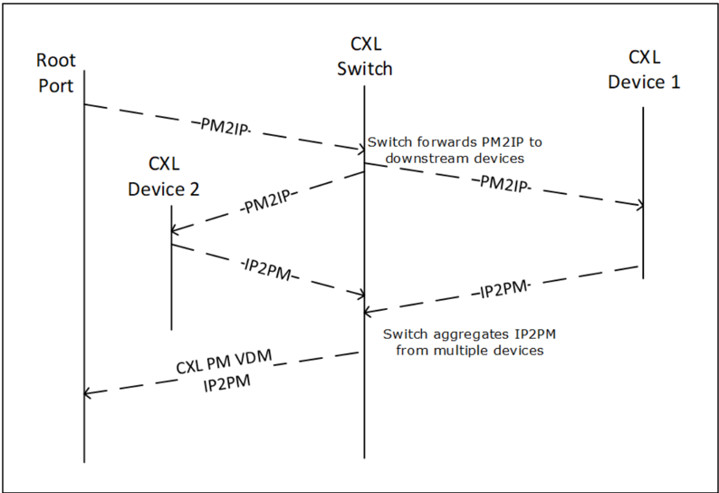

### 9.2 Compute Express Link Device Boot Flow

CXL devices will follow with the appropriate form factor regarding the boot flows. This specification uses the terms 'Warm Reset' and 'Cold Reset' in a manner consistent with PCI Express Base Specification.

### 9.3 Compute Express Link System Reset Entry Flow

In an OS orchestrated reset flow, it is expected that the CXL devices are already in D3 state with their contexts flushed to the system memory before the platform reset flow is triggered.

In a platform triggered reset flow (due to a fatal error etc.), a CXL.io device may not be in D3 State when it receives the ResetPrep message.

During system reset flow, host shall issue a CXL PM VDM (see [Table 5](#table-5-cxl-power-management-messages-data-payload-fields-definitions)) to the downstream CXL components with the following values.

- PM Logical Opcode[7:0]=RESETPREP
- Parameter[15:0]=REQUEST
- ResetType = Warm Reset
- PrepType = General Prep.

The CXL device shall flush any relevant context to the host (if any), clean up the data serving the host and put any CXL device connected memory into safe state such as self-refresh. The CXL device shall take any additional steps that are necessary for the CXL host to enter LTSSM Hot-Reset. After all the Reset preparation is completed, the CXL device shall issue a CXL PM VDM with the following value

- PM Logical Opcode[7:0]=RESETPREP
- Parameter[15:0]=RESPONSE
- ResetType = Warm Reset
- PrepType = General Prep

The CXL device may have PERST# asserted after reset handshake. On PERST# assertion, the CXL device should clear any sticky content internal to the device unless they are on AuxPower. The CXL device's handling of sticky state is consistent with the PCI Express Base specification.

To prevent a deadlock in the case where one or more downstream components do not respond with an Ack, the host must implement a timeout, after which, it proceeds as if the response has been received.

#### Figure 141. CXL Device Reset Entry Flow

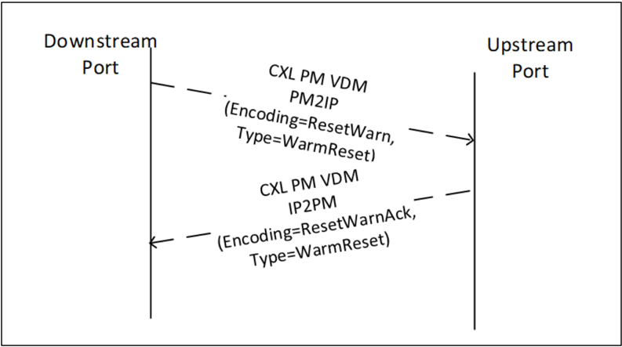

### 9.4 Compute Express Link Device Sleep State Entry Flow

Since OS is the orchestrator of Sx flows always, it is expected that the CXL devices are already in D3 state with their contexts flushed to the CPU-attached or CXL-attached memory before the platform Sx flow is triggered.

During Sx flow, the host shall issue a CXL PM VDM (see [Table 5](#table-5-cxl-power-management-messages-data-payload-fields-definitions)) to the downstream components with the following values.

- PM Logical Opcode[7:0]=RESETPREP
- Parameter[15:0]=REQUEST
- ResetType = host space transition from S0 to Sx (S1, S3, S4 or S5)
- PrepType = General Prep

The CXL device shall flush any relevant context to the host (if any), clean up the data serving the host and puts any CXL device connected memory into safe state such as self-refresh. The CXL device shall take any additional steps that are necessary for the CXL host to initiate a L23 flow. After all the Sx preparation is completed, the CXL device shall issue a CXL PM VDM with the following values

- PM Logical Opcode[7:0]=RESETPREP
- Parameter[15:0]=RESPONSE
- ResetType = host space transition from S0 to Sx (based on the target sleep state)
- PrepType = General Prep

PERST# to the CXL device may be asserted any time after this handshake is completed. On PERST# assertion, the CXL device should clear any sticky content internal to the device unless they are on AuxPower. The CXL device's handling of sticky state is consistent with the PCI Express Base Specification.

CXL.mem capable adapters may need aux power to retain memory context across S3.

Note: PERST# shall always be asserted for CXL Sx Entry flows.

#### Figure 142. CXL Device Sleep State Entry Flow

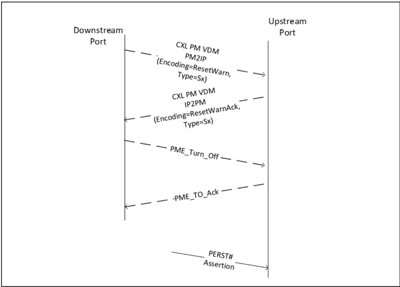

### 9.5 Function Level Reset (FLR)

The PCIe FLR mechanism enables software to quiesce and reset Endpoint hardware with Function-level granularity. CXL devices expose one or more PCIe functions to host software. These functions can expose FLR capability and existing PCIe compatible software can issue FLR to these functions. The PCIe Base Specification provides specific guidelines on impact of FLR on PCIe function level state and control registers. For compatibility with existing PCIe software, CXL PCIe functions should follow those guidelines if they support FLR. For example, any software readable state that potentially includes secret information associated with any preceding use of the Function must be cleared by FLR.

FLR has no effect on the CXL.cache and CXL.mem protocol. Any CXL.cache and CXL.mem related control registers including CXL DVSEC structures and state held by the CXL device are not affected by FLR. The memory controller hosting the HDM is not reset by FLR. Upon FLR, all address translations associated with the corresponding Function are invalidated in accordance with PCI Express Specification. Since the CXL Function accesses cache using system physical address held in address translation cache, the Function is unable to access any cachelines after FLR until software explicitly re-enables ATS. The device is not required to write back its cache during FLR flow. It is strongly recommended that the device not write back its cache content during FLR if the cache is shared by multiple functions to avoid an adverse effect on the performance of the other functions. Cache coherency must be maintained.

In some cases, system software may use FLR to attempt error recovery. In the context of CXL devices, errors in CXL.mem and CXL.cache logic cannot be recovered by FLR. FLR may succeed in recovering from CXL.io domain errors.

All Functions in a CXL 2.0 device that participate in CXL.cache or CXL.mem are required to support either FLR or CXL Reset ([Section 9.7](#97-cxl-reset)).

### 9.6 Cache Management

A legacy OS or legacy PCIe bus driver is not aware of CXL.cache capability. The device driver is expected to be aware of this CXL.cache capability and may manage the CXL cache. Software shall not assume that lines in device cache that map to HDM will be flushed by CPU cache flush instructions. The behavior may vary from one host to another.

System software may wish to ensure that a CXL.cache capable device does not contain any valid cachelines without resetting the system or the entire device. Since a device is not required to clear cache contents upon FLR, separate control and status bits are defined for this purpose. This capability is mandatory for all CXL 2.0 CXL.cache capable devices and highly recommended for CXL 1.1 CXL.cache capable devices. It is advertised via Cache Writeback and Invalidate Capable flag in the DVSEC CXL Capability register ([Section 8.1.3.1](#8131-dvsec-cxl-capability-offset-0ah)).

Software shall take the following steps to ensure device does not contain any valid cachelines

1. Set Disable Caching=1. This bit is located in DVSEC CXL Control2 register ([Section 8.1.3.4](#8134-dvsec-cxl-control2-offset-10h)).
2. Set Initiate Cache Write Back and Invalidation=1. This step may be combined with the previous step as a single configuration space register write to the DVSEC CXL Control2 register ([Section 8.1.3.4](#8134-dvsec-cxl-control2-offset-10h)).
3. Wait until Cache Invalid=1. This register is located in the DVSEC CXL Status2 ([Section 8.1.3.5](#8135-dvsec-cxl-status2-offset-12h)). Software may leverage cache size reported in the DVSEC CXL Capability2 register ([Section 8.1.3.7](#8137-dvsec-cxl-capability2-offset-16h)) to compute a suitable timeout value.

Software is required to Set Disable Caching=0 in order to re-enable caching. Upon the transition of the Disable Caching bit from 1 to 0, the device shall transition the Cache Invalid bit to 0 if it was previously 1.

### 9.7 CXL Reset

CXL.mem and CXL.cache resources such as controllers, buffers and caches are likely to be shared at the device level. CXL Reset is a mechanism to reset all CXL.mem and CXL.cache state in addition to CXL.io in all non-Virtual Functions that support CXL.cache and or CXL.mem protocols. Reset of CXL.io has the same scope as FLR. [Section 9.5](#95-function-level-reset-flr) describes FLR in the context of CXL devices. CXL Reset will not affect nonCXL Functions or the physical link. Non-CXL Function Map DVSEC capability is used to advertise to the Host software which non-Virtual Functions are considered non-CXL i.e. they neither participate in CXL.cache nor in CXL.mem.

All Functions in a CXL 2.0 SLD that participate in CXL.cache or CXL.mem are required to support either FLR or CXL Reset. MLDs, on the other hand, are required to support CXL Reset.

Control, status and capability fields for CXL Reset are exposed in configuration space of Device 0, Function 0 of a CXL device, but these affect all physical and virtual functions within the device that participate in CXL.cache or CXL.mem.

The system software is responsible for quiescing all the Functions that are impacted due to reset of the CXL.cache and CXL.mem state in the device and offlining any associated HDM ranges. Once the CXL Reset is completed, all CXL Functions on the device must be re-initialized prior to use.

CXL Reset may be issued by the System Software or the Fabric Manager. To quiesce the impacted non-virtual Functions prior to issuing CXL Reset, the System Software shall complete the following actions for each of the CXL non-virtual Functions:

1. Offline any volatile or persistent HDM Ranges. When offlining is completed, there shall be no outstanding or new CXL.mem transactions to the affected CXL Functions.
2. Configure these Functions to stop initiating new CXL.io requests. This procedure is identical to that for FLR.
3. The FM may issue CXL Reset for various cases described in Chapter 7. In the case of the FM use of CXL Reset, there may be outstanding commands in the device which shall be silently discarded.

CXL.io reset of the device shall follow the definition of FLR in PCIe Base Specification. Note that only PCIe mapped memory shall be cleared or randomized by the non-virtual Functions during FLR.

Reset of CXL.cache and CXL.mem state as part of the CXL reset flow at the device level has the following behavior:

- All outstanding or new CXL.mem reads shall be silently discarded. Previously accepted writes to persistent HDM ranges shall be persisted. Writes to volatile HDM ranges may be discarded.
- The device caches (Type 1 and Type 2 Devices) shall be written back and invalidated by the device. Software is not required to write back and invalidate device cache ([Section 9.6](#96-cache-management)) prior to issuing the CXL reset.
- No new CXL.cache requests shall be issued except for the above cache flushing operation. Snoops shall continue to be serviced.
- Contents of volatile HDM ranges may or may not be retained and the device may optionally clear or randomize these ranges if this capability is supported and is requested during CXL Reset (See the CXL Reset Mem Clr Capable in the DVSEC CXL Capability Register and the CXL Reset Mem Clr Enable bit in the DVSEC Control2 Register). Contents of the persistent HDM ranges will be retained by device.
- Any errors during a CXL Reset shall be logged in the error status registers in the usual manner. Failure to complete a CXL Reset shall result in the CXL Reset Error bit in the DVSEC CXL Status2 Register being set. The system software may choose to retry CXL Reset, assert other types of device resets, or restart the system in response to a CXL Reset failure.
- Unless otherwise specified, all non-sticky registers defined in this specification shall be initialized to their defaults value upon CXL reset. The CONFIG_LOCK bit in the DVSEC Config Lock register ([Section 8.1.3.6](#8136-dvsec-cxl-lock-offset-14h)) and any register fields that are locked by CONFIG_LOCK shall not be affected by CXL Reset. Any sticky registers such as the error status registers shall be preserved across CXL Reset. If the device is in the viral state, it shall remain in that state after a CXL reset.

If the device is unable to complete CXL Reset within the timeout period specified, the System Software shall consider this a failure and may choose to take actions similar to when the CXL Reset Error bit is set.

Pooled Type 3 device (MLD) must ensure that only the LD assigned to the Host issuing CXL Reset is impacted. This includes the clearing or randomizing of the volatile HDM ranges on the device. Other LDs must continue to operate normally.

#### 9.7.1 Effect on the Contents of the Volatile HDM

Since the ownership of the volatile HDM ranges may change following a CXL Reset, it is important to ensure that there is no leak of volatile memory content that was present prior to the CXL Reset (This condition does not apply to persistent memory content whose security is ensured by other means not discussed here).

There are two cases to consider:

1. The device remains bound to the same Host and the System Software reallocates the volatile HDM ranges to a different software entity. The System Software is often responsible for ensuring that the memory range is re-initialized prior to any allocation. The device may implement an optional capability to perform clearing or randomizing of all impacted volatile HDM ranges. This may be invoked using the optional Secure Erase function (Section 8.2.9.5.5.2). Optionally, the device may be capable of clearing or randomizing volatile HDM content as part of CXL Reset. If this capability is available, the System Software may take advantage of it. However, since this is an optional capability, the System Software should not depend on it.
2. The device is migrated to a different Host with FM involvement as described in Chapter 7. The FM must use either Secure Erase operation (Section 8.2.9.5.5.2) or utilize CXL Reset if the CLX Reset Mem Clr capability exists to clear or randomize any volatile HDM ranges prior to re-assigning device to a different Host.

Capability for clearing and randomizing volatile HDM ranges in the device is reported by the CXL Reset Mem Clr Capable bit in the DVSEC CXL Capability Register. If present, this capability may be optionally used by setting the CXL Reset Mem Clr Enable in the DVSEC CXL Control2 Register.

#### 9.7.2 Software Actions

System Software shall follow these steps while performing CXL Reset:

1. Determine if device supports the CXL Reset and the CXL Reset Mem Clr capability. by consulting the DVSEC CXL Capability Register ([Section 8.1.3.1](#8131-dvsec-cxl-capability-offset-0ah)).
2. If the device supports the CXL Reset Mem Clr capability, program the CXL Reset Mem Clr Enable in the DVSEC Control2 Register ([Section 8.1.3.4](#8134-dvsec-cxl-control2-offset-10h)) as required.
3. Determine the timeout for completion by consulting the DVSEC CXL Capability Register.
4. Prepare the rest of the system for CXL Reset (e.g. offline memory, quiesce initiators) as described earlier.
5. Set the Initiate CXL Reset=1 in the DVSEC CXL Control2 register.
6. Wait for CXL Reset Complete=1 or CXL Reset Error = 1 in the DVSEC CXL Status2 register ([Section 8.1.3.5](#8135-dvsec-cxl-status2-offset-12h)) for up to the timeout period.

System Software should follow these steps while re-initializing and onlining a device:

1. Set up the device as required to enable functions impacted by CXL Reset.
2. Optionally check to see if the device performed clearing or randomizing of memory during the CXL Reset. If yes, skip software-based initialization prior to reallocation. If not, perform software-based initialization.

### 9.8 Global Persistent Flush (GPF)

Global Persistent Flush (GPF) is a hardware-based mechanism associated with persistent memory that is used to flush cache and memory buffers to a persistence domain. A persistence domain is defined as a location that is guaranteed to preserve the data contents across a restart of the device containing the data. GPF operation is global in nature since all CXL agents that are part of a cache coherency domain participate in the GPF flow. A CXL cache coherency domain consists of one or more hosts, all CXL Root Ports that belong to these hosts, and the virtual hierarchies associated with these Root Ports.

GPF may be triggered in response to an impending non-graceful shutdown such as a sudden power loss. The host may initiate GPF to ensure any in-flight data is written back to persistent media prior to power going away. GPF may also be triggered upon other asynchronous or synchronous events that may or may not involve power loss. The complete list of such events, the mechanisms by which host is notified and coordination across CXL Root Ports are outside the scope of this specification.

#### 9.8.1 Host and Switch Responsibilities

All hosts and switches that comply with 2.0 or a later version of CXL shall support GPF as outlined in this section.

GPF flow consists of two phases, GPF Phase 1 and GPF Phase 2. During Phase 1, the devices are expected to stop injecting new traffic and write back their caches. During Phase 2, the persistent devices are expected to flush their local write buffers to a persistence domain. This two-phase approach ensures a device does not receive any new traffic while it is flushing its local memory buffers. The host shall enforce a barrier between the two phases. The host shall ensure that it stops injecting new CXL.cache transactions and its local caches are written back prior to entering GPF Phase 2.

In certain configurations, the cache write back step may be skipped during GPF Phase 1. There are various possible reasons for implementing this mode of operation that are outside the scope of this specification. One possible reason could be that the host does not have the required energy to write back all the caches in time before power loss. When operating in this mode, the system designer may use other means, outside the scope of this specification, to ensure that the data that is meant to be persistent is not lost. The host shall set the Payload[1] flag in the GPF Phase 1 request to indicate that the devices shall write back their caches during the Phase 1. The host uses a host specific mechanism to determine the correct setting of Payload[1].

During each phase, the host shall transmit a CXL GPF PM VDM request to each GPF capable device or switch directly connected to each of its Root Ports and wait for a response. [Table 5](#table-5-cxl-power-management-messages-data-payload-fields-definitions) describes the format of these messages. The Switch's handling of a GPF PM VDM is described in [Section 9.1.2.1](#9121-switch-behavior). The CXL Root Ports and CXL downstream Switch Ports shall implement timeouts to prevent a single device from blocking GPF forward progress. These timeouts are configured by system software (see [Section 8.1.6](#816-gpf-dvsec-for-cxl-port)). A host or a switch may assume that the GPF timeouts configured across Downstream Ports at the same level in the hierarchy are identical. If a Switch detects a timeout, it shall set the Payload [8] in the response to indicate an error condition. This enables a CXL Root Port to detect GPF Phase 1 errors anywhere in the virtual hierarchy it spawns. If an error is detected by any Root Port in the coherency domain, the host shall set the Payload[8] flag during the Phase 2 flow informing every CXL device of an error during the GPF Phase 1. Persistent devices may log this indication in a device specific manner and make this information available to system software. If the host is positively aware that the GPF event will be followed by a powerfail, it should set the Payload[0] in the GPF Phase 1 request message. If the host cannot guarantee that the GPF event will be followed by a powerfail, it shall not set the Payload[0] in the GPF Phase 1 request message.

The CXL devices and switches must be able to receive and process GPF messages without dependency on any other PM messages. GPF messages do not use a credit and no CREDIT_RTN message is expected in response to a GPF request.

The host may reset the device any time after completion of GPF Phase 2.

If the host detection or processing of a GPF event and a reset event overlap, the host may process either event and ignore the other event. If the host detection or processing of a GPF event and an Sx event overlap, the host may process either event and ignore the other event. If host detects a GPF event while it is entering a lower power state, it is required to process the GPF event in a timely fashion.

#### 9.8.2 Device Responsibilities

If a device supports GPF, it shall set Bit 1 of CAPABILITY_VECTOR field in its AGENT_INFO response (see [Table 5](#table-5-cxl-power-management-messages-data-payload-fields-definitions)). All CXL 2.0 and later devices shall support GPF. A CXL 1.1 device may support GPF functionality. If a device supports GPF, it shall respond to all GPF request messages regardless of whether it is required to take any action. A lack of response within a software configured timeout window may be interpreted as an error by the Host. For example, a Type 3 device may or may not take any specific action during GPF Phase 1 other than generating a GPF Phase 1 response message.

Upon receiving a GPF Phase 1 request message, a CXL device shall execute the following steps in the specified order:

1. Stop injecting new CXL.cache transactions except for cache write backs described in step 3 below
2. If CXL.cache capable and Payload[1]=1, disable caching. This will ensure that the device no longer caches any coherent memory and thereby not cache any writes received over the CXL interface in its CXL cache.
3. If CXL.cache capable and Payload[1]=1, write back all modified lines in the device cache. The memory destination may be local or remote.
- In order to minimize GPF latency, the device should ignore lines that are not dirty
- In order to minimize GPF latency, the device should not write back lines that it knows are mapped to volatile memory. The mechanism by which the device obtains this knowledge is outside of this specification.
- The device must write back all dirty lines that are mapped to its local persistent HDM using device internal mechanisms.
- The device must write back all dirty lines that are not mapped to its local HDM and may be of persistent type. Each such dirty line must be written back to the destination HDM in two steps:

Issue DirtyEvict request to the host ([Section 3.2.4.1.15](#324115-dirtyevict))

Issue Clflush request to the host ([Section 3.2.4.1.13](#324113-clflush)).

4. Indicate the device is ready to move to the GPF Phase 2 by sending a GPF Phase 1 response message. Set the Payload [8] in the response if the Phase 1 processing was not successful.

A device may take additional steps to reduce power draw from the system if the Payload[0] flag is set in the request message indicating power failure is imminent. For example, a device may choose to not wait for responses to the previously issued reads before initiating the write back operation [step 3] above as long as the read responses do not impact persistent memory content.

Until the receipt of GPF Phase 2 request message, the device must respond to and complete any accesses it receives over CXL interface. This is to ensure the other requestors can continue to make forward progress through GPF flow.

Upon receiving a GPF Phase 2 request, a CXL device shall execute the following steps in the specified order

1. If it is a persistent memory device and the Payload[8] flag is set, increment Dirty Shutdown Count (See section Section 8.2.9.5.3.1)
2. Flush internal memory buffers to local memory if applicable
3. Acknowledge the request by sending a GPF Phase 2 response message.
4. Enter the lowest possible power state.

As this exchange may be performed in the event of an impending power loss, it is important that any flushing activity in either phase is performed in an expedient manner, and that the acknowledgment of each phase is sent as quickly as possible.

A device may have access to an alternate power source (e.g., a device with a large memory buffer may include a charged capacitor or battery) and may acknowledge GPF Phase 2 requests as soon as it has switched over to the alternate power source. Such a device shall ensure that PERST# assertion does not interfere with the local flush flow and shall handle a subsequent power-up sequence correctly even if the local flush is in progress.

A device is not considered to be fully operational after it receives a GPF Phase 1 Request. In this state, a device shall correctly process Conventional Reset request; and return to operational state upon successful completion of these resets.

If the device detection or processing of a GPF event and a reset event overlap, the device may process either event and ignore the other event. If the device detection or processing of a GPF event and an Sx event overlap, the device may process either event and ignore the other event. If a device receives a GPF request while it is entering a lower power state, it shall process the GPF request in a timely fashion.

A pooled device is composed of multiple LDs, which are assigned to different Virtual Hierarchies. Because a GPF event may or may not be coordinated across these hierarchies, each LD shall be capable of independently processing GPF messages targeting that individual LD, without affecting any other LD within the MLD. An MLD cannot go into a lower power state until all LDs associated with the device have indicated that they are ready to go to the lower power state. In addition, the MLD must be able to process multiple GPF events (from different VCS targeting unique LDs).

If a device receives a GPF Phase 2 request message without a prior GPF Phase1 request message, it shall respond to that GPF Phase 2 request message.

#### 9.8.3 Energy Budgeting

It is often necessary to assess whether a system has sufficient energy to handle GPF during a power fail scenario. System software may use the information available in various CXL DVSEC registers along with its knowledge of the rest of the system to make this determination.

This information may also be used to calculate appropriate GPF timeout values at various points in the CXL hierarchy. See the implementation note below. The timeout values are configured through GPF DVSEC for CXL Ports ([Section 8.1.6](#816-gpf-dvsec-for-cxl-port)).

> **IMPLEMENTATION NOTE**
> 
> System software may determine the total energy needs during powerfail GPF. There may always be a non-zero possibility that Power fail GPF may fail (e.g. under unusual thermal conditions or fatal errors). The goal of the system designer is to make sure the probability of failure is sufficiently low and meets the system design objectives.
> 
> The following high-level algorithm may be followed for calculating timeouts and energy requirements
> 
> 1. Iterate through every CXL device and calculate T1, T2 as defined in Column (Time needed) in [Table 207](#table-207-gpf-energy-calculation-example).
> 2. Calculate T1MAX and T2MAX.
>     - a. T1MAX = MAX of T1 values calculated for all devices plus propagation delay, host side processing delays and any other host/system specific delays.
>     - b. T2MAX = MAX of T2 values calculated for all devices in the hierarchy plus propagation delay, host side processing delays and any other host/system specific delays. This could be same as GPF Phase 2 timeout at RC.
> 3. Calculate E1 and E2 for each device. See Column 'Energy needed' in [Table 207](#table-207-gpf-energy-calculation-example).
> 4. Do summation over all CXL devices (E1+E2). Add energy needs for host and nonCXL devices during this window.
> 
> The GPF timeout registers in the Root Port and the Downstream Switch Port CXL Port GPF Capability Structure may be programmed to T1MAX and T2MAX, respectively. Device active power is the amount of power the device consumes in D0 state and may be reported by the device via Power Budgeting Extended Capability. Cache size is reported via PCIe DVSEC for CXL Devices (Revision 1). This computation may have to be redone periodically as some of these factors may change. When a CXL device is hot-added/removed, it may warrant recomputation. Refer to [Table 207](#table-207-gpf-energy-calculation-example).
> 
> Cache size, T2 and GPF Phase 2 Power parameters are reported by the device via GPF DVSEC for CXL Devices ([Section 8.1.7](#817-gpf-dvsec-for-cxl-device)). The other parameters are system dependent. System software may use ACPI HMAT to determine average persistent memory bandwidth, but it could apply additional optimizations if it is aware of the specific persistent device the accelerator is operating on. In some cases, System Firmware may be the one performing this computation. Since System Firmware may or may not be aware of workloads, it may make conservative assumptions.
> 
> If the system determines it does not have sufficient energy to handle all CXL devices, it may be able to take certain steps e.g. reconfigure certain devices to stay within the system budget by reducing the size of cache allocated to persistent memory or limit persistent memory usages.Several system level and device level optimizations are possible:
> 
> - Certain accelerators may always operate on volatile memory and could skip the flush. For these accelerators, T1 would be 0.
> - Device could partition cache among volatile vs. non-volatile memory and thus lower T1. Such partitioning may be accomplished with assistance from system software.
> - A device could force certain blocks (e.g. execution engines) in lower power state upon receiving a GPF Phase 1 request.
> - Device may include a local power source and therefore could lower its T1 and T2
> - System software may configure all devices so that all T1s and T2s are roughly equal. This may require performance and/or usage model trade-offs.

### Table 207. GPF Energy Calculation Example

| Device step                                   | Time needed                                                                                               | Energy needed                   |
|-----------------------------------------------|-----------------------------------------------------------------------------------------------------------|---------------------------------|
| Stop traffic generation                       | Negligible                                                                                                | Negligible                      |
| Disable caching                               | Negligible                                                                                                | Negligible                      |
| Write back cache content to persistent memory | T1= Cache size * %of lines in cache mapped to persistent memory / worst case persistent memory bandwidth. | E1= T1MAX * device active Power |
| Flush local Memory buffers to local memory    | T2                                                                                                        | E2= T2 * GPF Phase 2 Power      |

### 9.9 Hot-Plug

CXL 1.1 hosts and CXL 1.1 devices do not support hot-plug.

CXL 2.0 Root Ports, CXL 2.0 devices and CXL switches shall support Hot-Add and managed Hot-Remove. In a managed Hot-Remove flow, software is notified of a hot removal request. This provides CXL aware system software the opportunity to write back device cachelines and to offline device memory prior to removing power. During a Hot-Add flow, CXL aware system software discovers the CXL.cache and CXL.mem capabilities of the adapter and initializes them so they are ready to be used.

CXL leverages PCI Express Hot-plug model and Hot-plug elements as defined in PCI Express Specification and the applicable form factor specifications.

CXL 2.0 specification does not define the mechanisms for graceful handling of Surprise Hot-Remove of CXL 1.1 or CXL 2.0 adapters. If a CXL adapter that holds modified lines in its cache is removed without any prior notification, subsequent accesses to those addresses may result in timeouts that may be fatal to the host operation. If a CXL adapter with HDM is removed without any prior notification, subsequent accesses to HDM locations may result in timeouts that may be fatal to the host operation.

CXL 2.0 capable Downstream Ports and CXL 1.1 Downstream Ports shall hardwire HotPlug surprise bit in Slot Capabilities register to 0. Software may leverage Downstream Port Containment capability of the Downstream Port to gracefully handle surprise hot removal of PCIe adapters or contain errors resulting from surprise hot removal or link down of CXL adapters.

Switches and CXL 2.0 devices should export the Coherent Device Attribute Table (CDAT) via ReadTable DOE ([Section 8.1.11](#8111-table-access-doe)). Software may use this interface to learn about performance and other attributes of the device or the Switch.

The Root complex and Upstream Switch Ports implement HDM Decoder Capability Structure. Software may program these to account for the HDM capacity with appropriate interleaving scheme ([Section 9.13.1](#9131-memory-interleaving)). Software may choose to leave the decoders unlocked for maximum flexibility and use other protections (such as page tables) to limit access to the registers. All unused decoders are unlocked by definition and software may claim these to decode additional HDM capacity during Hot-Add flow.

All CXL 2.0 CXL.cache capable devices should implement Cache Writeback and Invalidation capability ([Section 9.6](#96-cache-management)). Software may use this capability to ensure a CXL.cache capable device does not have any modified cachelines prior to removing power.

Software shall make sure the device has completed the Power Management Initialization ([Section 8.1.3.5](#8135-dvsec-cxl-status2-offset-12h)) prior to enabling its CXL.cache or CXL.mem capabilities.

Software shall make sure it does not enable CXL.cache device below a given Root Port if the Root Port does not support CXL.cache. The Root Port's capabilities are exposed via DVSEC Flex Bus Port Capability register. All CXL 2.0 CXL.cache capable devices should expose the size of its cache via DVSEC CXL Capability2 register. Software may cross check this against the host's effective snoop filter capabilities ([Section 8.2.5.15.2](#825152-snoop-filter-effective-size-offset-4)) during Hot-Add of CXL.cache capable device. Software may configure Cache_SF_Coverage field in DVSEC CXL control register to indicate to the device how much snoop filter capacity it should use (0 being a legal value). In extreme scenarios, software may disable a CXL.cache devices to avoid snoop filter oversubscription.

During Hot-Add, System Software may reassess GPF energy budget and take corrective actions if necessary.

Hot-Add of a CXL 1.1 device may result in unpredictable behavior. The following mechanisms are defined to ensure that a CXL 1.1 device that is hot-added in runtime is not be discoverable by standard PCIe software.

- For Root Ports connected to hot-plug capable slots, it is recommended that System Firmware set Disable CXL1p1 Training bit ([Section 8.2.1.3.2](#82132-dvsec-flex-bus-port-control-offset-0ch)) after completion of System Firmware PCIe enumeration but before OS hand-off. This will ensure that a CXL 2.0 Downstream Port will fail the link training if a CXL 1.1 device is hot-added. A hot-plug event may be generated in these cases, and the hot-plug handler may be invoked. The hot-plug handler may treat this condition as a failed hot-plug, notify user and power down the slot.
- A Downstream Switch Port may itself be hot-added and cannot rely on System Firmware setting Disable CXL1p1 Training bit. A Switch shall not report link up condition and shall not report presence of an adapter when it is connected to a CXL 1.1 adapter. System Firmware or CXL aware software may still consult DVSEC Flex Bus Port Status ([Section 8.2.1.3.3](#82133-dvsec-flex-bus-port-status-offset-0eh)) and discover that the Port is connected to a CXL 1.1 device.

>  **IMPLEMENTATION NOTE**
> 
> CXL 2.0 Type 3 device Hot-Add flow
> 
> 1. System Firmware may prepare the system for a future Hot-Add (e.g., pad resources to accommodate the needs of an adapter to be hot-added)
> 2. User hot-adds a CXL 2.0 memory expander in an empty slot. Downstream Ports brings up the link in CXL 2.0 mode.
> 3. PCIe hot-plug interrupt is generated.
> 4. Bus driver performs the standard PCIe Hot-Add operations, thus enabling CXL.io. This process assigns BARs to the device.
> 5. CXL aware software (CXL bus driver in OS, the device driver or other software entity) probes CXL DVSEC capabilities on the device and ensures that HDM is active. Memory may be initialized either by hardware or FW on the adapter or the device driver.
> 6. CXL aware software configures the CXL DVSEC structures on the device, switches and Root Complex (e.g., GPF DVSEC, HDM decoders).
> 7. CXL aware software notifies OS memory manager about the new memory and its attributes such as latency and bandwidth. Memory manager processes a request and adds the new memory to its allocation pool.
> 8. The user may be notified via attention indicator or some other user interface of successful completion.

> **IMPLEMENTATION NOTE**
> 
> CXL 2.0 Type 3 device managed Hot-Remove flow
> 
> 1. User initiates a Hot-Remove request via attention button or some other user interface.
> 2. The standard PCIe Hot-Remove flow is triggered (e.g. via hot-plug interrupt if attention button was used).
> 3. CXL aware software (CXL bus driver in OS, the device driver or other software entity) probes CXL DVSEC capabilities on the device and determines active memory ranges.
> 4. CXL aware software requests the OS memory manager to vacate these ranges.
> 5. If the Memory Manager is unable to fulfill this request (e.g., because of presence of pinned pages), CXL aware software will return an error to the Hot-Remove handler, which will notify the user that the operation has failed.
> 6. If the Memory Manager is able to fulfill this request, CXL aware system software reconfigures HDM Decoders in CXL switches and Root Ports. This is followed by the standard PCIe Hot-Remove flow that will process CXL.io resource deallocation.
> 7. If the PCIe Hot-Remove flow fails, the user is notified that the Hot-Remove operation has failed. Otherwise, the user is notified that the Hot-Remove flow has successfully completed.

> **IMPLEMENTATION NOTE**
> 
> CXL 2.0 Type 1 device Hot-Add flow
> 
> 1. System Firmware may prepare the system for a future Hot-Add (e.g. pad MMIO resources to accommodate the needs of an adapter to be hot-added)
> 2. The user Hot-Adds a CXL 2.0 Type 1 device in an empty slot.The downstream Port brings up the link in CXL 2.0 mode.
> 3. A PCIe hot-plug interrupt is generated.
> 4. The bus driver performs the standard PCIe Hot-Add operations, thus enabling CXL.io. This process assigns BARs to the device.
> 5. CXL aware software (CXL bus driver in OS, the device driver or other software entity) probes CXL DVSEC capabilities on the device. If the device is hot-added below a Root Port that cannot accommodate a CXL.cache enabled device, HotAdd is rejected. If the device has larger cache than what the host snoop filter can handle, Hot-Add is rejected. The user may be notified via attention indicator or some other user interface of this.
> 6. If the above checks pass, CXL aware software configures the CXL DVSEC structures on the device and switches (e.g. GPF DVSEC).
> 7. The hot-Add flow is complete. The user may be notified via attention indicator or some other user interface of successful completion.

### 9.10 Software Enumeration

A CXL 2.0 device is exposed to the host software as one or more PCI Express Endpoints. A CXL 1.1 device is exposed to the host software as one or more Root Complex Integrated Endpoints. PCIe is the most widely used device model by various OSs. In addition to leveraging the software infrastructure and device driver writer expertise, this choice also enables us to readily use PCIe extensions like SR-IOV and PASID.

A CXL device cannot claim I/O resources since it is not a Legacy Endpoint. For definition of Legacy Endpoint, see PCI Express Base Specification.

Discovery of CXL devices follows the PCIe model, but there are some important differences between a CXL 1.1 Hierarchy and a CXL 2.0 Virtual Hierarchy.

### 9.11 CXL 1.1 Hierarchy

In a CXL 1.1 Hierarchy, the link itself is not exposed to the Operating System as a PCIe link. This is different from PCIe model where PCIe bus driver in OS is able to manage the PCIe link. This approach ensures 100% compatibility with legacy PCIe software.

Since the link is not exposed to legacy OS, each CXL 1.1 device creates a new PCIe enumeration hierarchy in the form of an ACPI defined PCIe Host Bridge (PNP ID PNP0A08). CXL Endpoints appear as Root Complex Integrated Endpoints (RCiEP).

CXL Endpoints report 'PCIe' interface errors to OS via Root Complex Event Collector (RCEC) implemented in the host. This is enabled via an extension to the RCEC (Root Complex Event Collector Bus Number Association ECN) to PCIe specification.

#### 9.11.1 PCIe Software View of the CXL 1.1 Hierarchy

##### Figure 143. PCIe Software View of CXL 1.1 Hierarchy

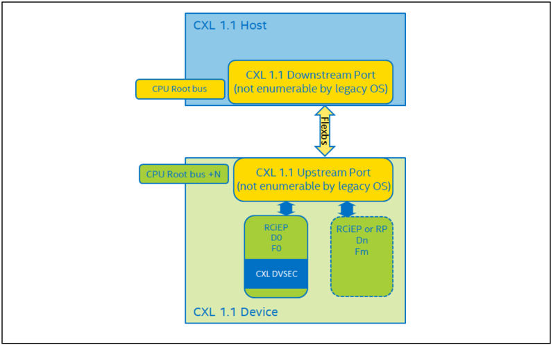

Since the CXL link is not exposed to legacy OS, the System Firmware view of the hierarchy is different than that of the legacy OS.

#### 9.11.2 System Firmware View of CXL 1.1 Hierarchy

The functionality of the CXL 1.1 Downstream Port and the CXL1.1Upstream Port can be accessed via memory mapped registers. These will not show up in standard PCI bus scan by existing Operating Systems. The base addresses of these registers are set up by System Firmware and System Firmware can use that knowledge to configure CXL.

System Firmware configures the Downstream Port to decode the memory resource needs of the CXL device as expressed by PCIe BAR registers and Upstream Port BAR(s). PCIe BARs are not to be configured to decode any HDM associated with the CXL device.

#### 9.11.3 OS View of CXL 1.1 Hierarchy

The CXL device instantiates one or more ACPI Host bridges. The _BBN method for this Host Bridge matches the bus number that hosts CXL RCiEPs.

This ACPI Host Bridge spawns a legal PCIe hierarchy. All PCIe Endpoints located in the CXL device are children of this ACPI Host Bridge. These Endpoints may appear directly on the Root bus number or may appear behind a Root Port located on the Root bus.

The _CRS method for PCIe root bridge returns bus and memory resources claimed by the CXL Endpoints. _CRS response does not include HDM on CXL.mem capable device. Nor does it comprehend any Upstream Port BARs (hidden from OS).

CXL aware OS may use CXL Early Discovery Table(CEDT) or _CBR object in ACPI namespace to locate the Downstream Port and Upstream Port registers. CEDT enumerates all CXL Host Bridges that are present at the time of OS hand-off and _CBR is limited to CXL Host Bridges that are hot-added.

#### 9.11.4 CXL 1.1 Hierarchy System Firmware Enumeration Flow

Since CXL 1.1 Hierarchy does not support Hot-Addition of CXL devices, it is enumerated by System Firmware prior to OS handoff.

The CXL 1.1 hardware autonomous mode selection flow cannot automatically detect the number of retimers. If the system includes retimers, the System Firmware shall follow these steps to ensure the number of retimers is correctly configured.

1. Prior to the link training, the System Firmware should set the DVSEC Flex Bus Port control register, based on the available information, to indicate whether there are 0, 1, or 2 retimers present.  (It is possible that retimers on a CXL add-in card or a backplane may not be detected by BIOS prior to link training and the initial programming may not account for all retimers in the path.)
2. After the link training completes successfully or fails, the System Firmware should read the Retimer Presence Detected and Two Retimers Presence Detected values logged in the PCIe standard Link Status 2 register and see if they are consistent with what was set in the Flex Bus Port DVSEC in the previous step.  If they are different, the System Firmware should bring the link down by setting Link Disable bit in the Downstream Port, update the Retimer1_Present and Retimer2_Present bits in the Flex Bus Port DVSEC and initiate link training again.

#### 9.11.5 CXL 1.1 device discovery

1. Parse configuration space of device 0, function 0 on the Secondary bus # and discover CXL specific attributes. These are exposed via PCIe DVSEC for CXL Devices Capability structures. See [Section 8.1.3](#813-pcie-dvsec-for-cxl-device).

2. If the device supports CXL.cache, configure the CPU coherent bridge. Set Cache Enable bit in the DVSEC CXL Control register.
3. If the device supports CXL.mem, check Mem_HwInit_Mode by reading DVSEC CXL Capability register and determine the number of HDM ranges supported by reading HDM_Count field in the same register.
4. If Mem_HwInit_Mode =1
- The device must set the Memory_Info_Valid bit in each applicable DVSEC CXL Range X Size Low registers (X=1, 2) within 1 second of reset deassertion.
- The device must set the Memory_Active_Valid bit in each applicable DVSEC CXL Range X Size Low registers (X=1, 2) within Memory_Active_Timeout duration of reset deassertion.
- When Memory_Info_Valid is 1, System Firmware reads Memory_Size_High and Memory_Size_Low fields for each supported HDM range. If System Firmware cannot delay boot until the Memory_Active get set, the System Firmware may continue with HDM base assignment and may delay OS hand-off until Memory_Active bit is set.
- System Firmware computes the size of each HDM range and maps those in system address space.
- System Firmware programs the Memory_Base_Low and the Memory_Base_High fields for each HDM range.
- System Firmware programs the ARB/MUX arbitration control registers if necessary.
- System Firmware sets CXL.mem Enable. Once Memory_Active=1, Any subsequent accesses to HDM are decoded and routed to the local memory by the device.
- Each HDM range is later exposed to the OS as a separate, memory-only NUMA node via ACPI SRAT table.
- System Firmware obtains Coherent Device Attribute Table from the UEFI device driver or directly from the device via Table Access DOE ([Section 8.1.11](#8111-table-access-doe)) and uses this information during the construction of ACPI memory map, ACPI SRAT and ACPI HMAT.
5. If Mem_HwInit_Mode =0
- The device must set Memory_Info_Valid bit in each applicable DVSEC CXL Range X Size Low registers (X=1, 2) within 1 second of reset deassertion.
- When Memory_Info_Valid is 1, System Firmware reads Memory_Size_High and Memory_Size_Low fields for supported HDM ranges.
- System Firmware computes the size of each HDM range and maps those in system address space.
- System Firmware programs the Memory_Base_Low and the Memory_Base_High fields for each HDM range.
- System Firmware programs ARB/MUX arbitration control registers if necessary.
- System Firmware sets CXL.mem Enable. Any subsequent accesses to the HDM ranges are decoded and completed by the device. The reads shall return all 1's and the writes will be dropped.
- Each HDM range is later exposed to the OS as a separate, memory-only NUMA node via ACPI SRAT table.
- If the memory is initialized prior to OS boot by UEFI device driver,
- The UEFI driver is responsible for setting Memory_Active.
- Once Memory_Active is set, any subsequent accesses to the HDM range are decoded and routed to the local memory by the device.

- System Firmware uses the information supplied by UEFI driver or Table Access DOE ([Section 8.1.11](#8111-table-access-doe)) during the construction of ACPI memory map and ACPI HMAT. See UEFI Specification for further details.
- If the memory is initialized by an OS device driver post OS boot,
- System Firmware may use the information supplied by UEFI driver or Table Access DOE ([Section 8.1.11](#8111-table-access-doe)) during the construction of ACPI memory map and ACPI HMAT. In future, CXL aware OS may extract this information directly from the device via Table Access DOE.
- At OS hand-off, System Firmware reports that the size of memory associated with HDM NUMA node as zero.
- The OS device driver is responsible for setting Memory_Active after memory initialization is complete. Any subsequent accesses to the HDM memory are decoded and routed to the local memory by the device.
- Availability of memory is signaled to the OS via capacity add flow.

CXL.io resource needs are discovered as part of PCIe enumeration. PCIe Root Complex registers including Downstream Port registers are appropriately configured to decode these resources. CXL Downstream Port and Upstream Port requires MMIO resources. These are also accounted for during this process.

System Firmware programs the memory base and limit registers in the Downstream Port to decode CXL Endpoint MMIO BARs, CXL Downstream Port MMIO BARs, CXL Upstream Port MMIO BARs.

#### 9.11.6 CXL 1.1 Devices with Multiple Flex Bus Links

##### 9.11.6.1 Single CPU Topology

###### Figure 144. One CPU Connected to a Dual-Headed CXL Device Via Two Flex Bus Links

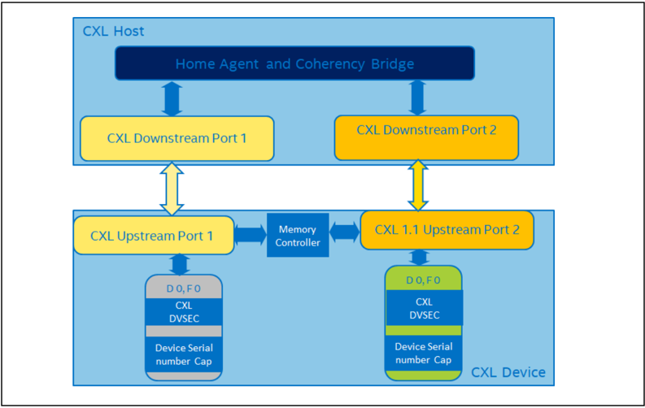

In this configuration, the System Firmware shall report two PCI Host Bridges to the Operating system, one that hosts the left Device 0, Function 0 and the second one that hosts the Device 0, function 0 on the right. Both Device 0, function 0 instances implement PCIe DVSEC for CXL Devices and a Device Serial Number PCIe Extended Capability. A vendor ID and serial number match indicates that the two links are connected to a single CXL device and this enables System Firmware to perform certain optimizations.

In some cases, the CXL device may expose a single CXL device function that is managed by the CXL device's driver, whereas the other Device 0/function 0 represents a dummy device. In this configuration, application software may submit work to the single CXL device instance. However, the CXL device hardware is free to use both links for traffic and snoops as long as the programming model is not violated.

The System Firmware maps the HDM into system address space using the following rules.

###### Table 208. Memory Decode Rules in Presence of One CPU/Two Flex Bus Links

|   Left D0, F0 Mem_Capable | Left D0, F0 Mem_Size   |   Right D0, F0 Mem_ Capable | Right D0, F0 Mem_Size   | System Firmware requirements                                                                                     |
|---------------------------|------------------------|-----------------------------|-------------------------|------------------------------------------------------------------------------------------------------------------|
|                         0 | NA                     |                           0 | NA                      | No HDM                                                                                                           |
|                         1 | M                      |                           0 | NA                      | Range of size M decoded by Left Flex Bus link. Right Flex Bus link does not receive CXL.mem traffic.             |
|                         0 | NA                     |                           1 | N                       | Range of size N decoded by Right Flex Bus link. Left Flex Bus link does not receive CXL.mem traffic.             |
|                         1 | M                      |                           1 | N                       | Two ranges set up, Range of size M decoded by Left Flex Bus link, Range of size N decoded by right Flex Bus link |
|                         1 | M                      |                           1 | 0                       | Single range of size M. CXL.mem traffic is interleaved across two links                                          |
|                         1 | 0                      |                           1 | N                       | Single range of size N. CXL.mem traffic is interleaved across two links                                          |

##### 9.11.6.2 Multiple CPU Topology

###### Figure 145. Two CPUs Connected to One CXL Device Via Two Flex Bus Links

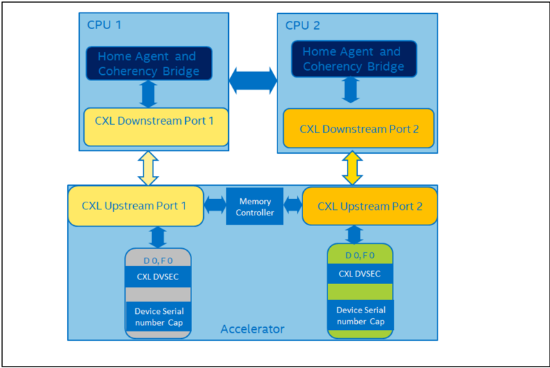

In this configuration, System Firmware shall report two PCI Host Bridges to the Operating system, one that hosts the left Device 0, Function 0 and the second one that host the Device 0, function 0 on the right. Both Device 0, function 0 instances implement PCIe DVSEC for CXL Devices and a Device Serial Number PCIe Extended Capability. A vendor ID and serial number match indicates that the two links are connected to a single accelerator and this enables System Firmware to perform certain optimizations.

In some cases, the accelerator may choose to expose a single accelerator function that is managed by the accelerator device driver and handles all work requests. This may be necessary if the accelerator framework or applications do not support distributing work across multiple accelerator instances. Even in this case, both links should spawn a legal PCIe Host Bridge hierarchy with at least one PCIe function. However, the accelerator hardware is free to use both links for traffic and snoops as long as the programming model is not violated. To minimize the snoop penalty, the accelerator needs to be able to distinguish between the system memory range decoded by CPU 1 versus CPU 2. The device driver can obtain this information via ACPI SRAT table and communicate it to the accelerator using device specific mechanisms.

The System Firmware maps the HDM into system address space using the following rules. Unlike the single CPU case, the System Firmware shall never interleave the memory range across the two Flex Bus links.

###### Table 209. Memory Decode Rules in Presence of Two CPU/Two Flex Bus Links

|   Left D0, F0 Mem_Capable | Left D0, F0 Mem_Size   |   Right D0, F0 Mem_ Capable | Right D0, F0 Mem_Size   | System Firmware requirements                                                                                     |
|---------------------------|------------------------|-----------------------------|-------------------------|------------------------------------------------------------------------------------------------------------------|
|                         0 | NA                     |                           0 | NA                      | No HDM                                                                                                           |
|                         1 | M                      |                           0 | NA                      | Range of size M decoded by Left Flex Bus link. Right Flex Bus link does not receive CXL.mem traffic.             |
|                         1 | M                      |                           1 | 0                       | Range of size M decoded by Left Flex Bus link. Right Flex Bus link does not receive CXL.mem traffic.             |
|                         0 | NA                     |                           1 | N                       | Range of size N decoded by Right Flex Bus link. Left Flex Bus link does not receive CXL.mem traffic.             |
|                         1 | 0                      |                           1 | N                       | Range of size N decoded by Right Flex Bus link. Left Flex Bus link does not receive CXL.mem traffic.             |
|                         1 | M                      |                           1 | N                       | Two ranges set up, Range of size M decoded by Left Flex Bus link, Range of size N decoded by right Flex Bus link |

### 9.12 CXL 2.0 Enumeration

A CXL 2.0 capable host may be represented to system software as zero or more CXL 2.0 Host bridges, zero or more CXL 1.1 Host Bridges and zero or more PCIe Host Bridges. Host Bridge is a software concept that represents a collection of Root Ports.

Enumeration of PCIe Host Bridges and PCIe hierarchy underneath them is governed by PCI Express Base Specification. Enumeration of CXL Host Bridges is described below.

In an ACPI compliant system, CXL 2.0 Host Bridges and CXL 1.1 Host Bridges are identified with ACPI Hardware ID (HID) of 'ACPI0016'. CXL Early Discover Table (CEDT) may be used to differentiate between a CXL 2.0 and a CXL 1.1 Host Bridge. Enumeration of CXL 1.1 Host Bridges and CXL 1.1 devices is described in [Section 9.11](#911-cxl-11-hierarchy).

#### 9.12.1 CXL 2.0 Root Ports

Each CXL 2.0 Host Bridge is associated with Base Bus Number and that bus number shall contain one or more CXL 2.0 capable Root Ports. These Root Ports appears in PCIe configuration space with a Type 1 header and Device/Port Type field in PCI Express Capabilities Register shall identify these as standard PCIe Root Port. Unless stated otherwise, CXL 2.0 Root Ports may implement all Capabilities that are defined in PCIe Base Specification as legal for PCIe Root Port. These Root Ports can be in one of four states

1. Disconnected
2. Connected to CXL 2.0 Device/Switch
3. Connected to CXL 1.1 Device
4. Connected to a PCIe Device/Switch

[Section 9.12.3](#9123-enumerating-cxl-20-capable-downstream-ports) describes how software can determine the current state of a CXL 2.0 Capable Root Port and the corresponding enumeration algorithm.

#### 9.12.2 CXL 2.0 Virtual Hierarchy

CXL 2.0 capable Root Ports operating in CXL 2.0 mode may be directly connected to a CXL 2.0 device or a CXL Switch. These Root Ports spawn a CXL 2.0 Virtual Hierarchy (VH). Enumeration of CXL VH is described below.

CXL 2.0 devices appear as a standard PCI Express Endpoints with Type 0 Header. CXL 2.0 device's primary function (device number 0, function number 0) shall carry one

instance of CXL DVSEC ID 0 with Revision 1 or greater. Software may use this DVSEC instance to distinguish a CXL 2.0 device from an ordinary PCIe device. Unless stated otherwise, CXL 2.0 devices may implement all Capabilities that are defined in the PCIe Base Specification as legal for PCIe devices.

A CXL 2.0 VH may include zero or more CXL 2.0 switches. Specific configuration constraints are documented in Chapter 7.0. From enumeration software perspective, each CXL Switch consists of one Upstream Switch Port and one or more Downstream Switch Ports.

The configuration space of the Upstream Switch Port of CXL 2.0 Switch has a Type 1 header and the Device/Port Type field in the PCI Express Capabilities Register shall identify it as Upstream Port of PCIe Switch. The configuration space carries one instance of a CXL DVSEC ID 3 and one instance of DVSEC ID 7. DVSEC Flex Bus Port Status register in CXL DVSEC ID 7 structure of the peer Port shall indicate that CXL 2.0 protocol was negotiated with the Upstream Switch Port during the link training. Unless stated otherwise, CXL 2.0 Upstream Switch Ports may implement all Capabilities that are defined in the PCIe Base Specification as legal for PCIe Upstream Switch Port.

The configuration space of a Downstream Switch Port of CXL 2.0 Switch also has a Type 1 header but the Device/Port Type field in the PCI Express Capabilities Register shall identify these as Downstream Port of a PCIe Switch. Unless stated otherwise, CXL 2.0 Downstream Switch Ports may implement all Capabilities that are defined in the PCIe Base Specification as legal for PCIe Downstream Switch Port. All of these Ports are CXL 2.0 capable and can be in one of four states just like the CXL 2.0 capable Root Ports

1. Disconnected
2. Connected to CXL 2.0 Device/Switch
3. Connected to CXL 1.1 Device
4. Connected to a PCIe Device/Switch

[Section 9.12.3](#9123-enumerating-cxl-20-capable-downstream-ports) describes how software can determine the current state of a CXL 2.0 Capable Downstream Switch Port and the corresponding enumeration algorithm.

A CXL 2.0 Downstream Switch Port operating in CXL 2.0 mode may be connected to another CXL Switch or a CXL 2.0 device. The rules for enumerating CXL switches and CXL 2.0 devices are already covered earlier in this section.

#### 9.12.3 Enumerating CXL 2.0 Capable Downstream Ports

Software may use the combination of the Link Status registers and the CXL DVSEC ID 7 structure in the Downstream Port configuration space to determine which state a CXL 2.0 Capable Downstream Port is in.

1. CXL 2.0 capable Downstream Ports are in the Disconnected state when they do not have an active link. The status of the link can be detected by following the PCIe Base specification. If the link is not up, software shall ignore the CXL DVSEC ID 3 and the CXL DVSEC ID 7 capability structures. A Hot-Add event may transition a Disconnected Port to a CXL 2.0 Connected state or a PCIe Connected state. Hotadding CXL 1.1 adapter will transition the Port to an Undefined state.
2. CXL 2.0 capable Downstream Ports connected to a CXL 2.0 device/Switch shall expose one instance of the CXL DVSEC ID 3 and one instance of the CXL DVSEC ID 7 capability structures. The DVSEC Flex Bus Port Status register in the CXL DVSEC ID 7 structure shall indicate that the CXL 2.0 protocol was successfully negotiated during link training. System Firmware may leave the Unmask SBR and the Unmask Link Disable bits in Port Control Override register of the Downstream Port at the default (0) values to prevent legacy PCIe software from resetting the device and the link respectively.

3. CXL 2.0 capable Downstream Ports connected to a CXL 1.1 device shall expose one instance of the CXL DVSEC ID 3 and one instance of the CXL DVSEC ID 7 capability structures. The DVSEC Flex Bus Port Status register in the CXL DVSEC ID 7 structure shall indicate that the CXL 2.0 protocol was not negotiated, but that either the CXL.cache or the CXL.mem protocol was negotiated during link training. There are two possible sub-states:
- a. Not Operating in the CXL 1.1 addressing mode - Immediately after the link negotiation, the Port registers appear in the PCIe configuration space with a Type 1 header.
- b. Operating in the CXL 1.1 addressing mode - System Firmware may program CXL 1.1 RCRB Base register in the Port's CXL DVSEC ID 3 capability structure to transition the Port to this mode. Once the Port is in this mode, it can only transition out of it after a reset. A downstream Port operating in this mode shall ignore hot reset requests received from the Upstream Port.
4. CXL 2.0 capable Downstream Ports connected to a PCIe device/Switch may or may not expose the CXL DVSEC ID 3 and the CXL DVSEC ID 7 capability structures.
- a. If the PCI Root Port configuration space contains an instance of CXL DVSEC ID 3 structure, it shall also contain an instance of CXL DVSEC ID 7 structure.
- b. If the PCI Root Port configuration space contains an instance of CXL DVSEC ID 7 structure, DVSEC Flex Bus Port Status register shall indicate this Port did not train up in CXL mode. Software shall ignore the contents of the CXL DVSEC ID 3 structure for such a Port.

##### Figure 146. CXL 2.0 Downstream Port State Diagram

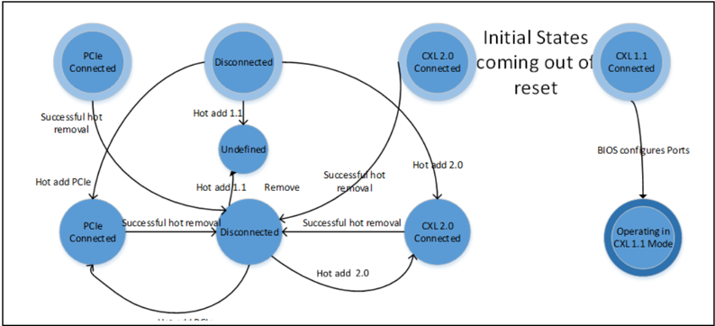

If the Port is in the disconnected state, the branch does not need further enumeration.

If the Port is connected to a CXL 2.0 device/Switch, the software follows section 9.12.2 for further enumeration until it reaches the leaf of the branch.

If the Port is connected to a CXL 1.1 device, the software follows section 9.12.4 to enumerate the device.

If the Port is connected to a PCIe device/Switch, the enumeration flow is governed by the PCI Express Base Specification.

#### 9.12.4 CXL 1.1 Device Connected to CXL 2.0 Capable Downstream Port

A CXL 1.1 device may be connected to a CXL 2.0 Root Port or a CXL 2.0 Downstream Switch Port. CXL 1.1 devices report themselves as RCiEP and hence cannot appear, to software, to be below a PCIe enumerable Downstream Port. System Firmware is responsible for detecting such a condition and reconfiguring the CXL Ports in the path so that the CXL 1.1 device appears in a CXL 1.1 hierarchy to software and not in a CXL 2.0 hierarchy.

##### Boot time Reconfiguration of CXL 2.0 Capable Ports to Enable a CXL 1.1 Device

1. At reset, the Downstream Port registers are visible in the PCI configuration space with a Type 1 header. During enumeration, System Firmware shall identify all the Downstream Ports that are connected to CXL 1.1 device by reading the DVSEC ID 7 register instead of the Link status registers. If the training was successful, the DVSEC Flex Bus Port Status register in the CXL DVSEC ID 7 structure shall indicate the CXL 2.0 protocol was not negotiated, but shall indicate that either the CXL.cache or the CXL.mem protocol was negotiated during link training. If the training was unsuccessful, the DVSEC Flex Bus Port Received Modified TS Data Phase1 Register in the CXL DVSEC ID 7 structure shall indicate the device is CXL capable, but shall indicate that it is not CXL 2.0 capable. A Downstream Switch Port shall not report link-up status in the PCIe Link Status register when it detects a CXL 1.1 device on the other end to prevent the legacy software from discovering it.
2. System Firmware identifies MMIO and bus resource needs for all CXL 1.1 devices below a CXL 2.0 Root Port. System Firmware adds MMIO resources needed for CXL 1.1 RCRB (8KB MMIO per link) and CXL 1.1 Component Registers (128KB MMIO per link).
3. System Firmware assigns MMIO and bus resources and programs Alternate MMIO Base/Limit and Alternate Bus Base/Limit registers in all the Root and Switch Ports in the path and the CXL 1.1 device BARs except the downstream port that is connected to the CXL 1.1 device. These Alternate decoders follow the standard PCIe rules and are described in [Section 8.1.5](#815-cxl-20-extensions-dvsec-for-ports).
4. System Firmware sets Alt BME and Alt Memory and ID Space Enable bits in all the Root and Switch Ports in the path of every CXL 1.1 device.
5. For each Downstream Port that is connected to CXL 1.1 device, System Firmware programs the CXL RCRB Base Address and then write 1 to the CXL RCRB Enable bit. The write to the CXL RCRB Enable bit transitions the Port addressing mode to CXL 1.1. The Downstream Port registers now appear in MMIO space at RCRB Base and not in configuration space. System Firmware issues a read to the address RCRB Base+4KB. The CXL 1.1 Upstream Port captures its RCRB base as described in section 9.11. System Firmware configures Upstream Port and Downstream Port registers as necessary. If this is a Switch Downstream Port, it shall ignore any hot reset requests received from the Upstream Port.
6. System Firmware configures the CXL 1.1 device using algorithm described in section 9.11.

The System Firmware shall report each CXL 1.1 device under a separate CXL 1.1 Host Bridge and not as a child of CXL 2.0 Host Bridge.

The Switch shall make sure there is always a DSP visible at Device 0, function 0.

### Figure 147. CXL 1.1 Device MMIO Address Decode - Example

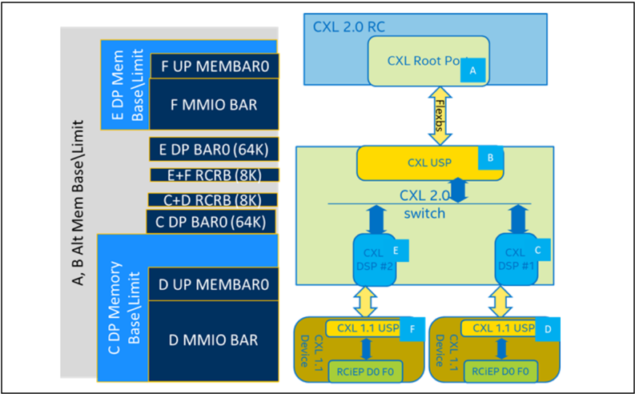

These concepts are illustrated by the configuration shown in Figure 147. In this configuration, CXL 1.1 devices F and D are attached to a CXL 2.0 switch. The Switch DSPs are labeled E and C. The Switch USP and the CXL Root Port are labeled B and A respectively. The left half of Figure 147 represents the address map and how normal decoders and Alt Mem decoders of A, B, C and E are configured.

If the host accesses an MMIO address belonging to D, the access flows through A, B and C:

1. Host issues a read
2. A Alt Decoder positively decodes the access and sends to B since A's Alt MSE=1
3. B Alt Decoder positively decodes the access since B's Alt MSE=1
4. C normal decoder positively decodes the access and forwards it to D since C MSE=1
5. D positively decodes and responds since D MSE=1

### Figure 148. CXL 1.1 Device Configuration Space Decode - Example

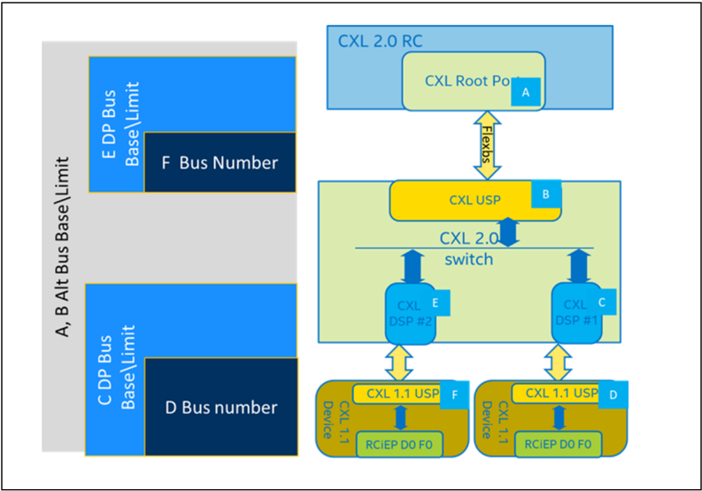

The left half of Figure 148 represents the configuration space map for the same configuration as in Figure 147 and how the bus decoders and the Alt Mem decoders of A, B, C and E are configured.

If the host accesses configuration space of F, the access flows through A, B and E:

1. Host issues configuration read to F's configuration space
2. A's Alt Decoder positively decodes, forwards to B as Type 1
3. B's Alt Decoder positively decodes, forwards down as Type 1
4. E's RCRB regular decoder positively decodes, forwards to F as Type 0 since the bus number matches E's RCRB Secondary Bus number
5. F positively decodes and responds

If D detects a protocol or link error, the error signal will flow to the system via the following path:

1. D issues ERR_ message with the Requestor ID of D
2. C shall not expose DPC capability
3. C forwards ERR_ message it to B
4. B forwards the message to A
5. A forwards the message to RCEC in the Root Complex since the requestor's bus number hits Alt Bus Decoder
6. RCEC generates MSI if enabled
7. Root Complex Event Collector Endpoint Association Extended Capability of RCEC describes it can handle errors from bus range = Alt Bus Decoder in RP

8. A shall not trigger DPC upon ERR_ message. Since the requestor's bus number hits Alt Bus Decoder, it is treated differently than a normal ERR_ message.

#### 9.12.5 CXL 2.0 Host/Switches with CXL 1.1 Devices - Example

Figure 149 represents the physical connectivity of a host with four Root Ports, one Switch and 5 devices. The corresponding software view is shown in Figure 150. Note that the numbers (e.g. the '1' in PCI Device 1) in this diagram do not represent the device number or the function number.

##### Figure 149. CXL 2.0 Physical Topology - Example

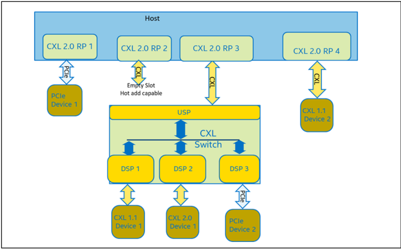

As shown in Figure 149, the Switch makes the CXL 1.1 device 1 below its DSP (DSP 1) appear as an RCiEP in CXL 1.1 Hierarchy. CXL 1.1 Device 1 is exposed as a separate Host Bridge, as would be expected of a CXL 1.1 device. This device hosts a CXL DVSEC ID 0 instance in Device number 0, Function number 0 configuration space. The CXL 1.1 Downstream Port and CXL 1.1 Upstream Port registers appear in MMIO space as expected.

When a CXL 2.0 capable Root Port detects a PCIe device (PCIe Device 1), it trains up in PCIe mode. The Root Port configuration space (Type 1) may include the CXL DVSEC ID 3 and the CXL DVSEC ID 7. If present, the DVSEC ID 7 instance will indicate that the link trained up in PCIe mode. Other CXL DVSEC ID structures may be present as well.

If a CXL 2.0 capable Root Port (RP2) is connected to an empty slot, its configuration space (type 1) hosts the CXL DVSEC ID 3 and the CXL DVSEC ID 7, but the DVSEC ID 7 shall indicate no CXL connectivity and the PCIe Link status register indicate that there is no PCIe connectivity. Other CXL DVSEC ID structures may be present as well. The user can hot-add a CXL 2.0 device, a CXL 2.0 Switch or a PCIe device in this slot.

A CXL 2.0 capable Root Port (RP3) connected to a CXL Switch spawns a CXL 2.0 Virtual Hierarchy. The Root Port as well as the Upstream Switch Port configuration space (type 1) each host an instance of CXL DVSEC ID 3 and an instance of CXL DVSEC ID 7, but the DVSEC ID 7instance will indicate that these Ports are operating in CXL 2.0 mode. Other CXL DVSEC ID structures may be present as well.

If a CXL Downstream Switch Port (DSP2) is connected to a CXL 2.0 device,DSP2's configuration space (type 1) hosts an instance of CXL DVSEC ID 3 and an instance of CXL DVSEC ID 7, but the DVSEC ID 7 instance will indicate that this Port is connected to a CXL 2.0 device. Other CXL DVSEC ID structures may be present as well.

In this example, CXL Downstream Switch Port (DSP 3) is connected to a PCIe device and its configuration space (type 1) does not host an instance of CXL DVSEC ID 7. Absence of a CXL DVSEC ID 7 indicates that this Port is not operating in the CXL mode. Note that it is legal for DSP 3 to host a DVSEC ID 7 instance as long as the DVSEC Flex Bus Port Status Register in the DVSEC ID 7 structure reports the link is not operating in CXL mode.

If a CXL 2.0 capable Root Port (RP 4) is connected to a CXL 1.1 device, the Root Port operates as a CXL 1.1 Downstream Port. CXL 1.1 device 2 appears as an RCiEP in CXL 1.1 hierarchy under its own Host Bridge. This device hosts an instance of the CXL DVSEC ID 0 in Device number 0, Function number 0 configuration space. The CXL 1.1 Downstream Port and the CXL 1.1 Upstream Port registers appear in MMIO space as expected.

If the Switch is hot-pluggable, System Firmware may instantiate an _DEP object in the ACPI namespace to indicate that device 1 is dependent on the CXL USP. A legacy PCIe bus driver interprets that to mean that the Switch hot removal has a dependency on CXL 1.1 device 1, even though the ACPI/PCIe hierarchy does not show such a dependency.

##### Figure 150. CXL 2.0 Virtual Hierarchy - Software View

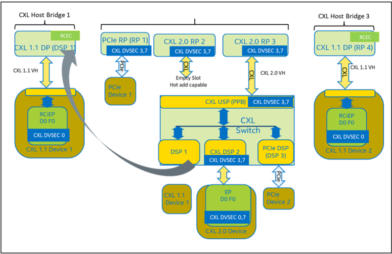

#### 9.12.6 Mapping of Link and Protocol Registers in CXL 2.0 VH

In a CXL 1.1 hierarchy, the link and protocol registers appear in MMIO space (RCRB and Component Registers in the Downstream Port and the Upstream Port). See Figure 151.

##### Figure 151. CXL Link/Protocol Registers - CXL 1.1 Host and CXL 1.1 Device

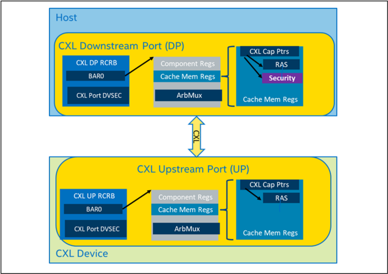

Since a CXL 2.0 Virtual Hierarchy appears as a true PCIe hierarchy, the Component Register block are mapped using a standard BAR of CXL 2.0 components. The registers that were mapped via a CXL 1.1 RCRB are mapped into PCI Configuration Space of CXL 2.0 components.

Each CXL 2.0 Host Bridge includes the CHBCR that includes the registers that are common to all Root Ports under that Host Bridge. In an ACPI compliant system, the base address of this register block is discovered via ACPI via the CEDT table or the _CBR method. The CHBCR include the HDM Decoder registers.

Each CXL 2.0 Root Port carries a single BAR that points to the associated Component Register block. The offset within that BAR is discovered via the CXL DVSEC ID 8. See [Section 8.1.9](#819-register-locator-dvsec). The layout of the Component Register Block is shows in [Section 8.2.4](#824-component-register-layout-and-definition).

Each CXL 2.0 device can map its Component Register Block to any of its 6 BARs and a 64K aligned offset within that BAR. The BAR number and the offset is discovered via CXL DVSEC ID 8. A Type 3 device Component Register Block includes HDM Decoder registers.

Each CXL 2.0 Upstream Switch Port carries a single BAR that points to the associated Component Register block. The offset within that BAR is discovered via CXL DVSEC ID 8. Upstream Switch Port Component register block contains the registers that are not associated with a particular Downstream Ports such as HDM Decoder registers.

Each CXL 2.0 Downstream Switch Port carries a single BAR that points to the associated CHBCR, the format of which closely mirrors that of a Root Port. The offset within that BAR is discovered via CXL DVSEC ID 8.

##### Figure 152. CXL Link/Protocol Registers - CXL 2.0 Root Ports and CXL 2.0 Devices

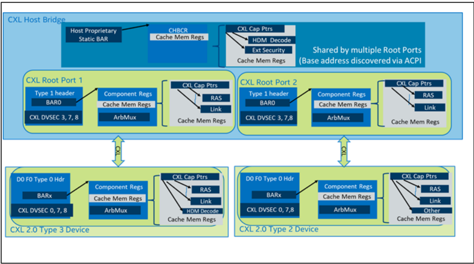

##### Figure 153. CXL Link/Protocol Registers in a CXL Switch

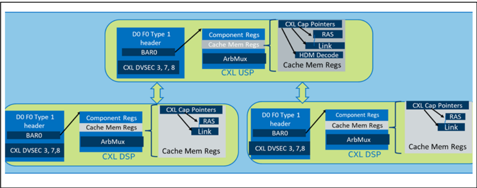

### 9.13 Software View of HDM

HDM is exposed to OS/VMM as normal memory. However, HDM likely has different performance/latency attributes compared to host attached memory. Therefore, a system with CXL.mem devices can be considered as a heterogeneous memory system.

ACPI HMAT table was introduced for such systems and can report memory latency and bandwidth characteristics associated with different memory ranges. ACPI Specification version 6.2 carries the definition of revision 1 of HMAT. As of August 2018, ACPI WG has decided to deprecate revision 1 of HMAT table because it had a number of

shortcomings. As a result, the subsequent discussion refers to revision 2 of HMAT table. In addition, ACPI has introduced a new type of Affinity structure called Generic Affinity (GI) Structure. GI structure is useful for describing execution engines such as accelerators that are not processors. Existing software ignores GI entries in SRAT, but newer software can take advantage of it. As a result, CXL.mem accelerators will result in two entries in SRAT - One GI entry to represent the accelerator cores and one memory entry to represent the attached HDM. GI entry is especially useful when describing CXL.cache accelerator. Previous to introduction of GI, CXL.cache accelerator could not be described as a separate entity in SRAT/HMAT and had to be combined with the attached CPU. With this specification change, CXL.cache accelerator can be described as a separate proximity domain. _PXM method can be used to associate the proximity domain associated with the PCI device. Since Legacy OSs do not understand GI, System Firmware is required to return the processor domain that is most closely associated with the IO device when running such an OS. ASL code can use bit 17 of Platform-Wide _OSC Capabilities DWORD 2 to detect whether the OS supports GI or not.

System Firmware must construct and report SRAT and HMAT table to OS in systems with CXL.mem devices and CXL.cache devices. Since System Firmware is not aware of HDM properties, that information must come from the CXL device in the form of Coherent Device Attribute Table (CDAT). A device may export CDAT via Table Access DOE or via a UEFI driver.

System Firmware combines the information it has about the host and CXL connectivity with the HMAT Fragment Tables during construction of SRAT and HMAT tables.

#### 9.13.1 Memory Interleaving

Memory interleaving allows consecutive memory addresses to be mapped to different CXL devices at a uniform interval. CXL 1.1 devices support a limited form of interleaving as described in [Section 9.11.6.1](#91161-single-cpu-topology), whereby memory is interleaved across the two links between a CPU and a dual-headed device.

CXL 2.0 defines mechanism for interleaving across different devices. The set of devices that are interleaved together is known as the Interleave Set.

An Interleave Set is identified by

- Base HPA - Multiple of 256 MB
- Size - Also a Multiple of 256 MB
- Interleave Way
- Interleave Granularity
- Targets (applicable to Root Port and Upstream Switch Ports only)

These terms are described below.

Interleave Way : A CXL 2.0 Interleave Set may contain either 1, 2, 4, or 8 CXL devices. 1 way Interleave is equivalent to no interleaving. The number of devices in an Interleave set is known as Interleave Ways (IW).

Interleave Granularity : Each device in an Interleave set decodes a specific number of consecutive bytes, called Chunk, in HPA Space. The size of Chunk is known as Interleave Granularity (IG). The starting address of each Chunk is a multiple of IG.

- CXL 2.0 Root Ports and Switches must support the following IG values
- 256 Bytes (Interleaving on HPA[8])
- 512 Bytes (Interleaving on HPA[9])
- 1024 Bytes (Interleaving on HPA[10])

- 2048 Bytes (Interleaving on HPA[11])
- 4096 Bytes (Interleaving on HPA[12])
- 8192 Bytes (Interleaving on HPA[13])
- 16384 Bytes (Interleaving on HPA[14])
- CXL 2.0 Type 3 devices must support at least one of the two IG groups as reported via HDM Decoder Capability Register ([Section 8.2.5.12.1](#825121-cxl-hdm-decoder-capability-register-offset-00h)).
- Group 1: Interleaving on HPA[8], HPA[9] and HPA[10]
- Group 2: Interleaving on HPA[11], HPA[12], HPA[13] and HPA[14]

Target : The HDM Decoders in CXL Root Complex are responsible for looking up the incoming HPA address in a CXL.mem transaction and forwarding it to the appropriate Root Port Target. The HDM Decoders in CXL Upstream Switch Port are responsible for looking up the incoming HPA address in a CXL.mem transaction and forwarding it to the appropriate Downstream Switch Port Target.

An HDM Decoder in a Device is responsible for converting HPA into DPA by stripping off specific address bits. These flows are described in [Section 8.2.5.12.21](#8251221-decoder-protection).

An Interleave set is established by programing an HDM Decoder and committing it ([Section 8.2.5.12.20](#8251220-committing-decoder-programming)). A component may implement either 2, 4, 6, 8 or 10 HDM Decoders. The number of decoders implemented by a component are enumerated via HDM Decoder Capability Register ([Section 8.2.5.12.1](#825121-cxl-hdm-decoder-capability-register-offset-00h)). HDM Decoders within a component must be configured in a congruent manner and the Decoder Commit flow performs certain self-consistency checks to assist with correct programming.

Software is responsible for ensuring that HDM Decoders inside the components along the path of a transaction must be configured in a consistent manner.

##### Figure 154. One Level Interleaving at Switch - Example

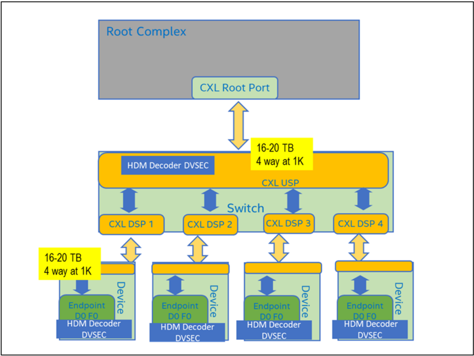

Figure 154 illustrates a simple memory fan-out topology with 4 memory devices behind a CXL Switch. A single HDM Decoder in each Device as well as the Upstream Switch Port is configured to decode the HPA range 16 to 20 TB, at 1K granularity. The leftmost Device receives 1KB ranges starting with HPAs 16 TB, 16 TB+4KB, 16 TB+8KB, …, 20 TB-4KB (every 4th chunk). The Root complex does not participate in the interleaving process.

Multiple level interleaving is supported as long as the all the level use different, but consecutive HPA bits to select the target and no Interleave set has more than 8 devices. This is illustrated via Figure 155 and Figure 156.

##### Figure 155. Two Level Interleaving

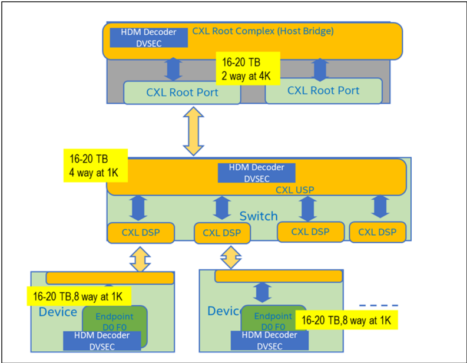

Figure 155 illustrates a two level Interleave scheme where the Root Complex as well as the Switch participates in the interleaving process. This topology has 4 memory devices behind each CXL Switch. One HDM Decoder in all 8 devices, both Upstream Switch Ports and the Root Complex is configured to decode the HPA range 16 to 20 TB. The Root Complex partitions the address range in two halves at 4K granularity (based on HPA[12]), each half directed to a Root Port. Each Upstream Switch Port splits each half further in 4 subranges at 1K granularity (based on HPA[11:10]). To each device, it appears as though the HPA range 16-20 TB is 8 way interleaved at 1K granularity based on HPA[12:10]. The leftmost Device receives 1KB ranges starting with HPAs 16 TB, 16 TB+8KB, 16 TB+16KB, …, 20 TB-8KB.

Figure 156 illustrates a three level Interleave scheme where the cross-Host Bridge logic, the Root Complex as well as the Switch participates in the interleaving process. The cross-host Bridge logic is configured to interleave the address range in two halves using host proprietary registers at 4K granularity. One HDM Decoder in 8 devices, 4 Upstream Switch Ports and 2 Root Complexes is configured to decode the HPA range 16 to 20 TB. The Root Complex further sub-divides the address range in two at 2K granularity (using HPA[11]). The Upstream Switch Port in every Switch splits HPA space further in 2 subranges at 1K granularity (using HPA[10]). To each device, it appears as though the HPA range 16-20 TB is 8 way interleaved at 1K granularity based on A[12:10]. Similar to Figure 155, The leftmost Device receives 1KB ranges starting with HPAs 16 TB, 16 TB+8KB, 16 TB+16KB, …, 20 TB-8KB.

##### Figure 156. Three Level Interleaving Example

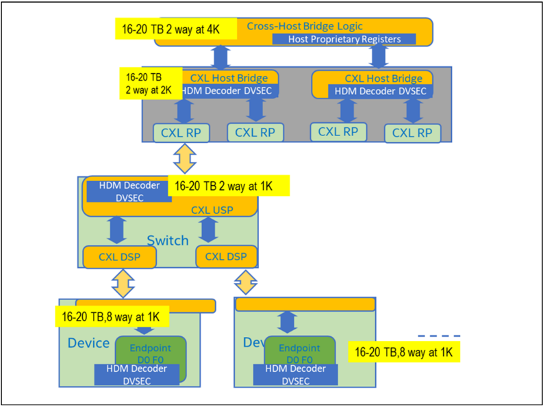

#### 9.13.2 The CXL Memory Device Label Storage Area

CXL memory devices which provide volatile memory, such as DRAM, may be exposed with different interleave geometries each time the system is booted. This can happen due to the addition or removal of other devices or changes to the platform's default interleave policies. For volatile memory, these changes to the interleave usually do not impact host software since there's generally no expectation that volatile memory contents are preserved across reboots. However, with persistent memory, the exact preservation of the interleave geometry is critical so that the persistent memory contents are presented to host software the same way each time the system is booted.

Similar to the interleaving configuration, persistent memory devices may be partitioned into namespaces , which define volumes of persistent memory. These namespaces must also be reassembled the same way each boot to prevent loss of data.

[Section 8.2.9](#829-cxl-device-command-interface) defines mailbox operations for reading and writing the Label Storage Area (LSA) on CXL memory devices: Get LSA and Set LSA. In addition, the Get LSA Size mailbox command exposes the size of the LSA for a given CXL memory device. The LSA allows both interleave and namespace configuration details to be stored persistently on all the devices involved, so that the configuration data 'follows the device' if the device is moved to a different socket or machine. The use of an LSA is analogous to how disk RAID arrays write configuration information to a reserved area of each disk in the array, so that the geometry is preserved across configuration changes.

A CXL memory device may contribute to multiple persistent memory interleave sets, limited by interleave resources such as HDM decoders or other platform resources. Each persistent memory interleave set may be partitioned into multiple namespaces, limited by resources such as label storage space and supported platform configurations.

The format of the LSA and the rules for updating and interpreting the LSA are specified in this section. CXL memory devices do not interpret the LSA directly, they just provide the storage area and mailbox commands for accessing it. Software configuring interleave sets and namespaces, such as pre-boot firmware or host operating systems shall follow the LSA rules specified here in order to correctly inter-operate with CXLcompliant memory devices.

##### 9.13.2.1 Overall LSA Layout

The LSA consists of two Label Index Blocks followed by an array of label slots. As shown in [Figure 157](#figure-157-overall-lsa-layout), the Label Index Blocks are always a multiple of 256 bytes in size, and each label slot is exactly 256 bytes in size.

###### Figure 157. Overall LSA Layout

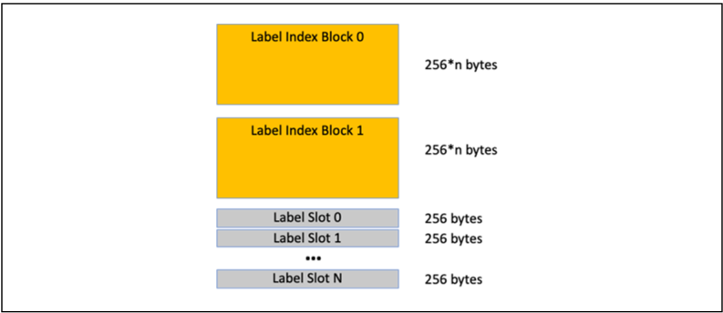

The size of the LSA is implementation-dependent and software must discover the size using the Identify Memory Device mailbox command. The minimum allowed size is two index blocks, 256-bytes each in length, two label slots (providing space for a minimal one region label and one namespace label), and one free slot to allow for updates. This makes the total minimum LSA size 1280 bytes. It is recommended (but not required) that a device provides for flexibility of configuration by implementing an LSA large enough for two region labels per device and one namespace label per 8 Gigs of persistent memory capacity available on the device.

All updates to the LSA shall follow the update rules laid out in this section, which guarantee the LSA remains consistent in the face of interruptions such as power loss or software crashes. There are no atomicity requirements on the Set LSA mailbox operation - it simply updates the range of bytes provided by the caller. Atomicity and consistency of the LSA is achieved using checksums and the principle that only free slots (currently unused) are written to - in-use data structures are never written, avoiding the situation where an interrupted update to an in-use data structure makes it inconsistent. Instead, all updates are made by writing to a free slot and then following the rules laid out in this section to atomically swap the in-use data structure with the newly written copy.

The LSA layout uses Fletcher64 checksums. [Figure 158](#figure-158-the-fletcher64-checksum-algorithm-in-c) shows a Fletcher64 checksum implementation that produces the correct result for the data structures in this specification when run on a 64-bit system. When performing a checksum on a structure, any multi-byte integer fields shall be in little-endian byte order. If the structure contains its own checksum, as is commonly the case, that field shall contain zero when this checksum routine is called.

###### Figure 158. The Fletcher64 Checksum Algorithm in C

```
static const int s_own_checksum_ratio, s_is_commonly_zero_when_this_checksum_routine is called.
    {
    The Fletcher64 Checksum Algorithm in C
    /*
     * checksum -- compute a Fletcher64 checksum
     */
    uint64_t
    checksum(void *addr, size_t len)
    {
            uint32_t *p32 = addr;
            uint32_t *p32end = addr + len;
            uint32_t lo32 = 0;
            uint32_t hi32 = 0;

            while (p32 < p32end) {
                lo32 += *p32++;
                hi32 += lo32;
            }

            return (uint64_t)hi32 << 32 | lo32;
    }
    The algorithm for updating the LSA is single-threaded. So
    protecting a device's LSA so that only a single thread is
    typically done with a common mutex lock.
```

The algorithm for updating the LSA is single-threaded. Software is responsible for protecting a device's LSA so that only a single thread is updating it at any time. This is typically done with a common mutex lock.

##### 9.13.2.2 Label Index Blocks

[Table 210](#table-210-label-index-block-layout) shows the layout of a Label Index Block.

###### Table 210. Label Index Block Layout

| Byte Offset   | Length   | Description                                                                                                                                                             |
|---------------|----------|-------------------------------------------------------------------------------------------------------------------------------------------------------------------------|
| 0             | 10h      | Sig: Signature indicating a Label Index Block. Shall be set to 'NAMESPACE_INDEX\0'.                                                                                     |
| 10h           | 3        | Flags: No flags defined yet, shall be zero.                                                                                                                             |
| 13h           | 1        | LabelSize: Shall be 1. This indicates the size of labels in this LSA in multiples of 256 bytes (1 for 256, 2 for 512, etc.).                                            |
| 14h           | 4        | Seq: Sequence number. Only the two least-significant bits of this field are used and shown in Figure 159 below. All other bits shall be zero.                           |
| 018h          | 8        | MyOff: Offset of this index block in the LSA. Label Index Block 0 shall have 0 in this field, Label Index Block 1 shall have the size of the index block as its offset. |
| 20h           | 8        | MySize: Size of an index block in bytes. Shall be a multiple of 256.                                                                                                    |
| 28h           | 8        | OtherOff: Offset of the other index block paired with this one.                                                                                                         |
| 30h           | 8        | LabelOff: Offset of the first slot where labels are stored.                                                                                                             |
| 38h           | 4        | NSlot: Total number of label slots.                                                                                                                                     |
| 3Ch           | 2        | Major: The major version number of this layout. Shall be 2.                                                                               |
| 3Eh           | 2        | Minor: The minor version number of this layout. Shall be 1.                                                                               |
| 40h           | 8        | Checksum: Fletcher 64 checksum of all fields in this Label Index Block. This field is assumed to be zero when the checksum is calculated. |
| 48h           | Varies   | Free: NSlot bits, padded with zeros to align index block to 256 bytes.                                                                    |

When reading Label Index Blocks, software shall only consider index blocks valid when their Sig, MyOff, OtherOff, and Checksum fields are correct. In addition, any blocks with Seq set to zero are discarded as invalid. Finally, if more than 1 Label Index Block is found to be valid the one with the older sequence number (immediately counterclockwise to the other, according to Figure 159 below) is discarded. If all checks pass and the sequence numbers match, the index block at the higher offset shall be considered the valid block. If no valid Label Index Blocks are found, the entire LSA is considered uninitialized.

###### Figure 159. Sequence Numbers in Label Index Blocks


When updating the Label Index Block, the current valid block, according to the rules above, is never written to directly. Instead, the alternate block is updated with the appropriate fields and a sequence number that is higher (immediately to the right as shown in Figure 159 above). It is the appearance of a new block that passes all the checks and has a higher sequence number that makes this update atomic in the face of interruption.

Using this method of atomic update, software can allocate and deallocate label slots, even multiple slots, in a single, atomic operation. This is done by setting the Free bits to indicate which slots are free and which are in-use, then updating the Label Index Block atomically as described above. To ensure that it is always possible to update a label atomically, there must always be at least one free label slot. That way, any used label slots can be updated by writing the new contents to the free slot and using the Label Index Block update algorithm to mark the new version and in-use and the old version and free in one atomic operation. For this reason, software must report a 'label storage area full' error when a caller tries to use the last label slot.

The Free field contains an array of Nslot bits, indicating which label slots are currently free. The Label Index Block is then padded with zero bits until the total size is a multiple of 256 bytes. This means that up to 1472 label slots are supported by Label Index Blocks that are 256 bytes in length. For 1473 to 3520 label slots, the Label Index Block size must be 512 bytes in length, and so on.

##### 9.13.2.3 Common Label Properties

There are three types of labels that may occupy the label slots in the LSA: Region Labels, Namespace Labels, and Vendor Specific Labels. The first two are identified by type fields containing UUIDs as specified in the following sections. Vendor Specific Labels contain a type UUID determined by the vendor per RFC 4122. Software shall ignore any labels with unknown types. In this way, the Type field in the labels provides a major version number , where software can assume a UUID it expects to find indicates a label it understands, since only backward compatible changes are allowed to the label layout from the point where that UUID first appears in a published CXL specification.

Region Labels and Namespace Labels contain a 4-byte Flags field, used to indicate the existence of new features. Since those features must be backward compatible, software may ignore unexpected flags encountered in this field (no error generated). Software should always write zeros for Flags bits that were not defined at the time of implementation. In this way, the Flags field provide a minor version number for the label.

It is sometimes necessary to update labels atomically across multiple CXL devices. For example, when a Region or Namespace is being defined, the labels are written to every device that contributes to it. Region Labels and Namespace Labels define a flag, UPDATING, that indicates a multi-device update is in-progress. Software shall follow this flow when creating or updates a set of labels across devices:

- Step 1: Write each label across all devices with the UPDATING flag set
- Step 2: Update each label, using the update algorithm described in the previous section, clearing the UPDATING flag

Any time software encounters a set of labels with any UPDATING flags, it shall execute these rules:

- If there are missing labels (some components with the expected UUID are missing), then the entire set of labels is rolled-back due to the update operation being interrupted before all labels are written. The roll-back means marking each label in the set as free, following the update algorithm described in the previous section.
- If there are no missing labels, then the entire set of labels is rolled-forward, completing the interrupted update operation by removing the UPDATING flag from all labels in the set, following the update algorithm described in the previous section.

When sets of Region Labels or Namespace Labels are found to have missing components, software shall consider them invalid and not attempt to configure the regions or surface the namespaces with these errors. Exactly how these errors are reported and how users recover from them is implementation-specific, but it is recommended that software first report the missing components, providing the opportunity to correct the misconfiguration, before deleting the erroneous regions or namespaces.

##### 9.13.2.4 Region Labels

Region labels describe the geometry of a persistent memory interleave set (the term 'region' is synonymous with 'interleave set' in this section). Once software has configured a functional interleave set for a set of CXL memory devices, region labels are added to the LSA for each device that contributes capacity to it. [Table 211](#table-211-region-label-layout) shows the layout of a Region Label.

###### Table 211. Region Label Layout

| Byte Offset   | Length   | Description                                                                                                                                                                                                                                                                                                                                                                                                                                                                                                                             |
|---------------|----------|-----------------------------------------------------------------------------------------------------------------------------------------------------------------------------------------------------------------------------------------------------------------------------------------------------------------------------------------------------------------------------------------------------------------------------------------------------------------------------------------------------------------------------------------|
| 0             | 10h      | Type: Shall contain this UUID: 529d7c61-da07-47c4-a93f-ecdf2c06f444. In the future, if a new, incompatible Region Label is defined, it shall be assigned a new UUID in the CXL specification defining it.                                                                                                                                                                                                                                                                                                                               |
| 10h           | 10h      | UUID: UUID of this region per RFC 4122. This field is used to match up labels on separate devices that together describe a region.                                                                                                                                                                                                                                                                                                                                                                                                      |
| 20h           | 4        | Flags: Boolean attributes of the region: • 00000008h UPDATING The UPDATING flag is used to coordinate Region Label updates across multiple CXL devices, as described in [Section 9.13.2.3](#91323-common-label-properties). All bits below 08h are reserved and shall be written as zero and ignored when read. All bits above 08h are currently unused and shall be written as zero. The intention is to indicate the existence of backward compatible features added in the future, so any unexpected 1 values in this area shall be ignored (not treated as an error). |
| 24h           | 2        | NLabel: Total number of devices in this interleave set (interleave ways).                                                                                                                                                                                                                                                                                                                                                                                                                                                               |
| 26h           | 2        | Position: Position of this device in the interleave set, starting with the first device in position zero and counting up from there.                                                                                                                                                                                                                                                                                                                                                                                                    |
| 28h           | 8        | DPA: The DPA where the region begins on this device.                                                                                                                                                                                                                                                                                                                                                                                                                                                                                    |
| 30h           | 8        | RawSize: The capacity this device contributes to the interleave set (bytes).                                                                                                                                                                                                                                                                                                                                                                                                                                                            |
| 38h           | 8        | HPA: If non-zero, this region needs to be mapped at this HPA. This field is for platforms that need to restore an interleave set to the same location in the system memory map each time. A platform that does not support this shall report an error when a non-zero HPA field is encountered.                                                                                                                                                                                                                                         |
| 40h           | 4        | Slot: Slot index of this label in the LSA.                                                                                                                                                                                                                                                                                                                                                                                                                                                                                              |
| 44h           | 4        | InterleaveGranularity: The number of consecutive bytes that are assigned to this device. • 0 - 256 Bytes • 1 - 512 Bytes • 2 - 1024 Bytes (1 KB) • 3 - 2048 Bytes (2 KB) • 4 - 4094 Bytes (4 KB) • 5 - 8192 Bytes (8 KB) • 6 - 16384 Bytes (16 KB)                                                                                                                                                                                                                                                                                      |
| 48h           | 4        | Alignment: The desired region alignment in multiples of 256 MB. • 0 - No desired alignment • 1 - 256 MB desired alignment • 2 - 512 MB desired alignment • Etc.                                                                                                                                                                                                                                                                                                                                                                         |
| 4Ch           | ACh      | Reserved: Shall be zero.                                                                                                                                                                                                                                                                                                                                                                                                                                                                                                                |
| F8h           | 8        | Checksum: Fletcher64 checksum of all fields in this Region Label. This field is assumed to be zero when the checksum is calculated.                                                                                                                                                                                                                                                                                                                                                                                                     |

##### 9.13.2.5 Namespace Labels

Namespace labels describe partitions of persistent memory that are exposed as volumes to software, analogous to NVMe namespaces or SCSI LUNs. Exactly how an operating system uses these volumes is out of scope for this specification namespaces may be exposed to applications directly, exposed via file systems, or used internally by the operating system. [Table 212](#table-212-namespace-label-layout) shows the layout of a Namespace Label.

###### Table 212. Namespace Label Layout

| Byte Offset   | Length   | Description                                                                                                                                                                                                                                                                                                                                                                                                                                                                                                                                |
|---------------|----------|--------------------------------------------------------------------------------------------------------------------------------------------------------------------------------------------------------------------------------------------------------------------------------------------------------------------------------------------------------------------------------------------------------------------------------------------------------------------------------------------------------------------------------------------|
| 0             | 10h      | Type: Shall contain this UUID: 68bb2c0a-5a77-4937-9f85-3caf41a0f93c. In the future, if a new, incompatible Namespace Label is defined, it shall be assigned a new UUID in the CXL specification defining it.                                                                                                                                                                                                                                                                                                                               |
| 10h           | 10h      | UUID: UUID of this namespace per RFC 4122. All labels for this namespace shall contain matching UUIDs.                                                                                                                                                                                                                                                                                                                                                                                                                                     |
| 20h           | 40h      | Name: 'Friendly name' for the namespace, null-terminated UTF-8 characters. This field may be set to all zeros if no name is desired.                                                                                                                                                                                                                                                                                                                                                                                                       |
| 60h           | 4        | Flags: Boolean attributes of the region: • 00000008h UPDATING The UPDATING flag is used to coordinate Namespace Label updates across multiple CXL devices, as described in [Section 9.13.2.3](#91323-common-label-properties). All bits below 08h are reserved and shall be written as zero and ignored when read. All bits above 08h are currently unused and shall be written as zero. The intention is to indicate the existence of backward compatible features added in the future, so any unexpected 1 values in this area shall be ignored (not treated as an error). |
| 64h           | 2        | NRange: Number of discontiguous ranges this device contributes to namespace, used when the capacity contributed by this device is not continuous. Each contiguous range will be described by a label and NRange described how many labels were required.                                                                                                                                                                                                                                                                                   |
| 66h           | 2        | Position: Position of this device in the range set, starting with zero for the first label and counting up from there.                                                                                                                                                                                                                                                                                                                                                                                                                     |
| 68h           | 8        | DPA: The DPA where the region begins on this device.                                                                                                                                                                                                                                                                                                                                                                                                                                                                                       |
| 70h           | 8        | RawSize: The capacity this range contributes to the namespace (bytes).                                                                                                                                                                                                                                                                                                                                                                                                                                                                     |
| 78h           | 4        | Slot: Slot index of this label in the LSA.                                                                                                                                                                                                                                                                                                                                                                                                                                                                                                 |
| 7Ch           | 4        | Alignment: The desired region alignment in multiples of 256 MB. • 0 - No desired alignment • 1 - 256 MB desired alignment • 2 - 512 MB desired alignment • Etc.                                                                                                                                                                                                                                                                                                                                                                            |
| 80h           | 10h      | RegionUUID: UUID of the region containing this namespace. If a valid region does not exist with this UUID, then this namespace is also considered unusable.                                                                                                                                                                                                                                                                                                                                                                                |
| 90h           | 10h      | AddressAbstractionUUID: If non-zero, the address abstraction used by this namespace. Software defines the UUIDs used in this field and their meaning in software-specific and out of scope for this specification.                                                                                                                                                                                                                                                                                                                         |
| A0h           | 2        | LBASize: If non-zero, logical block size of this namespace.                                                                                                                                                                                                                                                                                                                                                                                                                                                                                |
| A2h           | 56h      | Reserved: Shall be zero.                                                                                                                                                                                                                                                                                                                                                                                                                                                                                                                   |
| F8h           | 8        | Checksum: Fletcher64 checksum of all fields in this Namespace Label. This field is assumed to be zero when the checksum is calculated.                                                                                                                                                                                                                                                                                                                                                                                                     |

##### 9.13.2.6 Vendor Specific Labels

[Table 213](#table-213-vendor-specific-label-layout) shows the layout of a Vendor Specific Label. Other than the Type field and the Checksum field, the vendor is free to store anything in the remaining 232 (E8h) bytes of the label.

###### Table 213. Vendor Specific Label Layout

| Byte Offset   | Length   | Description                                                                                                                                  |
|---------------|----------|----------------------------------------------------------------------------------------------------------------------------------------------|
| 0             | 10h      | Type: (vendor specific UUID)                                                                                                                 |
| 10h           | E8h      | Vendor specific content                                                                                                                      |
| f8h           | 8        | Checksum: Fletcher64 checksum of all fields in this Vendor Specific Label. This field is assumed to be zero when the checksum is calculated. |

### 9.14 CXL OS Firmware Interface Extensions

#### 9.14.1 CXL Early Discovery Table (CEDT)

CXL Early Discovery Table enables Operating Systems to locate CXL Host Bridges and location of Host Bridge registers early during the boot i.e. prior to parsing of ACPI namespace. The information in this table may be used by early boot code to perform pre-initialization of CXL Hosts such as configuration of CXL.cache and CXL.mem.

##### 9.14.1.1 CEDT Header

The pointer to CEDT is found in RSDT or XSDT as described in ACPI Specification. An ACPI specification compliant CXL system shall support CEDT and shall include a CHBS entry for every CXL host bridge that is present at boot.

CXL Early Discovery Table begins with the following header.

###### Table 214. CEDT Header

| Field             | Byte Length   |   Offset | Description                                          |
|-------------------|---------------|----------|------------------------------------------------------|
| Header            |               |          |                                                      |
| Signature         | 4             |        0 | 'CEDT'. Signature for the CXL Early Discovery Table. |
| Length            | 4             |        4 | Length, in bytes, of the entire CEDT.                |
| Revision          | 2             |        8 | 1                                                    |
| Checksum          | 1             |        9 | Entire table must sum to zero.                       |
| OEM ID            | 6             |       10 | OEM ID                                               |
| OEM Table ID      | 8             |       16 | Manufacturer Model ID                                |
| OEM Revision      | 4             |       24 | OEM Revision                                         |
| Creator ID        | 4             |       28 | Vendor ID of utility that created the table.         |
| Creator Revision  | 4             |       32 | Revision of utility that created the table           |
| CEDT Structure[n] | Varies        |       36 | A list of CEDT structures for this implementation.   |

###### Table 215. CEDT Structure Types

| Value   | Description               |
|---------|---------------------------|
| 0       | CXL Host Bridge Structure |
| 1-255   | 'Reserved                 |

##### 9.14.1.2 CXL Host Bridge Structure (CHBS)

CHBS structure describes a CXL Host Bridge.

In an ACPI compliant system, there shall be one instance of CXL Host Bridge Device object in ACPI namespace (HID='ACPI0016') for every CHBS entry. The _UID object under a CXL Host Bridge object, when evaluated, shall match the UID field in the associated CHBS entry.

###### Table 216. CHBS Structure

| Field         |   Byte Length |   Offset | Description                                                                                                                                                                                                |
|---------------|---------------|----------|------------------------------------------------------------------------------------------------------------------------------------------------------------------------------------------------------------|
| Type          |             1 |        0 | =0 to indicate this is a CHBS entry                                                                                                                                                                        |
| Reserved      |             1 |        1 | 'Reserved                                                                                                                                                                                                  |
| Record Length |             2 |        2 | Length of this record (32)                                                                                                                                                                                 |
| UID           |             4 |        4 | CXL Host Bridge Unique ID. Used to associate a CHBS instance with CXL Host Bridge instance. The value of this field shall match the output of _UID under the associated CXL Host Bridge in ACPI namespace. |
| CXL Version   |             4 |        8 | 00h: CXL 1.1 Specification compliant Host Bridge 01h: CXL 2.0 Specification compliant Host Bridge                                                                                                          |
| Reserved      |             4 |       12 | Reserved                                                                                                                                                                                                   |
| Base          |             8 |       16 | If Version = 0, this represents the base address of CXL 1.1 Downstream Port RCRB. If version =1, this represents the base address of the CXL 2.0 CHBCR. See [Table 137](#table-137-cxl-memory-mapped-registers-regions).                                     |
| Length        |             8 |       24 | If Version = 0, this field must be set to 8 KB (2000h). If Version = 1, this field must be set to 64 KB (10000h).                                                                                          |

#### 9.14.2 CXL _OSC

According to ACPI specification, _OSC (Operating System Capabilities) is a control method that is used by OS to communicate to the System Firmware the capabilities supported by the OS and to negotiate ownership of specific capabilities.

The _OSC interface defined in this section applies only to 'Host Bridge' ACPI devices that originate CXL hierarchies. As stated in [Section 9.12](#912-cxl-20-enumeration), these ACPI devices must have a _HID of (or _CID including) EISAID('ACPI0016'). For CXL 2.0 and later Hierarchies, CXL _OSC is required. CXL _OSC is optional for CXL 1.1 Hierarchies. A CXL Host Bridge also originates a PCIe hierarchy and will have a _CID of EISAID('PNP0A08'). As such, a CXL Host Bridge device may expose both CXL _OSC and PCIe _OSC.

The _OSC interface for a CXL hierarchy is identified by the Universal Unique Identifier (UUID) 68f2d50b-c469-4d8a-bd3d-941a103fd3fc.

A revision ID of 1 encompasses fields defined in this section of this revision of this specification, comprises of 5 DWORDs, including the first DWORD described by the generic ACPI definition of _OSC.

The first DWORD in the _OSC Capabilities Buffer contains bits that are generic to _OSC. These include status and error information.

The second DWORD in the _OSC capabilities buffer is the PCIe Support Field as defined by PCI Firmware Specification.

The third DWORD in the _OSC Capabilities Buffer is the PCIe Control Field as defined by PCI Firmware Specification.

The fourth DWORD in the _OSC capabilities buffer is the CXL Support Field. Bits defined in the Support Field provide information regarding CXL features supported by the OS. Just like the PCIe Support field, contents in the Support Field are passed one-way; the OS will disregard any changes to this field when returned.

The fifth DWORD in the _OSC Capabilities Buffer is the CXL Control Field. Just like the PCIe Control Field, bits defined in the CXL Control Field are used to submit request by the OS for control/handling of the associated feature, typically (but not excluded to) those features that utilize native interrupts or events handled by an OS-level driver. If any bits in the Control Field are returned cleared (masked to zero) by the _OSC control method, the respective feature is designated unsupported by the platform and must not be enabled by the OS. Some of these features may be controlled by System Firmware prior to OS boot or during runtime for a legacy OS, while others may be disabled/inoperative until native OS support is available.

If the CXL _OSC control method is absent from the scope of a Host Bridge device, then the OS must not enable or attempt to use any features defined in this section for the hierarchy originated by the Host Bridge. Doing so could conflict with System Firmware operations, or produce undesired results. It is recommended that a machine with multiple Host Bridge devices should report the same capabilities for all Host Bridges, and also negotiate control of the features described in the Control Field in the same way for all Host Bridges.

##### Table 217. Interpretation of CXL _OSC Support Field

|   Support Field bit offset | Interpretation                                                                                                                                                                                                                              |
|----------------------------|---------------------------------------------------------------------------------------------------------------------------------------------------------------------------------------------------------------------------------------------|
|                          0 | CXL 1.1 Port Register Access supported The OS sets this bit to 1 if it supports access to CXL 1.1 Port registers as defined in [Section 9.11](#911-cxl-11-hierarchy). Otherwise, the OS sets this bit to 0.                                                          |
|                          1 | CXL 2.0 Port/Device Register Access supported The OS sets this bit to 1 if it supports access to CXL 2.0 Port/Device registers as defined in [Section 9.12](#912-cxl-20-enumeration). If this bit is 1, bit 0 must be 1 as well. Otherwise, the OS sets this bit to 0. |
| 2                          | CXL Protocol Error Reporting Supported The OS sets this bit to 1 if it supports handling of CXL Protocol Errors. Otherwise, the OS sets this bit to 0. If OS sets this bit, it must set either bit 0 or bit 1 above. NOTE: Firmware may retain control of AER if the OS does not support CXL Protocol Error reporting since owner of AER owns CXL Protocol error management.                                                                                                       |
| 3                          | CXL Native Hot-Plug supported The OS sets this bit to 1 if it supports CXL.mem hot-add, CXL.cache hot-add, CXL.mem managed Hot-Remove and CXL.cache managed Hot-Remove without firmware assistance. Otherwise, the OS sets this bit to 0. If OS sets this bit, it must request PCI Express Native Hot- Plug control. If PCIe Express Native hot-plug control is granted to OS, such an OS must handle CXL hot-plug natively as well. If OS sets this bit, it must set bit 1 above. |
| 4-31                       | Reserved                                                                                                                                                                                                                                                                                                                                                                                                                                                                           |

##### Table 218. Interpretation of CXL _OSC Control Field, Passed in via Arg3

| Control Field bit offset   | Interpretation                                                                                                                                                                                                                                                                                                                                                              |
|----------------------------|-----------------------------------------------------------------------------------------------------------------------------------------------------------------------------------------------------------------------------------------------------------------------------------------------------------------------------------------------------------------------------|
| 0                          | CXL Memory Error Reporting control The OS sets this bit to 1 to request control over CXL Memory Error Reporting. If the OS successfully receives control of this feature, it must handle memory errors from all CXL.mem capable device that support this capability, as described in [Section 12.2.3.2](#12232-memory-error-logging-and-signaling-enhancements). If OS sets this bit, OS must either set bit 0 or bit 1 in Supported. |
| 1-31                       | Reserved                                                                                                                                                                                                                                                                                                                                                                    |

##### Table 219. Interpretation of CXL _OSC Control Field, Returned Value

| Control Field bit offset   | Interpretation                                                                                                                                                                                                                                                                                                                                                                          |
|----------------------------|-----------------------------------------------------------------------------------------------------------------------------------------------------------------------------------------------------------------------------------------------------------------------------------------------------------------------------------------------------------------------------------------|
| 0                          | CXL Memory Error Reporting control The firmware sets this bit to 1 to grant control over CXL Memory Expander Error Reporting. If firmware grants control of this feature, firmware must ensure no memory expanders are configured in Firmware First error reporting mode. If control of this feature was requested and denied or was not requested, firmware returns this bit set to 0. |
| 1-31                       | Reserved                                                                                                                                                                                                                                                                                                                                                                                |

##### 9.14.2.1 Rules for Evaluating _OSC

This section defines when and how the OS must evaluate _OSC as well as restrictions on firmware implementations.

###### 9.14.2.1.1 Query Flag

If the Query Support Flag (Capabilities DWORD 1, bit 0) is set by the OS when evaluating _OSC, no hardware settings are permitted to be changed by firmware in the context of the _OSC call. It is strongly recommended that the OS evaluate _OSC with the Query Support Flag set until _OSC returns the Capabilities Masked bit clear, to negotiate the set of features to be granted to the OS for native support; a platform may require a specific combination of features to be supported natively by an OS before granting native control of a given feature.

###### 9.14.2.1.2 Evaluation Conditions

The OS must evaluate _OSC under the following conditions:

- During initialization of any driver that provides native support for features described in the section above. These features may be supported by one or many drivers, but should only be evaluated by the main bus driver for that hierarchy. Secondary drivers must coordinate with the bus driver to install support for these features. Drivers shall not relinquish control of features previously obtained. i.e. bits set in Capabilities DWORD3 and DWORD5 after the negotiation process must be set on all subsequent negotiation attempts.
- When a Notify(&lt;device&gt;, 8) is delivered to the CXL Host Bridge device.
- Upon resume from S4, System Firmware will handle context restoration when resuming from S1-S3.

If a CXL Host Bridge device exposes CXL _OSC, CXL aware OSPM shall evaluate CXL _OSC and not evaluate PCIe _OSC.

###### 9.14.2.1.3 Sequence of _OSC calls

The following rules govern sequences of calls to _OSC that are issued to the same Host Bridge and occur within the same boot.

- The OS is permitted to evaluate _OSC an arbitrary number of times.
- If the OS declares support of a feature in the Status Field in one call to _OSC, then it must preserve the set state of that bit (declaring support for that feature) in all subsequent calls.
- If the OS is granted control of a feature in the Control Field in one call to _OSC, then it must preserve the set state of that bit (requesting that feature) in all subsequent calls.
- Firmware shall not reject control of any feature it has previously granted control to.
- There is no mechanism for the OS to relinquish control of a feature previously requested and granted.

###### 9.14.2.1.4 ASL Example

```
Device(CXL0)
{
    Name(_HID,EISAID("ACPI0016"))// CXL Host Bridge
    Name(_CID, Package(2){

            EISAID("PNP0A03"), // PCI Compatible Host Bridge

            EISAID("PNP0A08") // PCI Express Compatible Host Bridge

    })

    Name(SUPP,0)// PCI _OSC Support Field value
    Name(CTR,0)// PCI _OSC Control Field value
    Name(SUPC,0)// CXL _OSC Support Field value
    Name(CTR,0)// CXL _OSC Control Field value

    Method(_OSC,4)
    {    // Check for proper UUID
        IF(Equal(Arg0,1000ID("68f2d50b-c469-4d8a-bd3d-941a103fd3fc")))
            {
                // Create DWord-addressable fields from the Capabilities Buffer
                CreateDWordField(Arg3,0,CDW1)
                CreateDWordField(Arg3,4,CDW2)
                CreateDWordField(Arg3,8,CDW3)
                CreateDWordField(Arg3,12,CDW4)
                CreateDWordField(Arg3,16,CDW5)
                // Save Capabilities DWord2, 3.  4.  5
                Store(CDW2,SUPP)
                Store(CDW3,CTRL)

                Store(CDW4,SUPC)
                Store(CDW4,CTRC)
                ...
            } Else {
                Or(CDW1,4,CDW1)// Unrecognized UUID
                Return(Arg3)
            }
    }  // End _OSC
// Other methods such as _BBN, _CRS, PCie _osc
} //End CXL0
```

### 9.15 Manageability Model for CXL Devices

Manageability is the set of capabilities that a managed entity exposes to a management entity. In the context of CXL, CXL device is the managed entity. These capabilities are generally classified in sensors and effectors. Performance counter is an example of a sensor, whereas ability to update the device firmware is an example of an effector. Sensors and effectors can either be accessed in-band, i.e., by OS/VMM resident software, or out of band, i.e., by firmware running on a management controller that is OS independent.

In band software can access CXL device's manageability capabilities by issuing PCIe configuration read/write or MMIO read/write transactions. These accesses are generally mediated by CXL device driver. This is consistent with how PCIe adapters are managed.

Out of band manageability in S0 state can leverage MCTP over PCI Express infrastructure. This assumes CXL.io path will decode and forward MCTP over PCIe VDMs in both directions. Form factors such as PCIe CEM provision two SMBUS pins (clock and data). The SMBUS path can be used for out of band manageability in Sx state or link down case. This is consistent with PCIe adapters. The exact set of sensors and effectors exposed by the CXL adapter over SMBUS interface or PCIe are outside the scope of this specification. These can either be found in other specifications such as PLDM (Platform Level Data Model).

## 10.0 Power Management

### 10.1 Statement of Requirements

All CXL implementations are required to support the Physical Layer Power management as defined in this chapter. CXL Power management is divided into protocol specific Link Power management and CXL Physical layer power management. The ARB/MUX layer is also responsible for managing protocol specific Link Power Management between the Protocols on both sides of the link. The ARB/MUX co-ordinates the Power Managed states between Multiple Protocols on both sides of the links, consolidates the Power states and drives the Physical Layer Power Management.

### 10.2 Policy-Based Runtime Control - Idle Power - Protocol Flow

#### 10.2.1 General

For CXL connected devices, there is a desire to optimize power management of the whole system, with the device included.

As such, a hierarchical power management architecture is proposed, where the discrete device is viewed as a single autonomous entity, with thermal and power management executed locally, but in coordination with the processor. State transitions are coordinated with the processor using Vendor Defined Messages over CXL. The coordination between primary power management controller on the host and the device is best accomplished via PM2IP and IP2PM messages that are encoded as VDMs.

Since native support of PCIe is also required, support of more simplified protocols is also possible. The following table highlights the required and recommended handling method for Idle transitions.

##### Table 220. Runtime-Control - CXL Versus PCIe Control Methodologies

| Case             | PCIe                                                                                                                                                         | CXL 1                                                                                                                                                                     |
|------------------|--------------------------------------------------------------------------------------------------------------------------------------------------------------|---------------------------------------------------------------------------------------------------------------------------------------------------------------------------|
| Pkg-C Entry/Exit | Devices that do not share coherency with CPU can work with the PCIe profile: 1. LTR-notifications from Device; 2. Allow-L1 signaling from CPU on Pkg_C entry | Optimized handshake protocol, for all non-PCIe CXL profiles 1. LTR-notifications from Device; 2. PMreq/Rsp (VDM) signaling between CPU and device on Pkg_C entry and exit |

## Notes:

1. All CXL components support PM VDMs and use PM Controller - PM controller sequences where possible 2. PM2IP: VDM carrying messages associated with different Reset/PM flows

#### 10.2.2 Package-Level Idle (C-state) Entry and Exit Coordination

At a high level, a discrete CXL device, that is coherent with the processor , is treated like another processor package. The expectation is that there is coordination and agreement between the processor and the discrete device before the platform can enter idle power state. Neither device nor processor can enter a low power state individually as long as its memory resources are needed by the other components. As an example, in a case where the device may contain shared High-Bandwidth memory (HBM) on it, while the processor controls the system's DDR, if the device wants to be able to go into a low power state, it must take into account the processor's need for accessing the HBM memory. Likewise, if processor wants to go into a low power state, it must take into account, among other things, the need for the device to access DDR. These requirements are encapsulated in the LTR requirements that are provided by entities that need QOS for access to memory. In this case, we would have a notion of LTR for DDR access and LTR for HBM access. We would expect the device to inform the processor about its LTR with regard to DDR, and processor to inform the device about its LTR with regard to HBM.

Managing latency requirements can be done in two methods.

- CXL devices that do not share coherency with the CPU (either a shared coherent memory or a coherent cache), can notify the processor on changes in its latency tolerance via the PMReq() and PMRsp() messages. When appropriate latency is supported and the processor execution has stopped, the processor will enter an Idle state and proceed to transition the Link to L1 (see Link-Layer section, [Section 10.3](#103-compute-express-link-power-management), 'Compute Express Link Power Management' ).
- CXL devices that include a coherent cache or memory device are required to coordinate their state transitions using the CXL optimized VDM based protocol, which includes the ResetPrep(), PMReq(), PMRsp() and PMGo() messages, to prevent loss of memory coherency.

##### 10.2.2.1 PMReq Message Generation and Processing Rules

The rules associated with generation and processing of PMReq.Req, PMReq.Rsp and PMReq.Go messages are:

- A CXL device communicates it latency tolerance via PMReq.Req message. A host communicates it latency tolerance either via a PMReq.Rsp message or a PMReq.Go message.
- A CXL device is permitted to unilaterally generate a PMReq.Req message as long as it has the necessary credits. A host shall not generate a PMReq.Req message.
- A CXL device shall not generate a PMReq.Rsp message. A host is permitted to unilaterally generate a PMReq.Rsp message as long as it has the necessary credits, even if it has never received a PMReq.Req message. A CXL device must process a PMReq.Rsp message normally even if that CXL device had never previously issued a a PMReq.Req message.
- A CXL device is not permitted to generate a PMReq.Go message. A host is permitted to unilaterally generate PMReq.Go message as long as it has the necessary credits, even if it has never received a PMReq.Req message. A CXL device must process a PMReq.Go message normally even if that CXL device had never previously issued a a PMReq.Req message. A CXL device must process a PMReq.Go message normally even if that CXL device had never received a PMReq.Rsp message.
- A CXL device must continue to operate correctly even if it never receives a PMReq.Rsp in response to it generating PMReq.Req.
- A CXL device must continue to operate correctly even if it never receives a PMReq.Go in response to it generating PMReq.Req.
- The Requirement bit associated with the non-snoop Latency Tolerance field in the PMReq messages must be set to 0 by all CXL 2.0 components.

[Section 10.2.3](#1023-pkgc-entry-flows) and [Section 10.2.4](#1024-pkgc-exit-flows) include example flows that illustrate these rules.

###### Table 221. PMReq(), PMRsp() and PMGo Encoding

| Message                         | PM Logical Opcode   | Parameter[15:0]   |
|---------------------------------|---------------------|-------------------|
| PMReq.Req, abbreviated as PMReq | 04h                 | 01h               |
| PMReq.Rsp, abbreviated as PMRsp | 04h                 | 00h               |
| PMReq.Go, abbreviated as PMGo   | 04h                 | 04h or 05h        |

#### 10.2.3 PkgC Entry Flows

##### Figure 160. PkgC Entry Flow Initiated by Device - Example

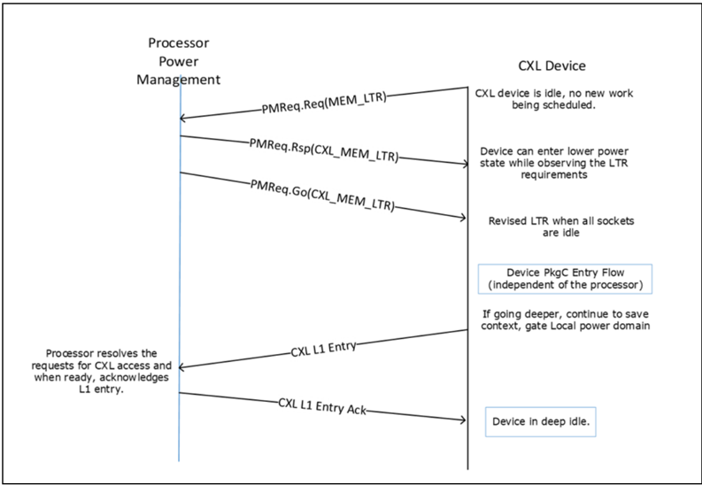

[Figure 160](#figure-160-pkgc-entry-flow-initiated-by-device-example) illustrates the PkgC entry flow. A device when wishing to enter a higherlatency Idle state, in which CPU is not active, will issue a PMReq.Req with LTR field marking the memory access tolerance of the entity. As stated in [Section 10.2.2.1](#10221-pmreq-message-generation-and-processing-rules), a device may unilaterally generate PMReq.Req to communicate any changes to its latency, without any dependency on receipt of a prior PMReq.Rsp or PMReq.Go. Specifically, a device may transmit two PMReq.Req messages without an intervening PMReq.Rsp from the host. The LTR value communicated by the device is labeled MEM_LTR represents its latency tolerance regarding CXL.cache accesses and it could be different from what is communicated via LTR messages over CXL.io.

If Idle state is allowed, the processor will respond with a matching PMReq.Rsp message, with the negotiated allowable latency tolerance LTR (labeled CXL_MEM_LTR). Both entities can independently enter an Idle state without coordination, as long as the shared resources remain accessible.

For a full package C entry, both entities need to negotiate as to the depth/latency tolerance, by responding with a PMReq.Rsp message with the agreeable latency tolerance. Once the master power management agent has coordinated LTR across all

the agents in the system, it will send a PMReq.Go() with the proper Latency field set (labeled CXL_MEM_LTR), indicating local idle power actions can be taken subject to the communicated latency tolerance value.

In case of a transition into deep-idle states (client systems mostly), device will initiate a CXL transition into L1.

These diagrams represent sequences, but do not imply any timing requirements. A host may respond to a PMReq.Req from a device with a PMReq.Rsp much later, when it is ready to enter low power state or may not respond at all. A device, having sent a PMReq.Req, shall not implement a timeout waiting for PMReq.Rsp or PMReq.Go. Similarly, a device is not required to reissue PMReq.Req if its latency tolerance requirements have not changed since previous communication and the link has stayed up. As shown in Figure 161, a CXL Type 3 device may issue PMReq.Req once after the link bring up to indicate to the host that it either has no latency requirements or a very high latency tolerance. The host may communicate any changes to its latency expectations to such a device. Such a device may initiate low power entry purely based on the latency tolerance value it receives from the host as shown in Figure 161. When the host communicates a high enough latency tolerance value to the device, the device may enter low power state. A type 3 device may enter and exit low power state purely based on PMReq.Go message from the host without dependency on a prior PMReq.Rsp.

##### Figure 161. PkgC Entry Flows for Type 3 Device - Example

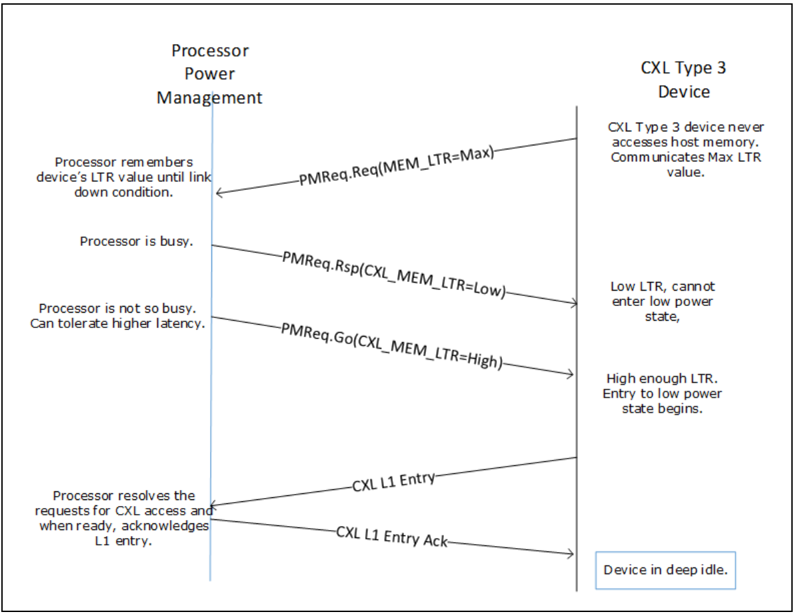

#### 10.2.4 PkgC Exit Flows

##### Figure 162. PkgC Exit Flows - Triggered by Device Access to System Memory

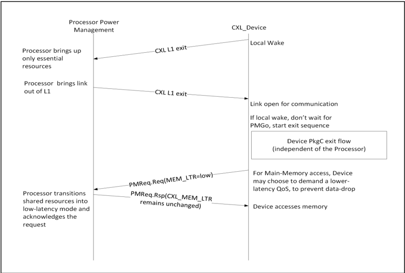

[Figure 162](#figure-162-pkgc-exit-flows-triggered-by-device-access-to-system-memory) illustrates the PkgC exit flow initiated by the device. Link state during Idle may be in one of the select L1.x states, during Deep-Idle (as depicted here). In-band wake signaling will be used to transition the link back to L0. For more, see [Section 10.3](#103-compute-express-link-power-management), 'Compute Express Link Power Management' .

Once CXL is out of L1, signaling can be used to transfer the device into a Package-C state, in which shared resources are available across CXL. The device requests a low latency tolerance value to the processor. Based on that, the processor will bring the shared resources out of Idle and communicate its latest latency requirements with a PMReq.Rsp().

##### Figure 163. PkgC Exit Flows - Execution Required by Processor

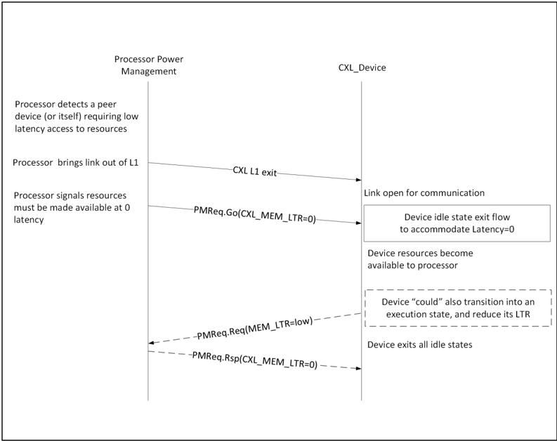

Figure 163 illustrates the PkgC exit flow initiated by the processor. In the case where the processor, or one of the peer devices connected to it requires to have coherent low latency access to system memory, the processor will initiate a Link L1 exit towards the device.

Once the link is running, the processor will follow with a PMGo(Latency=0), indicating some device in the platform requires very low latency access to coherent memory and resources. A device receiving PMReq.Go with latency 0 must ensure that further low power actions that might impede access to memory are not taken.

#### 10.2.5 Compute Express Link Physical Layer Power Management States

CXL Physical layer supports L1 and L2 states as defined in PCI Express Base Specification. CXL Physical layer does not support L0s. The entry and exit conditions from these states are as defined in the PCI Express Base Specification. The notable difference is that for CXL Physical Layer, the entry and exit from Physical Layer Power Managed states is directed by CXL ARB/MUX.

### 10.3 Compute Express Link Power Management

CXL Link Power Management supports Active Link State Power Management and L1 and L2 are the only 2 Power states supported. The PM Entry/Exit process is further divided into 3 phases as described below.

#### 10.3.1 Compute Express Link PM Entry Phase 1

The CXL PM Entry phase 1 involves protocol specific mechanisms to negotiate entry into PM state. Once the conditions to enter PM state as defined in the protocol section, are satisfied, the transaction layer is now ready for Phase 2 entry and directs the ARB/MUX to enter the PM State.

##### Figure 164. CXL Link PM Phase 1

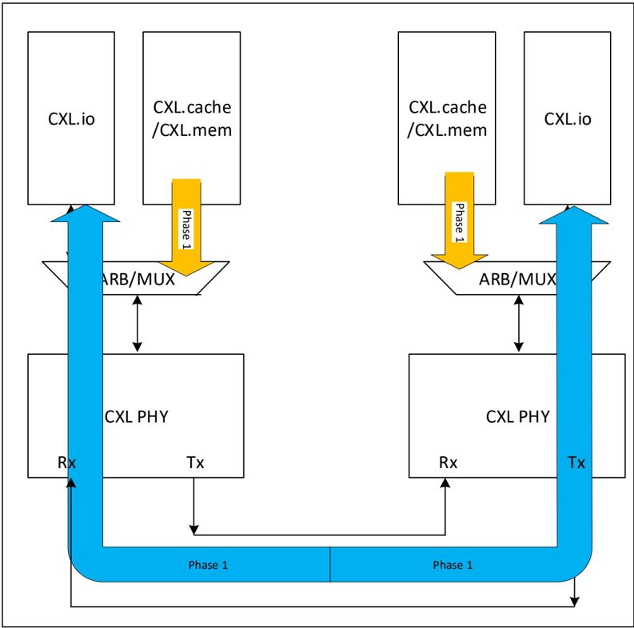

#### 10.3.2 Compute Express Link PM Entry Phase 2

When directed by the transaction layer to enter PM, the Phase 2 entry process is initiated by the ARB/MUX. The second Phase of the PM entry consists of bringing the ARB/MUX interface of both sides of the Link into PM state. This entry into the PM state is coordinated using ALMPs as described below. The Phase 2 entry is independently managed for each protocol. The Physical Layer continues to be in L0 until all the transaction layers enter Phase 2 state.

##### Figure 165. CXL Link PM Phase 2

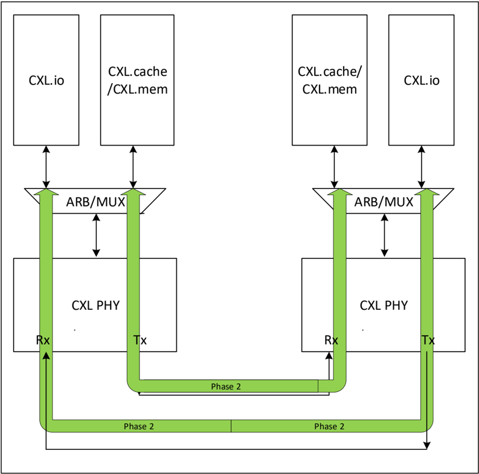

Rules for the Phase 2 entry into ASPM are as follows:

1. The Phase 2 Entry into the PM State is always initiated by ARB/MUX on the Downstream Component.
2. When directed by the transaction layer the ARB/MUX on the Downstream Component must transmit ALMP request to enter the Virtual LSM state PM.
3. When the ARB/MUX on the Upstream Component is directed to enter L1 and receives ALMP request from the Downstream Component, the Upstream Component responds with an ALMP response indicating acceptance of entry into L1 state. The transaction layer on the Upstream Component must also be notified that the ARB/MUX port has accepted entry into PM state.
4. The Upstream Component ARB/MUX port does not respond with an ALMP response if not directed by the protocol on the Upstream Component to enter PM.
5. When the ARB/MUX on the Downstream Component is directed to enter L1 and receives ALMP response from the Upstream Component, it notifies acceptance of entry into the PM state to the transaction layer on the Downstream component.

6. The Downstream Component ARB/MUX port must wait for at least 1 mS (not including time spent in recovery states) for a response from the Upstream Component. If no response is received from the Upstream component then the Downstream Component is permitted to abort the PM entry or retry entry into PM again.
7. L2 entry is an exception to rule number 6. Protocol must ensure that Upstream component is directed to enter L2 before setting up the conditions for the Downstream Component to request entry into L2 state. This ensures that L2 abort or L2 Retry conditions do not exist.
8. Transaction layer on either side of the Link is permitted to direct exit from L1 state once the ARB/MUX interface reaches L1 state.

#### 10.3.3 Compute Express Link PM Entry Phase 3

The third Phase is a conditional phase of PM entry and is executed only when all the Protocol interfaces of ARB/MUX have entered the same virtual PM state. The phase consists of bringing the Tx lanes to electrical Idle and is always initiated by the Downstream Component.

Compute Express Link Specification

##### Figure 166. CXL PM Phase 3

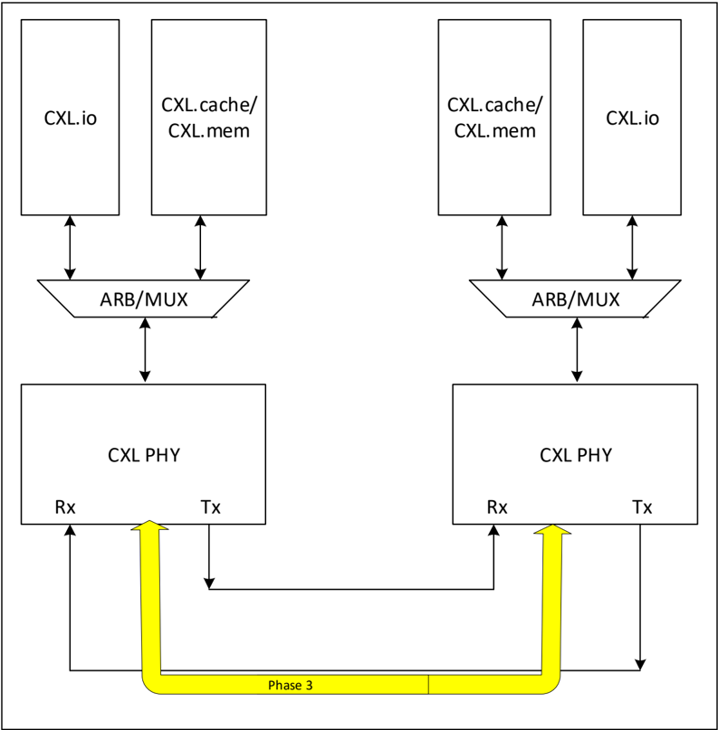

##### Figure 167. Electrical Idle

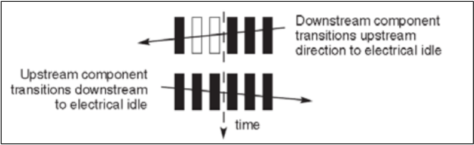

#### 10.3.4 Compute Express Link Exit from ASPM L1

Components on either end of the Link may initiate exit from the L1 Link State. The ASMP L1 exit depends on whether the exit is from phase 3 or phase 2 of L1. The exit is hierarchical and phase 3 must exit before phase 2.

Phase 3 exit is initiated when directed by the ARB/Mux from either end of the link. The ARB/MUX layer initiates exit from Phase 3 when there is an exit requested on any one of its primary protocol interfaces. The phase 3 ASPM L1 exit is the same as exit from L1 state as defined in PCI Express Base Specification. The steps are followed until the LTSSM reaches L0 state. Protocol level information is not permitted to be exchanged until the virtual LSM on the ARB/MUX interface has exited L1 state.

Phase 2 exit involves bringing the protocol interface at the ARB/MUX out of L1 state independently. The transaction layer directs the ARB/MUX state to exit virtual LSM state. If the PHY is in Phase 3 L1 then the ARB/MUX waits for the PHY LTSSM to reach L0 state. Once the PHY is in L0 state, the following rules apply.

The ARB/MUX on the protocol side that is triggering an exit transmits a ALMP requesting entry into Active state.

Any ARB/MUX interface that receives the ALMP request to enter Active State must transmit an ALMP acknowledge response on behalf of that interface. The ALMP acknowledge response is an indication that the corresponding protocol side is ready to process received packets.

Any ARB/MUX interface that receives the ALMP request to enter Active State must also transmit an ALMP Active State request on behalf of that interface if not sent already.

Protocol level transmission must be permitted by the ARB/MUX after an Active State Status ALMP is transmitted and received. This guarantees that the receiving protocol is ready to process packets.

### 10.4 CXL.io Link Power Management

CXL.io Link Power Management is as defined in PCI Express Base Specification with the following notable differences.

- Only ASPM L1 is supported for CXL 1.1. Unlike a PCI Express Device, a CXL 1.1 device is not required to initiate entry into L1 state when software transitions the device into D3Hot or D1 state. CXL 2.0 device shall support ASPM L1 as well as PCIPM. As such, a CXL 2.0 device shall initiate CXL.io L1 entry when the device is placed in D3Hot or D1.
- L0s state is not supported
- PCI-PM is not supported when connected to CXL 1.1 device.

All CXL functions shall implement PCI Power Management Capability Structure as defined in PCI Express Base Specification and shall support D0 and D3 device states.

#### 10.4.1 CXL.io ASPM Phase L1 Entry

- The first phase consists of completing the ASPM L1 negotiation rules as defined in the PCI Express Base Specification with the following notable exceptions for the rules in case of acceptance of ASPM L1 Entry. All rules up to the completion of the ASPM L1 handshake are maintained, however the process of bringing the Transmit Lanes into Electrical Idle state are divided into 2 additional phases described above. Phase 1 flow is described below.

##### Figure 168. ASPM L1 Entry Phase 1

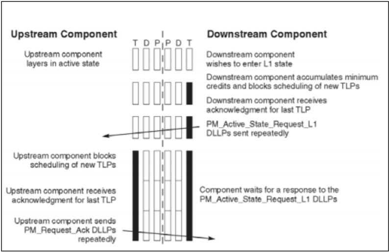

#### 10.4.2 CXL.io ASPM Phase 2 Entry

The following conditions apply for Phase 2 Entry for CXL.io

Phase 2: The second Phase of L1 entry consists of bringing the CXL.io ARB/MUX interface of both sides of the Link into L1 state. This entry into L1 state is coordinated using ALMPs as described below.

Rules for Phase 2 entry into ASPM L1.

1. CXL.io on the Upstream Component must direct the ARB/MUX to be ready to enter L1 before returning the PM_Request_Ack DLLPs as shown above in Phase 1.
2. When the PM_Request_Ack DLLPs are successfully received by the CXL.io on the Downstream Component, it must direct the ARB/MUX on the Downstream Component to transmit ALMP request to enter Virtual LSM state L1.
3. When the ARB/MUX on the Upstream Component is directed to enter L1 and receives ALMP request from the Downstream Component, it notifies the CXL.io that the interface has received ALMP request to enter L1 state and has entered L1 state
4. When the Upstream Component is notified entry into virtual LSM it ceases sending PM_Request_Ack DLLP
5. When the ARB/MUX on the Downstream Component is directed to enter L1 and receives ALMP Status from the Upstream Component, it notifies the CXL.io that the interface has entered L1 state

#### 10.4.3 CXL.io ASPM Phase 3 Entry

The Phase 3 entry is dependent on the virtual LSM state of multiple protocols and is managed by the ARB/MUX as described in the section on Phase 3 entry above.

### 10.5 CXL.cache + CXL.mem Link Power Management

CXL.cache and CXL.mem support Active Link State Power Management only, unlike CXL.io there is no PM Entry handshake defined between the Link Layers. Each side independently requests to the ARB/MUX to enter L1. The ARB/MUX layers on both sides of the Link co-ordinate the entry into PM state using ALMPs. CXL.cache + CXL.mem Link Power Management follows the process for PM entry and exit as defined in section Compute Express Link Power Management.

Compute Express Link Specification

## 11.0 Security

### 11.1 CXL IDE

CXL Integrity and Data Encryption (CXL IDE) defines mechanisms for providing Confidentiality, Integrity and Replay protection for data transiting the CXL link. The cryptographic schemes are aligned with the current industry best practices. It supports a variety of usage models while providing for broad interoperability. CXL IDE can be used to secure traffic within a Trusted Execution Environment (TEE) that is composed of multiple components, however, the framework for such a composition is out of scope for this specification.

#### 11.1.1 Scope

This chapter focuses on the changes for CXL.cache and CXL.mem traffic transiting the link and updates/constraints to the PCIe Base specification that governs CXL.io traffic.

- CXL.io IDE definition is based on PCIe IDE. Differences/constraints for CXL.io usage are called out in [Section 11.1.2](#1112-cxlio-ide).
- CXL.cachemem IDE may use the CXL.io based mechanisms for discovery, negotiation, device attestation, and key negotiation.
    - Device attestation/authentication may follow PCIe Base Specification, which in turn refers to DMTF Security Protocol and Data Model (SPDM) Specification.
    - Key exchange protocol to establish the link encryption keys may follow PCIe Base Specification
    - Mechanism of discovery and negotiation of capabilities may follow PCIe Base Specification.

In this specification, the term CXL IDE is used to refer to the scheme that protects CXL.io, CXL.cache and CXL.mem traffic. The term CXL.cachemem IDE is used to refer to the protections associated with CXL.cache and CXL.mem traffic.

> **IMPLEMENTATION NOTE: SECURITY MODEL**
> 
> **Assets**
> 
> Assets that are in scope are as follows
> 
> - Transactions (data + metadata communicated) between the two sides of the physical link. This specification only provides the definition for providing Integrity and Encryption of traffic between the ports.
> 
> **Notes:**
> 
> - This threat model does not cover the security exposure due to inadequate Device implementation.
> - Agents that are on each side of the physical link are in the trust boundary of the respective devices/hardware blocks they live in. These agents will need to provide implementation specific mechanisms to protect the data internal to the device and any external connections over which such data can be sent by the device. Mechanisms for such protection are not in the scope of this definition.
> - Symmetric cryptographic keys are used to provide confidentiality, integrity and replay protection. This specification will not define mechanisms for protecting these keys inside the host and device.
> - Certificates and asymmetric keys used for device authentication and key exchange are not in scope here. The device attestation and key exchange mechanism determine the security model for those assets.
> 
> **TCB**
> 
> The TCB consists of the following
> 
> - Hardware blocks on each side of the link that implement the link encryption and integrity.
> - Agents that are used to configure the crypto engines. For example, trusted firmware/software agent and/or security agent hardware and firmware that implement key exchange protocol or facilitate programming of the keys.
> - Other hardware blocks in the device that may have access to the assets directly or indirectly, including those that perform operations such as reset, debug, and link power management.
> 
> **Adversaries and Threats**
> 
> - Threats from physical attacks on links, including cases where an adversary can examine data intended to be confidential, modify data or protocol meta-data, record and replay recorded transactions, reorder and/or delete data flits, inject transactions including requests/data or non-data responses, using lab equipment, purpose-built interposers, or malicious Extension Devices.
> - Threats arising from physical replacement of a trusted device with an untrusted one, and/or removal of a trusted device and accessing it with a system that is under adversary's control.
> - CXL.cachemem IDE provides point-to-point protection. Any switches present in the path between the host and the Endpoint, or between two Endpoints, must support this specification. In addition, such switches will be in the TCB.
> 
> Denial of service attacks are not in scope.

#### 11.1.2 CXL.io IDE

CXL.io IDE follows the PCIE IDE definition. This section covers the notable constraints and differences between the CXL.io IDE definition and the PCIe IDE definition.

##### Table 222. Mapping of PCIE IDE to CXL.io

| PCIE IDE Definition                              | CXL.io Support   | Notes                                                                                                                                               |
|--------------------------------------------------|------------------|-----------------------------------------------------------------------------------------------------------------------------------------------------|
| Link IDE stream                                  | Supported        | Required for CXL.cachemem IDE. CXL.cachemem will only use keys associated with Link IDE stream.                                                     |
| Selective IDE stream                             | Supported        | Selective IDE stream only applies to CXL.io.                                                                                                        |
| Aggregation                                      | Supported        | PCIe defined aggregation levels only apply to CXL.io traffic.                                                                                       |
| Switches with flow-through selective IDE streams | Supported        | CXL Switches need to support Link IDE streams. CXL switches may either act as terminus for selective IDE streams or forward them towards Endpoints. |
| PCRC mechanism                                   | Supported        | PCRC mechanism may be optionally enabled for the CXL.IO ports                                                                                       |

One of the PCIE IDE reserved sub-stream encodings (1000b) is assigned for CXL.cachemem usage.

#### 11.1.3 CXL.cachemem IDE High Level Overview

- All protocol level retriable flits are encrypted and integrity protected.
- Link Layer control flits and flit CRC are not encrypted nor integrity protected. There is no confidentiality nor integrity on these flits.
- Link CRC shall be computed on encrypted flits. Link retries happen first and only flits that pass Link CRC will be decrypted/ integrity checked.
- Any integrity check failures shall result in all future secure traffic getting dropped.
- Multi-Data Header capability must be supported. This allows packing of multiple (up to 4) data headers into a single slot, followed immediately by 16 slots of all-data.
- AES-GCM with 256 bit key size shall be used for confidentiality, integrity and replay protection.
- Key refresh without any loss of data must be supported. There are a number of scenarios where the keys need to be refreshed. Some examples include
    - An accelerator device that is migrated from one VM (or process) to a different one.
    - Crypto considerations (concerns about key wear-out) for long running devices or devices that are part of platform.
- Key refresh is expected to happen infrequently. It is acceptable to take a latency/ bandwidth hit, but there must not be any loss of data.
- Encrypted PCRC mechanism is supported to provide robustness against hard and soft faults internal to the encryption and decryption engines. Encrypted PCRC integrates into the standard MAC check mechanism, does not consume incremental link bandwidth, and can be implemented without adding significant incremental latency. PCRC is mandatory for CXL.cachemem IDE and is enabled by default.

#### 11.1.4 CXL.cachemem IDE Architecture

- IDE shall operate on a flit granularity for CXL.cachemem protocols. IDE makes use of the Advanced Encryption Standard-Galois Counter (AES-GCM) mode of operation as defined in NIST Special Publication 800-38D. AES-GCM takes three inputs denoted as additional authentication data (AAD - designated A in AES-GCM spec), plain text (P), and initialization vector (IV).
- In the case of CXL.cachemem protocol header flits, the 32 bits of the flit Header that are part of slot 0 maps to A - it is not encrypted, but is integrity protected. The rest of the content of slot 0/1/2/3 maps to P, which is encrypted and integrity protected (see handling of MAC slot below). CXL.cachemem protocol also supports data-only flits. In the case data-only flits, all 4 slots in the flit map to P .
- The link CRC is not encrypted or integrity protected. The CRC is computed on the flit content after it has been encrypted.
- As with other protocol flits, IDE flits shall be covered by link layer mechanisms for detecting and correcting errors. This process shall operate on flits after they are cryptographically processed by the transmitter and before they are submitted for cryptographic processing by the receiver.
- AES-GCM is applied to an aggregation of multiple flits referred to as a MAC_Epoch. The number of flits in the aggregation is determined by the Aggregation Flit Count. The term Aggregation Flit Count is defined in [Section 11.1.7](#1117-cxlcachemem-ide-modes). If PCRC ([Section 11.1.5](#1115-encrypted-pcrc)) is enabled in the CXL IDE Control Register ([Section 8.2.5.14.2](#825142-cxl-ide-control-offset-04h)), the 32 bits of PCRC shall be appended to the end of the aggregated flit content to contribute to the final P value that is integrity protected. However, the 32 bits of PCRC are not transmitted across the link. Figure 169 shows the mapping of the flit contents into the A and P for the case of aggregation of MAC across 5 flits.
- The Message Authentication Code (MAC), also referred to as the authentication tag in the AES-GCM specification, shall be 96 bits. The MAC must be transmitted in a slot 0 header of Type H6 (see Figure 55). Unlike other slot 0 headers, the MAC itself is neither encrypted nor integrity protected. Figure 170 shows the mapping of flit contents to A and P for the case of aggregation of MAC across 5 flits with one of the flits carrying a MAC.

##### Figure 169. CXL.cachemem IDE Showing Aggregation of 5 Flits

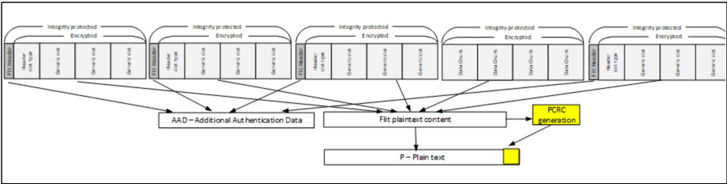

##### Figure 170. CXL.cachemem IDE Showing Aggregation Across 5 Flits Where One Flit Contains MAC Header in Slot 0

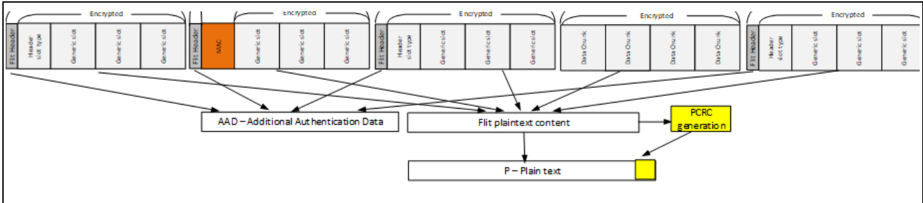

- Figure 171 gives a more detailed view of the 5 flit MAC Epoch example. Flit0 shown on the top is the first flit to be transmitted in this MAC Epoch. The figure delineates the header fields that are only integrity protected, and plain text content that is encrypted and integrity protected. Flit0 plaintext0 byte0 is the first byte of the plain text. Flit1 plaintext0 byte0 shall immediately follow flit0 plaintext0 byte 11.

##### Figure 171. More Detailed View of a 5 Flit MAC Epoch Example

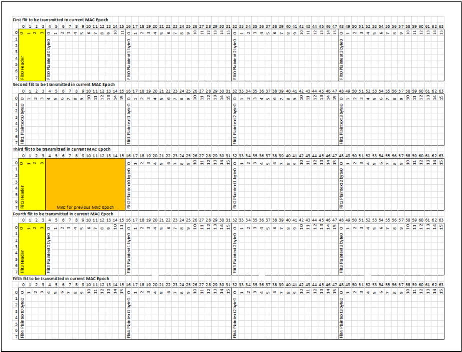

Figure 172 shows the mapping of the header bytes to AES-GCM AAD for the example in Figure 171.

##### Figure 172. Mapping of AAD Bytes for the Example Shown in Figure 171

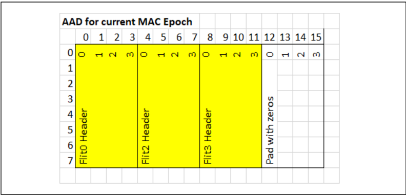

#### 11.1.5 Encrypted PCRC

Polynomial with the coefficients 0x1EDC6F41 shall be used for PCRC computation. PCRC computation shall begin with an initial value of 0xFFFFFFFF. The PCRC shall be computed across all the bytes of plaintext in the aggregated flits that are part of the given MAC Epoch. PCRC calculation shall begin with bit0 byte0 of flit plaintext content and sequentially include bits 0 - 7 for each byte of the flit contents that are mapped to the plaintext. After accumulating the 32-bit value across the flit contents, the PCRC value shall be finalized by taking 1's complement of the bits of accumulated value to obtain PCRC [31:0].

On the transmit side (Figure 173), the PCRC value shall be appended to the end of the aggregated flit plaintext content, encrypted and included in the MAC computation. The encrypted PCRC value is not transmitted across the link.

On the receiver side(Figure 174), the PCRC value shall be recomputed based on the received decrypted cipher text. When the last flit of current MAC epoch has been processed, the accumulated PCRC value shall be XORed (encrypted) with the AES keystream bits that immediately follow the values used for decrypting the received cipher flit. This encrypted PCRC value shall be appended to the end of the received cipher text for the purposes of MAC computation.

##### Figure 173. Inclusion of the PCRC mechanism into AES-GCM encryption

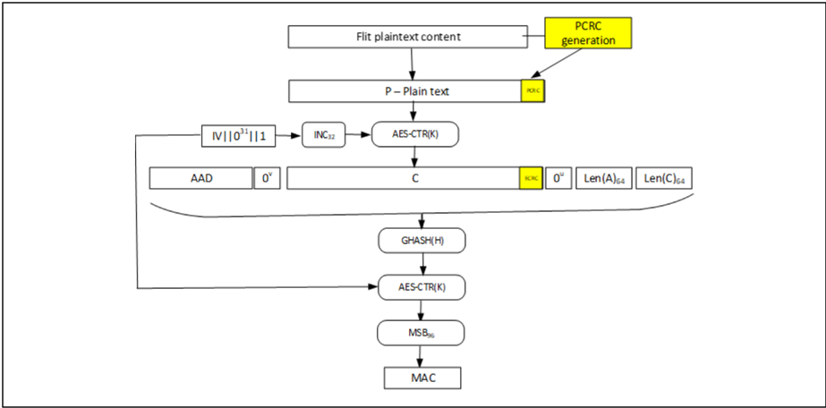

##### Figure 174. Inclusion of the PCRC mechanism into AES-GCM decryption

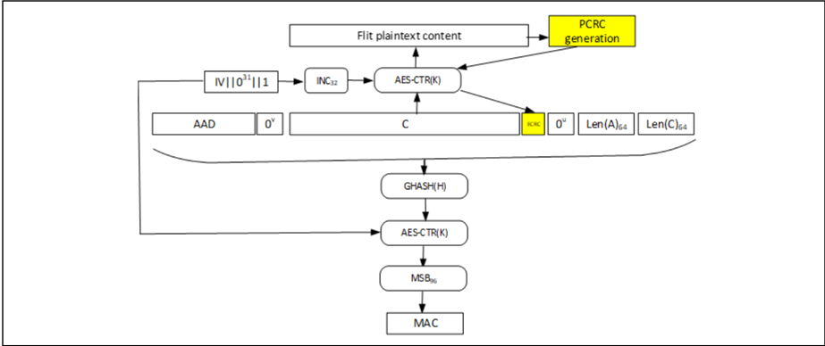

#### 11.1.6 CXL.cachemem IDE Cryptographic Keys and IV

Initialization of a CXL.cachemem IDE Stream involves multiple steps; it is possible that some of these steps can be merged or performed in a different order. The first step is to establish the authenticity and identity of the components containing the two ports that act as Endpoints for a CXL.cachemem IDE Stream. The second step is to establish the IDE Stream keys. In some cases, these two steps may be combined. Third, the IDE is configured. Finally, the establishment of the IDE Stream is triggered.

CXL.cachemem IDE may make use of CXL.io IDE mechanisms for device attestation and key exchange.

IV (Initialization Vector) construction of CXL.cachemem IDE shall follow the CXL.io PCIe specification. A 96-bit IV of deterministic construction is used as per the AES-GCM specification.

- A fixed field is located at bits 95:64 of the IV , where bits 95:92 contain the substream identifier, 1000b , and bits 91:64 are all 0s. T he same sub-stream encoding is used for both transmitted and received flits, but the keys used by a port during transmit and receive flows must be distinct.
- An invocation field in bits 63:0 of the IV contains a monotonically incrementing counter with rollover properties. The invocation field is initially set to the value 0000_0001h for each sub-stream upon establishment of the IDE Stream, and is incremented every time an IV is consumed. Neither the transmitter nor the receiver are required to detect IV rollover 1  and are not required to take any special actions when IV rolls over.

#### 11.1.7 CXL.cachemem IDE Modes

CXL.cachemem IDE supports two modes of operation.

- Containment Mode: In this mode the data is released for further processing only after the integrity check passes. This mode impacts both latency and bandwidth. The latency impact is due to the need to buffer several flits until the integrity value has been received and checked. The bandwidth impact comes from the fact that integrity value is sent quite frequently.   If containment mode is supported and enabled, the devices (and hosts) use an Aggregation Flit Count of 5.

Skid Mode: Skid mode allows the data to be released for further processing without waiting for the integrity value to be received and checked. This allows for less frequent transmission of the integrity value. Skid mode allows for near zero latency overhead and very low bandwidth overhead. In this mode, data modified by an adversary is potentially consumed by software, but such an attack will be subsequently detected when the integrity value is received and checked. If skid mode is supported and enabled, all devices (and hosts) shall use an Aggregation Flit Count of 128. When using this mode, the software and application stack must be capable of tolerating attacks within a narrow time window, or the result is undefined.

##### 11.1.7.1 Discovery of Integrity Modes and Settings

Each port shall enumerate the modes it supports and other capabilities via registers in the CXL IDE Capability Structure([Section 8.2.5.14](#82514-cxl-ide-capability-structure)). All devices adherent to this specification shall support containment mode.

##### 11.1.7.2 Negotiation of Operating Mode and Settings

The operating mode and timing parameters are configured in the CXL IDE Capability Structure ([Section 8.2.5.14](#82514-cxl-ide-capability-structure)) prior to enabling of CXL.cachemem IDE.

The mechanism for the negotiation of the operating mode is not covered by this specification.

#### 11.1.8 Rules for MAC Aggregation

The rules for generation and transfer of MAC are listed below.

1. For a x16 link operating at 32 Gbps, a 32 bit IV will take longer than 1000 years to roll over.

- MAC_Epoch: A MAC_Epoch is defined as the set of consecutive flits that are part of a given aggregation unit. The IDE mode ([Section 11.1.7](#1117-cxlcachemem-ide-modes)) determines the number of flits in a standard MAC_Epoch. This number is known as Aggregation Flit Count (referred to as N below). Every MAC_Epoch with the exception of early MAC termination ([Section 11.1.9](#1119-early-mac-termination)) case carry N flits. A given MAC header shall contain the tag for precisely one MAC_Epoch. The transmitter shall accumulate the integrity value over flits in exactly one MAC_Epoch (that is at most N flits) prior to transmitting it.
- In all cases, the transmitter must send MACs in the same order as MAC Epochs.
- Figure 175 shows an example of MAC generation and transmission for one MAC_Epoch in the presence of back-to-back protocol traffic. The earliest flit to be transmitted or received is shown on the top of the figure. Thus, flits 0 to N-1 (shown in yellow) belonging to MAC_EPOCH 1 are transmitted in that order. The MAC is computed over flits 0 to N-1.

##### Figure 175. MAC Epochs and MAC Transmission in Case of Back-to-Back Traffic (a) Earliest MAC Header Transmit (b) Latest MAC Header Transmit in the Presence of Multi-Data Header

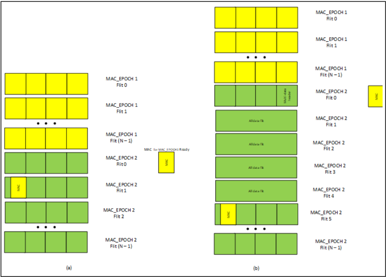

- The transmitter shall send the MAC header containing this integrity value at the earliest possible time. This specification allows for transmission of protocol flits belonging to the next MAC_Epoch between the transmission of last flit of current MAC_Epoch and the actual transmission of the MAC header for that MAC_Epoch. This is needed to handle the transmission of all-data flits and is also useful for avoiding bandwidth bubbles due to MAC computation latency. It is recommended that the transmitter send the MAC header on the first available Slot0 header immediately after the MAC computations are completed. In all cases (including the cases with multi-data headers), at most 5 protocol flits belonging to the current MAC_Epoch are allowed to be transmitted prior to the transmission of the MAC for the previous MAC_Epoch.
- On the receive side, the receiver may expect the MAC header to come in on a ny protocol flit from first to sixth protocol flits after the last flit of the previous MAC_Epoch (Figure 175 (b)).

##### Figure 176. Example of MAC Header Being Received in the Very First Flit of the Current MAC_Epoch

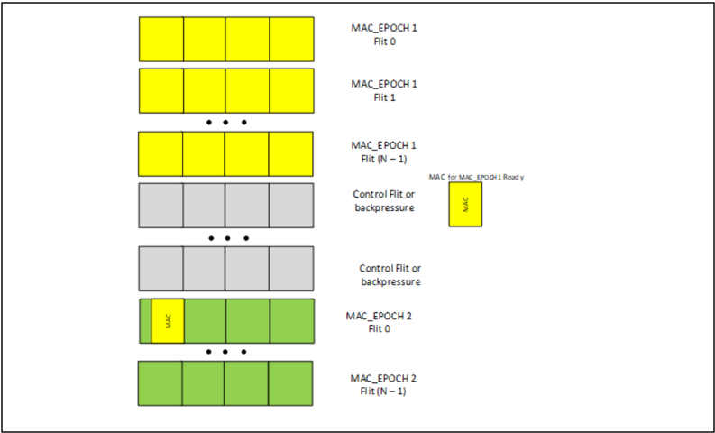

- In the containment mode, the receiver must not release flits of a given MAC_Epoch for consumption until the MAC header that contains the integrity value for those flits has been received and the integrity check has passed. Since the receiver can receive up to five protocol flits belonging to the current MAC_Epoch before receiving the MAC header for the previous MAC_Epoch, the receiver shall buffer the flits of the current MAC_Epoch to ensure that there is no loss of data. For example, referring to Figure 175(b), both the yellow and green flits are buffered until the MAC header for MAC_Epoch 1 is received and the integrity check passes. If the check passes, the yellow flits can be released for consumption. The green flits cannot, however, be released until the green MAC flit has been received and the integrity verified. [Section 11.1.11](#11111-error-handling) defines the receiver behavior upon integrity check failure.
- In skid mode, the receiver may decrypt and release the flits for consumption as soon as they are received. The MAC value shall be accumulated as needed and checked when the MAC header for the flits in the MAC_Epoch arrives. Again, referring to example in Figure 175 (b), both the yellow and green flits may be decrypted and released for consumption without waiting for the MAC header for MAC_Epoch1 to be received and verified. When the MAC header for MAC_Epoch1 is received, it is verified. If the check passes, there is no action to be taken. If the MAC header is not received within six protocol flits after the end of the previous MAC_Epoch, the receiver shall treat the absence of MAC as an error. [Section 11.1.11](#11111-error-handling) defines the receiver behavior upon integrity check failure or missing MAC header or a delayed MAC header.

> **IMPLEMENTATION NOTE**
> 
> In the containment mode, the receiver must not release any decrypted flits for consumption unless their associated MAC check has been performed and has passed. This complies with the algorithm for the Authenticated Decryption Function as defined in NIST Special Publication 800-38D (AES-GCM spec).
> 
> In the skid mode, the receiver is permitted to release any decrypted flits for consumption without waiting for their associated MAC check to be performed. Unless there are additional device-specific mechanisms to prevent this consumption, the use of skid mode will not meet the requirements of the above-mentioned algorithm.
> 
> Solution stack designers must carefully weigh the benefits versus the downsides when choosing between the containment mode and the skid mode. The containment mode guarantees that potentially corrupted data will not be consumed. Skid mode provides data privacy and eventual detection of data integrity loss, with significantly less latency impact and link bandwidth loss compared to containment mode. However, the use of skid mode may be more vulnerable to security attacks and will require additional device-specific mechanisms if it is necessary to prevent the consumption of corrupted data.

#### 11.1.9 Early MAC Termination

A transmitter is permitted to terminate the MAC_Epoch early and transmit the MAC for the flits in a truncated MAC_Epoch when fewer than the Aggregation Flit Count of flits have been transmitted in the current MAC_Epoch. This can happen as part of link idle handling. The link may be ready to go idle after the transmission of a number of protocol flits, less than the Aggregation Flit Count, in the current MAC_Epoch.

The following rules shall apply to the early termination of the MAC_Epoch and the transmission of the MAC.

The transmitter is permitted to terminate the MAC_Epoch early if and only if the number of protocol flits in the current MAC_Epoch is less than Aggregation Flit Count. The MAC for this truncated MAC_Epoch shall be transmitted by itself in the IDE.TMAC Link Layer Control flit (see [Table 54](#table-54-cxlcachecxlmem-link-layer-control-details-sheet-2-of-3)). This sub-type is referred to as a Truncated MAC flit in remainder of this specification. Any subsequent protocol flits would become part of a new MAC Epoch and would be transmitted after the Truncated MAC Flit. The MAC for the truncated MAC Epoch is computed identically to the MAC computation for the normal cases, except that it is accumulated over fewer flits.

Figure 178 shows an example of truncating the current MAC Epoch after 3 protocol flits. Flits in current MAC Epoch can contain any valid protocol flit including a header flit that contains the MAC for the previous MAC Epoch. The MAC for the current MAC Epoch shall be sent using a Truncated MAC Flit. The Truncated MAC flit will be transmitted following the three protocol flits of the current MAC Epoch with no other intervening protocol flits from the next MAC Epoch.

##### Figure 177. Early Termination and Transmission of Truncated MAC Flit

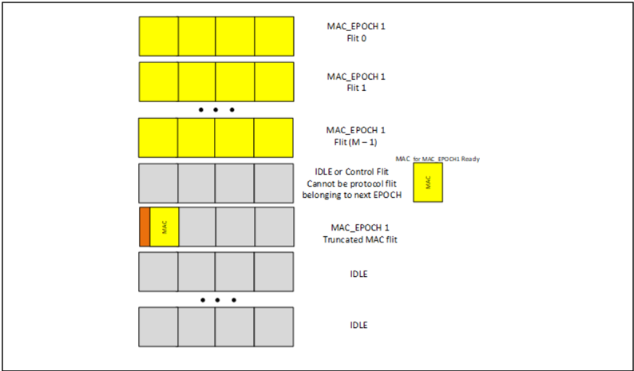

##### Figure 178. CXL.cachemem IDE Transmission with Truncated MAC Flit

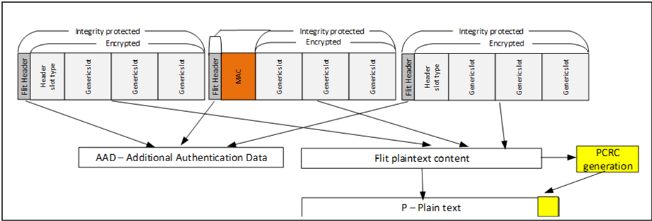

In the case where the link goes idle after sending exactly the Aggregation Flit Count number of flits in the MAC_Epoch, then the Truncated MAC flit as defined above must not be used. The MAC header must be part of the next MAC Epoch. This new MAC Epoch is permitted to be terminated early using the Truncated MAC Flit (see Figure 179).

##### Figure 179. Link Idle Case After Transmission of Aggregation Flit Count Number of Flits

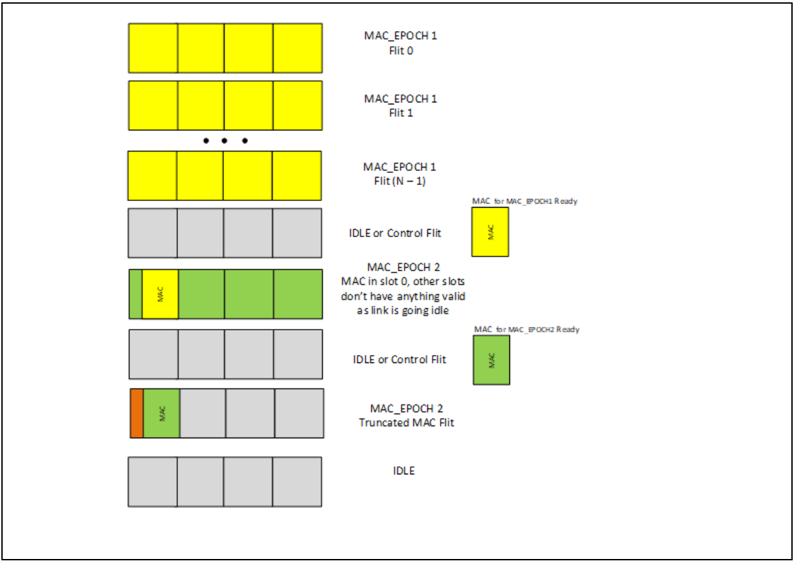

Once the transmitter sends out the MAC flit for all the previous flits that were in flight, it may go idle. The receiver is permitted to go idle after the MAC flit corresponding to flits has been received and verified. IDE idle control flits are retriable and may be resent as part of replay.

After early MAC Termination and transmittal of the Truncated MAC, the transmitter must send at least TruncationDelay number of IDE idle flits before it can transmit any protocol flits. TruncationDelay is defined via the following equations:

##### Equation 1.

TruncationDelay = Min(Remaining Flits, Tx Min Truncation Transmit Delay)

Tx Min Truncation Transmit Delay ([Section 8.2.5.14.6](#825146-truncation-transmit-delay-capability-offset-14h)) is a configuration parameter to account for the potential discarding of any precomputed AES keystream values for the current MAC Epoch that need to be discarded. Remaining Flits represents the number flits remaining to complete current MAC Epoch and is calculated as

##### Equation 2.

Remaining Flits= Aggregation Flit Count - Number of protocol flits received in current MAC Epoch

#### 11.1.10 Handshake to Trigger the Use of Keys

Each port exposes a register interface that software can use to program the transmit and receive keys and associated parameters. These programmed keys remain pending in registers until activation. While the keys are in the process of being exchanged and configured in both upstream and Downstream Ports, the link may be actively using a previously configured key. The new keys shall not take effect until the actions described below are taken.

The mechanism described below is used to switch the backup keys to the active state. This is needed to ensure the Transmitter and Receiver switch to using the programmed keys in a coordinated manner.

After the keys are programmed into pending registers on both sides of the link, there shall be a device specific action on each transmitter on each port to trigger the transmission of IDE.Start Link Layer Control flit (see [Table 54](#table-54-cxlcachecxlmem-link-layer-control-details-sheet-2-of-3)). The mechanism for determining and ensuring both sides are fully configured is not part of this specification.

After IDE.Start has been sent, all future protocol flits shall be protected by the new keys. In order to allow the receiver to get ready to receive the flits protected with new key, the Transmitter is required to send IDE.idle flits, as defined in [Table 54](#table-54-cxlcachecxlmem-link-layer-control-details-sheet-2-of-3) for the number of flits specified by the register field Tx Key Refresh Time (see [Section 8.2.5.14.7](#825147-key-refresh-time-control-offset-18h)) prior to sending any protocol flits with the new key. These idle flits are not encrypted or integrity protected.   Tx Key Refresh Time in the transmitter must be configured to a value higher than the worst-case latency in the receiver to get ready to use the new keys, which is advertised by the receiver via Rx Min Key Refresh Time register field ([Section 8.2.5.14.5](#825145-key-refresh-time-capability-offset-10h)).

After receiving IDE.Start flit, the receiver must switch to using the new keys.

IDE.start flit shall be ordered with respect to the protocol flits. In case of link level retries, the receiver shall complete retries of previously sent protocol flits before handling the IDE.start flit and switching to the new key. Other events such as link retraining can happen in the middle of this flow as long as the ordering stated above is maintained.

#### 11.1.11 Error Handling

CXL IDE does not impact or require any changes to the link CRC error handling and the link retry flow.

The details regarding CXL.cachemem errors are logged in CXL IDE Error Status register ([Section 8.2.5.14.4](#825144-cxl-ide-error-status-offset-0ch)). When a CXL.cachemem IDE error is detected, the appropriate bits in Uncorrectable Error Status register ([Section 8.2.5.9.1](#82591-uncorrectable-error-status-register-offset-0x0)) are also set and the error is signaled using the standard CXL.cachemem protocol error signaling mechanism.

Upon detection of an integrity failure on received secure traffic:

- An integrity failure shall be logged in the error reporting registers and an error signaled using standard CXL.cachemem protocol error signaling mechanisms.
- Any buffered protocol flits are dropped and all subsequent secure traffic dropped until the link is reset.
- Device shall prevent any leakage of keys or user data. The device may need to implement mechanisms to clear out data/state or have access control to prevent leakage of secrets. Such mechanisms and actions are device specific and beyond the scope of this specification.

The following conditions must be treated like an integrity failure:

- A MAC Header is received when the link is not in secure mode
- A MAC Header is not received when expected
- A truncated MAC Flit is received when not expected
- Protocol flit is received earlier than expected after Truncated MAC flit
- Protocol flit is received earlier than expected after key switch

#### 11.1.12 Switch Support

A CXL switch that supports CXL.cachemem IDE must support Link IDE for CXL.io traffic. It may, in addition, optionally support Selective Stream IDE for CXL.io traffic including Selective Stream IDE in flow-through mode. A CXL switch may just support Selective Stream IDE in flow-through mode for CXL.io traffic. In this case, CXL.cachemem IDE cannot not be enabled on host side. In the case of multi-VCS capable switches, CXL IDE may be enabled on a per Root Port basis. However, once any Root Port has enabled CXL IDE, the downstream link from the switch to the MLD devices that support CXL IDE, must have link IDE enabled. Thus, the traffic from a Root Port which has not enabled CXL IDE that is targeting an MLD device that has enabled CXL IDE, would be encrypted and integrity protected between the switch and the device.

> **IMPLEMENTATION NOTE: IDE CONFIGURATION OF CXL SWITCHES**
> 
> The examples below describe three different models for configuring the CXL.cachemem IDE and performing key exchanges with the CXL switches and the devices attached to them.
> 
> **Model A**
> 
> Host performs key exchange with the CXL switch and enables CXL IDE. The host will then enumerate the Downstream Ports in the CXL switch and performs key exchange with those downstream devices that support CXL IDE. It then programs the keys into the respective Downstream Ports of the switch and enables CXL IDE.
> 
> **Model B**
> 
> Host performs key exchange with the CXL switch and enables CXL IDE. In parallel, CXL switch will enumerate downstream devices, performs key exchange with those downstream devices that support CXL IDE. Switch then programs the keys into the respective Downstream Ports of the switch and enables CXL IDE. Host can obtain a report from the CXL switch regarding the enabling of CXL IDE for downstream devices which includes information about the public key used to attest to the device EP. Host may obtain an attestation from the device Endpoint directly and confirm that the Endpoint in question has the same public key that was used by switch as part of the key exchange.
> 
> **Model C**
> 
> An out-of-band agent may configure keys into the host, switch and devices via out-ofband means and then enable CXL IDE directly.

## 12.0 Reliability, Availability and Serviceability

CXL RAS capabilities are built on top of PCI Express. Additional capabilities are introduced to address cache coherency and memory as listed below.

### 12.1 Supported RAS Features

The table below lists the RAS features supported by CXL and their applicability to CXL.io vs. CXL.cache and CXL.mem.

#### Table 223. CXL RAS Features

| Feature                      | CXL.io                                                          | CXL.cache and CXL.mem                                                                                                       |
|------------------------------|-----------------------------------------------------------------|-----------------------------------------------------------------------------------------------------------------------------|
| Link CRC and Retry           | Required                                                        | Required                                                                                                                    |
| Link Retraining and Recovery | Required                                                        | Required                                                                                                                    |
| eDPC                         | Optional                                                        | Leverage CXL.io capability. CXL.cache or CXL.mem errors may be signaled via ERR_FATAL or ERR_NONFATAL and may trigger eDPC. |
| ECRC                         | Optional                                                        | N/A                                                                                                                         |
| Hot-Plug                     | Not Supported in CXL 1.1, Managed hot-plug supported in CXL 2.0 | Same as CXL.io.                                                                                                             |
| Data Poisoning               | Required                                                        | Required                                                                                                                    |
| Viral                        | N/A                                                             | Required                                                                                                                    |

### 12.2 CXL Error Handling

As shown in Figure 180, CXL can simultaneously carry three protocols: CXL.io, CXL.cache and CXL.mem. CXL.io carries PCIe like semantics and must be supported by all CXL Endpoints. All RAS capabilities must address all of these protocols and usages. For details of CXL architecture and all protocols, please refer to the other sections in this document.

Figure 180 below is an illustration of CXL and the focus areas for CXL RAS. Namely, Link &amp; protocol RAS, which applies to the CXL component to component communication mechanism and Device RAS which applies exclusively to the device itself. All CXL protocol errors are reflected to the OS via PCIe AER mechanisms as 'Correctable Internal Error' (CIE) or 'Uncorrectable Internal Error' (UIE). Errors may also be reflected to Platform software if so configured.

#### Figure 180. CXL 1.1 Error Handling

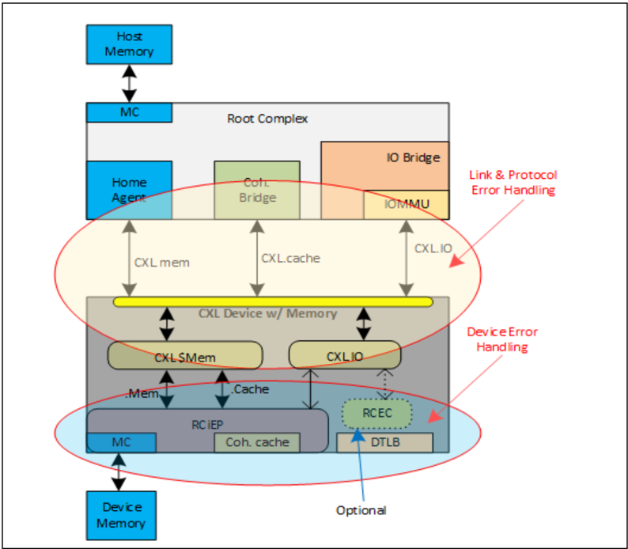

Referring to Figure 180, the CXL 1.1 Host/Root Complex is located on the north side and contains all the usual error handling mechanisms such as Core error handling (e.g. MCA architecture), PCIe AER, RCEC and other platform level error reporting and handling mechanisms. CXL.mem and CXL.cache protocol errors encountered by the device are communicated to the CPU across CXL.io. to be logged in PCIe AER registers. The following sections will focus on the link layer and transaction layer error handling mechanisms as well as CXL device error handling.

Errors detected by CXL 2.0 ports are escalated and reported using standard PCIe error reporting mechanisms over CXL.io as UIE/CIE.

#### 12.2.1 Protocol and Link Layer Error Reporting

Protocol and Link errors are detected and communicated to the Host where they can be exposed and handled. There are no error pins connecting CXL devices to the Host. Errors are communicated between the Host and the CXL device via messages over CXL.io.

##### 12.2.1.1 CXL 1.1 Downstream Port (DP) Detected Errors

Errors detected by the CXL 1.1 DP are escalated and reported via the Root Complex error reporting mechanisms as UIE/CIE. The various signaling and logging steps are listed below and illustrated in Figure 181.

1. DP A  CXL.io detected errors are logged in local AER Extended Capability in DP A RCRB. Software must ensure that Root Port Control register in DP A  AER Extended Capability are not configured to generate interrupt.
2. DP A  CXL.cache and CXL.mem logs errors in CXL RAS Capability Structure ([Section 8.2.5.9](#8259-cxl-ras-capability-structure))
3. DP A  CXL.cache, CXL.mem, or CXL.io sends error message to RCEC
4. RCEC logs UIE/CIE
5. RCEC generates MSI if enabled

OS error handler may begin by inspecting the RCEC AER Extended Capability and follow PCI Express rules to discover the source of the error. Platform Software Error Handler may interrogate the Platform specific error logs in addition to the error logs defined in PCI Express Base Specification and this specification.

###### Figure 181. CXL 1.1 DP Detects Error

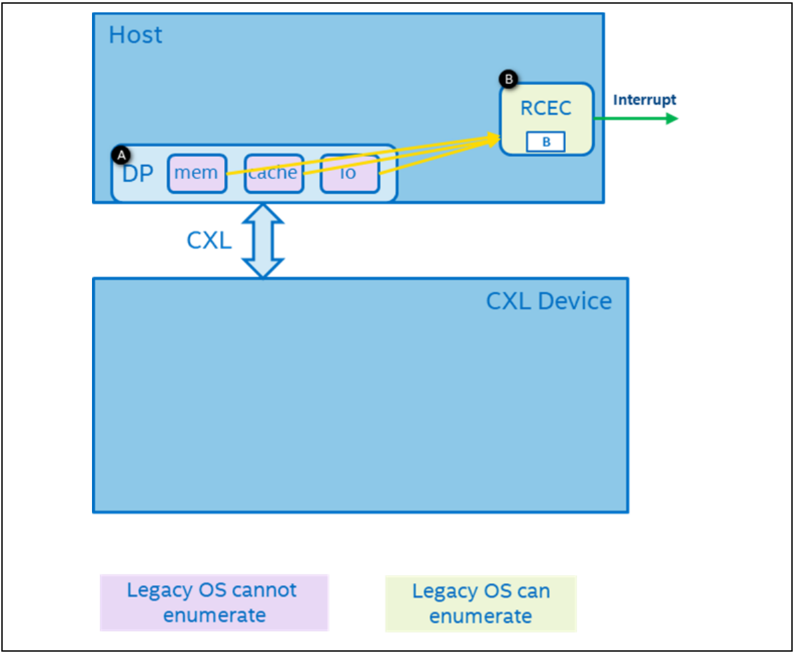

##### 12.2.1.2 CXL 1.1 Upstream Port (UP) Detected Errors

Errors detected by the CXL 1.1 UP are also escalated and reported via the Root Complex Event Collector. The various signaling and logging steps are listed below and illustrated in Figure 182.

1. If CXL.cache or CXL.mem block in UP Z  detects protocol or link error, it shall log it in CXL RAS Capability Structure ([Section 8.2.5.9](#8259-cxl-ras-capability-structure))
2. UP   RCRB shall not implement AER Extended Capability
3. UP Z  sends error message to all CXL.io Functions that are affected by this error (This example shows a device with a single function. The message must include all the details the CXL.io function needs for constructing AER record
4. .IO Functions log received message in their respective AER Extended Capability
5. Each affected CXL.io Function sends ERR_ message to UP Z  with its own Requestor ID
6. UP Z  forwards this Error message across the Link without logging
7. DP A  forwards Error message to RCEC
8. RCEC logs the error and signals interrupt if enabled in accordance with PCIe Base Specification

###### Figure 182. CXL 1.1 UP Detects Error

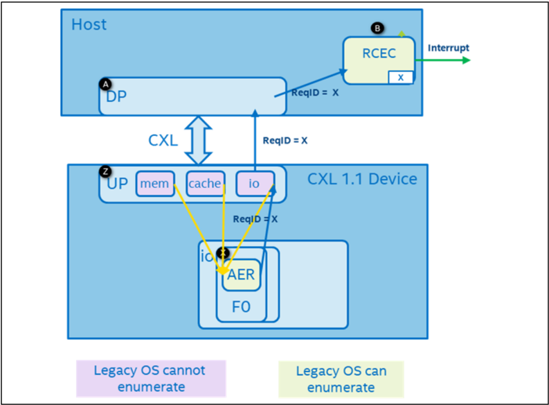

##### 12.2.1.3 CXL 1.1 RCiEP Detected Errors

Errors detected by the CXL 1.1 RCiEP are also escalated and reported via the Root Complex Event Collector. The various signaling and logging steps are listed below and also illustrated in Figure 183.

1. CXL.cache (or CXL.mem) notifies all affected CXL.io Functions of the error
2. All affected CXL.io Functions logs UIE/CIE in their respective AER Extended Capability
3. CXL.io Functions generate PCIe ERR_ message on the Link with Tag = 0
4. DP A  forwards the ERR_ message to RCEC
5. RCEC logs UIE/CIE and generates MSI if enabled in accordance with PCIe Base Specification

###### Figure 183. CXL 1.1 RCiEP Detects Error

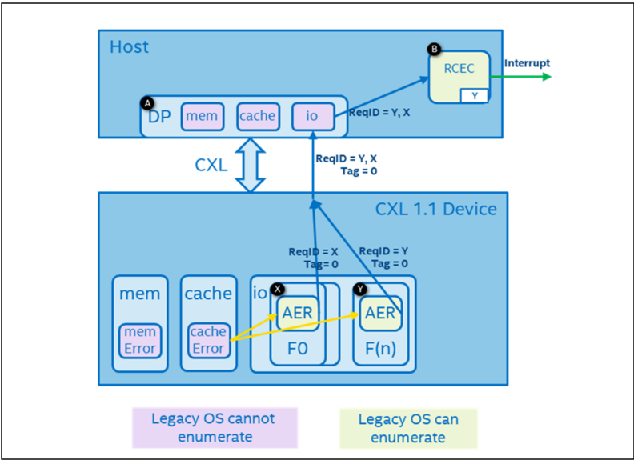

#### 12.2.2 CXL 2.0 Root Ports, Downstream Switch Ports, and Upstream Switch Ports

Errors detected by these ports are escalated and reported using PCIe error reporting mechanisms as UIE/CIE.

OS error handler may begin by inspecting the Root Port AER Extended Capability and follow PCI Express rules to discover the source of the error. Platform Software Error Handler may interrogate the Platform specific error logs in addition to the error logs defined in PCI Express Base Specification and this specification.

#### 12.2.3 CXL Device Error Handling

Whenever a CXL device returns data that is either known to be bad or suspect, it must ensure the consumer of the data is made aware of the nature of the data either at the time of consumption or prior to the consumption of data. This allows the consumer to take the appropriate containment actions.

CXL defines two containment mechanisms - poison and viral

1. Poison: Return data on CXL.io and CXL.cachemem may be tagged as poisoned.
2. Viral: CXL.cachemem supports viral, which is generally used to indicate more severe error conditions at the device. See section &lt;link to viral section&gt;. Any data returned by a device on CXL.cachemem after it has communicated Viral is considered suspect even if it is not explicitly poisoned.

A device must set the MetaField to No-op in CXL.cachemem return response when the MetaData is suspect.

If a CXL component is not in the Viral condition, it shall poison all data responses on CXL interface if the data being returned is known to be bad or suspect.

If Viral is enabled and a CXL component is in the Viral condition, it is recommended that the component not poison the subsequent data responses on CXL.cachemem interface to avoid error pollution.

The Host may send poisoned data to the CXL connected device. How the CXL device responds to Poison is device specific but must follow PCIe guidelines. The device must consciously make a decision about what to make of poisoned data. In some cases, simply ignoring poisoned data may lead to SDC (Silent Data Corruption). A CXL 2.0 device is required keep track of any poison data it receives on a 64 Byte granularity.

Any device errors that cannot be handled with Poison indication shall be signaled by the device back to the Host as messages since there are no error pins. To that end, [Table 224](#table-224-device-specific-error-reporting-and-nomenclature-guidelines-sheet-2-of-2) below shows a summary of the error types, their mappings and error reporting guidelines for devices that do not implement Memory Error Logging and Signaling Enhancements ([Section 12.2.3.2](#12232-memory-error-logging-and-signaling-enhancements)).

For devices that implement Memory Error Logging and Signaling Enhancements, [Section 12.2.3.2](#12232-memory-error-logging-and-signaling-enhancements) describes how memory errors are logged and signaled. Such devices should follow [Table 224](#table-224-device-specific-error-reporting-and-nomenclature-guidelines-sheet-2-of-2) for dealing with all non-memory errors.

##### Table 224. Device Specific Error Reporting and Nomenclature Guidelines

| Error Severity          | Definition/ Example                                                                                                    | Signaling Options (SW picks one)   | Logging                   | Host HW/FW/SW Response                                                        |
|-------------------------|------------------------------------------------------------------------------------------------------------------------|------------------------------------|---------------------------|-------------------------------------------------------------------------------|
| Corrected               | Memory single bit error corrected via ECC                                                                              | MSI or MSI-X to Device driver      | Device specific registers | Device specific flow in Device driver                                         |
| Uncorrected Recoverable | UC errors that device can recover from, with minimal or no software help (e.g., error localized to single computation) | MSI or MSI-X to driver             | Device specific registers | Device specific flow in driver (e.g., discard results of suspect computation) |
| Uncorrected NonFatal | Equivalent to PCIe UCNF, contained by the device (e.g., write failed, memory error that affects many computations) | MSI or MSI-X to Device Driver      | Device specific registers            | Device specific (e.g., reset affected device) flow in driver. Driver can escalate through software. |
| Uncorrected NonFatal | Equivalent to PCIe UCNF, contained by the device (e.g., write failed, memory error that affects many computations) | PCIe AER Internal Error            | Device specific registers + PCIe AER | System FW/SW AER flow, ends in reset.                                                               |
| Uncorrected Fatal    | Equivalent to PCIe UCF, poses containment risk (e.g., command/ parity error, Power management Unit ROM error)      | PCIe AER Internal error            | Device specific registers + PCIe AER | System FW/SWAER flow, ends in reset.                                                                |
| Uncorrected Fatal    | Equivalent to PCIe UCF, poses containment risk (e.g., command/ parity error, Power management Unit ROM error)      | AER + Viral                        | Device specific registers + PCIe AER | System FW/SW Viral flow                                                                             |

In keeping with the standard error logging requirements, all error logs should be sticky.

##### 12.2.3.1 CXL.mem and CXL.cache Errors

If demand accesses to memory results in an uncorrected data error, the CXL device must return data with poison. The requester (processor core or a peer device) is responsible for dealing with the poison indication. The CXL device should not signal an uncorrected error along with the poison. If the processor core consumes the poison, the error will be logged and signaled by the Host.

Any non-demand uncorrected errors detected by CXL 1.1 device (e.g., memory scrub logic in CXL device memory controller) will be signaled to the device driver via device MSI or MSI-X. Any corrected memory errors will be signaled to the device driver via device MSI or MSI-X. The driver may choose to deallocate memory pages with repeated errors. Neither the platform firmware nor the OS directly deal with these errors. A CXL 1.1 device may implement the capabilities described in [Section 12.2.3.2](#12232-memory-error-logging-and-signaling-enhancements), in which case a device driver is not required.

If a CXL 2.0 component is not able to positively decode a CXL.mem address, the handling is described in [Section 8.2.5.12.2](#825122-cxl-hdm-decoder-global-control-register-offset-04h). If a component does not implement HDM Decoders ([Section 8.2.5.12](#82512-cxl-hdm-decoder-capability-structure)), it shall drop such a write transaction and return all 1s response to such a read transaction.

##### 12.2.3.2 Memory Error Logging and Signaling Enhancements

Errors in memory may be encountered during a demand access or independent of any request issued to it and it is important to log enough data about such errors to enable the use of host platform-level RAS features, such as page retirement, without dependence on a driver.

In addition, general device events unrelated to the media at all, including changes in the devices health or environmental conditions detected by the device, need to be reported using the same general event logging facility.

Figure 184 illustrates a use case where the two methods of signaling supported by a CXL.mem device - VDM and MSI/MSI-X - are used by a host to implement Firmwarefirst and OS-first error handling

###### Figure 184. CXL 2.0 Memory Error Reporting Enhancements

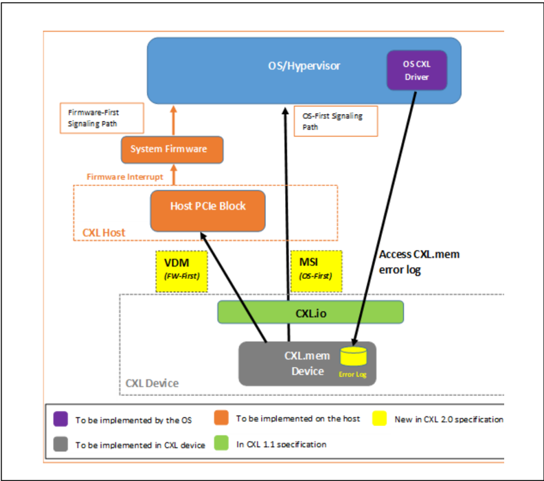

A CXL device that supports Memory Error Logging and Signaling Enhancements capability, must log such errors locally and expose the error log to system software via MMIO Mailbox ([Section 8.2.8.4.3](#82843-mailbox-capabilities-register-mailbox-registers-capability-offset-00h)). Reading an error record from the mailbox will not automatically result in deletion of the error record on the device. An explicit clear operation is required to delete an error record from the device. To support error record access and deletion, the device shall implement the Get Event Records and Clear Event Records commands.

Both operations must execute atomically. Furthermore, all writes or updates to the error records by the CXL.mem device must also execute atomically.

Using these two operations, a host can retrieve an error record as follows:

1. The host reads a number of event records using the Get Event Records command.
2. When complete, the host clears the event records from the device with the Clear Event Records command, supplying one or more event record handles to clear.

The error records will be owned by the host firmware or OS so that all logged errors are made available to the host to support platform-level RAS features.

Error records stored on the CXL device must be sticky across device resets. The records must not be initialized or modified by a hot reset or FLR or Enhanced FLR. Devices that consume auxiliary power must preserve the error records when auxiliary power consumption is enabled. In these cases, the error records are neither initialized nor modified by hot, warm, or cold reset.

##### 12.2.3.3 CXL Device Error Handling Flows

CXL 1.1 Device errors maybe sourced from a Root Port (RP) or Endpoint (RCiEP). For the purpose of differentiation RCiEP sourced errors shall use tag value of zero whereas RP sourced errors shall use tag of non-zero value. CXL 2.0 device errors may be sourced from CXL 2.0 Endpoint (EP). Errors detected by the CXL device shall be communicated to the host via PCIe Error messages across the CXL.io link. Errors that are not related to any specific Function within the device (Non-Function errors) and not reported via MSI/MSI-X are reported to the Host via PCIe error messages where they can be escalated to the platform. The UP reports non-function errors to all EPs/RCiEPs where they are logged. Each EP/RCiEP reports the non-function specific errors to the host via PCIe error messages. Software should be aware that even though an RCiEP does not have a software-visible link, it may still log link-related errors. At most one error message of a given severity is generated for a multi-function device. The error message must include the Requester ID of a function that is enabled to send the error message. Error messages with the same Requester ID may be merged for different errors with the same severity. No error message is sent if no function is enabled to do so. If different functions are enabled to send error messages of different severity, at most one error of each severity level is sent. Error generated by a CXL 1.1 RCiEP will be sent to the corresponding RCEC. Each RCiEP must be associated with no more than one RCEC. Error generated by a CXL 2.0 component will be logged in the CXL 2.0 Root Port.

### 12.3 CXL Link Down Handling

There is no expectation of a graceful Link Down. A Link Down condition will most likely result in a timeout in the Host since it is quite possible that there are transactions headed to or from the CXL device that will end up not making progress.

Software may configure CXL Downstream Port to trigger Downstream Port Containment (DPC) upon certain class of errors. eDPC may enable predictable containment in certain scenarios but would generally not be a recoverable event.

### 12.4 CXL Viral Handling

CXL links and CXL devices are expected to be Viral compliant. Viral is an error containment mechanism. A platform must choose to enable Viral at boot time. The Host implementation of Viral allows the platform to enable the Viral feature by writing into a register. Similarly, a BIOS accessible control register on the device is written to enable Viral behavior (both receiving and sending) on the device. Viral support capability and control for enabling are reflected in DVSEC.

When enabled, a Viral indication is generated whenever an Uncorrected_Fatal error is detected. Viral is not a replacement for existing error reporting mechanisms. Instead, its purpose is an additional error containment mechanism. The detector of the error is responsible for reporting the error through AER and generating a Viral indication. Any entity that is capable of reporting Uncorrected_Fatal errors must also be capable of generating a Viral indication.

CXL.mem and CXL.cache come enabled with the Viral concept. Viral needs to be communicated in both directions. When Viral is enabled and the Host runs into a Viral condition, it shall communicate Viral across CXL.mem and/or CXL.cache to all downstream components. The Viral indication must arrive before any data that may have been affected by the error (general Viral requirement). If the host receives a Viral indication from any CXL components, it shall propagate Viral to all downstream components.

All types of Conventional Resets shall clear viral condition. CXL Reset shall have no effect on viral condition. FLR shall have no effect on viral condition.

#### 12.4.1 Switch Considerations

Viral is enabled on a per vPPB basis and the expectation is that if Viral is enabled on one or more DSPs, then it will also be enabled on the USP within a VCS.

A Viral indication received on any port transitions that VCS into the Viral state but does not trigger a new uncorrected fatal error inside the switch. A Viral indication in one VCS has no effect on other VCSs within the switch component. The switch continues to process all CXL.io traffic targeting the switch and forward all traffic. All CXL.cache and CXL.mem traffic sent to all ports within the VCS is considered to have the Viral bit asserted. The Viral indication shall propagate from an input port to all output ports in the VCS faster than any subsequent CXL.mem or CXL.cache transaction. The Viral bit is propagated across upstream links and links connected to SLDs with the Viral LD-ID Vector (see [Table 54](#table-54-cxlcachecxlmem-link-layer-control-details-sheet-2-of-3)) set to zero for compatibility with CXL 1.1.

If the switch detects an uncorrected fatal error it must determine if that error affects one or multiple VCSs. Any affected VCS enters the Viral state, sets the Viral_Status bit (see [Section 8.1.3.3](#8133-dvsec-cxl-status-offset-0eh)) to indicate that a Viral condition has occurred, asserts the Viral bit in all CXL.cache and CXL.mem traffic sent to all ports within the VCS, and sends an AER message. The affected VCS continues to forward all CXL traffic.

Hot-remove and hot-add of devices below DSPs has no effect on the Viral state of the VCS within the switch.

If the switch has configured and enabled MLD ports, then there are additional considerations. When a VCS with an MLD port enters the Viral state, it propagates the Viral indication to LDs within the MLD Component by setting the Viral Bit in the Viral LD-ID Vector (see [Table 54](#table-54-cxlcachecxlmem-link-layer-control-details-sheet-2-of-3)) for the LDs in that VCS. If an uncorrected fatal error causes one or more VCSs to enter the Viral state, then the corresponding bits in LDVV shall be set. An LD within an MLD component that has entered the Viral state sets the Viral bit in CXL.mem traffic with the LDVV mask set to identify all the LD-IDs associated with all the affected VCSs. The indication from each LD-ID propagates the Viral state to all associated VCSs that have Viral containment enabled.

#### 12.4.2 Device Considerations

The device's reaction to Viral is going to be device specific but the device is expected to take error containment actions consistent with Viral requirements. Chiefly, it must prevent bad data from being committed to permanent storage. If the device is connected to any permanent storage or to an external interface that may be connected to permanent storage, then the device is required to self-isolate in order to be Viral compliant. This means that the device has to take containment actions without depending on help from the Host.

The containment actions taken by the device must not prevent the Host from making forward progress. This is important for diagnostic purposes as well as avoiding error pollution (e.g., withholding data for read transactions to device memory may cause cascading timeouts in the Hosts). Therefore, on Viral detection, in addition to the containment requirements, the device shall:

- Drop writes to the persistent HDM ranges on the device or connected to the device.
- Completion response must always be returned.
- Set MetaField to No-op in all read responses.
- Fail the Set Shutdown State command (defined in Section 8.2.9.5.3.5) with an Internal Error when attempting to change the state from 'dirty' to 'clean'.
- Not transition the Shutdown State to 'clean' after a GPF flow.
- Commit to the persistent HDM ranges any writes that were completed over the CXL interface before receipt of the viral.
- Keep responding to snoops.
- Complete pending writes to Host memory.
- Complete all reads and writes to Device volatile memory.

When the device itself runs into a Viral condition and Viral is enabled, it shall:

- Set the Viral Status bit to indicate that a Viral condition has occurred
- Containment - Take steps to contain the error within the device (or logical device in an MLD component) and follow the Viral containment steps listed above.
- Communicate the Viral condition back up CXL.mem and CXL.cache towards the Host.
    - Viral propagates to all devices in the Virtual Hierarchy including the host.

Viral Control and Status bits are defined in DVSEC (please refer to [Section 8.0](#80-control-and-status-registers), 'Control and Status Registers'  for details).

### 12.5 CXL Error Injection

The major aim of error injection mechanisms is to allow system validation and system FW/software development etc. the means to create error scenarios and error handling flows. To this end, CXL UP and DP are recommended to implement the following error injection hooks to a specified address (where applicable):

- One type of CXL.io UC error (optional - similar to PCIe).
- CXL.io is always present in any CXL connection
- One type of CXL.mem UC error (if applicable)
- One type of CXL.cache UC error (if applicable)
- Link Correctable errors
- Transient mode and
- Persistent mode
- Returning Poison on a read to a specified address (CXL.mem only)

Error injection interfaces are documented in the Compliance chapter.

## 13.0 Performance Considerations

Compute Express Link (CXL) provides a low-latency, high-bandwidth path for an accelerator to access the system. Performance on CXL is dependent on a variety of factors. The following table captures the key performance attributes of CXL.

| Characteristic             | Compute Express Link via Flex Bus (if Gen 4)   | Compute Express Link via Flex Bus (if Gen 5)   |
|----------------------------|------------------------------------------------|------------------------------------------------|
| Width                      | 16 Lanes                                       | 16 Lanes                                       |
| Link Speed                 | 16 GT/s                                        | 32 GT/s                                        |
| Total Bandwidth per link [1] | 32 GB/s                                        | 64 GB/s                                        |

1. Achieved bandwidth depends on protocol and payload size. Expect 60-90% efficiency on CXL.cache and CXL.mem. Efficiency similar to PCIe on CXL.io.

In general, it is expected that the downstream-facing port and the upstream-facing ports are rate-matched. However, if the implementations are not rate-matched, it would require the faster of the implementations to limit the rate of its protocol traffic to match the slower (including bursts), whenever there is no explicit flow-control loop.

CXL allows accelerators/devices to coherently access host memory and allows memory attached to an accelerator/device to be mapped into the system address map and accessed directly by the host as writeback memory. In order to support this, it supports a Bias-based Coherency model as described in [Section 2.2.1](#221-bias-based-coherency-model). There are specific performance considerations to take into account for selecting the method for mode management. This is addressed in [Section 2.2.1.3](#2213-mode-management).

Note: On CXL.cache, in order to ensure system performance is not negatively impacted, it is recommended that the maximum latency for a snoop-miss is 50ns from H2D snoop request seen on the CXL pins to a D2H snoop-response back at the CXL pins. Similarly, the maximum latency for a H2D Wr_Pull response to D2H Data response is 40ns.

Note: On CXL.mem, in order to ensure system performance is not negatively impacted, it is recommended that the maximum latency for a memory read is 80ns from M2S Req seen on the CXL pins to a S2M DRS back at the CXL pins. Similarly, the maximum latency for a M2S RwD to S2M NDR is 40ns. The latency budgets mentioned here are for HBM or DDR type memory technologies. If a slower memory technology is used, and the above targets cannot be met, the device and Host may need to provision for special QoS in order to ensure that the rest of the system is not negatively affected. These QoS mechanisms are outside the scope of this specification.

## 14.0 CXL Compliance Testing

Note: The newly introduced features included in CXL 2.0, release revision will be addressed for the compliance chapter through the use of ECNs against the CXL 2.0 specification.

### 14.1 Applicable Devices Under Test (DUTs)

The tests outlined in this chapter are applicable to all devices that support alternate protocol negotiation and are capable of CXL only or CXL and PCIe protocols. The tests are broken into the different categories corresponding to the different chapters of CXL specification, starting with Chapter 3.0.

### 14.2 Starting Configuration/Topology (Common for All Tests)

In most tests, the initial conditions assumed are as follows (deviations from these conditions are pointed out in specific tests, if applicable):

System is powered on, running in test environment OS, device specific drivers have loaded on device, and link has trained to supported CXL modes. All error status registers should be clear on the device under test.

Some tests make assumptions about only one CXL device present in the system - this is called out in relevant tests. If nothing is mentioned, there is no limit on the number of CXL devices present in the system, however, the number of DUTs is limited to what the test software can support.

Certain tests may also require the presence of a protocol analyzer to monitor flits on the physical link for determining Pass or Fail results.

#### Figure 185. Example Test Topology

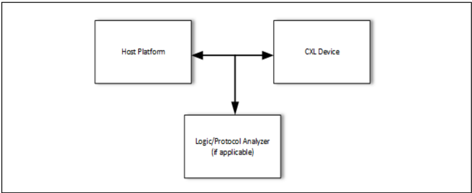

Each category of tests has certain device capability requirements in order to exercise the test patterns. The associated registers and programming is defined in the following sections.

Refer to [Section 14.16](#1416-device-capability-and-test-configuration-control), 'Device Capability and Test Configuration Control' for registers applicable to tests in the following sections.

#### 14.2.1 Test Topologies

Some tests may require a specific topology in order to achieve the desired requirements. Throughout this chapter there will be references to these topologies as required. This section of the document will describe these topologies at a high level in order to provide context for the intended test configuration.

##### 14.2.1.1 Single Host, Direct Attached SLD EP (SHDA)

[Figure 186](#figure-186-example-shda-topology) is the most direct connected topology between a root port and an endpoint device.

###### Figure 186. Example SHDA Topology

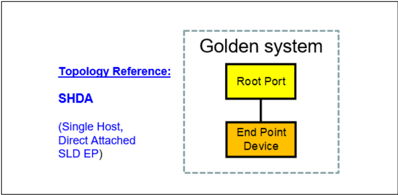

##### 14.2.1.2 Single Host, Switch Attached SLD EP (SHSW)

Figure 187 is the initial configuration for utilizing a CXL capable switch in the test configurations.

###### Figure 187. Example Single Host, Switch Attached, SLD EP (SHSW) Topology

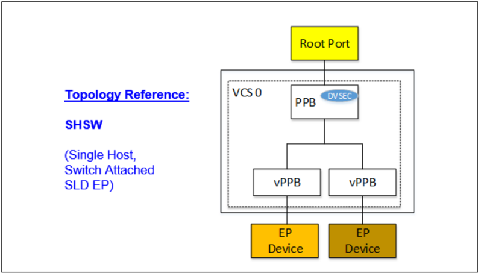

##### 14.2.1.3 Single Host, Fabric Managed, Switch Attached SLD EP (SHSW-FM)

Figure 188 shows the configuration which will utilize the fabric manager as part of the test configuration.

###### Figure 188. Example SHSW-FM Topology

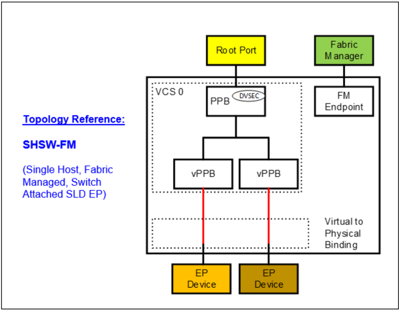

##### 14.2.1.4 Dual Host, Fabric Managed, Switch Attached SLD EP (DHSW-FM)

Figure 189 shows an example configuration topology for having dual hosts during a test.

###### Figure 189. Example DHSW-FM Topology

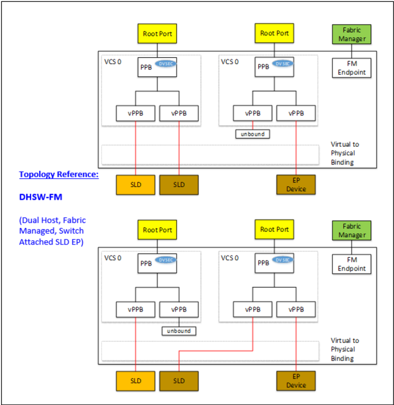

##### 14.2.1.5 Dual Host, Fabric Managed, Switch Attached MLD EP (DHSW-FM-MLD)

Figure 190 shows the topology for having dual hosts in a managed environment with multiple logical devices.

###### Figure 190. Example DHSW-FM-MLD Topology

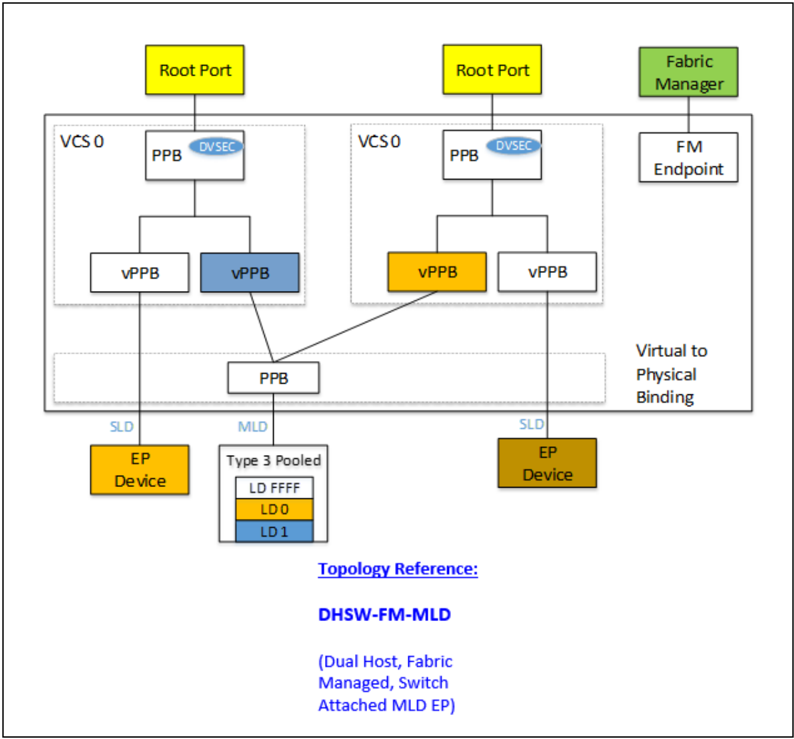

### 14.3 CXL.cache and CXL.io Application Layer/Transaction Layer Testing

#### 14.3.1 General Testing Overview

Standard practices of testing coherency rely on 'false sharing' of cachelines. Different agents in the system (cores, I/O etc.) are assigned one or more fixed byte locations within a shared set of cachelines. Each agent continuously executes an assigned Algorithm independently. Since multiple agents are sharing the same cacheline, stressful conflict scenarios can be exercised. Figure 191 illustrates the concept of false sharing. This can be used for CXL.io (Load/Store semantics) or CXL.cache (caching semantics) or (CXL.cache + CXL.mem) devices (Type 2 devices).

##### Figure 191. Representation of False Sharing Between Cores (on Host) and CXL Devices

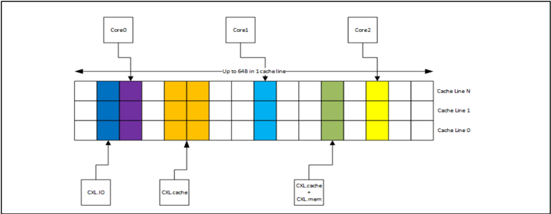

This document outlines three Algorithms that enable stressing the system with false sharing tests. In addition, this document specifies the required device capabilities to execute, verify and debug runs for the Algorithms. All of the Algorithms are applicable for CXL.io and CXL.cache (protocols that originate requests to the host). Devices are permitted to be self-checking. Self-checking devices must have a way to disable the checking Algorithm independent of executing the Algorithm. All devices must support the non-self-checking flow in the Algorithms outlined below. The algorithms presented for false sharing require co-ordination with the cache on the device (if present). Hence, it may add certain responsibility on the application layer if the cache resides there.

#### 14.3.2 Algorithms

#### 14.3.3 Algorithm 1a: Multiple Write Streaming

In this Algorithm, the device is setup to stream an incrementing pattern of writes to different sets of cachelines. Each set of cacheline is defined by a base address 'X', and an increment address 'Y'. Increments are in multiples of 64B. The number of increments 'N' dictates the size of the set beginning from base address X. The base address includes the byte offset within the cacheline. A pattern P (of variable length in bytes) determines the starting pattern to be written. Subsequent writes in the same set increment P. A device is required to provide a byte mask configuration capability that can be programmed to replicate pattern P in different parts of the cacheline. The programmed byte masks must be consistent with the base address.

Different sets of cachelines are defined by different base addresses (so a device may support a set like 'X 1 , X 2 , X 3 '). 'X 1 ' is programmed by software in the base address register, X 2  is obtained by adding a fixed offset to X 1  (offset is programmed by software in a different register).X 3  is obtained by adding the same offset to X 2  and so on. Minimum support of 2 sets is required by the device. Figure 192 illustrates the flow of this Algorithm as implemented on the device. Address Z is the write back address where system software can poll to verify the expected pattern associated with this device, in cases where self-checking on the device is disabled. There is 1:1 correspondence between X and Z. It is the responsibility of the device to ensure that the writes in the execute phase are globally observable before beginning the verify phase. Depending on the write semantics used, this may imply additional fencing mechanism on the device to make sure the writes are visible globally before the verify phase can begin. When beginning a new set iteration, devices must also give an option to use 'P' again for the new set, or continue incrementing 'P' for the next set. The select is programmed by software in 'PatternParameter' field described in the register section.

##### Figure 192. Flow Chart of Algorithm 1a

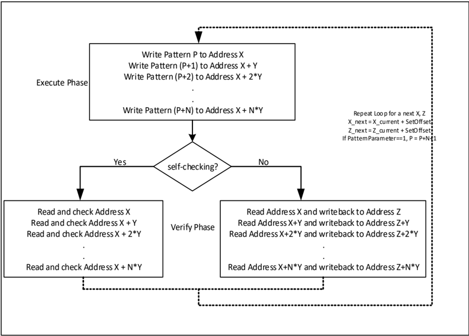

#### 14.3.4 Algorithm 1b: Multiple Write Streaming with Bogus Writes

This Algorithm is a variation on Algorithm 1a, except that before writing the expected pattern to an address, the device does 'J' iterations of writing a bogus pattern 'B' to that address. Figure 193 illustrates this Algorithm. In this case, if ever a pattern 'B' is seen in the cacheline during the Verify phase, it is a Fail condition. The bogus writes help give a longer duration of conflicts in the system. It is the responsibility of the device to ensure that the writes in the execute phase are globally observable before beginning the verify phase. Depending on the write semantics used, this may imply additional fencing mechanism on the device to make sure the writes are visible globally before the verify phase can begin. When beginning a new set iteration, devices must also give an option to use 'P' again for the new set, or continue incrementing 'P' for the next set. The select is programmed by software in 'PatternParameter' field described in the register section.

##### Figure 193. Flow Chart of Algorithm 1b

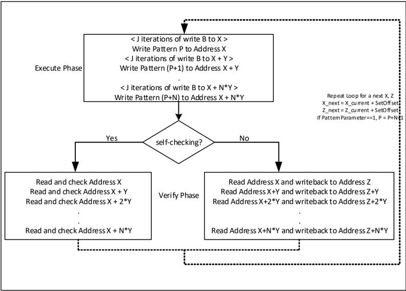

#### 14.3.5 Algorithm 2: Producer Consumer Test

This Algorithm aims to test the scenario where a Device is a producer and the CPU is a consumer. Device simply executes a pre-determined Algorithm of writing known patterns to a data location followed by a flag update write. Threads on the CPU poll the flag followed by reading the data patterns, followed by polling the flag again. This is a simple way of making sure the required ordering rules of producer consumer workloads are being followed through the stack. Device only participates in the execute phase of this Algorithm. [Figure 194](#figure-194-execute-phase-for-algorithm-2) illustrates the device execute phase. The Verify phase is run on the CPU, software reads addresses in the following order [F, X, (X+Y)…(X+N*Y), F]. Knowing the value of the flag at two ends, the checker knows the range in which [X, (X+Y)…(X+N*Y)] have to be in. For example, if P=0, the first read of F returns a value of 3 and the next read of F returns a value of 4, then checker knows that all intermediate values have to be either 3 or 4. Moreover, if the device is using strongly ordered semantics, then the checker should never see a transition of values from 3 to 4 (implying monotonically decreasing values for the non-flag addresses). If using CXL.cache protocol, device must ensure global observability of previous 'data' writes before updating the flag. When using strongly ordered semantics, each update must be globally visible before the next one. Depending on the flow used for dirty evicts, this can be implementation specific. It is the responsibility of the device to ensure that the writes in the execute phase are globally observable before updating the flag 'F'. The 'PatternParameter' field is not relevant for this Algorithm.

##### Figure 194. Execute Phase for Algorithm 2

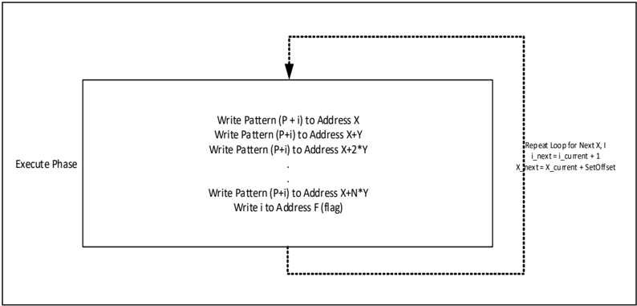

#### 14.3.6 Test Descriptions

##### 14.3.6.1 Application Layer/Transaction Layer Tests

The Transaction Layer Tests implicitly give coverage for Link Layer functionality. Specific error injection cases for the Link Layer are covered in the RAS section.

###### 14.3.6.1.1 CXL.io Load/Store Test

For CXL.io, this test and associated capabilities are optional but strongly recommended. This test sets up the device to execute Algorithm 1a, 1b and 2 in succession in order to stress data path for CXL.io transactions. Configuration details are determined by the host platform testing the device. Refer to [Section 14.16](#1416-device-capability-and-test-configuration-control) for the configuration registers and device capabilities. Each run includes execute/verify phases as described in [Section 14.3.1](#1431-general-testing-overview).

Test Steps:
1. Host software will setup Device for Algorithm 1a: Multiple Write Streaming
2. If the device supports self-checking, enable it
3. Host software decides test run time and runs test for that period of time (The software details of this are host platform specific, but will be compliant with the flows mentioned in [Section 14.3.1](#1431-general-testing-overview) and follow configurations outlined in [Section 14.16](#1416-device-capability-and-test-configuration-control)).
4. Setup Device for Algorithm 1b: Multiple Write Streaming with Bogus writes
5. If the device supports self-checking, enable it
6. Host software decides test run time and runs test for that period of time
7. Setup Device for Algorithm 2: Producer Consumer Test
8. Host software decides test run time and runs test for that period of time

Required Device Capability:

Hardware and configuration support for Algorithms 1a, 1b and 2 described in [Section 14.3.1](#1431-general-testing-overview) and [Section 14.16](#1416-device-capability-and-test-configuration-control). If a device supports self-checking, it must escalate fatal system error if Verify phase fails. Refer to [Section 12.2](#122-cxl-error-handling) for specific error escalation mechanisms. Device is permitted to log failing address, iteration number and/or expected vs received data.

Pass Criteria:
No data corruptions or system errors reported

Fail Criteria:
Data corruptions or system errors reported

###### 14.3.6.1.2 CXL.cache Coherency Test

This test sets up the Device and Host to execute Algorithm 1a, 1b and 2 in succession in order to stress data path for CXL.cache transactions. This test should only be run if the Device and Host support CXL.cache or CXL.cache + CXL.mem protocols. Configuration details are determined by the host platform testing the device. Refer to [Section 14.16](#1416-device-capability-and-test-configuration-control) for the configuration registers and device capabilities. Each run includes execute/verify phases as described in [Section 14.3.1](#1431-general-testing-overview). ATS capabilities of the device can also be exercised in this test (see 'AddressIsVirtual' field in [Table 268](#table-268-register-7-algorithmconfiguration-offset-30h-sheet-2-of-2)).

Test Steps:
1. Host software will setup Device and Host for Algorithm 1a: Multiple Write Streaming. An equivalent version of the algorithm is setup to be executed by Host software so as to enable false sharing of the cachelines.
2. If the Device supports self-checking, enable it
3. Host software decides test run time and runs test for that period of time (The software details of this are host platform specific, but will be compliant with the flows mentioned in [Section 14.3.1](#1431-general-testing-overview) and follow configurations outlined in [Section 14.16](#1416-device-capability-and-test-configuration-control))
4. Setup Device for Algorithm 1b: Multiple Write Streaming with Bogus writes.
5. If the device supports self-checking, enable it.
6. Host software decides test run time and runs test for that period of time.
7. Setup Device for Algorithm 2: Producer Consumer Test.
8. Host software decides test run time and runs test for that period of time.

Required Device Capabilities:

Hardware and configuration support for Algorithms 1a, 1b and 2 described in [Section 14.3.1](#1431-general-testing-overview) and [Section 14.16](#1416-device-capability-and-test-configuration-control). If a device supports self-checking, it must escalate fatal system error if Verify phase fails. Refer to [Section 12.2](#122-cxl-error-handling) for specific error escalation mechanisms. Device is permitted to log failing address, iteration number and/or expected vs received data.

Pass Criteria:
No data corruptions or system errors reported

Fail Criteria:
Data corruptions or system errors reported

###### 14.3.6.1.3 CXL Test for Receiving Go_ERR

This test is only applicable for devices that support CXL.cache protocols. This test sets up the device to execute Algorithm 1a, while mapping one of the sets of the address to a memory range not accessible by the device. Test system software and configuration details are determined by the host platform and are system specific.

Test Steps:
1. Configure device for Algorithm 1a, and setup one of the base addresses to be an address not accessible by the device under test
2. Disable self-checking in the device under test
3. Host software decides test run time and runs test for that period of time

Required Device Capability:

Support for Algorithm 1a

Pass Criteria:
1. No data corruptions or system errors reported
2. No fatal device errors on receiving Go-ERR
3. Inaccessible memory range has not been modified by the device

Fail Criteria:
1. Data corruptions or system errors reported
2. Fatal device errors on receiving Go-ERR
3. Inaccessible memory range modified by the device (Host Error)

###### 14.3.6.1.4 CXL.mem Test

This test sets up the Host and Device to execute Algorithm 1a, 1b and 2 in succession in order to stress data path for CXL.mem transactions. An equivalent version of the algorithm is setup to be executed by Host software so as to enable false sharing of the cachelines. Test system software and configuration details are determined by the host platform and are system specific.

Test Steps:
1. Map device attached memory to a test memory range accessible by the Host
2. Run equivalent of Algorithm 1a, 1b and 2 on the Host and Device targeting device attached memory

Required Device Capability:

Support for CXL.mem protocol

Pass Criteria:
No data corruptions or system errors reported

Fail Criteria:
Data corruptions or system errors reported

### 14.4 Link Layer Testing

#### 14.4.1 RSVD Field Testing CXL.cache/CXL.mem (Requires Exerciser)

The initial conditions for this test assume that the CXL link is up.

This test-case will check the following conditions:

- Condition1: Proper link initialization occurs, only one Control-INIT .Param is sent after a valid CRC clean flit is received.
- Condition2: Device ignores RSVD fields

##### 14.4.1.1 Device Test

Test Steps

1. Send Link Layer Control-INIT.Param with all RSVD fields set to 1
2. Wait for Control-INIT.Param from device
3. Wait for Link to reach L0 state and Device is in configured state
4. Check that correctable or uncorrectable errors are not logged

Pass Criteria

- Completes link layer initialization
- Link Initialization follows Condition1
- No errors reported in error fields

##### 14.4.1.2 Host Test

Test Steps

1. Send Link Layer Control-INIT.Param with all RSVD fields set to 1
2. Wait for Link to reach L0 state

Pass Criteria

- Completes link layer initialization

#### 14.4.2 CRC Error Injection RETRY_PHY_REINIT (Protocol Analyzer Required)

Required Device Capabilities:

- The CXL Host must support Algorithm 1a, and Link Layer Error Injection capabilities for CXL.Cache

Test Steps:
1. Setup is same as Test 14.3.6.1.2.
2. While test is running, software will repeat the following error injection for at least MAX_NUM_RETRY times:

### Table 225. Cache CRC Injection Request

| Data Object Byte Offset   |   Length | Description                 | Value            |
|---------------------------|----------|-----------------------------|------------------|
| 0h                        |        8 | Standard DOE Request Header |                  |
| 8h                        |        1 | Request Code                | 7, CRC Injection |
| 9h                        |        1 | Version                     | 2                |
| 0Ah                       |        2 | Reserved                    |                  |
| 0Ch                       |        1 | Protocol                    | 2                |
|                           |          | Num Bits Flipped            | 1                |
|                           |          | Num Flits Injected          | 1                |

Pass Criteria:
- Same as Test 14.3.6.1.2
- Monitor and Verify that CRC errors are injected (using the Protocol Analyzer), and that Retries are triggered as a result.
- Five Retry.Frame Flits are sent before REtry.Req and Rety.ACK (protocol analyzer)
- Check that link enters RETRY_PHY_REINIT

Fail Criteria:
- Same as Test 14.3.6.1.2
- Link does not reach RETRY_PHY_REINIT

#### 14.4.3 CRC Error Injection RETRY_ABORT (Protocol Analyzer Required)

Required Device Capabilities:

- The CXL device must support Algorithm 1a, and Link Layer Error Injection capabilities for CXL.Cache.

Test Steps:
Setup is same as 15.4.6 Host to Device CRC Error Injection RETRY_PHY_REINIT

1. While test is running, software will repeat the following error injection for at least ( MAX_NUM_RETRY x MAX_NUM_PHY_REINIT ) times:

### Table 226. Cache CRC Injection Request

| Data Object Byte Offset   |   Length | Description                 | Value            |
|---------------------------|----------|-----------------------------|------------------|
| 0h                        |        8 | Standard DOE Request Header |                  |
| 8h                        |        1 | Request Code                | 7, CRC Injection |
| 9h                        |        1 | Version                     | 2                |
| 0Ah                       |        2 | Reserved                    |                  |
| 0Ch                       |        1 | Protocol                    | 2                |
|                           |          | Num Bits Flipped            | 1                |
|                           |          | Num Flits Injected          | 1                |

Pass Criteria:
- Same as Test 14.3.6.1.2
- Monitor and Verify that CRC errors are injected (using the Protocol Analyzer), and that Retries are triggered as a result.
- Five Retry.Frame Flits are sent before Retry.Req and Retry.ACK (protocol analyzer).
- Link retrains for MAX_NUM_PHY_REINIT number of times and fails to recover.

Fail Criteria:
- Same as Test 14.3.6.1.2
- Link does not reach RETRY_PHY_REINIT.
- Link does not reach RETRY_ABORT.

### 14.5 ARB/MUX

#### 14.5.1 Reset to Active Transition (Requires Protocol Analyzer)

The initial conditions for this test do not assume that the CXL link is up and device drivers have been loaded.

Test Steps:
1. With the link in Reset state, Link layer sends a Request to enter Active.
2. ARB/MUX waits to receive indication of Active from Physical Layer.

Pass Criteria:
- ALMP Status sync exchange completes before ALMP Request{Active} sent by Local ARB/MUX (if applicable).
- Local ARB/MUX sends ALMP Request{Active} to the remote ARB/MUX.
- Validate the first ALMP packet on the initial bring up is from the Downstream Port to Upstream Port.
- Local ARB/MUX waits for ALMP Status{Active} and ALMP Request{Active} from remote ARB/MUX.
- Local ARB/MUX sends ALMP Status{Active} in response to Request.
- Once ALMP handshake is complete, link transitions to Active.
- Link successfully enters Active state with no errors.

Fail Criteria:
- Link hangs and does not enter Active state
- Any error occurs before transition to Active

#### 14.5.2 ARB/MUX Multiplexing (Requires Protocol Analyzer)

Test Requirements:
Host generated traffic or device generated traffic and support for Algorithm 1a, 1b or 2. Analyzer is used to ensure traffic is sent simultaneously on both CXL.io/CXL.cache/ mem

Test Steps:
1. Bring the link up into multi-protocol mode with CXL.io and CXL.cache and/or CXL.mem enabled
2. Ensure the arbitration weight is a non-zero value for both interfaces
3. Send continuous traffic on both CXL.io and CXL.cache and/or CXL.mem using Algorithm 1a, 1b or 2
4. Allow time for traffic transmission while snooping the bus

Pass Criteria:
- Data from both CXL.io and CXL.cache and/or CXL.mem are sent across the link by the ARB/MUX

Fail Criteria:
- Data on the link is only CXL.io
- Data on the link is only CXL.cache or CXL.mem (cache and mem share a single protocol ID, see [Table 64](#table-64-flex-buscxl-protocol-ids-sheet-2-of-2), 'Flex Bus.CXL Protocol IDs' on page 182)

#### 14.5.3 Active to L1.x Transition (If Applicable) (Requires Protocol Analyzer)

Test Requirements:
Support for ASPM L1

Test Steps:
1. Force the remote and local link layer to send a request to the ARB/MUX for L1.x state
2. This test should be run separately for each Link Layer independently (to test one Link Layer's L1 entry while the other Link Layer is in ACTIVE), as well as both Link Layers concurrently requesting L1 entry.

Pass Criteria:
- UP ARB/MUX sends ALMP Request{L1.x}
- DP ARB/MUX sends ALMP Status{L1.x} in response
- Once ALMP Status is received by local ARB/MUX, L1.x is entered
- State transition doesn't occur until ALMP handshake is completed
- LogPHY enters L1 ONLY after both Link Layers enter L1 (applies to multi-protocol mode only)

Fail Criteria:
- Error in ALMP handshake
- Protocol layer packets sent after ALMP L1.x handshake is complete (Requires Protocol Analyzer)
- State transition occurs before ALMP handshake completed

#### 14.5.4 L1.x State Resolution (If Applicable) (Requires Protocol Analyzer)

Test Requirements:
Support for ASPM L1

Test Steps:
1. Force the remote and local link layer to send a request to the ARB/MUX for different L1.x states.

Pass Criteria:
- UP ARB/MUX sends ALMP Request{L1.x} according to what the link layer requested
- DP ARB/MUX sends ALMP Status{L1.y} response. The state in the Status ALMP is the more shallow L1.y state.
- Once ALMP Status is received by local ARB/MUX, L1.y is entered
- State transition doesn't occur until ALMP handshake is completed
- LogPHY enters L1 ONLY after both protocols enter L1 (applies to multi-protocol mode only)

Fail Criteria:
- Error in ALMP handshake
- Protocol layer packets sent after ALMP L1.x handshake is complete (Requires Protocol Analyzer)
- State transition occurs before ALMP handshake completed

#### 14.5.5 Active to L2 Transition (Requires Protocol Analyzer)

Test Steps:
1. Force the remote and local link layer to send a request to the ARB/MUX for L2 state

Pass Criteria:
- UP ARB/MUX sends ALMP Request{L2} to the remote vLSM
- DP ARB/MUX waits for ALMP Status{L2} from the remote vLSM
- Once ALMP Status is received by local ARB/MUX, L2 is entered
- If there are multiple link layers, repeat the above steps for all link layers
- Physical link enters L2
- vLSM and physical link state transitions don't occur until ALMP handshake is completed

Fail Criteria:
- Error in ALMP handshake
- Protocol layer packets sent after ALMP L2 handshake is complete (Requires Protocol Analyzer)
- State transition occurs before ALMP handshake completed

#### 14.5.6 L1 to Active Transition (If Applicable)

Test Requirements:
Support for ASPM L1

Test Steps:
1. Bring the link into L1 State
2. Force the link layer to send a request to the ARB/MUX to exit L1

Pass Criteria:
- Local ARB/MUX sends L1 exit notification to the Physical Layer
- Link exits L1
- Link enters L0 correctly
- Status synchronization handshake completes before request to enter L0

Fail Criteria:
- State transition does not occur

#### 14.5.7 Reset Entry

Test Steps:
1. Initiate warm reset flow

Pass Criteria:
- Link sees hot reset and transitions to Detect state

Fail Criteria:
- Link does not enter Detect

#### 14.5.8 Entry into L0 Synchronization (Requires Protocol Analyzer)

Test Steps:
1. Put the link into Retrain state
2. After exit from Retrain, check Status ALMPs to synchronize interfaces across the link

Pass Criteria:
- State contained in the Status ALMP is the same state the link was in before entry to retrain

Fail Criteria:
- No Status ALMPs sent after exit from Retrain
- State in Status ALMPs different from the state that the link was in before the link went into Retrain
- Other communication occurred on the link after Retrain before the Status ALMP handshake for synchronization completed

#### 14.5.9 ARB/MUX Tests Requiring Injection Capabilities

The tests in this section are optional but strongly recommended. The test configuration control registers for the tests in this section are implementation specific.

##### 14.5.9.1 ARB/MUX Bypass (Requires Protocol Analyzer)

Test Requirements:
Device capability to force a request ALMP for any state

Test Steps:
1. Put the Link into PCIe only mode
2. Trigger entry to Retrain State
3. Snoop the bus and check for ALMPs

Pass Criteria:
- No ALMPs generated by the ARB/MUX

Fail Criteria:
- ALMP seen on the bus when checked

##### 14.5.9.2 PM State Request Rejection (Requires Protocol Analyzer)

Test Requirements:
Host capability to put the host into a state where it will reject any PM request ALMP

Test Steps:
1. Upstream port sends PM state Request ALMP
2. Wait for an ALMP Request for entry to a PM State
3. Downstream Port rejects the request by not responding to the Request ALMP
4. After a certain time (determined by the test), the Upstream Port aborts PM transition on its end and sends transactions to the Downstream Port.

Pass Criteria:
- Upstream Port continues operation despite no Status received and initiates an Active Request

Fail Criteria:
- Any system error

##### 14.5.9.3 Unexpected Status ALMP

Test Requirements:
Device Capability to force the ARB/MUX to send a Status ALMP at any time

Test Steps:
1. While link is in Active, force the ARB/MUX to send a Status ALMP without first receiving a Request ALMP

Pass Criteria:
- Link enters Retrain without any errors reported

Fail Criteria:
- No error on the link and normal operation continues OR
- System errors are observed

##### 14.5.9.4 ALMP Error

Test Requirements:
Device capability that allows the device to inject errors into a flit

Test Steps:
1. Inject a single bit error into the lower 16 bytes of a 528-bit flit
2. Send data across the link
3. ARB/MUX detects error and enters Retrain
4. Repeat Steps 1-3 with a double bit error

Pass Criteria:
- Error is logged
- Link enters retrain

Fail Criteria:
- No error detected

##### 14.5.9.5 Recovery Re-entry

Test Requirements:
Device capability that allows the device to ignore ALMP State Requests

Test Steps:
1. Place the link into Active state
2. Request link to go to Retrain State
3. Prevent the Local ARB/MUX from entering Retrain
4. Remote ARB/MUX enters Retrain state
5. Remote ARB/MUX exits Retrain state and sends ALMP Status{Active} to synchronize
6. Local ARB/MUX receives Status ALMP for synchronization but does not send
7. Local ARB/MUX triggers re-entry to Retrain

Pass Criteria:
- Link successfully enters Retrain on re-entry attempt

Fail Criteria:
- Link continues operation without proper synchronization

### 14.6 Physical Layer

#### 14.6.1 Protocol ID Checks (Requires Protocol Analyzer)

Test Steps:
1. Bring the link up to the Active state
2. Send one or more flits from the CXL.io interface, check for correct Protocol ID
3. If applicable, send one or more flits from the CXL.cache and/or CXL.mem interface, check for correct Protocol ID
4. Send one or more flits from the ARB/MUX, check for correct Protocol ID

Pass Criteria:
- All Protocol IDs are correct

Fail Criteria:
- Errors during test
- No communication

#### 14.6.2 NULL Flit (Requires Protocol Analyzer)

Test Steps:
1. Bring the link up to the Active state
2. Delay flits from the Link Layer
3. Check for NULL flits from the Physical Layer
4. Check that NULL flits have correct Protocol ID

Pass Criteria:
- NULL flits seen on the bus when Link Layer delayed
- NULL flits have correct Protocol ID
- NULL flits contain all zero data

Fail Criteria:
- No NULL flits sent from Physical Layer
- Errors logged during tests in the CXL DVSEC Port Status Register

#### 14.6.3 EDS Token (Requires Protocol Analyzer)

Test Steps:
1. Bring the link up to the Active state
2. Send a flit with an implied EDS token, check the following:

Pass Criteria:
- A flit with an implied EDS token is the last flit in the data block
- Next Block after a flit with an implied EDS token is an ordered set
- OS block follows the data block that contains a flit with implied EDS token

Fail Criteria:
- Errors logged during test

#### 14.6.4 Correctable Protocol ID Error

This test is optional but strongly recommended.

Test Requirements:
Requires Protocol Analyzer

Test Steps:
1. Bring the link up to the Active state
2. Create a correctable Protocol ID framing error by injecting an error into one 8-bit encoding group of the Protocol ID such that the new 8b encoding is invalid.
3. Check that an error was logged and normal processing continues

Pass Criteria:
- Error correctly logged in DVSEC Flex Bus Port Status register
- Correct 8-bit encoding group used for normal operation

Fail Criteria:
- No error logged
- Flit with error dropped
- Error causes retrain
- Normal operation does not resume after error

#### 14.6.5 Uncorrectable Protocol ID Error

This test is optional but strongly recommended.

Test Requirements:
Requires Protocol Analyzer

Test Steps:
1. Bring the link up to the Active state
2. Create a uncorrectable framing error by injecting an error into both 8-bit encoding groups of the Protocol ID such that both 8b encodings are invalid.
3. Check that an error was logged and flit is dropped
4. Link goes into Retrain

Pass Criteria:
- Error correctly logged in DVSEC Flex Bus Port Status Register
- Link enters Retrain

Fail Criteria:
- No error logged in DVSEC Flex Bus Port Status Register

#### 14.6.6 Unexpected Protocol ID

This test is optional but strongly recommended.

Test Requirements:
Requires Protocol Analyzer

Test Steps:
1. Bring the link up to the Active state
2. Send a flit with an unexpected protocol ID
3. Check that an error is logged and the flit is dropped
4. Link goes into Retrain

Pass Criteria:
- Error correctly logged in DVSEC Flex Bus Port Status Register
- Link Enters Retrain

Fail Criteria:
- No Error logged in DVSEC Flex Bus Port Status Register

#### 14.6.7 Sync Header Bypass (Requires Protocol Analyzer) (If Applicable)

Test Requirements:
Support for Sync Header Bypass

Test Steps:
1. Negotiate for sync header bypass during PCIe alternate mode negotiation
2. Link trains to 2.5GT/s speed
3. Transition to each of the device supported speeds - 8GT/s, 16 GT/s, 32GT/s
4. Check for Sync Headers

Pass Criteria:
- No Sync Headers observed after 8GT/s transition

Fail Criteria:
- Link training not complete
- Sync headers are observed at 8GT/s speed or higher
- All conditions specified in [Table 70](#table-70-rules-of-enable-low-latency-mode-features) are not met while no Sync Headers are observed

#### 14.6.8 Link Speed Advertisement (Requires Protocol Analyzer)

Test Steps:
1. Enter CXL link training at 2.5GT/s
2. Check speed advertisement before alternate protocol negotiations have completed, i.e., LTSSM enters Configuration.Idle with LinkUp=0 at 2.5GT/s

Pass Criteria:
- Advertised CXL speed is 32GT/s until Configuration.Complete state is exited.

Fail Criteria:
- Speed advertisement is not 32GT/s

#### 14.6.9 Recovery.Idle/Config.Idle Transition to L0 (Requires Protocol Analyzer)

Test Steps:
1. Bring the link up in CXL mode to the Config.Idle or Recovery.Idle state
2. Wait for NULL flit to be received by DUT
3. Check that DUT sends NULL flits after receiving NULL flits

Pass Criteria:
- LTSSM transitions to L0 after 8 NULL flits are sent and at least 4 NULL flits are received

Fail Criteria:
- LTSSM stays in IDLE
- LTSSM transitions before the exchange of NULL flits is completed

#### 14.6.10 Drift Buffer (If Applicable)

Test Requirements:
Support Drift Buffer

Test Steps:
1. Enable the Drift buffer

Pass Criteria:
- Drift buffer is logged in the Flex Bus DVSEC

Fail Criteria:
- No log in the Flex Bus DVSEC

#### 14.6.11 SKP OS Scheduling/Alternation (Requires Protocol Analyzer) (If Applicable)

Test Requirements:
Support Sync Header Bypass

Test Steps:
1. Bring the link up in CXL mode with sync header bypass enabled
2. Check for SKP OS

Pass Criteria:
- Physical Layer schedules SKP OS every 340 data blocks
- Control SKP OS and regular SKP OS alternate at 16GT/s or higher speed
- Regular SKP OS used only at 8GT/s

Fail Criteria:
- No SKP OS observed
- SKP OS observed at interval other than 340 data blocks

#### 14.6.12 SKP OS Exiting the Data Stream (Requires Protocol Analyzer) (If Applicable)

Test Requirements:
Support Sync Header Bypass

Test Steps:
1. Bring the link up in CXL mode with sync header bypass enabled
2. Exit Active mode

Pass Criteria:
- Physical Layer replaces SKP OS with EIOS or EIEOS

Fail Criteria:
- SKP OS not replaced by Physical Layer

#### 14.6.13 Link Speed Degradation - CXL Mode

Test Steps:
1. Train the CXL link up to the highest speed possible (At least 16GT/s)
2. Degrade the link down to a lower CXL mode speed

Pass Criteria:
- Link degrades to slower speed without going through mode negotiation

Fail Criteria:
- Link leaves CXL mode

#### 14.6.14 Link Speed Degradation Below 8GT/s

Test Steps:
1. Train the CXL link up to the highest speed possible (At least 8GT/s)
2. Degrade the link down to a speed below CXL mode operation
3. Link goes to detect state

Pass Criteria:
- Link degrades to slower speed

- Link enter Detect

Fail Criteria:
- Link stays in CXL mode
- Link does not change speed

#### 14.6.15 Uncorrectable Mismatched Protocol ID Error

This test is optional but strongly recommended.

Test Requirements:
Protocol ID error perception in the Device Log PHY (Device can forcibly react as though there was an error even if the protocol ID is correct)

Test Steps:
1. Bring the link up to the Active state
2. Create an uncorrectable Protocol ID framing error by injecting a flit such that both 8-bit encoding groups of the Protocol ID are valid but mismatching
3. Check that an error was logged and flit is dropped
4. Link goes into Retrain

Pass Criteria:
- Error correctly logged in DVSEC Flex Bus Port Status Register
- Link enters Retrain

Fail Criteria:
- No error logged
- Error corrected

#### 14.6.16 Link Initialization Resolution

Refer to [Section 14.2.1](#1421-test-topologies) for the list of configurations used by this test.

Test Steps:
1. For the Device Under Test (DUT), setup the system as described in the 'Configurations to test' column of the following table.
2. Optional: In each of the configurations, if there are retimer preset in the path, ensure that Bit 12 and Bit 14 (in Symbols 12-14) of the Modified TS1/TS2 Ordered Set are asserted (as applicable). In addition, ensure that Sync Header Bypass capable/enable is set.
3. Negotiate for CXL during PCIe alternate mode negotiation

##### Table 227. Link Initialization Resolution Table

| DUT                        | Upstream Component       | Downstream Component       | Configurations to test   | Verify                                    |
|----------------------------|--------------------------|----------------------------|--------------------------|-------------------------------------------|
| Switch - CXL 2.0 capable   | Host - CXL 2.0 capable   | DUT                        | SHSW                     | Link Initializes to L0 in CXL 2.0 mode    |
| Switch - CXL 2.0 capable   | Host - CXL 1.1 capable   | DUT                        | SHSW                     | Link doesn't initialize to L0 in CXL Mode |
| Switch - CXL 2.0 capable   | DUT                      | Endpoint - CXL 2.0 capable | SHSW                     | Link Initializes to L0 in CXL 2.0 mode    |
| Switch - CXL 2.0 capable   | DUT                      | Endpoint - CXL 1.1 capable | SHSW                     | Link Initializes to L0 in CXL 1.1 mode    |
| Host - CXL 2.0 capable     | DUT                      | Switch - CXL 2.0 capable   | SHSW                     | Link Initializes to L0 in CXL 2.0 mode    |
| Host - CXL 2.0 capable     | DUT                      | Endpoint - CXL 2.0 capable | SHDA                     | Link Initializes to L0 in CXL 2.0 mode    |
| Host - CXL 2.0 capable     | DUT                      | Endpoint - CXL 1.1 capable | SHDA                     | Link Initializes to L0 in CXL 1.1 mode    |
| Endpoint - CXL 2.0 capable | Host - CXL 2.0 capable   | DUT                        | SHDA                     | Link Initializes to L0 in CXL 2.0 mode    |
| Endpoint - CXL 2.0 capable | Switch - CXL 2.0 capable | DUT                        | SHSW                     | Link Initializes to L0 in CXL 2.0 mode    |
| Endpoint - CXL 2.0 capable | Host - CXL 1.1 capable   | DUT                        | SHDA                     | Link initializes to L0 in CXL 1.1 Mode    |

Pass Criteria:
- For a given type of DUT (column 1), all Verify Conditions in the above table are met
- For cases where it is expected that the link initializes to CXL 2.0 mode, CXL2p0_Enabled is set in the DVSEC Flex Bus Port Status register

Fail Criteria:
- For a given type of DUT (column 1), any of the Verify Conditions in the above table are not met
- For cases where it is expected that the link initializes to CXL 2.0 mode, CXL2p0_Enabled is not set in the DVSEC Flex Bus Port Status register

#### 14.6.17 Hot Add Link Initialization Resolution

Refer to section 14.2.1 for the list of configurations used by this test.

Test Steps:
1. Setup the system as described in the 'Configurations to test' column of the following table.
2. Attempt to Hot Add the device under test (DUT) in CXL mode in each configuration.

##### Table 228. Hot Add Link Initialization Resolution Table

| DUT                        | Upstream Component       | Downstream Component       | Configurations to test   | Verify                                                |
|----------------------------|--------------------------|----------------------------|--------------------------|-------------------------------------------------------|
| Switch - CXL 2.0 capable   | Host - CXL 2.0 capable   | DUT                        | SHSW                     | Hot Add - Link Initializes to L0 in CXL 2.0 mode      |
| Switch - CXL 2.0 capable   | DUT                      | Endpoint - CXL 2.0 capable | SHSW                     | Hot Add - Link Initializes to L0 in CXL 2.0 mode      |
| Switch - CXL 2.0 capable   | DUT                      | Endpoint - CXL 1.1 capable | SHSW                     | Link doesn't initialize to L0 in CXL Mode for Hot Add |
| Host - CXL 2.0 capable     | DUT                      | Switch - CXL 2.0 capable   | SHSW                     | Hot Add - Link Initializes to L0 in CXL 2.0 mode      |
| Host - CXL 2.0 capable     | DUT                      | Endpoint - CXL 2.0 capable | SHDA                     | Hot Add - Link Initializes to L0 in CXL 2.0 mode      |
| Host - CXL 2.0 capable     | DUT                      | Endpoint - CXL 1.1 capable | SHDA                     | Link doesn't initialize to L0 in CXL Mode for Hot Add |
| Endpoint - CXL 2.0 capable | Host - CXL 2.0 capable   | DUT                        | SHDA                     | Hot Add - Link Initializes to L0 in CXL 2.0 mode      |
| Endpoint - CXL 2.0 capable | Switch - CXL 2.0 capable | DUT                        | SHSW                     | Hot Add - Link Initializes to L0 in CXL 2.0 mode      |

Pass Criteria:
- For a given type of DUT (column 1), all Verify Conditions in the above table are met
- For cases where it is expected that the link initializes to CXL 2.0 mode, CXL2p0_Enabled is set in the DVSEC Flex Bus Port Status register

Fail Criteria:
- For a given type of DUT (column 1), any of the Verify Conditions in the above table are not met
- For cases where it is expected that the link initializes to CXL 2.0 mode, CXL2p0_Enabled is not set in the DVSEC Flex Bus Port Status register

#### 14.6.18 Tests Requiring Injection Capabilities

The tests in this section are optional but strongly recommended. The test configuration control registers for the tests in this section are implementation specific.

##### 14.6.18.1 TLP Ends On Flit Boundary (Requires Protocol Analyzer)

Test Steps:
1. Bring the link up to the Active state
2. CXL.io sends a TLP that ends on a flit boundary
3. Check that next flit sent by link layer contains IDLE tokens, EDB or more data

Pass Criteria:
- TLP that ends on flit boundary not processed until subsequent flit is transmitted
- IDLE tokens, EDB or more data observed after TLP that ends on flit boundary

Fail Criteria:
- Errors logged
- No IDLE, EDB or data observed after TLP flit

##### 14.6.18.2 Failed CXL Mode Link Up

Test Steps:
1. Negotiate for CXL during PCIe alternate mode negotiation
2. Hold the link at 2.5GT/s
3. Link transitions back to detect

Pass Criteria:
- Link transitions back to detect after not able to reach 8GT/s speed
- Link training does not complete

Fail Criteria:
- Link does not transition to detect

### 14.7 Switch Tests

## Assumptions:

The minimum configuration for a switch that is not FM managed is defined as one Virtual CXL Switch (VCS) with Up-Stream port (USP) and two or more Down-Stream Ports (DSP).

The minimum configuration for a managed switch is defined as two VCS; each VCS with one USP and two or more DSPs.

### Figure 195. Minimum Configurations for Switch Compliance Testing

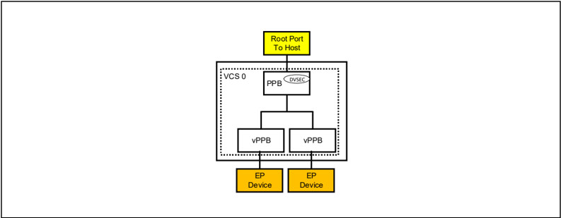

### Figure 195. Minimum Configurations for Switch Compliance Testing

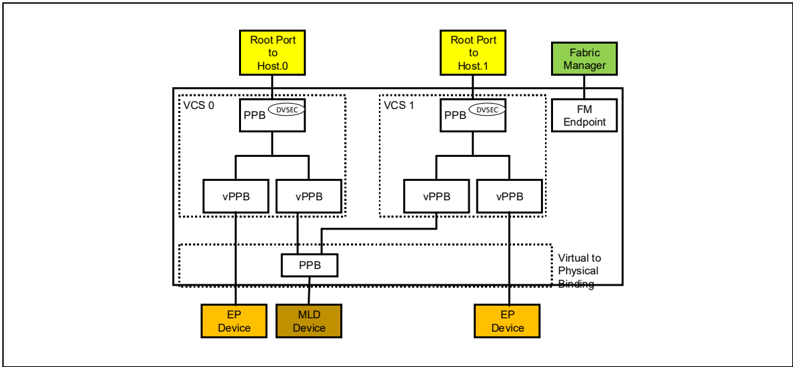

Known good Host devices are required to support managed hot plug and managed removal of devices.

All connectors used in these tests must support hotplug sideband signals.

A switch that is not FM managed should have all ports bound to a VCS. It cannot support unbound ports and MLDs because there is no managing function to control LD bindings.

An FM-managed switch should have at least two VCSs configured for these test purposes, so that interactions between hosts on different VCSs can be monitored. Devices may be connected to unbound ports for a managed switch (i.e., an unallocated resource). Unbound ports may be bound to any VCS at any time. The switch is managed by a Fabric Manager of the vendor's choice and supports MLD devices.

A known good Endpoint should support hot plug and should have passed previous tests in a direct attached system.

#### 14.7.1 Initialization Tests

##### 14.7.1.1 VCS initial Configuration

Overview:

This is a fixed configuration test. All ports should be configured and allocated at boottime without any interaction from a fabric manager device. This test may be used for a switch that has the ability for bindings to be pre-configured and immediately accessible to the attached host after power-up. This test is only suitable for SLD devices, as MLD devices require management to determine which LDs to bind to each VCS.

Test Steps:
1. An switch that is not FM managed shall have all port bindings defined to be active at power-up.
2. An FM-managed Switch should be configured so that at least one port is bound to a VCS on power up.
3. At least one SLD component shall be attached to a port.
4. Power on or initialize the system (host, switch and EP device).

Pass Criteria:
- Devices attached to bound ports are identified by the host at initialization without any external intervention by a Fabric Manager, if any.

Fail Criteria:
- Devices attached to bound ports are not identified by the host on initialization.

#### 14.7.2 Reset Propagation

##### 14.7.2.1 Host PERST# Propagation

Overview:

If a switch receives a USP PERST# then only devices or SLDs bound to the VCS for that USP shall be reset. No other VCS and no other ports shall be reset. For an MLD component, only LDs bound to the VCS that received the USP PERST# shall be reset. LDs bound to another VCS shall be unaffected and continue to operate normally.

###### 14.7.2.1.1 Host PERST# Propagation to an SLD Component

Test Steps:
1. One or more SLD is bound to a VCS
2. Assert PERST# from the Host to the USP of the VCS

Pass Criteria:
- Switch propagates reset to all SLDs connected to the VCS
- All SLDs bound to the VCS go through a link down and the host unloads the associated device drivers
- Hosts and all devices bound to any other VCS shall continue to be connected, bound and no reset events occur.

Fail Criteria:
- One or more SLDs bound to the VCS under test fails to go through a link down
- Hosts or SLDs bound to any other VCS are reset.

###### 14.7.2.1.2 Host PERST# Propagation to an MLD Port

Test Setup:

1. Switch with a minimum of two VCS connected to respective Hosts
2. An MLD with at least one LD bound to each VCS (i.e., at least two bound LDs)
3. Optionally, SLDs may also be attached to each VCS

Test Steps

1. Host.0 asserts USP PERST#
2. Reset is propagated to all VCS.0 vPPBs

Pass Criteria:
- Host.0 processes a link down for each LD bound to VCS.0 and unloads the associated device drivers

- All SLDs connected to VCS.0 go through a link down and Host.0 unloads the associated device drivers
- MLD remains link up
- Other hosts do not receive a Link down for any LDs connected to them.

Fail Criteria:
- Host.0 does not process a link down for the LDs and SLDs bound to VCS.0
- Any other host processes a link down for LDs of the shared MLD
- MLD goes through a link down

##### 14.7.2.2 LTSSM Hot Reset

Overview:

If a switch USP port receives a LTSSM Hot Reset then the USP vPPB shall propagate a reset to all vPPBs for that VCS. No other vPPBs shall be reset.

###### 14.7.2.2.1 LTSSM Hot Reset Propagation to SLD Devices

Test Steps:
1. One or more SLDs are bound to a VCS
2. Initiate LTSSM Hot Reset from the Host to switch.

Pass Criteria:
- Switch propagates hot reset to all SLDs connected to the VCS and their links go down
- Hosts and devices bound to any other VCS must not receive the reset.

Fail Criteria:
- Switch fails to send a hot reset to any SLDs connected to the VCS
- Hosts or devices bound to any other VCS are reset.

###### 14.7.2.2.2 LTSSM Hot Reset Propagation to an MLD component.

Test Setup:

1. Switch with a minimum of two VCS connected to respective Hosts
2. An MLD with at least one LD bound to each VCS (i.e., at least two bound LDs)
3. Optionally, SLDs may also be attached to each VCS

Test Steps

1. Host.0 asserts LTSSM Hot Reset to the switch. The USP propagates a reset to all vPPBs associated with VCS.0

Pass Criteria:
- Host.0 processes a link down for all LDs and SLDs bound to VCS.0
- Host.1 does not receive a Link down for any LDs bound to VCS.1

Fail Criteria:
- MLD port goes through a link down
- Host.1 processes a link down for LDs of the shared MLD
- Host.0 does not process a link down for any LD or SLD bound to VCS.0

##### 14.7.2.3 Secondary Bus Reset (SBR) Propagation

###### 14.7.2.3.1 Secondary Bus Reset (SBR) Propagation to All Ports of a VCS with SLD Components

Test Steps:
1. One or more SLD is bound to a VCS
2. The Host sets the SBR bit in the Bridge Control Register of the USP vPPB

Pass Criteria:
- Switch sends a hot reset to all SLDs connected to the VCS and their links go down
- The Host processes a link down for all SLDs bound to the VCS and unloads the associated device drivers

Fail Criteria:
- Switch fails to send a hot reset to any SLD connected to the VCS
- The Host fails to unload an associated device driver for a device connected to the VCS

###### 14.7.2.3.2 Secondary Bus Reset (SBR) Propagation to All Ports of a VCS Including an MLD Component

Test Setup:

1. Switch with a minimum of two VCS connected to respective Hosts
2. An MLD with at least one LD bound to each VCS (i.e., at least two bound LDs)
3. Optionally, SLDs may also be attached to each VCS

Test Steps:
1. Host.0 sets the SBR bit in the Bridge Control Register associated with the USP vPPB of the VCS under test

Pass Criteria:
- Host.0 processes a link down for the LDs and SLDs bound to VCS.0 and unloads the associated device drivers
- MLD port remains link up
- Other Hosts sharing the MLD are unaffected.

Fail Criteria:
- MLD port goes through a link down
- Any other host processes a link down
- Host.0 does not process a link down for any LDs bound to VCS.0
- Host.0 does not process a link down for any SLDs connected to VCS.0

###### 14.7.2.3.3 Secondary Bus Reset (SBR) Propagation to One Specific Downstream Port (SLD)

Overview:

A single port of the VCS to be reset. The switch sends a hot reset to the SLD connected to the vPPB to be reset and the link goes down

Test Steps:
1. The vPPB under test is connected to a SLD component
2. The Host sets the SBR bit in the Bridge Control Register of the vPPB to be reset

Pass Criteria:
- Host processes a link down for the vPPB under test and unloads the device driver
- All other ports in the VCS remain unaffected

Fail Criteria:
- The port under test does not go link down
- Any other port goes link down

###### 14.7.2.3.4 Secondary Bus Reset (SBR) Propagation to One Specific Shared Downstream Port (MLD)

Test Setup:

1. Switch with a minimum of two VCS connected to respective Hosts
2. Each VCS is bound to an LD each from the MLD component

Test Steps:
1. For the VCS under test, the Host sets the SBR bit in the Bridge Control Register of the vPPB bound to the LD

Pass Criteria:
- Host processes a link down for the vPPB under test and unloads the device driver
- MLD port remains link up
- Other Hosts sharing the MLD are unaffected.

Fail Criteria:
- Host processes a link down for vPPB not under test
- Host does not process a link down for the vPPB under test
- Any switch port goes through a link down

#### 14.7.3 Managed Hot Plug - Adding a New Endpoint Device

Overview:

This test is for adding a device to a switch and subsequently hot adding it to a host.

For an unmanaged switch the new device is hot added to the host by default.

For a managed switch the process requires the Fabric Manager to identify the device then:

- a. For an SLD, bind the device to a host
- b. For an MLD bind one or more LDs to at least one host

##### 14.7.3.1 Managed Add of an SLD Component to a VCS

Test Setup:

1. Host has completed enumeration and loaded drivers for all attached devices.

Test Steps:
1. Perform a managed add of the SLD component to the port under test.
2. For an unmanaged switch the port is already bound to a VCS.
3. For a managed switch the FM must bind the port to a VCS.

Pass Criteria:
- Host enumerates the added device and loads the driver successfully

Fail Criteria:
- Host is unable to enumerate and fails to load the device driver for the added device

##### 14.7.3.2 Managed Add of an MLD Component to an Unbound Port (Unallocated Resource)

The Switch reports PPB related events to the Fabric Manager using the FM API. At the time of publication there are no defined Fabric Manager reporting requirements to an end user, and so parts of this test may only be observable through vendor unique reporting.

Test Setup:

1. Host enumeration is complete and successful for all devices prior to this test
2. Switch port supports MLD and is unbound (i.e., not bound to a VCS)

Test Steps:
1. Perform a managed add of the MLD to the port under test.

Pass Criteria:
- Fabric Manager identifies device but does not bind it to any host.
- No host is affected by the addition of the device to an unbound port
- No host identifies the added device.
- No interrupts are sent to hosts, and the system operates normally

Fail Criteria:
- A host identifies the new device

##### 14.7.3.3 Managed Add of an MLD Component to an SLD Port

This test exercises the behavior of an MLD component when plugged into an SLD port. If the MLD capability is not common to both sides, an MLD operates as an SLD component.

Test Setup:

1. The port under test is configured as an SLD port
2. Host enumeration is complete and successful for all devices prior to this test

Test Steps:
1. Perform a managed add of the MLD component to the port under test

Pass Criteria:
- Host enumerates the added device and loads the driver successfully
- MLD component operates as an SLD (i.e. MLD capable but MLD is not enabled) and presents its full memory capacity to the host (i.e. does not divide into multiple LDs)

Fail Criteria:
- Host does not identify the new device
- Host does not identify the full memory capacity of the new device

#### 14.7.4 Managed Hot Plug-Removing an Endpoint Device

##### 14.7.4.1 Managed Removal of an SLD Component from a VCS

Test Setup:

1. Host enumeration is complete and successful for all devices prior to this test

Test Steps:
1. Perform a managed remove of the SLD component from the port under test.

Pass Criteria:
- Host recognizes the device removal and unloads the associated device driver

Fail Criteria:
- Host does not unload the device driver

##### 14.7.4.2 Managed Removal of a MLD Component from a Switch

Test Setup:

1. Host enumeration is complete and successful for all devices prior to this test
2. The MLD must have one or more LDs bound to the host

Test Steps:
1. Perform a managed remove of the MLD component from the port under test.
2. Fabric Manager unbinds LDs from the vPPBs of the VCS

Pass Criteria:
- Host recognizes that the LD has been removed and unloads the associated device driver.

Fail Criteria:
- Host does not recognize removal of the LD

##### 14.7.4.3 Removal of a Device from an Unbound Port

Test Setup:

1. Host enumeration is complete and successful for all devices prior to this test
2. Device is to be removed from an unbound port (i.e., not bound to any VCS)

Test Steps:
1. Perform a managed remove of the device from the port under test.

Pass Criteria:
- Fabric Manager identifies that device has been removed.
- No host is affected by the removal of the device from an unbound port
- No interrupts are sent to hosts, and the system operates normally

Fail Criteria:
- A host is affected by the removal of the device

#### 14.7.5 Bind/Unbind Operations

Overview:

This test is only applicable to Managed switches. This test requires a fabric manager to bind or unbind devices while the endpoint device remain connected to the port.

The Switch reports PPB related events to the Fabric Manager using the FM API. At the time of publication there are no defined Fabric Manager reporting requirements to the end user, so parts of this test may only be observable through vendor unique reporting.

##### 14.7.5.1 Binding Unallocated Resources to Hosts

Overview:

This test takes an unallocated resource and binds it to a host.

###### 14.7.5.1.1 Bind a SLD to a vPPB in a FM Managed Switch

Test Setup:

1. A SLD component is connected to a Switch port that is not bound to a VCS.
2. The Fabric Manager has identified the SLD.

Test Steps:
1. Bind the SLD to a vPPB of the Host

Pass Criteria:
- Host recognizes the hot added SLD and enumerates it successfully
- The Fabric Manager indicates that the SLD has been bound to the correct VCS

Fail Criteria:
- Host does not process the managed add of the SLD successfully
- The Fabric Manager does not indicate a successful bind operation

###### 14.7.5.1.2 Bind LDs to Two Different VCSs

Test Setup:

1. An MLD component is connected to the Switch and the Fabric Manager has identified the MLD
2. The MLD has two or more LDs that are not bound to any hosts

Test Steps:
1. Bind one or more LDs to VCS 0; and
2. Bind one or more LDs to VCS 1.

Pass Criteria:
- Both Hosts recognize the hot added LDs and enumerate them both successfully
- The Fabric Manager indicates that the LDs have been bound to the correct VCS

Fail Criteria:
- One or both Hosts fail to recognize, enumerate and load drivers for the hot add LDs
- The Fabric Manager indicates that one or more of the LDs are not bound to the correct VCSs.

##### 14.7.5.2 Unbinding Resources from Hosts without Removing the Endpoint Devices

Overview:

This test takes an allocated resource and unbinds it from a host. The resource remains available, but unallocated after a successful unbind operation.

###### 14.7.5.2.1 Unbind an SLD from a VCS

Test Setup:

1. An SLD component is bound to the vPPB of a VCS in an FM managed Switch.
2. The associated Host loads the device driver for the SLD

Test Steps:
1. The FM Unbinds the SLD from the vPPB of the VCS.

Pass Criteria:
- Host recognizes the hot removal of the SLD and unloads the device driver successfully

- Fabric Manager indicates that the SLD is present but has been unbound from the VCS
- The SLD remains linked up

Fail Criteria:
- Host does not process the managed removal of the SLD successfully
- Fabric Manager does not indicate a successful unbind operation
- The SLD link goes down

###### 14.7.5.2.2 Unbind LDs from Two Host VCSs

Test Setup:

1. An MLD component is connected to the Switch and the Fabric Manager has identified the MLD.
2. The MLD component has LDs bound to two or more Host VCSs

Test Steps:
1. The FM Unbinds the LDs from the vPPBs of the Host VCSs.

Pass Criteria:
- All Hosts recognize the managed removal of the LDs and unload the device drivers successfully
- Fabric Manager indicates that the LDs are present but have been unbound from the VCSs
- The MLD remains linked up and all other LDs are unaffected

Fail Criteria:
- On or more Hosts do not process the managed removal of the LDs successfully
- Fabric Manager status does not indicate a successful unbind operation
- Other LDs in the MLD are impacted.

#### 14.7.6 Error Injection

A Jammer, Exerciser or analyzer is required for many of these tests. Errors are injected into the Downstream Port of the switch. The error status registers in the associated vPPB should reflect the injected error.

##### 14.7.6.1 AER Error Injection

Overview:

An MLD port has to ensure that the vPPB associated with each LD that is bound is notified of errors that are not vPPB specific.

###### 14.7.6.1.1 AER Uncorrectable Error Injection for MLD Ports

Test Equipment:

- This test requires an Exerciser if the MLD component is not capable of error injection

Test Setup:

1. vPPB of VCS.0 and vPPB of VCS.1 is each bound to LDs from the same MLD component.

Test Steps:
1. Inject a CXL.io unmasked uncorrectable error into the MLD port of the Switch. The injected error should be categorized as 'supported per vPPB' per the [Section 7.2.7](#727-mld-advanced-error-reporting-extended-capability), 'MLD Advanced Error Reporting Extended Capability'.

Pass Criteria:
- The Uncorrectable Error status register for the vPPBs that are bound to the LDs should reflect the appropriate error indicator bit
- The Uncorrectable Error status register for the FM owned PPB should reflect the appropriate error indicator bit

Fail Criteria:
- PPB or vPPB AER Uncorrectable Error status does not reflect the appropriate error indicator bit

###### 14.7.6.1.2 AER Correctable Error Injection for MLD Ports

Test Equipment:

- This test requires an Exerciser if the MLD component is not capable of error injection

Test Setup:

1. vPPB of VCS.0 and vPPB of VCS.1 is each bound to LDs from the same MLD component

Test Steps:
1. Inject a CXL.io correctable error into the MLD port of the Switch. The injected error should be categorized as 'supported per vPPB' per [Section 7.2.7](#727-mld-advanced-error-reporting-extended-capability), 'MLD Advanced Error Reporting Extended Capability'.

Pass Criteria:
- The Correctable Error status register for the vPPBs that are bound to the LDs should reflect the appropriate error indicator bit
- The Correctable Error status register for the FM owned PPB should reflect the appropriate error indicator bit

Fail Criteria:
- PPB or vPPB AER Correctable Error status does not reflect the appropriate error indicator bit

###### 14.7.6.1.3 AER Uncorrectable Error Injection for SLD Ports

Test Equipment:

- This test requires an Exerciser if the SLD component is not capable of error injection

Test Setup:

1. Host enumeration is complete and successful for all devices prior to this test

Test Steps:
1. Inject a CXL.io unmasked uncorrectable error into the SLD port under test

Pass Criteria:
- The Uncorrectable Error status register for the vPPB that is bound to the SLD should reflect the appropriate error indicator bit

Fail Criteria:
- The vPPB AER status does not reflect the appropriate error indicator bit

###### 14.7.6.1.4 AER Correctable Error Injection for SLD Ports

Test Equipment:

- This test requires an Exerciser if the SLD component is not capable of error injection

Test Setup:

1. Host enumeration is complete and successful for all devices prior to this test

Test Steps:
1. Inject a CXL.io correctable error into the SLD port under test

Pass Criteria:
- The Correctable Error status register for the vPPB that is bound to the SLD should reflect the appropriate error indicator bit

Fail Criteria:
- The vPPB AER status does not reflect the appropriate error indicator bit

### 14.8 Configuration Register Tests

Configuration space register cover the registers defined in Chapter 8.0, 'Control and Status Registers'. These tests are run on the device under test, and require no additional hardware to complete. Tests must be run with Root/Administrator privileges. Test makes the assumption that there is one and only one CXL device in the system, and it is the DUT. This test section has granularity down to the CXL Device.

Please reference section 14.2.1 for topology definitions referenced in this section.

#### 14.8.1 Device Presence

Test Steps:
1. If device to be tested is a CXL 2.0 switch
    - a. Read the PCI Device hierarchy and filter for PCIe Upstream/Downstream Port of a switch.
    - b. Locate the PCIe Upstream/Downstream Port with PCI Express DVSEC Capability with VID of 1E98h and type of 0 (PCIe DVSEC for CXL device).
    - c. Save the PCIe device location for further tests. This will be referred to in subsequent tests as DUT.
2. If the device to be tested is an 2.0 endpoint
    - a. Read the PCI Device hierarchy and filter for PCIe Endpoint Devices
    - b. Locate the PCIe Endpoint device with PCI Express DVSEC Capability with VID of 1E98h and type of 0 (PCIe DVSEC for CXL device).
    - c. Save the PCIe device location for further tests. This will be referred to in subsequent tests as DUT.
3. If the device to be tested is an 2.0 root port
    - a. Read the PCI Device hierarchy and filter for PCIe Root Port Devices
    - b. Locate the PCIe Root Port device with PCI Express DVSEC Capability with VID of 1E98h and type of 0 (PCIe DVSEC for CXL device).
    - c. Save the PCIe device location for further tests. This will be referred to in subsequent tests as DUT.

Pass Criteria:
- One PCIe device with CXL PCI Express DVSEC Capability found .

Fail Criteria:
- PCIe device with CXL PCI Express DVSEC Capability not found

#### 14.8.2 CXL Device Capabilities

Test Steps:
1. Read configuration space for DUT .
2. Initialize variables with value 0.
3. Search for PCIe DVSEC for CXL Device
    - a. Read the configuration space for DUT. Search for a PCI Express DVSEC with VID of 1E98h and type of 0h.
    - b. Save this location as CXL_DEVICE_DVSEC_BASE
4. Search for Non-CXL Function Map DVSEC.
    - a. Read the configuration space for DUT. Search for a PCI Express DVSEC with VID of 1E98h and type of 2h.
    - b. If found, save this location as NON_CXL_FUNCTION_DVSEC_BASE
5. Search for CXL 2.0 Extensions DVSEC for Ports.
    - a. Read the configuration space for DUT. Search for a PCI Express DVSEC with VID of 1E98h and type of 3h.
    - b. If found, save this location as CXL_20_EXTENSION_DVSEC_BASE
6. Search for GPF DVSEC for CXL Port.
    - a. Read the configuration space for DUT. Search for a PCI Express DVSEC with VID of 1E98h and type of 4h.
    - b. If found, save this location as CXL_GPF_PORT_DVSEC_BASE
7. Search for GPF DVSEC for CXL Device.
    - a. Read the configuration space for DUT. Search for a PCI Express DVSEC with VID of 1E98h and type of 5h.
    - b. If found, save this location as CXL_GPF_DEVICE_DVSEC_BASE
8. Search for PCIe DVSEC for Flex Bus Port.
    - a. Read the configuration space for DUT. Search for a PCI Express DVSEC with VID of 1E98h and type of 7h.
    - b. If found, save this location as CXL_FLEXBUS_DVSEC_BASE
9. Search for Register Locator DVSEC.
    - a. Read the configuration space for DUT. Search for a PCI Express DVSEC with VID of 1E98h and type of 8h.
    - b. If found, save this location as CXL_REGISTER_DVSEC_BASE
10. Search for MLD DVSEC.
    - a. Read the configuration space for DUT. Search for a PCI Express DVSEC with VID of 1E98h and type of 9h.
    - b. If found, save this location as CXL_MLD_DVSEC_BASE
11. Search for Advanced Error Reporting Capability.
    - a. If found, save this location as AER_BASE
12. Verify:

| Variable                         | Condition                                                     |
|----------------------------------|---------------------------------------------------------------|
| CXL_DEVICE_DVSEC_BASE != 0       | Always                                                        |
| CXL_20_EXTENSION_DVSEC_BASE != 0 | Device is Root Port, Upstream, or Downstream port of a switch |
| CXL_GPF_PORT_DVSEC_BASE != 0     | Device is Root Port or Downstream Port of a switch            |
| CXL_GPF_DEVICE_DVSEC_OFFSET!= 0  | Device is CXL.mem and supports GPF                            |
| CXL_FLEXBUS_DVSEC_BASE != 0      | Always                                                        |
| CXL_REGISTER_DVSEC_BASE != 0     | Always                                                        |
| CXL_MLD_DVSEC_BASE != 0          | Device isMLD                                                  |
| AER_BASE != 0                    | Always                                                        |

Pass Criteria:
- Test 14.8.1 Passed
- Verify Conditions met

Fail Criteria:
- Verify Conditions Failed

#### 14.8.3 DOE Capabilities

Test Conditions:

- DOE is implemented

Test Steps:
1. Read the Configuration space for DUT.
2. Loop until end of configuration space capabilities are found.
    - a. Search for DOE mailbox.
        - i. Read the configuration space for DUT. Search for a PCI Express Extended Capability with type of 2Eh.
    - b. If found, Issue DOE Discovery repeatedly until response contains Vendor ID = 0xFFFF to get the list of supported Object Protocols for this mailbox.
    - c. If a response contains Vendor ID = 1E98h and Data Object Protocol = 0h i. Save Mailbox location as CXL_COMPLIANCE_DOE_MAILBOX
    - d. If a response contains Vendor ID = 1E98h and Data Object Protocol = 2h i. Save Mailbox location as CXL_CDAT_DOE_MAILBOX
3. Verify:
    - a. CXL_ERROR_DOE_MAILBOX contains only one valid Data Object Protocol

Pass Criteria:
- Test 14.8.2 Passed
- Verify Conditions Met

Fail Criteria:
- Verify Conditions Failed

#### 14.8.4 DVSEC Control Structure

Test Steps:
1. Read the Configuration space for DUT. CXL_DEVICE_DVSEC_BASE + Offset 4h, Length 4 bytes.
2. Decode this into:

| Bits  | Variable |
|-------|----------|
| 15:0  | VID      |
| 19:16 | REV      |
| 31:20 | LEN      |

3. Verify:

| Variable |  | Value   | Condition |
|-------|-----|---------|----------|
| VID   | =   | 1E98h   | Always   |
| REV   | =   | 1       | Always   |
| LEN   | =   | 38h     | Always   |

4. Read the Configuration space for DUT , CXL_DEVICE_DVSEC_BASE + Offset 8h, Length 2 bytes,
5. Decode this into:

| Bits | Variable |
|------|----------|
| 15:0 | ID       |

6. Verify:

| Variable | Value | Condition |
|----------|-------|-----------|
| ID       | = 0   | Always    |

Pass Criteria:
- Test 14.8.2 Passed
- Verify Conditions Met

Fail Criteria:
- Verify Conditions Failed

#### 14.8.5 DVSEC CXL Capability

Test Steps:
1. Read Configuration Space for DUT, CXL_DEVICE_DVSEC_BASE + Offset 0Ah, length 2
2. Decode this into:

| Bits   | Variable                                |
|--------|-----------------------------------------|
| 0:0    | Cache_Capable                           |
| 1:1    | IO_Capable                              |
| 2:2    | Mem_Capable                             |
| 3:3    | Mem_HW_Init_Mode                        |
| 5:4    | HDM_Count                               |
| 6:6    | Cache write back and invalidate capable |
| 7:7    | CXL_RESET Capable                       |
| 10:8   | CXL_RESET Timeout                       |
| 14:14  | Viral Capable                           |
| 15:15  | PM Init completion reporting capable    |

3. Verify:

| Variable          | Value   | Condition             |
|-------------------|---------|-----------------------|
| IO_Capable        | = b1    | Always                |
| HDM_Count         | != b11  | Always                |
| HDM_Count         | != b00  | Mem_Capable = 1       |
| HDM_Count         | = b00   | Mem_Capable = 0       |
| CXL_RESET_Timeout | !> 100b | CXL_RESET_Capable = 1 |

4. Verify:

| Variable | Value | Condition |
|----------|-------|-----------|
| R1       | = R2  | CONFIG_LOCK = 1 |
| R1       | !=R2  | CONFIG_LOCK = 0 |

Pass Criteria:
- Test 14.8.4 Passed
- Verify Conditions Met

Fail Criteria:
- Verify Conditions Failed

#### 14.8.6 DVSEC CXL Control

Test Steps:
1. Read the Configuration space for DUT, CXL_DEVICE_DVSEC_BASE + Offset 0Ch, Length 2.
2. Decode this into:

| Bits  | Variable             |
|-------|----------------------|
| 0:0   | Cache_Enable         |
| 1:1   | IO_Enable            |
| 2:2   | Mem_Enable           |
| 7:3   | Cache_SF_Coverage    |
| 10:8  | Cache_SF_Granularity |
| 11:11 | Cache_Clean_Eviction |
| 14:14 | Viral_Enable         |

3. Verify:

| Variable             | Value   | Condition   |
|----------------------|---------|-------------|
| IO_Enable            | == b1   | Always      |
| Cache_SF_Granularity | != b111 | Always      |

Pass Criteria:
- Test 14.8.4 Passed
- Verify Conditions Met

Fail Criteria:
- Verify Conditions Failed

#### 14.8.7 DVSEC CXL Lock

Test Steps:
1. Read Configuration Space for DUT, CXL_DEVICE_DVSEC_BASE + Offset 14h, length 2
2. Decode this into:

| Bits   | Variable    |
|--------|-------------|
| 0:0    | CONFIG_LOCK |

3. Read Configuration Space for DUT Based on the following:
    - List of Config Lock Registers

Note: These are only locked by Config Lock (#ref). There are other registers that are marked as RWL but no lock bit is mentioned.

DVSEC CXL Control (Offset 0Ch)

| Bits   | Variable             |
|--------|----------------------|
| 0:0    | Cache_Enable         |
| 2:2    | Mem_Enable           |
| 7:3    | Cache_SF_Coverage    |
| 10:8   | Cache_SF_Granularity |
| 11     | Cache_Clean_Eviction |
| 14     | Viral_Enable         |

DVSEC CXL Range 1 Base High (Offset 20h)

| Bits   | Variable             |
|--------|----------------------|
| 31:0   | Memory_Base_High     |

DVSEC CXL Range 1 Base Low (Offset 24h)

| Bits   | Variable             |
|--------|----------------------|
| 31:28  | Memory_Base_Low      |

DVSEC CXL Range 2 Base High (Offset 30h)

| Bits   | Variable             |
|--------|----------------------|
| 31:0   | Memory_Base_High     |

4. Record all read values for each variable in to the 'Read Value List' - R1
5. Write Configuration for all registers listed above in the ' List of Config Lock Registers ' with inverted values
6. Record all read values for each variable in to the 'Read Value List' - R2
7. Verify:

| Variable   | Value   | Condition       |
|------------|---------|-----------------|
| R1         | = R2    | CONFIG_LOCK = 1 |
| R1         | != R2   | CONFIG_LOCK = 0 |

Pass Criteria:
- Test 15.6.4 Passed
- Verify Conditions Met

Fail Criteria:
- Verify Conditions Failed

#### 14.8.8 DVSEC CXL Capability2

Test Steps:
1. Read the Configuration space for DUT, CXL_DEVICE_DVSEC_BASE + Offset 16h, Length 2.
2. Decode this into:

| Bits   | Variable             |
|--------|----------------------|
| 3:0    | Cache Size Unit      |
| 15:8   | Cache Size           |

3. Verify:

| Variable        | Value   | Condition          |
|-----------------|---------|--------------------|
| Cache Size Unit | = 0h    | Cache Capable = b0 |
| Cache Size Unit | != 0h   | Cache Capable = b1 |
| Cache Size Unit | !> 2h   | Always             |

Pass Criteria:
- Test 14.8.4
- Verify Conditions Met

Fail Criteria:
- Verify Conditions Failed

#### 14.8.9 Non-CXL Function Map DVSEC

Test Steps:
1. Read the Configuration space for DUT . NON_CXL_FUNCTION_DVSEC_BASE + Offset 4h, Length 4 bytes.
2. Decode this into:

| Bits   | Variable   |
|--------|------------|
| 15:0   | DVSEC VID  |
| 19:16  | REV        |
| 31:20  | LEN        |

3. Verify:

| Variable   | Value   | Condition   |
|------------|---------|-------------|
| DVSEC VID  | = 1E98h | Always      |
| REV        | = 0     | Always      |
| LEN        | = 2Ch   | Always      |

4. Read the Configuration space for DUT , Offset 8h, Length 2 bytes,
5. Decode this into:

| Bits | Variable |
|------|----------|
| 15:0 | ID       |

6. Verify:

| Variable   | Value   | Condition   |
|------------|---------|-------------|
| ID         | = 02h   | Always      |

Pass Criteria:
- Test 14.8.2 Passed
- Verify Conditions Met

Fail Criteria:
- Verify Conditions Failed

#### 14.8.10 CXL2.0 Extensions DVSEC for Ports Header

Test Conditions:

- DUT is Root port, Upstream or Downstream port of a switch

Test Steps:
1. Read the Configuration space for DUT. CXL_20_EXTENSION_DVSEC_BASE + Offset 04h, Length 4 bytes.
2. Decode this into:

| Bits   | Variable   |
|--------|------------|
| 15:0   | VID        |
| 19:16  | REV        |
| 31:20  | LEN        |

3. Verify:

| Variable |  | Value   | Condition |
|-------|-----|---------|----------|
| VID   | =   | 1E98h   | Always   |
| REV   | =   | 0       | Always   |
| LEN   | =   | 28h     | Always   |

4. Read the Configuration space for DUT, CXL_20_EXTENSION_DVSEC_BASE + Offset 08h, Length 2 bytes,
5. Decode this into:

| Bits | Variable |
|------|----------|
| 15:0 | ID       | 

6. Verify:

| Variable | Value | Condition |
|------|----------|----------|
| ID   | = 03h    | Always   |

Pass Criteria:
- Test 14.8.2 Passed
- Verify Conditions met

Fail Criteria:
- Verify Conditions Failed

#### 14.8.11 Port Control Override

Test Conditions:

- DUT is Root port, Upstream or Downstream port of a switch

Test Steps:
1. Read the Configuration space for DUT. CXL_20_EXTENSION_DVSEC_BASE + Offset 0Ch, length 4 bytes.
2. Verify:

| Bits | Value |
|------|-------|
| 0:0  | 0b    |
| 1:1  | 0b    |

3. Verify:
    - a. For Ports Operating in PCIe or CXL 1.1 mode
        - i. Verify that SBR functionality of PORT is as defined in PCIe Specification
        - ii. Verify that Link Disable Functionality follows PCIe Specification
    - b. For Ports Operating in CXL 2.0 mode
        - i. Verify that writing to SBR bit in Bridge Control register of this Port has no effect
        - ii. Verify that writing to Link Disable bit in Link Control register of this Port has no effect
4. Store '1' into Bit 0 at Offset 0x0C
5. Verify:
    - a. For Ports Operating in PCIe or CXL 1.1 mode, verify that SBR functionality of PORT is as defined in PCIe Specification
    - b. For Ports Operating in CXL 2.0 mode, verify that writing to SBR bit in Bridge Control register of this Port results in hot reset being generated by the Port
6. Store '0' into Bit 0 at Offset 0x0C
7. Store '1' into Bit 1 at Offset 0x0C
8. Verify:
    - a. For Ports Operating in PCIe or CXL 1.1 mode, verify that Link Disable functionality of PORT is as defined in PCIe Specification
    - b. For Ports Operating in CXL 2.0 mode, verify that writing to Link Disable bit in Link Control register of this Port results in being able to disable and re-enable the link by the Port

Pass Criteria:
- Test 14.8.10 Passed
- Verify Conditions met

Fail Criteria:
- Verify Conditions Failed

#### 14.8.12 GPF DVSEC Port Capability

Test Conditions:

- DUT is a root port or a Downstream Port of a switch

Test Steps:
1. Read the Configuration space for DUT, CXL_GPF_PORT_DVSEC_BASE + Offset 04h, Length 4.
2. Decode this info

| Bits   | Variable        |
|--------|-----------------|
| 15:0   | DVSEC Vendor ID |
| 19:16  | DVSEC Revision  |
| 31:20  | DVSEC Length    |

3. Verify:

| Variable        | Value   | Condition   |
|-----------------|---------|-------------|
| DVSEC Vendor ID | 1E98h   | Always      |
| DVSEC Revision  | 0h      | Always      |
| DVSEC Length 1  | 0h      | Always      |

4. Read the Configuration space for DUT, CXL_GPF_PORT_DVSEC_BASE + Offset 08h, Length 2.
5. Decode this info

| Bits   | Variable   |
|--------|------------|
| 15:0   | DVSEC ID   |

6. Verify:

| Variable   | Value   | Condition   |
|------------|---------|-------------|
| DVSEC ID   | 04h     | Always      |

Pass Criteria:
- Test 14.8.2 Passed
- Verify Conditions Met

Fail Criteria:
- Verify Conditions Failed

#### 14.8.13 GPF Port Phase1 Control

Test Conditions:

- DUT is a root port or a Downstream Port of a switch

Test Steps:
1. Read the Configuration space for DUT, CXL_GPF_PORT_DVSEC_BASE + Offset 0Ch, Length 2.
2. Decode this info

| Bits | Variable            |
|------|---------------------|
| 11:8 | Port GPF Phase 1 Timeout Scale |

3. Verify:

| Variable                       | Value   | Condition   |
|--------------------------------|---------|-------------|
| Port GPF Phase 1 Timeout Scale | < 1000b | Always      |

Pass Criteria:
- Test 14.8.12 Passed
- Verify Conditions Met

Fail Criteria:
- Verify Conditions Failed

#### 14.8.14 GPF Port Phase2 Control

Test Conditions:

- DUT is a root port or a Downstream Port of a switch

Test Steps:
1. Read the Configuration space for DUT, CXL_GPF_PORT_DVSEC_BASE + Offset 0Eh, Length 2.
2. Decode this info

| Bits | Variable                 |
|------|--------------------------|
| 11:8 | Port GPF Phase 2 Timeout Scale |

3. Verify:

| Variable                       | Value   | Condition   |
|--------------------------------|---------|-------------|
| Port GPF Phase 2 Timeout Scale | < 1000b | Always      |

Pass Criteria:
- Test 14.8.12 Passed
- Verify Conditions Met

Fail Criteria:
- Verify Conditions Failed

#### 14.8.15 GPF DVSEC Device Capability

Test Conditions:

- Device supports CXL.mem and GPF capable.

Test Steps:
1. Read the Configuration space for DUT, CXL_GPF_DEVICE_DVSEC_BASE + Offset 04h, Length 4.
2. Decode this info

| Bits   | Variable        |
|--------|-----------------|
| 15:0   | DVSEC Vendor ID |
| 19:16  | DVSEC Revision  |
| 31:20  | DVSEC Length    |

3. Verify:

| Variable        | Value   | Condition   |
|-----------------|---------|-------------|
| DVSEC Vendor ID | 1E98h   | Always      |
| DVSEC Revision  | 0h      | Always      |
| DVSEC Length    | 10h     | Always      |

4. Read the Configuration space for DUT, CXL_GPF_DEVICE_DVSEC_BASE + Offset 08h, Length 2.
5. Decode this info

| Bits | Variable    |
|------|-------------|
| 15:0 | DVSEC ID    |

6. Verify:

| Variable   | Value   | Condition   |
|------------|---------|-------------|
| DVSEC ID   | 05h     | Always      |

Pass Criteria:
- Test 14.8.2 Passed
- Verify Conditions Met

Fail Criteria:
- Verify Conditions Failed

#### 14.8.16 GPF Device Phase2 Duration

Test Conditions:

- Device supports CXL.mem and GPF capable.

Test Steps:
1. Read the Configuration space for DUT, CXL_GPF_DEVICE_DVSEC_BASE + Offset 0Ah, Length 2.
2. Decode this info
3. Verify:

| Bits   | Variable                         |
|--------|----------------------------------|
| 11:8   | Device GPF Phase 2 Timeout Scale |

| Variable                         | Value   | Condition   |
|----------------------------------|---------|-------------|
| Device GPF Phase 2 Timeout Scale | < 1000b | Always      |

Pass Criteria:
- Test 14.8.15 Passed
- Verify Conditions Met

Fail Criteria:
- Verify Conditions Failed

#### 14.8.17 GPF Device Phase1 Duration

Test Conditions:

- Device supports CXL.mem and GPF capable.

Test Steps:
1. Read the Configuration space for DUT, CXL_GPF_DEVICE_DVSEC_BASE + Offset 0Ch, Length 2.
2. Decode this info

| Bits   | Variable                         |
|--------|----------------------------------|
| 11:8   | Device GPF Phase 1 Timeout Scale |

3. Verify:

| Variable                         | Value   | Condition   |
|----------------------------------|---------|-------------|
| Device GPF Phase 1 Timeout Scale | < 1000b | Always      |

Pass Criteria:
- Test 14.8.15 Passed
- Verify Conditions Met

Fail Criteria:
- Verify Conditions Failed

#### 14.8.18 Flex Bus Port DVSEC Capability Header

Test Steps:
1. Read the Configuration space for DUT, CXL_FLEXBUS_DVSEC_BASE + Offset 04h, Length 4 bytes.
2. Decode this into:

| Bits  | Variable |
|-------|----------|
| 15:0  | VID      |
| 19:16 | REV      |
| 31:20 | LEN      | 

3. Verify:

| Variable   | Value   | Condition   |
|------------|---------|-------------|
| VID        | = 1E98h | Always      |
| REV        | = 01h   | Always      |
| LEN        | = 14h   | Always      |

4. Read CXL_FLEXBUS_DVSEC_BASE + Offset 08h, Length 2 bytes,
5. Decode this into:

| Bits | Variable |
|------|----------|
| 15:0 | ID       |

6. Verify:

| Variable | Value | Condition |
|----------|-------|-----------|
| ID       | = 07h | Always    |

Pass Criteria:
- Test 14.8.2 Passed
- Verify Conditions met

Fail Criteria:
- Verify Conditions Failed

#### 14.8.19 DVSEC Flex Bus Port Capability

Test Steps:
1. Read the Configuration space for DUT, CXL_FLEXBUS_DVSEC_BASE + Offset 0Ah, Length 2.
2. Decode this into:

| Bits   | Variable       |
|--------|----------------|
| 0:0    | Cache_Capable  |
| 1:1    | IO_Capable     |
| 2:2    | Mem_Capable    |
| 5:5    | CXL2p0_Capable |
| 6:6    | CL_MLD_Capable |

3. Verify:

| Variable       | Value   | Condition   |
|----------------|---------|-------------|
| IO_Capable     | = 1b    | Always      |
| CXL2p0_Capable | = 1b    | Always      |

Pass Criteria:
- Test 14.8.2 Passed
- Verify Conditions Met

Fail Criteria:
- Verify Conditions Failed

#### 14.8.20 Register Locator

Test Steps:
1. Read the Configuration space for DUT. CXL_REGISTER_DVSEC_BASE + Offset 04h, Length 4 bytes.
2. Decode this into:

| Bits   | Variable   |
|--------|------------|
| 15:0   | VID        |
| 19:16  | REV        |
| 31:20  | LEN        |

3. Verify:

| Variable | Value  | Condition |
|----------|--------|-----------|
| VID      | =1E98h | Always    |
| REV      | =0     | Always    |
| LEN      | =24h   | Always    |  

4. Read the Configuration space for DUT, CXL_REGISTER_DVSEC_BASE + Offset 08h, Length 2 bytes,
5. Decode this into:

| Bits | Variable |
|------|----------|
| 15:0 | ID       |

6. Verify:

| Variable | Value | Condition |
|----------|-------|-----------|
| ID       | = 08h | Always    |

Pass Criteria:
- Test 14.8.2 Passed
- Verify Conditions met

Fail Criteria:
- Verify Conditions Failed

#### 14.8.21 MLD DVSEC Capability Header

Test Conditions:

- Device is MLD capable

Test Steps:
1. Read the Configuration space for DUT. CXL_MLD_DVSEC_BASE + Offset 04h, Length 4 bytes.
2. Decode this into:

| Bits  | Variable |
|-------|----------|
| 15:0  | VID      |
| 19:16 | REV      |
| 31:20 | LEN      |

3. Verify:

| Variable   | Value   | Condition   |
|------------|---------|-------------|
| VID        | =1E98h  | Always      |
| REV        | =0      | Always      |
| LEN        | =10h    | Always      |

4. Read the Configuration space for DUT, Offset 0x08, Length 2 bytes,
5. Decode this into:

| Bits | Variable |
|------|----------|
| 15:0 | ID       |

6. Verify:

| Variable   | Value   | Condition   |
|------------|---------|-------------|
| ID         | =09h    | Always      |

Pass Criteria:
- Test 14.8.2 Device Present passed
- Verify Conditions met

Fail Criteria:
- Verify Conditions Failed

#### 14.8.22 MLD DVSEC Number of LD Supported

Test Conditions:

- Device is MLD capable

Test Steps:
1. Read the Configuration space for DUT, CXL_MLD_DVSEC_BASE + Offset 0Ah, Length 2.
2. Decode this into:

| Bits | Variable |
|------|----------|
| 15:0 | Number_LDs_Supported |

3. Verify:

| Variable             | Value   | Condition   |
|----------------------|---------|-------------|
| Number_LDs_Supported | ≤16     | Always      |
| Number_LDs_Supported | != 0    | Always      |

Pass Criteria:
- Test 14.8.21 Passed
- Verify Conditions Met

Fail Criteria:
- Verify Conditions Failed

#### 14.8.23 Table Access DOE

Test Conditions:

- Device supports Table Access DOE

Test Steps:
1. For the following steps, use the DOE mailbox at CXL_CDAT_DOE_MAILBOX
2. Issue DOE Read Entry

| Offset   |   Length | Value   |
|----------|----------|---------|
| 0        |        2 | 1E98h   |
| 2        |        1 | 2h      |
| 4        |        2 | 3h      |
| 8        |        1 | 0h      |
| 9        |        1 | 0h      |
| 0Ah      |        2 | 0h      |

3. Read Response and Decode this into

| Offset   |   Length | Variable                   |
|----------|----------|----------------------------|
| 08h      |        1 | Table_Access_Response_Code |
| 09h      |        1 | Table_Type                 |

4. Verify:

| Variable                   | Value   | Condition   |
|----------------------------|---------|-------------|
| Table_Access_Response_Code | = 0     | Always      |
| Table_Type                 | = 0     | Always      |

Pass Criteria:
- Test 14.8.3 Passed
- Verify Conditions Met

Fail Criteria:
- Verify Conditions Failed

#### 14.8.24 PCI Header - Class Code Register

Test Conditions:

- DUT is CXL Memory device

Test Steps:
1. Read the Configuration space for DUT, offset 09h, Length 4
2. Decode this into:

| Bits  | Variable                   |
|-------|----------------------------|
| 7:0   | Programming Interface (PI) |
| 15:8  | Sub Class Code (SCC)       |
| 23:16 | Base Class Code (BCC)      |

3. Verify

| Variable                   | Value   | Condition   |
|----------------------------|---------|-------------|
| Programming Interface (PI) | 10h     | Always      |
| Sub Class Code (SCC)       | 02h     | Always      |
| Base Class Code (BCC)      | 05h     | Always      |

Pass Criteria:
- Verify Conditions Met

Failed Criteria:
- Verify Conditions Failed

### 14.9 Reset and Initialization Tests

#### 14.9.1 Warm Reset Test

DUT must be in D3 state with context flushed

Test Steps:
1. Host issues CXL PM VDM, Reset Prep (ResetType= Warm Reset; PrepType=General Prep)
2. Host waits for CXL device to respond with CXL PM VDM ResetPrepAck

Pass Criteria:
- DUT responds with an ACK

Fail Criteria:
- DUT fails to respond to ACK

#### 14.9.2 Cold Reset Test

DUT must be in D3 state with context flushed

Test Steps:
1. Host issues CXL PM VDM, Reset Prep (ResetType= Warm Reset; PrepType=General Prep)
2. Host waits for CXL device to respond with CXL PM VDM ResetPrepAck

Pass Criteria:
- DUT responds with an ACK

Fail Criteria:
- DUT fails to respond to ACK

#### 14.9.3 Sleep State Test

DUT must be in D3 state with context flushed

Test Steps:
1. Host issues CXL PM VDM, Reset Prep (ResetType= S3; PrepType=General Prep)
2. Host waits for CXL device to respond with CXL PM VDM ResetPrepAck

Pass Criteria:
- DUT responds with an ACK

Fail Criteria:
- DUT fails to respond to ACK

#### 14.9.4 Function Level Reset Test

Necessary Conditions:

- Device supports Function Level Reset.

Function Level Reset has the requirement that the CXL device maintain Cache Coherency. This test is accomplished by running the Application Layer tests as described in [Section 14.3.6.1](#14361-application-layertransaction-layer-tests), and issuing a Function level reset in the middle of it.

## Required Device Capability

Hardware configuration support for Algorithm 1a described in [Section 14.3.1](#1431-general-testing-overview). If the device supports self-checking it must escalate a fatal system error. Device is permitted to log failing information.

Test Steps:
1. Determine test run time T based on the amount of time available or allocated for this testing.
2. Host software sets up Cache Coherency test for Algorithm 1a: Multiple Write Streaming
3. If the devices supports self-checking, enable it.
4. At a time between 1/3 and 2/3 of T and with at least 200 ms of test time remaining, Host initiates Host initiates FLR by writing to the Initiate Function Level Reset bit.

Pass Criteria:
- System does not elevate a fatal system error, and no errors are logged

Fail Criteria:
- System error reported, Logged failures exist.

#### 14.9.5 Flex Bus Range Setup Time

Necessary Conditions:

- Device is CXL.mem capable
- Ability to monitor the device reset

Test Steps:
1. Reset the system, Monitor Reset until clear
2. Wait for 1 second
3. Read Configuration Space for DUT, Offset 0x1C Length 4
4. Decode this into:

| Bits | Variable          |
|------|-------------------|
| 0:0  | Memory_Info_Valid |
| 1:1  | Memory_Active     |

5. Verify:

| Variable          | Value   | Condition            |
|-------------------|---------|----------------------|
| Memory_Info_Valid | =1      |                      |
| Memory_Active     | =1      | Mem_HW_Init_Mode = 1 |

Pass Criteria:
- Test 14.8.2 Passed
- Verify Conditions Met

Fail Criteria:
- Verify Conditions Failed

#### 14.9.6 FLR Memory

This test ensures that FLR does not affect data in device attached memory.

Necessary Conditions:

- Device is CXL.mem capable

Test Steps:
1. Write a known pattern to a known location within HDM
2. Host performs a FLR as defined in steps of [Section 14.9.4](#1494-function-level-reset-test).
3. Host Reads HDM memory location
4. Verify: that read data matches previously written data.

Pass Criteria:
- HDM retains information following FLR

Fail Criteria:
- HDM memory is reset.

#### 14.9.7 CXL_Reset Test

Necessary Conditions:

- CXL Reset Capable bit in the DVSEC CXL Capability register is set.

Test Steps:
1. Determine test run time T1 from DVSEC CXL Capability CXL Reset Timeout register.
2. Read and record value of following ROS register for step 6.

    Error Capabilities and Control Register (Offset 14h)

    | Bits | Variable            |
    |------|---------------------|
    | 3:0  | First Error pointer |

    Header Log Registers (Offset 18h)

    | Bits  | Variable           |
    |-------|--------------------|
    | 511:0 | Header Log         |

    Note: Contents of registers may or may or may not be '0'

3. Set following RWS registers to settings as per list and record written values for step 6

    RWS Registers and settings:
    Uncorrectable Error Mask Register (Offset 04h)

    | Bits   | Variable             | Settings      |
    |--------|----------------------|---------------|
    | 12:0   | Error Mask registers | Set to 1FFFFh |
    | 15:15  | CXL_IDE_Tx_Mask      | Set to 1      |
    | 16:16  | CXL_IDE_Rx_Mask      | Set to 1      |

    Uncorrectable Error Severity Register (Offset 08h)

    | Bits   | Variable                 | Settings      |
    |--------|--------------------------|---------------|
    | 12:0   | Error Severity registers | Set to 1FFFFh |
    | 15:15  | CXL_IDE_Tx_Severity      | Set to 1      |
    | 16:16  | CXL_IDE_Rx_Severity      | Set to 1      |

    Correctable Error Mask Register (Offset 10h)

    | Bits   | Variable             | Settings   |
    |--------|----------------------|------------|
    | 6:0    | Error Mask Registers | Set to 0   |

    Error Capabilities and Control Register (Offset 14h)

    | Bits   | Variable       | Settings   |
    |--------|----------------|------------|
    | 13:13  | Poison_Enabled | Set to 1b  |

    CXL Link Layer Capability Register (Offset 00h)

    | Bits   | Variable                   | Settings    |
    |--------|----------------------------|-------------|
    | 3:0    | CXL Link version Supported | Set to 0x2  |
    | 15:8   | LLR Wrap Value Supported   | Set to 0xFF |

    Note: Intention is to set register to non-zero value

    CXL Link Layer Control and Status Register (Offset 08h)

    | Bits   | Variable        | Settings   |
    |--------|-----------------|------------|
    | 1:1    | Link_Init_Stall | Set to 1b  |
    | 2:2    | LL_Crx_Stall    | Set to 1b  |

    CXL Link Layer Rx Credit Control Register (Offset 10h)

    | Bits  | Variable             | Settings      |
    |-------|----------------------|---------------|
    | 9:0   | Cache Req Credits    | Set to 3FFh   |
    | 19:10 | Cache Rsp Credits    | Set to 3FFh   |
    | 29:20 | Cache Data Credits   | Set to 3FFh   |
    | 39:30 | Mem Req _Rsp Credits | Set to 3FFh   |
    | 49:40 | Mem Data Credits     | Set to 3FFh   |

    CXL Link Layer Ack Timer Control Register (Offset 28h)

    | Bits   | Variable                | Settings    |
    |--------|-------------------------|-------------|
    | 7:0    | Ack_Force_Threshold     | Set to FFh  |
    | 17:8   | Ackor CRD Flush Retimer | Set to 1FFh |

    CXL Link Layer Defeature Register (Offset 30h)

    | Bits   | Variable    | Settings   |
    |--------|-------------|------------|
    | 0:0    | MHD Disable | Set to 1b  |

4. Set Initiate CXL Reset =1 in DVSEC CXL Control2 register
5. Wait for time T1.
6. Verify
    - a. Confirm DVSEC Flex Bus Status2 CXL Reset complete is set.
    - b. ROS register values before and after CXL reset are matching.
    - c. RWS registers values before and after CXL reset are matching.

Pass Criteria:
- Verify Conditions Met

Fail Criteria:
- Verify Conditions Failed

#### 14.9.8 Global Persistent Flush (GPF) (Requires Protocol Analyzer)

##### 14.9.8.1 Host and Switch Test

Necessary Conditions:

- Device is CXL.cache or CXL.mem capable
- Ability to monitor the link

Test Steps:
1. Bring system to operating state
2. Initiate Shut Down process
3. Verify:
    - a. System sends CXL GPF PM VDM Phase 1 request
    - b. After receipt of response message from Device,
    - c. System sends CXL GPF PM VDM Phase 2 request
    - d. After receipt of response message Link transitions to lowest possible power state

Pass Criteria:
- Verify that required CXL GPF PM VDM Phase 1 request is sent
- Verify that required CXL GPF PM VDM Phase 2 request is sent after phase 1 response
- Verify Link enters lowest possible power state

Fail Criteria:
- Verify Conditions Failed

##### 14.9.8.2 Device Test

Necessary Conditions:

- Device is CXL.cache or CXL.mem capable
- Ability to monitor the link

Test Steps:
1. Ensure link between system and device is in initialized state
2. Initiate Shut Down process
3. Verify:
    - a. No cache transactions are initiated by device after CXL GPF PM VDM
    - b. Verify GPF Response message sent by Device in Phase 1
    - c. Verify GPF Response message sent by Device in Phase 2

Pass Criteria:
- Ensure no cache transactions are initiated after CXL GPF PM VDM in Phase 1
- Verify Device sends Response Message in Phase 1
- Check response message fields are correct
- Verify Device sends Response Message in Phase 2
- Verify Link enters lowest possible power state

Fail Criteria:
- Verify Conditions Failed

#### 14.9.9 Hot-Plug Test

Necessary Conditions:

- Device supports Hot-Plug

Test Steps:
1. Bring system to operating state
2. Initiate Hot-Plug remove
3. Verify:
    - a. Hot-Plug remove process completed
4. Remove and reinsert device
5. Initiate Hot-Plug add
6. Verify:
    - a. Hot-Plug add process completed

Pass Criteria:
- Verify Conditions Met

Fail Criteria:
- Verify Conditions Failed

### 14.10 Power Management Tests

#### 14.10.1 Pkg-C Entry (Device Test)

This test case is optional if the device does not support generating PMReq() with memory LTR reporting.

The initial conditions for this test assume that Power management and Credit Initialization has completed, that the CXL link is up.

This test case will check the following conditions:

- Check that the device initiates PkgC entry, and reports appropriate LTR.
- Check all PMReq() fields adhere to the CXL 2.0 Spec.

## Device Test Steps:

1. Host or Test Equipment maintains the link in an idle state, no CXl.cache/CXL.mem requests are initiated by either Host/Test Equipment or the Device Under Test.
2. Host or Test equipment waits for Link to enter CXL L1 Idle State.
3. Optionally a Protocol Analyzer is used to inspect that the link enters the L1 state, and that the PMReq.Req is sent from the Device, and the Host replies with PMReq.Rsp and PMReq.Go

Pass Criteria:
- Link enters L1

Fail Criteria:
- Test fails if the Link enters L1 but PMReq.Req is missing
- Test fails if LTR values in the PMReq.Req are invalid

#### 14.10.2 Pkg-C Entry Reject (Device Test) (Requires Exerciser)

This test case is optional if the device does not support generating PMReq() with memory LTR reporting.

The initial conditions for this test assume that Power management and Credit Initialization has completed, that the CXL link is up.

This test case will check the following conditions:

- Check that the device initiates PkgC entry, and reports appropriate LTR.
- Check all PMReq() fields adhere to the CXL 2.0 Spec.

- Check that the Device under Test does not enter low power state when Exercises responds with Low LTR (processor busy condition)

## Device Test Steps:

1. Host or Test Equipment maintains the link in an idle state, no CXl.cache/CXL.mem requests are initiated by either Host/Test Equipment or the Device Under Test.
2. Exerciser waits for the PMReq.Req from Device
3. Exerciser sends PMReq.Rsp advertising Low LTR indicating processor is busy

Pass Criteria:
- Link does not enter L1

Fail Criteria:
- Test fails if the Device requests L1 entry
- Test fails if LTR values in the PMReq.Req are invalid

#### 14.10.3 Pkg-C Entry (Host Test)

The initial conditions for this test assume that Power management and Credit Initialization has completed, that the CXL link is up.

This test case will check the following conditions:

- Check that the Host sends PMReq.Rsp when device initiates PkgC entry, and that it reports appropriate LTR.
- Check all PMReq.Rsp() and PMReq.Go() fields adhere to the CXL 2.0 Spec.

## Host Test Steps:

1. Host and Device maintain the link in an idle state, no CXl.cache/CXL.mem requests are initiated by either Host or the Device.
2. Test waits for Link to enter CXL L1 Idle State. If CXL L1 state is not entered this test can be skipped.
3. Optionally a Protocol Analyzer is used to inspect that the link enters the L1 state, and that the PMReq.Req is sent from the Device, and the Host replies with PMReq.Rsp and PMReq.Go

Pass Criteria:
- Link enters L1

Fail Criteria:
- Test fails if the Device sends PMReq.Req but Host fails to respond with PMReq.Rsp and PMReq.Go
- Test fails if LTR values in the PMReq.Rsp are invalid

### 14.11 Security

#### 14.11.1 Component Measurement and Authentication

##### 14.11.1.1 DOE CMA Instance

Prerequisites:
- DOE CMA supported by at least one Function

Mode:

- CXL.io

Topology:
- SHDA
- SHSW
- SHSW-FM

Test Steps:
1. Scan every function and read DOE CMA instances

Pass Criteria:
1.  Each DOE CMA instance supports only DOE Discovery data object protocol, and CMA data object protocol

Fail Conditions:

1.  DOE discovery not supported
2. CMA data object not supported

##### 14.11.1.2 FLR While Processing DOE CMA Request

Prerequisites:
- DOE CMA supported by at least one Function

Mode:

- CXL.io

Topology:
- SHDA
- SHSW
- SHSW-FM

Test Steps:
1. Send DOE CMA request
2. Perform FLR reset to associated function (This should cancel the DOE request)
3. Attempt to read DOE CMA response

Pass Criteria:
1. Target Function responds that is not indicating a DOE CMA response is available (The request should be canceled from the FLR)

## Fail Conditions:

1. Original DOE CMA request results in a response returned by DOE CMA target function after FLR

##### 14.11.1.3 OOB CMA While in Fundamental Reset

Prerequisites:
- OOB CMA supported, platform or slot supports asserting Fundamental Reset (PE_Reset) under host software control. Note: Known Good Host support for PE_Reset shall be either on a per slot basis under Host software control or hold all in PE_Reset during POST.

Mode:

- CXL.io
- OOB

Topology:
- SHDA
- SHSW
- SHSW-FM

Test Steps:
1.  Assert fundamental reset on device
2. Perform authentication over OOB CMA

Pass Criteria:
1. Device successfully authenticates while device held in reset

Fail Conditions:

##### 14.11.1.4 OOB CMA While Function gets FLR

Prerequisites:
- OOB CMA supported
- Function 0 supports FLR

Mode:

- CXL.io
- OOB

Topology:
- SHDA

- SHSW
- SHSW-FM

Test Steps:
1. Clear Authenticated state over OOB with Get_Version request
2. Host Issues FLR to function 0 (beginning a loop: issue a single FLR with a delay until the FLR completes. Repeat.)
    - a. In parallel with FLR loop, begin authentication with OOB (long Challenge Sequence beginning with Get_Version and calling required intermediate functions ending with Challenge)
3. Host continues FLR (exit loop of FLRs once Authentication succeeds)
    - a. In parallel with FLR, Verify Challenge Authentication Succeeds over OOB.

Pass Criteria:
1.  Authentication completes successfully with FLR on device Function 0 during OOB authentication.

Fail Conditions:
1. OOB Authentication fails at any point using full authentication/negotiation sequence.

##### 14.11.1.5 OOB CMA During Conventional Reset

Prerequisites:
- OOB CMA supported.  Host issues Link_Disable on root port of device to create the Conventional Reset condition.

Mode:

- CXL.io
- OOB

Topology:
- SHDA
- SHSW
- SHSW-FM

Test Steps:
1. Host issues Link_Disable on root port for device
2. Perform authentication over OOB CMA (long sequence beginning with Get_Version, followed by intermediate requests as required and finishing with Challenge)
3. Host enables Link on root port for device

Pass Criteria:
1. Device successfully authenticates over OOB while devices Link is in disabled state.

Fail Conditions:

#### 14.11.2 Link Integrity and Data Encryption CXL.io IDE

Details for setting up authenticate link Key Exchange is still work in process as per SPDM 1.1 ECNs against PCI-E protocol which will extend into CXL.io protocol.

Use protocol analyzer to verify that link traffic is encrypted. Test is informational only if Protocol analyzer is not available.

Link IDE tests are based on configuring IDE in a specific configuration, and then running a compliance test algorithm specified in section Chapter 14.0, 'CXL.io Load/ Store Test'.

##### 14.11.2.1 CXL.io Link IDE Streams Functional

Prerequisites:

Mode:

- CXL.io

Topology:
- SHDA
- SHSW
- SHSW-FM

Test Steps:
1. Establish Link IDE Streams on all links between Host and DUT
    - a. Disable aggregation
    - b. Disable PRCR
2. Start compliance test algorithm for CXL.io as defined above.

Pass Criteria:
1. Self-checking compliance test reports no errors
2. CXL link remains up
3. No errors reported in AER or IDE Status registers

Fail Conditions:

##### 14.11.2.2 CXL.io Link IDE Streams Aggregation

Prerequisites:
- Aggregation Supported bit Set for both ports of each Link IDE Stream

Mode:

- CXL.io

Topology:
- SHDA
- SHSW
- SHSW-FM

Test Steps:
1. Establish Link IDE Streams on all links between Host and DUT
    - a. Enable aggregation
    - b. Disable PRCR
2. Start compliance test algorithm for CXL.io as defined above.
3. Cycle through the following Tx aggregation modes:
    - a. NPR/PR/CPL all set to 01b (up to 2);
    - b. NPR/PR/CPL all set to 10b (up to 4);
    - c. NPR/PR/CPL all set to 11b (up to 8);
    - d. NPR=01b, PR=10b, CPL=11b.

Pass Criteria:
1. Self-checking compliance test reports no errors
2. CXL link remains up
3. No errors reported in AER or IDE Status registers

Fail Conditions:

##### 14.11.2.3 CXL.io Link IDE Streams PCRC

Prerequisites:
- PCRC Supported bit Set for both ports of each Link IDE Stream

Mode:

- CXL.io

Topology:
- SHDA
- SHSW
- SHSW-FM

Test Steps:
1. Establish Link IDE Streams on all links between Host and DUT
    - a. Disable aggregation
    - b. Enable PRCR
2. Start compliance test algorithm for CXL.io as defined above.

Pass Criteria:
1. Self-checking compliance test reports no errors
2. CXL link remains up
3. No errors reported in AER or IDE Status registers

Fail Conditions:

##### 14.11.2.4 CXL.io Selective IDE Stream Functional

Prerequisites:
- DOE CMA support

Mode:
- CXL.io

Topology:
- SHDA
- SHSW
- SHSW-FM

Test Steps:
1. Establish Selective IDE Streams on all links between Host and DUT
    - a. Disable aggregation
    - b. Disable PRCR
2. Start compliance test algorithm for CXL.io as defined above.

Pass Criteria:
1. Self-checking compliance test reports no errors
2. CXL link remains up
3. No errors reported in AER or IDE Status registers

Fail Conditions:

##### 14.11.2.5 CXL.io Selective IDE Streams Aggregation

Prerequisites:
- DOE CMA support
- Aggregation Support bit set for both ports of the Selective IDE stream.

Mode:
- CXL.io

Topology:
- SHDA
- SHSW
- SHSW-FM

Test Steps:
1. Establish Selective IDE Streams on all links between Host and DUT
    - a. Enable aggregation
    - b. Disable PRCR
2. Start compliance test algorithm for CXL.io as defined above.
3. Cycle through the following Tx aggregation modes:
    - a. NPR/PR/CPL all set to 01b (up to 2);
    - b. NPR/PR/CPL all set to 10b (up to 4);
    - c. NPR/PR/CPL all set to 11b (up to 8);
    - d. NPR=01b, PR=10b, CPL=11b.

Pass Criteria:
1. Self-checking compliance test reports no errors
2. CXL link remains up
3. No errors reported in AER or IDE Status registers

Fail Conditions:

##### 14.11.2.6 CXL.io Selective IDE Streams PCRC

Prerequisites:
- DOE CMA support
- Aggregation Support bit set for both ports of the Selective IDE stream.

Mode:
- CXL.io

Topology:
- SHDA
- SHSW
- SHSW-FM

Test Steps:
1. Establish Selective IDE Streams on all links between Host and DUT
    - a. Disable aggregation
    - b. Enable PRCR
2. Start compliance test algorithm for CXL.io as defined above.

Pass Criteria:
1. Self-checking compliance test reports no errors
2. CXL link remains up
3. No errors reported in AER or IDE Status registers

Fail Conditions:

#### 14.11.3 CXL.Cache/MEM IDE

##### 14.11.3.1 Data Encryption - Decryption and Integrity Testing with Containment Mode for MAC Generation and Checking

Prerequisites:
- Host &amp; Device are CXL Cache/Mem Capable and enabled.
- CXL IDE Capability should be supported and enabled.
- Keys are established.

Test Steps:
1. Enable the containment mode of MAC generation via 'CXL Link Encryption Configuration Registers ([Section 8.2.5](#825-cxlcache-and-cxlmem-registers), 'CXL.cache and CXL.mem Registers')
2. Host Software should program setup device and host for algorithm 1a/1b/2 to initiate traffic. Refer to [Section 14.3.6.1.2](#143612-cxlcache-coherency-test), 'CXL.cache Coherency Test'
3. Self-checking for validity of data.
4. Host software will control the test execution and duration of the test.

Pass:
- No Failure reported via 'IDE Status Register ([Section 8.2.5.14.3](#825143-cxl-ide-status-offset-08h), 'CXL IDE Status (Offset 08h)')' or 'CXL IDE Error Status register ([Section 8.2.5.14.4](#825144-cxl-ide-error-status-offset-0ch), 'CXL IDE Error Status (Offset 0ch)')'

Fail:
- IDE reported failures.

##### 14.11.3.2 Data Encryption - Decryption and Integrity Testing with Skid Mode for MAC Generation and Checking

Prerequisites:
- Skid mode of operation must be enabled.

Test Steps:
1. Enable the skid mode of MAC generation via 'CXL Link Encryption Configuration Registers'
2. Host Software should program setup device and host for algorithm 1a/1b/2 to initiate traffic. Refer to [Section 14.3.6.1.2](#143612-cxlcache-coherency-test), 'CXL.cache Coherency Test'
3. Self-checking for validity of data.
4. Host software will control the test execution and duration of the test.

Pass:
- No Failure reported via 'IDE Status Register([Section 8.2.5.14.3](#825143-cxl-ide-status-offset-08h), 'CXL IDE Status (Offset 08h)')' or 'CXL IDE Error Status register ([Section 8.2.5.14.4](#825144-cxl-ide-error-status-offset-0ch), 'CXL IDE Error Status (Offset 0ch)')'

Fail:
- IDE reported failures.

##### 14.11.3.3 Key Refresh

Test Steps:
1. Setup encrypted link between host and device.
2. Host software program setup device for algorithm 1a/1b/2 to initiate traffic ([Section 14.3.6.1](#14361-application-layertransaction-layer-tests), 'Application Layer/Transaction Layer Tests')
3. Enable Self-testing for validity of data.
4. Host software control the test execution &amp; duration of test.
5. Set up new keys and initiate IDE.Start LLCRD Flit
6. Initiate next set of traffic via repeat of steps 1, 2, and 3.

Pass:

1. No Failure reported via 'IDE Status Register([Section 8.2.5.14.3](#825143-cxl-ide-status-offset-08h), 'CXL IDE Status (Offset 08h)')' or 'CXL IDE Error Status register ([Section 8.2.5.14.4](#825144-cxl-ide-error-status-offset-0ch), 'CXL IDE Error Status (Offset 0ch)')'

Fail:

1. IDE reported failures.

##### 14.11.3.4 Early MAC Termination

Test Steps:
1. Host Software setup host and device to initiate number of protocol flits in the current MAC_Epoch is less than Aggregation_Flit_Count via algorithm 1a/1b/ 2.[Section 14.3.6.1.2](#143612-cxlcache-coherency-test), 'CXL.cache Coherency Test' and [Section 14.3.6.1.4](#143614-cxlmem-test), 'CXL.mem Test'
2. Device will send a Truncated MAC LLCTRL Flit.
3. Device should send 'TruncationDelay' number of IDE.idle Flits.
4. Host software control the test execution &amp; duration of test.

Pass:

1. No 'Truncated MAC flit check error' error reported in 'CXL IDE Error Status register ([Section 8.2.5.14.4](#825144-cxl-ide-error-status-offset-0ch), 'CXL IDE Error Status (Offset 0ch)')
2. Configured number of IDLE Flits observed.

Fail:

1. Error lodged in 'CXL IDE Error Status register ([Section 8.2.5.14.4](#825144-cxl-ide-error-status-offset-0ch), 'CXL IDE Error Status (Offset 0ch)')'
2. Configured number of IDE.idle LLCTRL Flits not observed.

##### 14.11.3.5 Error Handling

###### 14.11.3.5.1 Invalid keys (Host and Device Keys Are Not Synced)

Test Steps:
1. Setup device side for invalid key.
2. Host Software setup device to initiate traffic via algorithm 1a/1b/2. ([Section 14.3.6.1](#14361-application-layertransaction-layer-tests), 'Application Layer/Transaction Layer Tests')

Pass:

- 'Integrity Failure' Error reported in 'CXL IDE Error Status register ([Section 8.2.5.14.4](#825144-cxl-ide-error-status-offset-0ch), 'CXL IDE Error Status (Offset 0ch)')'

Fail:

- No error reported in 'CXL IDE Error Status register ([Section 8.2.5.14.4](#825144-cxl-ide-error-status-offset-0ch), 'CXL IDE Error Status (Offset 0ch)')'

###### 14.11.3.5.2 MAC Header Insertion Errors

MAC for previous Epoch not received in first 5 flits of MAC Epoch.

Test Steps:
1. Write Compliance mode DOE with the 'Inject MAC Delay' with following:

###### Table 229. MAC Header Insertion Setup

| Data Object Byte Offset   |   Length | Description                                               | Value         |
|---------------------------|----------|-----------------------------------------------------------|---------------|
| 0h                        |        8 | Standard DOE Request Header                               |               |
| 8h                        |        1 | Request Code                                              | Bh, Delay MAC |
| 9h                        |        1 | Version                                                   |               |
| 0Ah                       |        2 | Reserved                                                  |               |
| 0Ch                       |        1 | 1=Enable 0=disable                                        | 1             |
| 0Dh                       |        1 | Mode 0 = CXL.io, 1 = CXL.cache, 2 = clx.mem               | 1/2           |
| 0Eh                       |        1 | Delay, Number of flits to delay MAC. 6+ = error condition | 2             |
| 0Fh                       |        1 | Count, Number of times to inject MAC delay                | 2             |

2. Host Software setup device to initiate traffic via algorithm 1a/1b/2. ([Section 14.3.6.1](#14361-application-layertransaction-layer-tests), 'Application Layer/Transaction Layer Tests')

Pass:

- MAC Header received when not expected error reported in 'CXL IDE Error Status register ([Section 8.2.5.14.4](#825144-cxl-ide-error-status-offset-0ch), 'CXL IDE Error Status (Offset 0ch)')'

Fail:

- Error not lodged in IDE Error status Register.

###### 14.11.3.5.3 No MAC Inserted in MAC Epoch

Test Steps:
1. Write Compliance mode DOE with the 'Inject Unexpected MAC' with following:

    ###### Table 230. MAC Inserted in MAC Epoch Setup

    | Data Object Byte Offset   |   Length | Description                                         | Value              |
    |---------------------------|----------|-----------------------------------------------------|--------------------|
    | 0h                        |        8 | Standard DOE Request Header                         |                    |
    | 8h                        |        1 | Request Code                                        | Ch, Unexpected MAC |
    | 9h                        |        1 | Version                                             |                    |
    | 0Ah                       |        2 | Reserved                                            |                    |
    | 0Ch                       |        1 | 0 = disable, 1 = insert message, 2 = delete message | 2                  |
    | 0Dh                       |        1 | Mode: 0 = CXL.io, 1 = XL.cache, 2 = CXL.mem         | 1/2                |
    | 0Eh                       |        1 | Count                                               | 2                  |
    | 0Fh                       |        1 | frequency                                           | 2                  |

2. Host Software setup device to initiate traffic via algorithm 1a/1b/2. ([Section 14.3.6.1](#14361-application-layertransaction-layer-tests), 'Application Layer/Transaction Layer Tests')

Pass:

- 'Integrity Failure' error reported in 'CXL IDE Error Status register ([Section 8.2.5.14.4](#825144-cxl-ide-error-status-offset-0ch), 'CXL IDE Error Status (Offset 0ch)')'

Fail:

- Error not lodged in IDE Error status Register.

#### 14.11.4 Certificate Format/Certificate Chain

Certificate requirements for this test are drawn from the following external documents: SPDM 1.1,  CMA ECN, PCIE-IDE ECN

Test Steps:
1. Receiver sends GET_DIGESTS to UUT
2. Receiver verifies that UUT responds with DIGESTS response
3. Receiver records which Certificate Chains are populated and performs the following for each populated slot:
    - a. Receiver sends a series of GET_CERTIFICATE requests to read the entire certificate chain
    - b. Receiver verifies that the UUT provides a CERTIFICATE response to each request
4. Test Software parses Certificate Chain and verifies:
    - a. Certificate Version (should be version 2 or 3)
    - b. Serial Number
    - c. CA Distinguished Name
    - d. Subject Name
    - e. Certificate Validity Dates
    - f. Subject Public key info
    - g. Subject Alternate Name (if implemented)
    - h. All Certificates use X509v3 format
    - i. All Certificates use DER / ANS.1
    - j. All Certificates use ECDSA / NIST P256
    - k. All certificates use SHA 256 or SHA 385
    - l. Leaf nodes do not exceed MaxLeafCertSize
    - m. Intermediate nodes do not exceed MaxIntermediateCertSize
    - n. Textual ASN.1 objects contained in certs use UTF8String and do not exceed 64 bytes
    - o. Common names appear in every certificate
    - p. Common names use format 'CXL:&lt;vid&gt;&lt;pid&gt;' with VID in uppercase HEX
    - q. If VID and/or PID appear they are consistent within a cert chain
    - r. Organization name appears in Root Certificate in human readable format

#### 14.11.5 Security RAS

Make these tests pointers back to current RAS tests. Pass criteria needs a comment that the link remains in a secure state.

CRC injections should work without a Protocol Analyzer, since it has been added as an injection hook to the Compliance DOE.

##### 14.11.5.1 CXL.io Poison Inject from Device

Required Device Capabilities:

- The CXL device must support Algorithm 1a, and Link Layer Error Injection Capabilities.

Test Steps:
1. Setup device for Multiple Write streaming:
    - a. Write a pattern {64{8'hFF}} to cache aligned address A1
    - b. Write a Compliance mode DOE to inject poison

    ### Table 231. IO Poison Injection Request

    | Data Object Byte Offset   |   Length | Description                 | Value               |
    |---------------------------|----------|-----------------------------|---------------------|
    | 0h                        |        8 | Standard DOE Request Header |                     |
    | 8h                        |        1 | Request Code                | 6, Poison Injection |
    | 9h                        |        1 | Version                     | 2                   |
    | 0Ah                       |        2 | Reserved                    |                     |
    | 0Ch                       |        1 | Protocol                    | 0                   |

- c. Write Compliance mode DOE with the following request:

### Table 232. Multi-Write Streaming Request

| Data Object Byte Offset   |   Length | Description                 | Value                         |
|---------------------------|----------|-----------------------------|-------------------------------|
| 0h                        |        8 | Standard DOE Request Header |                               |
| 8h                        |        1 | Request Code                | 3, Multiple Write Streaming   |
| 9h                        |        1 | Version                     | 2                             |
| 0Ah                       |          | Reserved                    |                               |
| 0Ch                       |        1 | Protocol                    | 1                             |
| 0Dh                       |        1 | Virtual Address             | 0                             |
| 0Eh                       |        1 | Self-checking               | 0                             |
| 0Fh                       |        1 | Verify Read Semantics       | 0                             |
| 10h                       |        1 | Num Increments              | 0                             |
| 11h                       |        1 | Num Sets                    | 0                             |
| 12h                       |        1 | Num Loops                   | 1                             |
| 13h                       |          | Reserved                    |                               |
| 14h                       |        8 | Start Address               | A1                            |
| 1Ch                       |        8 | Write Address               | 0                             |
| 24h                       |        8 | WriteBackAddress            | A2 (Must be distinct from A1) |
| 2Ch                       |        8 | Byte Mask                   | 0xFFFFFFFFFFFFFFFF            |
| 34h                       |        4 | Address Increment =         | 0                             |
| 38h                       |        4 | Set Offset                  | 0                             |
| 3Ch                       |        4 | Pattern 'P'                 | 0xAA                          |
| 40h                       |        4 | Increment Pattern 'B'       | 0                             |

Pass Criteria:
- Receiver (Host) logs poisoned received error.
- CXL.io IDE link state remains secured.

##### 14.11.5.2 CXL.cache Poison Inject from Device

Required Device Capabilities:

- The CXL device must support Algorithm 1a, and Link Layer Error Injection Capabilities.

Test Steps:
1. Setup device for Multiple Write streaming:
- a. Write a pattern {64{8'hFF}} to cache aligned address A1
- b. Write a Compliance mode DOE to inject poison

    ### Table 233. Cache Poison Injection Request

    | Data Object Byte Offset   |   Length | Description                 | Value               |
    |---------------------------|----------|-----------------------------|---------------------|
    | 0h                        |        8 | Standard DOE Request Header |                     |
    | 8h                        |        1 | Request Code                | 6, Poison Injection |
    | 9h                        |        1 | Version                     | 2                   |
    | 0Ah                       |        2 | Reserved                    |                     |
    | 0Ch                       |        1 | Protocol                    | 0                   |

- c. Write Compliance mode DOE with the following request:

### Table 234. Multi-Write Streaming Request

| Data Object Byte Offset   |   Length | Description                 | Value                         |
|---------------------------|----------|-----------------------------|-------------------------------|
| 0h                        |        8 | Standard DOE Request Header |                               |
| 8h                        |        1 | Request Code                | 3, Multiple Write Streaming   |
| 9h                        |        1 | Version                     | 2                             |
| 0Ah                       |          | Reserved                    |                               |
| 0Ch                       |        1 | Protocol                    | 2                             |
| 0Dh                       |        1 | Virtual Address             | 0                             |
| 0Eh                       |        1 | Self-checking               | 0                             |
| 0Fh                       |        1 | Verify Read Semantics       | 0                             |
| 10h                       |        1 | Num Increments              | 0                             |
| 11h                       |        1 | Num Sets                    | 0                             |
| 12h                       |        1 | Num Loops                   | 1                             |
| 13h                       |          | Reserved                    |                               |
| 14h                       |        8 | Start Address               | A1                            |
| 1Ch                       |        8 | Write Address               | 0                             |
| 24h                       |        8 | WriteBackAddress            | A2 (Must be distinct from A1) |
| 2Ch                       |        8 | Byte Mask                   | 0xFFFFFFFFFFFFFFFF            |
| 34h                       |        4 | Address Increment =         | 0                             |
| 38h                       |        4 | Set Offset                  | 0                             |
| 3Ch                       |        4 | Pattern 'P'                 | 0xAA                          |
| 40h                       |        4 | Increment Pattern 'B'       | 0                             |

Pass Criteria:
- Receiver (Host) logs poisoned received error.
- CXL.io IDE link state remains secured.

##### 14.11.5.3 CXL.cache CRC Inject from Device

Required Device Capabilities:

- The CXL device must support Algorithm 1a, and Link Layer Error Injection Capabilities.

Test Steps:
1. Setup device for Multiple Write streaming:
    - a. Write a pattern {64{8'hFF}} to cache aligned address A1
    - b. Write a Compliance mode DOE to inject CRC errors

    ### Table 235. Cache CRC Injection Request

    | Data Object Byte Offset   |   Length | Description                 | Value            |
    |---------------------------|----------|-----------------------------|------------------|
    | 0h                        |        8 | Standard DOE Request Header |                  |
    | 8h                        |        1 | Request Code                | 7, CRC Injection |
    | 9h                        |        1 | Version                     | 2                |
    | 0Ah                       |        2 | Reserved                    |                  |
    | 0Ch                       |        1 | Protocol                    | 2                |
    |                           |          | Num Bits Flipped            | 1                |
    |                           |          | Num Flits Injected          | 1                |

- c. Write Compliance mode DOE with the following request:

    ### Table 236. Multi-Write Streaming Request

    | Data Object Byte Offset   |   Length | Description                 | Value                         |
    |---------------------------|----------|-----------------------------|-------------------------------|
    | 0h                        |        8 | Standard DOE Request Header |                               |
    | 8h                        |        1 | Request Code                | 3, Multiple Write Streaming   |
    | 9h                        |        1 | Version                     | 2                             |
    | 0Ah                       |          | Reserved                    |                               |
    | 0Ch                       |        1 | Protocol                    | 2                             |
    | 0Dh                       |        1 | Virtual Address             | 0                             |
    | 0Eh                       |        1 | Self-checking               | 0                             |
    | 0Fh                       |        1 | Verify Read Semantics       | 0                             |
    | 10h                       |        1 | Num Increments              | 0                             |
    | 11h                       |        1 | Num Sets                    | 0                             |
    | 12h                       |        1 | Num Loops                   | 1                             |
    | 13h                       |          | Reserved                    |                               |
    | 14h                       |        8 | Start Address               | A1                            |
    | 1Ch                       |        8 | Write Address               | 0                             |
    | 24h                       |        8 | WriteBackAddress            | A2 (Must be distinct from A1) |
    | 2Ch                       |        8 | Byte Mask                   | 0xFFFFFFFFFFFFFFFF            |
    | 34h                       |        4 | Address Increment =         | 0                             |
    | 38h                       |        4 | Set Offset            | 0       |
    | 3Ch                       |        4 | Pattern 'P'           | 0xAA    |
    | 40h                       |        4 | Increment Pattern 'B' | 0       |

Pass Criteria:
- Receiver (Host) logs poisoned received error.
- CXL.cacheI DE link state remains secured.

##### 14.11.5.4 CXL.mem Poison Injection

Required Device Capabilities:

- The CXL device must support Algorithm 1a, and Link Layer Error Injection Capabilities.

Test Steps:
1. Setup device for Multiple Write streaming:
- a. Write a pattern {64{8'hFF}} to cache aligned address A1
- b. Write a Compliance mode DOE to inject poison

    ### Table 237. Mem-Poison Injection Request

    | Data Object Byte Offset   |   Length | Description                 | Value               |
    |---------------------------|----------|-----------------------------|---------------------|
    | 0h                        |        8 | Standard DOE Request Header |                     |
    | 8h                        |        1 | Request Code                | 6, Poison Injection |
    | 9h                        |        1 | Version                     | 2                   |
    | 0Ah                       |        2 | Reserved                    |                     |
    | 0Ch                       |        1 | Protocol                    | 3                   |

- c. Write Compliance mode DOE with the following request:

    ### Table 238. Multi-Write Streaming Request

    | Data Object Byte Offset   |   Length | Description                 | Value                       |
    |---------------------------|----------|-----------------------------|-----------------------------|
    | 0h                        |        8 | Standard DOE Request Header |                             |
    | 8h                        |        1 | Request Code                | 3, Multiple Write Streaming |
    | 9h                        |        1 | Version                     | 2                           |
    | 0Ah                       |          | Reserved                    |                             |
    | 0Ch                       |        1 | Protocol                    | 3                           |
    | 0Dh                       |        1 | Virtual Address             | 0                           |
    | 0Eh                       |        1 | Self-checking               | 0                           |
    | 0Fh                       |        1 | Verify Read Semantics       | 0                           |
    | 10h                       |        1 | Num Increments              | 0                           |
    | 11h                       |        1 | Num Sets              | 0                             |
    | 12h                       |        1 | Num Loops             | 1                             |
    | 13h                       |          | Reserved              |                               |
    | 14h                       |        8 | Start Address         | A1                            |
    | 1Ch                       |        8 | Write Address         | 0                             |
    | 24h                       |        8 | WriteBackAddress      | A2 (Must be distinct from A1) |
    | 2Ch                       |        8 | Byte Mask             | 0xFFFFFFFFFFFFFFFF            |
    | 34h                       |        4 | Address Increment =   | 0                             |
    | 38h                       |        4 | Set Offset            | 0                             |
    | 3Ch                       |        4 | Pattern 'P'           | 0xAA                          |
    | 40h                       |        4 | Increment Pattern 'B' | 0                             |

Pass Criteria:
- Receiver (Host) logs poisoned received error.
- CXL.cacheIDE link state remains secured.

##### 14.11.5.5 CXL.mem CRC Injection

Required Device Capabilities:

- The CXL device must support Algorithm 1a, and Link Layer Error Injection Capabilities.

Test Steps:
1. Setup device for Multiple Write streaming:
    - a. Write a pattern {64{8'hFF}} to cache aligned address A1
    - b. Write a Compliance mode DOE to inject CRC errors

    ### Table 239. MEM CRC Injection Request

    | Data Object Byte Offset   |   Length | Description                 | Value            |
    |---------------------------|----------|-----------------------------|------------------|
    | 0h                        |        8 | Standard DOE Request Header |                  |
    | 8h                        |        1 | Request Code                | 7, CRC Injection |
    | 9h                        |        1 | Version                     | 2                |
    | 0Ah                       |        2 | Reserved                    |                  |
    | 0Ch                       |        1 | Protocol                    | 3                |
    |                           |          | Num Bits Flipped            | 1                |
    |                           |          | Num Flits Injected          | 1                |

- c. Write Compliance mode DOE with the following request:

    ### Table 240. Multi-Write Streaming Request

    | Data Object Byte Offset   |   Length | Description                 | Value                         |
    |---------------------------|----------|-----------------------------|-------------------------------|
    | 0h                        |        8 | Standard DOE Request Header |                               |
    | 8h                        |        1 | Request Code                | 3, Multiple Write Streaming   |
    | 9h                        |        1 | Version                     | 2                             |
    | 0Ah                       |          | Reserved                    |                               |
    | 0Ch                       |        1 | Protocol                    | 3                             |
    | 0Dh                       |        1 | Virtual Address             | 0                             |
    | 0Eh                       |        1 | Self-checking               | 0                             |
    | 0Fh                       |        1 | Verify Read Semantics       | 0                             |
    | 10h                       |        1 | Num Increments              | 0                             |
    | 11h                       |        1 | Num Sets                    | 0                             |
    | 12h                       |        1 | Num Loops                   | 1                             |
    | 13h                       |          | Reserved                    |                               |
    | 14h                       |        8 | Start Address               | A1                            |
    | 1Ch                       |        8 | Write Address               | 0                             |
    | 24h                       |        8 | WriteBackAddress            | A2 (Must be distinct from A1) |
    | 2Ch                       |        8 | Byte Mask                   | 0xFFFFFFFFFFFFFFFF            |
    | 34h                       |        4 | Address Increment =         | 0                             |
    | 38h                       |        4 | Set Offset                  | 0                             |
    | 3Ch                       |        4 | Pattern 'P'                 | 0xAA                          |
    | 40h                       |        4 | Increment Pattern 'B'       | 0                             |

Pass Criteria:
- Receiver (Host) logs poisoned received error.
- CXL.cacheI DE link state remains secured.

##### 14.11.5.6 Flow Control Injection

Required Device Capabilities:

- The CXL device must support Algorithm 1a, and Link Layer Error Injection Capabilities.

Test Steps:
1. Setup device for Multiple Write streaming:
    - a. Write a pattern {64{8'hFF}} to cache aligned address A1
    - b. Write a Compliance mode DOE to inject poison

    ### Table 241. Flow Control Injection Request

    | Data Object Byte Offset   |   Length | Description                 | Value                     |
    |---------------------------|----------|-----------------------------|---------------------------|
    | 0h                        |        8 | Standard DOE Request Header |                           |
    | 8h                        |        1 | Request Code                | 8, Flow Control Injection |
    | 9h                        |        1 | Version                     | 2                         |
    | 0Ah                       |        2 | Reserved                    |                           |
    | 0Ch                       |        1 | Protocol                    | 0                         |

- c. Write Compliance mode DOE with the following request:

    ### Table 242. Multi-Write Streaming Request

    | Data Object Byte Offset   |   Length | Description                 | Value                         |
    |---------------------------|----------|-----------------------------|-------------------------------|
    | 0h                        |        8 | Standard DOE Request Header |                               |
    | 8h                        |        1 | Request Code                | 3, Multiple Write Streaming   |
    | 9h                        |        1 | Version                     | 2                             |
    | 0Ah                       |          | Reserved                    |                               |
    | 0Ch                       |        1 | Protocol                    | 1                             |
    | 0Dh                       |        1 | Virtual Address             | 0                             |
    | 0Eh                       |        1 | Self-checking               | 0                             |
    | 0Fh                       |        1 | Verify Read Semantics       | 0                             |
    | 10h                       |        1 | Num Increments              | 0                             |
    | 11h                       |        1 | Num Sets                    | 0                             |
    | 12h                       |        1 | Num Loops                   | 1                             |
    | 13h                       |          | Reserved                    |                               |
    | 14h                       |        8 | Start Address               | A1                            |
    | 1Ch                       |        8 | Write Address               | 0                             |
    | 24h                       |        8 | WriteBackAddress            | A2 (Must be distinct from A1) |
    | 2Ch                       |        8 | Byte Mask                   | 0xFFFFFFFFFFFFFFFF            |
    | 34h                       |        4 | Address Increment =         | 0                             |
    | 38h                       |        4 | Set Offset                  | 0                             |
    | 3Ch                       |        4 | Pattern 'P'                 | 0xAA                          |
    | 40h                       |        4 | Increment Pattern 'B'       | 0                             |

Pass Criteria:
- Receiver (Host) logs poisoned received error.
- CXL.io IDE link state remains secured.

##### 14.11.5.7 Unexpected Completion Injection

Required Device Capabilities:

- The CXL device must support Algorithm 1a, and Link Layer Error Injection Capabilities.

Test Steps:
1. Setup device for Multiple Write streaming:
    - a. Write a pattern {64{8'hFF}} to cache aligned address A1
    - b. Write a Compliance mode DOE to inject an unexpected completion error

    ### Table 243. Unexpected Completion Injection Request

    | Data Object Byte Offset   |   Length | Description                 | Value                               |
    |---------------------------|----------|-----------------------------|-------------------------------------|
    | 0h                        |        8 | Standard DOE Request Header |                                     |
    | 8h                        |        1 | Request Code                | Ah, Unexpected Completion Injection |
    | 9h                        |        1 | Version                     | 2                                   |
    | 0Ah                       |        2 | Reserved                    |                                     |
    | 0Ch                       |        1 | Protocol                    | 0                                   |

- c. Write Compliance mode DOE with the following request:

### Table 244. Multi-Write Streaming Request

| Data Object Byte Offset   |   Length | Description                 | Value                         |
|---------------------------|----------|-----------------------------|-------------------------------|
| 0h                        |        8 | Standard DOE Request Header |                               |
| 8h                        |        1 | Request Code                | 3, Multiple Write Streaming   |
| 9h                        |        1 | Version                     | 2                             |
| 0Ah                       |          | Reserved                    |                               |
| 0Ch                       |        1 | Protocol                    | 1                             |
| 0Dh                       |        1 | Virtual Address             | 0                             |
| 0Eh                       |        1 | Self-checking               | 0                             |
| 0Fh                       |        1 | Verify Read Semantics       | 0                             |
| 10h                       |        1 | Num Increments              | 0                             |
| 11h                       |        1 | Num Sets                    | 0                             |
| 12h                       |        1 | Num Loops                   | 1                             |
| 13h                       |          | Reserved                    |                               |
| 14h                       |        8 | Start Address               | A1                            |
| 1Ch                       |        8 | Write Address               | 0                             |
| 24h                       |        8 | WriteBackAddress            | A2 (Must be distinct from A1) |
| 2Ch                       |        8 | Byte Mask                   | 0xFFFFFFFFFFFFFFFF            |
| 34h                       |        4 | Address Increment =         | 0                             |
| 38h                       |        4 | Set Offset            | 0       |
| 3Ch                       |        4 | Pattern 'P'           | 0xAA    |
| 40h                       |        4 | Increment Pattern 'B' | 0       |

Pass Criteria:
- Receiver (Host) logs poisoned received error.
- CXL.io IDE link state remains secured.

##### 14.11.5.8 Completion Timeout Injection

Required Device Capabilities:

- The CXL device must support Algorithm 1a, and Link Layer Error Injection Capabilities.

Test Steps:
1. Setup device for Multiple Write streaming:
    - a. Write a pattern {64{8'hFF}} to cache aligned address A1
    - b. Write a Compliance mode DOE to inject an unexpected completion error

        ### Table 245. Completion Timeout Injection Request

        | Data Object Byte Offset   |   Length | Description                 | Value                            |
        |---------------------------|----------|-----------------------------|----------------------------------|
        | 0h                        |        8 | Standard DOE Request Header |                                  |
        | 8h                        |        1 | Request Code                | Bh, Completion Timeout Injection |
        | 9h                        |        1 | Version                     | 2                                |
        | 0Ah                       |        2 | Reserved                    |                                  |
        | 0Ch                       |        1 | Protocol                    | 0                                |

    - c. Write Compliance mode DOE with the following request:

        ### Table 246. Multi-Write Streaming Request

        | Data Object Byte Offset   |   Length | Description                 | Value                       |
        |---------------------------|----------|-----------------------------|-----------------------------|
        | 0h                        |        8 | Standard DOE Request Header |                             |
        | 8h                        |        1 | Request Code                | 3, Multiple Write Streaming |
        | 9h                        |        1 | Version                     | 2                           |
        | 0Ah                       |          | Reserved                    |                             |
        | 0Ch                       |        1 | Protocol                    | 1                           |
        | 0Dh                       |        1 | Virtual Address             | 0                           |
        | 0Eh                       |        1 | Self-checking               | 0                           |
        | 0Fh                       |        1 | Verify Read Semantics       | 0                           |
        | 10h                       |        1 | Num Increments              | 0                           |
        | 11h                       |        1 | Num Sets              | 0                             |
        | 12h                       |        1 | Num Loops             | 1                             |
        | 13h                       |          | Reserved              |                               |
        | 14h                       |        8 | Start Address         | A1                            |
        | 1Ch                       |        8 | Write Address         | 0                             |
        | 24h                       |        8 | WriteBackAddress      | A2 (Must be distinct from A1) |
        | 2Ch                       |        8 | Byte Mask             | 0xFFFFFFFFFFFFFFFF            |
        | 34h                       |        4 | Address Increment =   | 0                             |
        | 38h                       |        4 | Set Offset            | 0                             |
        | 3Ch                       |        4 | Pattern 'P'           | 0xAA                          |
        | 40h                       |        4 | Increment Pattern 'B' | 0                             |

##### 14.11.5.9 Memory Error Injection and Logging

Required Device Capabilities:

- The CXL device must support Algorithm 1a, and Link Layer Error Injection Capabilities.
- The CXL Type 2 or Type 3 device must support Memory Logging and Reporting.
- The CXL device must support Error Injection for Memory Logging and Reporting.

Test Steps:
1. Setup device for Multiple Write streaming:
    - a. Write a pattern {64{8'hFF}} to cache aligned address A1
    - b. Write a Compliance mode DOE to inject poison

        ### Table 247. Poison Injection Request

        | Data Object Byte Offset   |   Length | Description                 | Value               |
        |---------------------------|----------|-----------------------------|---------------------|
        | 0h                        |        8 | Standard DOE Request Header |                     |
        | 8h                        |        1 | Request Code                | 6, Poison Injection |
        | 9h                        |        1 | Version                     | 2                   |
        | 0Ah                       |        2 | Reserved                    |                     |
        | 0Ch                       |        1 | Protocol                    | 3                   |

    - c. Write Compliance mode DOE with the following request:

        ### Table 248. Multi-Write Streaming Request

        | Data Object Byte Offset   |   Length | Description                 | Value                         |
        |---------------------------|----------|-----------------------------|-------------------------------|
        | 0h                        |        8 | Standard DOE Request Header |                               |
        | 8h                        |        1 | Request Code                | 3, Multiple Write Streaming   |
        | 9h                        |        1 | Version                     | 2                             |
        | 0Ah                       |          | Reserved                    |                               |
        | 0Ch                       |        1 | Protocol                    | 3                             |
        | 0Dh                       |        1 | Virtual Address             | 0                             |
        | 0Eh                       |        1 | Self-checking               | 0                             |
        | 0Fh                       |        1 | Verify Read Semantics       | 0                             |
        | 10h                       |        1 | Num Increments              | 0                             |
        | 11h                       |        1 | Num Sets                    | 0                             |
        | 12h                       |        1 | Num Loops                   | 1                             |
        | 13h                       |          | Reserved                    |                               |
        | 14h                       |        8 | Start Address               | A1                            |
        | 1Ch                       |        8 | Write Address               | 0                             |
        | 24h                       |        8 | WriteBackAddress            | A2 (Must be distinct from A1) |
        | 2Ch                       |        8 | Byte Mask                   | 0xFFFFFFFFFFFFFFFF            |
        | 34h                       |        4 | Address Increment =         | 0                             |
        | 38h                       |        4 | Set Offset                  | 0                             |
        | 3Ch                       |        4 | Pattern 'P'                 | 0xAA                          |
        | 40h                       |        4 | Increment Pattern 'B'       | 0                             |

Pass Criteria:
- Receiver (Host) logs error into DOE and is signaled to Host
- CXL.cacheIDE link state remains secured.

##### 14.11.5.10 CXL.io Viral Inject from Device

Required Device Capabilities:

- The CXL device must support Algorithm 1a, and Link Layer Error Injection Capabilities.

Test Steps:
1. Setup device for Multiple Write streaming:
    - a. Write a pattern {64{8'hFF}} to cache aligned address A1
    - b. Write a Compliance mode DOE to inject poison viral
    - c. Write Compliance mode DOE with the following request:

### Table 249. IO viral Injection Request

| Data Object Byte Offset   |   Length | Description                 | Value              |
|---------------------------|----------|-----------------------------|--------------------|
| 0h                        |        8 | Standard DOE Request Header |                    |
| 8h                        |        1 | Request Code                | 0C Viral Injection |
| 9h                        |        1 | Version                     | 2                  |
| 0Ah                       |        2 | Reserved                    |                    |
| 0Ch                       |        1 | Protocol                    | 0                  |

### Table 250. Multi-Write Streaming Request

| Data Object Byte Offset   | Length   | Description                 | Value                         |
|---------------------------|----------|-----------------------------|-------------------------------|
| 0h                        | 8        | Standard DOE Request Header |                               |
| 8h                        | 1        | Request Code                | 3, Multiple Write Streaming   |
| 9h                        | 1        | Version                     | 2                             |
| 0Ah                       |          | Reserved                    |                               |
| 0Ch                       | 1        | Protocol                    | 1 cxl.io                      |
| 0Dh                       | 1        | Virtual Address             | 0                             |
| 0Eh                       | 1        | Self-checking               | 0                             |
| 0Fh                       | 1        | Verify Read Semantics       | 0                             |
| 10h                       | 1        | Num Increments              | 0                             |
| 11h                       | 1        | Num Sets                    | 0                             |
| 12h                       | 1        | Num Loops                   | 1                             |
| 13h                       |          | Reserved                    |                               |
| 14h                       | 8        | Start Address               | A1                            |
| 1Ch                       | 8        | Write Address               | 0                             |
| 24h                       | 8        | WriteBackAddress            | A2 (Must be distinct from A1) |
| 2Ch                       | 8        | Byte Mask                   | 0xFFFFFFFFFFFFFFFF            |
| 34h                       | 4        | Address Increment =         | 0                             |

Pass Criteria:
- Receiver (Host) logs poisoned received error.
- CXL.io IDE link state remains secured.

##### 14.11.5.11 CXL.cache Viral inject from device

Required Device Capabilities:

- The CXL device must support Algorithm 1a, and Link Layer Error Injection Capabilities

Test Steps:
1. Setup device for Multiple Write streaming:
- a. Write a pattern {64{8'hFF}} to cache aligned address A1
- b. Write a Compliance mode DOE to inject poison viral
- c. Write Compliance mode DOE with the following request:

### Table 251. Cache viral Injection Request

| Data Object Byte Offset   |   Length | Description                 | Value              |
|---------------------------|----------|-----------------------------|--------------------|
| 0h                        |        8 | Standard DOE Request Header |                    |
| 8h                        |        1 | Request Code                | 0C Viral Injection |
| 9h                        |        1 | Version                     | 2                  |
| 0Ah                       |        2 | Reserved                    |                    |
| 0Ch                       |        1 | Protocol                    | 2 cxl.cache.       |

### Table 252. Multi-Write Streaming Request

| Data Object Byte Offset   | Length   | Description                 | Value                         |
|---------------------------|----------|-----------------------------|-------------------------------|
| 0h                        | 8        | Standard DOE Request Header |                               |
| 8h                        | 1        | Request Code                | 3, Multiple Write Streaming   |
| 9h                        | 1        | Version                     | 2                             |
| 0Ah                       |          | Reserved                    |                               |
| 0Ch                       | 1        | Protocol                    | 2 cxl.cache                   |
| 0Dh                       | 1        | Virtual Address             | 0                             |
| 0Eh                       | 1        | Self-checking               | 0                             |
| 0Fh                       | 1        | Verify Read Semantics       | 0                             |
| 10h                       | 1        | Num Increments              | 0                             |
| 11h                       | 1        | Num Sets                    | 0                             |
| 12h                       | 1        | Num Loops                   | 1                             |
| 13h                       |          | Reserved                    |                               |
| 14h                       | 8        | Start Address               | A1                            |
| 1Ch                       | 8        | Write Address               | 0                             |
| 24h                       | 8        | WriteBackAddress            | A2 (Must be distinct from A1) |
| 2Ch                       | 8        | Byte Mask                   | 0xFFFFFFFFFFFFFFFF            |
| 34h                       | 4        | Address Increment =         | 0                             |

Pass Criteria:
- Receiver (Host) logs poisoned received error.
- CXL.cache IDE link state remains secured.

#### 14.11.6 Security Protocol and Data Model

##### 14.11.6.1 SPDM Get_Version

Prerequisites:
SPDM 1.0 or higher, DOE for CMA (should include DOE Discovery Data object protocol and the CMA data object protocol). CMA over MCTP/SMBus for out of band validation should function while device is held in fundamental reset. A fundamental link reset shall not impact CMA connection over out of band. Compliance Software must keep track of all transactions (per SPDM spec [Table 21](#table-21-d2h-response-encodings)a: Request ordering and message transcript computation rules for M1/M2) to complete Challenge request after sequence of test assertions are completed.

Modes:
- CXL.io
- OOB CMA

Topology:
- SHDA
- SHSW
- SHSW-FM

Test Steps:
1. Issue Get_Version over SPDM to target device over DOE/CMA using HOST capabilities for SPDM version 1.0.
2. Optional OOB: issue Discovery command to gather version information over out of band
3. Validate Version response matches capabilities of HOST and meets minimum 1.0 requirements
4. Optional OOB: valid JSON file returned from Discovery command for version
5. Optional: Repeat for next version of SPDM if Responder version response includes version higher than 1.0 and Requester supports same version. Higher version then used throughout SPDM remaining test assertions.

Pass Criteria:
- Shall return a Version response Over DOE interface (transfer performed from Host over DOE/SPDM following CMA interface). Responder answers with Version Request ResponseCode = 0x04 containing 0x10, 0x11 or 0x12. A valid version of 1.0, or higher 1.1 shall be return in Version response. Optional OOB: JSON file shall contain a version of 1.0 or higher for SPDM for target device.

Fail Criteria:
- ErrorCode=ResponseNotReady or 100ms timeout. CXL Compliance test suite should error/timeout after 100ms if no Version response received. If version is not 1.0 or higher and matching a version on the HOST, test fails.

##### 14.11.6.2 SPDM Get_Capabilities

Prerequisites:
- Test steps must directly follow successful Get_Version test assertion following SPDM protocol.

Modes:
- CXL.io
- OOB CMA

Topology:
- SHDA
- SHSW
- SHSW-FM

Test Steps:
1. Issue Get_Capabilities over SPDM to target device over DOE/CMA using HOST capabilities for SPDM version 1.0 or higher as negotiated in Get_Version test assertion.
2. Optional OOB: Issue Discovery command to gather capabilities information over out of band. Skip this step if performed in Get_Version test assertion as JSON should be same.
3. Validate Capabilities response matches capabilities of HOST and meets minimum 1.0 requirements.
4. Record Flags for device capabilities and capture CTExponent for use in timeout of Challenge response and Measurement timeout.
5. Validate CTExponent value within range for CMA Spec Device. CT time should be less than 2^23 us
6. Optional OOB: validate JSON file returned from Discovery command for capabilities. Capabilities should match those of inband.

Pass Criteria:
- Valid Capabilities response received containing RequestResponseCode = 0x61 for Capabilities and valid Flags (CACHE_CAP, CERT_CAP, CHAL_CAP, MEAS_CAP, MEAS_FRESH_CAP). Flags returned determine if optional capability test assertions apply. If CERT_CAP not set then SPDM based test assertions end after Negotiate Algorithms and there is no Certificate test supported. Valid value for CTExponent should be populated in Capabilities response. CTExponent Value must be less than 23. MEAS_CAP: Confirm Measurement capabilities of the Responder. If responder returns:
- 00b: The Responder does not support MEASUREMENTS capabilities. (The Measurement Test Assertion does not apply)
- 01b: The Responder supports MEASUREMENTS but cannot perform signature generation (only the Measurement with Signature test assertion does not apply).
- 10b: The Responder supports MEASUREMENTS and can generate signatures. (All Measurements Test Assertions apply)
- If MEAS_FRESH_CAP is set then fresh measurements expected on each Measurement request and delays may be observed by Compliance Software)

Note:

Fail Criteria:
- ErrorCode=ResponsNotReady or 100ms timeout (CXL Compliance test suite should error/timeout after 100ms if no response to Get_Version received). Invalid Flags or no value for CTExponent. CTExponent larger than 23.

##### 14.11.6.3 SPDM Negotiate_Algorithms

Prerequisites:
Test must directly follow successful Get_Capabilities test assertion following SPDM protocol.

Modes:
- CXL.io
- OOB CMA

Topology:
- SHDA
- SHSW
- SHSW-FM

Test Steps

1. Requester sends Negotiate_Algorithms including algorithms supported by the host for MeasurementHashAlgo and BaseAsymSel.
2. Responder sends Algorithms response.

    This response is the 'negotiated state' for the Requester/Responder pair until a new Get_Version request is sent to 'clear the state'.)

3. Validate Algorithms Response.

Pass Criteria:
- Valid Algorithm response received containing RequestResponseCode = 0x63 for Algorithms
- Valid fields required:
- MeasurementSpecificationSel (bit selected should match Requester),
- MeasurementHashAlgo (Value of zero if measurements not supported. If measurements supported, only one bit set representing the algorithm. Valid algorithms are: TPM_ALG_SHA_256, TPM_ALG_SHA_384, TPM_ALG_SHA_512, TPM_ALG_SHA3_256, TPM_ALG_SHA3_384, TPM_ALG_SHA3_512
- Expected to support based CXL spec algorithm TPM_ALG_SHA_256 at a minimum. PCI SIG CMA requires TPM_ALG_SHA_256 and TPM_ALG_SHA_384
- If Challenge supported, these fields are valid:
- BaseAsymSel, BaseHashSel, ExtAsymSelCount, ExtHashSelCount
- One of the following Bits must be selected BaseAsymAlgo for signature verification:
- TPM_ALG_RSASSA_3072, TPM_ALG_ECDSA_ECC_NIST_P256, TPM_ALG_ECDSA_ECC_NIST_P384. If challenge is not supported this field should be 0. Extended Algorithms will not be used in compliance testing.

Fail Criteria:
- ErrorCode=ResponsNotReady or timeout (CXL Compliance test suite should error/ timeout after 100ms if no response to Get_Version received). If Measurement supported, if no algorithm selected then test fails. If Challenge supported, one bit in the BaseAsymAlgo should be set. Responder should match 1 algorithm capability with Requester. If MEAS_CAP, CERT_CAP, and CHAL_CAP are not supported then SPDM tests stop. If some options supported then some tests may continue.

##### 14.11.6.4 SPDM Get_Digests

Prerequisites:
- CERT_CAP=1. Must directly follow Negotiate_Alorithms test assertion. Assumes no cached copy of Digest or Cert available to Requester.

Modes:
- CXL.io

Topology:
- SHDA
- SHSW
- SHSW-FM

Test Steps:
1. Requester sends Get_Digests.
2. Responder sends Digests.
3. Requester saves the content provided by Digest for future use. (Save copy shall be known as cached Digest.)
4. If Responder replies with Busy. Requester should repeat starting with step 1.

Pass Criteria:
- Param2 of Digests sent by Responder shall contain a valid Slot Mask denoting number of cert chain entries in the Digest.

Fail Criteria:
- Failure to return Digests or Timeout. If Responder always replies with Busy, test fails.

##### 14.11.6.5 SPDM Get Cert

Prerequisites:
- CERT_CAP=1. Directly follows Get_Digests test assertion. If device supports CMA it must support Certificates on Slot 0 with DOE Function 0 and from OOB.

Mode:

- CXL.io
- OOB

Topologies:

- SHDA
- SHSW
- SHSW-FM

Test Steps:
1. Requester requests Get_certificate with Param1 with value of 0 for slot 0 for DOE of function 0. Use offset 0x0 and length 0xFFFF to return back entire certificate.
2. Response returns Cert over DOE
3. Request Slot 0 Cert over OOB method.
4. Host returns Cert over OOB
5. Verify Slot 0 Cert matches between inband and out of band.
6. Requester shall save the public key of the leaf certificate to be used to decode Digests in future test assertions
7. Use Certificate and Certificate Authority (CA)
8. verification content from Cert Format/Cert Chain Test Assertion. Required fields on certificate to be validated:

Pass Criteria:
- Same as [Section 14.11.4](#14114-certificate-formatcertificate-chain), 'Certificate Format/Certificate Chain'

Fail Criteria:
- Certificate with validity value invalid. Required fields missing. Malformed format for Subject Alternative Name. Key verification failure. Mismatch between inband and out of band.

##### 14.11.6.6 SPDM CHALLENGE

Prerequisites:
- CERT_CAP=1, CHAL_CAP=1 must both be supported. Test will issue a warning if both methods are not supported.
- Must follow test assertion sequence up to this point with GET_VERSION, GET_CAPABILITY, NEGOTIATE_ALGORITHMS, GET_DIGESTS, GET_CERTIFICATE all successful prior to CHALLENGE. If CERT_CAP=0, GET_VERSION, GET_CAPABILITY, NEGOTIATE_ALGORITHMS, CHALLENGE is valid sequence. Compliance Software must keep track of all transactions per SPDM spec ([Table 21](#table-21-d2h-response-encodings)a - Request ordering and message transcript computation rules for M1/M2) to complete Challenge request.

Modes:
- CXL.io
- OOB CMA

Topology:
- SHDA
- SHSW
- SHSW-FM

Test Steps:
1. Requester sends Challenge using Param1=Slot0, Param2=
    - a. 0x0 if MEAS_CAP = 0 (No Measurement Summary Hash),
    - b. 0x1 = TCB Component Measurement Hash (if device only supports this Measurement),
    - c. 0xFF = All measurements Hash (if device supports multiple measurements).
    - d. Nonce sent must be random value
2. Requester starts a timer to track CT timeout using CTExponent in earlier test assertion for Capabilities.
3. Responder returns Challenge_Auth response before CT timeout or returns a ResponseNotReady with expect delay time.
    - a. If ResponseNotReady occurs, Responder must wait CT time + RTT (Round Trip Time) before issuing RespondIfReady. CT time should be less than 2^23 us
4. Record Nonce Value returned by Responder in table for final log report. Value should not match the Nonce sent by requester. Compliance Software Nonce/Token Table should contain all Nonce and Token entries for all test assertions performed on device.
5. Validate Signature of Challenge_Auth response
6. Repeat steps 1-4
7. Validate Challenge_Auth response contains unique Nonce Value and valid Signature validated per SPDM spec. Compare Nonce Value returned by Responder to value in first Step 4 and validate not incremented value and numbers appear random.

Pass Criteria:
- Valid Challenge_Auth responded and/or valid use of delay with ResponseNotReady before successfully answering with Challenge_Auth. Responder should be able to decode and approve Challenge_Auth as containing valid signature based on all prior transactions. Verify of Challenge_Auth performed using public key of Cert Slot 0 along with hash of transactions and signature using the negotiated algorithms in earlier Test Assertions.

Fail Criteria:
- Challenge_Auth not ready by responder prior to expiration of CT+ RTT time and no ResponseNotReady sent by Responder. Failure of verify step for Challenge_Auth contents. Nonce Value not unique. CT time longer than 2^23 us

##### 14.11.6.7 SPDM Get_Measurements Count

Prerequisites:
- SPDM 1.0 or higher, DOE, CMA. MEAS_CAP = 01b or 10b. Test assertion is valid after successful Get Version, Get capabilities, Negotiate Algorithms, Get_Digest_Get_Cert, Challenge. Note that issuing Get_Measurements resets the 'transcript' to NULL.

Mode:

- CXL.io
- OOB

Topologies:

- SHDA
- SHSW
- SHSW-FM

Test Steps:
1. Responder sends Get Measurements response code 0xE0 with Param2 value of 0x00 to request count of measurements supported by device.
2. Responder returns Measurement response code 0x60 with a count of supported Measurements in Param1.
3. Optional: compare result with OOB Measurement count

Pass Criteria:
- Responder sends valid Measurements response containing count. ResponseNotReady response/delay permitted.

Fail Criteria:
- Responder fails to respond before timeout or sends invalid response.

##### 14.11.6.8 SPDM Get_Measurements All

Prerequisites:
- SPDM 1.0 or higher, DOE, CMA, MEAS_CAP=1.
- If MEAS_FRESH_CAP=1, measurements expected to be fresh on each Measurement request.

Mode:

- CXL.io
- OOB

Topologies:

- SHDA
- SHSW
- SHSW-FM

Test Steps:
1. Requester Issues Get_Measurement requester response code 0xE0 with Param2 value of 0xFF. If device is capable of signatures, request should be with signature.
2. Responder returns Measurement response code 0x60 with all measurements returned. Signature included if requested. Signature should be valid and nonce returned must be random and recorded into compliance Software table of values. ResponseNotReady delay permitted within timeout range. Any occurrence of ResponseNotReady should record token value into table in Compliance Software to verify random value.
3. Number of Measurement blocks shall match count in
4.  previous test assertion.
5. Repeat 1-4 and compare measurements match between Measurement responses.
6. OOB step if supported: QueryMeasurements using OOB script and compare out of band measurement values with inband values.

Pass Criteria:
- Message delay with ResponseNotReady permitted. Measurements match between repeated responses.

Fail Criteria:
- Invalid Message response or failure to respond within timeout. Mismatch between measurements.

##### 14.11.6.9 SPDM Get_Measurements Repeat with Signature

Prerequisites:
- SPDM 1.0 or higher, DOE, CMA, MEAS_CAP=01b or 10b. If MEAS_FRESH_CAP is set then additional steps could apply. If capable of signature then Signature required.)
- For Signature, device must support CHAL_CAP, CERT_CAP. Golden Host must support CMA required BasAsymAlgo for signature verification: TPM_ALG_RSASSA_3072, TPM_ALG_ECDSA_ECC_NIST_P256, TPM_ALG_ECDSA_ECC_NIST_P384. PCI SIG CMA requires TPM_ALG_SHA_256 and TPM_ALG_SHA_384 for MeasurementHashAlgo

Mode:

- CXL.io
- OOB

Topologies:

- SHDA
- SHSW
- SHSW-FM

Test Steps:
1. Requester sends Get_Measurement (first measurement as supported by earlier test assertions for count and measurements and index to increment with each repeat of this step). Request should be with signature on last count of measurement if device supports signature. If device supports fresh measurements, measurements are expected to be fresh with each response. Both Request/Responder keep track of messages for validation of signature throughout Get_Measurement/Measurement for each measurement in count. On last Measurement, Requester issues Get_Measurement with signature. Responder may issue ResponseNotReady.
    - a. If ResponseNotReady observed, validate fields in ReponseNotReady including Delay time value and token. Calculate time required (See ResponseNotReady test assertion). Record token value in table for final report. Token should be random value.
    - b. Requester should Respond_if_ready based on timeout value. Respondifready should include same token sent by responder in ResponseNotReady.
2. Capture Nonce Value from Measurement response if signature requested. Store in a table for logging in final report. Value should not be a counter or increment.
3. Capture measurement value and compare against earlier Measurement response. Value should not change after measurement.
4. Validate signature is signature required for last measurement. This step requires requester/responder to keep track of all measurement messages requested until measurement requesting signature at which time the transcript state will be cleared.
5. Repeat - Requester sends Get_Measurement if additional measurements exist with last request including signature.
6. Repeat Measurements request 10 times (for devices that have 1 measurement index, this is 10 responses, for devices that have 5 measurement blocks this is 5*10 = 50 measurement responses).
7. If OOB supported, Compare Measurement with OOB

Pass Criteria:
- Nonce Value unique and random each time Measurement response with signature received. Value does not increment. Valid Measurement shall be returned and should match earlier requests for same measurement index. ResponseNotReady if required shall include a random token value (should not be same as any nonce values). Requester should expect Measurement response or another response not ready if not ready by time of expiry. Measurements are indexed blocks. During measurement requests for each index, requester/responder shall keep track of messages and use those in signature generation/calculation. Any SPDM message sent between measurement requests clears this calculation. Requester successfully decodes valid message with signature. Measurement values should be requested for each value supported based on response to Get_Measurement initial request with index list. ResponseNotReady permitted if responder approaching CT +RTT before Measurement response is ready. Delay in response is permitted and should meet timeout estimated in ResponseNotReady. If ResponseNotReady, occurs Token Value should be validated to be unique compared to any occurrences during compliance testing.

Fail Criteria:
- Timeout without a ResponseNotReady or Get_Measurements. Signature Failure. Failure to return measurement/index requested. Nonce Value is a counter or none Random number. Timeout (CT+RTT) occurs with no ResponseNotReady. Timeout after ResponseNotReady of WT+RTT. Measurement mismatch between responses of same index or mismatch with OOB. Token Value not random in ResponseNotReady.

##### 14.11.6.10 SPDM Challenge Sequences

Prerequisites:
- SPDM 1.0 or higher, DOE, CMA

No reset in between these test sequences.

- Requester sends Challenge using Param1=Slot0, Param2=
- 0x0 if MEAS_CAP = 0 (No Measurement Summary Hash),
- 0x1 = TCB Component Measurement Hash (if device only supports this Measurement),
- 0xFF = All measurements Hash (if device supports multiple measurements).

Note: Successful Challenge clears the transcript as does Get_Digests, Get_Version and Get_Measurements. Delays in response that generate Response_not_Ready and Respond_if_ready messages should follow SPDM spec rules for transcripts regarding occurrences of these messages.

Mode:

- CXL.io

Topologies:

- SHDA
- SHSW
- SHSW-FM

Test Steps:
1.  Requester initiates Sequence 1 and Responder answers each step (Sequence 1: GET_VERSION, GET_CAPABILITY, NEGOTIATE_ALGORITHMS, GET_DIGESTS, GET_CERTIFICATE, CHALLENGE.)
2. Challenge_Auth should pass validation.
3. Requester issues CHALLENGE.
4. Challenge_Auth should again pass validation.
5. Requester initiates Sequence 2 and Responder answers each step. Requester uses Slot 0 for Get_Certificate (Sequence 2: GET_VERSION, GET_CAPABILITY, NEGOTIATE_ALGORITHMS, GET_CERTIFICATE ('guess' slot 0 certificate), CHALLENGE)
6. Challenge_Auth should again pass validation.
7. Requester issues Get_Digests.
8. Responder returns Digests.
9. Requester initiates Sequence 3 and Responder answers each step. (Sequence 3: GET_VERSION, GET_CAPABILITY, NEGOTIATE_ALGORITHMS, GET_DIGESTS, CHALLENGE)
10. Challenge_Auth should again pass validation.
11. Requester issues Get_Digests.
12. Responder returns Digests.
13. Requester issues Challenge.
14. Responder returns Challenge_Auth.
15. Challenge_Auth should pass validation.
16. Requester initiates Sequence 4 and Responder answers each step. (Sequence 4: GET_VERSION, GET_CAPABILITY, NEGOTIATE_ALGORITHMS, CHALLENGE).
17. Challenge_Auth should pass validation.
18. Requester initiates Sequence 5 and Responder answers each step. (Sequence 5: GET_DIGESTS, GET_CERTIFICATE, CHALLENGE).

Pass Criteria:
- Responder may issue Respond_if_ready during any Challenge request, Get_Certificate or Get_Measurement. A delayed response can occur if responder responds with Response_not_ready (CXL Compliance test suite should error/ timeout after CT +RTT time for Challenge response). CT is crypto timeout and is calculated time required by responder and sent during Get_Capabilities. CT timeout applies to Get Measurement with signature or Challenge. Requester must keep track of any timeout as described in other test assertions for SPDM.
- Each sequence results in Valid Challenge response.
- Requester shall successfully verify fields in each Challenge Auth
- ErrorCode=RequestResync is permitted by responder should responder lose track of transactions. If RequestResync occurs, requester should send Get_Version to reestablish state restart test assertion at Step 1. RequestResync is not a failure. Test should log a warning if this occurs at same point in each sequence or repeatedly before completing all steps.

Fail Criteria:
- Any failure to respond to Challenge if the sequence is supported by capabilities in a FAIL.
- If CT +RTT timeout occurs and no Response_not_ready is sent by responder, test fails.
- Any Invalid Response (For example, Challenge fails verify, or Digest content fails verify)

##### 14.11.6.11 SPDM ErrorCode Unsupported Request

Prerequisites:
- SPDM 1.0 or higher, DOE, CMA

Mode:

- CXL.io

Topology:
- SHDA
- SHSW
- SHSW-FM

Test Steps:
1. Requester generates any SPDM message with Request Response Code not listed as valid in spec. Invalid values include the following reserved values in SPDM 1.0: 0x80, 0x85 - 0xDF, 0xE2, 0xE4 - 0xFD

Pass Criteria:
- Responder generated error code response with unsupported request(07h).

Fail Criteria:
- No error response from responder or response to request with any other response that is not error unsupported request.

##### 14.11.6.12 SPDM Major Version Invalid

Required Capabilities/Dependencies:

- SPDM 1.0 or higher, DOE, CMA

Mode:

- CXL.io

Topology:
- SHDA
- SHSW
- SHSW-FM

Test Steps:
1. Requester generates Get_Version but uses 0x30 in version field

Pass Criteria:
- Responder generated error code response with MajorVersionMismatch(41h).

Fail Criteria:
- No error response from responder or response to request with any other response that is not error MajorVersionMismatch.

##### 14.11.6.13 SPDM ErrorCode Unexpected Request

Required Capabilities/Dependencies:

- SPDM 1.0 or higher, DOE, CMA

Mode:

- CXL.io

Topology:
- SHDA
- SHSW
- SHSW-FM

Test Steps:
1. Requester generates Get_Version
2. Requester generates Challenge

Pass Criteria:
- Responder generates Error Code response with UnexpectedRequest(04h).

Fail Criteria:
- No error response from responder or response to request with any other response that is not error unsupported request.

### 14.12 Reliability, Availability, and Serviceability

RAS Testing is dependent on being able to inject and correctly detect the injected errors. For this testing, it is required that the host and device support error injection capabilities.

Certain Device/Host capabilities of error injection are required to enable the RAS tests. First, the required capabilities and configurations are provided. Then, the actual test procedures are laid out. Since these capabilities may only be firmware accessible, currently these are implementation specific. However, future revisions of this specification may define these under an additional capability structure.

The following register describes the required functionalities. All the registers that have a 'RWL' attribute should be locked when DVSEC Test Lock is 1'b1.

#### Table 253. Register 1: CXL.cache/CXL.mem LinkLayerErrorInjection

| Bit   | Attribute   | Description                                                                                                                                                                                                                                                                                                                                                                                                                                                                                                                                                                                                                                                                                                                                |
|-------|-------------|--------------------------------------------------------------------------------------------------------------------------------------------------------------------------------------------------------------------------------------------------------------------------------------------------------------------------------------------------------------------------------------------------------------------------------------------------------------------------------------------------------------------------------------------------------------------------------------------------------------------------------------------------------------------------------------------------------------------------------------------|
| 0     | RWL         | CachePoisonInjectionStart : Software writes 0x1 to this bit to trigger a single poison injection on a CXL.cache message in the Tx direction. Hardware must override the poison field in the data header slot of the corresponding message (D2H if device, H2D if Host). This bit is required only if CXL.cache protocol is supported.                                                                                                                                                                                                                                                                                                                                                                                                      |
| 1     | RO-V        | CachePoisonInjectionBusy : Hardware loads 1'b1 to this bit when the Start bit is written. Hardware must clear this bit to indicate that it has indeed finished poisoning a packet. Software is permitted to poll on this bit to find out when hardware has finished poison injection. This bit is required only if CXL.cache protocol is supported.                                                                                                                                                                                                                                                                                                                                                                                        |
| 2     | RWL         | MemPoisonInjectionStart : Software writes 0x1 to this bit to trigger a single poison injection on a CXL.mem message in the Tx direction. Hardware must override the poison field in the data header slot of the corresponding. This bit is required only if CXL.mem protocol is supported.                                                                                                                                                                                                                                                                                                                                                                                                                                                 |
| 3     | RO-V        | MemPoisonInjectionBusy : Hardware loads 1'b1 to this bit when the Start bit is written. Hardware must clear this bit to indicate that it has indeed finished poisoning a packet. Software is permitted to poll on this bit to find out when hardware has finished poison injection. This bit is required only if CXL.mem protocol is supported.                                                                                                                                                                                                                                                                                                                                                                                            |
| 4     | RWL         | IOPoisonInjectionStart : Software writes 0x1 to this bit to trigger a single poison injection on a CXL.io message in the Tx direction. Hardware must override the poison field in the data header slot of the corresponding message.                                                                                                                                                                                                                                                                                                                                                                                                                                                                                                       |
| 5     | RO-V        | IOPoisonInjectionBusy : Hardware loads 1'b1 to this bit when the Start bit is written. Hardware must clear this bit to indicate that it has indeed finished poisoning a packet. Software is permitted to poll on this bit to find out when hardware has finished poison injection.                                                                                                                                                                                                                                                                                                                                                                                                                                                         |
| 7:6   | RWL         | CacheMemCRCInjection : Software writes to these bits to trigger CRC error injections. The number of CRC bits flipped is given as follows: 2'b00 - Disable. No CRC errors are injected 2'b01 - Single bit flipped in the CRC field for 'n' subsequent Tx flits, where n is the value in CacheMemCRCInjectionCount. 2'b10 - 2 bits flipped in the CRC field for 'n' subsequent Tx flits, where n is the value in CacheMemCRCInjectionCount. 2'b11 - 3 bits flipped in the CRC field for 'n' subsequent Tx flits, where n is the value in CacheMemCRCInjectionCount. The specific bit positions that are flipped are implementation specific. This field is required if any of CXL.cache or CXL.mem protocols are supported.                  |
| 9:8   | RWL         | CacheMemCRCInjectionCount : Software writes to these bits to program the number of CRC injections. This field must be programmed by software before OR at the same time as CacheMemCRCInjection field. The number of flits where CRC bits are flipped is given as follows: 2'b00 - Disable. No CRC errors are injected 2'b01 - CRC injection is only for 1 flit. CacheMemCRCInjectionBusy bit is cleared after 1 injection. 2'b10 - CRC injection is for 2 flits in succession. CacheMemCRCInjectionBusy bit is cleared after 2 injections. 2'b11 - CRC injection is for 3 flits in succession. CacheMemCRCInjectionBusy bit is cleared after 3 injections. This field is required if any of CXL.cache or CXL.mem protocols are supported. |
| 10    | RO-V        | CacheMemCRCInjectionBusy : Hardware loads 1'b1 to this bit when the Start bit is written. Hardware must clear this bit to indicate that it has indeed finished CRC injections. Software is permitted to poll on this bit to find out when hardware has finished CRC injection. This bit is required if any of CXL.cache or CXL.mem protocols are supported.                                                                                                                                                                                                                                                                                                                                                                                |

#### Table 254. Register 2: CXL.io LinkLayer Error injection

|   Bit | Attribute   | Description                                                                                                                                                                                                                                                                                                 |
|-------|-------------|-------------------------------------------------------------------------------------------------------------------------------------------------------------------------------------------------------------------------------------------------------------------------------------------------------------|
|     0 | RWL         | IOPoisonInjectionStart : Software writes 0x1 to this bit to trigger a single poison injection on a CXL.io message in the Tx direction. Hardware must override the poison field in the data header slot of the corresponding message.                                                                        |
|     1 | RO-V        | IOPoisonInjectionBusy : Hardware loads 1'b1 to this bit when the Start bit is written. Hardware must clear this bit to indicate that it has indeed finished poisoning a packet. Software is permitted to poll on this bit to find out when hardware has finished poison injection.                          |
|     2 | RWL         | FlowControErrorInjection: Software writes 0x1 to this bit to trigger a Flow Control error on CXL.io only. Hardware must override the Flow Control DLLP.                                                                                                                                                     |
|     3 | RO-V        | FlowControlInjectionBusy: Hardware loads 1'b1 to this bit when the Start bit is written. Hardware must clear this bit to indicate that it has indeed finished Flow Control error injections. Software is permitted to poll on this bit to find out when hardware has finished Flow Control error injection. |

#### Table 255. Register 3: Flex Bus LogPHY Error injections

|   Bit | Attribute   | Description                                                                                                                                                                                                                                                                                                                                                                                                                               |
|-------|-------------|-------------------------------------------------------------------------------------------------------------------------------------------------------------------------------------------------------------------------------------------------------------------------------------------------------------------------------------------------------------------------------------------------------------------------------------------|
|     0 | RWL         | CorrectableProtocolIDErrorInjection : Software writes 0x1 to this bit to trigger a correctable protocol ID error on any CXL flit issued by the FlexBus LogPHY. Hardware must override the Protocol ID field in the flit.                                                                                                                                                                                                                  |
|     1 | RWL         | UncorrectableProtocolIDErrorInjection : Software writes 0x1 to this bit to trigger an uncorrectable protocol ID error on any CXL flit issued by the FlexBus LogPHY. Hardware must override the Protocol ID field in the flit.                                                                                                                                                                                                             |
|     2 | RWL         | UnexpectedProtocolIDErrorInjection : Software writes 0x1 to this bit to trigger an unexpected protocol ID error on any CXL flit issued by the FlexBus LogPHY. Hardware must override the Protocol ID field in the flit.                                                                                                                                                                                                                   |
|     3 | RO-V        | ProtocolIDInjectionBusy: Hardware loads 1'b1 to this bit when the Start bit is written. Hardware must clear this bit to indicate that it has indeed finished Protocol ID error injections. Software is permitted to poll on this bit to find out when hardware has finished Protocol ID error injection. Software should only program one of the bits between correctable, uncorrectable and unexpected protocol ID error injection bits. |

#### 14.12.1 RAS Configuration

##### 14.12.1.1 AER Support

CXL spec calls out for errors to be reported via PCI AER mechanism. AER is listed as an optional Extended Capability.

Test Steps:
1. Read through each Extended Capability (EC) Structure for the Endpoint, and locate EC structure for type.

Pass Criteria:
- AER Extended Capability Structure exists.

Fail Criteria:
- AER Extended Capability Structure does not exist.

##### 14.12.1.2 CXL.io Poison Injection from Device to Host

Test Steps:
1. Write a pre-determined pattern to Cacheline aligned Address A1 (example pattern - all 1s - {64{8'hFF}}).
2. Setup CXL.io device for Algorithm 1a (multiple write streaming) with the following parameters
    - a. StartAddress1::StartAddress1 = A1
    - b. WriteBackAddress1::WriteBackAddress1 = A2 (separate location from A1)
    - c. AddressIncrement::AddressIncrement = 0x0
    - d. Pattern1::Pattern1 = 0xAA [this can be any pattern that is different from the values programmed in step 1]
    - e. ByteMask::ByteMask = 0xFFFFFFFFFFFFFFFF (write to all bytes)
    - f. ByteMask::PatternSize = 0x1 (use only 1 byte of Pattern1)
    - g. AlgorithmConfiguration::SelfChecking = 0x0
    - h. AlgorithmConfiguration::NumberOfAddrIncrements = 0x0
    - i. AlgorithmConfiguration::NumberOfSets = 0x0
    - j. AlgorithmConfiguration::NumberOfLoops = 0x1
    - k. AlgorithmConfiguration::AddressIsVirtual = 0x0 (use physical address for this test)
    - l. AlgorithmConfiguration::Protocol = 0x1
3. Setup Poison Injection from CXL.io device
    - a. LinkLayerErrorInjection::IOPoisonInjectionStart = 0x1
4. Start the Algorithm. AlgorithmConfiguration::Algorithm = 0x1

Required Device Capabilities:

- The CXL device must support Algorithm 1a, and Link Layer Error Injection capabilities for CXL.io.

Pass Criteria:
- Receiver logs poisoned received error.
- Test software is permitted to read address A1 to observe written pattern.

Fail Criteria:
- Receiver does not log poison received error.

##### 14.12.1.3 CXL.cache Poison Injection

###### 14.12.1.3.1 Device to Host Poison Injection

Test Steps:
1. Write a pre-determined pattern to Cacheline aligned Address A1 (example pattern - all 1s - {64{8'hFF}}). A1 should belong to Host attached memory.
2. Setup CXL.cache device for Algorithm 1a (multiple write streaming) with the following parameters
    - a. StartAddress1::StartAddress1 = A1
    - b. WriteBackAddress1::WriteBackAddress1 = A2 (separate location from A1)
    - c. AddressIncrement::AddressIncrement = 0x0
    - d. Pattern1::Pattern1 = 0xAA [this can be any pattern that is different from the values programmed in step 1]
    - e. ByteMask::ByteMask = 0xFFFFFFFFFFFFFFFF (write to all bytes)
    - f. ByteMask::PatternSize = 0x1 (use only 1 byte of Pattern1)
    - g. AlgorithmConfiguration::SelfChecking = 0x0
    - h. AlgorithmConfiguration::NumberOfAddrIncrements = 0x0
    - i. AlgorithmConfiguration::NumberOfSets = 0x0
    - j. AlgorithmConfiguration::NumberOfLoops = 0x1
    - k. AlgorithmConfiguration::AddressIsVirtual = 0x0 (use physical address for this test)
    - l. AlgorithmConfiguration::WriteSemanticsCache = 0x7
    - m. AlgorithmConfiguration::ExecuteReadSemanticsCache = 0x4
    - n. AlgorithmConfiguration::Protocol = 0x1
3. Setup Poison Injection from CXL.cache device
    - a. LinkLayerErrorInjection::CachePoisonInjectionStart = 0x1
4. Start the Algorithm. AlgorithmConfiguration::Algorithm = 0x1

Required Device Capabilities:

- The CXL device must support Algorithm 1a, and Link Layer Error Injection capabilities for CXL.Cache

Pass Criteria:
- Receiver (Host) logs poisoned received error.
- Test software is permitted to read address A1 to observe written pattern

Fail Criteria:
- Receiver does not log poison received error.

###### 14.12.1.3.2 Host to Device Poison Injection

This test aims to ensure that if a CXL.cache device receives poison for data received from the Host, it returns the poison indication in the write-back phase. Receiver on the CXL device must also log and escalate poison received error.

Test Steps:
1. Write a pre-determined pattern to Cacheline aligned Address A1 (example pattern - all 1s - {64{8'hFF}}). A1 should belong to Host attached memory.
2. Setup CXL.Cache device for Algorithm 1a with the following parameters
    - a. StartAddress1::StartAddress1 = A1 [A1 should map to host attached memory]
    - b. WriteBackAddress1::WriteBackAddress1 = A2 (separate location from A1)
    - c. AddressIncrement::AddressIncrement = 0x0
    - d. Pattern1::Pattern1 = 0xAA [this can be any pattern that is different from the values programmed in step 1]
    - e. ByteMask::ByteMask = 0x1 (write to single byte, so that device has to read)
    - f. ByteMask::PatternSize = 0x1 (use only 1 byte of Pattern1)
    - g. AlgorithmConfiguration::SelfChecking = 0x0
    - h. AlgorithmConfiguration::NumberOfAddrIncrements = 0x0
    - i. AlgorithmConfiguration::NumberOfSets = 0x0
    - j. AlgorithmConfiguration::NumberOfLoops = 0x1
    - k. AlgorithmConfiguration::AddressIsVirtual = 0x0 (use physical address for this test)
    - l. AlgorithmConfiguration::WriteSemanticsCache = 0x2 (use DirtyEvict)
    - m. AlgorithmConfiguration::ExecuteReadSemanticsCache = 0x0 (use RdOwn, so device reads from host)
    - n. AlgorithmConfiguration::Protocol = 0x1
3. Setup Poison injection on the Host CXL.cache Link Layer (through Link Layer Error Injection register)
4. AlgorithmConfiguration::Algorithm = 0x1 (start the test)
5. Read Address A1 from the Host and check if it matches the pattern {64{8'hFF}} or {63{8'hFF},8'hAA}

Required Device Capabilities:

- The CXL device must support Algorithm 1a with DirtyEvict and RdOwn semantics

Pass Criteria:
- Receiver (Device) logs poisoned received error.
- Test software is permitted to read address A1 to observe written pattern

Fail Criteria:
- Receiver does not log poison received error.

##### 14.12.1.4 CXL.cache CRC Injection (Protocol Analyzer Required)

###### 14.12.1.4.1 Device to Host CRC injection

Test Steps:
1. Setup is same as Test 14.3.6.1.2.
2. While test is running, software will periodically perform the following steps to Device registers
    - a. Write LinkLayerErrorInjection::CacheMemCRCInjectionCount = 0x3
    - b. Write LinkLayerErrorInjection::CacheMemCRCInjection = 0x2
    - c. Poll on LinkLayerErrorInjection::CacheMemCRCInjectionBusy
        - If 0, Write LinkLayerErrorInjection::CacheMemCRCInjection = 0x0
        - Write LinkLayerErrorInjection::CacheMemCRCInjection = 0x2
        - Return to (c) to Poll

Required Device Capabilities:

- The CXL device must support Algorithm 1a, and Link Layer Error Injection capabilities for CXL.Cache

Pass Criteria:
- Same as Test 14.3.6.1.2
- Monitor and Verify that CRC errors are injected (using the Protocol Analyzer), and that Retries are triggered as a result.

Fail Criteria:
- Same as Test 14.3.6.1.2

###### 14.12.1.4.2 Host to Device CRC injection

Test Steps:
1. Setup is same as Test 14.3.6.1.2.
2. While test is running, software will periodically perform the following steps to Host registers
    - a. Write LinkLayerErrorInjection::CacheMemCRCInjectionCount = 0x3
    - b. Write LinkLayerErrorInjection::CacheMemCRCInjection = 0x2
    - c. Poll on LinkLayerErrorInjection::CacheMemCRCInjectionBusy
        - If 0, Write LinkLayerErrorInjection::CacheMemCRCInjection = 0x0
        - Write LinkLayerErrorInjection::CacheMemCRCInjection = 0x2
        - Return to (c)

Required Device Capabilities:

- The CXL device must support Algorithm 1a

Pass Criteria:
- Same as Test 14.3.6.1.2
- Monitor and Verify that CRC errors are injected (using the Protocol Analyzer), and that Retries are triggered as a result.

Fail Criteria:
- Same as Test 14.3.6.1.2

##### 14.12.1.5 CXL.mem Poison Injection

This test is only applicable if a device supports CXL.mem

###### 14.12.1.5.1 Host to Device Poison Injection

Test Steps:
1. Write {64{8'hFF}} to address B1 from Host. B1 must belong to Device Attached memory.
2. Setup Host Link Layer for poison injection
    - a. LinkLayerErrorInjection::MemPoisonInjectionStart = 0x1
3. Write {64{8'hAA}} to address B1 from Host

Required Device Capabilities:

- Device should be CXL.mem capable

Pass Criteria:
- Receiver (Device) logs poisoned received error.
- Test software is permitted to read address B1 to observe written pattern

Fail Criteria:
- Receiver does not log poison received error.

##### 14.12.1.6 CXL.mem CRC Injection (Protocol Analyzer Required)

###### 14.12.1.6.1 Host to Device CRC injection

Test Steps:
1. Write {64{8'hFF}} to address B1 from Host (B1 must belong to Device Attached memory)
2. Setup Host Link Layer for CRC injection
    - a. Write LinkLayerErrorInjection::CacheMemCRCInjectionCount = 0x1
    - b. Write LinkLayerErrorInjection::CacheMemCRCInjection = 0x2
3. Write {64{8'hAA}} to address B1 from Host
4. Read address B1 from Host, and compare to {64{8'hAA}}

Required Device Capabilities:

- Device should support CXL.mem

Pass Criteria:
- Read data == {64{8'hAA}}
- CRC error and Retry observed on Link (Protocol Analyzer used for observation)

Fail Criteria:
- Read data != {64{8'hAA}}

##### 14.12.1.7 Flow Control Injection

This is an optional but strongly recommended test only applicable for CXL.io

###### 14.12.1.7.1 Device to Host Flow Control injection

Test Steps:
1. Setup is same as Test 14.3.6.1.1.
2. While test is running, software will periodically perform the following steps to Device registers
    - a. Write LinkLayerErrorInjection::FlowControlInjection = 0x1
    - b. Poll on LinkLayerErrorInjection::FlowControlInjectionBusy
        - If 0, Write LinkLayerErrorInjection::FlowControlInjection = 0x0
        - Write LinkLayerErrorInjection::FlowControlInjection = 0x2
        - Return to (c) to Poll

Required Device Capabilities:

- The CXL device must support Algorithm 1a, and Link Layer Error Injection capabilities

Pass Criteria:
- Same as Test 14.3.6.1.1

Fail Criteria:
- Same as Test 14.3.6.1.1

###### 14.12.1.7.2 Host to Device Flow Control injection

Test Steps:
1. Setup is same as Test 14.3.6.1.1.
2. While test is running, software will periodically perform the following steps to Host registers
    - a. Write LinkLayerErrorInjection::FlowControlInjection = 0x1
    - b. Poll on LinkLayerErrorInjection::FlowControlInjectionBusy
        - If 0, Write LinkLayerErrorInjection::FlowControlInjection = 0x0
        - Write LinkLayerErrorInjection::FlowControlInjection = 0x2
        - Return to (c) to Poll

Required Device Capabilities:

- The CXL device must support Algorithm 1a

Pass Criteria:
- Same as Test 14.3.6.1.1

Fail Criteria:
- Same as Test 14.3.6.1.1

##### 14.12.1.8 Unexpected Completion Injection

This is an optional but strongly recommended test that is only applicable for CXL.io

###### 14.12.1.8.1 Device to Host Unexpected Completion injection

Test Steps:
1. Setup is same as Test 14.3.6.1.1, except that Self-checking should be disabled.
2. While test is running, software will periodically perform the following steps to Device registers
    - a. Write DeviceErrorInjection::UnexpectedCompletionInjection = 0x1

Required Device Capabilities:

- The CXL device must support Algorithm 1a, and Device Error Injection capabilities

Pass Criteria:
- Unexpected completion error logged

Fail Criteria:
- No errors logged

##### 14.12.1.9 Completion Timeout

This is an optional but strongly recommended test. It is only applicable for CXL.io

###### 14.12.1.9.1 Device to Host Completion Timeout

Test Steps:
1. Setup is same as Test 14.3.6.1.1.
2. While test is running, perform the following to Device registers
    - a. Write DeviceErrorInjection::CompleterTimeoutInjection = 0x1

Required Device Capabilities:

- The CXL device must support Algorithm 1a, and Device Error Injection capabilities

Pass Criteria:
- Completion timeout logged and escalated to error manager

Fail Criteria:
- No errors logged and data corruption seen

### 14.13 Memory Mapped Registers

#### 14.13.1 CXL Capability Header

Test Steps:
1. The base address for these registers is at offset 4k from the Register Base Low and Register Base High found in the Register Locator DVSEC.
2. Read Offset 0, Length 4.
3. Decode this into:

    | Bits  | Variable      |
    |-------|------------------|
    | 15:0  | CXL_Capability_ID |
    | 19:16 | CXL_Capability_Version |
    | 23:20 | CXL_Cache_Mem_Version |
    | 31:24 | Array_Size      |

4. Save the Array_Size to be used for finding the remaining capability headers in the subsequent tests
5. Verify:

    | Variable               | Value   | Condition   |
    |------------------------|---------|-------------|
    | CXL_Capability_ID      | 01h     | Always      |
    | CXL_Capability_Version | 01h     | Always      |
    | CXL_Cache_Mem_Version  | 01h     | Always      |

Pass Criteria:
- Test 15.6.2 Passed
- Verify Conditions Met

Fail Criteria:
- Verify Conditions Failed

#### 14.13.2 CXL RAS Capability Header

Test Steps:
1. Find this capability by reading all the elements within the Array_Size
2. Read this element (1 DWORD)
3. Decode this into:

    | Bits  | Variable          |
    |-------|-------------------|
    | 15:0  | CXL_Capability_ID |
    | 19:16 | CXL_Capability_Version |
    | 31:20 | CXL_RAS_Capability_Pointer |

4. Save CXL_RAS_Capability_Pointer which is used in subsequent tests
5. Verify:

    | Variable               | Value   | Condition   |
    |------------------------|---------|-------------|
    | CXL_Capability_ID      | 02h     | Always      |
    | CXL_Capability_Version | 01h     | Always      |

Pass Criteria:
- Verify Conditions Met

Fail Criteria:
- Verify Conditions Failed

#### 14.13.3 CXL Security Capability Header

Test Steps:
1. Find this capability by reading all the elements within the Array_Size
2. Read this element (1 DWORD)
3. Decode this into:

    | Bits  | Variable          |
    |-------|-------------------|
    | 15:0  | CXL_Capability_ID |
    | 19:16 | CXL_Capability_Version |
    | 31:20 | CXL_Security_Capability_Pointer |

4. Save CXL_Security_Capability_Pointer which is used in subsequent tests
5. Verify:

| Variable               | Value   | Condition   |
|------------------------|---------|-------------|
| CXL_Capability_ID      | 03h     | Always      |
| CXL_Capability_Version | 01h     | Always      |

Pass Criteria:
- Verify Conditions Met

Fail Criteria:
- Verify Conditions Failed

#### 14.13.4 CXL Link Capability Header

Test Steps:
1. Find this capability by reading all the elements within the Array_Size
2. Read this element (1 DWORD)
3. Decode this into:

    | Bits  | Variable          |
    |-------|-------------------|
    | 15:0  | CXL_Capability_ID |
    | 19:16 | CXL_Capability_Version |
    | 31:20 | CXL_Link_Capability_Pointer |

4. Save CXL_Link_Capability_Pointer which is used in subsequent tests
5. Verify:

    | Variable               | Value   | Condition   |
    |------------------------|---------|-------------|
    | CXL_Capability_ID      | 04h     | Always      |
    | CXL_Capability_Version | 02h     | Always      |

Pass Criteria:
- Verify Conditions Met

Fail Criteria:
- Verify Conditions Failed

#### 14.13.5 CXL HDM Capability Header

Test Steps:
1. Find this capability by reading all the elements within the Array_Size
2. Read this element (1 DWORD)
3. Decode this into:

    | Bits  | Variable          |
    |-------|-------------------|
    | 15:0  | CXL_Capability_ID |
    | 19:16 | CXL_Capability_Version |
    | 31:20 | CXL_HDM_Interleave_Capability_Pointer |

4. Save CXL_HDM_Interleave_Capability_Pointer which is used in subsequent tests
5. Verify:

    | Variable               | Value   | Condition   |
    |------------------------|---------|-------------|
    | CXL_Capability_ID      | 05h     | Always      |
    | CXL_Capability_Version | 01h     | Always      |

Pass Criteria:
- Verify Conditions Met

Fail Criteria:
- Verify Conditions Failed

#### 14.13.6 CXL Extended Security Capability Header

Test Steps:
1. Find this capability by reading all the elements within the Array_Size
2. Read this element (1 DWORD)
3. Decode this into:

    | Bits  | Variable          |
    |-------|-------------------|
    | 15:0  | CXL_Capability_ID |
    | 19:16 | CXL_Capability_Version |
    | 31:20 | CXL_Extended_Security_Capability_Pointer |

4. Save CXL_Extended_Security_Capability_Pointer which is used in subsequent tests
5. Verify:

    | Variable               | Value   | Condition   |
    |------------------------|---------|-------------|
    | CXL_Capability_ID      | 06h     | Always      |
    | CXL_Capability_Version | 01h     | Always      |

Pass Criteria:
- Verify Conditions Met

Fail Criteria:
- Verify Conditions Failed

#### 14.13.7 CXL IDE Capability Header

Test Steps:
1. Find this capability by reading all the elements within the Array_Size
2. Read this element (1 DWORD)
3. Decode this into:

    | Bits  | Variable          |
    |-------|-------------------|
    | 15:0  | CXL_Capability_ID |
    | 19:16 | CXL_Capability_Version |
    | 31:20 | CXL_IDE_Capability_Pointer |

4. Save CXL_IDE_Capability_Pointer which is used in subsequent tests
5. Verify:

    | Variable               | Value   | Condition   |
    |------------------------|---------|-------------|
    | CXL_Capability_ID      | 07h     | Always      |
    | CXL_Capability_Version | 01h     | Always      |

Pass Criteria:
- Verify Conditions Met

Fail Criteria:
- Verify Conditions Failed

#### 14.13.8 CXL HDM Decoder Capability Register

Test Conditions:

- HDM Decoder Capability Implemented

Test Steps:
1. Read register, CXL_HDM_Interleave_Capability_Pointer + Offset 00h, Length 2 bytes,
2. Decode this into:

    | Bits | Variable     |
    |-----|---------------|
    | 3:0 | Decoder_Count |
    | 7:4 | Target_Count  |

3. Verify:

    | Variable      | Value   | Condition   |
    |---------------|---------|-------------|
    | Decoder_Count | <6      | Always      |
    | Target_Count  | <9      | Always      |

Pass Criteria:
- 14.13.5 Device Present passed
- Verify Conditions met

Fail Criteria:
- Verify Conditions Failed

#### 14.13.9 CXL HDM Decoder Commit

Test Conditions:

- HDM Decoder Capability Implemented

Test Steps:
1. Program an address range in the Decoder[m+1].Base and Decoder[m+1].Size register such that
    - a. Decoder[m+1].Base &gt;= (Decoder[m].Base+Decoder[m].Size) and
    - b. Decoder[m+1].Base &lt;= Decoder[m+1].Base+Decoder[m+1].Size
2. Program distinct Target Port Identifiers for Interleave Way=0 through 2**IW -1 (Not applicable to Devices)
3. Set the Commit bit in the Decoder[m+1].Control register

Pass Criteria:
- The Committed bit in the Decoder[m+1].Control register gets set
- The Error Not Committed bit in the Decoder[m+1].Control register does not get set

Fail Criteria:
- The Committed bit in the Decoder[m+1].Control register does not get set within 10 ms
- The Error Not Committed bit in the Decoder[m+1].Control register gets set

#### 14.13.10 CXL HDM Decoder Zero Size Commit

Test Conditions:

- HDM Decoder Capability Implemented

Test Steps:
1. Program 0 in the Decoder[m].Size register
2. Set the Commit bit in the Decoder[m].Control register

Pass Criteria:
- The Committed bit in the Decoder[m+1].Control register gets set
- The Error Not Committed bit in the Decoder[m+1].Control register does not get set

Fail Criteria:
- The Committed bit in the Decoder[m+1].Control register does not get set within 10 ms
- The Error Not Committed bit in the Decoder[m+1].Control register gets set

#### 14.13.11 CXL Snoop Filter Capability Structure

Test Steps:
1. Find this capability by reading all the elements within the Array_Size
2. Read this element (1 DWORD)
3. Decode this into:

    | Bits  | Variable     |
    |-------|---------------|
    | 15:0  | CXL_Capability_ID |
    | 19:16 | CXL_Capability_Version |
    | 31:20 | Snoop_Filter_Capability_Pointer |

4. Save CXL Snoop Filter Capability which is used in subsequent tests
5. Verify

    | Variable               | Value   | Condition   |
    |------------------------|---------|-------------|
    | CXL_Capablity_ID       | = 08h   | Always      |
    | CXL_Capability_Version | = 01h   | Always      |

Pass Criteria:
- Verify Conditions Met

Fail Criteria:
- Verify Conditions Failed

#### 14.13.12 CXL Device Capabilities Array Register

This test aims to find all the CXL Device Capability Headers in addition to the verify conditions below.

Test Steps:
1. The base address for this register is obtained from the Register Locator DVSEC.
2. Read Offset 0x0, Length 8 bytes.
3. Decode this into:

    | Bits  | Variable     |
    |-------|---------------|
    | 15:0  | CXL_Capability_ID |
    | 19:16 | CXL_Capability_Version |
    | 47:32 | Capabilities_Count |

4. Verify:

    | Variable               | Value   | Condition   |
    |------------------------|---------|-------------|
    | CXL_Capablity_ID       | = 0x0   | Always      |
    | CXL_Capability_Version | = 0x1   | Always      |

5. For N, where N ranges from 1 through Capabilities_Count
6. Find each Capability Header Element by reading 2 bytes at offset N*10h
7. Decode it into:

    | Bits  | Variable     |
    |-------|---------------|
    | 15:0  | CXL_Capability_ID_Arr[N] |

8. If CXL_Capability_ID_Arr[N] == 0x1, save offset N*10h as Device_Status_Registers_Capabilities_Header_Base
9. If CXL_Capability_ID_Arr[N] == 0x2, save offset N*10h as Primary_Mailbox_Registers_Capabilities_Header_Base
10. If CXL_Capability_ID_Arr[N] == 0x3, save offset N*10h as Secondary_Mailbox_Registers_Capabilities_Header_Base
11. If CXL_Capability_ID_Arr[N] == 0x4000, save offset N*10h as Memory_Device_Registers_Capabilities_Header_Base

Pass Criteria:
- Verify Conditions Met

Fail Criteria:
- Verify Conditions Failed

#### 14.13.13 Device Status Registers Capabilities Header Register

Test Steps:
1. Read offset Devcie_Status_Registers_Capabilities_Header_Base, Length 4 bytes. Device_Status_Registers_Capabilities_Header_Base is obtained in test [Section 14.13.11](#141311-cxl-snoop-filter-capability-structure), 'CXL Snoop Filter Capability Structure'.
2. Decode this into:

    | Bits  | Variable     |
    |-------|---------------|
    | 15:0  | CXL_Capability_ID |
    | 19:16 | CXL_Capability_Version |

3. Verify:

    | Variable               | Value   | Condition   |
    |------------------------|---------|-------------|
    | CXL_Capablity_ID       | = 0x1   | Always      |
    | CXL_Capability_Version | = 0x1   | Always      |

Pass Criteria:
- Verify Conditions Met

Fail Criteria:
- Verify Conditions Failed

#### 14.13.14 Primary Mailbox Registers Capabilities Header Register

Test Steps:
1. Read offset Primary_Mailbox_Registers_Capabilities_Header_Base Length 4 bytes. Primary_Mailbox_Registers_Capabilities_Header_Base is obtained in test [Section 14.13.11](#141311-cxl-snoop-filter-capability-structure), 'CXL Snoop Filter Capability Structure'
2. Decode this into:

    | Bits  | Variable     |
    |-------|---------------|
    | 15:0  | CXL_Capability_ID |
    | 19:16 | CXL_Capability_Version |

3. Verify:

    | Variable               | Value   | Condition   |
    |------------------------|---------|-------------|
    | CXL_Capablity_ID       | = 0x2   | Always      |
    | CXL_Capability_Version | = 0x1   | Always      |

Pass Criteria:
- Verify Conditions Met

Fail Criteria:
- Verify Conditions Failed

#### 14.13.15 Secondary Mailbox Registers Capabilities Header Register

Test Steps:
1. Read offset Secondary_Mailbox_Registers_Capabilities_Header_Base, Length 4 bytes. Secondary_Mailbox_Registers_Capabilities_Header_Base is obtained in test [Section 14.13.11](#141311-cxl-snoop-filter-capability-structure), 'CXL Snoop Filter Capability Structure'.
2. Decode this into:

    | Bits  | Variable     |
    |-------|---------------|
    | 15:0  | CXL_Capability_ID |
    | 19:16 | CXL_Capability_Version |

3. Verify:

    | Variable               | Value   | Condition   |
    |------------------------|---------|-------------|
    | CXL_Capablity_ID       | = 0x3   | Always      |
    | CXL_Capability_Version | = 0x1   | Always      |

Pass Criteria:
- Verify Conditions Met

Fail Criteria:
- Verify Conditions Failed

#### 14.13.16 Memory Device Registers Capabilities Header Register

Test Steps:
1. Read offset Memory_Device_Registers_Capabilities_Header_Base, Length 4 bytes. Memory_Device_Registers_Capabilities_Header_Base is obtained in test.
2. Find the CXL Device Capability Header Register as described in [Section 14.13.11](#141311-cxl-snoop-filter-capability-structure), 'CXL Snoop Filter Capability Structure', step 5, Length 4.
3. Decode this into:

    | Bits  | Variable      |
    |-------|---------------|
    | 15:0  | CXL_Capability_ID 19:16 CXL_Capability_Version |

4. Verify:

    | Variable               | Value    | Condition   |
    |------------------------|----------|-------------|
    | CXL_Capablity_ID       | = 0x4000 | Always      |
    | CXL_Capability_Version | = 0x1    | Always      |

Pass Criteria:
- Verify Conditions Met

Fail Criteria:
- Verify Conditions Failed

### 14.14 Memory Device Tests

This section covers tests applicable to devices supporting CXL.mem protocol

#### 14.14.1 DVSEC CXL Range 1 Size Low Registers

Test Conditions:

- Not applicable to FM owned LD.
- Device is CXL.mem capable

Test Steps:
1. Read Configuration Space for DUT, CXL_DEVICE_DVSEC_BASE + Offset 1Ch, Length 2.
2. Decode this into:

    | Bits  | Variable      |
    |-------|---------------|
    | 7:5   | Memory_Class  |
    | 10:8  | Desired_Interleave |

3. Verify:

    | Variable           | Value          | Condition   |
    |--------------------|----------------|-------------|
    | Memory_Class       | = 0hor 1h      | Always      |
    | Desired_Interleave | = 0h, 1h or 2h | Always      |

Pass Criteria:
- Test 14.8.4 Passed
- Verify Conditions Met

Fail Criteria:
- Verify Conditions Failed

#### 14.14.2 DVSEC CXL Range 2 Size Low Registers

Test Conditions:

- Not applicable to FM owned LD
- Device is CXL.mem capable
- HDM_Count =10b

Inputs:

- Type: Volatile or Non-Volatile
- Class: Memory or Storage

Test Steps:
1. Read Configuration Space for DUT, CXL_DEVICE_DVSEC_BASE + Offset 2Ch, Length 2.
2. Decode this into:

    | Bits  | Variable      |
    |-------|---------------|
    | 4:2   | Media_Type    |
    | 7:5   | Media_Class   |
    | 10:8  | Desired_Interleave |

3. Verify:

    | Variable           | Value          | Condition   |
    |--------------------|----------------|-------------|
    | Media_Type         | = oh, 1h or 7h | Always      |
    | Media_Class        | = 0h, 1h       | Always      |
    | Desired_Interleave | = 0h, 1h or 2h | Always      |

Pass Criteria:
- Test 14.8.4 Passed
- Verify Conditions Met

Fail Criteria:
- Verify Conditions Failed

### 14.15 Sticky Register Tests

This section covers tests applicable to registers that are sticky through a reset.

#### 14.15.1 Sticky Register Test

Test Steps:
1. Read and record value of following ROS registers for step 5:

    Error Capabilities and Control Register (Offset 14h)

    | Bits  | Variable      |
    |-------|---------------|
    | 3:0   | First Error pointer |

    Header Log Registers (Offset 18h)

    | Bits  | Variable      |
    |-------|---------------|
    | 511:0 | Header Log    |

    Note: Contents of registers may or may or may not be '0'

2. Set following RWS registers to settings as per list and record written values for step 5.

    RWS Registers and settings:

    Uncorrectable Error Mask Register (Offset 04h)

    | Bits   | Variable             | Settings     |
    |--------|----------------------|--------------|
    | 12:0   | Error Mask registers | Set to 1FFFh |
    | 15:15  | CXL_IDE_Tx_Mask      | Set to 1     |
    | 16:16  | CXL_IDE_Rx_Mask      | Set to 1     |

    Uncorrectable Error Severity Register (Offset 08h)

    | Bits   | Variable                 | Settings     |
    |--------|--------------------------|--------------|
    | 12:0   | Error Severity registers | Set to 1FFFh |
    | 15:15  | CXL_IDE_Tx_Severity      | Set to 1     |
    | 16:16  | CXL_IDE_Rx_Severity      | Set to 1     |

    Correctable Error Mask Register (Offset 10h)

    | Bits   | Variable             | Settings   |
    |--------|----------------------|------------|
    | 6:0    | Error Mask Registers | Set to 0   |

    Error Capabilities and Control Register (Offset 14h)

    | Bits   | Variable       | Settings   |
    |--------|----------------|------------|
    | 13:13  | Poison_Enabled | Set to 1b  |

    CXL Link Layer Capability Register (Offset 00h)

    | Bits   | Variable                    | Settings     |
    |--------|-----------------------------|--------------|
    | 3:0   | CXL Link version Supported   | Set to 0x2   |
    | 15:8  | LLR Wrap Value Supported     | Set to 0xFF  |

    Note: Intention is to set register to non-zero value

    CXL Link Layer Control and Status Register (Offset 08h)

    | Bits   | Variable        | Settings   |
    |--------|-----------------|------------|
    | 1:1    | Link_Init_Stall | Set to 1b  |
    | 2:2    | LL_Crx_Stall    | Set to 1b  |

    CXL Link Layer Rx Credit Control Register (Offset 10h)

    | Bits   | Variable             | Settings    |
    |--------|----------------------|-------------|
    | 9:0    | Cache Req Credits    | Set to 3FFh |
    | 19:10  | Cache Rsp Credits    | Set to 3FFh |
    | 29:20  | Cache Data Credits   | Set to 3FFh |
    | 39:30  | Mem Req _Rsp Credits | Set to 3FFh |
    | 49:40  | Mem Data Credits     | Set to 3FFh |

    CXL Link Layer Ack Timer Control Register (Offset 28h)

    | Bits   | Variable                | Settings    |
    |--------|-------------------------|-------------|
    | 7:0    | Ack_Force_Threshold     | Set to FFh  |
    | 17:8   | Ackor CRD Flush Retimer | Set to 1FFh |

    CXL Link Layer Defeature Register (Offset 30h)

    | Bits   | Variable    | Settings   |
    |--------|-------------|------------|
    | 0:0    | MDH Disable | Set to 1b  |

3. Issue link Hot Reset.
4. Wait for link to train back to CXL.
5. Verify:
    - a. ROS register values before and after link reset are matching.
    - b. RWS registers values before and after reset are matching.

Pass Criteria:
- Test 15.6.2 Passed
- Verify Conditions Met

Fail Criteria:
- Verify Conditions Failed

### 14.16 Device Capability and Test Configuration Control

Implementations are expected to provision for an additional address decode to enable programming the Configuration registers described in this section.

#### 14.16.1 CXL Device Test Capability Advertisement

##### Figure 196. PCIe DVSEC for Test Capability

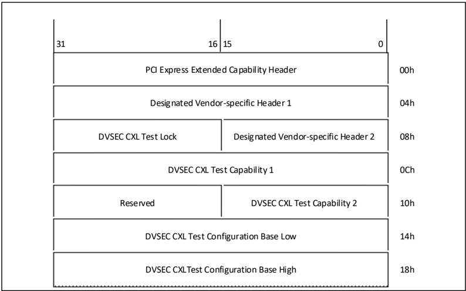

To advertise Test capabilities, the standard DVSEC register fields should be set as below:

###### Table 256. DVSEC Registers

| Register                                         | Bit Location   | Field           | Value   |
|--------------------------------------------------|----------------|-----------------|---------|
| Designated Vendor-Specific Header 1 (offset 04h) | 15:0           | DVSEC Vendor ID | 1E98h   |
| Designated Vendor-Specific Header 1 (offset 04h) | 19:16          | DVSEC Revision  | 0h      |
| Designated Vendor-Specific Header 1 (offset 04h) | 31:20          | DVSEC Length    | 22h     |
| Designated Vendor-Specific Header 2 (offset 08h) | 15:0           | DVSEC ID        | 0Ah     |

###### Table 257. DVSEC CXL Test Lock (offset 0Ah)

| Bit   | Attribute   | Description                                                                       |
|-------|-------------|-----------------------------------------------------------------------------------|
| 0     | RWO         | TestLock : Software writes 1'b1 to lock the relevant test configuration registers |
| 15:1  | N/A         | Reserved                                                                          |

###### Table 258. DVSEC CXL Test Capability1 (offset 0Ch)

|   Bit | Attribute   | Description                                                              |
|-------|-------------|--------------------------------------------------------------------------|
|     0 | RO          | SelfChecking : Set to 1 if Device supports Self Checking                 |
|     1 | RO          | Algorithm1a : Set to 1 if Device supports hardware for test Algorithm 1a |
|     2 | RO          | Algorithm1b : Set to 1 if Device supports hardware for test Algorithm 1b |
|     3 | RO          | Algorithm2 : Set to 1 if Device supports hardware for test Algorithm 2   |
| 4     | RO          | RdCurr : Set to 1 if Device supports CXL.cache and RdCurr opcodes as requester.                     |
| 5     | RO          | RdOwn : Set to 1 if Device supports CXL.cache and RdOwn opcodes as requester.                       |
| 6     | RO          | RdShared : Set to 1 if Device supports CXL.cache and RdShared opcodes as requester.                 |
| 7     | RO          | RdAny : Set to 1 if Device supports CXL.cache and RdAny opcodes as requester.                       |
| 8     | RO          | RdOwnNoData : Set to 1 if Device supports CXL.cache and RdOwnNoData opcodes as requester.           |
| 9     | RO          | ItoMWr : Set to 1 if Device supports CXL.cache and ItoMWr opcodes as requester.                     |
| 10    | RO          | MemWr : Set to 1 if Device supports CXL.cache and MemWr opcodes as requester.                       |
| 11    | RO          | CLFlush : Set to 1 if Device supports CXL.cache and CLFlush opcodes as requester.                   |
| 12    | RO          | CleanEvict : Set to 1 if Device supports CXL.cache and CleanEvict opcodes as requester.             |
| 13    | RO          | DirtyEvict : Set to 1 if Device supports CXL.cache and DirtyEvict opcodes as requester.             |
| 14    | RO          | CleanEvictNoData : Set to 1 if Device supports CXL.cache and CleanEvictNoData opcodes as requester. |
| 15    | RO          | WOWrInv : Set to 1 if Device supports CXL.cache and WOWrInv opcodes as requester.                   |
| 16    | RO          | WOWrInvF : Set to 1 if Device supports CXL.cache and WOWrInvF opcodes as requester.                 |
| 17    | RO          | WrInv : Set to 1 if Device supports CXL.cache and WrInv opcodes as requester.                       |
| 18    | RO          | CacheFlushed : Set to 1 if Device supports CXL.cache and CacheFlushed opcodes as requester.         |
| 19    | RO          | UnexpectedCompletion : Device supports sending an unexpected completion on CXL.io                   |
| 20    | RO          | CompletionTimeoutInjection : Device supports dropping a read in the completion timeout scenario     |
| 23:21 | N/A         | Reserved                                                                                            |
| 31:24 | RO          | ConfigurationSize : Size in Bytes of Test configuration control registers.                          |

###### Table 259. Device CXL Test Capability2 (Offset 10h)

| Bit   | Attribute   | Description                                                                                                                           |
|-------|-------------|---------------------------------------------------------------------------------------------------------------------------------------|
| 13:0  | RO          | CacheSize : Cache size supported by the device.                                                                                       |
| 15:14 | RO          | CacheSizeUnits : Units of advertised cache size in CacheSize field 2'b00: Bytes 2'b01: Kilobytes (KB) 2'b10: Megabytes (MB) Reserved. |

###### Table 260. DVSEC CXL Test Configuration Base Low (Offset 14h)

| Bit   | Attribute   | Description                                                                                                                                                                                                                    |
|-------|-------------|--------------------------------------------------------------------------------------------------------------------------------------------------------------------------------------------------------------------------------|
| 0     | RO          | MemorySpaceIndicator : The test configuration registers are in memory space. Device must hardwire this to 1'b0                                                                                                                 |
| 2:1   | RO          | Type : 2'b00: Base register is 32-bit wide and can be mapped anywhere in the 32-bit address space. 2'b01: Reserved 2'b10: Base register is 64-bit wide and can be mapped anywhere in the 64-bit address space. 2'b11: Reserved |
| 3     | RO          | Reserved : Device must hardwire this bit to 1'b0                                                                                                                                                                               |
| 31:4  | RW          | BaseLow : bits [31:4] of the base address where the test configuration registers exist.                                                                                                                                        |

###### Table 261. DVSEC CXL Test Configuration Base High (Offset 18h)

| Bit   | Attribute   | Description                                                                               |
|-------|-------------|-------------------------------------------------------------------------------------------|
| 31:0  | RW          | BaseHigh : Bits [63:32] of the base address where the test configuration registers exist. |

#### 14.16.2 Device Capabilities to Support the Test Algorithms

This section lays out the configuration registers required in the application layer of the device that enable execute/verify/debug of the above Algorithms. These registers are memory mapped and the base is given by the capability structure defined in previous sections. Default value of all register bits must be 0. All the registers that have a 'RWL' attribute should be locked when DVSEC Test Lock is 1'b1.

##### Table 262. Register 1: StartAddress1 (Offset 00h)

| Bit   | Attribute   | Description                                                                                                                                                                                                                      |
|-------|-------------|----------------------------------------------------------------------------------------------------------------------------------------------------------------------------------------------------------------------------------|
| 63:0  | RW          | StartAddress1 : Indicates the start address 'X1' of the corresponding set in Algorithms 1a,1b, and 2. This could be Host attached memory, device attached memory (if applicable), or an invalid address to test Go- Err support. |

##### Table 263. Register 2: WriteBackAddress1 (Offset 08h)

| Bit   | Attribute   | Description                                                                                                                                                                                                                                                       |
|-------|-------------|-------------------------------------------------------------------------------------------------------------------------------------------------------------------------------------------------------------------------------------------------------------------|
| 63:0  | RW          | WriteBackAddress1 : Indicates the start address 'Z1' of the corresponding set in Algorithms 1a and 1b. This register is only used if device is NOT self-checking, or if self-checking is disabled on the device. This address should map to Host attached memory. |

##### Table 264. Register 3: Increment (Offset 10h)

| Bit   | Attribute   | Description                                                                                                                                                                                                                                                                                  |
|-------|-------------|----------------------------------------------------------------------------------------------------------------------------------------------------------------------------------------------------------------------------------------------------------------------------------------------|
| 31:0  | RW          | AddressIncrement : Indicates the increment for address 'Y' in Algorithms 1a,1b and 2. The value in this register should be left shifted by 6 bits before using as address increment. Example, a value of 1'b1 implies increment granularity of 7'b1000000 (cacheline increments)             |
| 63:32 | RW          | SetOffset : Indicates the set offset increment for address 'X' and 'Z' in Algorithms 1a,1b and 2. The value in this register should be left shifted by 6 bits before using as address increment. Example, a value of 1'b1 implies increment granularity of 7'b1000000 (cacheline increments) |

##### Table 265. Register 4: Pattern (Offset 18h)

| Bit   | Attribute   | Description                                                                 |
|-------|-------------|-----------------------------------------------------------------------------|
| 31:0  | RW          | Pattern1 : Indicates the pattern 'P' as defined in Algorithms 1a,1b, and 2. |
| 63:32 | RW          | Pattern2 : Indicates the pattern 'B' as defined in Algorithm 1b.            |

##### Table 266. Register 5: ByteMask (Offset 20h)

| Bit   | Attribute   | Description                                                                                                                                                                                                      |
|-------|-------------|------------------------------------------------------------------------------------------------------------------------------------------------------------------------------------------------------------------|
| 63:0  | RW          | ByteMask : 1 bit per byte of the cacheline to indicate which bytes of the cacheline are modified by the device in Algorithms 1a, 1b and 2. This will be programmed consistently with the StartAddress1 register. |

##### Table 267. Register 6: PatternConfiguration (Offset 28h)

| Bit   | Attribute   | Description                                                                                                                                                                                                                                                                                                                                                                                          |
|-------|-------------|------------------------------------------------------------------------------------------------------------------------------------------------------------------------------------------------------------------------------------------------------------------------------------------------------------------------------------------------------------------------------------------------------|
| 2:0   | RW          | PatternSize : Defines what size (in bytes) of 'P' or 'B' to use starting from least significant byte. As an example, if this is programmed to 3'b011, only the lower 3 bytes of 'P' and 'B' registers will be used as the pattern. This will be programmed consistently with the ByteMask field, for example, in the given example, the ByteMask would always be in sets of three consecutive bytes. |
| 3     | RW          | PatternParameter : If this field is programmed to 1'b1, device hardware must continue to use the incremented value of patterns (P+N+1) as the base pattern of the next set iteration. If this field is programmed to 1'b0, device hardware must use the original pattern 'P' for every new set iteration.                                                                                            |
| 63:4  | N/A         | Reserved                                                                                                                                                                                                                                                                                                                                                                                             |

##### Table 268. Register 7: AlgorithmConfiguration (Offset 30h)

| Bit   | Attribute   | Description                                                                                                                                                                                                                                                                                                                                                                                                                                                                                                                                                                                                                                                                                                                                                                                                                                                                                                                                                                                                                                 |
|-------|-------------|---------------------------------------------------------------------------------------------------------------------------------------------------------------------------------------------------------------------------------------------------------------------------------------------------------------------------------------------------------------------------------------------------------------------------------------------------------------------------------------------------------------------------------------------------------------------------------------------------------------------------------------------------------------------------------------------------------------------------------------------------------------------------------------------------------------------------------------------------------------------------------------------------------------------------------------------------------------------------------------------------------------------------------------------|
| 2:0   | RWL         | Algorithm : 3'b000 - Disabled - serves as a way to stop test. 3'b001 - Algorithm 1a: Multiple Write Streaming 3'b010 - Algorithm 1b: Multiple Write Streaming with Bogus writes 3'b100 - Algorithm 2: Producer Consumer Test Rest are reserved. Implementation Notes: Software will setup all of the other registers (address, patterns, byte-masks etc.) before it writes to this field to start the test. A value of 3'b001, 3'b010, 3'b100 in this field starts the corresponding Algorithm on the device from iteration 0, set 0. No action must be taken by device hardware if a reserved value is programmed. While a test is running, software can write to this field to stop the test. If this happens, device must gracefully complete the current execute and verification loop and then stop the hardware from issuing any more requests to the Host. If software subsequently programs it to any of the other valid values, device hardware must execute the corresponding Algorithm from a fresh loop (iteration 0 on set 0). |
| 3     | RW          | SelfChecking : 1'b0 - device is not going to perform self-checking. 1'b1 - Device is going to perform self-checking in the Verify phase for Algorithms 1 and 2.                                                                                                                                                                                                                                                                                                                                                                                                                                                                                                                                                                                                                                                                                                                                                                                                                                                                             |
| 7:4   | RW          | Reserved                                                                                                                                                                                                                                                                                                                                                                                                                                                                                                                                                                                                                                                                                                                                                                                                                                                                                                                                                                                                                                    |
| 15:8  | RW          | NumberOfAddrIncrements : Sets the value of 'N' for all 3 Algorithms. A value of 0 implies only the first write (base address) is going to be issued by device.                                                                                                                                                                                                                                                                                                                                                                                                                                                                                                                                                                                                                                                                                                                                                                                                                                                                              |
| 23:16 | RW          | NumberOfSets : A value of 0 implies that only the first write is going to be issued by the device. If both NumberOfAddIncrements and NumberOfSets is zero, only a single transaction (to the base address) should be issued by the device [NumberOfLoops should be set to 1 for this case]. For Algorithm 1a and 1b: Bits 19:16 gives the number of sets. Bits 23:20 give the number of bogus writes 'J' in Algorithm 1b. For Algorithm 2: Bits 23:16 gives the number of iterations 'i'                                                                                                                                                                                                                                                                                                                                                                                                                                                                                                                                                    |
| 31:24 | RW          | NumberOfLoops : If set to 0, device continues looping across address and set increments indefinitely. Otherwise, it indicates the number of loops to run through for address and set increments.                                                                                                                                                                                                                                                                                                                                                                                                                                                                                                                                                                                                                                                                                                                                                                                                                                            |
| 32    | RW          | AddressIsVirtual : If set to 1, indicates that all programmed addresses are virtual and need to be translated by the device (via ATS). Useful for testing virtualization/device TLBs                                                                                                                                                                                                                                                                                                                                                                                                                                                                                                                                                                                                                                                                                                                                                                                                                                                        |
| 35:33 | RW          | Protocol : 3'b000 - PCIe mode 3'b001 - CXL.io only 3'b010 - CXL.cache only 3'b100 - CXL.cache and CXL.io [support is optional and device is free to interleave writes at iteration or set granularity]                                                                                                                                                                                                                                                                                                                                                                                                                                                                                                                                                                                                                                                                                                                                                                                                                                      |
| 39:36 | RW          | WriteSemanticsCache : Only applicable when Protocol ==3'b010 or 3'b100. In the encodings below, dirty writes can mean evictions or flush depending on device behavior. 4'b0000 - Dirty Writes use ItoMWr, Clean Writes use CleanEvict [Clean writes will occur if PatternSize==0] 4'b0001 - Dirty Writes use MemWr, Clean Writes use CleanEvictNoData 4'b0010 - Dirty Writes use DirtyEvict 4'b0011 - Dirty Writes use WOWrInv 4'b0100 - Dirty Writes use WOWrInvF [only programmed by test software if Device is expected to own/ modify the full cacheline] 4'b0101 - Dirty Writes use WrInv 4'b0110 - Dirty Writes use ClFlush 4'b0111 - Dirty Writes/Clean Writes can use any of CXL.cache supported opcodes. Device implementation specific. All other encodings are reserved; and device hardware should not take any actions if this has been |
| 40    | RWL         | FlushCache : Test software can program this value at runtime to trigger a cache flush from Device and issue CacheFlush opcode. Execute/Verify loops must stop after completing the current loop and CacheFlushed has been issued, until software changes this value back to 1'b0 - after which, device hardware should resume execute/verify loops from the next iteration/set [it must remember the iteration and set value where execution stopped].                                                                                                                                                                                                                                                                                                                                                                                               |
| 43:41 | RW          | ExecuteReadSemanticsCache : Only applicable when Protocol ==3'b010 or 3'b100. 3'b000: Ownership reads use RdOwn 3'b001: Ownership reads use RdAny 3'b010: Ownership reads use RdOwnNoData [only programmed by test software if device is expected to modify the entire cacheline] 3'b100: Device can use any of the CXL.cache supported opcodes All other encodings are reserved, and should not start execute/verify loops if programmed.                                                                                                                                                                                                                                                                                                                                                                                                           |
| 46:44 | RW          | VerifyReadSemanticsCache : Read opcodes used when device is in Verify phase. 3'b000: RdCurr 3'b001: RdShared 3'b010: RdOwn 3'b100: RdAny All other encodings are reserved, and should not start execute/verify loops if programmed.                                                                                                                                                                                                                                                                                                                                                                                                                                                                                                                                                                                                                  |
| 63:47 | N/A         | Reserved                                                                                                                                                                                                                                                                                                                                                                                                                                                                                                                                                                                                                                                                                                                                                                                                                                             |

##### Table 269. Register 8: DeviceErrorInjection (Offset 38h)

| Bit   | Attribute   | Description                                                                                                                                                                                                                                                                                 |
|-------|-------------|---------------------------------------------------------------------------------------------------------------------------------------------------------------------------------------------------------------------------------------------------------------------------------------------|
| 0     | RWL         | UnexpectedCompletionInjection : Software writes 0x1 to this bit to trigger a completion injection on a message in the Tx direction. Hardware must inject an unexpected completion by sending the same completion twice.                                                                     |
| 1     | RO-V        | UnexpectedCompletionInjectionBusy : Hardware loads 1'b1 to this bit when the Start bit is written. Hardware must clear this bit to indicate that it has indeed finished error injections. Software is permitted to poll on this bit to find out when hardware has finished error injection. |
| 2     | RWL         | CompleterTimeout Software writes 0x1 to this bit to trigger a completer timeout injection on a message in the Tx direction. Hardware must suppress the transmission of completion packet.                                                                                                   |
| 3     | RO-V        | CompleterTimeoutInjectionBusy : Hardware loads 1'b1 to this bit when the Start bit is written. Hardware must clear this bit to indicate that it has indeed finished error injections. Software is permitted to poll on this bit to find out when hardware has finished error injection.     |
| 31:4  | N/A         | Reserved                                                                                                                                                                                                                                                                                    |

#### 14.16.3 Debug Capabilities in Device

##### 14.16.3.1 Error Logging

The following capabilities in a device are strongly recommended to support ease of verification and compliance testing.

A device that supports self-checking must include an error status and header log register with the following fields:

###### Table 270. Register 9: ErrorLog1 (Offset 40h)

| Bit   | Attribute   | Description                                                     |
|-------|-------------|-----------------------------------------------------------------|
| 31:0  | RW          | ExpectedPattern : Expected data pattern as per device hardware. |
| 63:32 | RW          | ObservedPattern : Observed data pattern as per device hardware. |

###### Table 271. Register 10: ErrorLog2 (Offset 48h)

| Bit   | Attribute   | Description                                                     |
|-------|-------------|-----------------------------------------------------------------|
| 31:0  | RW          | ExpectedPattern : Expected data pattern as per device hardware. |
| 63:32 | RW          | ObservedPattern : Observed data pattern as per device hardware. |

###### Table 272. Register 11: ErrorLog3 (Offset 50h)

| Bit   | Attribute   | Description                                                                               |
|-------|-------------|-------------------------------------------------------------------------------------------|
| 7:0   | RW          | ByteOffset : First byte offset within the cacheline where the data mismatch was observed. |
| 15:8  | RW          | LoopNum : Loop number where data mismatch was observed.                                   |
| 16    | RW1C        | ErrorStatus : Set to 1 by device if data miscompare was observed                          |

##### 14.16.3.2 Event Monitors

It is strongly recommended that a device advertise at least 2 event monitors, which can be used to count device-defined events. An event monitor consists of two 64 bit registers:
    - a. An event controller: EventCtrl
    - b. An event counter: EventCount

The usage model is for software to program EventCtrl to count an event of interest, and then read the EventCount to determine how many times the event has occurred. At a minimum, a device must implement the ClockTicks event. When the ClockTicks event is selected via the event controller, the event counter will increment every clock cycle, based on the application layer's clock. Further suggested events may be published in the future. Examples of other events that a device may choose to implement are:
    - a. Number of times a particular opcode is sent or received
    - b. Number of retries or CRC errors
    - c. Number of credit returns sent or received
    - d. Device-specific events that may help visibility on the platform or with statistical computation of performance

Below are the formats of the EventCtrl and EventCount registers.

###### Table 273. Register 12: EventCtrl (Offset 60h)

| Bit   | Attribute   | Description                                                                                                                                                                                                                                                                                                                                                                                             |
|-------|-------------|---------------------------------------------------------------------------------------------------------------------------------------------------------------------------------------------------------------------------------------------------------------------------------------------------------------------------------------------------------------------------------------------------------|
| 7:0   | RW          | EventSelect : Field to select which of the available events should be counted in the paired EventCount register.                                                                                                                                                                                                                                                                                        |
| 15:8  | RW          | SubEventSelect : Field to select which sub-conditions of an event should be counted in the paired EventCount register. This field is a bit-mask, where each bit represents a different condition. The EventCount should increment if any of the selected sub-conditions occurs. For example, an event might be 'transactions received', with three sub-conditions of 'read', 'write', and 'completion'. |
| 16    | N/A         | Reserved                                                                                                                                                                                                                                                                                                                                                                                                |
| 17    | RW          | Reset: When set to 1, the paired EventCount register will be cleared to 0. Writing a 0 to this bit has no effect.                                                                                                                                                                                                                                                                                       |
| 18    | RW          | EdgeDetect : When this bit is 0, the counter will increment in each cycle that the event has occurred. When set to 1, the counter will increment when a 0 to 1 transition (i.e., rising edge) is detect.                                                                                                                                                                                                |
| 63:19 | N/A         | Reserved                                                                                                                                                                                                                                                                                                                                                                                                |

###### Table 274. Register 13: EventCount (Offset 68h)

| Bit   | Attribute   | Description                                                                                                                                                                                                                                                                                            |
|-------|-------------|--------------------------------------------------------------------------------------------------------------------------------------------------------------------------------------------------------------------------------------------------------------------------------------------------------|
| 63:0  | RO          | EventCount : Hardware load register which is updated with a running count of the occurrences of the event programmed in the EventCtrl register. It is monotonically increasing, unless software explicitly writes it to a lower value or writes to the 'Reset' field of the paired EventCtrl register. |

#### 14.16.4 Compliance Mode DOE (Optional)

Device 0, Function 0, of a CXL device must support the DOE mailbox for the compliance modes to be controlled through it. The Vendor ID must be set to the CXL Vendor ID to indicate that this Object type is defined by the CXL specification. The Data Object Type must be set to 0h to advertise that this is a Compliance Mode type of data object.

##### Table 275. Compliance Mode - Data Object Header

| Field            | Bit Location   | Value   |
|------------------|----------------|---------|
| Vendor ID        | 15:0           | 1E98h   |
| Data Object Type | 23:16          | 0h      |

##### Table 276. Compliance Mode Return Values

| Value      | Description                    |
|------------|--------------------------------|
| 0x00000000 | Success                        |
| 0x00000001 | Not Authorized                 |
| 0x00000002 | Unknown Failure                |
| 0x00000003 | Unsupported injection function |
| 0x00000004 | Internal Error                 |
| 0x00000005 | Target busy                    |
| 0x00000006 | Target Not Initialized         |

##### 14.16.4.1 Compliance Mode Capability

Request and response pair for determining the compliance capabilities of the device

###### Table 277. Compliance Mode Availability Request

| Data Object Byte Offset   |   Length | Description                          |
|---------------------------|----------|--------------------------------------|
| 0h                        |        8 | Standard DOE Request Header          |
| 8h                        |        1 | Request Code = 0, Query Capabilities |
| 9h                        |        1 | Version of Capability requested      |
| 0Ah                       |        2 | Reserved                             |

###### Table 278. Compliance Mode Availability Response

| Data Object Byte Offset   |   Length | Description                               |
|---------------------------|----------|-------------------------------------------|
| 0h                        |        8 | Standard DOE Request Header               |
| 8h                        |        1 | Response Code = 0, Query Capabilities     |
| 9h                        |        1 | Version of Capability Returned            |
| 0Ah                       |        1 | Length of Capability Package              |
| 0Bh                       |        1 | Status: See table 192 for error codes     |
| 0CH                       |        8 | Available Compliance Capabilities bitmask |
| 014h                      |        8 | Enabled Compliance Capabilities bitmask   |

##### 14.16.4.2 Compliance Mode Status

Shows which compliance mode capabilities are enabled or in use.

###### Table 279. Compliance Mode Status

| Data Object Byte Offset   |   Length | Description                     |
|---------------------------|----------|---------------------------------|
| 0h                        |        8 | Standard DOE Request Header     |
| 8h                        |        1 | Request Code = 1, Query Status  |
| 9h                        |        1 | Version of Capability requested |
| 0Ah                       |        2 | Reserved                        |

###### Table 280. Compliance Mode Status Response

| Data Object Byte Offset   |   Length | Description                           |
|---------------------------|----------|---------------------------------------|
| 0h                        |        8 | Standard DOE Header                   |
| 8h                        |        1 | Response Code = 1, Query Capabilities |
| 9h                        |        1 | Version of Capability Returned        |
| 0Ah                       |        1 | Length of Capability Package          |
| 0Bh                       |        4 | Capability bitfield                   |
| 0Eh                       |        2 | Cache Size                            |
| 10h                       |        1 | Cache Size Units                      |

##### 14.16.4.3 Compliance Mode Halt All

###### Table 281. Compliance Mode Halt All

| Data Object Byte Offset   |   Length | Description                     |
|---------------------------|----------|---------------------------------|
| 0h                        |        8 | Standard DOE Request Header     |
| 8h                        |        1 | Request Code = 2, Halt All      |
| 9h                        |        1 | Version of Capability requested |
| 0Ah                       |        2 | Reserved                        |

###### Table 282. Compliance Mode Halt All Response

| Data Object Byte Offset   |   Length | Description                           |
|---------------------------|----------|---------------------------------------|
| 0h                        |        8 | Standard DOE Request Header           |
| 8h                        |        1 | Response Code = 2, Halt All           |
| 9h                        |        1 | Version of Capability Returned        |
| 0Ah                       |        1 | Length of Capability Package          |
| 0Bh                       |        1 | Status: See table 192 for error codes |

##### 14.16.4.4 Compliance Mode Multiple Write Streaming

###### Table 283. Enable Multiple Write Streaming Algorithm on the Device

| Data Object Byte Offset   |   Length | Description                                |
|---------------------------|----------|--------------------------------------------|
| 0h                        |        8 | Standard DOE Request Header                |
| 8h                        |        1 | Request Code = 3, Multiple Write Streaming |
| 9h                        |        1 | Version                                    |
| 0Ah                       |        2 | Reserved                                   |
| 0Ch                       |        1 | Protocol                                   |
| 0Dh                       |        1 | Virtual Address                            |
| 0Eh                       |        1 | Self-checking                              |
| 0Fh                       |        1 | Verify Read Semantics                      |
| 10h                       |        1 | Num Increments                             |
| 11h                       |        1 | Num Sets                                   |
| 12h                       |        1 | Num Loops                                  |
| 13h                       |        1 | Reserved                                   |
| 14h                       |        8 | Start Address                              |
| 1Ch                       |        8 | Write Address                              |
| 24h                       |        8 | Writeback Address                          |
| 2Ch                       |        8 | Byte Mask                                  |
| 34h                       |        4 | Address Increment                          |
| 38h                       |        4 | Set Offset                                 |
| 3Ch                       |        4 | Pattern 'P'                                |
| 40h                       |        4 | Increment Pattern 'B'                      |

###### Table 284. Compliance Mode Multiple Write Streaming Response

| Data Object Byte Offset   |   Length | Description                                 |
|---------------------------|----------|---------------------------------------------|
| 0h                        |        8 | Standard DOE Request Header                 |
| 8h                        |        1 | Response Code = 3, Multiple Write Streaming |
| 9h                        |        1 | Version of Capability Returned              |
| 0Ah                       |        1 | Length of Capability Package                |
| 0Bh                       |        1 | Status: See table 192 for error codes       |

##### 14.16.4.5 Compliance Mode Producer Consumer

###### Table 285. Enable Producer Consumer Algorithm on the Device

| Data Object Byte Offset   |   Length | Description                         |
|---------------------------|----------|-------------------------------------|
| 0h                        |        8 | Standard DOE Request Header         |
| 8h                        |        1 | Request Code = 4, Producer Consumer |
| 9h                        |        1 | Version                             |
| 0Ah                       |        2 | Reserved                            |
| 0Ch                       |        1 | Protocol                            |
| 0Dh                       |        1 | Num Increments                      |
| 0Eh                       |        1 | Num Sets                            |
| 0Fh                       |        1 | Num Loops                           |
| 10h                       |        1 | Write Semantics                     |
| 11h                       |        3 | Reserved                            |
| 14h                       |        8 | Start Address                       |
| 1Ch                       |        8 | Byte Mask                           |
| 24h                       |        4 | Address Increment                   |
| 28h                       |        4 | Set Offset                          |
| 2Ch                       |        4 | Pattern                             |

###### Table 286. Compliance Mode Producer Consumer Response

| Data Object Byte Offset   |   Length | Description                           |
|---------------------------|----------|---------------------------------------|
| 0h                        |        8 | Standard DOE Request Header           |
| 8h                        |        1 | Response Code = 4, Producer Consumer  |
| 9h                        |        1 | Version of Capability Returned        |
| 0Ah                       |        1 | Length of Capability Package          |
| 0Bh                       |        1 | Status: See table 192 for error codes |

##### 14.16.4.6 Bogus Writes

###### Table 287. Enable Bogus Writes Injection into Compliance Mode Write Stream Algorithms

| Data Object Byte Offset   |   Length | Description                    |
|---------------------------|----------|--------------------------------|
| 0h                        |        8 | Standard DOE Request Header    |
| 8h                        |        1 | Request Code = 5, Bogus Writes |
| 9h                        |        1 | Version                        |
| 0Ah                       |        2 | Reserved                       |
| 0Ch                       |        1 | Bogus Writes Count             |
| 0Dh                       |        1 | Reserved                       |
| 0Eh                       |        4 | Bogus Write Pattern            |

###### Table 288. Inject Bogus Writes Response

| Data Object Byte Offset   |   Length | Description                           |
|---------------------------|----------|---------------------------------------|
| 0h                        |        8 | Standard DOE Request Header           |
| 8h                        |        1 | Response Code = 5, Bogus Writes       |
| 9h                        |        1 | Version of Capability Returned        |
| 0Ah                       |        1 | Length of Capability Package          |
| 0Bh                       |        1 | Status: See table 192 for error codes |

##### 14.16.4.7 Inject Poison

###### Table 289. Enable Poison Injection into

| Data Object Byte Offset   |   Length | Description                        |
|---------------------------|----------|------------------------------------|
| 0h                        |        8 | Standard DOE Request Header        |
| 8h                        |        1 | Request Code = 6, Poison Injection |
| 9h                        |        1 | Version                            |
| 0Ah                       |        2 | Reserved                           |
| 0Ch                       |        1 | Protocol 0=io, 1 = cache, 2= mem   |

###### Table 290. Poison Injection Response

| Data Object Byte Offset   |   Length | Description                           |
|---------------------------|----------|---------------------------------------|
| 0h                        |        8 | Standard DOE Request Header           |
| 8h                        |        1 | Response Code = 6, Poison Injection   |
| 9h                        |        1 | Version of Capability Returned        |
| 0Ah                       |        1 | Length of Capability Package          |
| 0Bh                       |        1 | Status: See table 192 for error codes |

##### 14.16.4.8 Inject CRC

###### Table 291. Enable CRC Error into Traffic

| Data Object Byte Offset   |   Length | Description                        |
|---------------------------|----------|------------------------------------|
| 0h                        |        8 | Standard DOE Request Header        |
| 8h                        |        1 | Request Code = 7, Poison Injection |
| 9h                        |        1 | Version                            |
| 0Ah                       |        2 | Reserved                           |
| 0Ch                       |        1 | Num Bits Flipped                   |
| 0Dh                       |        1 | Num Flits Injected                 |

###### Table 292. CRC Injection Response

| Data Object Byte Offset   |   Length | Description                           |
|---------------------------|----------|---------------------------------------|
| 0h                        |        8 | Standard DOE Request Header           |
| 8h                        |        1 | Response Code = 7, CRC Injection      |
| 9h                        |        1 | Version of Capability Returned        |
| 0Ah                       |        1 | Length of Capability Package          |
| 0Bh                       |        1 | Status: See table 192 for error codes |

##### 14.16.4.9 Inject Flow Control

###### Table 293. Enable Flow Control injection

| Data Object Byte Offset   |   Length | Description                        |
|---------------------------|----------|------------------------------------|
| 0h                        |        8 | Standard DOE Request Header        |
| 8h                        |        1 | Request Code = 8, Poison Injection |
| 9h                        |        1 | Version                            |
| 0Ah                       |        2 | Reserved                           |
| 0Ch                       |        1 | Inject Flow Control                |

###### Table 294. Flow Control Injection Response

| Data Object Byte Offset   |   Length | Description                           |
|---------------------------|----------|---------------------------------------|
| 0h                        |        8 | Standard DOE Request Header           |
| 8h                        |        1 | Response Code = 8, Bogus Writes       |
| 9h                        |        1 | Version of Capability Returned        |
| 0Ah                       |        1 | Length of Capability Package          |
| 0Bh                       |        1 | Status: See table 192 for error codes |

##### 14.16.4.10 Toggle Cache Flush

###### Table 295. Enable Cache Flush Injection

| Data Object Byte Offset   |   Length | Description                                   |
|---------------------------|----------|-----------------------------------------------|
| 0h                        |        8 | Standard DOE Request Header                   |
| 8h                        |        1 | Request Code = 9, Cache Flush                 |
| 9h                        |        1 | Version                                       |
| 0Ah                       |        2 | Reserved                                      |
| 0Ch                       |        1 | 0 Cache Flush Disabled, 1 Cache Flush enabled |

###### Table 296. Cache Flush Injection Response

| Data Object Byte Offset   |   Length | Description                           |
|---------------------------|----------|---------------------------------------|
| 0h                        |        8 | Standard DOE Request Header           |
| 8h                        |        1 | Response Code = 09h Cache Flush       |
| 9h                        |        1 | Version of Capability Returned        |
| 0Ah                       |        1 | Length of Capability Package          |
| 0Bh                       |        1 | Status: See table 192 for error codes |

##### 14.16.4.11 Inject MAC Delay

Delay MAC on IDE secure link until it no longer meets spec, flit 6+

###### Table 297. MAC Delay Injection

| Data Object Byte Offset   |   Length | Description                                               |
|---------------------------|----------|-----------------------------------------------------------|
| 0h                        |        8 | Standard DOE Request Header                               |
| 8h                        |        1 | Request Code = 0Ah, Delay MAC                             |
| 9h                        |        1 | Version                                                   |
| 0Ah                       |        2 | Reserved                                                  |
| 0Ch                       |        1 | 1 = enable MAC Delap, 0 = disable                         |
| 0Dh                       |        1 | Mode: 0 = CXL.io, 1 = CXL.cachemem                        |
| 0Eh                       |        1 | Delay: Number of flits to delay MAC. 6+ = error condition |

###### Table 298. MAC Delay Response

| Data Object Byte Offset   |   Length | Description                                            |
|---------------------------|----------|--------------------------------------------------------|
| 0h                        |        8 | Standard DOE Request Header                            |
| 8h                        |        1 | Response Code = 0Ah, MAC delay injection               |
| 9h                        |        1 | Version of Capability Returned                         |
| 0Ah                       |        1 | Length of Capability Package                           |
| 0Bh                       |        1 | Status: 0 = success, see table y for other error codes |

##### 14.16.4.12 Insert Unexpected MAC

Insert an unexpected MAC on a non-IDE secured channel

###### Table 299. Unexpected MAC Injection

| Data Object Byte Offset   |   Length | Description                                         |
|---------------------------|----------|-----------------------------------------------------|
| 0h                        |        8 | Standard DOE Request Header                         |
| 8h                        |        1 | Request Code = 0Bh, Unexpected MAC injection        |
| 9h                        |        1 | Version                                             |
| 0Ah                       |        2 | Reserved                                            |
| 0Ch                       |        1 | 0 = disable, 1 = insert message, 2 = delete message |
| 0Dh                       |        1 | Mode: 0 = CXL.io, 1 = CXL.cachemem                  |

###### Table 300. Unexpected MAC Injection Response

| Data Object Byte Offset   |   Length | Description                                   |
|---------------------------|----------|-----------------------------------------------|
| 0h                        |        8 | Standard DOE Request Header                   |
| 8h                        |        1 | Response Code = 0Bh, Unexpected MAC injection |
| 9h                        |        1 | Version of Capability Returned                |
| 0Ah                       |        1 | Length of Capability Package                  |

##### 14.16.4.13 Inject Viral

###### Table 301. Enable Viral Injection

| Data Object Byte Offset   |   Length | Description                                      |
|---------------------------|----------|--------------------------------------------------|
| 0h                        |        8 | Standard DOE Request Header                      |
| 8h                        |        1 | Request Code = 0Ch, Inject Viral                 |
| 9h                        |        1 | Version                                          |
| 0Ah                       |        2 | Reserved                                         |
| 0Ch                       |        1 | Protocol: 0 = clx.io, 1 = clx.cache, 2 = cxl.mem |

###### Table 302. Flow Control Injection Response

| Data Object Byte Offset   |   Length | Description                                            |
|---------------------------|----------|--------------------------------------------------------|
| 0h                        |        8 | Standard DOE Request Header                            |
| 8h                        |        1 | Response Code = 0Ch, Inject Viral                      |
| 9h                        |        1 | Version of Capability Returned                         |
| 0Ah                       |        1 | Length of Capability Package                           |
| 0Bh                       |        1 | Status: 0 = success, see table y for other error codes |

##### 14.16.4.14 Inject ALMP in Any State

Insert an ALMP in ARBMUX regardless of state

###### Table 303. Inject ALMP Request

| Data Object Byte Offset   |   Length | Description                                  |
|---------------------------|----------|----------------------------------------------|
| 0h                        |        8 | Standard DOE Request Header                  |
| 8h                        |        1 | Request Code = 0Dh, Inject ALMP in any state |
| 9h                        |        1 | Version                                      |
| 0Ah                       |        2 | Reserved                                     |
| 0Ch                       |        1 | 0 = disable, 1 = insert ALMP                 |
| 0Dh-0Fh                   |          | Reserved                                     |

###### Table 304. Inject ALMP Response

| Data Object Byte Offset   |   Length | Description                                   |
|---------------------------|----------|-----------------------------------------------|
| 0h                        |        8 | Standard DOE Request Header                   |
| 8h                        |        1 | Response Code = 0Dh, Inject ALMP in any state |
| 9h                        |        1 | Version of Capability Returned                |
| 0Ah-0Fh                   |          | Reserved                                      |

##### 14.16.4.15 Ignore Received ALMP

Ignore the next ALMPs received

###### Table 305. Ignore Received ALMP Request

| Data Object Byte Offset   |   Length | Description                               |
|---------------------------|----------|-------------------------------------------|
| 0h                        |        8 | Standard DOE Request Header               |
| 8h                        |        1 | Request Code = 0Eh, Ignore received ALMPs |
| 9h                        |        1 | Version                                   |
| 0Ah                       |        2 | Reserved                                  |
| 0Ch                       |        1 | 0 = disable, 1 = ignore ALMPs             |
| 0Dh-0Fh                   |          | Reserved                                  |

###### Table 306. Ignore Received ALMP Response

| Data Object Byte Offset   |   Length | Description                                |
|---------------------------|----------|--------------------------------------------|
| 0h                        |        8 | Standard DOE Request Header                |
| 8h                        |        1 | Response Code = 0Eh, Ignore received ALMPs |
| 9h                        |        1 | Version of Capability Returned             |
| 0Ah-0Fh                   |          | Reserved                                   |

##### 14.16.4.16 Inject Bit Error in Flit

Inject a single bit error into the lower 16 bytes of a 528-bit flit.

###### Table 307. Inject Bit Error in Flit Request

| Data Object Byte Offset   |   Length | Description                                                                |
|---------------------------|----------|----------------------------------------------------------------------------|
| 0h                        |        8 | Standard DOE Request Header                                                |
| 8h                        |        1 | Request Code = 0Fh, Inject Bit Error in Flit                               |
| 9h                        |        1 | Version                                                                    |
| 0Ah                       |        2 | Reserved                                                                   |
| 0Ch                       |        1 | 0 = disable/ no action taken, 1 = Inject single Bit error in next 528 Flit |
| 0Dh-0Fh                   |          | Reserved                                                                   |

###### Table 308. Inject Bit Error in Flit Response

| Data Object Byte Offset   |   Length | Description                                   |
|---------------------------|----------|-----------------------------------------------|
| 0h                        |        8 | Standard DOE Request Header                   |
| 8h                        |        1 | Response Code = 0Fh, Inject Bit Error in Flit |
| 9h                        |        1 | Version of Capability Returned                |
| 0Ah-0Fh                   |          | Reserved                                      |

## Appendix A Taxonomy

### A.1 Accelerator Usage Taxonomy

#### Table 309. Accelerator Usage Taxonomy

| Accelerator Type                                                                                                  | Description                                                                                                                                                                             | Challenges & Opportunities                                                                                                                                                                                                                       | CXL Support                                                         |
|-------------------------------------------------------------------------------------------------------------------|-----------------------------------------------------------------------------------------------------------------------------------------------------------------------------------------|--------------------------------------------------------------------------------------------------------------------------------------------------------------------------------------------------------------------------------------------------|---------------------------------------------------------------------|
| Producer-Consumer Accelerators that don't execute against 'Memory' without special requirements                   | Work on data streams or large contiguous data objects. Little interaction with host Standard P/C ordering model works well.                                                             | Efficient work submission Efficient exchange of meta- data (flow control)                                                                                                                                                                        | Basic PCIe + AiA CXL.io                                             |
| Producer-Consumer Plus Accelerators that don't execute against 'Memory' with special requirements                 | Same as above, but… P/C ordering model doesn't work well Need special data operations such as atomics                                                                                   | Device Coherency can be used to implement varied ordering models and special data operations                                                                                                                                                     | CXL.cache on CXL w/ baseline snoop filter support CXL.io CXL.cache  |
| Software Assisted SVM Memory Accelerators that execute against 'Memory' with software supportable data management | Local memory is often needed for bandwidth or latency predictability Little interaction with the host Data management easily implemented in software, e.g., few and simple data buffers | Host software should be able to interact directly with accelerator memory (SVM, Google) Reduce copies, replication, pinning Optimizing coherency impact on performance is a challenge Software can provide best optimization of coherency impact | CXL Bias model with software managed bias. CXL.io CXL.cache CXL.mem |
| Autonomous SVM Memory Accelerators that execute against 'Memory' where software supported data management is impractical               | Local memory often needed for bandwidth or latency predictability Interaction with the host is common Data movement very difficult to manage in software, e.g., sparse data structures, pointer based data structures, etc.                                  | Host software should be able to interact directly with accelerator memory (SVM) Reduce copies, replication, pinning Optimizing coherency impact on performance is a challenge Cannot count on software for bias management | CXL Bias model with hardware managed bias. CXL.io CXL.cache CXL.mem            |
| Giant Cache Accelerators that execute against 'Memory' where local memory and caching is required.                                     | Local memory needed for bandwidth or latency predictability Data footprint is larger than local memory Interaction with the host is common Data must be cycled through accelerator memory in small blocks Data movement very difficult to manage in software | Accelerator memory needs to work like a cache (not SVM/system memory) Ideally cache misses detected in hardware, but cache replacements can be managed in software                                                         | CXL.cache on CXL w/ 'Enhanced Directory' snoop filter support CXL.io CXL.cache |
| Disaggregated Memory Controller Typically for memory controllers with remote persistent memory, which may be in 2LM or App Direct mode | PCIe semantics needed for device enumeration, driver support and device management Most operational flows rely on being able to communicate directly with a Home Device or Near Memory Controller on the Host                                                | Device needs high bandwidth and low latency path from memory controller to Home Device in the CPU                                                                                                                          | CXL.mem on CXL CXL.io CXL.mem                                                  |

### A.2 Bias Model Flow Example - From CPU

- Start with pages in Device Bias
    - Pages guaranteed not to be cached in host cache hierarchy
- Software allocates pages from device memory
    - Software pushes operands to allocated pages from peer CPU core:
    - Software uses, e.g., OpenCL API to flip operand pages to Host Bias
    - No data copies or cache flushes required
    - Host CPUs generate operand data in target pages - data ends up in some arbitrary location in the host cache hierarchy.
- Device uses operands to generate results
    - Software uses, e.g., OpenCL API to flip operand pages back to Device Bias
    - API call causes work descriptor submission to device; descriptor asks the device to flush operand pages from host cache.
    - Cache flush executed using RdOwnNoData on CXL CXL.cache protocol.
    - When Device Bias flip is complete, software submits work to the accelerator
    - Accelerator executes with no host related coherency overhead
    - Accelerator dumps data to results pages.
- Software pulls results from the allocated pages:
    - Software uses, e.g., OpenCL API to flip results pages to Host Bias.
    - This action causes some bias state to be changed but does not cause any coherency or cache flushing actions.
    - Host CPUs can access, cache and share results data as needed.
- Software releases the allocated pages.

Here are some example of OpenCL calls where bias flip can be performed.

OpenCL defines Coarse-grained buffer Shared Virtual Memory model. Under that model, memory consistency is guaranteed only at explicit synchronization points and these points provide an opportunity to perform bias flip.

- clEnqueueSVMMap provides host access to this buffer. Software may flip the bias from Device bias to Host bias during this call.
- clEnqueueSVMUnmap revokes host access to this buffer. At this point, an OpenCL implementation for a CXL device could flip the bias from Host bias to Device bias.

There are other calls where CPU and Device share OpenCL buffer objects. SW could flip bias during those calls.

### A.3 CPU Support for Bias Modes

There are two envisaged models of support that the CPU would provide for Bias Modes. These are described below.

#### A.3.1 Remote Snoop Filter

- Remote socket owned lines belonging to accelerator attached memory are tracked by a Remote SF located in the C-CHA. Remote SF does not track lines belonging to Host memory. The above obviates the need for directory in device memory. Please note this is only possible in host bias mode since in device bias mode, local/remote sockets can't cache lines belonging to device memory.
- Local socket owned lines belonging to accelerator attached memory will be tracked by local SF in the C-CHA. Please note this is only possible in host bias mode since in device bias mode, local/remote sockets can't cache lines belonging to device memory.
- Device owned lines belonging to accelerator attached memory (in host bias mode) will NOT be tracked by local SF in the C-CHA. These will be tracked by the Device Coherency Engine (DCOH) using a device specific mechanism (device SF). In device bias mode, SF in the C-CHA does not even see the requests.
- Device owned lines belonging to host memory (in either mode) WILL be tracked by local SF in the C-CHA. This may cause the device to receive snoops through CXL (CXL.cache) for such lines.

#### A.3.2 Directory in Accelerator Attached Memory

- Remote socket owned lines belonging to device memory are tracked by directory in device memory. C-CHA may choose to do OSB for some cases.

- Local socket owned lines belonging to device memory will be tracked by local SF in the C-CHA. For access by device, local socket owned lines belonging to device memory will also update directory.
- Device owned lines belonging to device memory will NOT be tracked by local SF in the C-CHA. These will be tracked by the Device Coherency Engine (DCOH) using a device specific mechanism (device SF).
- Device owned lines belonging to host memory (in either mode) WILL be tracked by local SF in the C-CHA. This may cause the device to receive snoops through CXL (CXL.cache) for such lines.
- Bias Table is located in stolen memory in the device memory and is accessed through the DCOH.

### A.4 Giant Cache Model

For problems whose datasets exceed the size of device attached memory, the memory attached to the accelerator really wants to be a cache, not memory:

- Typically the full dataset will live in processor attached memory.
- Subsets of this larger data set are cycled through the accelerator memory as the computation proceeds.
- For such use cases, caching is the right solution:
    - Accelerator memory is not mapped into system address map - data set is built up in host memory
    - Single page table entry per page in data set - no page table manipulation as pages are cycled through accelerator memory
    - Copies of data can be created under driver and/or hardware control with no OS intervention

#### Figure 197. Profile D - Giant Cache Model

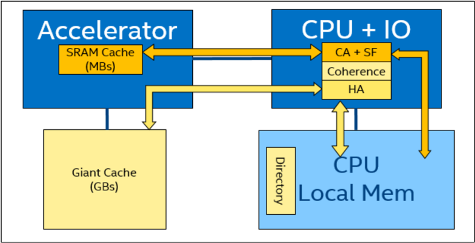

Critical issues with a Giant Cache:

- Cache is too big for tracking in the Host on-die snoop filter
- Snoop latency for a Giant Cache is likely to be much higher than standard on-die cache snoop latency.

CXL recommended solution:

- Implements snoop filter in processor's coherency directory (stored in DRAM ECC bits) which essentially becomes a highly scalable snoop filter
- Minimizes impact to processor operations unrelated to accelerators
- Allows accelerator to access data over CXL.cache as a caching Device.
- Provides support on CXL.cache to allow an accelerator to explicitly request directory snoop filtering for giant cache.
- Processor infrastructure differentiates between low latency and high latency requester types
- Support for simultaneous use of a small, low latency cache, associated with the ondie snoop filter , will come for free.

## Appendix B Protocol Tables for Memory

To formalize the protocol expectations of the Memory Protocol, this appendix captures the allowed request encodings, states, and responses in the host and device. We explicitly separate Type 2 devices (which include CXL.cache protocol) and Type 3 devices which are simple memory expansion.

'Y(1)' in legal column indicates the row in the table is also defined in other tables within the CXL spec and existed in CXL1.1 specification.

This section uses field name abbreviations to fit into the table format captured in [Table 310](#table-310-field-encoding-abbreviations).

### Table 310. Field Encoding Abbreviations

| Field Name   | Encoding Name   | Abbreviation   | Notes                                                                                                 |
|--------------|-----------------|----------------|-------------------------------------------------------------------------------------------------------|
| MetaField    | Meta0-State     | MS0            |                                                                                                       |
| MetaValue    | Not Applicable  | NA             | Used when MetaValue is undefined and should never be consumed which is when MetaField is set to No-Op |
| Bias State   | UnChanged       | UC             | Used to indicate the device should not change bias state.                                             |

### B.1 Type 2 Requests

[Table 311](#table-311-type-2-memory-request) defines Type 2 Device messages on the request channel of CXL.mem protocol. [Table 312](#table-312-type-2-request-forward-sub-table) additionally defines the Forward flows which apply for Type 2 devices accessing device attached memory.

#### Table 311. Type 2 Memory Request

| Legal | Host Request: M2S Req | Host Request: Meta Field | Host Request: Meta Value | Host Request: Snp Type | Device Response: S2M NDR | Device Response: S2M DRS | Device Response: Meta Field | Device Response: Meta Value | Final Device State: Device Cache | Final Device State: Bias State | Description |
|-------|----------------------|--------------------------|--------------------------|------------------------|--------------------------|--------------------------|-----------------------------|-----------------------------|----------------------------------|--------------------------------|-------------|
| Y(1) | MemRd | MS0 | A | SnpInv | Cmp-E | MemData | \<any\> | \<any\> | I | A | The Host wants an exclusive copy of the line |
| N | MemRd | MS0 | A | SnpData | | MemData | | | | | |
| N | MemRd | MS0 | A | SnpCur | | MemData | | | | | |
| N | MemRd | MS0 | A | No-Op | | MemData | | | | | |
| N | MemRd | MS0 | S | SnpInv | | MemData | | | | | |
| Y(1) | MemRd | MS0 | S | SnpData | Cmp-S | MemData | \<any\> | \<any\> | S | S | The Host requesting a shared copy of the line, but Rsp types allow device to return S or E state to host. Cmp-E response is not recommended because device did not request this state. |
| Y(1) | MemRd | MS0 | S | SnpData | Cmp-E | MemData | \<any\> | \<any\> | I | A | The Host requesting a shared copy of the line, but Rsp types allow device to return S or E state to host. Cmp-E response is not recommended because device did not request this state. |
| N | MemRd | MS0 | S | SnpCur | | MemData | | | | | |
| N | MemRd | MS0 | S | No-Op | | MemData | | | | | |
| Y | MemRd | MS0 | I | SnpInv | Cmp | MemData | \<any\> | \<any\> | I | UC | The Host requesting a non-cacheable but current value of the line and forcing device to flush its cache. |
| | MemRd | MS0 | I | SnpData | | MemData | | | | | |
| Y | MemRd | MS0 | I | SnpCur | Cmp | MemData | \<any\> | \<any\> | \<any\> | UC | The Host requesting a non-cacheable but current value of the line leaving data in the device's cache. |
| N | MemRd | MS0 | I | No-Op | | MemData | | | | | |
| Y(1) | MemRd | No-Op | NA | SnpInv | Cmp | MemData | \<any\> | \<any\> | I | UC | The Host wants to read line without changing state expected in the host cache and the device should invalidate the line from its cache. |
| | MemRd | No-Op | NA | SnpData | | MemData | | | | | |
| Y(1) | MemRd | No-Op | NA | SnpCur | Cmp | MemData | \<any\> | \<any\> | \<any\> | UC | The Host wants a current value of the line without changing the state expected in the host cache. |
| Y | MemRd | No-Op | NA | No-Op | Cmp | MemData | \<any\> | \<any\> | \<any\> | UC | Host wants a value of the memory location without snooping the device cache and without changing cache state expected in the host cache. A use case for this would be if the host includes E or S-state without data so it is requesting data only and doesn't want to change cache state and because it has E or S state it can know that the device cache does not need to be snooped. |
| Y(1) | MemInv/MemInvNT | MS0 | A | SnpInv | Cmp-E | \<none\> | \<any\> | \<any\> | I | A | The Host wants ownership of the line without data |
| N | MemInv/MemInvNT | MS0 | A | SnpData | | \<none\> | | | | | |
| N | MemInv/MemInvNT | MS0 | A | SnpCur | | \<none\> | | | | | |
| N | MemInv/MemInvNT | MS0 | A | No-Op | | \<none\> | | | | | |
| N | MemInv/MemInvNT | MS0 | S | SnpInv | | \<none\> | | | | | |
| Y | MemInv/MemInvNT | MS0 | S | SnpData | Cmp-S | \<none\> | \<any\> | \<any\> | S or I | S | The Host wants the device to degrade to S in its caches, wants the shared state for the cacheline (without data). |
| N | MemInv/MemInvNT | MS0 | S | SnpCur | | \<none\> | | | | | |
| N | MemInv/MemInvNT | MS0 | S | No-Op | | \<none\> | | | | | |
| Y(1) | MemInv/MemInvNT | MS0 | I | SnpInv | Cmp | \<none\> | \<any\> | \<any\> | I | I | The Host wants the device to invalidate the line from its caches. |
| N | MemInv/MemInvNT | MS0 | I | SnpData | | \<none\> | | | | | |
| N | MemInv/MemInvNT | MS0 | I | SnpCur | | \<none\> | | | | | |
| N | MemInv/MemInvNT | MS0 | I | No-Op | | \<none\> | | | | | |
| Y | MemInv/MemInvNT | No-Op | NA | SnpInv | Cmp | \<none\> | \<any\> | \<any\> | I | UC | The Host wants the device to invalidate the line from its caches |
| N | MemInv/MemInvNT | No-Op | NA | SnpData | | \<none\> | | | | | |
| N | MemInv/MemInvNT | No-Op | NA | SnpCur | | \<none\> | | | | | |
| N | MemInv/MemInvNT | No-Op | NA | No-Op | | \<none\> | | | | | |
| N | MemInv/MemInvNT | No-Op | NA | SnpInv | | \<none\> | | | | | |
| Y(1) | MemRdData | NA | NA | SnpData | Cmp-E | MemData | MS0 | I or A | I | A | The Host wants a cacheable copy in either exclusive or shared state |
| Y(1) | MemRdData | NA | NA | SnpData | Cmp-S | MemData | MS0 | S | I or S | S | The Host wants a cacheable copy in either exclusive or shared state |
| Y | MemRdData | NA | NA | SnpData | Cmp-E | MemData | No-Op | NA | I | A | The Host wants a cacheable copy in either exclusive or shared state |
| Y | MemRdData | NA | NA | SnpData | Cmp-S | MemData | No-Op | NA | I or S | S | The Host wants a cacheable copy in either exclusive or shared state |
| N | MemRdData | NA | NA | SnpCur | | MemData | | | | | |
| N | MemRdData | NA | NA | No-Op | | MemData | | | | | |
| N | MemSpecRd | MS0 | \<all\> | \<all\> | | | | | | | |
| N | MemSpecRd | No-Op | NA | Snp* | | | | | | | |
| Y | MemSpecRd | No-Op | NA | No-Op | \<none\> | \<none\> | \<none\> | \<none\> | UC | UC | Speculative memory read. Demand read following this with the same address will be merged in the device. No completion is expected for this transaction. Completion is returned with demand read |
| Sub-Table | MemRdFwd |  |  |  |  |  |  |  |  |  | See Table 312 |
| Sub-Table | MemRdFwd |  |  |  |  |  |  |  |  |  | See Table 312 |

#### B.1.1 Forward Flows for Type 2 Devices

[Table 312](#table-312-type-2-request-forward-sub-table) shows the flows that can generate Mem*Fwd messages from CXL.cache requests. These flows are trigger when device issues a D2H Request to an address that is mapped with its own CXL.mem address region. This region referred to as Device-AttachedMemory.

##### Table 312. Type 2 Request Forward Sub-Table

| Legal | Device Request: D2H Req | Host Response on M2S Req: M2S Req | Host Response on M2S Req: Meta Field | Host Response on M2S Req: Meta Value | Host Response on M2S Req: Snp Type | Final Device State: Device Cache | Final Device State: Bias State | Description |
|-------|------------------------|-----------------------------------|--------------------------------------|--------------------------------------|-------------------------------------|----------------------------------|--------------------------------|-------------|
| Y | RdCurr | MemRdFwd | MS0 | A | No-Op | I | A | Host should not change cache state as a result of RdCurr and it would indicate in MemRdFwd the current state of the host. |
| Y | RdCurr | MemRdFwd | MS0 | S | No-Op | I | S | Host should not change cache state as a result of RdCurr and it would indicate in MemRdFwd the current state of the host. |
| Y | RdCurr | MemRdFwd | MS0 | I | No-Op | I | I | Host should not change cache state as a result of RdCurr and it would indicate in MemRdFwd the current state of the host. |
| N | RdCurr | MemRdFwd | MS0 | \<all\> | Snp* | | | |
| N | RdCurr | MemRdFwd | No-Op | NA | \<all\> | | | |
| N | RdShared | MemRdFwd | MS0 | A | No-Op | | | |
| Y | RdShared | MemRdFwd | MS0 | S | No-Op | S | S | Host must be in shared or Invalid only. |
| Y | RdShared | MemRdFwd | MS0 | I | No-Op | S | I | Host must be in shared or Invalid only. |
| N | RdShared | MemRdFwd | MS0 | \<all\> | Snp* | | | |
| N | RdShared | MemRdFwd | No-Op | NA | \<all\> | | | |
| N | RdAny | MemRdFwd | MS0 | A | No-Op | | | |
| Y | RdAny | MemRdFwd | MS0 | S | No-Op | S | S | Host must be in shared or Invalid. |
| Y | RdAny | MemRdFwd | MS0 | I | No-Op | E | I | Host must be in shared or Invalid. |
| N | RdAny | MemRdFwd | MS0 | \<all\> | Snp* | | | |
| N | RdAny | MemRdFwd | No-Op | NA | \<all\> | | | |
| N | RdOwn/RdOwnNoData | MemRdFwd | MS0 | A | No-Op | | | |
| N | RdOwn/RdOwnNoData | MemRdFwd | MS0 | S | No-Op | | | |
| Y | RdOwn/RdOwnNoData | MemRdFwd | MS0 | I | No-Op | E | I | Host must be in Invalid. |
| N | RdOwn/RdOwnNoData | MemRdFwd | MS0 | \<all\> | Snp* | | | |
| N | RdOwn/RdOwnNoData | MemRdFwd | No-Op | NA | \<all\> | | | |
| N | CLFlush | MemRdFwd | MS0 | A | No-Op | | | |
| N | CLFlush | MemRdFwd | MS0 | S | No-Op | | | |
| Y | CLFlush | MemRdFwd | MS0 | I | No-Op | I | S | Host must indicate invalid, but device must assume S-state is possible in host as part of the CLFlush definition. |
| N | CLFlush | MemRdFwd | MS0 | \<all\> | Snp* | | | |
| N | CLFlush | MemRdFwd | No-Op | NA | \<all\> | | | |
| N | WOWrInv/WOWrInvF | MemWrFwd | MS0 | A | No-Op | | | |
| N | WOWrInv/WOWrInvF | MemWrFwd | MS0 | S | No-Op | | | |
| Y | WOWrInv/WOWrInvF | MemWrFwd | MS0 | I | No-Op | NC | I | Host must be in Invalid. |
| N | WOWrInv/WOWrInvF | MemWrFwd | MS0 | \<all\> | Snp* | | | |
| N | WOWrInv/WOWrInvF | MemWrFwd | No-Op | NA | \<all\> | | | |
| N | CleanEvict/DirtyEvict/CleanEvictNoData | | \<all\> | \<all\> | \<all\> | | | Messages are not sent to host for device attached memory |
| N | ItoMWr/MemWr/WrInv/CacheFlushed | | \<all\> | \<all\> | \<all\> | | | Standard CXL.cache flows are used for these requests |

### B.2 Type 3 Requests

Type 3 devices are simple memory expansion. The result is that requests from the host do not need to indicate No-Op type and the can also make arbitrary use of Meta Value field to store 2-bit encodings that device should not interpret. Table 313 captures the flows for these devices.

#### Table 313. Type 3 Memory Request

| Legal | Host Request: M2S Req | Host Request: Meta Field | Host Request: Meta Value | Host Request: Snp Type | Device Response: S2M NDR | Device Response: S2M DRS | Device Response: Meta Field | Device Response: Meta Value | Dev State: Meta State | Description |
|-------|-----------------------|--------------------------|--------------------------|------------------------|--------------------------|--------------------------|-----------------------------|-----------------------------|----------------------|-------------|
| N | \<all\> | \<all\> | \<all\> | Snp* | | | | | | SNo-Op encodings never sent to Type 3 devices |
| Y | MemRd | MS0 | \<any 2-bit value\> | No-Op | \<none\> | MemData | \<any\> | \<any\> | \<Meta Value sent\> | Read that is requesting MetaState updates to new value |
| Y | MemRd | No-Op | NA | No-Op | \<none\> | MemData | \<any\> | \<any\> | UC | Read that does not expect MetaState update. |
| Y | MemInv/MemInvNT | MS0 | \<any 2-bit value\> | No-Op | Cmp | \<none\> | \<any\> | \<any\> | \<Meta Value sent\> | Host wants to read MetaState and update it. |
| Y | MemInv/MemInvNT | No-Op | NA | No-Op | Cmp | \<none\> | \<any\> | \<any\> | UC | Host wants to read MetaState but does not want to update it. |
| N | MemRdData | MS0 | | | | | | | | |
| Y | MemRdData | No-Op | NA | No-Op | \<none\> | MemData | MS0 | I or A | A | Used for implicit directory state updates in Type 3 devices. This is the only case Type 3 devices decode MetaValue. |
| Y | MemRdData | No-Op | NA | No-Op | \<none\> | MemData | MS0 | S | S | Used for implicit directory state updates in Type 3 devices. This is the only case Type 3 devices decode MetaValue. |
| Y | MemRdData | No-Op | NA | No-Op | \<none\> | MemData | No-Op | NA | NA | Used for devices that do not store metavalue or if metavalue is corrupted. |
| N | MemSpecRd | MS0 | \<all\> | \<all\> | | | | | | |
| N | MemSpecRd | No-Op | NA | Snp* | | | | | | |
| Y | MemSpecRd | No-Op | NA | No-Op | \<none\> | \<none\> | \<none\> | \<none\> | UC | Speculative memory read. Demand read following this with the same address will be merged in the device. No completion is expected for this transaction. Completion is returned with demand read |
| N | MemRdFwd | | | | | | | | | Messages not used for Type 3 devices. |
| N | MemWrFwd | | | | | | | | | Messages not used for Type 3 devices. |

### B.3 Type 2 RwD

[Table 314](#table-314-type-2-memory-rwd) captures the Request with Data (RwD) flows for Type 2 devices.

#### Table 314. Type 2 Memory RwD

| Legal | Host Request: M2S RwD | Host Request: Meta Field | Host Request: Meta Value | Host Request: Snp Type | Device Response: S2M NDR | Device Response: S2M DRS | Device Response: Meta Field | Device Response: Meta Value | Dev State: Dev Cache | Dev State: Bias State | Description |
|-------|-----------------------|--------------------------|--------------------------|------------------------|--------------------------|--------------------------|-----------------------------|-----------------------------|---------------------|-----------------------|-------------|
| N | MemWr/MemWrPtl | MS0 | A | Snp* | | \<none\> | | | | | SNo-Op encodings never sent with A-state because host must have exclusive copy. |
| Y(1) | MemWr/MemWrPtl | MS0 | A | No-Op | Cmp | \<none\> | No-Op | NA | I | A | The Host wants to update memory and keep an exclusive copy of the line |
| N | MemWr/MemWrPtl | MS0 | S | Snp* | | \<none\> | | | | | |
| Y | MemWr/MemWrPtl | MS0 | S | No-Op | Cmp | \<none\> | No-Op | NA | I | S | The Host wants to update memory and keep a shared copy of the line |
| Y(1) | MemWr/MemWrPtl | MS0 | I | SnpInv | Cmp | \<none\> | No-Op | NA | I | I | The Host wants to write the line back to memory and does not retain a cacheable copy. In addition, the Host did not get ownership of the line before doing this write and needs the device to invalidate its caches before doing the write back to memory. |
| N | MemWr/MemWrPtl | MS0 | I | SnpData | | \<none\> | | | | | No use case. |
| N | MemWr/MemWrPtl | MS0 | I | SnpCur | | \<none\> | | | | | |
| Y(1) | MemWr/MemWrPtl | MS0 | I | No-Op | Cmp | \<none\> | No-Op | NA | I | I | The host wants to update memory and will end with host caches in I-state. Use is for Dirty (M-state) Cache Evictions in host. |
| N | MemWr/MemWrPtl | MS0 | \<all\> | \<all\> | Cmp | \<none\> | MS0 | \<all\> | \<any\> | \<any\> | Device Never returns MetaState for a write. |
| N | MemWr/MemWrPtl | No-Op | NA | \<all\> | | \<none\> | | | | | Host must always define MetaValue for writes. |


### B.4 Type 3 RwD

Table 315 captures the Request with Data (RwD) flows for Type 3 devices.

#### Table 315. Type 3 Memory RwD

| Legal | Host Request: M2S RwD | Host Request: Meta Field | Host Request: Meta Value | Host Request: Snp Type | Device Response: S2M NDR | Device Response: S2M DRS | Device Response: Meta Field | Device Response: Meta Value | Dev State: Meta State | Description |
|-------|-----------------------|--------------------------|--------------------------|------------------------|--------------------------|--------------------------|-----------------------------|-----------------------------|----------------------|-------------|
| N | MemWr/MemWrPtl | MS0 | \<any 2-bit value\> | Snp* | | \<none\> | | | | SNo-Op encodings never sent to Type 3 devices |
| Y | MemWr/MemWrPtl | MS0 | \<any 2-bit value\> | No-Op | Cmp | \<none\> | No-Op | NA | \<meta Value Sent\> | The Host wants to update memory. Host sets a meta-value. Device optionally stores that value. |
| N | MemWr/MemWrPtl | MS0 | \<any 2-bit value\> | No-Op | Cmp | \<none\> | MS0 | \<any\> | | Host never needs MetaState returned from a write. |
| N | MemWr/MemWrPtl | No-Op | NA | \<all\> | | \<none\> | | | | Host always sends MS0 to avoid need for Read-modify-write in the device for meta-value. |
